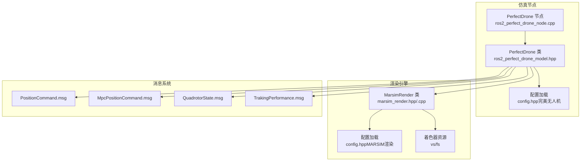
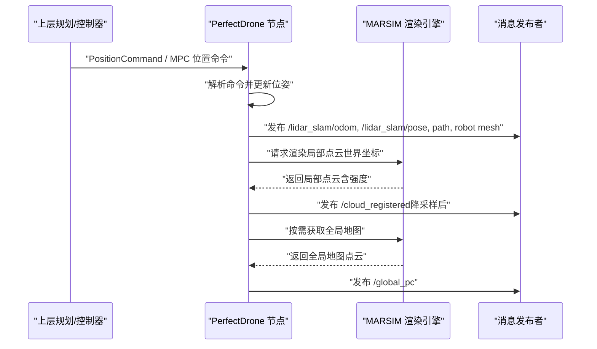
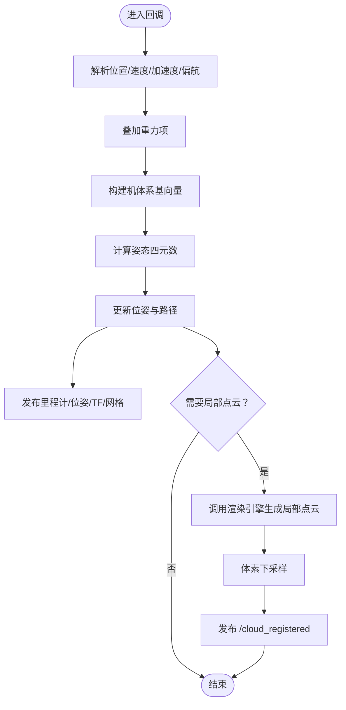
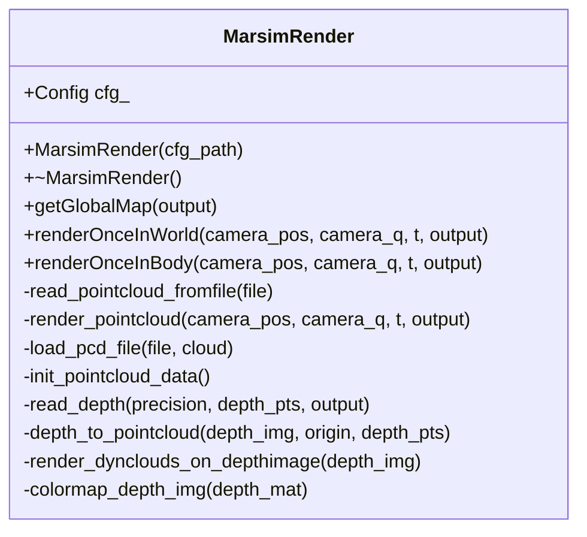
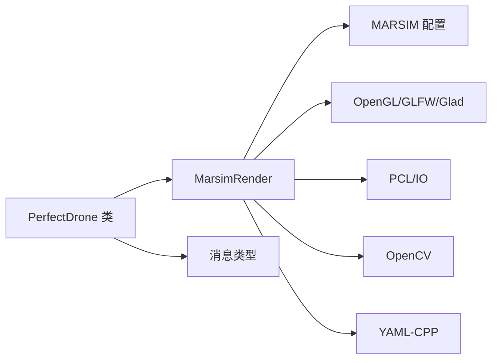

# 仿真系统模块

<cite>
**本文引用的文件**
- [ros2_perfect_drone_node.cpp](file://src/SUPER/mars_uav_sim/perfect_drone_sim/src/ros2_perfect_drone_node.cpp)
- [ros2_perfect_drone_model.hpp](file://src/SUPER/mars_uav_sim/perfect_drone_sim/include/perfect_drone_sim/ros2_perfect_drone_model.hpp)
- [config.hpp（完美无人机）](file://src/SUPER/mars_uav_sim/perfect_drone_sim/include/perfect_drone_sim/config.hpp)
- [dense.yaml（完美无人机配置）](file://src/SUPER/mars_uav_sim/perfect_drone_sim/config/dense.yaml)
- [marsim_render.hpp](file://src/SUPER/mars_uav_sim/marsim_render/include/marsim_render/marsim_render.hpp)
- [marsim_render.cpp](file://src/SUPER/mars_uav_sim/marsim_render/src/marsim_render.cpp)
- [config.hpp（MARSIM渲染）](file://src/SUPER/mars_uav_sim/marsim_render/include/marsim_render/config.hpp)
- [general_360_lidar.yaml（MARSIM渲染配置）](file://src/SUPER/mars_uav_sim/marsim_render/config/general_360_lidar.yaml)
- [PositionCommand.msg](file://src/SUPER/mars_uav_sim/mars_quadrotor_msgs/ros2_msg/PositionCommand.msg)
- [MpcPositionCommand.msg](file://src/SUPER/mars_uav_sim/mars_quadrotor_msgs/ros2_msg/MpcPositionCommand.msg)
- [QuadrotorState.msg](file://src/SUPER/mars_uav_sim/mars_quadrotor_msgs/ros2_msg/QuadrotorState.msg)
- [TrakingPerformance.msg](file://src/SUPER/mars_uav_sim/mars_quadrotor_msgs/ros2_msg/TrakingPerformance.msg)
</cite>

## 目录
1. [引言](#引言)
2. [项目结构](#项目结构)
3. [核心组件](#核心组件)
4. [架构总览](#架构总览)
5. [详细组件分析](#详细组件分析)
6. [依赖关系分析](#依赖关系分析)
7. [性能考量](#性能考量)
8. [故障排查指南](#故障排查指南)
9. [结论](#结论)
10. [附录](#附录)

## 引言
本文件面向仿真系统模块，围绕“完美无人机仿真模型”“MARSIM渲染引擎”“自定义消息系统”“配置与使用”“与真实硬件差异”“结果分析与可视化”等方面进行系统化说明。目标是帮助读者快速理解并高效使用该仿真栈，覆盖从建模到渲染、从消息通信到参数调优的全链路流程。

## 项目结构
该模块位于 SUPER 工作空间中，主要由三部分组成：
- 完美无人机仿真节点与模型：负责接收位置/速度/加速度指令，计算姿态并发布里程计、点云、路径等消息。
- MARSIM 渲染引擎：基于 OpenGL 的离屏渲染，将 PCD 地图映射为激光雷达式点云，支持多种扫描模式。
- 自定义消息系统：定义了位置命令、MPC 位置命令、无人机状态、跟踪性能等消息类型，用于与上层规划/控制模块交互。

图表来源
- [ros2_perfect_drone_node.cpp](file://src/SUPER/mars_uav_sim/perfect_drone_sim/src/ros2_perfect_drone_node.cpp#L1-L11)
- [ros2_perfect_drone_model.hpp](file://src/SUPER/mars_uav_sim/perfect_drone_sim/include/perfect_drone_sim/ros2_perfect_drone_model.hpp#L1-L302)
- [marsim_render.hpp](file://src/SUPER/mars_uav_sim/marsim_render/include/marsim_render/marsim_render.hpp#L1-L215)
- [config.hpp（完美无人机）](file://src/SUPER/mars_uav_sim/perfect_drone_sim/include/perfect_drone_sim/config.hpp#L1-L43)
- [config.hpp（MARSIM渲染）](file://src/SUPER/mars_uav_sim/marsim_render/include/marsim_render/config.hpp#L1-L105)

章节来源
- [ros2_perfect_drone_node.cpp](file://src/SUPER/mars_uav_sim/perfect_drone_sim/src/ros2_perfect_drone_node.cpp#L1-L11)
- [ros2_perfect_drone_model.hpp](file://src/SUPER/mars_uav_sim/perfect_drone_sim/include/perfect_drone_sim/ros2_perfect_drone_model.hpp#L1-L302)
- [marsim_render.hpp](file://src/SUPER/mars_uav_sim/marsim_render/include/marsim_render/marsim_render.hpp#L1-L215)
- [config.hpp（完美无人机）](file://src/SUPER/mars_uav_sim/perfect_drone_sim/include/perfect_drone_sim/config.hpp#L1-L43)
- [config.hpp（MARSIM渲染）](file://src/SUPER/mars_uav_sim/marsim_render/include/marsim_render/config.hpp#L1-L105)

## 核心组件
- 完美无人机仿真节点与模型
  - 负责订阅上层规划输出的位置命令，通过理想化动力学更新位姿，发布里程计、位姿、路径、点云等消息。
  - 支持多回调组与定时器，确保高频传感器数据与低频状态发布的解耦。
- MARSIM 渲染引擎
  - 基于 OpenGL 的离屏渲染，将 PCD 地图转换为符合不同激光雷达扫描模式的点云，支持 AVIA、GENERAL_360、MID_360 等模式。
  - 提供全局地图与局部地图发布接口，支持体坐标系与世界坐标系下的点云转换。
- 自定义消息系统
  - 定义位置命令、MPC 位置命令、无人机状态、跟踪性能等消息，统一上层规划/控制与仿真之间的数据契约。

章节来源
- [ros2_perfect_drone_model.hpp](file://src/SUPER/mars_uav_sim/perfect_drone_sim/include/perfect_drone_sim/ros2_perfect_drone_model.hpp#L1-L302)
- [marsim_render.hpp](file://src/SUPER/mars_uav_sim/marsim_render/include/marsim_render/marsim_render.hpp#L1-L215)
- [PositionCommand.msg](file://src/SUPER/mars_uav_sim/mars_quadrotor_msgs/ros2_msg/PositionCommand.msg)
- [MpcPositionCommand.msg](file://src/SUPER/mars_uav_sim/mars_quadrotor_msgs/ros2_msg/MpcPositionCommand.msg)
- [QuadrotorState.msg](file://src/SUPER/mars_uav_sim/mars_quadrotor_msgs/ros2_msg/QuadrotorState.msg)
- [TrakingPerformance.msg](file://src/SUPER/mars_uav_sim/mars_quadrotor_msgs/ros2_msg/TrakingPerformance.msg)

## 架构总览
下图展示了从上层规划到仿真渲染再到下游消费的端到端流程。

图表来源
- [ros2_perfect_drone_model.hpp](file://src/SUPER/mars_uav_sim/perfect_drone_sim/include/perfect_drone_sim/ros2_perfect_drone_model.hpp#L155-L280)
- [marsim_render.cpp](file://src/SUPER/mars_uav_sim/marsim_render/src/marsim_render.cpp#L171-L399)

## 详细组件分析

### 完美无人机仿真模型
- 功能要点
  - 接收位置命令（位置/速度/加速度/偏航），通过理想化动力学推导姿态四元数。
  - 发布里程计、位姿、路径、机器人网格资源标记、TF 变换。
  - 按配置频率发布局部点云与全局点云；局部点云采用体坐标系转换并进行体素下采样。
- 关键流程
  - 命令回调解析三维位置、速度、加速度与偏航，计算重力方向与机体系基向量，得到旋转矩阵与四元数。
  - 定时器周期性发布状态与点云；根据订阅者数量动态决定是否发布全局地图。
- 数据结构与复杂度
  - 使用 Eigen 进行向量/矩阵运算，时间复杂度主要受点云规模与渲染管线影响。
  - 下采样策略降低传输与处理开销，复杂度近似线性于点云规模。

图表来源
- [ros2_perfect_drone_model.hpp](file://src/SUPER/mars_uav_sim/perfect_drone_sim/include/perfect_drone_sim/ros2_perfect_drone_model.hpp#L185-L297)
- [marsim_render.cpp](file://src/SUPER/mars_uav_sim/marsim_render/src/marsim_render.cpp#L171-L399)

章节来源
- [ros2_perfect_drone_model.hpp](file://src/SUPER/mars_uav_sim/perfect_drone_sim/include/perfect_drone_sim/ros2_perfect_drone_model.hpp#L1-L302)
- [config.hpp（完美无人机）](file://src/SUPER/mars_uav_sim/perfect_drone_sim/include/perfect_drone_sim/config.hpp#L1-L43)
- [dense.yaml（完美无人机配置）](file://src/SUPER/mars_uav_sim/perfect_drone_sim/config/dense.yaml#L1-L30)

### MARSIM 渲染引擎
- 功能要点
  - 加载 PCD 地图，初始化 OpenGL 上下文与着色器，建立顶点缓冲与索引缓冲。
  - 根据相机位姿与时间戳生成扫描图案（AVIA/GENERAL_360/MID_360），将深度缓冲与强度缓冲组合为点云。
  - 支持体坐标系与世界坐标系下的点云转换，提供全局地图与局部地图接口。
- 渲染管线
  - 生成扫描图案矩阵 → 设置投影/视图矩阵 → 绘制点云 → 读取深度与强度缓冲 → 将像素映射回三维点云。
  - 可选显示深度图像与扫描图案，便于调试。
- 性能特性
  - 通过帧率统计输出运行时 FPS，便于评估渲染性能。
  - 支持可配置的极坐标分辨率、视场角、盲区与观测范围。

图表来源
- [marsim_render.hpp](file://src/SUPER/mars_uav_sim/marsim_render/include/marsim_render/marsim_render.hpp#L90-L214)
- [marsim_render.cpp](file://src/SUPER/mars_uav_sim/marsim_render/src/marsim_render.cpp#L1-L690)

章节来源
- [marsim_render.hpp](file://src/SUPER/mars_uav_sim/marsim_render/include/marsim_render/marsim_render.hpp#L1-L215)
- [marsim_render.cpp](file://src/SUPER/mars_uav_sim/marsim_render/src/marsim_render.cpp#L1-L690)
- [config.hpp（MARSIM渲染）](file://src/SUPER/mars_uav_sim/marsim_render/include/marsim_render/config.hpp#L1-L105)
- [general_360_lidar.yaml（MARSIM渲染配置）](file://src/SUPER/mars_uav_sim/marsim_render/config/general_360_lidar.yaml#L1-L16)

### 自定义消息系统
- 消息类型
  - 位置命令：包含期望位置、速度、加速度与偏航，用于驱动无人机跟踪。
  - MPC 位置命令：面向模型预测控制的高阶轨迹或参考输入。
  - 无人机状态：记录当前位姿、速度、角速度等状态信息。
  - 跟踪性能：记录跟踪误差、控制指标等性能指标。
- 使用建议
  - 规划/控制模块以 PositionCommand 作为标准输入；若使用 MPC，则使用 MpcPositionCommand。
  - 仿真节点将状态封装为 QuadrotorState 并发布，供上层模块消费。

章节来源
- [PositionCommand.msg](file://src/SUPER/mars_uav_sim/mars_quadrotor_msgs/ros2_msg/PositionCommand.msg)
- [MpcPositionCommand.msg](file://src/SUPER/mars_uav_sim/mars_quadrotor_msgs/ros2_msg/MpcPositionCommand.msg)
- [QuadrotorState.msg](file://src/SUPER/mars_uav_sim/mars_quadrotor_msgs/ros2_msg/QuadrotorState.msg)
- [TrakingPerformance.msg](file://src/SUPER/mars_uav_sim/mars_quadrotor_msgs/ros2_msg/TrakingPerformance.msg)

## 依赖关系分析
- 节点与渲染引擎
  - PerfectDrone 节点持有 MarsimRender 指针，按需调用渲染接口生成点云。
- 渲染引擎内部
  - 依赖 OpenGL/GLFW/Glad、GLM、OpenCV、PCL、YAML 等第三方库。
  - 通过配置类加载渲染参数，如视场角、分辨率、扫描类型等。
- 消息系统
  - 与上层规划/控制模块通过 ROS2 Topic 交互，消息定义在独立包中。

图表来源
- [ros2_perfect_drone_model.hpp](file://src/SUPER/mars_uav_sim/perfect_drone_sim/include/perfect_drone_sim/ros2_perfect_drone_model.hpp#L34-L35)
- [marsim_render.hpp](file://src/SUPER/mars_uav_sim/marsim_render/include/marsim_render/marsim_render.hpp#L25-L71)
- [config.hpp（MARSIM渲染）](file://src/SUPER/mars_uav_sim/marsim_render/include/marsim_render/config.hpp#L1-L105)

章节来源
- [ros2_perfect_drone_model.hpp](file://src/SUPER/mars_uav_sim/perfect_drone_sim/include/perfect_drone_sim/ros2_perfect_drone_model.hpp#L1-L302)
- [marsim_render.hpp](file://src/SUPER/mars_uav_sim/marsim_render/include/marsim_render/marsim_render.hpp#L1-L215)

## 性能考量
- 渲染性能
  - 通过帧率统计输出运行时 FPS，便于评估整体性能瓶颈。
  - 可调整极坐标分辨率、视场角、下采样粒度等参数平衡精度与性能。
- 通信与发布频率
  - 通过多回调组与定时器分离高频传感器发布与低频状态发布，避免阻塞。
  - 局部点云发布周期由配置中的感知频率决定，建议结合实际硬件带宽进行调优。
- 点云处理
  - 体素下采样显著降低点云规模，建议根据场景密度与下游算法需求调整 leaf size。

章节来源
- [marsim_render.cpp](file://src/SUPER/mars_uav_sim/marsim_render/src/marsim_render.cpp#L390-L398)
- [ros2_perfect_drone_model.hpp](file://src/SUPER/mars_uav_sim/perfect_drone_sim/include/perfect_drone_sim/ros2_perfect_drone_model.hpp#L139-L145)
- [config.hpp（MARSIM渲染）](file://src/SUPER/mars_uav_sim/marsim_render/include/marsim_render/config.hpp#L64-L73)

## 故障排查指南
- 渲染窗口初始化失败
  - 检查 OpenGL/GLFW 初始化日志与错误码；确认显卡驱动与权限。
- 点云为空
  - 确认 PCD 文件路径正确且存在；检查相机位姿与视场角是否覆盖地图区域。
- 无全局地图发布
  - 检查订阅者数量判断逻辑与时间阈值；确认渲染引擎已加载全局地图。
- 性能过低
  - 降低极坐标分辨率、视场角或下采样粒度；关闭深度图像显示以减少额外开销。
- 消息未到达
  - 检查话题名称与 QoS 设置；确认上层模块订阅正确。

章节来源
- [marsim_render.cpp](file://src/SUPER/mars_uav_sim/marsim_render/src/marsim_render.cpp#L16-L109)
- [ros2_perfect_drone_model.hpp](file://src/SUPER/mars_uav_sim/perfect_drone_sim/include/perfect_drone_sim/ros2_perfect_drone_model.hpp#L155-L210)

## 结论
该仿真系统通过“完美无人机模型 + MARSIM 渲染引擎 + 自定义消息系统”的组合，实现了从上层规划到底层感知的闭环仿真。其核心优势在于：
- 理想化动力学与高保真渲染相结合，便于验证控制与感知算法。
- 参数化配置与模块化设计，便于扩展与调优。
- 丰富的消息契约与可视化输出，便于结果分析与系统集成。

## 附录

### 配置方法与参数说明
- 完美无人机配置（示例）
  - 地图文件名、初始位姿、初始偏航、感知频率、网格资源等。
- MARSIM 渲染配置（示例）
  - 是否 360 激光、极坐标分辨率、下采样粒度、视场角、盲区/观测范围、扫描类型、深度图像开关等。

章节来源
- [config.hpp（完美无人机）](file://src/SUPER/mars_uav_sim/perfect_drone_sim/include/perfect_drone_sim/config.hpp#L29-L38)
- [dense.yaml（完美无人机配置）](file://src/SUPER/mars_uav_sim/perfect_drone_sim/config/dense.yaml#L1-L30)
- [config.hpp（MARSIM渲染）](file://src/SUPER/mars_uav_sim/marsim_render/include/marsim_render/config.hpp#L50-L74)
- [general_360_lidar.yaml（MARSIM渲染配置）](file://src/SUPER/mars_uav_sim/marsim_render/config/general_360_lidar.yaml#L1-L16)

### 仿真环境使用指南
- 准备 .pcd 地图
  - 将 PCD 文件放置于渲染引擎可访问目录，并在配置中指定文件名。
- 启动仿真
  - 启动完美无人机节点，确保消息通道与 RViz/可视化工具连通。
- 场景加载与性能调优
  - 通过配置文件调整视场角、分辨率、下采样粒度与扫描类型，平衡精度与性能。

章节来源
- [general_360_lidar.yaml（MARSIM渲染配置）](file://src/SUPER/mars_uav_sim/marsim_render/config/general_360_lidar.yaml#L1-L16)
- [dense.yaml（完美无人机配置）](file://src/SUPER/mars_uav_sim/perfect_drone_sim/config/dense.yaml#L1-L30)

### 与真实硬件的差异与注意事项
- 理想化假设
  - 无人机模型采用理想化动力学，不考虑气动扰动、传感器噪声与延迟。
- 渲染一致性
  - 渲染引擎模拟激光雷达扫描模式，但与真实传感器的硬件特性（如扫描速率、噪声模型）存在差异。
- 实验建议
  - 在仿真中验证算法稳健性后，逐步引入噪声与延迟，再进行硬件在环测试。

### 仿真结果分析与可视化工具
- 可视化
  - 使用 RViz 订阅 /lidar_slam/odom、/lidar_slam/pose、path、robot 网格等主题进行可视化。
- 性能监控
  - 关注渲染引擎输出的运行时 FPS 与点云规模，评估系统负载。
- 结果导出
  - 可将轨迹、点云与性能指标保存至文件，配合外部脚本进行统计分析。