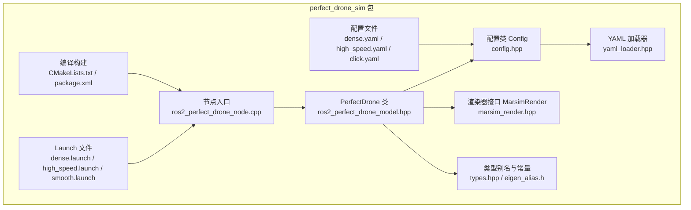
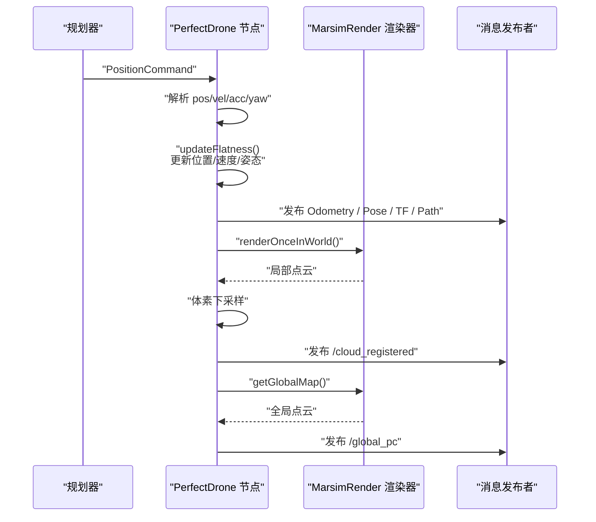
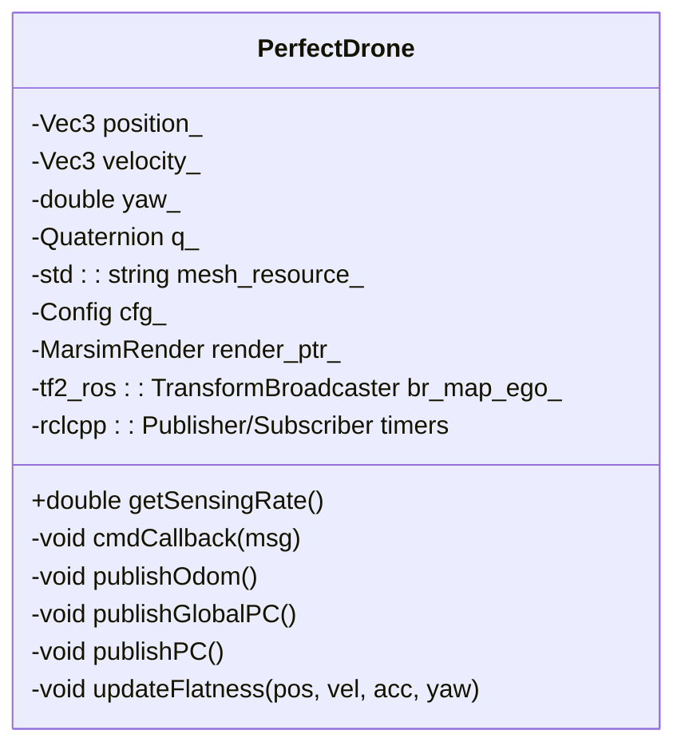
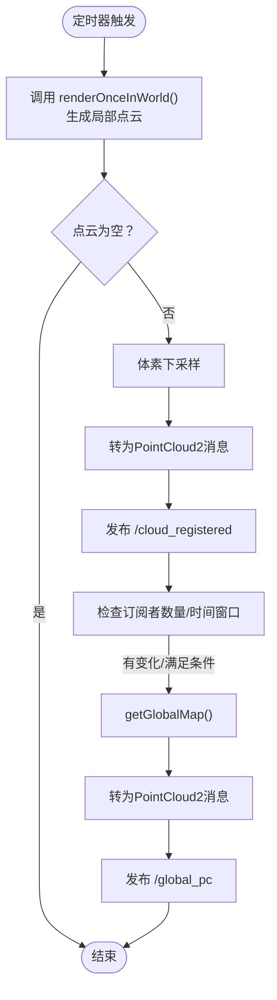
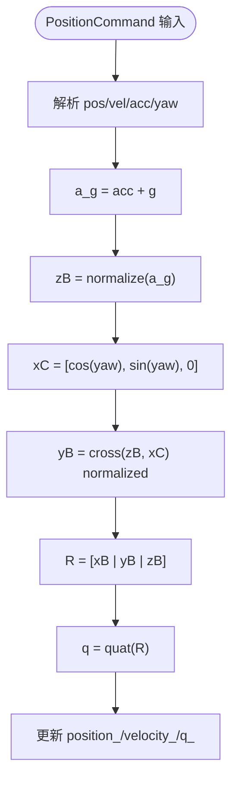
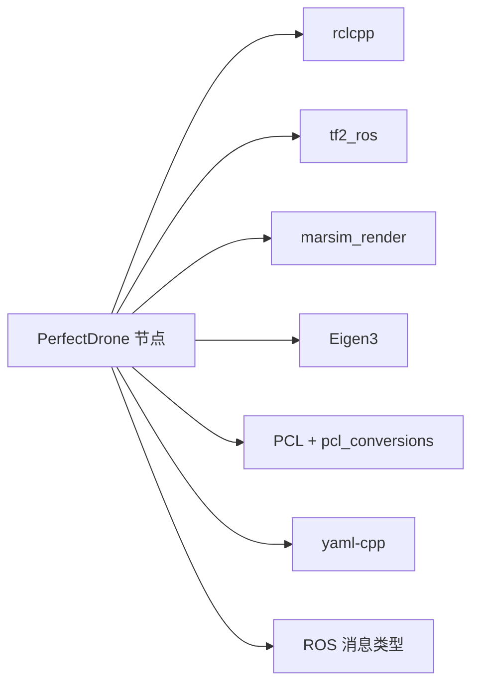

# 完美无人机仿真

<cite>
**本文引用的文件**   
- [ros2_perfect_drone_node.cpp](file://src/SUPER/mars_uav_sim/perfect_drone_sim/src/ros2_perfect_drone_node.cpp)
- [ros2_perfect_drone_model.hpp](file://src/SUPER/mars_uav_sim/perfect_drone_sim/include/perfect_drone_sim/ros2_perfect_drone_model.hpp)
- [config.hpp](file://src/SUPER/mars_uav_sim/perfect_drone_sim/include/perfect_drone_sim/config.hpp)
- [yaml_loader.hpp](file://src/SUPER/mars_uav_sim/perfect_drone_sim/include/utils/yaml_loader.hpp)
- [types.hpp](file://src/SUPER/mars_uav_sim/perfect_drone_sim/include/utils/types.hpp)
- [eigen_alias.h](file://src/SUPER/mars_uav_sim/perfect_drone_sim/include/utils/eigen_alias.h)
- [marsim_render.hpp](file://src/SUPER/mars_uav_sim/marsim_render/include/marsim_render/marsim_render.hpp)
- [dense.yaml](file://src/SUPER/mars_uav_sim/perfect_drone_sim/config/dense.yaml)
- [high_speed.yaml](file://src/SUPER/mars_uav_sim/perfect_drone_sim/config/high_speed.yaml)
- [click.yaml](file://src/SUPER/mars_uav_sim/perfect_drone_sim/config/click.yaml)
- [dense.launch](file://src/SUPER/mars_uav_sim/perfect_drone_sim/launch/dense.launch)
- [high_speed.launch](file://src/SUPER/mars_uav_sim/perfect_drone_sim/launch/high_speed.launch)
- [smooth.launch](file://src/SUPER/mars_uav_sim/perfect_drone_sim/launch/smooth.launch)
- [package.xml](file://src/SUPER/mars_uav_sim/perfect_drone_sim/package.xml)
- [CMakeLists.txt](file://src/SUPER/mars_uav_sim/perfect_drone_sim/CMakeLists.txt)
</cite>

## 目录
1. [简介](#简介)
2. [项目结构](#项目结构)
3. [核心组件](#核心组件)
4. [架构总览](#架构总览)
5. [详细组件分析](#详细组件分析)
6. [依赖关系分析](#依赖关系分析)
7. [性能考量](#性能考量)
8. [故障排查指南](#故障排查指南)
9. [结论](#结论)
10. [附录](#附录)

## 简介
本文件为“完美无人机仿真”系统的详细技术文档，聚焦于PerfectDrone类的实现与仿真节点架构，涵盖以下主题：
- 无人机动力学建模与状态更新机制（基于位置、速度、加速度与偏航角推导姿态与四元数）
- 仿真节点的ROS2初始化、参数配置与回调函数管理
- 无人机状态表示方法（位置、速度、欧拉角与四元数）
- 传感器模拟功能（激光雷达点云生成、全局地图发布、局部点云下采样与发布）
- 仿真系统配置项（初始位置、感知频率、网格资源等）
- 使用指南（启动参数、场景加载、性能调优）
- 结果分析与可视化工具使用技巧

## 项目结构
该模块位于SUPER工程中，核心代码集中在perfect_drone_sim包内，包含节点入口、PerfectDrone类、配置加载器、以及对marsim_render渲染器的封装调用。

图表来源
- [ros2_perfect_drone_node.cpp](file://src/SUPER/mars_uav_sim/perfect_drone_sim/src/ros2_perfect_drone_node.cpp#L1-L11)
- [ros2_perfect_drone_model.hpp](file://src/SUPER/mars_uav_sim/perfect_drone_sim/include/perfect_drone_sim/ros2_perfect_drone_model.hpp#L1-L302)
- [config.hpp](file://src/SUPER/mars_uav_sim/perfect_drone_sim/include/perfect_drone_sim/config.hpp#L1-L43)
- [yaml_loader.hpp](file://src/SUPER/mars_uav_sim/perfect_drone_sim/include/utils/yaml_loader.hpp#L1-L154)
- [marsim_render.hpp](file://src/SUPER/mars_uav_sim/marsim_render/include/marsim_render/marsim_render.hpp#L1-L215)
- [dense.yaml](file://src/SUPER/mars_uav_sim/perfect_drone_sim/config/dense.yaml#L1-L30)
- [high_speed.yaml](file://src/SUPER/mars_uav_sim/perfect_drone_sim/config/high_speed.yaml#L1-L30)
- [click.yaml](file://src/SUPER/mars_uav_sim/perfect_drone_sim/config/click.yaml#L1-L30)
- [dense.launch](file://src/SUPER/mars_uav_sim/perfect_drone_sim/launch/dense.launch#L1-L21)
- [high_speed.launch](file://src/SUPER/mars_uav_sim/perfect_drone_sim/launch/high_speed.launch#L1-L21)
- [smooth.launch](file://src/SUPER/mars_uav_sim/perfect_drone_sim/launch/smooth.launch#L1-L21)
- [CMakeLists.txt](file://src/SUPER/mars_uav_sim/perfect_drone_sim/CMakeLists.txt#L1-L119)
- [package.xml](file://src/SUPER/mars_uav_sim/perfect_drone_sim/package.xml#L1-L20)

章节来源
- [CMakeLists.txt](file://src/SUPER/mars_uav_sim/perfect_drone_sim/CMakeLists.txt#L1-L119)
- [package.xml](file://src/SUPER/mars_uav_sim/perfect_drone_sim/package.xml#L1-L20)

## 核心组件
- 节点入口：创建ROS2节点实例并进入自旋循环，负责生命周期管理与事件驱动。
- PerfectDrone类：继承自rclcpp::Node，封装状态、传感器模拟与消息发布；通过回调接收规划器下发的位置/速度/加速度指令，计算姿态并发布里程计、位姿、路径、点云与TF。
- 配置系统：Config类读取YAML参数，支持mesh资源、初始位置、初始偏航、感知频率等。
- 渲染器接口：MarsimRender封装了点云地图读取、360度激光雷达模拟、体素下采样与点云输出。
- 类型与数学：types.hpp与eigen_alias.h提供统一的标量类型、向量矩阵与四元数别名，确保数值一致性。

章节来源
- [ros2_perfect_drone_node.cpp](file://src/SUPER/mars_uav_sim/perfect_drone_sim/src/ros2_perfect_drone_node.cpp#L1-L11)
- [ros2_perfect_drone_model.hpp](file://src/SUPER/mars_uav_sim/perfect_drone_sim/include/perfect_drone_sim/ros2_perfect_drone_model.hpp#L1-L302)
- [config.hpp](file://src/SUPER/mars_uav_sim/perfect_drone_sim/include/perfect_drone_sim/config.hpp#L1-L43)
- [yaml_loader.hpp](file://src/SUPER/mars_uav_sim/perfect_drone_sim/include/utils/yaml_loader.hpp#L1-L154)
- [marsim_render.hpp](file://src/SUPER/mars_uav_sim/marsim_render/include/marsim_render/marsim_render.hpp#L1-L215)
- [types.hpp](file://src/SUPER/mars_uav_sim/perfect_drone_sim/include/utils/types.hpp#L1-L69)
- [eigen_alias.h](file://src/SUPER/mars_uav_sim/perfect_drone_sim/include/utils/eigen_alias.h#L1-L122)

## 架构总览
PerfectDrone节点采用“订阅-计算-发布”的实时闭环架构：
- 订阅来自规划器的PositionCommand消息，解析位置、速度、加速度与偏航。
- 基于物理模型（重力+加速度）推导姿态四元数，更新位置与速度。
- 定时发布里程计、位姿、路径、TF与点云；全局点云按需发布，局部点云周期性发布并下采样。

图表来源
- [ros2_perfect_drone_model.hpp](file://src/SUPER/mars_uav_sim/perfect_drone_sim/include/perfect_drone_sim/ros2_perfect_drone_model.hpp#L155-L280)
- [marsim_render.hpp](file://src/SUPER/mars_uav_sim/marsim_render/include/marsim_render/marsim_render.hpp#L138-L165)

## 详细组件分析

### PerfectDrone类
PerfectDrone是系统的核心类，负责：
- 参数加载与初始化：从YAML读取配置，声明参数，创建渲染器实例与TF广播器。
- 订阅与回调：订阅PositionCommand，解析期望状态并调用updateFlatness进行状态更新。
- 定时发布：分别以不同周期发布里程计、位姿、路径、TF与点云。
- 状态表示：内部维护位置、速度、偏航角与四元数，并转换为ROS消息与TF。

图表来源
- [ros2_perfect_drone_model.hpp](file://src/SUPER/mars_uav_sim/perfect_drone_sim/include/perfect_drone_sim/ros2_perfect_drone_model.hpp#L30-L298)

章节来源
- [ros2_perfect_drone_model.hpp](file://src/SUPER/mars_uav_sim/perfect_drone_sim/include/perfect_drone_sim/ros2_perfect_drone_model.hpp#L60-L148)
- [ros2_perfect_drone_model.hpp](file://src/SUPER/mars_uav_sim/perfect_drone_sim/include/perfect_drone_sim/ros2_perfect_drone_model.hpp#L155-L280)

### 传感器模拟流程（激光雷达点云）
- 局部点云生成：在每次定时器触发时，调用渲染器的renderOnceInWorld，传入当前世界坐标系下的相机位姿与时间戳，得到局部点云；随后进行体素下采样，再转为PointCloud2消息发布。
- 全局点云发布：当存在订阅者或满足特定条件时，调用getGlobalMap获取全局地图并发布。
- 下采样策略：使用体素网格滤波降低数据量，提升实时性与带宽利用率。

图表来源
- [ros2_perfect_drone_model.hpp](file://src/SUPER/mars_uav_sim/perfect_drone_sim/include/perfect_drone_sim/ros2_perfect_drone_model.hpp#L155-L210)
- [marsim_render.hpp](file://src/SUPER/mars_uav_sim/marsim_render/include/marsim_render/marsim_render.hpp#L138-L165)

章节来源
- [ros2_perfect_drone_model.hpp](file://src/SUPER/mars_uav_sim/perfect_drone_sim/include/perfect_drone_sim/ros2_perfect_drone_model.hpp#L155-L210)

### 动力学建模与状态更新
- 输入：PositionCommand中的期望位置、速度、加速度与偏航。
- 更新规则：将期望加速度与重力合成，归一化得到z轴方向，结合期望x轴方向（由偏航确定）计算姿态矩阵，再转换为四元数；同时直接更新位置与速度。
- 优点：避免复杂的积分过程，直接跟踪期望轨迹，适合仿真验证与离线评估。

图表来源
- [ros2_perfect_drone_model.hpp](file://src/SUPER/mars_uav_sim/perfect_drone_sim/include/perfect_drone_sim/ros2_perfect_drone_model.hpp#L282-L297)

章节来源
- [ros2_perfect_drone_model.hpp](file://src/SUPER/mars_uav_sim/perfect_drone_sim/include/perfect_drone_sim/ros2_perfect_drone_model.hpp#L282-L297)

### 配置系统与参数
- Config类从YAML加载参数，包括mesh资源路径、初始位置xyz、初始偏航、感知频率等。
- YamlLoader提供通用的参数读取与类型校验能力，支持嵌套路径访问与默认值回退。
- 支持多套场景配置（dense、high_speed、click），分别对应不同的地图与感知参数。

章节来源
- [config.hpp](file://src/SUPER/mars_uav_sim/perfect_drone_sim/include/perfect_drone_sim/config.hpp#L20-L39)
- [yaml_loader.hpp](file://src/SUPER/mars_uav_sim/perfect_drone_sim/include/utils/yaml_loader.hpp#L25-L149)
- [dense.yaml](file://src/SUPER/mars_uav_sim/perfect_drone_sim/config/dense.yaml#L1-L30)
- [high_speed.yaml](file://src/SUPER/mars_uav_sim/perfect_drone_sim/config/high_speed.yaml#L1-L30)
- [click.yaml](file://src/SUPER/mars_uav_sim/perfect_drone_sim/config/click.yaml#L1-L30)

### 节点初始化与回调管理
- 节点名称与QoS：节点名为perfect_tracking，发布端使用可靠QoS以适配RViz显示。
- 参数声明：config_name用于选择配置文件（如dense.yaml）。
- 回调分组：将不同任务（订阅、定时器、发布）分配到互斥回调组，避免竞争。
- 订阅与发布：订阅/pos_cmd，发布odom、pose、path、robot mesh marker、local/global pointcloud与tf。

章节来源
- [ros2_perfect_drone_model.hpp](file://src/SUPER/mars_uav_sim/perfect_drone_sim/include/perfect_drone_sim/ros2_perfect_drone_model.hpp#L60-L148)

### 渲染器接口（MarsimRender）
- 地图加载：从文件读取点云并着色，作为全局地图。
- 局部点云：根据相机位姿与时间戳渲染局部视场内的点云。
- 坐标系：提供世界坐标系与机体系的转换能力，便于生成局部点云。
- 性能：支持体素下采样与按需发布，平衡精度与带宽。

章节来源
- [marsim_render.hpp](file://src/SUPER/mars_uav_sim/marsim_render/include/marsim_render/marsim_render.hpp#L90-L215)

## 依赖关系分析
- PerfectDrone依赖：
  - rclcpp：ROS2节点框架
  - tf2_ros：TF广播
  - marsim_render：点云渲染与360激光雷达模拟
  - Eigen：数值计算
  - PCL与pcl_conversions：点云处理与消息转换
  - YAML-CPP：配置文件解析
- 编译依赖：CMakeLists中显式声明各依赖库与头文件目录，安装目标包含可执行文件、launch、rviz配置与mesh资源。

图表来源
- [CMakeLists.txt](file://src/SUPER/mars_uav_sim/perfect_drone_sim/CMakeLists.txt#L24-L70)
- [package.xml](file://src/SUPER/mars_uav_sim/perfect_drone_sim/package.xml#L8-L15)

章节来源
- [CMakeLists.txt](file://src/SUPER/mars_uav_sim/perfect_drone_sim/CMakeLists.txt#L24-L70)
- [package.xml](file://src/SUPER/mars_uav_sim/perfect_drone_sim/package.xml#L1-L20)

## 性能考量
- 感知频率：由配置中的sensing_rate决定，计算发布周期（毫秒级定时器）。
- 局部点云下采样：使用体素网格滤波降低点云密度，减少CPU与网络负载。
- 全局点云按需发布：仅在订阅者数量变化或特定时间窗口内发布，避免冗余传输。
- 回调分组：将不同任务放入互斥回调组，避免长时间处理阻塞其他回调。
- 渲染开销：360激光雷达模拟与点云渲染为GPU/CPU双重压力源，建议在高分辨率场景中适当降低sensing_rate或增大下采样粒度。

章节来源
- [ros2_perfect_drone_model.hpp](file://src/SUPER/mars_uav_sim/perfect_drone_sim/include/perfect_drone_sim/ros2_perfect_drone_model.hpp#L139-L145)
- [ros2_perfect_drone_model.hpp](file://src/SUPER/mars_uav_sim/perfect_drone_sim/include/perfect_drone_sim/ros2_perfect_drone_model.hpp#L165-L170)
- [dense.yaml](file://src/SUPER/mars_uav_sim/perfect_drone_sim/config/dense.yaml#L17-L17)
- [high_speed.yaml](file://src/SUPER/mars_uav_sim/perfect_drone_sim/config/high_speed.yaml#L17-L17)
- [click.yaml](file://src/SUPER/mars_uav_sim/perfect_drone_sim/config/click.yaml#L17-L17)

## 故障排查指南
- 启动失败或找不到配置
  - 检查config_name参数是否正确指向config目录下的YAML文件。
  - 确认YAML路径与参数键名一致，必要时启用默认值回退。
- 点云不显示或稀疏
  - 检查sensing_rate与下采样粒度设置；提高sensing_rate或减小leaf_size可增加点云密度。
  - 确认订阅者数量变化触发了全局点云发布逻辑。
- 仿真卡顿或CPU占用过高
  - 降低sensing_rate或增大体素下采样尺寸。
  - 在高分辨率地图场景中考虑减少渲染区域或关闭深度图像等额外功能。
- TF或位姿异常
  - 检查updateFlatness中姿态计算流程与四元数归一化。
  - 确认发布频率与RViz刷新频率匹配。

章节来源
- [yaml_loader.hpp](file://src/SUPER/mars_uav_sim/perfect_drone_sim/include/utils/yaml_loader.hpp#L47-L105)
- [ros2_perfect_drone_model.hpp](file://src/SUPER/mars_uav_sim/perfect_drone_sim/include/perfect_drone_sim/ros2_perfect_drone_model.hpp#L155-L210)
- [ros2_perfect_drone_model.hpp](file://src/SUPER/mars_uav_sim/perfect_drone_sim/include/perfect_drone_sim/ros2_perfect_drone_model.hpp#L282-L297)

## 结论
PerfectDrone仿真系统通过简洁的动力学模型与高效的渲染管线，实现了高保真的无人机感知仿真。其模块化设计便于扩展与调优，适用于路径规划与SLAM算法的快速验证与评测。建议在复杂场景中合理配置感知频率与下采样策略，在保证精度的同时兼顾实时性与稳定性。

## 附录

### 使用指南
- 启动方式
  - 使用提供的launch文件选择场景配置（dense、high_speed、smooth），自动加载对应YAML并启动RViz。
- 场景加载
  - YAML文件中指定地图文件名、mesh资源、初始位姿与感知参数；可通过config_name参数切换。
- 性能调优
  - 调整sensing_rate与体素下采样粒度；在高分辨率地图中适当降低频率或增大下采样。
  - 将不同任务放入互斥回调组，避免长耗时操作阻塞。

章节来源
- [dense.launch](file://src/SUPER/mars_uav_sim/perfect_drone_sim/launch/dense.launch#L1-L21)
- [high_speed.launch](file://src/SUPER/mars_uav_sim/perfect_drone_sim/launch/high_speed.launch#L1-L21)
- [smooth.launch](file://src/SUPER/mars_uav_sim/perfect_drone_sim/launch/smooth.launch#L1-L21)
- [dense.yaml](file://src/SUPER/mars_uav_sim/perfect_drone_sim/config/dense.yaml#L1-L30)
- [high_speed.yaml](file://src/SUPER/mars_uav_sim/perfect_drone_sim/config/high_speed.yaml#L1-L30)
- [click.yaml](file://src/SUPER/mars_uav_sim/perfect_drone_sim/config/click.yaml#L1-L30)

### 可视化与结果分析
- RViz配置：提供俯视与第一人称视角的配置文件，便于观察轨迹、点云与TF。
- 结果分析：结合odom、pose、path与点云消息，评估轨迹跟踪误差、感知覆盖率与SLAM性能。
- 工具技巧：在RViz中开启TF树与点云颜色映射，有助于直观判断姿态与覆盖范围。

章节来源
- [dense.launch](file://src/SUPER/mars_uav_sim/perfect_drone_sim/launch/dense.launch#L15-L17)
- [high_speed.launch](file://src/SUPER/mars_uav_sim/perfect_drone_sim/launch/high_speed.launch#L15-L17)
- [smooth.launch](file://src/SUPER/mars_uav_sim/perfect_drone_sim/launch/smooth.launch#L15-L17)