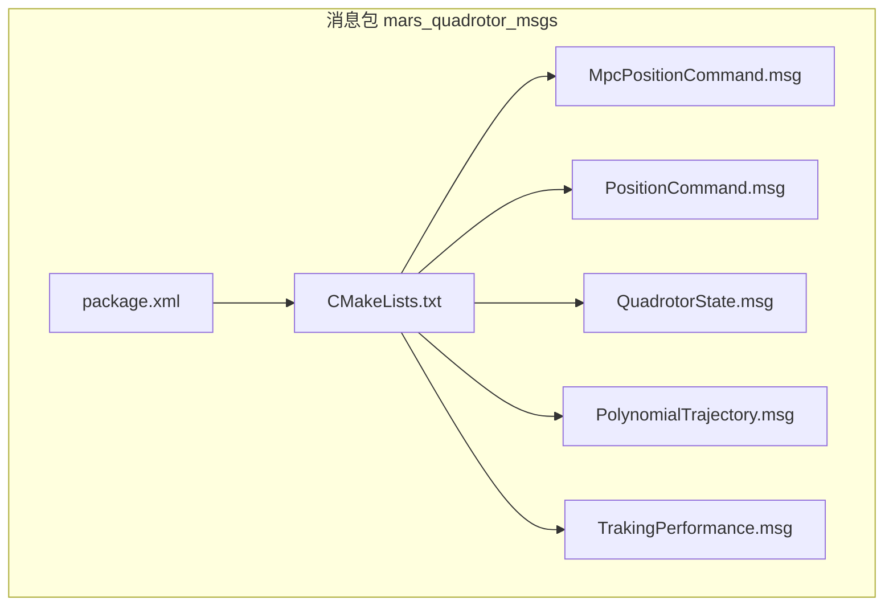
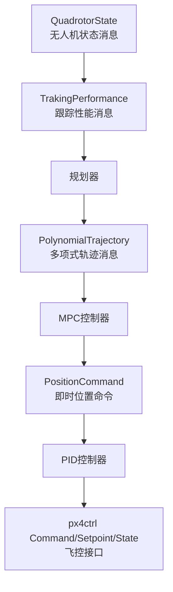
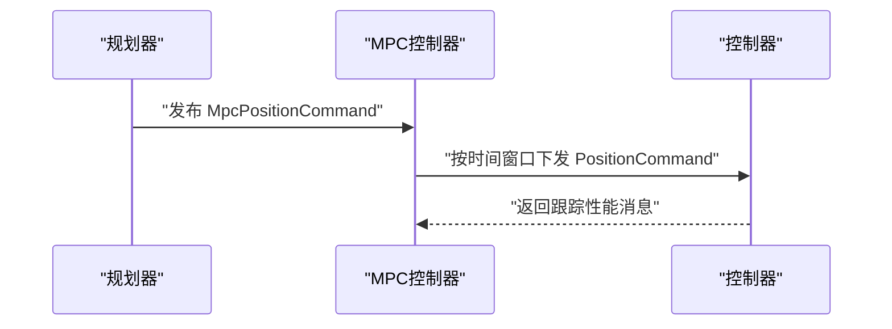
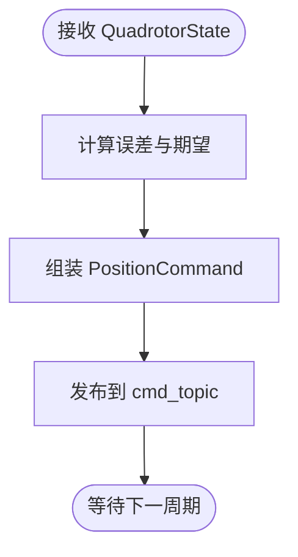
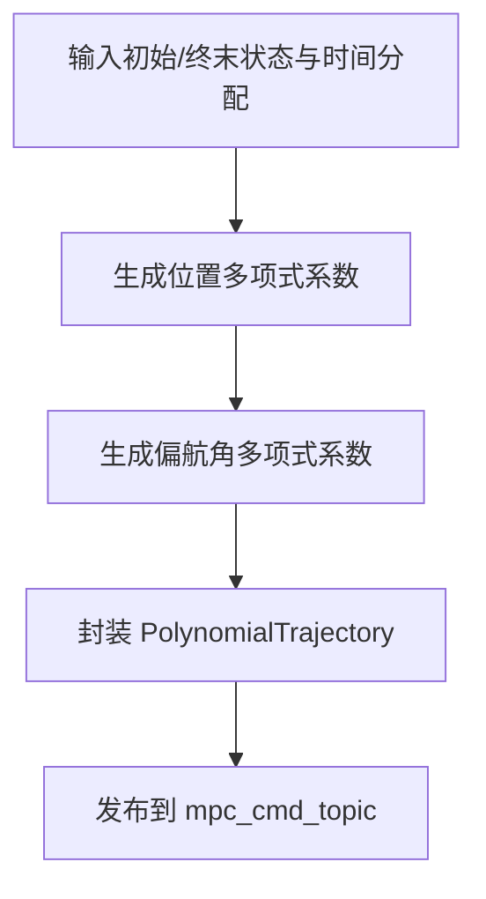
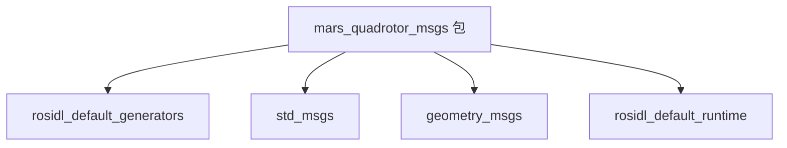

# 自定义消息系统

<cite>
**本文档引用的文件**
- [MpcPositionCommand.msg](file://src/SUPER/mars_uav_sim/mars_quadrotor_msgs/ros2_msg/MpcPositionCommand.msg)
- [PositionCommand.msg](file://src/SUPER/mars_uav_sim/mars_quadrotor_msgs/ros2_msg/PositionCommand.msg)
- [QuadrotorState.msg](file://src/SUPER/mars_uav_sim/mars_quadrotor_msgs/ros2_msg/QuadrotorState.msg)
- [PolynomialTrajectory.msg](file://src/SUPER/mars_uav_sim/mars_quadrotor_msgs/ros2_msg/PolynomialTrajectory.msg)
- [TrakingPerformance.msg](file://src/SUPER/mars_uav_sim/mars_quadrotor_msgs/ros2_msg/TrakingPerformance.msg)
- [CMakeLists.txt](file://src/SUPER/mars_uav_sim/mars_quadrotor_msgs/CMakeLists.txt)
- [package.xml](file://src/SUPER/mars_uav_sim/mars_quadrotor_msgs/package.xml)
- [command_topics.md](file://src/SUPER/super_planner/docs/command_topics.md)
- [fsm_ros2.hpp](file://src/SUPER/super_planner/include/ros_interface/ros2/fsm_ros2.hpp)
- [ros2_perfect_drone_model.hpp](file://src/SUPER/mars_uav_sim/perfect_drone_sim/include/perfect_drone_sim/ros2_perfect_drone_model.hpp)
- [Command.msg](file://src/SUPER/mars_uav_sim/px4ctrl_msgs/msg/Command.msg)
- [Setpoint.msg](file://src/SUPER/mars_uav_sim/px4ctrl_msgs/msg/Setpoint.msg)
- [State.msg](file://src/SUPER/mars_uav_sim/px4ctrl_msgs/msg/State.msg)
- [polynomial_interpolation.h](file://src/SUPER/super_planner/include/utils/optimization/polynomial_interpolation.h)
- [yaw_traj_opt.cpp](file://src/SUPER/super_planner/src/traj_opt/yaw_traj_opt.cpp)
</cite>

## 目录
1. [简介](#简介)
2. [项目结构](#项目结构)
3. [核心组件](#核心组件)
4. [架构总览](#架构总览)
5. [详细组件分析](#详细组件分析)
6. [依赖分析](#依赖分析)
7. [性能考虑](#性能考虑)
8. [故障排查指南](#故障排查指南)
9. [结论](#结论)
10. [附录](#附录)

## 简介
本文件面向自定义消息系统，聚焦于以下四类消息的结构与用法：
- MPC位置命令消息：用于发布多项式轨迹的高层命令，包含轨迹集合、时域与标志位。
- 位置命令消息：用于发布即时位置/速度/加速度/急动度/姿态/角速度/推力等状态指令，供PID控制器使用。
- 无人机状态消息：记录飞行器的位置、姿态、线速度、角速度及高阶导数（加加速度、急动度、.snap）。
- 多项式轨迹消息：描述位置与偏航角的多项式轨迹，包含系数、时间分配与类型标志。
- 跟踪性能消息：记录MPC求解耗时、建议悬停比例以及参考/命令/反馈/误差状态。

同时，本文提供消息发布/订阅/处理的最佳实践、坐标系与单位约定、数据精度要求、插值与轨迹生成流程，并给出版本管理与向后兼容策略建议。

## 项目结构
该消息系统位于 mars_quadrotor_msgs 包中，通过 ROS2 的 rosidl 接口生成机制构建。消息文件集中于 ros2_msg 目录，CMakeLists.txt 统一声明消息文件并导出依赖；package.xml 描述版本与构建依赖。

图表来源
- [CMakeLists.txt](file://src/SUPER/mars_uav_sim/mars_quadrotor_msgs/CMakeLists.txt#L24-L37)
- [package.xml](file://src/SUPER/mars_uav_sim/mars_quadrotor_msgs/package.xml#L10-L20)

章节来源
- [CMakeLists.txt](file://src/SUPER/mars_uav_sim/mars_quadrotor_msgs/CMakeLists.txt#L1-L46)
- [package.xml](file://src/SUPER/mars_uav_sim/mars_quadrotor_msgs/package.xml#L1-L26)

## 核心组件
本节对四大消息进行逐条解析，涵盖字段含义、取值范围、单位与精度要求、典型用途与注意事项。

- MpcPositionCommand.msg
  - 字段概览：消息头、位置命令数组、MPC时域、命令标志位（正常/阻断）。
  - 典型用途：将一组未来时刻的命令打包发送，供MPC控制器按时间窗口执行。
  - 注意事项：命令数组长度应与 mpc_horizon 对齐；标志位用于紧急阻断场景。

- PositionCommand.msg
  - 字段概览：消息头、目标位置/速度/加速度/急动度、角速度、姿态、推力、偏航角、偏航角速度、速度/加速度范数、PID增益、轨迹ID/状态/动作标志。
  - 典型用途：作为PID控制器的即时输入，包含完整的状态与控制需求。
  - 数据精度：浮点数采用双精度字段，满足高阶导数与控制稳定性要求。
  - 单位约定：位置米、速度米/秒、加速度米/秒²、角速度弧度/秒、偏航角弧度、推力牛顿等。

- QuadrotorState.msg
  - 字段概览：推力、速度/加速度/急动度范数、位置（Point）、速度/加速度/急动度/.snap（Vector3）、姿态（欧拉角Vector3）、角速度（Vector3）。
  - 典型用途：描述飞行器当前状态，常用于性能消息中的参考/命令/反馈/误差对比。
  - 单位约定：同上，姿态为欧拉角，单位弧度。

- PolynomialTrajectory.msg
  - 字段概览：消息头、轨迹ID、类型标志（心跳/位置/偏航/偏航指令/紧急停止）、段数、多项式阶数、起始系统墙钟时间、当前偏航/偏航速率、多项式系数数组、各段时间分配、调试信息。
  - 典型用途：由规划器生成的完整轨迹，供MPC控制器按时间插值得到目标状态。
  - 插值方法：基于多项式系数与时间分配进行分段插值，支持位置与偏航独立处理。

- TrakingPerformance.msg
  - 字段概览：消息头、MPC有限状态机状态ID与名称、MPC求解耗时、建议悬停比例、参考/命令/反馈/误差状态（均为 QuadrotorState）。
  - 典型用途：评估控制性能与轨迹跟踪误差，辅助调参与策略切换。

章节来源
- [MpcPositionCommand.msg](file://src/SUPER/mars_uav_sim/mars_quadrotor_msgs/ros2_msg/MpcPositionCommand.msg#L1-L7)
- [PositionCommand.msg](file://src/SUPER/mars_uav_sim/mars_quadrotor_msgs/ros2_msg/PositionCommand.msg#L1-L30)
- [QuadrotorState.msg](file://src/SUPER/mars_uav_sim/mars_quadrotor_msgs/ros2_msg/QuadrotorState.msg#L1-L11)
- [PolynomialTrajectory.msg](file://src/SUPER/mars_uav_sim/mars_quadrotor_msgs/ros2_msg/PolynomialTrajectory.msg#L1-L39)
- [TrakingPerformance.msg](file://src/SUPER/mars_uav_sim/mars_quadrotor_msgs/ros2_msg/TrakingPerformance.msg#L1-L16)

## 架构总览
下图展示了消息在系统中的流转关系：规划器生成多项式轨迹，经由 PolynomialTrajectory 发布；控制器根据轨迹生成 PositionCommand 或直接使用 Setpoint/Command 进行控制。

图表来源
- [command_topics.md](file://src/SUPER/super_planner/docs/command_topics.md#L1-L63)
- [fsm_ros2.hpp](file://src/SUPER/super_planner/include/ros_interface/ros2/fsm_ros2.hpp#L381-L422)
- [Command.msg](file://src/SUPER/mars_uav_sim/px4ctrl_msgs/msg/Command.msg#L2-L17)
- [Setpoint.msg](file://src/SUPER/mars_uav_sim/px4ctrl_msgs/msg/Setpoint.msg#L2-L13)
- [State.msg](file://src/SUPER/mars_uav_sim/px4ctrl_msgs/msg/State.msg#L2-L11)

## 详细组件分析

### MPC位置命令消息（MpcPositionCommand）
- 结构要点
  - 消息头：包含时间戳与坐标系信息。
  - 命令数组：一组 PositionCommand，按时间顺序排列，长度等于 mpc_horizon。
  - mpc_horizon：MPC时域长度（采样点数）。
  - command_flag：NORMAL_COMMAND/BLOCK_COMMAND，用于紧急阻断。
- 用途与流程
  - 规划器将未来一段时间的命令打包为数组，发布到 mpc_cmd_topic。
  - 控制器按当前时刻从数组中取出对应命令，驱动执行。
- 最佳实践
  - 保证命令数组长度与 mpc_horizon 一致，避免越界。
  - 在紧急情况下设置 BLOCK_COMMAND，确保控制系统快速降级。

图表来源
- [MpcPositionCommand.msg](file://src/SUPER/mars_uav_sim/mars_quadrotor_msgs/ros2_msg/MpcPositionCommand.msg#L1-L7)
- [PositionCommand.msg](file://src/SUPER/mars_uav_sim/mars_quadrotor_msgs/ros2_msg/PositionCommand.msg#L1-L30)
- [command_topics.md](file://src/SUPER/super_planner/docs/command_topics.md#L34-L62)

章节来源
- [MpcPositionCommand.msg](file://src/SUPER/mars_uav_sim/mars_quadrotor_msgs/ros2_msg/MpcPositionCommand.msg#L1-L7)
- [command_topics.md](file://src/SUPER/super_planner/docs/command_topics.md#L34-L62)

### 位置命令消息（PositionCommand）
- 字段与取值范围
  - 位置/速度/加速度/急动度：三维向量，单位米与米/秒等。
  - 角速度/姿态/偏航角/偏航角速度：姿态为欧拉角，单位弧度；角速度为弧度/秒。
  - 推力：单位牛顿。
  - PID增益 kx/kv：长度为3的数组，用于位置与速度环。
  - 轨迹ID/状态/动作标志：用于轨迹生命周期管理与动作控制。
- 单位与精度
  - 浮点字段采用双精度，确保高阶导数与控制稳定性。
- 实际应用
  - 由控制器将 QuadrotorState 与期望轨迹对比，生成 PositionCommand 并发布到 cmd_topic。

图表来源
- [PositionCommand.msg](file://src/SUPER/mars_uav_sim/mars_quadrotor_msgs/ros2_msg/PositionCommand.msg#L1-L30)
- [QuadrotorState.msg](file://src/SUPER/mars_uav_sim/mars_quadrotor_msgs/ros2_msg/QuadrotorState.msg#L1-L11)

章节来源
- [PositionCommand.msg](file://src/SUPER/mars_uav_sim/mars_quadrotor_msgs/ros2_msg/PositionCommand.msg#L1-L30)
- [QuadrotorState.msg](file://src/SUPER/mars_uav_sim/mars_quadrotor_msgs/ros2_msg/QuadrotorState.msg#L1-L11)

### 无人机状态消息（QuadrotorState）
- 字段与含义
  - thrust：推力。
  - velocity_norm/acceleration_norm/jerk_norm：速度、加速度、急动度的范数。
  - position/velocity/acceleration/jerk/snap：位置、速度、加速度、急动度、snap（四阶导）。
  - attitude/angular_velocity：姿态（欧拉角）与角速度。
- 编码方式
  - 使用 geometry_msgs 的 Point/Vector3 表达空间向量。
  - 姿态采用欧拉角，单位弧度。
- 应用场景
  - 作为 TrakingPerformance 中的 reference/command/feedback/error 的载体。

章节来源
- [QuadrotorState.msg](file://src/SUPER/mars_uav_sim/mars_quadrotor_msgs/ros2_msg/QuadrotorState.msg#L1-L11)

### 多项式轨迹消息（PolynomialTrajectory）
- 结构要点
  - 类型标志：心跳、位置轨迹、偏航轨迹、偏航指令、紧急停止。
  - 分段多项式：piece_num_pos/piece_num_yaw、order_pos/order_yaw。
  - 系数与时间：coef_pos_x/y/z、coef_yaw、time_pos/time_yaw。
  - 起始时间：start_wt_pos/start_wt_yaw，系统墙钟时间。
- 插值方法
  - 按段分块，使用多项式系数与时间分配进行插值，得到目标状态序列。
  - 偏航角轨迹与位置轨迹可独立生成与组合。
- 生成流程
  - 位置轨迹：最小化 snap/加加速度等指标，生成高阶多项式。
  - 偏航轨迹：根据路径与速度约束，生成平滑的偏航角曲线。

图表来源
- [PolynomialTrajectory.msg](file://src/SUPER/mars_uav_sim/mars_quadrotor_msgs/ros2_msg/PolynomialTrajectory.msg#L1-L39)
- [yaw_traj_opt.cpp](file://src/SUPER/super_planner/src/traj_opt/yaw_traj_opt.cpp#L139-L165)
- [polynomial_interpolation.h](file://src/SUPER/super_planner/include/utils/optimization/polynomial_interpolation.h#L233-L259)

章节来源
- [PolynomialTrajectory.msg](file://src/SUPER/mars_uav_sim/mars_quadrotor_msgs/ros2_msg/PolynomialTrajectory.msg#L1-L39)
- [yaw_traj_opt.cpp](file://src/SUPER/super_planner/src/traj_opt/yaw_traj_opt.cpp#L139-L165)
- [polynomial_interpolation.h](file://src/SUPER/super_planner/include/utils/optimization/polynomial_interpolation.h#L233-L259)

### 跟踪性能消息（TrakingPerformance）
- 指标说明
  - mpc_solve_time：MPC求解耗时（秒）。
  - suggest_hover_percentage：建议悬停比例，辅助策略选择。
  - reference/command/feedback/error：均采用 QuadrotorState 表达。
- 用途
  - 评估控制性能，指导参数调整与模式切换。

章节来源
- [TrakingPerformance.msg](file://src/SUPER/mars_uav_sim/mars_quadrotor_msgs/ros2_msg/TrakingPerformance.msg#L1-L16)
- [QuadrotorState.msg](file://src/SUPER/mars_uav_sim/mars_quadrotor_msgs/ros2_msg/QuadrotorState.msg#L1-L11)

## 依赖分析
消息系统依赖标准消息类型与生成工具链，CMakeLists.txt 明确声明了消息文件与依赖，package.xml 定义了构建与运行时依赖。

图表来源
- [CMakeLists.txt](file://src/SUPER/mars_uav_sim/mars_quadrotor_msgs/CMakeLists.txt#L18-L40)
- [package.xml](file://src/SUPER/mars_uav_sim/mars_quadrotor_msgs/package.xml#L10-L20)

章节来源
- [CMakeLists.txt](file://src/SUPER/mars_uav_sim/mars_quadrotor_msgs/CMakeLists.txt#L18-L40)
- [package.xml](file://src/SUPER/mars_uav_sim/mars_quadrotor_msgs/package.xml#L10-L20)

## 性能考虑
- 数据精度
  - 所有位置/速度/加速度/角速度相关字段采用双精度浮点，确保高阶导数与控制稳定性。
- 插值与轨迹
  - 多项式轨迹采用分段插值，合理设置阶数与时间分配，平衡平滑性与实时性。
- 发布频率
  - PositionCommand 与 PolynomialTrajectory 的发布周期需与控制器带宽匹配，避免过采样或欠采样。
- 内存与计算
  - TrakingPerformance 中的 QuadrotorState 数组会增加内存占用，建议按需采集与压缩。

## 故障排查指南
- 订阅/发布异常
  - 检查话题命名与 QoS 设置，确保发布端与订阅端一致。
  - 参考命令话题说明文档，确认消息类型与发布频率。
- 轨迹不平滑
  - 提升多项式阶数或增大加速度/加加速度惩罚权重，参考规划器参数文档。
- 控制器不收敛
  - 校验 PositionCommand 的 kx/kv 参数，检查 QuadrotorState 是否与期望一致。
- 飞控接口映射
  - 将 PositionCommand 转换为 px4ctrl 的 Command/Setpoint 时，注意姿态表示（欧拉角→四元数）与单位换算。

章节来源
- [command_topics.md](file://src/SUPER/super_planner/docs/command_topics.md#L1-L63)
- [fsm_ros2.hpp](file://src/SUPER/super_planner/include/ros_interface/ros2/fsm_ros2.hpp#L381-L422)
- [Command.msg](file://src/SUPER/mars_uav_sim/px4ctrl_msgs/msg/Command.msg#L2-L17)
- [Setpoint.msg](file://src/SUPER/mars_uav_sim/px4ctrl_msgs/msg/Setpoint.msg#L2-L13)
- [State.msg](file://src/SUPER/mars_uav_sim/px4ctrl_msgs/msg/State.msg#L2-L11)

## 结论
本文档系统梳理了自定义消息系统的结构与用法，明确了 MPC位置命令、位置命令、无人机状态、多项式轨迹与跟踪性能消息的字段语义、单位约定与典型流程。结合实际代码中的发布/订阅与转换逻辑，给出了最佳实践与故障排查建议。对于版本管理与向后兼容，建议遵循语义化版本与字段扩展原则，保持消息向后兼容。

## 附录

### 坐标系与单位约定
- 坐标系
  - 世界坐标系：全局导航，位置与速度以该坐标系表达。
  - 机体坐标系：以无人机为基准，姿态与角速度以该坐标系表达。
- 单位
  - 位置：米
  - 速度：米/秒
  - 加速度：米/秒²
  - 角速度：弧度/秒
  - 偏航角：弧度
  - 推力：牛顿
  - 时间：秒（系统墙钟时间）

章节来源
- [PolynomialTrajectory.msg](file://src/SUPER/mars_uav_sim/mars_quadrotor_msgs/ros2_msg/PolynomialTrajectory.msg#L2-L28)
- [PositionCommand.msg](file://src/SUPER/mars_uav_sim/mars_quadrotor_msgs/ros2_msg/PositionCommand.msg#L2-L13)

### 消息发布/订阅与处理最佳实践
- 发布端
  - 使用可靠QoS与合适的队列深度，确保消息不丢失。
  - 严格遵守消息头时间戳与坐标系约定。
- 订阅端
  - 对关键消息进行超时检测与健康检查。
  - 在控制器中进行边界检查与安全降级。
- 转换与适配
  - PositionCommand 到 px4ctrl 的 Command/Setpoint 时，进行欧拉角→四元数转换与单位统一。

章节来源
- [fsm_ros2.hpp](file://src/SUPER/super_planner/include/ros_interface/ros2/fsm_ros2.hpp#L381-L422)
- [ros2_perfect_drone_model.hpp](file://src/SUPER/mars_uav_sim/perfect_drone_sim/include/perfect_drone_sim/ros2_perfect_drone_model.hpp#L212-L249)
- [Command.msg](file://src/SUPER/mars_uav_sim/px4ctrl_msgs/msg/Command.msg#L2-L17)
- [Setpoint.msg](file://src/SUPER/mars_uav_sim/px4ctrl_msgs/msg/Setpoint.msg#L2-L13)
- [State.msg](file://src/SUPER/mars_uav_sim/px4ctrl_msgs/msg/State.msg#L2-L11)

### 版本管理与向后兼容策略
- 版本号
  - package.xml 中已定义版本号，建议遵循语义化版本管理。
- 向后兼容
  - 新增字段时保留默认值，避免破坏旧客户端解析。
  - 通过类型标志位区分消息变体，逐步替换旧字段。
  - 保持消息头与常用字段稳定，降低迁移成本。

章节来源
- [package.xml](file://src/SUPER/mars_uav_sim/mars_quadrotor_msgs/package.xml#L4-L6)