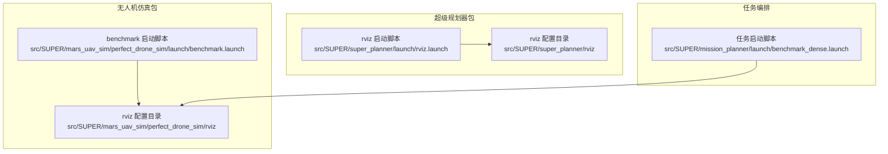
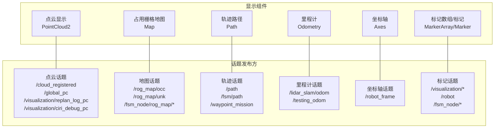
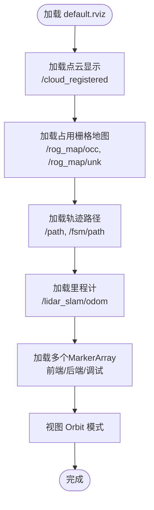
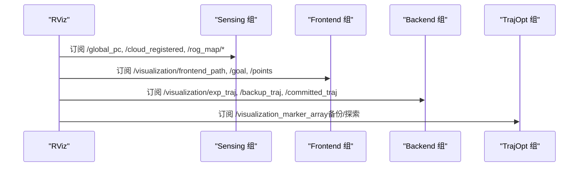
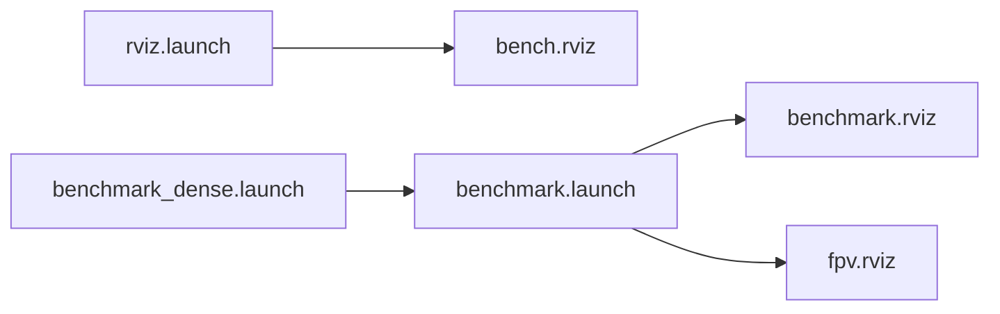

# RViz可视化配置

<cite>
**本文引用的文件**
- [src/SUPER/super_planner/rviz/default.rviz](file://src/SUPER/super_planner/rviz/default.rviz)
- [src/SUPER/super_planner/rviz/bench.rviz](file://src/SUPER/super_planner/rviz/bench.rviz)
- [src/SUPER/super_planner/rviz/fpv.rviz](file://src/SUPER/super_planner/rviz/fpv.rviz)
- [src/SUPER/mars_uav_sim/perfect_drone_sim/rviz/benchmark.rviz](file://src/SUPER/mars_uav_sim/perfect_drone_sim/rviz/benchmark.rviz)
- [src/SUPER/mars_uav_sim/perfect_drone_sim/rviz/fpv.rviz](file://src/SUPER/mars_uav_sim/perfect_drone_sim/rviz/fpv.rviz)
- [src/SUPER/mars_uav_sim/perfect_drone_sim/rviz/top_down.rviz](file://src/SUPER/mars_uav_sim/perfect_drone_sim/rviz/top_down.rviz)
- [src/SUPER/super_planner/launch/rviz.launch](file://src/SUPER/super_planner/launch/rviz.launch)
- [src/SUPER/mars_uav_sim/perfect_drone_sim/launch/benchmark.launch](file://src/SUPER/mars_uav_sim/perfect_drone_sim/launch/benchmark.launch)
- [src/SUPER/mission_planner/launch/benchmark_dense.launch](file://src/SUPER/mission_planner/launch/benchmark_dense.launch)
</cite>

## 目录
1. [简介](#简介)
2. [项目结构](#项目结构)
3. [核心组件](#核心组件)
4. [架构总览](#架构总览)
5. [详细组件分析](#详细组件分析)
6. [依赖关系分析](#依赖关系分析)
7. [性能考虑](#性能考虑)
8. [故障排查指南](#故障排查指南)
9. [结论](#结论)
10. [附录](#附录)

## 简介
本文件面向RViz可视化配置系统的使用者与维护者，系统性梳理并解读多套RViz配置文件（default.rviz、bench.rviz、fpv.rviz、benchmark.rviz、top_down.rviz）在不同场景下的结构与用途，涵盖点云、占用栅格地图、轨迹路径、里程计、标记数组等显示组件的订阅话题、参数配置与视觉呈现方式；同时提供主题切换、相机视角与视图管理建议，并给出自定义配置的最佳实践。

## 项目结构
本项目的RViz配置主要位于两个包中：
- 超级规划器包：src/SUPER/super_planner/rviz
- 无人机仿真包：src/SUPER/mars_uav_sim/perfect_drone_sim/rviz

此外，配套的启动文件用于加载不同配置并运行RViz，便于在不同任务场景下快速切换可视化视图。

**图表来源**
- [src/SUPER/super_planner/rviz/default.rviz](file://src/SUPER/super_planner/rviz/default.rviz#L1-L484)
- [src/SUPER/super_planner/rviz/bench.rviz](file://src/SUPER/super_planner/rviz/bench.rviz#L1-L648)
- [src/SUPER/mars_uav_sim/perfect_drone_sim/rviz/benchmark.rviz](file://src/SUPER/mars_uav_sim/perfect_drone_sim/rviz/benchmark.rviz#L1-L556)
- [src/SUPER/mars_uav_sim/perfect_drone_sim/launch/benchmark.launch](file://src/SUPER/mars_uav_sim/perfect_drone_sim/launch/benchmark.launch#L1-L16)

**章节来源**
- [src/SUPER/super_planner/rviz/default.rviz](file://src/SUPER/super_planner/rviz/default.rviz#L1-L484)
- [src/SUPER/super_planner/rviz/bench.rviz](file://src/SUPER/super_planner/rviz/bench.rviz#L1-L648)
- [src/SUPER/mars_uav_sim/perfect_drone_sim/rviz/benchmark.rviz](file://src/SUPER/mars_uav_sim/perfect_drone_sim/rviz/benchmark.rviz#L1-L556)
- [src/SUPER/mars_uav_sim/perfect_drone_sim/launch/benchmark.launch](file://src/SUPER/mars_uav_sim/perfect_drone_sim/launch/benchmark.launch#L1-L16)

## 核心组件
本节对RViz中常用显示组件进行分类与功能说明，并指出其对应的订阅话题与典型参数位置（以文件路径+行号形式标注）。

- 点云显示（PointCloud2）
  - 全局点云：/global_pc
  - 局部/注册点云：/cloud_registered
  - 膨胀后的占用点云：/rog_map/inf_occ
  - 重播调试点云：/visualization/replan_log_pc、/visualization/ciri_debug_pc
  - 参考配置位置：
    - [PointCloud2 显示项](file://src/SUPER/super_planner/rviz/default.rviz#L158-L162)
    - [PointCloud2 显示项（bench）](file://src/SUPER/super_planner/rviz/bench.rviz#L399-L431)
    - [PointCloud2 显示项（fpv）](file://src/SUPER/super_planner/rviz/fpv.rviz#L156-L160)
    - [PointCloud2 显示项（benchmark）](file://src/SUPER/mars_uav_sim/perfect_drone_sim/rviz/benchmark.rviz#L443-L447)
    - [PointCloud2 显示项（top_down）](file://src/SUPER/mars_uav_sim/perfect_drone_sim/rviz/top_down.rviz#L453-L457)

- 占用栅格地图（Map）
  - 占用概率地图：/rog_map/occ
  - 不确定区域地图：/rog_map/unk
  - 仿真场景中的占用栅格：/fsm_node/rog_map/occ、/fsm_node/rog_map/inf_occ
  - 参考配置位置：
    - [Map 显示项（default）](file://src/SUPER/super_planner/rviz/default.rviz#L169-L172)
    - [Map 显示项（bench）](file://src/SUPER/super_planner/rviz/bench.rviz#L181-L185)
    - [Map 显示项（benchmark）](file://src/SUPER/mars_uav_sim/perfect_drone_sim/rviz/benchmark.rviz#L209-L215)
    - [Map 显示项（top_down）](file://src/SUPER/mars_uav_sim/perfect_drone_sim/rviz/top_down.rviz#L213-L217)

- 轨迹路径（Path）
  - 主规划轨迹：/path
  - FSM状态机轨迹：/fsm/path
  - 航路点任务轨迹：/waypoint_mission
  - 参考配置位置：
    - [Path 显示项（default）](file://src/SUPER/super_planner/rviz/default.rviz#L203-L205)
    - [Path 显示项（bench）](file://src/SUPER/super_planner/rviz/bench.rviz#L497-L499)
    - [Path 显示项（benchmark）](file://src/SUPER/mars_uav_sim/perfect_drone_sim/rviz/benchmark.rviz#L497-L499)
    - [Path 显示项（top_down）](file://src/SUPER/mars_uav_sim/perfect_drone_sim/rviz/top_down.rviz#L511-L513)

- 里程计（Odometry）
  - 里程计话题：/lidar_slam/odom
  - 可选：/testing_odom、/odom_visualization/odom
  - 参考配置位置：
    - [Odometry 显示项（default）](file://src/SUPER/super_planner/rviz/default.rviz#L261-L263)
    - [Odometry 显示项（bench）](file://src/SUPER/super_planner/rviz/bench.rviz#L107-L109)
    - [Odometry 显示项（fpv）](file://src/SUPER/super_planner/rviz/fpv.rviz#L110-L112)
    - [Odometry 显示项（benchmark）](file://src/SUPER/mars_uav_sim/perfect_drone_sim/rviz/benchmark.rviz#L121-L123)

- 坐标轴（Axes）
  - 用于指示坐标系方向与尺度
  - 参考配置位置：
    - [Axes 显示项（default）](file://src/SUPER/super_planner/rviz/default.rviz#L269-L271)
    - [Axes 显示项（bench）](file://src/SUPER/super_planner/rviz/bench.rviz#L220-L222)

- 标记数组（MarkerArray/Marker）
  - 规划目标与轨迹：/visualization/goal、/visualization/committed_traj、/visualization/exp_traj、/visualization/backup_traj
  - SFC（可达集/自由集）：/visualization/exp_sfc、/visualization/backup_sfc
  - ASTAR调试：/visualization/astar_debug
  - 机器人模型：/robot、/perfect_drone/robot
  - 参考配置位置：
    - [MarkerArray/Marker 显示项（default）](file://src/SUPER/super_planner/rviz/default.rviz#L274-L399)
    - [MarkerArray/Marker 显示项（bench）](file://src/SUPER/super_planner/rviz/bench.rviz#L229-L375)
    - [MarkerArray/Marker 显示项（fpv）](file://src/SUPER/super_planner/rviz/fpv.rviz#L240-L317)
    - [MarkerArray/Marker 显示项（benchmark）](file://src/SUPER/mars_uav_sim/perfect_drone_sim/rviz/benchmark.rviz#L259-L475)

**章节来源**
- [src/SUPER/super_planner/rviz/default.rviz](file://src/SUPER/super_planner/rviz/default.rviz#L80-L424)
- [src/SUPER/super_planner/rviz/bench.rviz](file://src/SUPER/super_planner/rviz/bench.rviz#L118-L587)
- [src/SUPER/super_planner/rviz/fpv.rviz](file://src/SUPER/super_planner/rviz/fpv.rviz#L121-L319)
- [src/SUPER/mars_uav_sim/perfect_drone_sim/rviz/benchmark.rviz](file://src/SUPER/mars_uav_sim/perfect_drone_sim/rviz/benchmark.rviz#L140-L475)
- [src/SUPER/mars_uav_sim/perfect_drone_sim/rviz/top_down.rviz](file://src/SUPER/mars_uav_sim/perfect_drone_sim/rviz/top_down.rviz#L140-L513)

## 架构总览
下图展示RViz配置与实际发布话题之间的映射关系，帮助理解各显示组件如何订阅对应话题并渲染。

**图表来源**
- [src/SUPER/super_planner/rviz/default.rviz](file://src/SUPER/super_planner/rviz/default.rviz#L130-L399)
- [src/SUPER/super_planner/rviz/bench.rviz](file://src/SUPER/super_planner/rviz/bench.rviz#L181-L375)
- [src/SUPER/mars_uav_sim/perfect_drone_sim/rviz/benchmark.rviz](file://src/SUPER/mars_uav_sim/perfect_drone_sim/rviz/benchmark.rviz#L209-L475)

## 详细组件分析

### default.rviz：通用场景配置
- 场景定位：综合展示全局点云、占用栅格、主规划轨迹、FSM轨迹、多类标记数组与里程计信息。
- 关键特性：
  - 默认固定帧：world
  - 视图类型：Orbit
  - 多个MarkerArray并行显示，覆盖前端路径、后端轨迹、SFC、调试信息等
- 适用场景：开发调试、演示展示
- 参考配置位置：
  - [默认配置文件](file://src/SUPER/super_planner/rviz/default.rviz#L1-L484)

**图表来源**
- [src/SUPER/super_planner/rviz/default.rviz](file://src/SUPER/super_planner/rviz/default.rviz#L169-L399)

**章节来源**
- [src/SUPER/super_planner/rviz/default.rviz](file://src/SUPER/super_planner/rviz/default.rviz#L1-L484)

### bench.rviz：基准测试场景配置
- 场景定位：强调“感知—前端—后端—轨迹优化”的分组显示，便于评测与对比。
- 关键特性：
  - 分组显示：Sensing（感知）、Frontend（前端）、Backend（后端）、TrajOpt（轨迹优化）、Debug（调试）
  - 视图类型：ThirdPersonFollower
  - 提供深度图像显示占位（可选）
- 适用场景：性能评测、算法对比、教学演示
- 参考配置位置：
  - [基准配置文件](file://src/SUPER/super_planner/rviz/bench.rviz#L1-L648)

**图表来源**
- [src/SUPER/super_planner/rviz/bench.rviz](file://src/SUPER/super_planner/rviz/bench.rviz#L225-L324)

**章节来源**
- [src/SUPER/super_planner/rviz/bench.rviz](file://src/SUPER/super_planner/rviz/bench.rviz#L1-L648)

### fpv.rviz：第一人称视角配置
- 场景定位：以无人机视角为中心的跟随相机，突出近景点云与局部环境。
- 关键特性：
  - 视图类型：ThirdPersonFollower
  - 默认关闭部分显示项，聚焦于关键信息
  - 适合飞行仿真或真实机载场景
- 适用场景：飞行仿真、机载可视化
- 参考配置位置：
  - [第一人称配置文件](file://src/SUPER/super_planner/rviz/fpv.rviz#L1-L383)

**章节来源**
- [src/SUPER/super_planner/rviz/fpv.rviz](file://src/SUPER/super_planner/rviz/fpv.rviz#L1-L383)

### benchmark.rviz（无人机仿真）：基准场景
- 场景定位：与benchmark.launch配合，展示完整任务链路（航路点、FSM、轨迹优化、调试信息）。
- 关键特性：
  - 视图类型：XYOrbit
  - 强调命名空间过滤（如 guide_path、goal、exp_traj 等）
  - 包含航路点任务轨迹与速度文本标记
- 适用场景：仿真基准测试、任务演示
- 参考配置位置：
  - [benchmark.rviz](file://src/SUPER/mars_uav_sim/perfect_drone_sim/rviz/benchmark.rviz#L1-L556)

**章节来源**
- [src/SUPER/mars_uav_sim/perfect_drone_sim/rviz/benchmark.rviz](file://src/SUPER/mars_uav_sim/perfect_drone_sim/rviz/benchmark.rviz#L1-L556)

### top_down.rviz（无人机仿真）：俯视视角
- 场景定位：俯视视角观察全局布局与轨迹。
- 关键特性：
  - 视图类型：XYOrbit
  - 开启占用栅格与膨胀栅格显示
- 适用场景：全局态势观察、路径规划验证
- 参考配置位置：
  - [top_down.rviz](file://src/SUPER/mars_uav_sim/perfect_drone_sim/rviz/top_down.rviz#L1-L570)

**章节来源**
- [src/SUPER/mars_uav_sim/perfect_drone_sim/rviz/top_down.rviz](file://src/SUPER/mars_uav_sim/perfect_drone_sim/rviz/top_down.rviz#L1-L570)

### fpv.rviz（无人机仿真）：第一人称视角
- 场景定位：以无人机机体制作视角，强调近景点云与SFC/轨迹。
- 关键特性：
  - 视图类型：XYOrbit
  - 支持命名空间过滤（如 exp_sfc mesh、backup_sfc mesh）
- 适用场景：飞行仿真、机载可视化
- 参考配置位置：
  - [fpv.rviz](file://src/SUPER/mars_uav_sim/perfect_drone_sim/rviz/fpv.rviz#L1-L467)

**章节来源**
- [src/SUPER/mars_uav_sim/perfect_drone_sim/rviz/fpv.rviz](file://src/SUPER/mars_uav_sim/perfect_drone_sim/rviz/fpv.rviz#L1-L467)

## 依赖关系分析
- 启动文件与配置映射
  - 超级规划器：rviz.launch 默认加载 bench.rviz
  - 无人机仿真：benchmark.launch 加载 benchmark.rviz 与 fpv.rviz
  - 任务编排：benchmark_dense.launch 启动航路点、仿真与RViz
- 话题依赖
  - 点云：/cloud_registered、/global_pc、/visualization/replan_log_pc、/visualization/ciri_debug_pc
  - 地图：/rog_map/occ、/rog_map/unk、/fsm_node/rog_map/*
  - 轨迹：/path、/fsm/path、/waypoint_mission
  - 标记：/visualization/*、/robot、/fsm_node/*

**图表来源**
- [src/SUPER/super_planner/launch/rviz.launch](file://src/SUPER/super_planner/launch/rviz.launch#L1-L4)
- [src/SUPER/mars_uav_sim/perfect_drone_sim/launch/benchmark.launch](file://src/SUPER/mars_uav_sim/perfect_drone_sim/launch/benchmark.launch#L1-L16)
- [src/SUPER/mission_planner/launch/benchmark_dense.launch](file://src/SUPER/mission_planner/launch/benchmark_dense.launch#L1-L30)

**章节来源**
- [src/SUPER/super_planner/launch/rviz.launch](file://src/SUPER/super_planner/launch/rviz.launch#L1-L4)
- [src/SUPER/mars_uav_sim/perfect_drone_sim/launch/benchmark.launch](file://src/SUPER/mars_uav_sim/perfect_drone_sim/launch/benchmark.launch#L1-L16)
- [src/SUPER/mission_planner/launch/benchmark_dense.launch](file://src/SUPER/mission_planner/launch/benchmark_dense.launch#L1-L30)

## 性能考虑
- 显示组件数量与渲染开销
  - 大量MarkerArray叠加会显著增加GPU/CPU负载，建议按需启用/禁用
  - 点云尺寸与样式（点数、像素大小、样式）直接影响帧率
- 时间同步与队列
  - 使用时间同步源（如PointCloud2）有助于避免显示错位
  - 合理设置队列长度，避免积压导致延迟
- 视图与相机
  - Orbit/ThirdPersonFollower/XYOrbit等视图类型对性能影响较小，但过大的缩放或频繁旋转仍会增加开销
- 建议
  - 在评测场景优先使用bench.rviz的分组显示，便于快速定位瓶颈
  - 在演示场景使用default.rviz的简洁布局

## 故障排查指南
- 常见问题与处理
  - 点云不显示
    - 检查话题是否正确发布（/cloud_registered、/global_pc）
    - 确认固定帧设置与坐标一致性
    - 参考配置位置：
      - [点云显示项（default）](file://src/SUPER/super_planner/rviz/default.rviz#L158-L162)
      - [点云显示项（bench）](file://src/SUPER/super_planner/rviz/bench.rviz#L399-L431)
  - 地图不显示
    - 检查地图话题（/rog_map/occ、/rog_map/unk 或 /fsm_node/rog_map/*）
    - 确认颜色方案与透明度设置
    - 参考配置位置：
      - [地图显示项（default）](file://src/SUPER/super_planner/rviz/default.rviz#L169-L172)
      - [地图显示项（benchmark）](file://src/SUPER/mars_uav_sim/perfect_drone_sim/rviz/benchmark.rviz#L209-L215)
  - 轨迹不显示
    - 检查轨迹话题（/path、/fsm/path、/waypoint_mission）
    - 确认Buffer Length与线宽设置
    - 参考配置位置：
      - [轨迹显示项（default）](file://src/SUPER/super_planner/rviz/default.rviz#L203-L205)
      - [轨迹显示项（benchmark）](file://src/SUPER/mars_uav_sim/perfect_drone_sim/rviz/benchmark.rviz#L351-L353)
  - 里程计不显示
    - 检查里程计话题（/lidar_slam/odom）
    - 调整形状与尺寸，确保可见性
    - 参考配置位置：
      - [里程计显示项（default）](file://src/SUPER/super_planner/rviz/default.rviz#L261-L263)
      - [里程计显示项（fpv）](file://src/SUPER/super_planner/rviz/fpv.rviz#L110-L112)
  - 标记数组不显示
    - 检查命名空间过滤与队列大小
    - 参考配置位置：
      - [标记数组显示项（bench）](file://src/SUPER/super_planner/rviz/bench.rviz#L229-L375)
      - [标记数组显示项（benchmark）](file://src/SUPER/mars_uav_sim/perfect_drone_sim/rviz/benchmark.rviz#L259-L475)

**章节来源**
- [src/SUPER/super_planner/rviz/default.rviz](file://src/SUPER/super_planner/rviz/default.rviz#L158-L263)
- [src/SUPER/super_planner/rviz/bench.rviz](file://src/SUPER/super_planner/rviz/bench.rviz#L229-L375)
- [src/SUPER/mars_uav_sim/perfect_drone_sim/rviz/benchmark.rviz](file://src/SUPER/mars_uav_sim/perfect_drone_sim/rviz/benchmark.rviz#L209-L475)

## 结论
本文件系统化梳理了多套RViz配置在不同场景下的结构与用途，明确了各类显示组件与其订阅话题的关系，并提供了主题切换、相机视角与视图管理的实践建议。通过合理选择配置文件与按需启用显示组件，可在保证可视化效果的同时兼顾性能与稳定性。

## 附录

### 可视化主题与颜色方案切换指南
- 地图颜色方案
  - 占用栅格地图：支持 map、costmap 等方案
  - 参考位置：
    - [地图颜色方案（default）](file://src/SUPER/super_planner/rviz/default.rviz#L165-L175)
    - [地图颜色方案（bench）](file://src/SUPER/super_planner/rviz/bench.rviz#L181-L185)
- 轨迹颜色与样式
  - 可调整颜色、线宽、样式（Lines/Billboards/Points）
  - 参考位置：
    - [轨迹颜色与样式（default）](file://src/SUPER/super_planner/rviz/default.rviz#L186-L204)
    - [轨迹颜色与样式（bench）](file://src/SUPER/super_planner/rviz/bench.rviz#L332-L353)
- 标记样式设置
  - 通过命名空间过滤与队列大小控制显示密度
  - 参考位置：
    - [命名空间过滤（benchmark）](file://src/SUPER/mars_uav_sim/perfect_drone_sim/rviz/benchmark.rviz#L262-L272)

**章节来源**
- [src/SUPER/super_planner/rviz/default.rviz](file://src/SUPER/super_planner/rviz/default.rviz#L165-L204)
- [src/SUPER/super_planner/rviz/bench.rviz](file://src/SUPER/super_planner/rviz/bench.rviz#L181-L353)
- [src/SUPER/mars_uav_sim/perfect_drone_sim/rviz/benchmark.rviz](file://src/SUPER/mars_uav_sim/perfect_drone_sim/rviz/benchmark.rviz#L262-L272)

### 相机视角配置与视图管理
- 视图类型
  - Orbit：适合整体观察
  - ThirdPersonFollower：适合跟随视角
  - XYOrbit：适合俯视观察
- 参考位置：
  - [视图配置（default）](file://src/SUPER/super_planner/rviz/default.rviz#L446-L466)
  - [视图配置（bench）](file://src/SUPER/super_planner/rviz/bench.rviz#L607-L627)
  - [视图配置（fpv）](file://src/SUPER/super_planner/rviz/fpv.rviz#L342-L362)
  - [视图配置（benchmark）](file://src/SUPER/mars_uav_sim/perfect_drone_sim/rviz/benchmark.rviz#L515-L535)
  - [视图配置（top_down）](file://src/SUPER/mars_uav_sim/perfect_drone_sim/rviz/top_down.rviz#L529-L549)

**章节来源**
- [src/SUPER/super_planner/rviz/default.rviz](file://src/SUPER/super_planner/rviz/default.rviz#L446-L466)
- [src/SUPER/super_planner/rviz/bench.rviz](file://src/SUPER/super_planner/rviz/bench.rviz#L607-L627)
- [src/SUPER/super_planner/rviz/fpv.rviz](file://src/SUPER/super_planner/rviz/fpv.rviz#L342-L362)
- [src/SUPER/mars_uav_sim/perfect_drone_sim/rviz/benchmark.rviz](file://src/SUPER/mars_uav_sim/perfect_drone_sim/rviz/benchmark.rviz#L515-L535)
- [src/SUPER/mars_uav_sim/perfect_drone_sim/rviz/top_down.rviz](file://src/SUPER/mars_uav_sim/perfect_drone_sim/rviz/top_down.rviz#L529-L549)

### 自定义RViz配置的创建方法与最佳实践
- 创建步骤
  - 基于现有配置复制一份新文件，修改显示组件与订阅话题
  - 在启动文件中指定新配置路径
  - 逐步启用/禁用组件，验证性能与效果
- 最佳实践
  - 使用分组显示（Group）组织复杂场景
  - 合理设置队列大小与颜色方案，避免过度渲染
  - 固定帧统一为world，确保多传感器数据对齐
  - 为不同场景准备专用配置（如 default、bench、fpv、benchmark、top_down）

**章节来源**
- [src/SUPER/super_planner/launch/rviz.launch](file://src/SUPER/super_planner/launch/rviz.launch#L1-L4)
- [src/SUPER/mars_uav_sim/perfect_drone_sim/launch/benchmark.launch](file://src/SUPER/mars_uav_sim/perfect_drone_sim/launch/benchmark.launch#L1-L16)