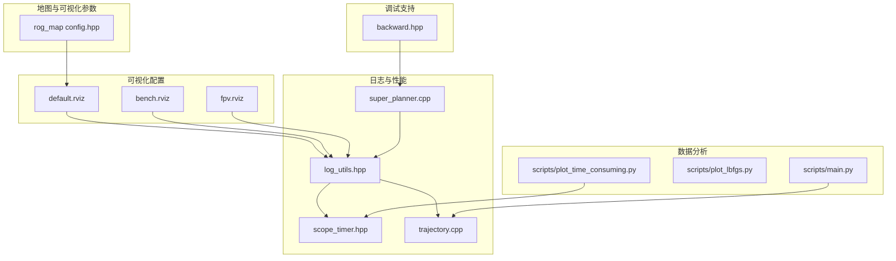
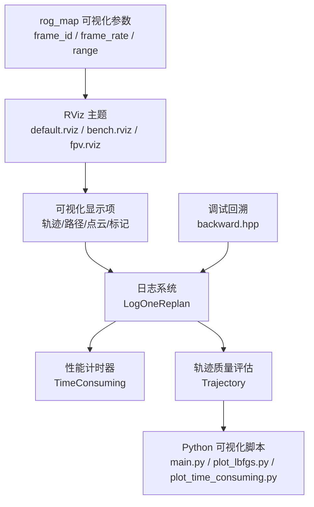
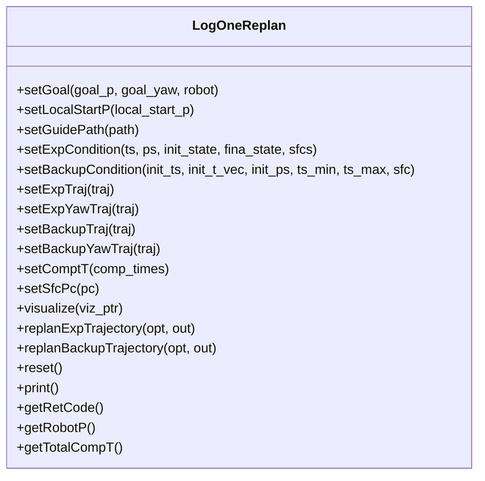
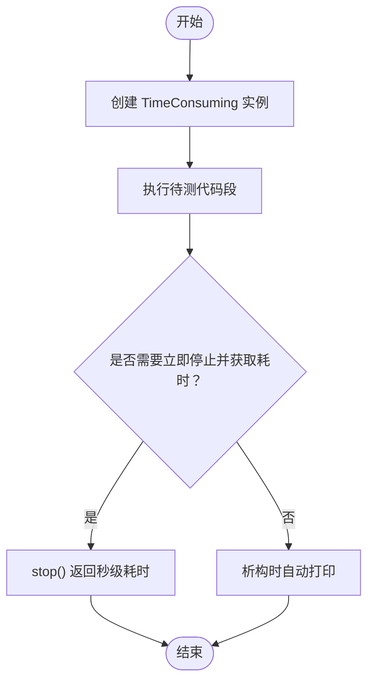
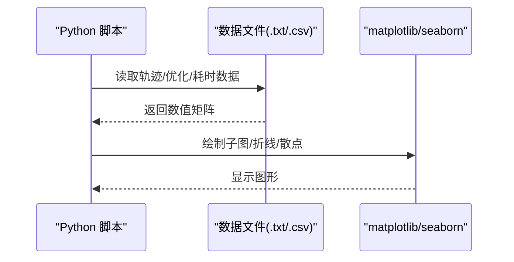
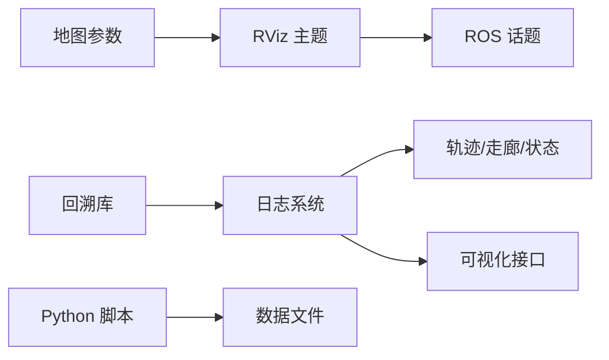

# 可视化与调试

<cite>
**本文引用的文件**
- [default.rviz](file://src/SUPER/super_planner/rviz/default.rviz)
- [bench.rviz](file://src/SUPER/super_planner/rviz/bench.rviz)
- [fpv.rviz](file://src/SUPER/super_planner/rviz/fpv.rviz)
- [log_utils.hpp](file://src/SUPER/super_planner/include/super_core/log_utils.hpp)
- [scope_timer.hpp](file://src/SUPER/super_planner/include/utils/header/scope_timer.hpp)
- [trajectory.cpp](file://src/SUPER/super_planner/src/utils/trajectory.cpp)
- [super_planner.cpp](file://src/SUPER/super_planner/src/super_core/super_planner.cpp)
- [main.py](file://src/SUPER/super_planner/scripts/main.py)
- [plot_lbfgs.py](file://src/SUPER/super_planner/scripts/plot_lbfgs.py)
- [plot_time_consuming.py](file://src/SUPER/super_planner/scripts/plot_time_consuming.py)
- [config.hpp](file://src/SUPER/rog_map/include/rog_map/rog_map_core/config.hpp)
- [backward.hpp](file://src/SUPER/super_planner/include/utils/header/backward.hpp)
</cite>

## 目录
1. [简介](#简介)
2. [项目结构](#项目结构)
3. [核心组件](#核心组件)
4. [架构总览](#架构总览)
5. [详细组件分析](#详细组件分析)
6. [依赖关系分析](#依赖关系分析)
7. [性能考量](#性能考量)
8. [故障排查指南](#故障排查指南)
9. [结论](#结论)
10. [附录](#附录)

## 简介
本文件面向可视化与调试系统，围绕以下目标展开：  
- RViz 可视化配置与主题使用，涵盖显示主题、话题订阅与显示参数设置  
- 日志系统实现与使用，包括命令日志、重规划日志的记录与分析  
- 性能统计与监控工具，包括轨迹质量评估与性能指标分析  
- 调试工具使用指南，断点设置、变量检查与性能分析  
- 常见问题诊断与解决方案  
- 使用 Python 脚本进行日志分析与可视化  
- 调试最佳实践与效率提升技巧  
- 自定义可视化工具的开发指南  

## 项目结构
本项目在 SUPER 工程中提供了完整的可视化与调试能力，主要分布在如下模块：
- 可视化配置：位于 super_planner 的 rviz 目录，包含多套 RViz 主题（默认、基准测试、第一人称视角）  
- 日志与性能：包含重规划日志类、性能计时器、轨迹质量评估工具  
- 数据分析：Python 脚本用于轨迹可视化与性能曲线绘制  
- 地图可视化：rog_map 提供地图与可视化的参数加载与范围控制  
- 调试支持：内建回溯库以辅助异常定位  

**图表来源**
- [default.rviz](file://src/SUPER/super_planner/rviz/default.rviz#L1-L484)
- [bench.rviz](file://src/SUPER/super_planner/rviz/bench.rviz#L1-L648)
- [fpv.rviz](file://src/SUPER/super_planner/rviz/fpv.rviz#L1-L383)
- [log_utils.hpp](file://src/SUPER/super_planner/include/super_core/log_utils.hpp#L1-L378)
- [scope_timer.hpp](file://src/SUPER/super_planner/include/utils/header/scope_timer.hpp#L1-L114)
- [trajectory.cpp](file://src/SUPER/super_planner/src/utils/trajectory.cpp#L153-L408)
- [super_planner.cpp](file://src/SUPER/super_planner/src/super_core/super_planner.cpp#L974-L987)
- [main.py](file://src/SUPER/super_planner/scripts/main.py#L1-L74)
- [plot_lbfgs.py](file://src/SUPER/super_planner/scripts/plot_lbfgs.py#L1-L31)
- [plot_time_consuming.py](file://src/SUPER/super_planner/scripts/plot_time_consuming.py#L1-L61)
- [config.hpp](file://src/SUPER/rog_map/include/rog_map/rog_map_core/config.hpp#L122-L140)
- [backward.hpp](file://src/SUPER/super_planner/include/utils/header/backward.hpp#L707-L4162)

**章节来源**
- [default.rviz](file://src/SUPER/super_planner/rviz/default.rviz#L1-L484)
- [bench.rviz](file://src/SUPER/super_planner/rviz/bench.rviz#L1-L648)
- [fpv.rviz](file://src/SUPER/super_planner/rviz/fpv.rviz#L1-L383)

## 核心组件
- RViz 可视化主题：提供默认、基准测试、第一人称视角三套主题，分别覆盖全局点云、前端路径、后端轨迹、安全飞行走廊、重规划日志等显示项  
- 重规划日志系统：集中记录一次重规划的输入输出、时间统计与可视化触发  
- 性能计时器：封装高精度计时与自动打印，支持重复次数与单位换算  
- 轨迹质量评估：提供速度/加速度/最大速率检查与轨迹片段提取  
- Python 分析脚本：轨迹可视化、LBFGS 收敛曲线、耗时统计折线图  
- 地图可视化参数：地图发布开关、动态重配置、帧率与范围控制  
- 调试回溯：异常栈追踪与源码片段打印，便于定位崩溃点  

**章节来源**
- [log_utils.hpp](file://src/SUPER/super_planner/include/super_core/log_utils.hpp#L1-L378)
- [scope_timer.hpp](file://src/SUPER/super_planner/include/utils/header/scope_timer.hpp#L1-L114)
- [trajectory.cpp](file://src/SUPER/super_planner/src/utils/trajectory.cpp#L153-L408)
- [main.py](file://src/SUPER/super_planner/scripts/main.py#L1-L74)
- [plot_lbfgs.py](file://src/SUPER/super_planner/scripts/plot_lbfgs.py#L1-L31)
- [plot_time_consuming.py](file://src/SUPER/super_planner/scripts/plot_time_consuming.py#L1-L61)
- [config.hpp](file://src/SUPER/rog_map/include/rog_map/rog_map_core/config.hpp#L122-L140)
- [backward.hpp](file://src/SUPER/super_planner/include/utils/header/backward.hpp#L707-L4162)

## 架构总览
可视化与调试体系由“配置层（RViz）—数据层（日志/计时/轨迹）—分析层（Python）—地图参数（rog_map）—调试支撑（回溯）”构成。

**图表来源**
- [default.rviz](file://src/SUPER/super_planner/rviz/default.rviz#L272-L423)
- [bench.rviz](file://src/SUPER/super_planner/rviz/bench.rviz#L227-L278)
- [fpv.rviz](file://src/SUPER/super_planner/rviz/fpv.rviz#L229-L281)
- [log_utils.hpp](file://src/SUPER/super_planner/include/super_core/log_utils.hpp#L60-L373)
- [scope_timer.hpp](file://src/SUPER/super_planner/include/utils/header/scope_timer.hpp#L33-L111)
- [trajectory.cpp](file://src/SUPER/super_planner/src/utils/trajectory.cpp#L153-L408)
- [main.py](file://src/SUPER/super_planner/scripts/main.py#L1-L74)
- [plot_lbfgs.py](file://src/SUPER/super_planner/scripts/plot_lbfgs.py#L1-L31)
- [plot_time_consuming.py](file://src/SUPER/super_planner/scripts/plot_time_consuming.py#L1-L61)
- [config.hpp](file://src/SUPER/rog_map/include/rog_map/rog_map_core/config.hpp#L122-L140)
- [backward.hpp](file://src/SUPER/super_planner/include/utils/header/backward.hpp#L707-L4162)

## 详细组件分析

### RViz 可视化配置与主题
- 默认主题（default.rviz）：启用全局点云、占用/未知地图、路径、里程计、坐标轴、MarkerArray/Marker 等；重点订阅轨迹/路径/重规划日志/地图边界等话题  
- 基准测试主题（bench.rviz）：强调前端/后端分组显示，包含 A* 前端路径、探索/备份安全飞行走廊、探索/备份轨迹、重规划日志点云/标记等  
- 第一人称视角（fpv.rviz）：聚焦目标点、已提交轨迹、探索/备份轨迹与机器人标记，适合机载视角调试  

使用建议：
- 在启动节点后，选择对应主题以聚焦所需模块  
- 通过“同步源”与“固定帧”统一时间轴，避免不同话题时间漂移  
- 合理设置队列大小与样式（点/线/盒子），平衡性能与可读性  

**章节来源**
- [default.rviz](file://src/SUPER/super_planner/rviz/default.rviz#L1-L484)
- [bench.rviz](file://src/SUPER/super_planner/rviz/bench.rviz#L1-L648)
- [fpv.rviz](file://src/SUPER/super_planner/rviz/fpv.rviz#L1-L383)

### 日志系统与重规划日志
- 日志类（LogOneReplan）：封装目标、状态、轨迹、走廊、时间统计与返回码，并提供序列化、可视化与重规划流程调用  
- 时间统计：包含映射、A*、探索/备份 SFC、优化、总耗时与可视化耗时  
- 可视化接口：将轨迹、走廊、点云与前端路径投递到 RViz 对应主题  

**图表来源**
- [log_utils.hpp](file://src/SUPER/super_planner/include/super_core/log_utils.hpp#L60-L373)

**章节来源**
- [log_utils.hpp](file://src/SUPER/super_planner/include/super_core/log_utils.hpp#L1-L378)

### 性能统计与监控工具
- 性能计时器（TimeConsuming）：构造/析构自动打印或手动 stop 返回耗时，支持重复次数与单位换算  
- 轨迹质量评估：最大速度/加速度速率检查、轨迹片段提取、状态查询（位置/速度/加速度/加急）  

**图表来源**
- [scope_timer.hpp](file://src/SUPER/super_planner/include/utils/header/scope_timer.hpp#L33-L111)

**章节来源**
- [scope_timer.hpp](file://src/SUPER/super_planner/include/utils/header/scope_timer.hpp#L1-L114)
- [trajectory.cpp](file://src/SUPER/super_planner/src/utils/trajectory.cpp#L153-L408)

### Python 日志分析与可视化
- 轨迹可视化（main.py）：从文本读取轨迹数据，绘制轨迹平面图与速度/加速度/加加速度随时间变化曲线，标注关键采样点  
- L-BFGS 收敛曲线（plot_lbfgs.py）：读取优化代价与梯度等列，绘制代价与各阶段耗时曲线  
- 性能耗时折线图（plot_time_consuming.py）：读取 CSV 中各类耗时，绘制随样本序号变化的折线图  

**图表来源**
- [main.py](file://src/SUPER/super_planner/scripts/main.py#L1-L74)
- [plot_lbfgs.py](file://src/SUPER/super_planner/scripts/plot_lbfgs.py#L1-L31)
- [plot_time_consuming.py](file://src/SUPER/super_planner/scripts/plot_time_consuming.py#L1-L61)

**章节来源**
- [main.py](file://src/SUPER/super_planner/scripts/main.py#L1-L74)
- [plot_lbfgs.py](file://src/SUPER/super_planner/scripts/plot_lbfgs.py#L1-L31)
- [plot_time_consuming.py](file://src/SUPER/super_planner/scripts/plot_time_consuming.py#L1-L61)

### 地图可视化参数与范围控制
- 参数项：可视化开关、动态重配置、未知地图发布、frame_id、time_rate、frame_rate、可视化范围  
- 范围校验：若任一维度非正，禁用可视化并提示  

**章节来源**
- [config.hpp](file://src/SUPER/rog_map/include/rog_map/rog_map_core/config.hpp#L122-L140)

### 调试工具与回溯支持
- 回溯库：提供栈追踪、源码片段打印与信号处理，便于定位崩溃点与上下文  
- 结合 RViz 与日志：先通过 RViz 观察异常现象，再用回溯定位具体函数与行号  

**章节来源**
- [backward.hpp](file://src/SUPER/super_planner/include/utils/header/backward.hpp#L707-L4162)

## 依赖关系分析
- RViz 主题依赖于 ROS 话题发布者（轨迹、路径、点云、标记等）  
- 日志系统依赖于轨迹与优化器输出，以及可视化接口  
- Python 脚本依赖于日志/轨迹数据文件  
- 地图参数影响 RViz 的地图显示与渲染性能  
- 回溯库独立于业务逻辑，仅在异常时启用  

**图表来源**
- [default.rviz](file://src/SUPER/super_planner/rviz/default.rviz#L272-L423)
- [log_utils.hpp](file://src/SUPER/super_planner/include/super_core/log_utils.hpp#L131-L135)
- [main.py](file://src/SUPER/super_planner/scripts/main.py#L4-L9)
- [config.hpp](file://src/SUPER/rog_map/include/rog_map/rog_map_core/config.hpp#L122-L140)
- [backward.hpp](file://src/SUPER/super_planner/include/utils/header/backward.hpp#L4160-L4162)

**章节来源**
- [default.rviz](file://src/SUPER/super_planner/rviz/default.rviz#L1-L484)
- [log_utils.hpp](file://src/SUPER/super_planner/include/super_core/log_utils.hpp#L1-L378)
- [main.py](file://src/SUPER/super_planner/scripts/main.py#L1-L74)
- [config.hpp](file://src/SUPER/rog_map/include/rog_map/rog_map_core/config.hpp#L122-L140)
- [backward.hpp](file://src/SUPER/super_planner/include/utils/header/backward.hpp#L707-L4162)

## 性能考量
- RViz 渲染开销：合理设置队列大小、样式与刷新频率，避免过多 MarkerArray 导致卡顿  
- 日志与可视化：在高频场景下，建议按需开启可视化或降低刷新频率  
- Python 分析：大数据集绘图前先采样或分段，避免内存与渲染压力  
- 计时粒度：对热点函数使用细粒度计时，结合日志汇总定位瓶颈  

[本节为通用指导，无需列出具体文件来源]

## 故障排查指南
- RViz 无显示或闪烁：检查固定帧、同步源与队列大小；确认对应话题已发布  
- 轨迹不连续：检查轨迹片段提取与时间边界，确保时间向量与点集长度一致  
- 重规划失败：查看返回码与日志类字段，核对探索/备份条件是否满足  
- 性能异常：使用 TimeConsuming 标注关键路径，结合 Python 折线图定位异常阶段  
- 崩溃定位：启用回溯库，结合 RViz 与日志复现问题  

**章节来源**
- [log_utils.hpp](file://src/SUPER/super_planner/include/super_core/log_utils.hpp#L316-L372)
- [trajectory.cpp](file://src/SUPER/super_planner/src/utils/trajectory.cpp#L213-L360)
- [scope_timer.hpp](file://src/SUPER/super_planner/include/utils/header/scope_timer.hpp#L33-L111)
- [backward.hpp](file://src/SUPER/super_planner/include/utils/header/backward.hpp#L4160-L4162)

## 结论
本系统通过多套 RViz 主题、完善的日志与性能统计、Python 分析脚本与地图参数控制，构建了从可视化到调试的完整闭环。建议在开发与评测中结合主题切换、计时标注与回溯定位，形成高效的问题发现与解决流程。

[本节为总结性内容，无需列出具体文件来源]

## 附录

### 调试最佳实践与效率提升技巧
- 断点设置：在轨迹优化与重规划入口处设置断点，逐步检查输入条件与中间结果  
- 变量检查：关注时间向量、点集长度、最大速率阈值与返回码  
- 性能分析：对 A*、SFC、优化三个阶段分别计时，定位最慢环节  
- 可视化策略：优先使用基准测试主题聚焦关键模块，再切换默认主题观察整体  

**章节来源**
- [super_planner.cpp](file://src/SUPER/super_planner/src/super_core/super_planner.cpp#L974-L987)
- [scope_timer.hpp](file://src/SUPER/super_planner/include/utils/header/scope_timer.hpp#L33-L111)

### 自定义可视化工具开发指南
- 基于现有主题扩展：在 RViz 中新增显示项，绑定对应话题，调整样式与颜色  
- 日志增强：在日志类中添加新字段与可视化函数，确保序列化兼容  
- Python 可视化：参考现有脚本的数据读取与绘图方式，扩展新的分析维度  
- 地图参数：通过参数文件控制地图发布与渲染范围，避免过度渲染  

**章节来源**
- [default.rviz](file://src/SUPER/super_planner/rviz/default.rviz#L272-L423)
- [log_utils.hpp](file://src/SUPER/super_planner/include/super_core/log_utils.hpp#L142-L154)
- [main.py](file://src/SUPER/super_planner/scripts/main.py#L1-L74)
- [config.hpp](file://src/SUPER/rog_map/include/rog_map/rog_map_core/config.hpp#L122-L140)