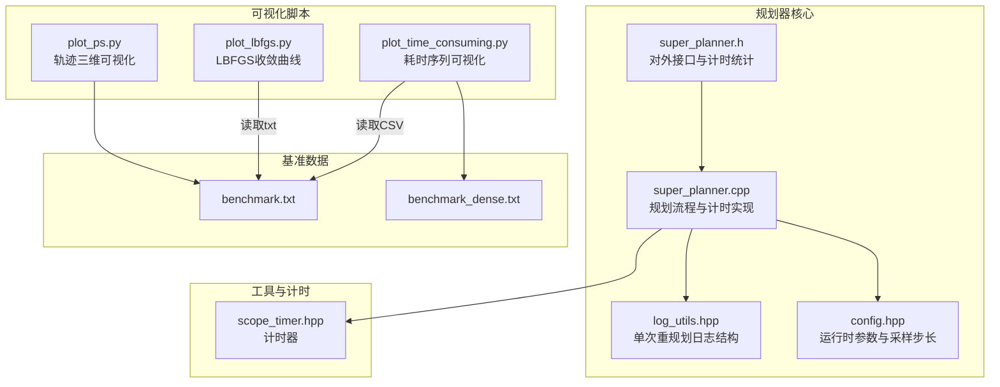
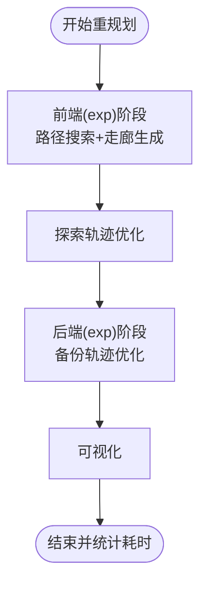
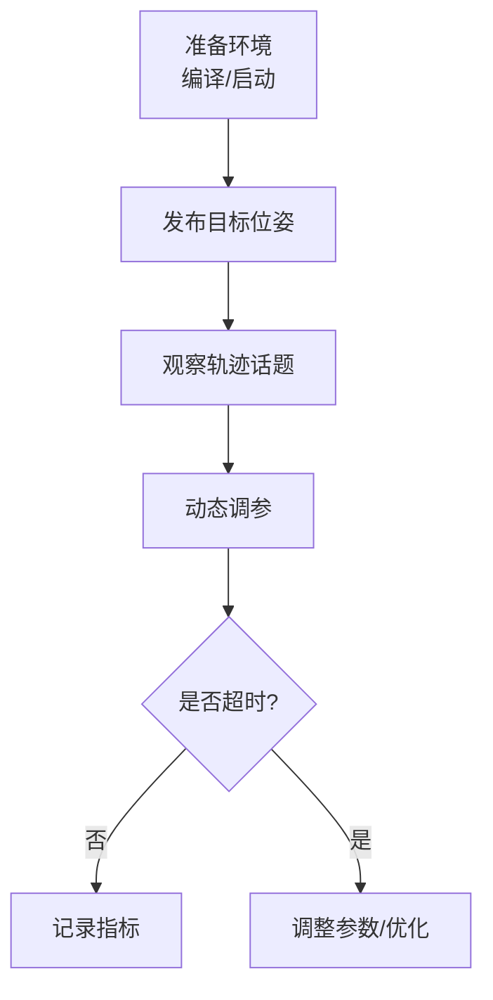
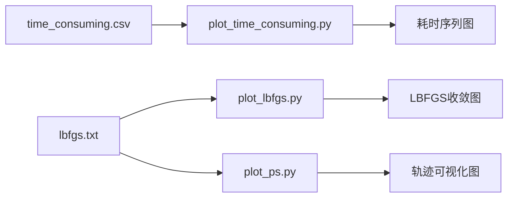
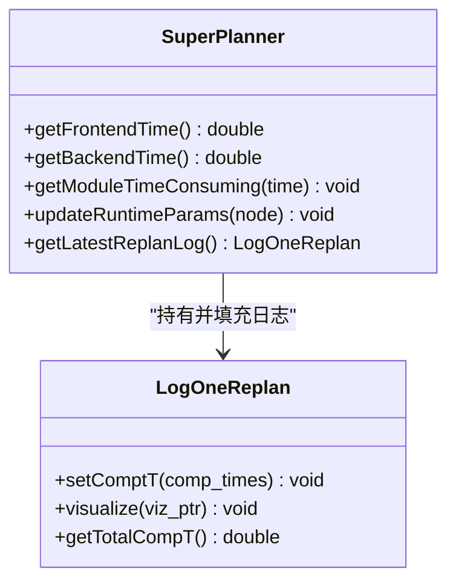
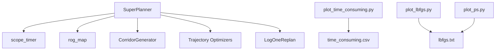

# 性能监控与分析

<cite>
**本文引用的文件**
- [QUICKSTART.md](file://src/SUPER/super_planner/docs/QUICKSTART.md)
- [log_utils.hpp](file://src/SUPER/super_planner/include/super_core/log_utils.hpp)
- [super_planner.h](file://src/SUPER/super_planner/include/super_core/super_planner.h)
- [super_planner.cpp](file://src/SUPER/super_planner/src/super_core/super_planner.cpp)
- [config.hpp](file://src/SUPER/super_planner/include/super_core/config.hpp)
- [plot_time_consuming.py](file://src/SUPER/super_planner/scripts/plot_time_consuming.py)
- [plot_lbfgs.py](file://src/SUPER/super_planner/scripts/plot_lbfgs.py)
- [plot_ps.py](file://src/SUPER/super_planner/scripts/plot_ps.py)
- [scope_timer.hpp](file://src/SUPER/super_planner/include/utils/header/scope_timer.hpp)
- [benchmark.txt](file://src/SUPER/mission_planner/data/benchmark.txt)
- [benchmark_dense.txt](file://src/SUPER/mission_planner/data/benchmark_dense.txt)
</cite>

## 目录
1. [简介](#简介)
2. [项目结构](#项目结构)
3. [核心组件](#核心组件)
4. [架构总览](#架构总览)
5. [详细组件分析](#详细组件分析)
6. [依赖关系分析](#依赖关系分析)
7. [性能考量](#性能考量)
8. [故障排查指南](#故障排查指南)
9. [结论](#结论)
10. [附录](#附录)

## 简介
本文件面向性能监控与分析系统，围绕SUPER规划器的性能指标、基准测试方法、可视化脚本与实时监控进行系统化说明。重点覆盖以下方面：
- 关键性能指标定义与测量方法：轨迹规划时间、A*搜索时间、轨迹优化时间等
- 基准测试流程与评估标准：参考快速开始文档中的步骤与指标
- Python可视化脚本：plot_time_consuming.py、plot_lbfgs.py、plot_ps.py的用途与使用方式
- 性能分析报告解读：图表含义、瓶颈识别与优化建议
- 实时性能监控：运行时数据采集与展示
- 性能调优最佳实践与常见问题解决方案

## 项目结构
本项目采用ROS2工作空间组织，与性能监控相关的核心目录与文件如下：
- 规划器核心与监控：src/SUPER/super_planner/include/super_core、src/SUPER/super_planner/src/super_core
- 性能可视化脚本：src/SUPER/super_planner/scripts
- 基准数据：src/SUPER/mission_planner/data
- 快速开始与性能基准说明：src/SUPER/super_planner/docs/QUICKSTART.md



**图表来源**
- [super_planner.h](file://src/SUPER/super_planner/include/super_core/super_planner.h#L104-L296)
- [super_planner.cpp](file://src/SUPER/super_planner/src/super_core/super_planner.cpp#L382-L385)
- [log_utils.hpp](file://src/SUPER/super_planner/include/super_core/log_utils.hpp#L30-L54)
- [config.hpp](file://src/SUPER/super_planner/include/super_core/config.hpp#L158-L228)
- [plot_time_consuming.py](file://src/SUPER/super_planner/scripts/plot_time_consuming.py#L1-L61)
- [plot_lbfgs.py](file://src/SUPER/super_planner/scripts/plot_lbfgs.py#L1-L31)
- [plot_ps.py](file://src/SUPER/super_planner/scripts/plot_ps.py#L1-L40)
- [scope_timer.hpp](file://src/SUPER/super_planner/include/utils/header/scope_timer.hpp)

**章节来源**
- [super_planner.h](file://src/SUPER/super_planner/include/super_core/super_planner.h#L104-L296)
- [super_planner.cpp](file://src/SUPER/super_planner/src/super_core/super_planner.cpp#L382-L385)
- [log_utils.hpp](file://src/SUPER/super_planner/include/super_core/log_utils.hpp#L30-L54)
- [config.hpp](file://src/SUPER/super_planner/include/super_core/config.hpp#L158-L228)
- [plot_time_consuming.py](file://src/SUPER/super_planner/scripts/plot_time_consuming.py#L1-L61)
- [plot_lbfgs.py](file://src/SUPER/super_planner/scripts/plot_lbfgs.py#L1-L31)
- [plot_ps.py](file://src/SUPER/super_planner/scripts/plot_ps.py#L1-L40)
- [benchmark.txt](file://src/SUPER/mission_planner/data/benchmark.txt#L1-L2)
- [benchmark_dense.txt](file://src/SUPER/mission_planner/data/benchmark_dense.txt#L1-L2)

## 核心组件
- 性能计时与统计
  - 前端与后端时间统计：提供前端平均时间与后端平均时间接口，用于评估规划阶段的耗时分布
  - 单次重规划日志：记录目标、状态、走廊、轨迹与各阶段耗时，便于回放与分析
- 规划流程与计时点
  - 重规划全流程包含：前端（路径搜索、走廊生成）、优化（探索轨迹、备份轨迹）、可视化等阶段
  - 通过计时器对关键步骤进行采样与累加，形成模块化耗时数组
- 运行时参数与采样步长
  - 提供运行时参数热更新能力，动态调整轨迹优化边界与惩罚项，影响整体性能
  - 采样步长由分辨率与最大速度决定，影响轨迹采样密度与计算量

**章节来源**
- [super_planner.h](file://src/SUPER/super_planner/include/super_core/super_planner.h#L207-L234)
- [super_planner.cpp](file://src/SUPER/super_planner/src/super_core/super_planner.cpp#L182-L312)
- [log_utils.hpp](file://src/SUPER/super_planner/include/super_core/log_utils.hpp#L94-L301)
- [config.hpp](file://src/SUPER/super_planner/include/super_core/config.hpp#L158-L228)

## 架构总览
下图展示了规划器在一次重规划中的关键计时点与数据流。

```mermaid
sequenceDiagram
participant Node as "ROS节点"
participant Planner as "SuperPlanner"
participant Timer as "计时器(scope_timer)"
participant Map as "地图(rog_map)"
participant CG as "走廊生成器"
participant Opt as "轨迹优化器"
Node->>Planner : "ReplanOnce(目标, 偏航, 新目标)"
Planner->>Timer : "开始计时(ReplanOnce)"
Planner->>Map : "局部起点查找/占用检查"
Planner->>Planner : "前端(exp)时间统计"
Planner->>CG : "沿引导路径搜索SFC"
CG-->>Planner : "返回SFC与可视化"
Planner->>Opt : "探索轨迹优化"
Opt-->>Planner : "返回优化轨迹"
Planner->>Planner : "后端(exp)时间统计"
Planner->>Opt : "备份轨迹优化"
Opt-->>Planner : "返回备份轨迹"
Planner->>Timer : "结束计时(ReplanOnce)"
Planner-->>Node : "提交轨迹/返回状态"
```

**图表来源**
- [super_planner.cpp](file://src/SUPER/super_planner/src/super_core/super_planner.cpp#L178-L312)
- [scope_timer.hpp](file://src/SUPER/super_planner/include/utils/header/scope_timer.hpp)

**章节来源**
- [super_planner.cpp](file://src/SUPER/super_planner/src/super_core/super_planner.cpp#L178-L312)

## 详细组件分析

### 性能指标定义与测量方法
- 轨迹规划时间
  - 定义：一次完整的重规划耗时，包含前端与后端阶段
  - 测量：通过计时器记录ReplanOnce总耗时，并与重规划阈值比较
- A*搜索时间
  - 定义：路径搜索阶段耗时
  - 测量：前端(exp)阶段计时，包含引导路径生成与走廊生成
- 轨迹优化时间
  - 定义：探索轨迹与备份轨迹优化阶段耗时
  - 测量：分别记录探索轨迹优化与备份轨迹优化的耗时
- 可视化时间
  - 定义：规划过程中可视化操作耗时
  - 测量：对可视化调用进行计时并累加
- 平均前端/后端时间
  - 定义：前端与后端阶段的平均耗时，用于长期趋势观察
  - 测量：维护累计耗时与计数，在查询时返回平均值并清零



**图表来源**
- [super_planner.cpp](file://src/SUPER/super_planner/src/super_core/super_planner.cpp#L387-L800)
- [log_utils.hpp](file://src/SUPER/super_planner/include/super_core/log_utils.hpp#L94-L301)

**章节来源**
- [super_planner.h](file://src/SUPER/super_planner/include/super_core/super_planner.h#L207-L234)
- [super_planner.cpp](file://src/SUPER/super_planner/src/super_core/super_planner.cpp#L242-L248)
- [log_utils.hpp](file://src/SUPER/super_planner/include/super_core/log_utils.hpp#L94-L301)

### 基准测试方法与流程
- 快速开始中的基准测试步骤
  - 启动规划器与RViz，发布目标位姿，观察轨迹话题输出
  - 通过参数服务器动态调整轨迹边界与惩罚项，观察响应
- 评估标准
  - 典型性能指标（摘自快速开始文档）：路径搜索耗时、走廊生成耗时、轨迹优化耗时、总规划耗时、轨迹跟踪频率
  - 重规划超时阈值：超过重规划前向时间步长的90%即视为超时，需检查参数



**图表来源**
- [QUICKSTART.md](file://src/SUPER/super_planner/docs/QUICKSTART.md#L1-L407)

**章节来源**
- [QUICKSTART.md](file://src/SUPER/super_planner/docs/QUICKSTART.md#L1-L407)

### Python脚本工具使用说明
- plot_time_consuming.py
  - 功能：读取CSV格式的耗时数据，绘制不同类型的耗时随样本序号的变化折线图
  - 输入：time_consuming.csv（第一行为类型标签，后续为数值矩阵）
  - 输出：按类型分组的折线图
- plot_lbfgs.py
  - 功能：读取lbfgs.txt，绘制目标函数值与状态变量序列曲线
  - 输入：lbfgs.txt（包含代价、状态等列）
  - 输出：多子图展示收敛过程
- plot_ps.py
  - 功能：读取lbfgs.txt，绘制三维轨迹与二维轨迹投影
  - 输入：lbfgs.txt
  - 输出：3D轨迹图与XY投影图



**图表来源**
- [plot_time_consuming.py](file://src/SUPER/super_planner/scripts/plot_time_consuming.py#L1-L61)
- [plot_lbfgs.py](file://src/SUPER/super_planner/scripts/plot_lbfgs.py#L1-L31)
- [plot_ps.py](file://src/SUPER/super_planner/scripts/plot_ps.py#L1-L40)

**章节来源**
- [plot_time_consuming.py](file://src/SUPER/super_planner/scripts/plot_time_consuming.py#L1-L61)
- [plot_lbfgs.py](file://src/SUPER/super_planner/scripts/plot_lbfgs.py#L1-L31)
- [plot_ps.py](file://src/SUPER/super_planner/scripts/plot_ps.py#L1-L40)

### 性能分析报告解读指南
- 图表含义
  - 耗时序列图：反映各阶段耗时随样本变化的趋势，可用于识别异常波动
  - LBFGS收敛图：展示优化过程中的代价与状态变化，判断收敛性与稳定性
  - 轨迹可视化图：核对轨迹形状与投影，辅助定位轨迹质量与冲突点
- 性能瓶颈识别
  - 若前端耗时占比高，优先检查A*搜索与走廊生成参数
  - 若优化耗时高，关注轨迹优化的边界与惩罚项设置
  - 若可视化耗时高，考虑减少可视化频率或简化可视化内容
- 优化建议
  - 调整分辨率与规划时域，平衡精度与性能
  - 适度放宽优化精度，降低迭代次数
  - 合理设置重规划阈值，避免频繁重规划

**章节来源**
- [plot_time_consuming.py](file://src/SUPER/super_planner/scripts/plot_time_consuming.py#L1-L61)
- [plot_lbfgs.py](file://src/SUPER/super_planner/scripts/plot_lbfgs.py#L1-L31)
- [plot_ps.py](file://src/SUPER/super_planner/scripts/plot_ps.py#L1-L40)

### 实时性能监控实现
- 运行时数据采集
  - 通过计时器在关键阶段记录耗时，维护前端/后端平均耗时
  - 提供模块化耗时数组，便于按阶段统计与对比
- 数据展示
  - 通过日志输出平均规划时间与最新重规划日志
  - 结合RViz订阅轨迹话题，实时观察规划结果
- 参数热更新
  - 支持运行时从参数服务器同步参数，动态调整轨迹优化边界与惩罚项



**图表来源**
- [super_planner.h](file://src/SUPER/super_planner/include/super_core/super_planner.h#L136-L234)
- [log_utils.hpp](file://src/SUPER/super_planner/include/super_core/log_utils.hpp#L60-L135)

**章节来源**
- [super_planner.h](file://src/SUPER/super_planner/include/super_core/super_planner.h#L136-L234)
- [super_planner.cpp](file://src/SUPER/super_planner/src/super_core/super_planner.cpp#L241-L295)
- [log_utils.hpp](file://src/SUPER/super_planner/include/super_core/log_utils.hpp#L60-L135)

## 依赖关系分析
- 组件耦合
  - SuperPlanner与计时器、地图、走廊生成器、轨迹优化器存在直接依赖
  - 日志结构LogOneReplan承载跨模块的数据，便于统一分析
- 外部依赖
  - Python脚本依赖pandas、numpy、matplotlib、seaborn进行可视化
  - 基准数据文件用于脚本输入



**图表来源**
- [super_planner.h](file://src/SUPER/super_planner/include/super_core/super_planner.h#L38-L70)
- [super_planner.cpp](file://src/SUPER/super_planner/src/super_core/super_planner.cpp#L32-L74)
- [log_utils.hpp](file://src/SUPER/super_planner/include/super_core/log_utils.hpp#L60-L95)
- [plot_time_consuming.py](file://src/SUPER/super_planner/scripts/plot_time_consuming.py#L1-L61)
- [plot_lbfgs.py](file://src/SUPER/super_planner/scripts/plot_lbfgs.py#L1-L31)
- [plot_ps.py](file://src/SUPER/super_planner/scripts/plot_ps.py#L1-L40)

**章节来源**
- [super_planner.h](file://src/SUPER/super_planner/include/super_core/super_planner.h#L38-L70)
- [super_planner.cpp](file://src/SUPER/super_planner/src/super_core/super_planner.cpp#L32-L74)
- [log_utils.hpp](file://src/SUPER/super_planner/include/super_core/log_utils.hpp#L60-L95)
- [plot_time_consuming.py](file://src/SUPER/super_planner/scripts/plot_time_consuming.py#L1-L61)
- [plot_lbfgs.py](file://src/SUPER/super_planner/scripts/plot_lbfgs.py#L1-L31)
- [plot_ps.py](file://src/SUPER/super_planner/scripts/plot_ps.py#L1-L40)

## 性能考量
- 指标范围参考
  - 路径搜索耗时：30–50ms（取决于距离与分辨率）
  - 走廊生成耗时：10–20ms（线性复杂度）
  - 轨迹优化耗时：100–200ms（LBFGS迭代）
  - 总规划耗时：150–400ms（完整周期）
  - 轨迹跟踪频率：50–100Hz（命令生成）
- 影响因素
  - 地图分辨率与规划时域
  - A*搜索参数（分辨率、最大搜索时间）
  - 轨迹优化精度与惩罚项
  - 可视化开销与频率

**章节来源**
- [QUICKSTART.md](file://src/SUPER/super_planner/docs/QUICKSTART.md#L365-L376)

## 故障排查指南
- 重规划超时
  - 现象：重规划耗时超过阈值
  - 排查：检查A*搜索参数、走廊生成复杂度、优化精度
- 规划失败
  - 现象：返回码指示规划失败
  - 排查：确认目标可达性、地图更新、参数合理性
- 轨迹碰撞
  - 现象：轨迹与障碍物冲突
  - 排查：增加膨胀步数、加强位置/加速度约束
- 可视化异常
  - 现象：RViz无显示或显示异常
  - 排查：确认订阅话题、可视化开关、日志级别

**章节来源**
- [super_planner.cpp](file://src/SUPER/super_planner/src/super_core/super_planner.cpp#L250-L254)
- [QUICKSTART.md](file://src/SUPER/super_planner/docs/QUICKSTART.md#L277-L304)

## 结论
本系统通过模块化的计时统计、可扩展的日志结构与Python可视化脚本，实现了对规划器性能的全面监控与分析。结合快速开始文档中的基准测试流程与评估标准，用户可以持续观测关键指标、识别瓶颈并进行针对性优化，从而在保证安全性的同时提升规划效率与实时性。

## 附录
- 基准数据文件
  - benchmark.txt、benchmark_dense.txt用于脚本输入，支撑性能分析与回归测试
- 运行时参数
  - 通过参数服务器动态更新轨迹优化边界与惩罚项，支持在线调参与验证

**章节来源**
- [benchmark.txt](file://src/SUPER/mission_planner/data/benchmark.txt#L1-L2)
- [benchmark_dense.txt](file://src/SUPER/mission_planner/data/benchmark_dense.txt#L1-L2)
- [config.hpp](file://src/SUPER/super_planner/include/super_core/config.hpp#L158-L228)