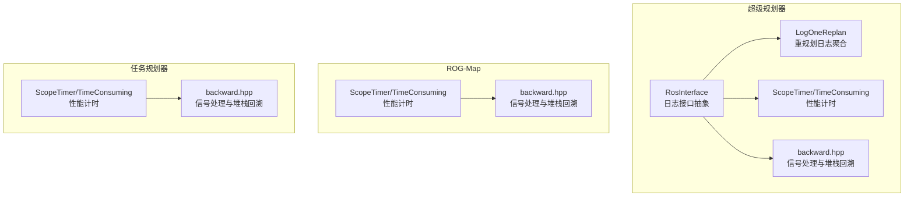
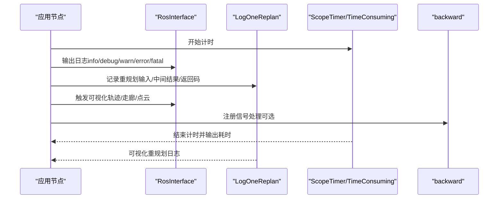
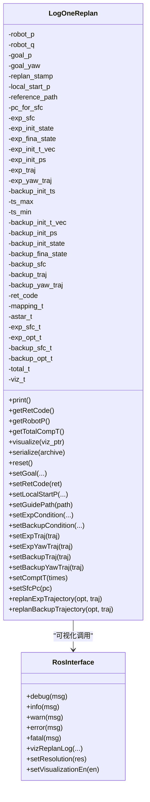
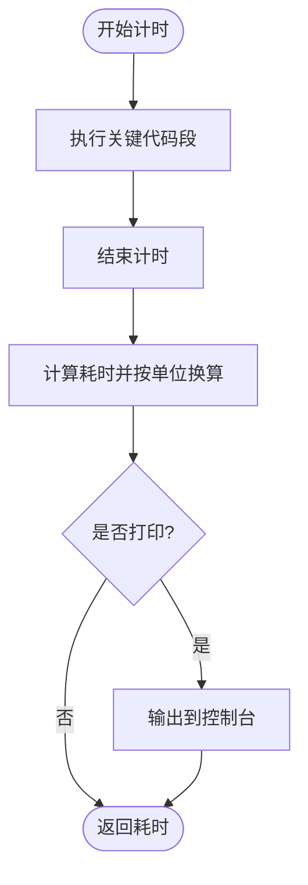
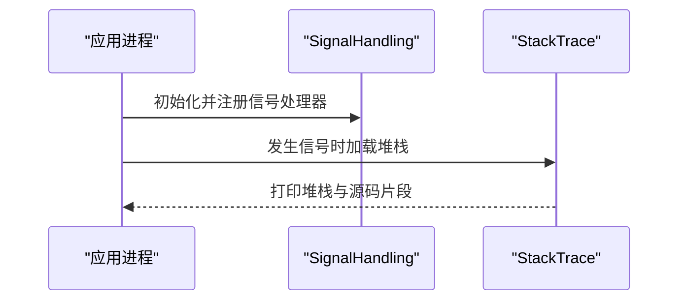
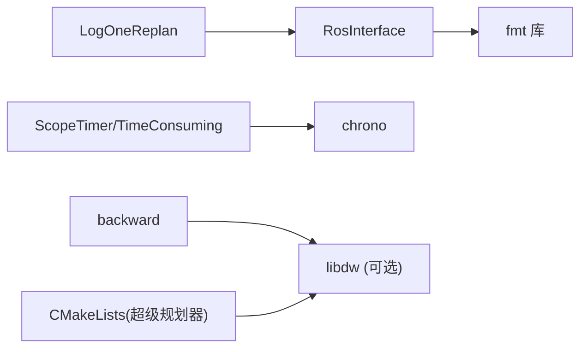

# 日志系统与调试

<cite>
**本文引用的文件**
- [log_utils.hpp](file://src/SUPER/super_planner/include/super_core/log_utils.hpp)
- [ros_interface.hpp](file://src/SUPER/super_planner/include/ros_interface/ros_interface.hpp)
- [scope_timer.hpp（ROG-Map）](file://src/SUPER/rog_map/include/super_utils/scope_timer.hpp)
- [scope_timer.hpp（Mission Planner）](file://src/SUPER/mission_planner/include/utils/scope_timer.hpp)
- [backward.hpp（超级规划器）](file://src/SUPER/super_planner/include/utils/header/backward.hpp)
- [backward.hpp（ROG-Map）](file://src/SUPER/rog_map/include/super_utils/backward.hpp)
- [backward.hpp（任务规划器）](file://src/SUPER/mission_planner/include/utils/backward.hpp)
- [fsm_node_ros2.cpp](file://src/SUPER/super_planner/Apps/fsm_node_ros2.cpp)
- [CMakeLists.txt（超级规划器）](file://src/SUPER/super_planner/CMakeLists.txt)
- [CMakeLists.txt（ROG-Map）](file://src/SUPER/rog_map/CMakeLists.txt)
- [color.h（格式化输出）](file://src/SUPER/super_planner/include/fmt/color.h)
</cite>

## 目录
1. [简介](#简介)
2. [项目结构](#项目结构)
3. [核心组件](#核心组件)
4. [架构总览](#架构总览)
5. [详细组件分析](#详细组件分析)
6. [依赖关系分析](#依赖关系分析)
7. [性能考量](#性能考量)
8. [故障排查指南](#故障排查指南)
9. [结论](#结论)
10. [附录](#附录)

## 简介
本文件面向日志系统与调试功能，聚焦以下方面：
- 日志记录机制：命令日志、重规划日志、性能统计日志的记录与存储方式
- 日志级别：DEBUG、INFO、WARN、ERROR、FATAL 的分类与使用场景
- 日志文件组织：自动创建、轮转与清理策略（若无显式实现则给出建议）
- 日志分析工具：内容解析、性能指标提取、错误诊断分析
- 调试工具：断点设置、变量检查、内存泄漏检测
- 常见问题诊断与最佳实践

## 项目结构
该仓库采用多包结构，日志与调试能力主要分布在“超级规划器”、“ROG-Map”、“任务规划器”等模块中。日志接口通过统一的 RosInterface 抽象，结合 fmt 库进行格式化输出；性能统计通过 ScopeTimer/TimeConsuming 类实现；异常与崩溃时的堆栈回溯由 backward 库提供。

图表来源
- [ros_interface.hpp](file://src/SUPER/super_planner/include/ros_interface/ros_interface.hpp#L43-L149)
- [log_utils.hpp](file://src/SUPER/super_planner/include/super_core/log_utils.hpp#L60-L373)
- [scope_timer.hpp（ROG-Map）](file://src/SUPER/rog_map/include/super_utils/scope_timer.hpp#L33-L111)
- [scope_timer.hpp（Mission Planner）](file://src/SUPER/mission_planner/include/utils/scope_timer.hpp#L33-L111)
- [backward.hpp（超级规划器）](file://src/SUPER/super_planner/include/utils/header/backward.hpp#L4469-L4477)
- [backward.hpp（ROG-Map）](file://src/SUPER/rog_map/include/super_utils/backward.hpp#L4469-L4477)
- [backward.hpp（任务规划器）](file://src/SUPER/mission_planner/include/utils/backward.hpp#L4469-L4477)

章节来源
- [CMakeLists.txt（超级规划器）](file://src/SUPER/super_planner/CMakeLists.txt#L1-L188)
- [CMakeLists.txt（ROG-Map）](file://src/SUPER/rog_map/CMakeLists.txt#L1-L114)

## 核心组件
- RosInterface：定义统一的日志接口（debug/info/warn/error/fatal），并提供格式化工具与可视化接口。
- LogOneReplan：封装一次重规划过程中的关键数据与统计时间，并支持序列化与可视化。
- ScopeTimer/TimeConsuming：高精度计时器，支持自动单位换算与可选打印。
- backward：在 Linux 平台下捕获信号并打印堆栈，辅助定位崩溃原因。

章节来源
- [ros_interface.hpp](file://src/SUPER/super_planner/include/ros_interface/ros_interface.hpp#L43-L149)
- [log_utils.hpp](file://src/SUPER/super_planner/include/super_core/log_utils.hpp#L60-L373)
- [scope_timer.hpp（ROG-Map）](file://src/SUPER/rog_map/include/super_utils/scope_timer.hpp#L33-L111)
- [scope_timer.hpp（Mission Planner）](file://src/SUPER/mission_planner/include/utils/scope_timer.hpp#L33-L111)
- [backward.hpp（超级规划器）](file://src/SUPER/super_planner/include/utils/header/backward.hpp#L4469-L4477)

## 架构总览
日志与调试在运行时的交互流程如下：

图表来源
- [ros_interface.hpp](file://src/SUPER/super_planner/include/ros_interface/ros_interface.hpp#L57-L124)
- [log_utils.hpp](file://src/SUPER/super_planner/include/super_core/log_utils.hpp#L131-L135)
- [scope_timer.hpp（ROG-Map）](file://src/SUPER/rog_map/include/super_utils/scope_timer.hpp#L54-L102)
- [fsm_node_ros2.cpp](file://src/SUPER/super_planner/Apps/fsm_node_ros2.cpp#L32-L39)

## 详细组件分析

### 日志接口与级别
- 接口定义：RosInterface 提供 debug/info/warn/error/fatal 五级日志方法，并内置格式化工具，便于 printf 风格的格式化输出。
- 使用场景：
  - DEBUG：开发阶段的内部状态、中间变量、路径选择细节
  - INFO：常规流程提示、关键事件、配置加载完成
  - WARN：潜在风险或非致命异常（如参数边界警告）
  - ERROR：操作失败、资源不可用、算法异常
  - FATAL：严重错误导致程序无法继续运行
- 输出介质：当前代码通过 fmt 进行控制台彩色输出与格式化；未发现显式的文件落盘逻辑。

章节来源
- [ros_interface.hpp](file://src/SUPER/super_planner/include/ros_interface/ros_interface.hpp#L52-L87)
- [color.h（格式化输出）](file://src/SUPER/super_planner/include/fmt/color.h#L160-L538)

### 重规划日志（LogOneReplan）
- 职责：记录一次重规划的完整生命周期数据，包括目标、机器人状态、参考路径、安全飞行走廊、探索/备份轨迹及其优化前后状态、返回码与各阶段耗时。
- 关键字段：
  - 目标与机器人状态、局部起点、参考路径
  - 探索轨迹的初始/最终状态、时间向量、位置点、轨迹与偏航轨迹
  - 备份轨迹的时间范围、初始状态、走廊与轨迹
  - 各阶段耗时（映射/A*、探索优化、备份优化、可视化、总耗时）
- 可视化：通过 RosInterface 的可视化接口将轨迹、走廊、点云与返回码投递到 RViz。
- 序列化：支持 cereal 序列化，便于持久化与传输。

图表来源
- [log_utils.hpp](file://src/SUPER/super_planner/include/super_core/log_utils.hpp#L60-L373)
- [ros_interface.hpp](file://src/SUPER/super_planner/include/ros_interface/ros_interface.hpp#L121-L124)

章节来源
- [log_utils.hpp](file://src/SUPER/super_planner/include/super_core/log_utils.hpp#L60-L373)

### 性能统计日志（ScopeTimer/TimeConsuming）
- 功能：以 RAII 方式自动记录一段代码的执行时间，支持重复次数平均、自动单位换算（ns/us/ms/s）、可选打印。
- 使用建议：
  - 将计时器置于关键路径（如 A*、轨迹优化、可视化）前后，形成“前端/优化/生成/总重规划/可视化”的时间统计。
  - 在 LogOneReplan 中对应设置 setComptT，汇总到 total_t。

图表来源
- [scope_timer.hpp（ROG-Map）](file://src/SUPER/rog_map/include/super_utils/scope_timer.hpp#L54-L102)
- [scope_timer.hpp（Mission Planner）](file://src/SUPER/mission_planner/include/utils/scope_timer.hpp#L54-L102)

章节来源
- [scope_timer.hpp（ROG-Map）](file://src/SUPER/rog_map/include/super_utils/scope_timer.hpp#L33-L111)
- [scope_timer.hpp（Mission Planner）](file://src/SUPER/mission_planner/include/utils/scope_timer.hpp#L33-L111)
- [log_utils.hpp](file://src/SUPER/super_planner/include/super_core/log_utils.hpp#L295-L301)

### 调试工具与崩溃回溯（backward）
- 作用：在 Linux 平台下捕获信号（如 SIGSEGV），打印堆栈信息，辅助定位崩溃原因。
- 配置：在入口处定义宏并包含头文件，初始化 SignalHandling。
- 注意：backward 仅在 Linux 下启用，且需链接 DWARF 支持库（如 libdw）。

图表来源
- [fsm_node_ros2.cpp](file://src/SUPER/super_planner/Apps/fsm_node_ros2.cpp#L32-L39)
- [backward.hpp（超级规划器）](file://src/SUPER/super_planner/include/utils/header/backward.hpp#L4469-L4477)

章节来源
- [fsm_node_ros2.cpp](file://src/SUPER/super_planner/Apps/fsm_node_ros2.cpp#L32-L39)
- [backward.hpp（超级规划器）](file://src/SUPER/super_planner/include/utils/header/backward.hpp#L136-L4495)
- [backward.hpp（ROG-Map）](file://src/SUPER/rog_map/include/super_utils/backward.hpp#L136-L4495)
- [backward.hpp（任务规划器）](file://src/SUPER/mission_planner/include/utils/backward.hpp#L136-L4495)

## 依赖关系分析
- 日志接口依赖 fmt 进行格式化与彩色输出。
- 性能计时器依赖 chrono 高精度时钟。
- 崩溃回溯依赖 backward 库，Linux 下默认启用多种后端（libdw/libbfd/libdwarf/backtrace/unwind）。
- CMake 配置中超级规划器显式链接 -ldw，表明期望使用 DWARF 支持。

图表来源
- [CMakeLists.txt（超级规划器）](file://src/SUPER/super_planner/CMakeLists.txt#L54-L59)
- [CMakeLists.txt（ROG-Map）](file://src/SUPER/rog_map/CMakeLists.txt#L37-L37)

章节来源
- [CMakeLists.txt（超级规划器）](file://src/SUPER/super_planner/CMakeLists.txt#L54-L59)
- [CMakeLists.txt（ROG-Map）](file://src/SUPER/rog_map/CMakeLists.txt#L37-L37)

## 性能考量
- 计时粒度：使用高分辨率时钟，避免频繁打印带来的开销；可通过构造函数参数控制是否打印。
- 统计维度：建议将映射、A*、探索轨迹优化、备份轨迹优化、可视化分别计时，汇总到 total_t，便于瓶颈定位。
- 可视化成本：可视化通常为 I/O 密集，应与核心算法分离，避免影响实时性。

章节来源
- [scope_timer.hpp（ROG-Map）](file://src/SUPER/rog_map/include/super_utils/scope_timer.hpp#L33-L111)
- [log_utils.hpp](file://src/SUPER/super_planner/include/super_core/log_utils.hpp#L295-L301)

## 故障排查指南
- 控制台彩色输出：若终端不支持颜色，可调整 fmt 的颜色模式或禁用彩色输出。
- 崩溃定位：
  - 确认已定义 BACKWARD_HAS_DW 或其他后端宏
  - 确保链接了 -ldw（CMake 已添加）
  - 在 Linux 下编译时开启调试符号（-g）
- 日志缺失：
  - 若未看到文件输出，确认当前实现仅使用控制台输出，未集成文件落盘
  - 如需文件日志，可在 RosInterface 的具体实现中扩展文件句柄与轮转逻辑

章节来源
- [fsm_node_ros2.cpp](file://src/SUPER/super_planner/Apps/fsm_node_ros2.cpp#L32-L39)
- [CMakeLists.txt（超级规划器）](file://src/SUPER/super_planner/CMakeLists.txt#L54-L59)

## 结论
本项目通过 RosInterface 抽象出统一的日志接口，配合 LogOneReplan 实现重规划过程的完整记录；通过 ScopeTimer/TimeConsuming 提供高精度性能统计；通过 backward 提供崩溃时的堆栈回溯能力。当前实现以控制台输出为主，未发现显式的文件落盘与轮转逻辑，建议在生产环境中补充文件日志与轮转策略，以满足长期运行与审计需求。

## 附录
- 日志级别建议使用场景
  - DEBUG：开发调试、中间变量检查
  - INFO：流程提示、关键事件
  - WARN：非致命异常、边界警告
  - ERROR：操作失败、资源不可用
  - FATAL：不可恢复错误
- 性能指标提取建议
  - 分解到映射/A*、探索优化、备份优化、可视化、总耗时
  - 对比不同配置下的指标变化，定位瓶颈
- 文件日志与轮转（建议）
  - 在 RosInterface 具体实现中增加文件句柄与缓冲
  - 使用滚动策略（按大小或时间）进行轮转
  - 清理过期日志，保留最近 N 天或 M 份文件