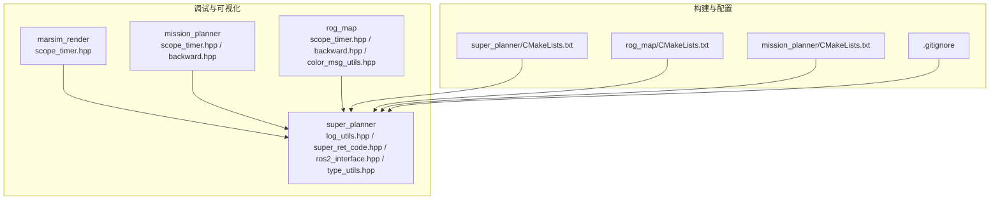
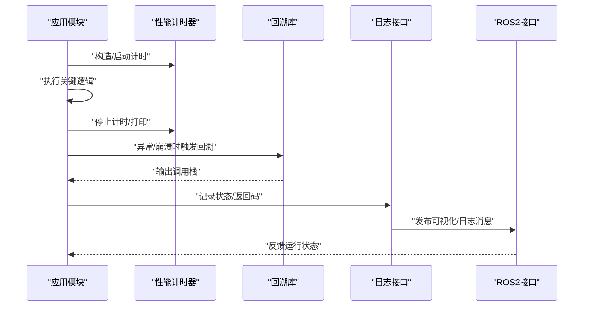
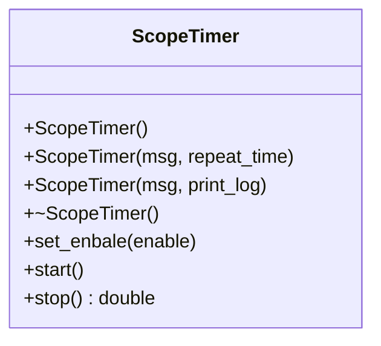
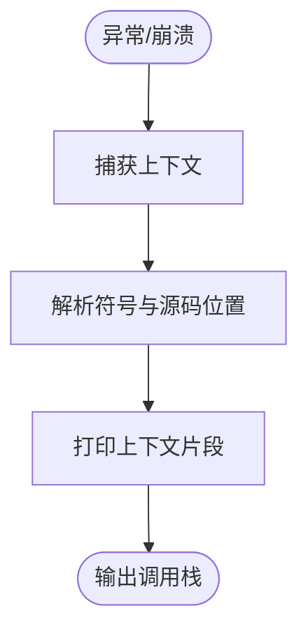
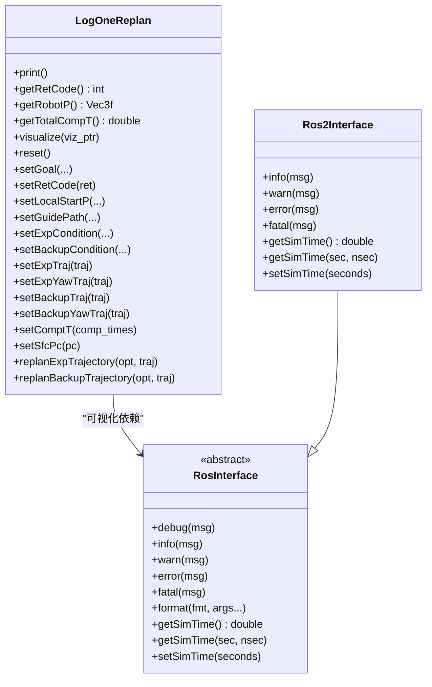
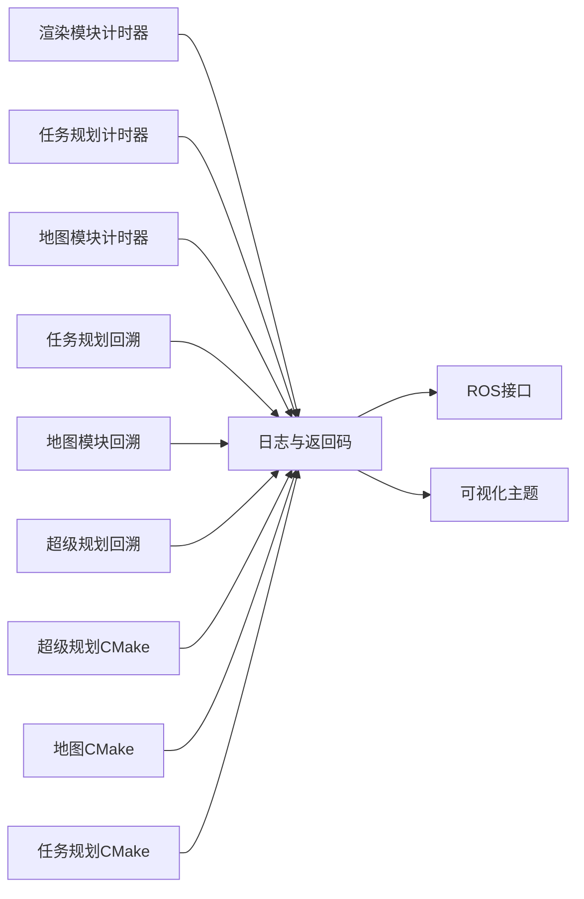

# 调试工具与故障排除

<cite>
**本文引用的文件**
- [scope_timer.hpp（渲染模块）](file://src/SUPER/mars_uav_sim/marsim_render/include/marsim_render/scope_timer.hpp)
- [scope_timer.hpp（任务规划模块）](file://src/SUPER/mission_planner/include/utils/scope_timer.hpp)
- [scope_timer.hpp（地图模块）](file://src/SUPER/rog_map/include/super_utils/scope_timer.hpp)
- [scope_timer.hpp（超级规划模块）](file://src/SUPER/super_planner/include/utils/header/scope_timer.hpp)
- [backward.hpp（任务规划模块）](file://src/SUPER/mission_planner/include/utils/backward.hpp)
- [backward.hpp（地图模块）](file://src/SUPER/rog_map/include/super_utils/backward.hpp)
- [backward.hpp（超级规划模块）](file://src/SUPER/super_planner/include/utils/header/backward.hpp)
- [log_utils.hpp（超级规划核心）](file://src/SUPER/super_planner/include/super_core/log_utils.hpp)
- [super_ret_code.hpp（超级规划返回码）](file://src/SUPER/super_planner/include/super_core/super_ret_code.hpp)
- [ros2_interface.hpp（ROS2接口）](file://src/SUPER/super_planner/include/ros_interface/ros2/ros2_interface.hpp)
- [ros_interface.hpp（ROS接口抽象）](file://src/SUPER/super_planner/include/ros_interface/ros_interface.hpp)
- [rog_map_ros2.hpp（地图ROS封装）](file://src/SUPER/rog_map/include/rog_map_ros/rog_map_ros2.hpp)
- [type_utils.hpp（类型与工具）](file://src/SUPER/super_planner/include/utils/header/type_utils.hpp)
- [color_text.hpp（彩色文本）](file://src/SUPER/mission_planner/include/utils/color_text.hpp)
- [color_msg_utils.hpp（颜色消息工具）](file://src/SUPER/rog_map/include/super_utils/color_msg_utils.hpp)
- [CMakeLists.txt（超级规划）](file://src/SUPER/super_planner/CMakeLists.txt)
- [CMakeLists.txt（地图模块）](file://src/SUPER/rog_map/CMakeLists.txt)
- [CMakeLists.txt（任务规划）](file://src/SUPER/mission_planner/CMakeLists.txt)
- [.gitignore](file://.gitignore)
</cite>

## 目录
1. [简介](#简介)
2. [项目结构](#项目结构)
3. [核心组件](#核心组件)
4. [架构总览](#架构总览)
5. [详细组件分析](#详细组件分析)
6. [依赖关系分析](#依赖关系分析)
7. [性能考量](#性能考量)
8. [故障排除指南](#故障排除指南)
9. [结论](#结论)
10. [附录](#附录)

## 简介
本文件面向调试工具与故障排除系统，聚焦于以下方面：
- 性能计时器的使用与输出格式化
- 断点调试器与变量监视器的实践建议
- 常见问题的诊断流程：轨迹规划失败、地图更新异常、ROS通信问题
- 调试信息的获取与分析：日志、状态检查、参数验证
- 故障排除的系统化方法：问题分类、根因分析、解决方案制定
- 开发环境的调试配置：IDE设置、编译选项、调试符号
- 高级调试技巧与团队协作最佳实践

## 项目结构
本仓库包含多个子模块，其中与调试和故障排除直接相关的关键目录如下：
- 渲染与可视化：marsim_render（含性能计时器）
- 任务规划：mission_planner（含性能计时器、回溯库）
- 地图模块：rog_map（含性能计时器、回溯库、颜色工具）
- 超级规划：super_planner（含日志工具、返回码、ROS接口）

图表来源
- [scope_timer.hpp（渲染模块）](file://src/SUPER/mars_uav_sim/marsim_render/include/marsim_render/scope_timer.hpp#L1-L120)
- [scope_timer.hpp（任务规划模块）](file://src/SUPER/mission_planner/include/utils/scope_timer.hpp#L1-L114)
- [scope_timer.hpp（地图模块）](file://src/SUPER/rog_map/include/super_utils/scope_timer.hpp#L1-L114)
- [scope_timer.hpp（超级规划模块）](file://src/SUPER/super_planner/include/utils/header/scope_timer.hpp#L1-L114)
- [backward.hpp（任务规划模块）](file://src/SUPER/mission_planner/include/utils/backward.hpp#L663-L4467)
- [backward.hpp（地图模块）](file://src/SUPER/rog_map/include/super_utils/backward.hpp#L663-L4467)
- [backward.hpp（超级规划模块）](file://src/SUPER/super_planner/include/utils/header/backward.hpp#L663-L4467)
- [log_utils.hpp（超级规划核心）](file://src/SUPER/super_planner/include/super_core/log_utils.hpp#L1-L378)
- [super_ret_code.hpp（超级规划返回码）](file://src/SUPER/super_planner/include/super_core/super_ret_code.hpp#L1-L62)
- [ros2_interface.hpp（ROS2接口）](file://src/SUPER/super_planner/include/ros_interface/ros2/ros2_interface.hpp#L39-L117)
- [type_utils.hpp（类型与工具）](file://src/SUPER/super_planner/include/utils/header/type_utils.hpp#L1-L113)
- [CMakeLists.txt（超级规划）](file://src/SUPER/super_planner/CMakeLists.txt#L1-L188)
- [CMakeLists.txt（地图模块）](file://src/SUPER/rog_map/CMakeLists.txt#L1-L49)
- [CMakeLists.txt（任务规划）](file://src/SUPER/mission_planner/CMakeLists.txt#L1-L109)
- [.gitignore](file://.gitignore#L1-L11)

章节来源
- [CMakeLists.txt（超级规划）](file://src/SUPER/super_planner/CMakeLists.txt#L1-L188)
- [CMakeLists.txt（地图模块）](file://src/SUPER/rog_map/CMakeLists.txt#L1-L49)
- [CMakeLists.txt（任务规划）](file://src/SUPER/mission_planner/CMakeLists.txt#L1-L109)
- [.gitignore](file://.gitignore#L1-L11)

## 核心组件
- 性能计时器：多处实现的计时器工具，支持自动打印与手动stop获取耗时，并按单位自适应显示。
- 回溯库：捕获崩溃并解析调用栈，便于定位错误发生位置。
- 日志与返回码：统一的日志记录与返回码体系，便于问题追踪与状态判断。
- ROS接口：统一的日志接口与可视化发布，便于在仿真/真实环境中观测状态。

章节来源
- [scope_timer.hpp（渲染模块）](file://src/SUPER/mars_uav_sim/marsim_render/include/marsim_render/scope_timer.hpp#L34-L117)
- [scope_timer.hpp（任务规划模块）](file://src/SUPER/mission_planner/include/utils/scope_timer.hpp#L32-L111)
- [scope_timer.hpp（地图模块）](file://src/SUPER/rog_map/include/super_utils/scope_timer.hpp#L32-L111)
- [scope_timer.hpp（超级规划模块）](file://src/SUPER/super_planner/include/utils/header/scope_timer.hpp#L32-L111)
- [backward.hpp（任务规划模块）](file://src/SUPER/mission_planner/include/utils/backward.hpp#L663-L4467)
- [backward.hpp（地图模块）](file://src/SUPER/rog_map/include/super_utils/backward.hpp#L663-L4467)
- [backward.hpp（超级规划模块）](file://src/SUPER/super_planner/include/utils/header/backward.hpp#L663-L4467)
- [log_utils.hpp（超级规划核心）](file://src/SUPER/super_planner/include/super_core/log_utils.hpp#L30-L378)
- [super_ret_code.hpp（超级规划返回码）](file://src/SUPER/super_planner/include/super_core/super_ret_code.hpp#L31-L61)
- [ros2_interface.hpp（ROS2接口）](file://src/SUPER/super_planner/include/ros_interface/ros2/ros2_interface.hpp#L39-L117)

## 架构总览
调试与故障排除贯穿“计时—回溯—日志—可视化—通信”链路，形成闭环：

图表来源
- [scope_timer.hpp（超级规划模块）](file://src/SUPER/super_planner/include/utils/header/scope_timer.hpp#L32-L111)
- [backward.hpp（超级规划模块）](file://src/SUPER/super_planner/include/utils/header/backward.hpp#L663-L4467)
- [ros2_interface.hpp（ROS2接口）](file://src/SUPER/super_planner/include/ros_interface/ros2/ros2_interface.hpp#L39-L117)
- [log_utils.hpp（超级规划核心）](file://src/SUPER/super_planner/include/super_core/log_utils.hpp#L30-L378)

## 详细组件分析

### 性能计时器组件
- 设计要点
  - 支持构造时传入消息与重复次数，自动计算平均耗时。
  - 提供start/stop接口，stop返回秒级耗时；析构时自动打印。
  - 自动单位切换：ns/us/ms/s，便于人类阅读。
  - 可启用/禁用与控制是否打印。
- 使用建议
  - 在关键路径（如A*、轨迹优化、可视化）前后包裹计时器，形成时间分层。
  - 对批量操作（多次迭代）使用repeat_time参数，避免单次噪声影响。
  - 在Release模式下保留计时器，但可通过开关关闭打印以减少开销。

图表来源
- [scope_timer.hpp（渲染模块）](file://src/SUPER/mars_uav_sim/marsim_render/include/marsim_render/scope_timer.hpp#L34-L117)
- [scope_timer.hpp（任务规划模块）](file://src/SUPER/mission_planner/include/utils/scope_timer.hpp#L32-L111)
- [scope_timer.hpp（地图模块）](file://src/SUPER/rog_map/include/super_utils/scope_timer.hpp#L32-L111)
- [scope_timer.hpp（超级规划模块）](file://src/SUPER/super_planner/include/utils/header/scope_timer.hpp#L32-L111)

章节来源
- [scope_timer.hpp（渲染模块）](file://src/SUPER/mars_uav_sim/marsim_render/include/marsim_render/scope_timer.hpp#L34-L117)
- [scope_timer.hpp（任务规划模块）](file://src/SUPER/mission_planner/include/utils/scope_timer.hpp#L32-L111)
- [scope_timer.hpp（地图模块）](file://src/SUPER/rog_map/include/super_utils/scope_timer.hpp#L32-L111)
- [scope_timer.hpp（超级规划模块）](file://src/SUPER/super_planner/include/utils/header/scope_timer.hpp#L32-L111)

### 回溯库组件
- 设计要点
  - 统一的Trace/ResolvedTrace结构，支持源文件、行号、函数名解析。
  - Windows平台通过符号表解析地址到源码位置，支持打印上下文片段。
  - 提供崩溃处理入口，捕获异常并输出堆栈。
- 使用建议
  - 在关键模块（如轨迹优化、地图更新）加入回溯初始化。
  - 发布前确保符号表可用（调试符号），以便准确解析行号。
  - 结合日志输出，记录回溯结果以便后续分析。

图表来源
- [backward.hpp（任务规划模块）](file://src/SUPER/mission_planner/include/utils/backward.hpp#L663-L4467)
- [backward.hpp（地图模块）](file://src/SUPER/rog_map/include/super_utils/backward.hpp#L663-L4467)
- [backward.hpp（超级规划模块）](file://src/SUPER/super_planner/include/utils/header/backward.hpp#L663-L4467)

章节来源
- [backward.hpp（任务规划模块）](file://src/SUPER/mission_planner/include/utils/backward.hpp#L663-L4467)
- [backward.hpp（地图模块）](file://src/SUPER/rog_map/include/super_utils/backward.hpp#L663-L4467)
- [backward.hpp（超级规划模块）](file://src/SUPER/super_planner/include/utils/header/backward.hpp#L663-L4467)

### 日志与返回码组件
- 设计要点
  - LogOneReplan记录一次重规划的完整流程与各阶段耗时。
  - 返回码枚举覆盖成功、未定义、无里程计、无起点等场景。
  - ROS接口提供统一的日志级别与格式化输出。
- 使用建议
  - 在重规划主流程中按阶段设置耗时，便于定位瓶颈。
  - 使用返回码字符串映射辅助快速理解状态含义。
  - 通过ROS接口发布可视化消息，结合RViz进行人工验证。

图表来源
- [log_utils.hpp（超级规划核心）](file://src/SUPER/super_planner/include/super_core/log_utils.hpp#L60-L373)
- [ros_interface.hpp（ROS接口抽象）](file://src/SUPER/super_planner/include/ros_interface/ros_interface.hpp#L43-L82)
- [ros2_interface.hpp（ROS2接口）](file://src/SUPER/super_planner/include/ros_interface/ros2/ros2_interface.hpp#L41-L117)

章节来源
- [log_utils.hpp（超级规划核心）](file://src/SUPER/super_planner/include/super_core/log_utils.hpp#L30-L378)
- [super_ret_code.hpp（超级规划返回码）](file://src/SUPER/super_planner/include/super_core/super_ret_code.hpp#L31-L61)
- [ros_interface.hpp（ROS接口抽象）](file://src/SUPER/super_planner/include/ros_interface/ros_interface.hpp#L39-L82)
- [ros2_interface.hpp（ROS2接口）](file://src/SUPER/super_planner/include/ros_interface/ros2/ros2_interface.hpp#L39-L117)

### ROS通信与可视化
- 关键点
  - ROS2接口提供/info/warn/error/fatal日志发布与仿真时间同步。
  - 可视化主题涵盖目标、探索/备份轨迹、偏航轨迹、安全飞行走廊等。
  - 地图ROS封装包含回调组与定时器，确保高频更新不阻塞。
- 使用建议
  - 在仿真中通过/clk同步时间，保证轨迹与地图更新时序一致。
  - 使用可视化主题核对轨迹与走廊是否正确发布。

章节来源
- [ros2_interface.hpp（ROS2接口）](file://src/SUPER/super_planner/include/ros_interface/ros2/ros2_interface.hpp#L39-L117)
- [rog_map_ros2.hpp（地图ROS封装）](file://src/SUPER/rog_map/include/rog_map_ros/rog_map_ros2.hpp#L358-L380)

## 依赖关系分析
- 计时器与回溯库在多个模块复用，形成统一的性能与稳定性保障。
- 日志与返回码依赖ROS接口进行输出与可视化。
- 构建脚本统一开启编译选项与调试符号，便于调试。

图表来源
- [scope_timer.hpp（渲染模块）](file://src/SUPER/mars_uav_sim/marsim_render/include/marsim_render/scope_timer.hpp#L34-L117)
- [scope_timer.hpp（任务规划模块）](file://src/SUPER/mission_planner/include/utils/scope_timer.hpp#L32-L111)
- [scope_timer.hpp（地图模块）](file://src/SUPER/rog_map/include/super_utils/scope_timer.hpp#L32-L111)
- [backward.hpp（任务规划模块）](file://src/SUPER/mission_planner/include/utils/backward.hpp#L663-L4467)
- [backward.hpp（地图模块）](file://src/SUPER/rog_map/include/super_utils/backward.hpp#L663-L4467)
- [backward.hpp（超级规划模块）](file://src/SUPER/super_planner/include/utils/header/backward.hpp#L663-L4467)
- [log_utils.hpp（超级规划核心）](file://src/SUPER/super_planner/include/super_core/log_utils.hpp#L30-L378)
- [ros_interface.hpp（ROS接口抽象）](file://src/SUPER/super_planner/include/ros_interface/ros_interface.hpp#L39-L82)
- [CMakeLists.txt（超级规划）](file://src/SUPER/super_planner/CMakeLists.txt#L1-L188)
- [CMakeLists.txt（地图模块）](file://src/SUPER/rog_map/CMakeLists.txt#L1-L49)
- [CMakeLists.txt（任务规划）](file://src/SUPER/mission_planner/CMakeLists.txt#L1-L109)

章节来源
- [CMakeLists.txt（超级规划）](file://src/SUPER/super_planner/CMakeLists.txt#L1-L188)
- [CMakeLists.txt（地图模块）](file://src/SUPER/rog_map/CMakeLists.txt#L1-L49)
- [CMakeLists.txt（任务规划）](file://src/SUPER/mission_planner/CMakeLists.txt#L1-L109)

## 性能考量
- 计时器精度：使用高分辨率时钟，避免低频系统时钟导致的误差。
- 输出开销：Release模式下可关闭打印或仅保留关键计时，降低I/O开销。
- 可视化频率：合理设置可视化主题刷新频率，避免阻塞主循环。
- 编译优化：在保证调试符号的前提下，使用-O3提升整体性能。

## 故障排除指南

### 通用诊断流程
- 快速自检
  - 检查日志与返回码，确认当前状态与最近一次返回码。
  - 核对仿真时间与回调时序，确保/clk与定时器一致。
- 分层定位
  - 使用计时器对A*、轨迹优化、可视化等阶段分别计时，定位最慢环节。
  - 若出现崩溃，启用回溯库输出调用栈，结合源码行号定位。
- 参数与配置
  - 校验地图更新频率、服务端点、主题订阅是否正确。
  - 对比不同配置下的返回码与耗时，缩小问题范围。

章节来源
- [log_utils.hpp（超级规划核心）](file://src/SUPER/super_planner/include/super_core/log_utils.hpp#L30-L378)
- [super_ret_code.hpp（超级规划返回码）](file://src/SUPER/super_planner/include/super_core/super_ret_code.hpp#L31-L61)
- [ros2_interface.hpp（ROS2接口）](file://src/SUPER/super_planner/include/ros_interface/ros2/ros2_interface.hpp#L39-L117)
- [rog_map_ros2.hpp（地图ROS封装）](file://src/SUPER/rog_map/include/rog_map_ros/rog_map_ros2.hpp#L358-L380)

### 典型问题与排查步骤

#### 轨迹规划失败
- 现象
  - 返回码提示无起点或无里程计，或优化阶段耗时异常。
- 步骤
  - 检查起始点与目标点合法性，确认局部地图存在可行路径。
  - 查看LogOneReplan中各阶段耗时，优先优化最慢阶段。
  - 若崩溃，启用回溯库输出调用栈，定位优化器内部错误。
- 工具
  - 计时器：分阶段计时
  - 日志与返回码：状态与原因
  - 回溯库：崩溃定位

章节来源
- [log_utils.hpp（超级规划核心）](file://src/SUPER/super_planner/include/super_core/log_utils.hpp#L30-L378)
- [super_ret_code.hpp（超级规划返回码）](file://src/SUPER/super_planner/include/super_core/super_ret_code.hpp#L31-L61)
- [backward.hpp（超级规划模块）](file://src/SUPER/super_planner/include/utils/header/backward.hpp#L663-L4467)

#### 地图更新异常
- 现象
  - 地图主题长时间无更新，或回调阻塞导致高频更新失败。
- 步骤
  - 检查回调组与定时器设置，确保高频回调不与其他回调冲突。
  - 校验点云与里程计主题名称与QoS配置。
  - 使用计时器测量地图更新周期，确认未被上层逻辑阻塞。
- 工具
  - 计时器：更新周期测量
  - 地图ROS封装：回调组与时序
  - 日志：状态与错误

章节来源
- [rog_map_ros2.hpp（地图ROS封装）](file://src/SUPER/rog_map/include/rog_map_ros/rog_map_ros2.hpp#L358-L380)
- [scope_timer.hpp（地图模块）](file://src/SUPER/rog_map/include/super_utils/scope_timer.hpp#L32-L111)

#### ROS通信问题
- 现象
  - 主题不发布、服务未响应、日志级别不生效。
- 步骤
  - 使用ros2 topic echo/rosservice call验证通信。
  - 检查节点命名空间与主题前缀，确认QoS与发布频率。
  - 通过日志接口确认消息已到达，再检查可视化发布逻辑。
- 工具
  - ROS2接口：统一日志与时间同步
  - 可视化主题：人工核验

章节来源
- [ros2_interface.hpp（ROS2接口）](file://src/SUPER/super_planner/include/ros_interface/ros2/ros2_interface.hpp#L39-L117)
- [ros_interface.hpp（ROS接口抽象）](file://src/SUPER/super_planner/include/ros_interface/ros_interface.hpp#L39-L82)

### 调试信息获取与分析
- 日志分析
  - 使用统一日志接口输出info/warn/error/fatal，配合返回码字符串映射快速理解状态。
- 状态检查
  - 通过仿真时间与回调时序核对系统行为一致性。
- 参数验证
  - 对比不同配置下的返回码与耗时，定位参数敏感项。

章节来源
- [ros_interface.hpp（ROS接口抽象）](file://src/SUPER/super_planner/include/ros_interface/ros_interface.hpp#L39-L82)
- [super_ret_code.hpp（超级规划返回码）](file://src/SUPER/super_planner/include/super_core/super_ret_code.hpp#L31-L61)

### 故障排除方法论
- 问题分类
  - 功能性：返回码指示（成功/失败/无起点/无里程计）
  - 性能性：计时器分阶段定位瓶颈
  - 稳定性：回溯库定位崩溃点
- 根因分析
  - 从日志与可视化入手，结合计时器与回溯结果交叉验证
- 解决方案制定
  - 针对性优化（如调整参数、拆分回调、增加缓存）
  - 引入更细粒度计时与更丰富的日志

章节来源
- [log_utils.hpp（超级规划核心）](file://src/SUPER/super_planner/include/super_core/log_utils.hpp#L30-L378)
- [super_ret_code.hpp（超级规划返回码）](file://src/SUPER/super_planner/include/super_core/super_ret_code.hpp#L31-L61)
- [backward.hpp（超级规划模块）](file://src/SUPER/super_planner/include/utils/header/backward.hpp#L663-L4467)

### 开发环境调试配置
- IDE设置
  - 启用符号表与断点调试，确保回溯库可解析源码行号。
- 编译选项
  - 保持调试符号（-g），在Release模式下仍可启用关键计时器。
  - 统一编译选项，避免模块间差异导致的不可重现问题。
- 调试符号
  - 发布前确保符号表可用，以便崩溃时输出精确源码位置。

章节来源
- [CMakeLists.txt（超级规划）](file://src/SUPER/super_planner/CMakeLists.txt#L1-L188)
- [CMakeLists.txt（地图模块）](file://src/SUPER/rog_map/CMakeLists.txt#L1-L49)
- [CMakeLists.txt（任务规划）](file://src/SUPER/mission_planner/CMakeLists.txt#L1-L109)

### 高级用法与专家技巧
- 计时器高级用法
  - 对热点函数/循环使用repeat_time统计平均值，消除抖动。
  - 在关键临界区使用start/stop手动计时，减少自动打印开销。
- 回溯专家技巧
  - 在多线程场景下捕获上下文，确保解析到正确的调用栈。
  - 结合源码上下文片段，快速定位问题范围。
- 团队协作最佳实践
  - 统一日志格式与返回码约定，便于跨模块联调。
  - 将关键计时与可视化作为默认输出，减少沟通成本。

章节来源
- [scope_timer.hpp（超级规划模块）](file://src/SUPER/super_planner/include/utils/header/scope_timer.hpp#L32-L111)
- [backward.hpp（超级规划模块）](file://src/SUPER/super_planner/include/utils/header/backward.hpp#L663-L4467)
- [type_utils.hpp（类型与工具）](file://src/SUPER/super_planner/include/utils/header/type_utils.hpp#L1-L113)

## 结论
通过统一的性能计时器、回溯库、日志与返回码体系，以及规范化的ROS接口与可视化，本项目形成了完整的调试与故障排除闭环。建议在日常开发中：
- 默认启用计时器与日志，保留关键回溯能力
- 使用分阶段计时与可视化核验，快速定位问题
- 建立统一的返回码与日志规范，提升团队协作效率

## 附录
- 彩色文本与颜色消息工具：用于终端输出与可视化颜色管理，便于区分不同类别信息。
- 构建脚本：统一编译选项与调试符号，确保调试体验一致。

章节来源
- [color_text.hpp（彩色文本）](file://src/SUPER/mission_planner/include/utils/color_text.hpp#L1-L32)
- [color_msg_utils.hpp（颜色消息工具）](file://src/SUPER/rog_map/include/super_utils/color_msg_utils.hpp#L1-L70)
- [CMakeLists.txt（超级规划）](file://src/SUPER/super_planner/CMakeLists.txt#L1-L188)
- [CMakeLists.txt（地图模块）](file://src/SUPER/rog_map/CMakeLists.txt#L1-L49)
- [CMakeLists.txt（任务规划）](file://src/SUPER/mission_planner/CMakeLists.txt#L1-L109)