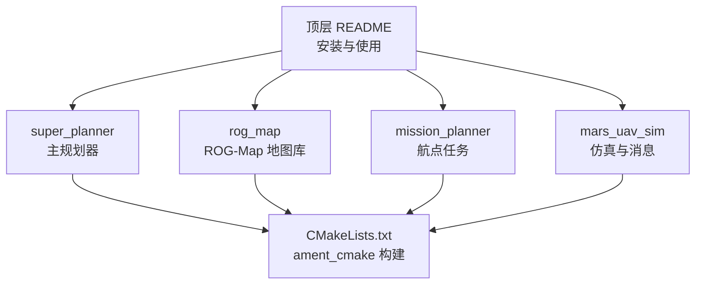
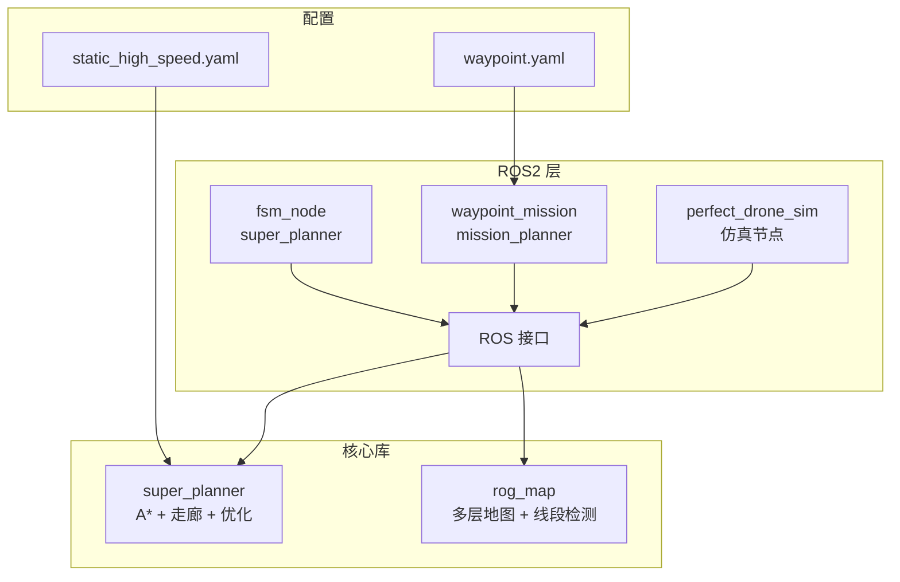
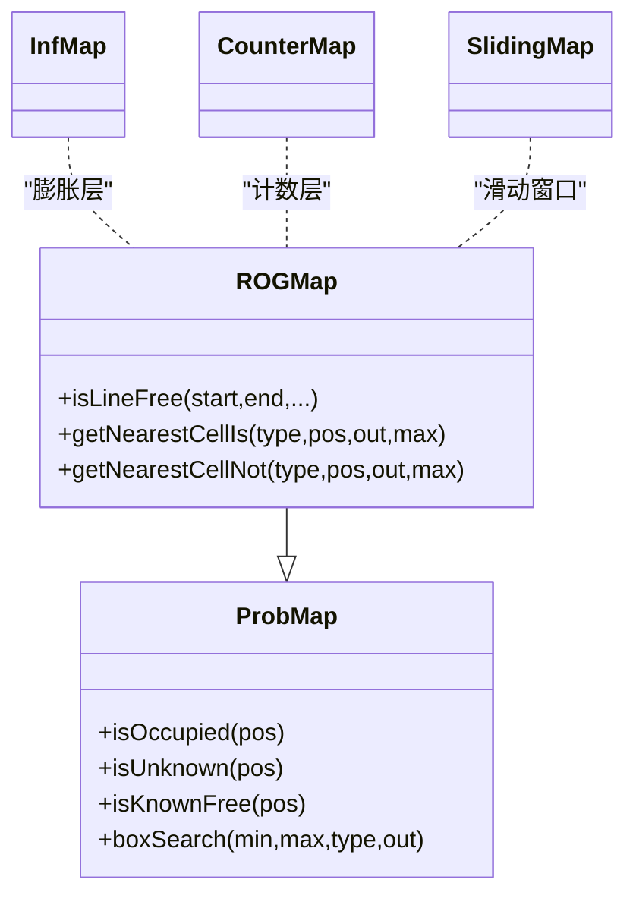
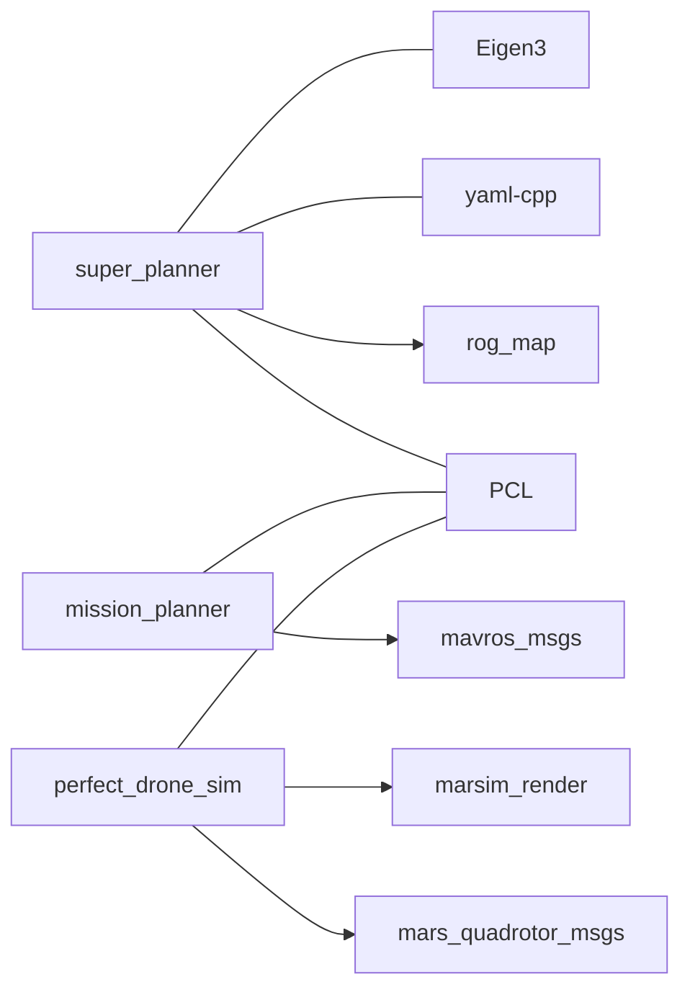

# 代码贡献指南

<cite>
**本文引用的文件**
- [README.md](file://README.md)
- [install_dependencies.sh](file://src/SUPER/install_dependencies.sh)
- [super_planner/CMakeLists.txt](file://src/SUPER/super_planner/CMakeLists.txt)
- [mission_planner/CMakeLists.txt](file://src/SUPER/mission_planner/CMakeLists.txt)
- [rog_map/CMakeLists.txt](file://src/SUPER/rog_map/CMakeLists.txt)
- [mars_quadrotor_msgs/package.xml](file://src/SUPER/mars_uav_sim/mars_quadrotor_msgs/package.xml)
- [perfect_drone_sim/package.xml](file://src/SUPER/mars_uav_sim/perfect_drone_sim/package.xml)
- [super_planner/config/static_high_speed.yaml](file://src/SUPER/super_planner/config/static_high_speed.yaml)
- [mission_planner/config/waypoint.yaml](file://src/SUPER/mission_planner/config/waypoint.yaml)
- [super_planner/src/super_core/super_planner.cpp](file://src/SUPER/super_planner/src/super_core/super_planner.cpp)
- [mission_planner/Apps/ros2_waypoint_mission.cpp](file://src/SUPER/mission_planner/Apps/ros2_waypoint_mission.cpp)
- [rog_map/src/rog_map/rog_map.cpp](file://src/SUPER/rog_map/src/rog_map/rog_map.cpp)
- [rog_map/doc/API_REFERENCE.md](file://src/SUPER/rog_map/doc/API_REFERENCE.md)
</cite>

## 目录
1. [简介](#简介)
2. [项目结构](#项目结构)
3. [核心组件](#核心组件)
4. [架构总览](#架构总览)
5. [详细组件分析](#详细组件分析)
6. [依赖关系分析](#依赖关系分析)
7. [性能考量](#性能考量)
8. [故障排查指南](#故障排查指南)
9. [结论](#结论)
10. [附录](#附录)

## 简介
本指南面向希望参与 SUPER 项目的开发者，覆盖从开发环境搭建、依赖安装、编译构建到代码风格、Git 工作流、代码审查、测试与问题反馈的全流程。SUPER 是面向 ROS2 的城市环境下高速飞行器导航系统，包含规划器、地图模块与仿真/演示节点。

## 项目结构
- 顶层 README 提供安装与使用说明，包含 ROS2 Jazzy、C++17、CMake、PCL、Eigen、yaml-cpp 等前置条件与一键安装脚本。
- 包含多个 ROS2 包：super_planner（主规划器）、rog_map（ROG-Map 地图库）、mission_planner（航点任务）、mars_uav_sim（多套仿真与消息）。
- 各包通过 ament_cmake 构建，使用 CMakeLists.txt 统一管理依赖与安装规则。



**图表来源**
- [README.md](file://README.md#L1-L168)
- [super_planner/CMakeLists.txt](file://src/SUPER/super_planner/CMakeLists.txt#L1-L188)
- [rog_map/CMakeLists.txt](file://src/SUPER/rog_map/CMakeLists.txt#L1-L114)
- [mission_planner/CMakeLists.txt](file://src/SUPER/mission_planner/CMakeLists.txt#L1-L109)

**章节来源**
- [README.md](file://README.md#L1-L168)

## 核心组件
- super_planner：ROS2 下的主规划器，包含 A* 路径搜索、走廊生成、轨迹优化、备份轨迹与可视化集成。
- rog_map：多层占用栅格地图库，支持概率/膨胀/计数/滑动窗口等多层结构，提供线段自由检测、最近邻查询等核心能力。
- mission_planner：航点任务演示节点，提供 RViz/MAVROS/定时触发等多种启动方式。
- mars_uav_sim：包含自定义消息包、渲染模块与完美无人机仿真节点，支撑仿真与可视化。

**章节来源**
- [super_planner/CMakeLists.txt](file://src/SUPER/super_planner/CMakeLists.txt#L1-L188)
- [rog_map/CMakeLists.txt](file://src/SUPER/rog_map/CMakeLists.txt#L1-L114)
- [mission_planner/CMakeLists.txt](file://src/SUPER/mission_planner/CMakeLists.txt#L1-L109)
- [mars_quadrotor_msgs/package.xml](file://src/SUPER/mars_uav_sim/mars_quadrotor_msgs/package.xml#L1-L26)
- [perfect_drone_sim/package.xml](file://src/SUPER/mars_uav_sim/perfect_drone_sim/package.xml#L1-L20)

## 架构总览
SUPER 的系统由“ROS2 节点 + C++ 核心库 + 配置参数”构成。节点负责订阅/发布与调度，核心库提供算法实现，配置文件控制行为与性能。



**图表来源**
- [super_planner/CMakeLists.txt](file://src/SUPER/super_planner/CMakeLists.txt#L127-L151)
- [mission_planner/CMakeLists.txt](file://src/SUPER/mission_planner/CMakeLists.txt#L64-L73)
- [super_planner/config/static_high_speed.yaml](file://src/SUPER/super_planner/config/static_high_speed.yaml#L1-L187)
- [mission_planner/config/waypoint.yaml](file://src/SUPER/mission_planner/config/waypoint.yaml#L1-L19)

## 详细组件分析

### super_planner 组件
- 功能职责：接收目标与状态，调用 A* 与走廊生成，进行轨迹优化与备份轨迹生成，并通过 ROS 接口发布命令与可视化。
- 关键流程：PlanFromRest/ReplanOnce → A* → CorridorGenerator → FOVChecker → ExpTrajOpt → BackupTrajOpt → 发布命令。
- 性能要点：编译选项开启 O3/Wall，支持 Debug/Release 切换；日志与可视化可按配置开关。

```mermaid
sequenceDiagram
participant Node as "fsm_node"
participant SP as "SuperPlanner"
participant Map as "ROGMap"
participant Opt as "轨迹优化器"
Node->>SP : "PlanFromRest/ReplanOnce"
SP->>Map : "查询起点/目标可达性"
SP->>SP : "A* 路径搜索 + 走廊生成"
SP->>Opt : "ExpTrajOpt/BackupTrajOpt"
Opt-->>SP : "优化后的轨迹"
SP-->>Node : "发布位置/偏航命令"
```

**图表来源**
- [super_planner/src/super_core/super_planner.cpp](file://src/SUPER/super_planner/src/super_core/super_planner.cpp#L76-L175)
- [super_planner/CMakeLists.txt](file://src/SUPER/super_planner/CMakeLists.txt#L127-L151)

**章节来源**
- [super_planner/src/super_core/super_planner.cpp](file://src/SUPER/super_planner/src/super_core/super_planner.cpp#L1-L200)
- [super_planner/CMakeLists.txt](file://src/SUPER/super_planner/CMakeLists.txt#L1-L188)

### rog_map 组件
- 功能职责：提供概率/膨胀/计数/滑动窗口地图，支持线段自由检测、盒子搜索、最近邻查询等。
- API 参考：包含 ProbMap/ROGMap/InfMap/CounterMap/SlidingMap 的核心接口与使用示例。
- 性能特性：单点查询 O(1)，线段自由检测基于射线追踪。



**图表来源**
- [rog_map/doc/API_REFERENCE.md](file://src/SUPER/rog_map/doc/API_REFERENCE.md#L76-L200)
- [rog_map/src/rog_map/rog_map.cpp](file://src/SUPER/rog_map/src/rog_map/rog_map.cpp#L1-L200)

**章节来源**
- [rog_map/doc/API_REFERENCE.md](file://src/SUPER/rog_map/doc/API_REFERENCE.md#L1-L200)
- [rog_map/src/rog_map/rog_map.cpp](file://src/SUPER/rog_map/src/rog_map/rog_map.cpp#L1-L200)

### mission_planner 组件
- 功能职责：演示航点任务，支持点击目标、定时触发、从文件读取航点等多种模式。
- 启动方式：提供 launch 文件与可执行节点，适配 RViz、MAVROS 或固定周期模式。

**章节来源**
- [mission_planner/Apps/ros2_waypoint_mission.cpp](file://src/SUPER/mission_planner/Apps/ros2_waypoint_mission.cpp#L1-L23)
- [mission_planner/CMakeLists.txt](file://src/SUPER/mission_planner/CMakeLists.txt#L64-L73)
- [mission_planner/config/waypoint.yaml](file://src/SUPER/mission_planner/config/waypoint.yaml#L1-L19)

## 依赖关系分析
- 构建系统：各包统一使用 ament_cmake，通过 find_package 引入 rclcpp、std_msgs、sensor_msgs、nav_msgs、geometry_msgs、visualization_msgs、tf2_ros、pcl_conversions、PCL、Eigen、yaml-cpp 等。
- 包间依赖：super_planner 依赖 rog_map；perfect_drone_sim 依赖 mars_quadrotor_msgs、marsim_render；mission_planner 依赖 mavros_msgs 等。
- 编译标志：C++17 标准，Release 默认 O3/Wall，部分包启用额外警告与错误严格化。



**图表来源**
- [super_planner/CMakeLists.txt](file://src/SUPER/super_planner/CMakeLists.txt#L33-L74)
- [mission_planner/CMakeLists.txt](file://src/SUPER/mission_planner/CMakeLists.txt#L26-L62)
- [rog_map/CMakeLists.txt](file://src/SUPER/rog_map/CMakeLists.txt#L29-L84)
- [perfect_drone_sim/package.xml](file://src/SUPER/mars_uav_sim/perfect_drone_sim/package.xml#L7-L15)
- [mars_quadrotor_msgs/package.xml](file://src/SUPER/mars_uav_sim/mars_quadrotor_msgs/package.xml#L10-L16)

**章节来源**
- [super_planner/CMakeLists.txt](file://src/SUPER/super_planner/CMakeLists.txt#L1-L188)
- [mission_planner/CMakeLists.txt](file://src/SUPER/mission_planner/CMakeLists.txt#L1-L109)
- [rog_map/CMakeLists.txt](file://src/SUPER/rog_map/CMakeLists.txt#L1-L114)

## 性能考量
- 编译优化：Release 模式默认 O3/Wall，建议在本地开发使用 Debug，CI/发布使用 Release。
- 地图与轨迹：合理设置分辨率、视野范围与优化参数，避免过度计算；必要时启用可视化动态配置。
- I/O 与日志：日志文件按运行生成，可通过脚本分析命令日志与重规划日志，定位瓶颈。

**章节来源**
- [super_planner/CMakeLists.txt](file://src/SUPER/super_planner/CMakeLists.txt#L4-L10)
- [super_planner/config/static_high_speed.yaml](file://src/SUPER/super_planner/config/static_high_speed.yaml#L1-L187)

## 故障排查指南
- 包未找到：确认已 source 安装目录下的 setup.bash。
- 构建失败：检查依赖安装与 ROS 分发版本；使用 rosdep 安装缺失依赖。
- 权限问题：确保工作空间目录权限正确。
- 特定包构建：仅构建指定包或启用 Debug 符号以辅助定位问题。

**章节来源**
- [README.md](file://README.md#L132-L152)

## 结论
本指南提供了从环境准备到代码贡献的完整路径。建议贡献者遵循统一的构建与配置规范，结合配置文件参数进行验证，并在 PR 中附带测试与性能说明。

## 附录

### 开发环境搭建与依赖安装
- 前置条件：Ubuntu 24.04、ROS2 Jazzy、C++17、CMake ≥ 3.5、PCL、Eigen3、yaml-cpp。
- 自动安装：推荐使用提供的安装脚本一次性安装 ROS2、系统库与 Python 依赖。
- 手动安装：可按清单逐项安装 build-essential、cmake、git、rosdep、colcon 扩展、Eigen、PCL、yaml-cpp、libdw 等。
- 工作空间：初始化 rosdep，使用 rosdep 安装依赖，使用 colcon 构建指定包，最后 source 安装目录。

**章节来源**
- [README.md](file://README.md#L5-L95)
- [install_dependencies.sh](file://src/SUPER/install_dependencies.sh#L1-L71)

### 编译与构建
- 构建系统：ament_cmake + CMake，C++17 标准，Release 默认 O3/Wall。
- 关键目标：super 库、fsm_node、waypoint_mission、rog_map_core 等。
- 安装与导出：头文件、库、launch/config/data 等资源按约定安装。

**章节来源**
- [super_planner/CMakeLists.txt](file://src/SUPER/super_planner/CMakeLists.txt#L1-L188)
- [mission_planner/CMakeLists.txt](file://src/SUPER/mission_planner/CMakeLists.txt#L1-L109)
- [rog_map/CMakeLists.txt](file://src/SUPER/rog_map/CMakeLists.txt#L1-L114)

### 代码风格与编码规范
- C++ 标准：C++17。
- 编译器选项：Release O3/Wall；部分包启用额外警告与错误严格化（如 unused-variable、return-type）。
- 命名约定：遵循项目既有命名风格（如类名、函数名、变量名），保持一致性。
- 注释规范：采用文件头版权与许可声明，函数/类简要说明用途与注意事项；复杂逻辑处补充注释。
- 头文件组织：公共头文件放置于 include 目录，第三方库与系统库通过 find_package 引入。

**章节来源**
- [super_planner/CMakeLists.txt](file://src/SUPER/super_planner/CMakeLists.txt#L4-L10)
- [mission_planner/CMakeLists.txt](file://src/SUPER/mission_planner/CMakeLists.txt#L11-L18)
- [rog_map/CMakeLists.txt](file://src/SUPER/rog_map/CMakeLists.txt#L6-L11)

### Git 工作流程与分支管理
- 分支策略：采用 feature 分支进行开发，完成后合并到 develop/main。
- 提交规范：提交信息清晰描述变更目的与影响，避免“修复”“更新”等模糊表述。
- Pull Request：PR 描述应包含需求背景、改动范围、测试与性能验证、风险评估与回滚预案。
- 代码审查：至少一名维护者审查，关注代码风格、边界条件、性能与回归风险。

[本节为通用实践说明，不直接分析具体文件，故无“章节来源”]

### 代码审查标准与质量检查
- 代码质量：通过编译器警告与错误严格化、单元测试覆盖率、静态分析工具（如 clang-tidy、cpplint）检查。
- 回归测试：针对关键路径（A*、走廊生成、轨迹优化、地图查询）进行回归验证。
- 性能回归：记录关键流程耗时，避免引入显著性能退化。

[本节为通用实践说明，不直接分析具体文件，故无“章节来源”]

### 测试要求与单元测试编写规范
- 单元测试：针对核心算法（如线段自由检测、盒子搜索、轨迹优化）编写独立测试用例。
- 集成测试：通过 launch 文件启动节点，验证端到端流程（输入点云、目标、输出命令与可视化）。
- 参数验证：使用配置文件进行参数扰动测试，覆盖边界与异常场景。

**章节来源**
- [super_planner/CMakeLists.txt](file://src/SUPER/super_planner/CMakeLists.txt#L140-L151)
- [mission_planner/CMakeLists.txt](file://src/SUPER/mission_planner/CMakeLists.txt#L64-L73)

### 常见开发工具
- IDE 配置：建议使用 CLion 并配置 CMake 工程，确保 CMAKE_PREFIX_PATH 正确指向安装目录。
- 调试工具：gdb/LLDB，配合 Debug 构建类型定位问题。
- 静态分析：clang-tidy、cpplint，结合编译器警告提升代码质量。

[本节为通用实践说明，不直接分析具体文件，故无“章节来源”]

### 问题报告与功能请求
- 模板建议：
  - 标题：简洁描述问题/需求
  - 环境：操作系统、ROS 分发版本、硬件平台
  - 复现步骤：最小可复现流程
  - 期望行为与实际行为
  - 日志与截图（如有）
  - 相关配置文件片段
- 流程：在仓库 Issue 中新建，维护者会进行分类与跟进。

[本节为通用实践说明，不直接分析具体文件，故无“章节来源”]