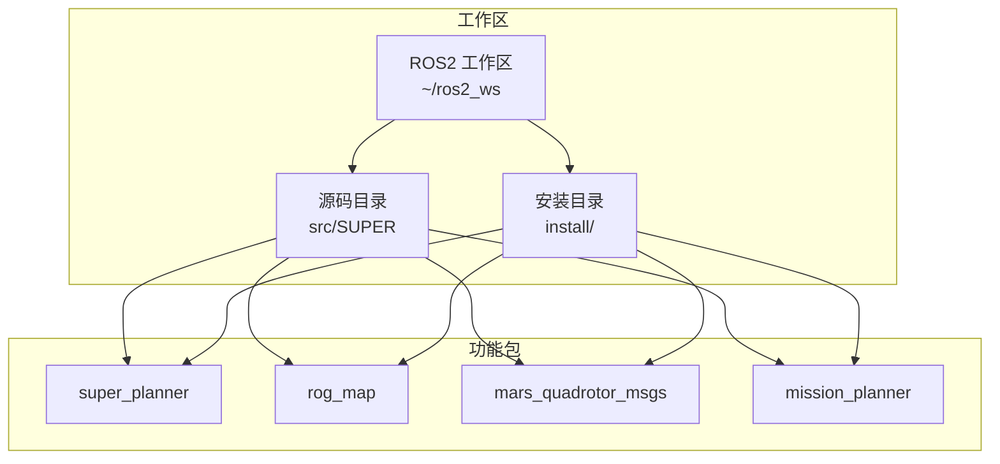
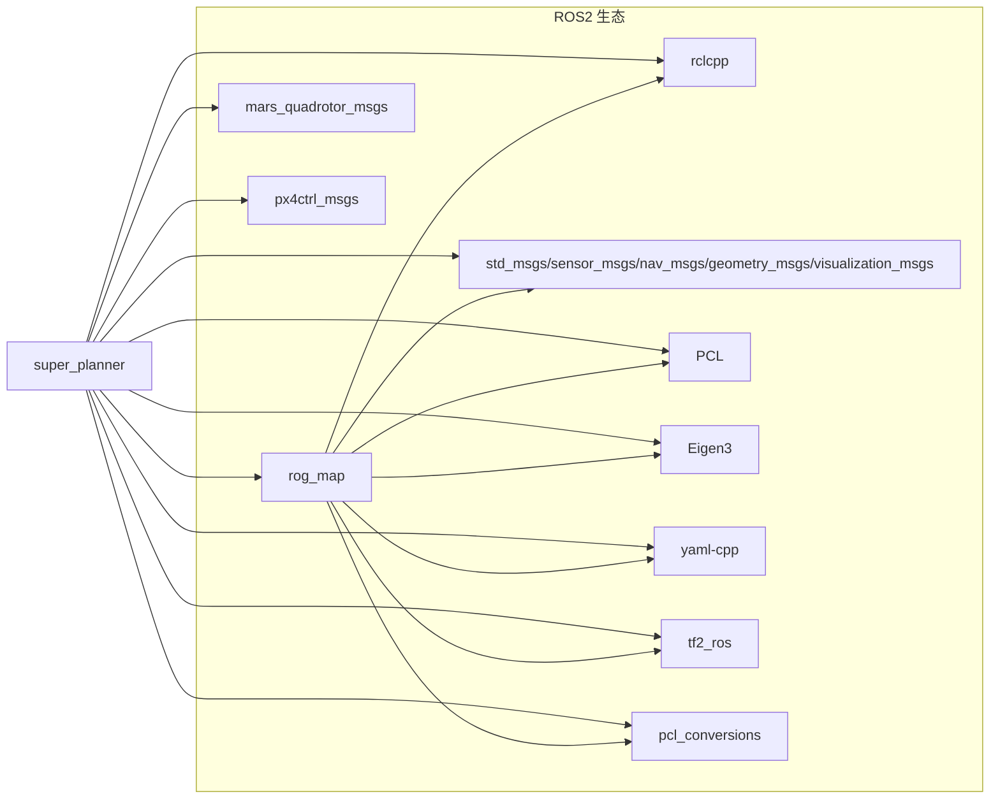
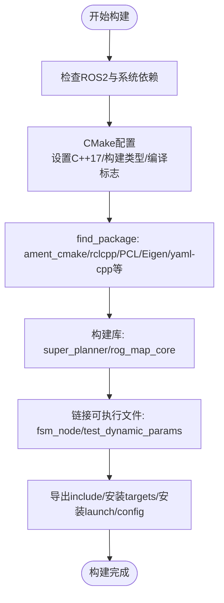
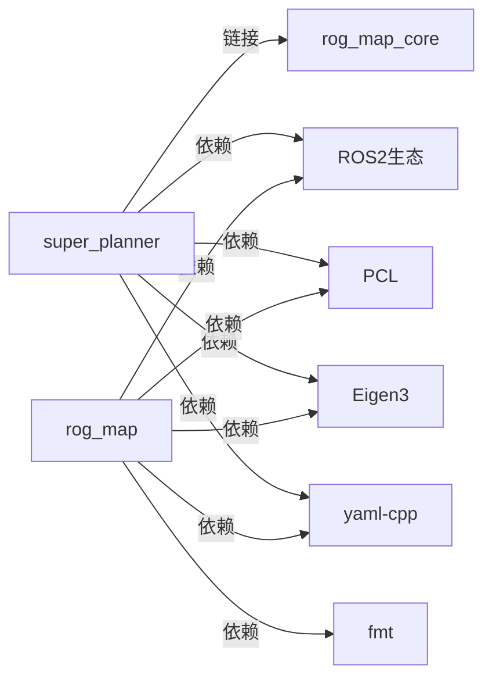

# 开发环境配置

<cite>
**本文引用的文件**
- [README.md](file://README.md)
- [README_JAZZY.md](file://README_JAZZY.md)
- [install_dependencies.sh](file://src/SUPER/install_dependencies.sh)
- [super_planner/CMakeLists.txt](file://src/SUPER/super_planner/CMakeLists.txt)
- [super_planner/package.xml](file://src/SUPER/super_planner/package.xml)
- [rog_map/CMakeLists.txt](file://src/SUPER/rog_map/CMakeLists.txt)
- [rog_map/package.xml](file://src/SUPER/rog_map/package.xml)
- [mars_quadrotor_msgs/package.xml](file://src/SUPER/mars_uav_sim/mars_quadrotor_msgs/package.xml)
- [super_planner/include/super_core/config.hpp](file://src/SUPER/super_planner/include/super_core/config.hpp)
- [super_planner/config/click.yaml](file://src/SUPER/super_planner/config/click.yaml)
- [rog_map/include/rog_map/rog_map.h](file://src/SUPER/rog_map/include/rog_map/rog_map.h)
</cite>

## 目录
1. [简介](#简介)
2. [项目结构](#项目结构)
3. [核心组件](#核心组件)
4. [架构总览](#架构总览)
5. [详细组件分析](#详细组件分析)
6. [依赖关系分析](#依赖关系分析)
7. [性能考虑](#性能考虑)
8. [故障排查指南](#故障排查指南)
9. [结论](#结论)
10. [附录](#附录)

## 简介
本文件面向在Ubuntu 24.04 LTS上使用ROS2 Jazzy的开发者，提供从系统准备、依赖安装、CMake构建、IDE配置、调试到容器化与性能分析的完整开发环境搭建指南。内容基于仓库内现有文档与构建脚本，确保可复现与可维护性。

## 项目结构
该仓库采用ROS2工作区布局，包含多个功能包：
- super_planner：轨迹规划与状态机节点
- rog_map：占用栅格地图（ROG-Map）核心与ROS接口
- mars_uav_sim：多旋翼仿真相关消息与渲染
- mission_planner：任务与演示启动配置
- 安装脚本与多语言README

**图表来源**
- [super_planner/CMakeLists.txt](file://src/SUPER/super_planner/CMakeLists.txt#L1-L188)
- [rog_map/CMakeLists.txt](file://src/SUPER/rog_map/CMakeLists.txt#L1-L114)

**章节来源**
- [README.md](file://README.md#L1-L168)
- [README_JAZZY.md](file://README_JAZZY.md#L1-L168)

## 核心组件
- super_planner：提供轨迹优化、A*路径搜索、状态机与ROS2接口；导出库与可执行节点
- rog_map：提供多层栅格地图、概率更新、ESDF等；导出核心库与ROS2接口
- mars_quadrotor_msgs：多旋翼相关消息定义
- mission_planner：演示与任务启动配置

**章节来源**
- [super_planner/CMakeLists.txt](file://src/SUPER/super_planner/CMakeLists.txt#L1-L188)
- [rog_map/CMakeLists.txt](file://src/SUPER/rog_map/CMakeLists.txt#L1-L114)
- [mars_quadrotor_msgs/package.xml](file://src/SUPER/mars_uav_sim/mars_quadrotor_msgs/package.xml#L1-L26)

## 架构总览
整体采用ROS2 ament_cmake构建体系，super_planner依赖rog_map与多种ROS2消息包；rog_map依赖PCL、Eigen与ROS2生态。

**图表来源**
- [super_planner/CMakeLists.txt](file://src/SUPER/super_planner/CMakeLists.txt#L33-L74)
- [super_planner/package.xml](file://src/SUPER/super_planner/package.xml#L7-L19)
- [rog_map/CMakeLists.txt](file://src/SUPER/rog_map/CMakeLists.txt#L29-L87)
- [rog_map/package.xml](file://src/SUPER/rog_map/package.xml#L10-L26)

## 详细组件分析

### 操作系统与ROS2版本
- 操作系统：Ubuntu 24.04 LTS
- ROS2发行版：Jazzy Jalisco
- 中间件：FastDDS（默认）
- Python：3.12
- C++标准：C++17
- CMake：≥3.5

**章节来源**
- [README.md](file://README.md#L5-L14)
- [README_JAZZY.md](file://README_JAZZY.md#L5-L14)
- [README_JAZZY.md](file://README_JAZZY.md#L154-L159)

### 依赖库安装
推荐使用自动安装脚本一次性安装所有系统与Python依赖；若手动安装，需包含以下核心依赖：
- 系统工具：build-essential、cmake、git
- ROS2 Jazzy相关：rclcpp、std_msgs、sensor_msgs、geometry_msgs、nav_msgs、tf2_ros、visualization-msgs、pcl-conversions、mavros-msgs等
- 数学与图形：Eigen3、PCL、yaml-cpp、libdw-dev
- 图形与可视化：freeglut3-dev、libglew-dev、qtbase5-dev、libqt5opengl5-dev、libqglviewer-dev-qt5
- 其他：libproj-dev、libzmq3-dev、libspdlog-dev、libopencv-dev、libnlopt-dev、libceres-dev
- Python：numpy、scipy、matplotlib、pip（部分第三方库通过pip安装）

自动安装脚本位置与用途：
- 自动安装ROS2 Jazzy与常用ROS2包
- 安装系统级依赖（Eigen、PCL、OpenCV等）
- 安装Python依赖（apt优先，必要时使用pip3）

**章节来源**
- [README.md](file://README.md#L37-L73)
- [README_JAZZY.md](file://README_JAZZY.md#L37-L73)
- [install_dependencies.sh](file://src/SUPER/install_dependencies.sh#L1-L71)

### CMake构建系统配置
- C++标准：C++17
- 构建类型：Release（可通过构建参数切换）
- 编译标志：-O3 -Wall（可按需追加调试符号）
- 关键宏定义：USE_ROS2、FMT_HEADER_ONLY、ORIGIN_AT_CORNER等
- 包发现与链接：
  - super_planner：链接PCL、yaml-cpp、libdw；依赖rclcpp、std_msgs、sensor_msgs、geometry_msgs、nav_msgs、visualization_msgs、tf2_ros、pcl_conversions、rog_map、mars_quadrotor_msgs、px4ctrl_msgs
  - rog_map：链接PCL、yaml-cpp；依赖rclcpp、std_msgs、nav_msgs、geometry_msgs、visualization_msgs、tf2_ros、pcl_conversions、fmt
- 导出与安装：导出include目录、安装库与可执行文件、安装launch与config目录

**图表来源**
- [super_planner/CMakeLists.txt](file://src/SUPER/super_planner/CMakeLists.txt#L1-L188)
- [rog_map/CMakeLists.txt](file://src/SUPER/rog_map/CMakeLists.txt#L1-L114)

**章节来源**
- [super_planner/CMakeLists.txt](file://src/SUPER/super_planner/CMakeLists.txt#L1-L188)
- [rog_map/CMakeLists.txt](file://src/SUPER/rog_map/CMakeLists.txt#L1-L114)

### IDE配置最佳实践
- VS Code
  - 安装C/C++、CMake Tools、ROS2扩展
  - 使用CMake Tools选择kit（系统默认GCC）与构建类型（Release/Debug）
  - 在工作区根目录打开，确保CMake user presets正确指向工作区
  - 通过tasks.json/launch.json配置构建与调试（见“调试环境”）
- CLion
  - 打开工作区根目录，自动检测CMake
  - Toolchain选择系统编译器，CMake套件选择“Default”
  - 在Run/Debug Configurations中添加“CMake Target”，选择fsm_node或test_dynamic_params
  - 确保ROS2环境变量已source，以便找到依赖包

[本节为通用IDE配置建议，不直接分析具体文件，故无章节来源]

### 调试环境设置
- GDB
  - 使用colcon构建时加入调试符号：--cmake-args -DCMAKE_BUILD_TYPE=Debug
  - 在VS Code中通过launch.json配置GDB，选择fsm_node为目标
  - 在CLion中新建CMake Target Debug配置，选择fsm_node
- 断点与变量监视
  - 在super_planner与rog_map源码中设置断点
  - 使用变量监视窗口观察关键参数（如Config中的规划参数、地图分辨率等）
- 参数动态更新
  - 通过ROS2参数服务器动态更新super_planner配置（见“运行时参数更新”）

**章节来源**
- [README.md](file://README.md#L150-L152)
- [super_planner/include/super_core/config.hpp](file://src/SUPER/super_planner/include/super_core/config.hpp#L158-L228)

### 容器化开发环境
- Docker镜像建议
  - 基础镜像：ubuntu:24.04
  - 安装步骤：apt更新 → 安装ROS2 Jazzy与依赖 → 安装Eigen、PCL、OpenGL、Qt、OpenCV等 → 安装Python依赖
  - 参考自动安装脚本中的包列表
- 工作区挂载
  - 将工作区目录挂载至容器内，使用colcon构建
  - 通过环境变量与网络配置访问宿主机显示或仿真环境
- 注意事项
  - 确保容器内ROS2环境变量与宿主机一致
  - 若使用GPU/OpenGL，需在docker run时添加相应设备与权限

**章节来源**
- [install_dependencies.sh](file://src/SUPER/install_dependencies.sh#L10-L51)

### 运行与配置
- 工作区设置与构建
  - 创建工作区 → 克隆仓库 → rosdep安装依赖 → colcon构建指定包（super_planner、rog_map）
  - 源化工作区后运行launch或run命令
- 启动与运行
  - 启动RViz与规划节点：ros2 launch super_planner rviz.launch.py
  - 直接运行节点：ros2 run super_planner fsm_node
- 参数配置
  - YAML配置文件位于super_planner/config/，包含FSM、轨迹优化、A*、ROG-Map等参数
  - 运行时参数可通过updateRuntimeParams动态更新

**章节来源**
- [README.md](file://README.md#L75-L114)
- [README_JAZZY.md](file://README_JAZZY.md#L75-L114)
- [super_planner/config/click.yaml](file://src/SUPER/super_planner/config/click.yaml#L1-L190)
- [super_planner/include/super_core/config.hpp](file://src/SUPER/super_planner/include/super_core/config.hpp#L158-L228)

## 依赖关系分析
- super_planner对rog_map的依赖通过库链接实现，且显式查找rog_map_core库
- super_planner对ROS2生态与PCL、Eigen、yaml-cpp的依赖通过find_package与ament_target_dependencies声明
- rog_map对PCL、Eigen、fmt、ROS2生态的依赖同样通过find_package与ament_target_dependencies声明

**图表来源**
- [super_planner/CMakeLists.txt](file://src/SUPER/super_planner/CMakeLists.txt#L109-L125)
- [rog_map/CMakeLists.txt](file://src/SUPER/rog_map/CMakeLists.txt#L79-L87)

**章节来源**
- [super_planner/CMakeLists.txt](file://src/SUPER/super_planner/CMakeLists.txt#L109-L125)
- [rog_map/CMakeLists.txt](file://src/SUPER/rog_map/CMakeLists.txt#L79-L87)

## 性能考虑
- 构建优化
  - 使用Release构建（默认）与-O3标志
  - 通过--packages-select仅构建所需包，缩短构建时间
- 运行时优化
  - 合理设置规划参数（如规划时域、采样步长、机器人半径等）
  - 依据硬件能力调整地图分辨率与可视化频率
- 可视化与日志
  - 在复杂场景中关闭不必要的可视化以降低开销
  - 使用日志分析工具评估轨迹质量与重规划频率

**章节来源**
- [super_planner/CMakeLists.txt](file://src/SUPER/super_planner/CMakeLists.txt#L6-L7)
- [super_planner/config/click.yaml](file://src/SUPER/super_planner/config/click.yaml#L1-L190)
- [README.md](file://README.md#L150-L152)

## 故障排查指南
- 包未找到
  - 确认已source工作区安装目录的setup.bash
- 构建错误
  - 确认所有依赖已安装，且ROS2发行版与系统匹配
- 权限错误
  - 确保工作区目录具有写权限
- 依赖冲突
  - 使用自动安装脚本统一安装系统依赖
  - 若手动安装，核对包名与版本是否与脚本一致
- 链接问题
  - 确认rog_map_core库存在并可被super_planner链接
  - 检查CMake中find_package与target_link_libraries配置

**章节来源**
- [README.md](file://README.md#L132-L152)
- [README_JAZZY.md](file://README_JAZZY.md#L132-L152)
- [super_planner/CMakeLists.txt](file://src/SUPER/super_planner/CMakeLists.txt#L109-L115)

## 结论
本指南基于仓库现有文档与构建脚本，提供了从系统准备到构建、调试与容器化的完整开发环境配置流程。遵循上述步骤可快速搭建稳定、可复现的开发环境，并通过参数配置与性能优化满足不同场景需求。

## 附录
- 快速命令摘要
  - 安装依赖：./install_dependencies.sh 或按README手动安装
  - 构建工作区：colcon build --symlink-install --packages-select super_planner rog_map
  - 源化工作区：source install/setup.bash
  - 启动RViz与规划节点：ros2 launch super_planner rviz.launch.py
  - 运行节点：ros2 run super_planner fsm_node