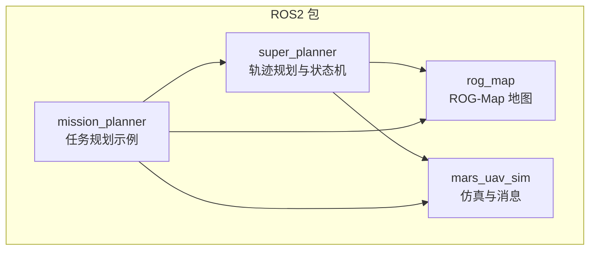
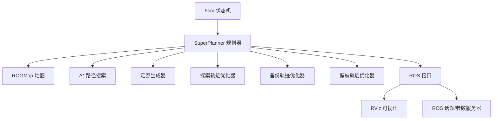
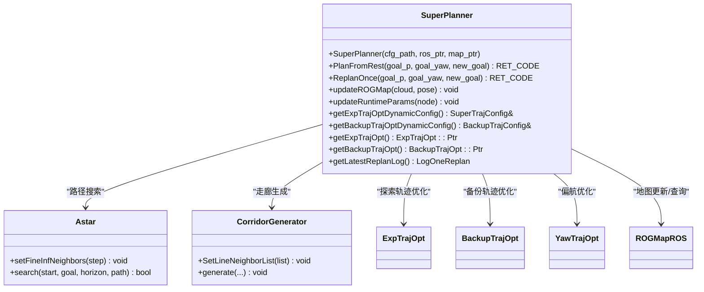
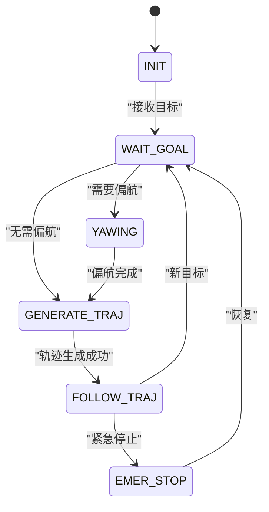
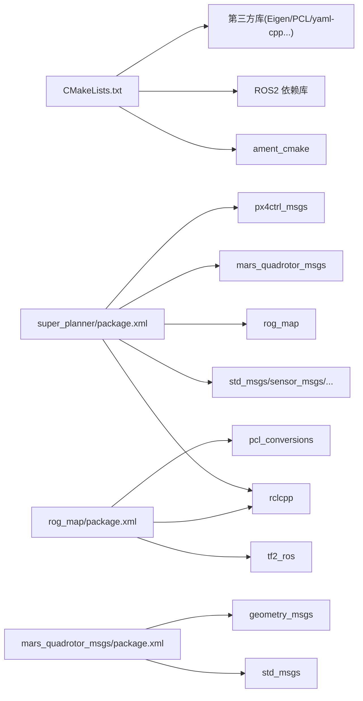

# 开发者指南

<cite>
**本文档引用的文件**
- [README.md](file://README.md)
- [src/SUPER/README.md](file://src/SUPER/README.md)
- [src/SUPER/install_dependencies.sh](file://src/SUPER/install_dependencies.sh)
- [src/SUPER/super_planner/CMakeLists.txt](file://src/SUPER/super_planner/CMakeLists.txt)
- [src/SUPER/super_planner/package.xml](file://src/SUPER/super_planner/package.xml)
- [src/SUPER/super_planner/include/super_core/super_planner.h](file://src/SUPER/super_planner/include/super_core/super_planner.h)
- [src/SUPER/super_planner/include/fsm/fsm.h](file://src/SUPER/super_planner/include/fsm/fsm.h)
- [src/SUPER/super_planner/src/super_core/super_planner.cpp](file://src/SUPER/super_planner/src/super_core/super_planner.cpp)
- [src/SUPER/super_planner/config/click.yaml](file://src/SUPER/super_planner/config/click.yaml)
- [src/SUPER/super_planner/launch/rviz.launch.py](file://src/SUPER/super_planner/launch/rviz.launch.py)
- [src/SUPER/rog_map/package.xml](file://src/SUPER/rog_map/package.xml)
- [src/SUPER/rog_map/include/rog_map/rog_map.h](file://src/SUPER/rog_map/include/rog_map/rog_map.h)
- [src/SUPER/mars_uav_sim/mars_quadrotor_msgs/package.xml](file://src/SUPER/mars_uav_sim/mars_quadrotor_msgs/package.xml)
- [src/SUPER/mars_uav_sim/perfect_drone_sim/package.xml](file://src/SUPER/mars_uav_sim/perfect_drone_sim/package.xml)
</cite>

## 目录
1. [简介](#简介)
2. [项目结构](#项目结构)
3. [核心组件](#核心组件)
4. [架构总览](#架构总览)
5. [详细组件分析](#详细组件分析)
6. [依赖关系分析](#依赖关系分析)
7. [性能与优化](#性能与优化)
8. [故障排查指南](#故障排查指南)
9. [结论](#结论)
10. [附录](#附录)

## 简介
本指南面向希望参与 SUPER（ROS2 Jazzy）项目的开发者，覆盖开发环境搭建、代码风格与提交规范、扩展开发方法、项目结构与设计原则、开发与调试工具、测试与质量保障、常见问题与解决方案、新功能开发模板以及版本与发布流程。通过本指南，新成员可快速理解系统架构并高效贡献代码。

## 项目结构
项目采用多包（package）组织方式，核心模块包括：
- super_planner：轨迹规划与状态机主模块，包含规划器、轨迹优化器、A*路径搜索、可视化与ROS接口封装。
- rog_map：ROG-Map地图模块，支持概率占用栅格、膨胀、ESDF等，提供ROS2接口。
- mars_uav_sim：仿真与消息定义，包含四旋翼相关消息、渲染与完美无人机仿真节点。
- mission_planner：任务规划示例与演示（当前主要为launch与rviz配置）。



图表来源
- [src/SUPER/super_planner/CMakeLists.txt](file://src/SUPER/super_planner/CMakeLists.txt#L33-L74)
- [src/SUPER/super_planner/package.xml](file://src/SUPER/super_planner/package.xml#L7-L15)
- [src/SUPER/rog_map/package.xml](file://src/SUPER/rog_map/package.xml#L10-L18)
- [src/SUPER/mars_uav_sim/perfect_drone_sim/package.xml](file://src/SUPER/mars_uav_sim/perfect_drone_sim/package.xml#L7-L15)

章节来源
- [README.md](file://README.md#L15-L95)
- [src/SUPER/README.md](file://src/SUPER/README.md#L96-L200)

## 核心组件
- SuperPlanner：负责整体规划流程编排，包含探索轨迹与备份轨迹的生成、A*路径搜索、走廊生成、FOV检查、ROS接口交互与日志记录。
- Fsm：有限状态机，驱动规划循环、目标设置、轨迹发布与可视化。
- ROGMap：地图管理与查询，提供线段自由度检测、坐标变换、概率更新等能力。
- ROS接口与消息：通过ROS2节点与话题进行交互，支持RViz可视化、参数服务器动态配置、轨迹发布等。

章节来源
- [src/SUPER/super_planner/include/super_core/super_planner.h](file://src/SUPER/super_planner/include/super_core/super_planner.h#L59-L296)
- [src/SUPER/super_planner/include/fsm/fsm.h](file://src/SUPER/super_planner/include/fsm/fsm.h#L40-L171)
- [src/SUPER/rog_map/include/rog_map/rog_map.h](file://src/SUPER/rog_map/include/rog_map/rog_map.h#L39-L129)

## 架构总览
系统采用“模块化+ROS2节点”的架构，规划主流程由状态机驱动，规划器内部组合多个子模块（地图、轨迹优化、A*、走廊生成、FOV检查），并通过ROS接口与外部系统交互。



图表来源
- [src/SUPER/super_planner/include/fsm/fsm.h](file://src/SUPER/super_planner/include/fsm/fsm.h#L52-L61)
- [src/SUPER/super_planner/include/super_core/super_planner.h](file://src/SUPER/super_planner/include/super_core/super_planner.h#L62-L74)
- [src/SUPER/super_planner/launch/rviz.launch.py](file://src/SUPER/super_planner/launch/rviz.launch.py#L22-L27)

## 详细组件分析

### SuperPlanner 类
SuperPlanner 是规划主控类，负责：
- 初始化与参数注入（配置文件、ROS接口、地图）
- 规划流程：从起点到目标点的探索轨迹生成与备份轨迹生成
- 动态参数同步：运行时从参数服务器读取并同步到优化器
- 日志与可视化：记录各模块耗时、发布轨迹与路径



图表来源
- [src/SUPER/super_planner/include/super_core/super_planner.h](file://src/SUPER/super_planner/include/super_core/super_planner.h#L59-L296)
- [src/SUPER/rog_map/include/rog_map/rog_map.h](file://src/SUPER/rog_map/include/rog_map/rog_map.h#L39-L129)

章节来源
- [src/SUPER/super_planner/include/super_core/super_planner.h](file://src/SUPER/super_planner/include/super_core/super_planner.h#L104-L296)
- [src/SUPER/super_planner/src/super_core/super_planner.cpp](file://src/SUPER/super_planner/src/super_core/super_planner.cpp#L33-L74)

### Fsm 状态机
Fsm 驱动规划循环，管理状态切换（初始化、等待目标、偏航、生成轨迹、跟随轨迹、紧急停止），并负责日志记录与可视化。



图表来源
- [src/SUPER/super_planner/include/fsm/fsm.h](file://src/SUPER/super_planner/include/fsm/fsm.h#L75-L90)

章节来源
- [src/SUPER/super_planner/include/fsm/fsm.h](file://src/SUPER/super_planner/include/fsm/fsm.h#L96-L171)

### 规划流程时序
以下序列图展示从目标设置到轨迹发布的端到端流程。

```mermaid
sequenceDiagram
participant User as "用户/任务"
participant Fsm as "Fsm 状态机"
participant SP as "SuperPlanner"
participant Map as "ROGMap"
participant Opt as "轨迹优化器"
participant Ros as "ROS接口"
User->>Fsm : "设置目标/偏航"
Fsm->>SP : "callPlanOnce/goal"
SP->>Map : "updateROGMap(cloud, pose)"
SP->>Opt : "generateExpTraj()"
Opt-->>SP : "ExpTraj"
SP->>Opt : "generateBackupTrajectory(ExpTraj)"
Opt-->>SP : "BackupTraj 或 结束"
SP-->>Fsm : "返回状态码/轨迹"
Fsm->>Ros : "publishPolyTraj()/可视化"
Ros-->>User : "RViz/话题输出"
```

图表来源
- [src/SUPER/super_planner/include/fsm/fsm.h](file://src/SUPER/super_planner/include/fsm/fsm.h#L104-L121)
- [src/SUPER/super_planner/include/super_core/super_planner.h](file://src/SUPER/super_planner/include/super_core/super_planner.h#L139-L146)
- [src/SUPER/super_planner/launch/rviz.launch.py](file://src/SUPER/super_planner/launch/rviz.launch.py#L22-L27)

### 参数与配置
- 配置文件位于 super_planner/config/click.yaml，涵盖FSM、规划器、轨迹优化、A*、ROG-Map等参数。
- 运行时可通过参数服务器动态更新规划器动态参数，并同步到优化器。

章节来源
- [src/SUPER/super_planner/config/click.yaml](file://src/SUPER/super_planner/config/click.yaml#L1-L190)
- [src/SUPER/super_planner/include/super_core/super_planner.h](file://src/SUPER/super_planner/include/super_core/super_planner.h#L241-L295)

## 依赖关系分析
- 构建系统：CMake + ament_cmake；C++17，依赖Eigen、PCL、yaml-cpp、spdlog、OpenCV、NLopt、Ceres等。
- ROS2 依赖：rclcpp、std_msgs、sensor_msgs、geometry_msgs、nav_msgs、tf2_ros、pcl_conversions、visualization_msgs等。
- 包间依赖：super_planner 依赖 rog_map、mars_quadrotor_msgs、px4ctrl_msgs；mission_planner 依赖 mavros_msgs。



图表来源
- [src/SUPER/super_planner/CMakeLists.txt](file://src/SUPER/super_planner/CMakeLists.txt#L33-L74)
- [src/SUPER/super_planner/package.xml](file://src/SUPER/super_planner/package.xml#L7-L15)
- [src/SUPER/rog_map/package.xml](file://src/SUPER/rog_map/package.xml#L10-L18)
- [src/SUPER/mars_uav_sim/mars_quadrotor_msgs/package.xml](file://src/SUPER/mars_uav_sim/mars_quadrotor_msgs/package.xml#L10-L16)

章节来源
- [src/SUPER/super_planner/CMakeLists.txt](file://src/SUPER/super_planner/CMakeLists.txt#L1-L188)
- [src/SUPER/super_planner/package.xml](file://src/SUPER/super_planner/package.xml#L1-L21)
- [src/SUPER/rog_map/package.xml](file://src/SUPER/rog_map/package.xml#L1-L27)
- [src/SUPER/mars_uav_sim/mars_quadrotor_msgs/package.xml](file://src/SUPER/mars_uav_sim/mars_quadrotor_msgs/package.xml#L1-L26)

## 性能与优化
- 实时性保障：规划器内部模块耗时统计与可视化，便于定位瓶颈。
- 参数敏感性：轨迹优化与A*参数需结合场景精细调整，建议通过配置文件与参数服务器进行灰度验证。
- 依赖库优化：合理配置NLopt、Ceres、OpenCV等库的并行与精度参数，平衡性能与稳定性。

章节来源
- [src/SUPER/super_planner/include/fsm/fsm.h](file://src/SUPER/super_planner/include/fsm/fsm.h#L46-L51)
- [src/SUPER/super_planner/config/click.yaml](file://src/SUPER/super_planner/config/click.yaml#L105-L129)

## 故障排查指南
- 工作空间未正确源码：确保已执行工作空间构建与源码命令。
- 依赖缺失：使用自动安装脚本或手动安装缺失的系统与Python依赖。
- 构建特定包：按需构建 super_planner 或添加 Debug 符号。
- 常见问题：包未找到、构建错误、权限问题等均有对应解决步骤。

章节来源
- [README.md](file://README.md#L132-L152)
- [src/SUPER/install_dependencies.sh](file://src/SUPER/install_dependencies.sh#L1-L71)

## 结论
本指南提供了从环境搭建到扩展开发、从架构理解到质量保障的完整路径。建议开发者在贡献前先熟悉配置与参数体系，遵循模块化与接口契约，配合参数服务器与可视化工具进行验证与调试。

## 附录

### 开发环境搭建与依赖
- 系统与ROS2：Ubuntu 24.04 + ROS2 Jazzy。
- 自动安装：推荐使用 install_dependencies.sh 安装ROS2、系统库与Python依赖。
- 手动安装：参考 README 的手动安装步骤。
- 工作空间：使用 rosdep 安装依赖后，使用 colcon 构建指定包。

章节来源
- [README.md](file://README.md#L5-L95)
- [src/SUPER/install_dependencies.sh](file://src/SUPER/install_dependencies.sh#L1-L71)

### 代码风格与提交规范
- 语言标准：C++17。
- 编译选项：默认启用 -O3 与告警，建议遵循 -Werror=return-type 等严格规则。
- 代码组织：遵循现有头文件与实现分离、模块内聚、包间低耦合的原则。
- 提交建议：每次提交聚焦单一功能或修复，提交信息清晰描述变更目的与影响。

章节来源
- [src/SUPER/super_planner/CMakeLists.txt](file://src/SUPER/super_planner/CMakeLists.txt#L4-L15)

### 扩展开发方法
- 新模块开发：新增 C++ 源文件与头文件，完善 CMakeLists.txt 导入与依赖声明，必要时扩展 package.xml。
- 插件系统：通过 ROS2 接口与参数服务器实现模块化扩展与动态配置。
- 接口扩展：遵循现有接口契约（如 SuperPlanner 的动态参数同步机制），确保对外暴露稳定的API。
- 最佳实践：优先使用配置文件与参数服务器进行参数化，减少硬编码；为关键模块增加日志与可视化。

章节来源
- [src/SUPER/super_planner/CMakeLists.txt](file://src/SUPER/super_planner/CMakeLists.txt#L101-L151)
- [src/SUPER/super_planner/include/super_core/super_planner.h](file://src/SUPER/super_planner/include/super_core/super_planner.h#L241-L295)

### 测试策略与质量保障
- 单元测试：针对关键算法（如轨迹优化、A*、走廊生成）编写独立测试用例。
- 集成测试：通过 launch 文件启动节点，结合 RViz 验证可视化与轨迹发布。
- 回归测试：使用基准场景（如高/密集环境）定期回归，关注性能与稳定性。
- 质量门禁：建议引入静态分析与格式化检查，确保代码一致性。

章节来源
- [src/SUPER/super_planner/launch/rviz.launch.py](file://src/SUPER/super_planner/launch/rviz.launch.py#L1-L30)

### 常见开发问题与解决方案
- 包未找到：确认已 source 工作空间。
- 构建失败：检查依赖安装与ROS发行版匹配。
- 权限问题：确保工作空间目录权限正确。
- 参数未生效：确认参数服务器键名与命名空间一致。

章节来源
- [README.md](file://README.md#L132-L152)

### 新功能开发模板
- 需求评审：明确功能目标、接口契约与影响范围。
- 设计文档：描述算法原理、参数配置与可视化需求。
- 开发步骤：
  - 在 CMakeLists.txt 中添加源文件与依赖。
  - 在 package.xml 中声明依赖。
  - 在 config 中新增/修改参数文件。
  - 在 launch 中集成测试与演示。
  - 编写单元/集成测试。
- 验收标准：功能可用、参数可调、日志与可视化完备、性能满足预期。

章节来源
- [src/SUPER/super_planner/CMakeLists.txt](file://src/SUPER/super_planner/CMakeLists.txt#L82-L151)
- [src/SUPER/super_planner/config/click.yaml](file://src/SUPER/super_planner/config/click.yaml#L1-L190)
- [src/SUPER/super_planner/launch/rviz.launch.py](file://src/SUPER/super_planner/launch/rviz.launch.py#L1-L30)

### 版本管理与发布流程
- 版本标识：各包通过 package.xml 的 version 字段管理版本。
- 发布策略：建议采用语义化版本，变更日志记录重大改动。
- 发布流程：完成本地构建与测试后，打包发布到目标平台或镜像仓库。

章节来源
- [src/SUPER/super_planner/package.xml](file://src/SUPER/super_planner/package.xml#L1-L21)
- [src/SUPER/rog_map/package.xml](file://src/SUPER/rog_map/package.xml#L1-L27)
- [src/SUPER/mars_uav_sim/mars_quadrotor_msgs/package.xml](file://src/SUPER/mars_uav_sim/mars_quadrotor_msgs/package.xml#L1-L26)