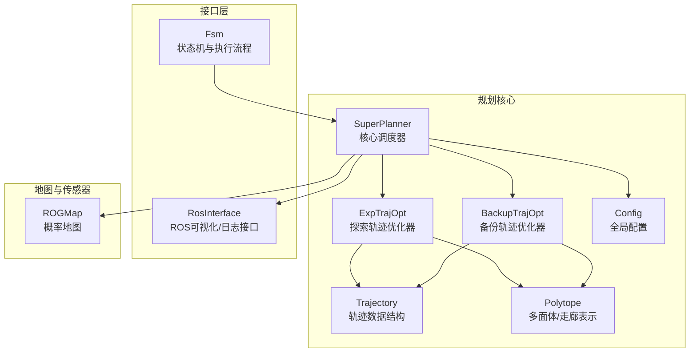
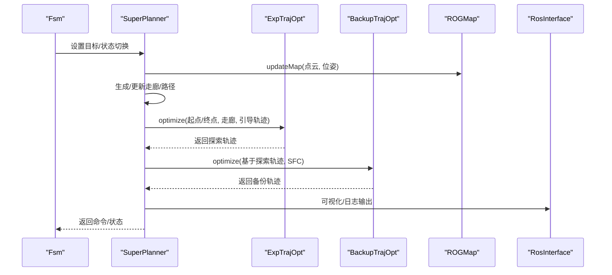
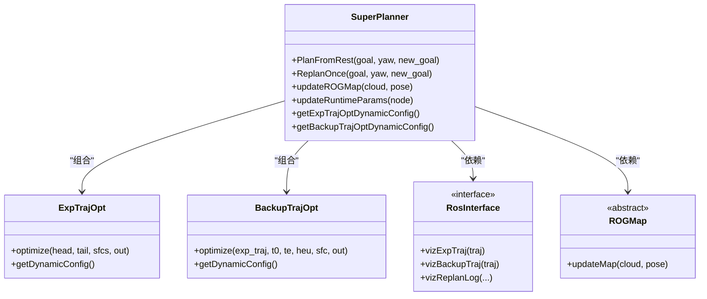
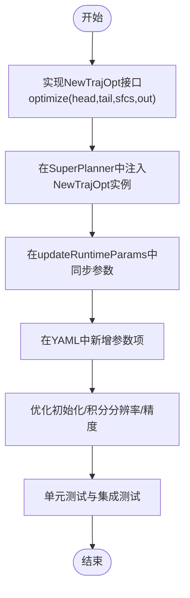
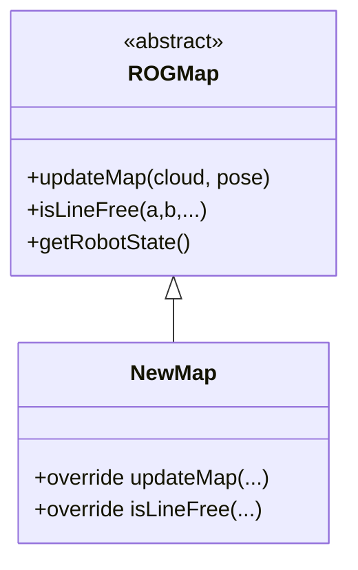
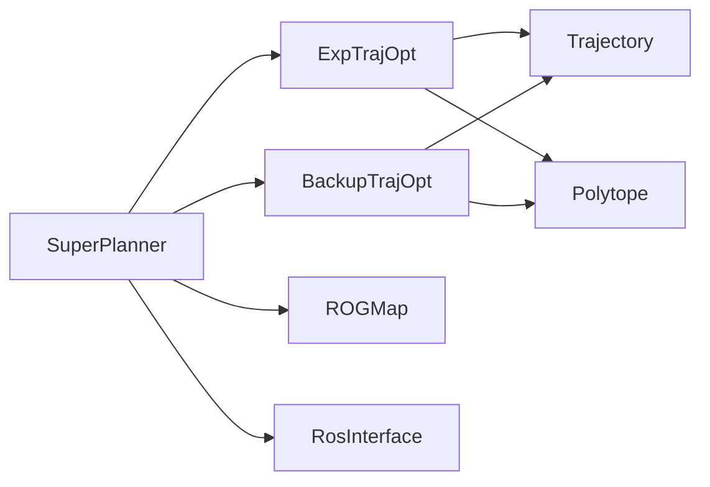

# 扩展开发指南

<cite>
**本文档引用的文件**   
- [src/SUPER/super_planner/include/super_core/super_planner.h](file://src/SUPER/super_planner/include/super_core/super_planner.h)
- [src/SUPER/super_planner/include/traj_opt/exp_traj_optimizer_s4.h](file://src/SUPER/super_planner/include/traj_opt/exp_traj_optimizer_s4.h)
- [src/SUPER/super_planner/include/traj_opt/backup_traj_optimizer_s4.h](file://src/SUPER/super_planner/include/traj_opt/backup_traj_optimizer_s4.h)
- [src/SUPER/super_planner/include/traj_opt/super_traj_config.h](file://src/SUPER/super_planner/include/traj_opt/super_traj_config.h)
- [src/SUPER/super_planner/include/traj_opt/config.hpp](file://src/SUPER/super_planner/include/traj_opt/config.hpp)
- [src/SUPER/super_planner/include/super_core/config.hpp](file://src/SUPER/super_planner/include/super_core/config.hpp)
- [src/SUPER/super_planner/include/data_structure/base/trajectory.h](file://src/SUPER/super_planner/include/data_structure/base/trajectory.h)
- [src/SUPER/super_planner/include/data_structure/base/polytope.h](file://src/SUPER/super_planner/include/data_structure/base/polytope.h)
- [src/SUPER/super_planner/include/ros_interface/ros_interface.hpp](file://src/SUPER/super_planner/include/ros_interface/ros_interface.hpp)
- [src/SUPER/rog_map/include/rog_map/rog_map.h](file://src/SUPER/rog_map/include/rog_map/rog_map.h)
- [src/SUPER/super_planner/config/static_dense.yaml](file://src/SUPER/super_planner/config/static_dense.yaml)
- [src/SUPER/super_planner/include/fsm/fsm.h](file://src/SUPER/super_planner/include/fsm/fsm.h)
</cite>

## 目录
1. [简介](#简介)
2. [项目结构](#项目结构)
3. [核心组件](#核心组件)
4. [架构总览](#架构总览)
5. [详细组件分析](#详细组件分析)
6. [依赖关系分析](#依赖关系分析)
7. [性能考虑](#性能考虑)
8. [故障排查指南](#故障排查指南)
9. [结论](#结论)
10. [附录](#附录)

## 简介
本指南面向在SUPER框架上进行扩展开发的工程师，系统阐述如何在现有架构上新增功能模块，包括：
- 新规划算法的集成方法与接口规范
- 插件系统的使用方式与扩展点
- 接口扩展技术细节（消息、服务、参数系统）
- 核心类的继承与扩展机制（SuperPlanner、TrajectoryOptimizer等）
- 新轨迹优化器开发的完整示例（接口实现、参数配置、性能优化）
- 新地图类型与传感器模块的开发（接口规范与集成流程）
- ROS2接口扩展（消息、服务、参数）的实践
- 最佳实践与设计模式
- 调试技巧与性能分析方法

## 项目结构
SUPER框架采用“模块化+分层”的组织方式：
- super_planner：核心规划器与轨迹优化器
- rog_map：地图与传感器数据处理
- mars_uav_sim：仿真与可视化
- mission_planner：任务规划应用

下图展示关键模块之间的关系与交互：



**图表来源**
- [src/SUPER/super_planner/include/super_core/super_planner.h](file://src/SUPER/super_planner/include/super_core/super_planner.h#L59-L296)
- [src/SUPER/super_planner/include/traj_opt/exp_traj_optimizer_s4.h](file://src/SUPER/super_planner/include/traj_opt/exp_traj_optimizer_s4.h#L55-L371)
- [src/SUPER/super_planner/include/traj_opt/backup_traj_optimizer_s4.h](file://src/SUPER/super_planner/include/traj_opt/backup_traj_optimizer_s4.h#L52-L212)
- [src/SUPER/super_planner/include/super_core/config.hpp](file://src/SUPER/super_planner/include/super_core/config.hpp#L44-L235)
- [src/SUPER/super_planner/include/data_structure/base/trajectory.h](file://src/SUPER/super_planner/include/data_structure/base/trajectory.h#L56-L176)
- [src/SUPER/super_planner/include/data_structure/base/polytope.h](file://src/SUPER/super_planner/include/data_structure/base/polytope.h#L42-L159)
- [src/SUPER/super_planner/include/ros_interface/ros_interface.hpp](file://src/SUPER/super_planner/include/ros_interface/ros_interface.hpp#L43-L154)
- [src/SUPER/rog_map/include/rog_map/rog_map.h](file://src/SUPER/rog_map/include/rog_map/rog_map.h#L39-L131)
- [src/SUPER/super_planner/include/fsm/fsm.h](file://src/SUPER/super_planner/include/fsm/fsm.h#L41-L172)

**章节来源**
- [src/SUPER/super_planner/include/super_core/super_planner.h](file://src/SUPER/super_planner/include/super_core/super_planner.h#L59-L296)
- [src/SUPER/super_planner/include/fsm/fsm.h](file://src/SUPER/super_planner/include/fsm/fsm.h#L41-L172)

## 核心组件
- SuperPlanner：规划器主控，负责协调地图、路径搜索、轨迹优化、状态机与ROS接口，提供对外统一的规划入口与参数同步能力。
- ExpTrajOpt/BackupTrajOpt：两类轨迹优化器，分别负责探索轨迹与备份轨迹的生成，均支持动态参数配置与热更新。
- Config/SuperTrajConfig：参数配置体系，支持从YAML加载与ROS2参数服务器热更新。
- Trajectory/Polytope：轨迹与走廊的数据结构抽象，提供解析、拼接、查询等操作。
- RosInterface：ROS可视化与日志接口抽象，便于替换具体实现。
- ROGMap：地图抽象，提供点云更新、可达性判断、邻近查询等。

**章节来源**
- [src/SUPER/super_planner/include/super_core/super_planner.h](file://src/SUPER/super_planner/include/super_core/super_planner.h#L59-L296)
- [src/SUPER/super_planner/include/traj_opt/exp_traj_optimizer_s4.h](file://src/SUPER/super_planner/include/traj_opt/exp_traj_optimizer_s4.h#L55-L371)
- [src/SUPER/super_planner/include/traj_opt/backup_traj_optimizer_s4.h](file://src/SUPER/super_planner/include/traj_opt/backup_traj_optimizer_s4.h#L52-L212)
- [src/SUPER/super_planner/include/traj_opt/super_traj_config.h](file://src/SUPER/super_planner/include/traj_opt/super_traj_config.h#L37-L179)
- [src/SUPER/super_planner/include/super_core/config.hpp](file://src/SUPER/super_planner/include/super_core/config.hpp#L44-L235)
- [src/SUPER/super_planner/include/data_structure/base/trajectory.h](file://src/SUPER/super_planner/include/data_structure/base/trajectory.h#L56-L176)
- [src/SUPER/super_planner/include/data_structure/base/polytope.h](file://src/SUPER/super_planner/include/data_structure/base/polytope.h#L42-L159)
- [src/SUPER/super_planner/include/ros_interface/ros_interface.hpp](file://src/SUPER/super_planner/include/ros_interface/ros_interface.hpp#L43-L154)
- [src/SUPER/rog_map/include/rog_map/rog_map.h](file://src/SUPER/rog_map/include/rog_map/rog_map.h#L39-L131)

## 架构总览
下图展示从状态机到规划器再到优化器与地图的整体调用链路：



**图表来源**
- [src/SUPER/super_planner/include/fsm/fsm.h](file://src/SUPER/super_planner/include/fsm/fsm.h#L104-L121)
- [src/SUPER/super_planner/include/super_core/super_planner.h](file://src/SUPER/super_planner/include/super_core/super_planner.h#L139-L146)
- [src/SUPER/super_planner/include/traj_opt/exp_traj_optimizer_s4.h](file://src/SUPER/super_planner/include/traj_opt/exp_traj_optimizer_s4.h#L342-L349)
- [src/SUPER/super_planner/include/traj_opt/backup_traj_optimizer_s4.h](file://src/SUPER/super_planner/include/traj_opt/backup_traj_optimizer_s4.h#L183-L192)
- [src/SUPER/rog_map/include/rog_map/rog_map.h](file://src/SUPER/rog_map/include/rog_map/rog_map.h#L112-L112)
- [src/SUPER/super_planner/include/ros_interface/ros_interface.hpp](file://src/SUPER/super_planner/include/ros_interface/ros_interface.hpp#L98-L136)

## 详细组件分析

### SuperPlanner 继承与扩展机制
- 角色定位：作为顶层编排者，持有地图、路径搜索、轨迹优化器、状态机与ROS接口的实例，提供统一的规划入口与参数同步。
- 关键扩展点：
  - 新增轨迹优化器：在构造函数中注入新优化器实例，并在规划流程中调用其optimize接口。
  - 参数同步：通过updateRuntimeParams将ROS2参数同步至各优化器的动态配置。
  - 可视化与日志：通过RosInterface统一发布轨迹、走廊与重规划日志。
- 接口扩展建议：
  - 若需新增规划阶段，可在规划流程中插入新步骤，并通过RosInterface输出中间结果。
  - 若需新增地图类型，实现ROGMap的派生类并在SuperPlanner中替换使用。



**图表来源**
- [src/SUPER/super_planner/include/super_core/super_planner.h](file://src/SUPER/super_planner/include/super_core/super_planner.h#L59-L296)
- [src/SUPER/super_planner/include/traj_opt/exp_traj_optimizer_s4.h](file://src/SUPER/super_planner/include/traj_opt/exp_traj_optimizer_s4.h#L55-L371)
- [src/SUPER/super_planner/include/traj_opt/backup_traj_optimizer_s4.h](file://src/SUPER/super_planner/include/traj_opt/backup_traj_optimizer_s4.h#L52-L212)
- [src/SUPER/super_planner/include/ros_interface/ros_interface.hpp](file://src/SUPER/super_planner/include/ros_interface/ros_interface.hpp#L43-L154)
- [src/SUPER/rog_map/include/rog_map/rog_map.h](file://src/SUPER/rog_map/include/rog_map/rog_map.h#L39-L131)

**章节来源**
- [src/SUPER/super_planner/include/super_core/super_planner.h](file://src/SUPER/super_planner/include/super_core/super_planner.h#L104-L296)

### 轨迹优化器扩展：新增优化器开发示例
目标：在SuperPlanner中集成一个新的轨迹优化器（例如名为NewTrajOpt），实现以下步骤：
1. 定义接口与数据结构
   - 实现optimize接口，输入为起点/终点状态、走廊或引导轨迹，输出为Trajectory。
   - 提供getDynamicConfig接口，返回动态参数配置引用。
2. 注入到SuperPlanner
   - 在SuperPlanner构造函数中创建NewTrajOpt实例并持有。
   - 在规划流程中调用其optimize，并将结果接入整体流程。
3. 参数配置与同步
   - 在SuperTrajConfig中增加新参数项，并在SuperPlanner::updateRuntimeParams中同步到新优化器。
   - 在YAML配置文件中新增对应命名空间的参数项。
4. 性能优化
   - 使用默认初始化策略与热启动策略减少初始化开销。
   - 控制积分分辨率与优化精度，平衡性能与收敛稳定性。
   - 对动态参数访问加锁，避免并发修改。



**图表来源**
- [src/SUPER/super_planner/include/traj_opt/exp_traj_optimizer_s4.h](file://src/SUPER/super_planner/include/traj_opt/exp_traj_optimizer_s4.h#L329-L367)
- [src/SUPER/super_planner/include/traj_opt/backup_traj_optimizer_s4.h](file://src/SUPER/super_planner/include/traj_opt/backup_traj_optimizer_s4.h#L158-L210)
- [src/SUPER/super_planner/include/traj_opt/super_traj_config.h](file://src/SUPER/super_planner/include/traj_opt/super_traj_config.h#L72-L177)
- [src/SUPER/super_planner/include/super_core/super_planner.h](file://src/SUPER/super_planner/include/super_core/super_planner.h#L241-L295)
- [src/SUPER/super_planner/config/static_dense.yaml](file://src/SUPER/super_planner/config/static_dense.yaml#L50-L94)

**章节来源**
- [src/SUPER/super_planner/include/traj_opt/exp_traj_optimizer_s4.h](file://src/SUPER/super_planner/include/traj_opt/exp_traj_optimizer_s4.h#L329-L367)
- [src/SUPER/super_planner/include/traj_opt/backup_traj_optimizer_s4.h](file://src/SUPER/super_planner/include/traj_opt/backup_traj_optimizer_s4.h#L158-L210)
- [src/SUPER/super_planner/include/traj_opt/super_traj_config.h](file://src/SUPER/super_planner/include/traj_opt/super_traj_config.h#L72-L177)
- [src/SUPER/super_planner/include/super_core/super_planner.h](file://src/SUPER/super_planner/include/super_core/super_planner.h#L241-L295)
- [src/SUPER/super_planner/config/static_dense.yaml](file://src/SUPER/super_planner/config/static_dense.yaml#L50-L94)

### 地图类型与传感器模块扩展
- 新地图类型
  - 继承ROGMap，实现updateMap、可达性判断、邻近查询等接口。
  - 在SuperPlanner中替换地图指针，确保updateROGMap调用正确转发。
- 传感器模块
  - 将点云/里程计等传感器数据封装为PointCloud与Pose，调用updateMap完成增量更新。
  - 可通过YAML配置选择是否启用ROS回调自动更新地图。



**图表来源**
- [src/SUPER/rog_map/include/rog_map/rog_map.h](file://src/SUPER/rog_map/include/rog_map/rog_map.h#L39-L131)
- [src/SUPER/super_planner/include/super_core/super_planner.h](file://src/SUPER/super_planner/include/super_core/super_planner.h#L226-L228)

**章节来源**
- [src/SUPER/rog_map/include/rog_map/rog_map.h](file://src/SUPER/rog_map/include/rog_map/rog_map.h#L39-L131)
- [src/SUPER/super_planner/include/super_core/super_planner.h](file://src/SUPER/super_planner/include/super_core/super_planner.h#L226-L228)

### ROS2 接口扩展
- 新消息类型
  - 在对应包的msg目录下定义消息，使用CMakeLists.txt与package.xml注册。
  - 在RosInterface中新增对应的可视化/日志发布方法。
- 新服务接口
  - 在srv目录定义服务，注册后在节点中实现服务回调。
- 参数系统扩展
  - 在YAML中新增参数项，使用命名空间区分不同模块。
  - 在Config与SuperTrajConfig中读取参数，并在updateRuntimeParams中同步到运行时配置。

```mermaid
sequenceDiagram
participant Node as "ROS2节点"
participant Param as "参数服务器"
participant SP as "SuperPlanner"
participant Opt as "优化器"
Node->>Param : set_parameters(新参数)
Param-->>SP : 回调通知
SP->>SP : updateRuntimeParams(node)
SP->>Opt : 同步动态参数
Opt-->>SP : 参数更新完成
```

**图表来源**
- [src/SUPER/super_planner/include/super_core/config.hpp](file://src/SUPER/super_planner/include/super_core/config.hpp#L158-L228)
- [src/SUPER/super_planner/include/traj_opt/super_traj_config.h](file://src/SUPER/super_planner/include/traj_opt/super_traj_config.h#L72-L177)
- [src/SUPER/super_planner/include/super_core/super_planner.h](file://src/SUPER/super_planner/include/super_core/super_planner.h#L241-L295)

**章节来源**
- [src/SUPER/super_planner/include/super_core/config.hpp](file://src/SUPER/super_planner/include/super_core/config.hpp#L158-L228)
- [src/SUPER/super_planner/include/traj_opt/super_traj_config.h](file://src/SUPER/super_planner/include/traj_opt/super_traj_config.h#L72-L177)
- [src/SUPER/super_planner/include/super_core/super_planner.h](file://src/SUPER/super_planner/include/super_core/super_planner.h#L241-L295)

### 数据结构与算法要点
- Trajectory
  - 提供轨迹拼接、分段查询、状态插值、边界检查等能力，是优化器与状态机之间的通用数据载体。
- Polytope
  - 表示安全走廊或障碍物多面体，支持交叠、简化与点内判断，是轨迹优化的重要输入。
- 优化器内部变量
  - 包含时间分配、路径点、梯度、惩罚权重、MINCO求解器等，通过updateOptimizerConfig在每次优化前同步最新参数。

**章节来源**
- [src/SUPER/super_planner/include/data_structure/base/trajectory.h](file://src/SUPER/super_planner/include/data_structure/base/trajectory.h#L56-L176)
- [src/SUPER/super_planner/include/data_structure/base/polytope.h](file://src/SUPER/super_planner/include/data_structure/base/polytope.h#L42-L159)
- [src/SUPER/super_planner/include/traj_opt/exp_traj_optimizer_s4.h](file://src/SUPER/super_planner/include/traj_opt/exp_traj_optimizer_s4.h#L62-L127)
- [src/SUPER/super_planner/include/traj_opt/backup_traj_optimizer_s4.h](file://src/SUPER/super_planner/include/traj_opt/backup_traj_optimizer_s4.h#L63-L122)

## 依赖关系分析
- 组件耦合
  - SuperPlanner对优化器与地图存在强依赖；优化器之间相互独立，可通过SuperPlanner统一编排。
  - RosInterface为抽象接口，便于替换具体实现（如Rviz、Web可视化）。
- 外部依赖
  - YAML配置加载、ROS2参数系统、Eigen矩阵运算、Cereal序列化等。
- 潜在循环依赖
  - 当前结构清晰，无明显循环依赖；新增模块应避免反向依赖。



**图表来源**
- [src/SUPER/super_planner/include/super_core/super_planner.h](file://src/SUPER/super_planner/include/super_core/super_planner.h#L62-L70)
- [src/SUPER/super_planner/include/traj_opt/exp_traj_optimizer_s4.h](file://src/SUPER/super_planner/include/traj_opt/exp_traj_optimizer_s4.h#L55-L61)
- [src/SUPER/super_planner/include/traj_opt/backup_traj_optimizer_s4.h](file://src/SUPER/super_planner/include/traj_opt/backup_traj_optimizer_s4.h#L52-L61)
- [src/SUPER/super_planner/include/data_structure/base/trajectory.h](file://src/SUPER/super_planner/include/data_structure/base/trajectory.h#L56-L56)
- [src/SUPER/super_planner/include/data_structure/base/polytope.h](file://src/SUPER/super_planner/include/data_structure/base/polytope.h#L42-L42)
- [src/SUPER/super_planner/include/ros_interface/ros_interface.hpp](file://src/SUPER/super_planner/include/ros_interface/ros_interface.hpp#L43-L43)

**章节来源**
- [src/SUPER/super_planner/include/super_core/super_planner.h](file://src/SUPER/super_planner/include/super_core/super_planner.h#L62-L70)

## 性能考虑
- 参数与初始化
  - 使用默认初始化与热启动策略，减少每次优化的初始化成本。
  - 合理设置积分分辨率与优化精度，避免过度求解导致延迟。
- 线程安全
  - 动态参数访问使用互斥锁保护，避免并发修改导致的未定义行为。
- 可视化与日志
  - 可视化与日志输出可能引入额外开销，建议在实时性要求高的场景关闭或降低频率。
- 地图更新
  - 地图更新频率与点云密度需平衡，避免频繁更新造成CPU压力。

[本节为通用指导，无需特定文件引用]

## 故障排查指南
- 参数未生效
  - 检查YAML命名空间与参数名是否一致；确认updateRuntimeParams是否被调用。
- 轨迹不可行
  - 检查走廊Polytope是否为空或退化；确认边界条件与惩罚权重设置合理。
- 性能异常
  - 查看优化器日志与积分分辨率；评估初始化策略是否合适。
- 可视化缺失
  - 确认RosInterface实现与可视化开关；检查主题名称与频率配置。

**章节来源**
- [src/SUPER/super_planner/include/super_core/config.hpp](file://src/SUPER/super_planner/include/super_core/config.hpp#L158-L228)
- [src/SUPER/super_planner/include/traj_opt/config.hpp](file://src/SUPER/super_planner/include/traj_opt/config.hpp#L110-L182)
- [src/SUPER/super_planner/include/ros_interface/ros_interface.hpp](file://src/SUPER/super_planner/include/ros_interface/ros_interface.hpp#L139-L147)

## 结论
通过遵循本指南的扩展方法与最佳实践，开发者可以在SUPER框架上高效地集成新的规划算法、地图类型与传感器模块，并通过ROS2参数系统与可视化接口实现灵活的在线调试与验证。建议在新增模块时严格遵循接口契约、参数命名规范与线程安全原则，确保系统的稳定性与可维护性。

[本节为总结，无需特定文件引用]

## 附录
- 配置参考
  - YAML参数命名空间与字段参考：[static_dense.yaml](file://src/SUPER/super_planner/config/static_dense.yaml#L11-L186)
- 关键类与方法速查
  - SuperPlanner：规划入口、参数同步、地图更新、轨迹获取
  - ExpTrajOpt/BackupTrajOpt：优化接口、动态参数访问、初始化策略
  - RosInterface：可视化与日志接口抽象
  - ROGMap：地图抽象与更新

**章节来源**
- [src/SUPER/super_planner/config/static_dense.yaml](file://src/SUPER/super_planner/config/static_dense.yaml#L11-L186)
- [src/SUPER/super_planner/include/super_core/super_planner.h](file://src/SUPER/super_planner/include/super_core/super_planner.h#L104-L296)
- [src/SUPER/super_planner/include/traj_opt/exp_traj_optimizer_s4.h](file://src/SUPER/super_planner/include/traj_opt/exp_traj_optimizer_s4.h#L329-L367)
- [src/SUPER/super_planner/include/traj_opt/backup_traj_optimizer_s4.h](file://src/SUPER/super_planner/include/traj_opt/backup_traj_optimizer_s4.h#L158-L210)
- [src/SUPER/super_planner/include/ros_interface/ros_interface.hpp](file://src/SUPER/super_planner/include/ros_interface/ros_interface.hpp#L43-L154)
- [src/SUPER/rog_map/include/rog_map/rog_map.h](file://src/SUPER/rog_map/include/rog_map/rog_map.h#L39-L131)