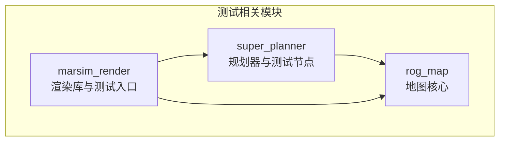
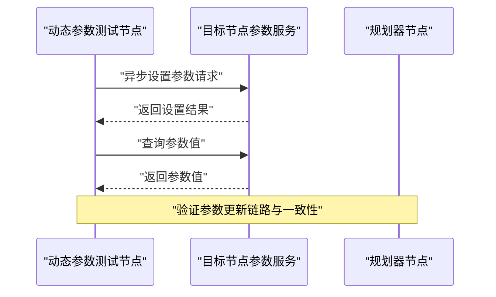
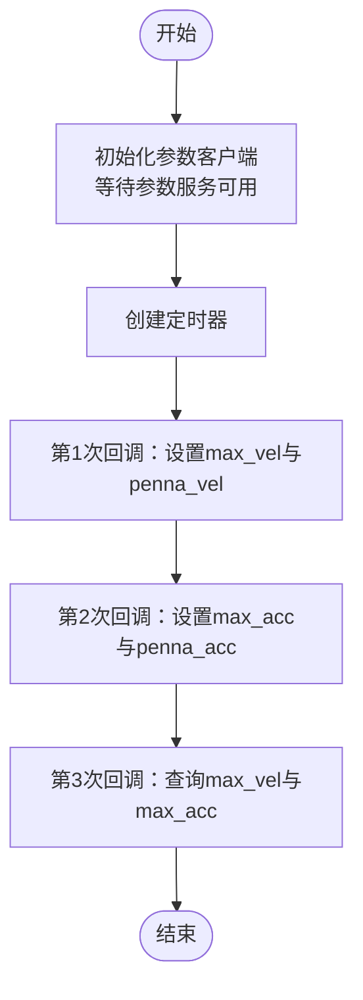
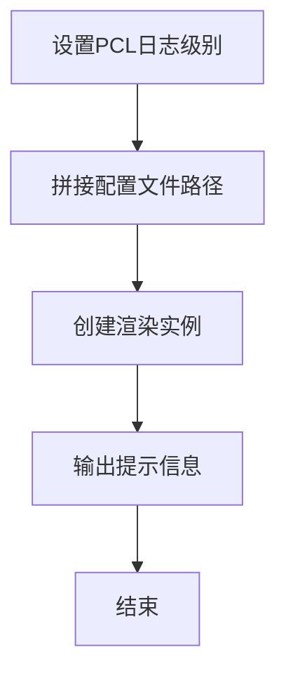
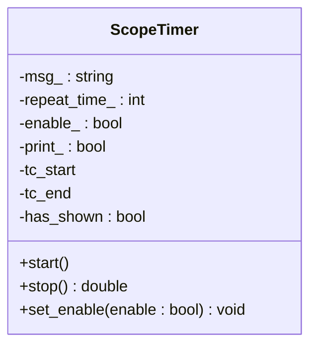
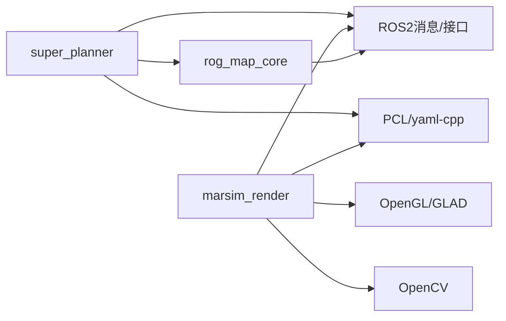

# 测试策略与质量保证

<cite>
**本文引用的文件**
- [super_planner/CMakeLists.txt](file://src/SUPER/super_planner/CMakeLists.txt)
- [marsim_render/CMakeLists.txt](file://src/SUPER/mars_uav_sim/marsim_render/CMakeLists.txt)
- [rog_map/CMakeLists.txt](file://src/SUPER/rog_map/CMakeLists.txt)
- [test_dynamic_params.cpp](file://src/SUPER/super_planner/test/test_dynamic_params.cpp)
- [main.cpp（渲染测试）](file://src/SUPER/mars_uav_sim/marsim_render/test/main.cpp)
- [scope_timer.hpp（计时器工具）](file://src/SUPER/super_planner/include/utils/header/scope_timer.hpp)
- [backward.hpp（堆栈追踪）](file://src/SUPER/super_planner/include/utils/header/backward.hpp)
- [package.xml（super_planner）](file://src/SUPER/super_planner/package.xml)
- [package.xml（marsim_render）](file://src/SUPER/mars_uav_sim/marsim_render/package.xml)
- [package.xml（rog_map）](file://src/SUPER/rog_map/package.xml)
- [install_dependencies.sh](file://src/SUPER/install_dependencies.sh)
</cite>

## 目录
1. [引言](#引言)
2. [项目结构](#项目结构)
3. [核心组件](#核心组件)
4. [架构总览](#架构总览)
5. [详细组件分析](#详细组件分析)
6. [依赖关系分析](#依赖关系分析)
7. [性能考量](#性能考量)
8. [故障排查指南](#故障排查指南)
9. [结论](#结论)
10. [附录](#附录)

## 引言
本文件面向SUPER项目的测试策略与质量保证，系统化阐述单元测试、集成测试与性能测试的组织与实施方法；明确测试框架选择与配置要点（如Google Test在本仓库中的使用现状与建议），并给出针对轨迹优化器、路径搜索算法、地图系统的关键测试策略。同时覆盖性能基准测试的实施步骤（基准数据集准备、性能指标定义、结果分析）、持续集成流程（自动化测试、代码覆盖率监控、构建流水线）、回归测试方案、代码质量检查工具（静态分析、内存检查、代码风格）以及测试数据管理与测试环境搭建方法。

## 项目结构
从测试视角看，项目由多个ROS2包构成，其中super_planner、marsim_render、rog_map三个子包与测试密切相关：
- super_planner：包含规划器主逻辑、轨迹优化、路径搜索、ROS接口与测试节点（动态参数测试）
- marsim_render：包含渲染库与最小可运行示例（test/main.cpp）
- rog_map：包含地图核心实现与ROS接口

下图展示测试相关模块的结构关系与依赖方向：

图表来源
- [super_planner/CMakeLists.txt](file://src/SUPER/super_planner/CMakeLists.txt#L101-L151)
- [marsim_render/CMakeLists.txt](file://src/SUPER/mars_uav_sim/marsim_render/CMakeLists.txt#L103-L114)
- [rog_map/CMakeLists.txt](file://src/SUPER/rog_map/CMakeLists.txt#L73-L87)

章节来源
- [super_planner/CMakeLists.txt](file://src/SUPER/super_planner/CMakeLists.txt#L1-L188)
- [marsim_render/CMakeLists.txt](file://src/SUPER/mars_uav_sim/marsim_render/CMakeLists.txt#L1-L132)
- [rog_map/CMakeLists.txt](file://src/SUPER/rog_map/CMakeLists.txt#L1-L114)

## 核心组件
- 规划器动态参数测试节点：通过异步参数客户端对目标节点的动态参数进行设置与查询，验证参数更新链路的正确性与稳定性。
- 渲染库最小可运行测试：加载配置并初始化渲染实例，验证渲染库基本功能与依赖链接。
- 计时器工具：提供高精度计时能力，便于性能测试与热点定位。
- 堆栈追踪工具：在异常或错误时输出详细堆栈信息，辅助问题定位与回归分析。

章节来源
- [test_dynamic_params.cpp](file://src/SUPER/super_planner/test/test_dynamic_params.cpp#L1-L118)
- [main.cpp（渲染测试）](file://src/SUPER/mars_uav_sim/marsim_render/test/main.cpp#L1-L14)
- [scope_timer.hpp（计时器工具）](file://src/SUPER/super_planner/include/utils/header/scope_timer.hpp#L77-L114)
- [backward.hpp（堆栈追踪）](file://src/SUPER/super_planner/include/utils/header/backward.hpp#L136-L4083)

## 架构总览
下图展示测试相关组件在系统中的交互关系与控制流：

图表来源
- [test_dynamic_params.cpp](file://src/SUPER/super_planner/test/test_dynamic_params.cpp#L10-L107)

章节来源
- [test_dynamic_params.cpp](file://src/SUPER/super_planner/test/test_dynamic_params.cpp#L1-L118)

## 详细组件分析

### 组件A：动态参数测试节点
- 职责：验证规划器节点的动态参数更新与查询功能，确保参数变更能被正确接收与应用。
- 关键流程：
  - 初始化异步参数客户端并等待目标节点参数服务可用
  - 定时触发参数设置与查询操作
  - 输出设置结果与参数值，结束测试
- 设计要点：
  - 使用定时器周期性执行测试步骤，避免一次性测试带来的时序不确定性
  - 对参数设置结果进行逐项校验，确保每个参数均成功更新
  - 在最终阶段查询关键参数值，验证参数生效情况

图表来源
- [test_dynamic_params.cpp](file://src/SUPER/super_planner/test/test_dynamic_params.cpp#L10-L107)

章节来源
- [test_dynamic_params.cpp](file://src/SUPER/super_planner/test/test_dynamic_params.cpp#L1-L118)

### 组件B：渲染库最小可运行测试
- 职责：验证渲染库的基本初始化与配置加载能力，确保第三方库（如PCL、OpenGL、GLAD等）正确链接。
- 关键流程：
  - 设置PCL日志级别以抑制警告
  - 拼接配置文件路径并创建渲染实例
  - 输出简单提示信息，验证程序可正常启动

图表来源
- [main.cpp（渲染测试）](file://src/SUPER/mars_uav_sim/marsim_render/test/main.cpp#L1-L14)

章节来源
- [main.cpp（渲染测试）](file://src/SUPER/mars_uav_sim/marsim_render/test/main.cpp#L1-L14)

### 组件C：计时器工具（性能测试支撑）
- 职责：提供高精度时间测量能力，支持重复计时与单位自动转换，便于性能测试与热点分析。
- 关键特性：
  - 自动检测并输出纳秒/微秒/毫秒/秒级时间
  - 支持启用/禁用与打印开关
  - 提供start/stop接口，便于手动计时

图表来源
- [scope_timer.hpp（计时器工具）](file://src/SUPER/super_planner/include/utils/header/scope_timer.hpp#L77-L114)

章节来源
- [scope_timer.hpp（计时器工具）](file://src/SUPER/super_planner/include/utils/header/scope_timer.hpp#L46-L119)

### 组件D：堆栈追踪工具（调试与回归）
- 职责：在发生异常或错误时输出详细堆栈信息，辅助快速定位问题根因。
- 关键特性：
  - 支持多种后端（如libdw、libbfd、libdwarf）以提取对象文件名、函数名、源文件名、行号等
  - 可选着色输出与反向打印
  - 与ROS日志系统配合使用，便于在CI中统一输出

章节来源
- [backward.hpp（堆栈追踪）](file://src/SUPER/super_planner/include/utils/header/backward.hpp#L136-L4083)

## 依赖关系分析
- super_planner依赖rog_map提供的地图核心能力，并链接PCL、yaml-cpp等第三方库
- marsim_render依赖OpenGL、GLAD、PCL、OpenCV等库，并通过CMake导出头文件与库
- 包依赖通过ament机制管理，CMakeLists中显式声明了ROS2消息与接口生成

图表来源
- [super_planner/CMakeLists.txt](file://src/SUPER/super_planner/CMakeLists.txt#L101-L151)
- [marsim_render/CMakeLists.txt](file://src/SUPER/mars_uav_sim/marsim_render/CMakeLists.txt#L103-L114)
- [rog_map/CMakeLists.txt](file://src/SUPER/rog_map/CMakeLists.txt#L73-L87)

章节来源
- [super_planner/CMakeLists.txt](file://src/SUPER/super_planner/CMakeLists.txt#L33-L125)
- [marsim_render/CMakeLists.txt](file://src/SUPER/mars_uav_sim/marsim_render/CMakeLists.txt#L46-L114)
- [rog_map/CMakeLists.txt](file://src/SUPER/rog_map/CMakeLists.txt#L29-L87)

## 性能考量
- 计时器工具可用于性能测试：在关键路径插入start/stop，统计平均耗时与方差，识别性能瓶颈
- 基准测试建议：
  - 准备不同规模与复杂度的地图与任务场景作为基准数据集
  - 定义关键指标：路径计算时间、轨迹优化时间、内存占用峰值、CPU/GPU利用率
  - 多轮重复实验，剔除预热期，记录稳定期数据并进行统计分析
- 代码层面优化：
  - 合理利用缓存与批处理减少重复计算
  - 避免不必要的拷贝与动态分配
  - 利用并行计算（如OpenMP）加速独立任务

## 故障排查指南
- 参数更新失败：
  - 检查目标节点是否已启动且参数服务可用
  - 校验参数名称与命名空间是否正确
  - 查看设置结果与错误原因，必要时启用更详细的日志
- 渲染库初始化失败：
  - 确认配置文件路径有效且可读
  - 检查OpenGL/GLAD、PCL、OpenCV等依赖是否正确安装与链接
- 崩溃或异常：
  - 启用堆栈追踪工具，结合日志定位调用链
  - 使用内存检查工具（如Valgrind）排查内存泄漏与越界访问

章节来源
- [test_dynamic_params.cpp](file://src/SUPER/super_planner/test/test_dynamic_params.cpp#L18-L25)
- [backward.hpp（堆栈追踪）](file://src/SUPER/super_planner/include/utils/header/backward.hpp#L136-L4083)

## 结论
本仓库已具备基础的测试能力：动态参数测试节点验证了参数更新链路，渲染库测试验证了依赖链接与初始化流程，计时器与堆栈追踪工具为性能与调试提供了支撑。建议进一步完善单元测试与集成测试框架（如引入Google Test），建立持续集成流水线与代码覆盖率监控，并制定回归测试策略与性能基准测试规范，以全面提升代码质量与交付可靠性。

## 附录

### A. 测试框架选择与配置建议
- 当前状态：仓库未发现Google Test相关配置或测试源码
- 建议：
  - 在CMakeLists中添加Google Test依赖与测试目标
  - 将单元测试与集成测试分离，分别编译与运行
  - 使用ctest或colcon test进行自动化测试调度

章节来源
- [super_planner/CMakeLists.txt](file://src/SUPER/super_planner/CMakeLists.txt#L1-L188)
- [marsim_render/CMakeLists.txt](file://src/SUPER/mars_uav_sim/marsim_render/CMakeLists.txt#L1-L132)
- [rog_map/CMakeLists.txt](file://src/SUPER/rog_map/CMakeLists.txt#L1-L114)

### B. 关键模块测试策略
- 轨迹优化器：
  - 单元测试：构造典型轨迹段与约束条件，验证优化结果满足边界与连续性要求
  - 集成测试：与路径搜索结果联调，验证从路径到轨迹的完整链路
- 路径搜索算法：
  - 单元测试：在标准网格与障碍物场景下验证最优性与完备性
  - 回归测试：固定随机种子，对比历史快照以发现回归
- 地图系统：
  - 单元测试：测试raycasting、ESDF、概率栅格等核心功能
  - 集成测试：与感知模块对接，验证数据流与更新频率

### C. 性能基准测试实施
- 基准数据集准备：包含不同密度、尺寸与障碍分布的地图样本
- 指标定义：路径长度、计算时间、内存峰值、轨迹平滑度
- 分析方法：绘制箱线图与趋势图，按场景分组统计，识别异常点

### D. 持续集成流程
- 自动化测试：在CI中编译所有包并运行测试目标
- 代码覆盖率：集成gcov/lcov，生成报告并与阈值比较
- 构建流水线：多平台矩阵构建（Linux发行版、ROS版本），产物归档与发布

### E. 回归测试实施方案
- 建立回归测试套件，覆盖核心路径与高频修改区域
- 将回归测试纳入PR检查，确保新功能不破坏既有行为
- 使用快照对比与差异检测工具，自动标记回归

### F. 代码质量检查工具
- 静态分析：clang-tidy、PVS-Studio（可选）
- 内存检查：Valgrind、AddressSanitizer
- 代码风格：clang-format、cpplint（可选）

### G. 测试数据管理与测试环境搭建
- 测试数据管理：集中存放于data目录，按场景分类，版本化管理
- 测试环境：容器化（Docker）或虚拟机镜像，预装依赖与工具链
- 依赖安装：参考安装脚本与package.xml，确保构建环境一致

章节来源
- [install_dependencies.sh](file://src/SUPER/install_dependencies.sh#L61-L70)
- [package.xml（super_planner）](file://src/SUPER/super_planner/package.xml)
- [package.xml（marsim_render）](file://src/SUPER/mars_uav_sim/marsim_render/package.xml)
- [package.xml（rog_map）](file://src/SUPER/rog_map/package.xml)