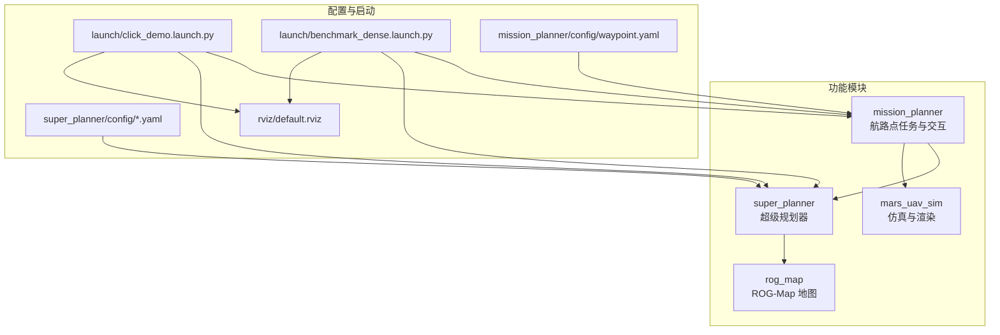
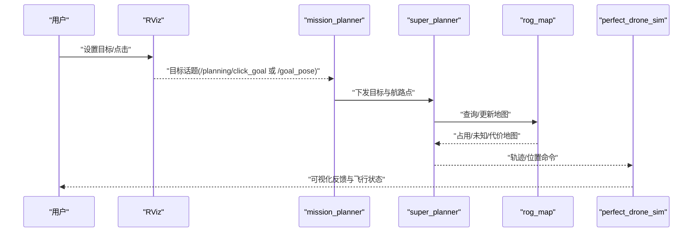
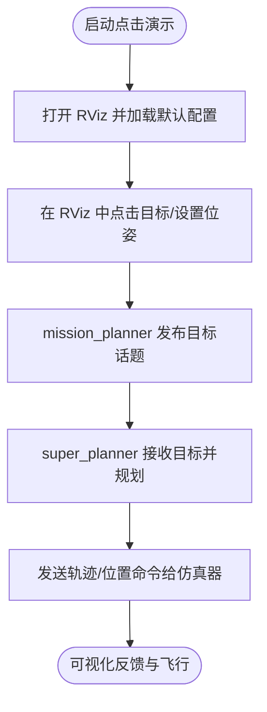
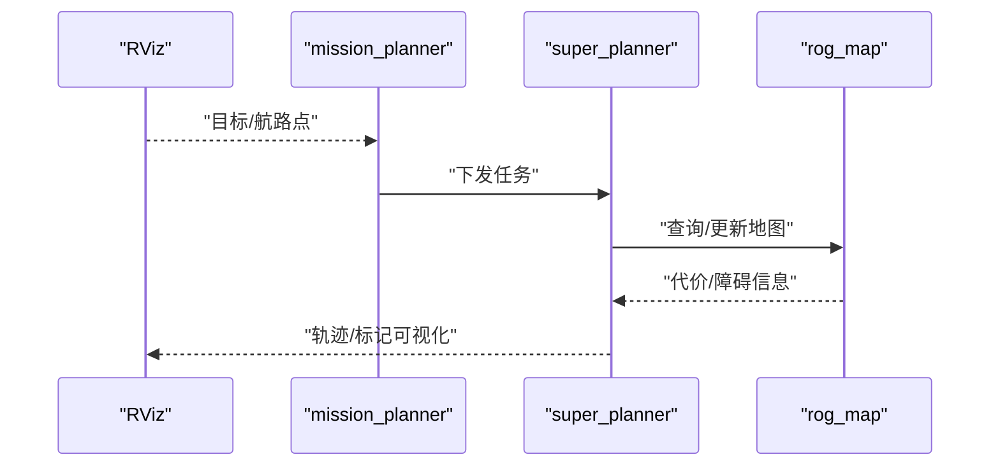
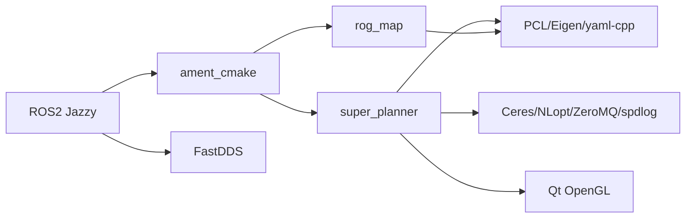

# 快速开始

<cite>
**本文引用的文件**   
- [README.md](file://README.md)
- [src/SUPER/README.md](file://src/SUPER/README.md)
- [src/SUPER/README_zh.md](file://src/SUPER/README_zh.md)
- [src/SUPER/install_dependencies.sh](file://src/SUPER/install_dependencies.sh)
- [src/SUPER/mission_planner/launch/click_demo.launch.py](file://src/SUPER/mission_planner/launch/click_demo.launch.py)
- [src/SUPER/mission_planner/launch/benchmark_dense.launch.py](file://src/SUPER/mission_planner/launch/benchmark_dense.launch.py)
- [src/SUPER/super_planner/config/click.yaml](file://src/SUPER/super_planner/config/click.yaml)
- [src/SUPER/super_planner/config/static_dense.yaml](file://src/SUPER/super_planner/config/static_dense.yaml)
- [src/SUPER/super_planner/rviz/default.rviz](file://src/SUPER/super_planner/rviz/default.rviz)
- [src/SUPER/mission_planner/config/waypoint.yaml](file://src/SUPER/mission_planner/config/waypoint.yaml)
</cite>

## 目录
1. [简介](#简介)
2. [项目结构](#项目结构)
3. [核心组件](#核心组件)
4. [架构总览](#架构总览)
5. [详细组件分析](#详细组件分析)
6. [依赖关系分析](#依赖关系分析)
7. [性能考虑](#性能考虑)
8. [故障排查指南](#故障排查指南)
9. [结论](#结论)
10. [附录](#附录)

## 简介
本指南面向首次接触 SUPER 的用户，帮助你在 Ubuntu 系统上快速完成环境准备、依赖安装、工作空间搭建与编译构建，并运行三种典型测试场景：高速导航、密集环境敏捷飞行、点击式演示。同时提供 RViz 交互方法与常见问题解答，确保你能以最短时间跑通第一个 demo。

## 项目结构
该仓库采用按功能模块划分的组织方式，核心模块包括：
- mission_planner：航路点任务与交互节点
- super_planner：超级规划器（含状态机、轨迹优化、A* 搜索、ROG-Map）
- rog_map：robocentric 占据栅格地图（ROG-Map）
- mars_uav_sim：仿真与渲染相关（含消息定义、渲染库、完美无人机仿真）

图表来源
- [src/SUPER/mission_planner/launch/click_demo.launch.py](file://src/SUPER/mission_planner/launch/click_demo.launch.py#L1-L98)
- [src/SUPER/mission_planner/launch/benchmark_dense.launch.py](file://src/SUPER/mission_planner/launch/benchmark_dense.launch.py#L1-L101)
- [src/SUPER/super_planner/config/click.yaml](file://src/SUPER/super_planner/config/click.yaml#L1-L190)
- [src/SUPER/super_planner/config/static_dense.yaml](file://src/SUPER/super_planner/config/static_dense.yaml#L1-L186)
- [src/SUPER/super_planner/rviz/default.rviz](file://src/SUPER/super_planner/rviz/default.rviz#L1-L484)
- [src/SUPER/mission_planner/config/waypoint.yaml](file://src/SUPER/mission_planner/config/waypoint.yaml#L1-L19)

章节来源
- [README.md](file://README.md#L1-L168)
- [src/SUPER/README.md](file://src/SUPER/README.md#L1-L278)

## 核心组件
- mission_planner：负责航路点任务、目标发布、与仿真/真实飞行器的交互；提供点击式目标发布与固定航路点两种模式。
- super_planner：核心规划模块，包含状态机（FSM）、轨迹优化、A* 路径搜索、ROG-Map 地图管理与可视化。
- rog_map：高效 robocentric 占据栅格地图，支持概率更新、ESDF、滑动窗口等特性。
- mars_uav_sim：提供仿真环境、渲染与消息定义，支撑点击演示与密集场景测试。

章节来源
- [src/SUPER/README.md](file://src/SUPER/README.md#L96-L278)
- [src/SUPER/README_zh.md](file://src/SUPER/README_zh.md#L97-L240)

## 架构总览
下图展示了从 RViz 发布目标到规划器输出轨迹命令的整体流程，涵盖点击演示与密集场景演示两条主线。

图表来源
- [src/SUPER/mission_planner/launch/click_demo.launch.py](file://src/SUPER/mission_planner/launch/click_demo.launch.py#L59-L96)
- [src/SUPER/mission_planner/launch/benchmark_dense.launch.py](file://src/SUPER/mission_planner/launch/benchmark_dense.launch.py#L59-L98)
- [src/SUPER/super_planner/config/click.yaml](file://src/SUPER/super_planner/config/click.yaml#L1-L190)
- [src/SUPER/super_planner/config/static_dense.yaml](file://src/SUPER/super_planner/config/static_dense.yaml#L1-L186)
- [src/SUPER/super_planner/rviz/default.rviz](file://src/SUPER/super_planner/rviz/default.rviz#L431-L443)

## 详细组件分析

### 环境与依赖准备
- 系统要求
  - Ubuntu 24.04 LTS（推荐）
  - ROS2 Jazzy（官方文档明确支持）
- 依赖安装
  - 推荐使用自动脚本安装全部依赖（包含 ROS2 Jazzy、PCL、Eigen、OpenCV、Python 包等）
  - 若需手动安装，可参考官方文档中的 apt 与 pip 步骤
- 工作空间与构建
  - 使用 rosdep 安装 ROS 依赖
  - 使用 colcon build 构建指定包（如 super_planner、rog_map）

章节来源
- [README.md](file://README.md#L5-L95)
- [src/SUPER/install_dependencies.sh](file://src/SUPER/install_dependencies.sh#L1-L71)

### 编译构建流程（colcon build）
- 创建并初始化工作空间
- 克隆仓库至 src/SUPER
- rosdep 安装依赖
- 构建指定包（super_planner、rog_map）
- 源码工作空间后即可运行

章节来源
- [README.md](file://README.md#L75-L95)

### 测试场景一：高速导航（点击演示）
- 启动方式
  - 源码工作空间后，使用 launch 文件启动点击演示
- 关键配置
  - super_planner 配置：启用点击目标、设置命令话题、规划参数等
  - RViz 默认配置：包含地图、轨迹、标记等显示项
- 交互方式
  - 在 RViz 中通过“Goal3DTool”发布目标位姿，或使用“2D Goal Pose”插件点击平面目标

图表来源
- [src/SUPER/mission_planner/launch/click_demo.launch.py](file://src/SUPER/mission_planner/launch/click_demo.launch.py#L59-L96)
- [src/SUPER/super_planner/config/click.yaml](file://src/SUPER/super_planner/config/click.yaml#L1-L190)
- [src/SUPER/super_planner/rviz/default.rviz](file://src/SUPER/super_planner/rviz/default.rviz#L431-L443)

章节来源
- [src/SUPER/README.md](file://src/SUPER/README.md#L161-L166)
- [src/SUPER/README_zh.md](file://src/SUPER/README_zh.md#L159-L165)

### 测试场景二：密集环境敏捷飞行
- 启动方式
  - 源码工作空间后，使用密集场景 launch 文件启动
- 关键配置
  - super_planner 配置：提高速度/加速度上限、调整走廊与感知范围等
  - mission_planner 配置：航路点发布、触发方式、切换阈值等
- 交互方式
  - 通过 RViz 发布目标或使用固定航路点序列

图表来源
- [src/SUPER/mission_planner/launch/benchmark_dense.launch.py](file://src/SUPER/mission_planner/launch/benchmark_dense.launch.py#L59-L98)
- [src/SUPER/super_planner/config/static_dense.yaml](file://src/SUPER/super_planner/config/static_dense.yaml#L1-L186)
- [src/SUPER/mission_planner/config/waypoint.yaml](file://src/SUPER/mission_planner/config/waypoint.yaml#L1-L19)

章节来源
- [src/SUPER/README.md](file://src/SUPER/README.md#L153-L159)
- [src/SUPER/README_zh.md](file://src/SUPER/README_zh.md#L151-L157)

### 测试场景三：点击式演示（RViz 交互）
- 启动方式
  - 使用点击演示 launch 文件启动
- RViz 插件使用
  - “Goal3DTool”：发布 3D 目标位姿
  - “2D Goal Pose”：在平面点击设置目标（ROS1 文档中提及）
- 可视化内容
  - 点云、ROG-Map 占据/未知层、路径、轨迹、标记数组等

章节来源
- [src/SUPER/mission_planner/launch/click_demo.launch.py](file://src/SUPER/mission_planner/launch/click_demo.launch.py#L59-L96)
- [src/SUPER/super_planner/rviz/default.rviz](file://src/SUPER/super_planner/rviz/default.rviz#L1-L484)

## 依赖关系分析
- 构建系统：ament_cmake（ROS2）
- 中间件：FastDDS（默认）
- 关键依赖：PCL、Eigen、yaml-cpp、OpenCV、Qt OpenGL、Ceres、NLopt、ZeroMQ、spdlog 等
- Python 依赖：numpy、scipy、matplotlib、pyquaternion、transforms3d

图表来源
- [README.md](file://README.md#L5-L11)
- [src/SUPER/install_dependencies.sh](file://src/SUPER/install_dependencies.sh#L10-L51)

章节来源
- [README.md](file://README.md#L5-L11)
- [src/SUPER/install_dependencies.sh](file://src/SUPER/install_dependencies.sh#L1-L71)

## 性能考虑
- 参数调优
  - 规划参数（速度/加速度/加加速度/角速度上限、规划时域、感知范围、走廊宽度等）
  - 轨迹优化权重与精度、能量代价类型、平滑参数
  - ROG-Map 分辨率、膨胀步数、ESDF 开关、滑动窗口阈值
- 可视化与实时性
  - 在高密度场景中建议关闭不必要的可视化项，降低 RViz 渲染压力
  - 合理设置重规划频率与前瞻时间，平衡实时性与安全性

章节来源
- [src/SUPER/super_planner/config/click.yaml](file://src/SUPER/super_planner/config/click.yaml#L1-L190)
- [src/SUPER/super_planner/config/static_dense.yaml](file://src/SUPER/super_planner/config/static_dense.yaml#L1-L186)

## 故障排查指南
- 包未找到
  - 确保已正确源码工作空间（source 安装目录下的 setup.bash）
- 构建错误
  - 确认已安装全部依赖，且 ROS2 版本匹配（Jazzy）
- 权限问题
  - 确保工作空间目录权限正确
- 依赖缺失
  - 使用自动安装脚本或参考手动安装步骤补齐系统与 Python 依赖
- 已知限制
  - 项目主要针对 ROS2 Jazzy 进行验证；ROS1 Noetic 为一级支持平台，但 ROS2 版本仍在开发中，部分可视化可能存在差异

章节来源
- [README.md](file://README.md#L132-L152)
- [src/SUPER/README.md](file://src/SUPER/README.md#L123-L129)

## 结论
按照本指南完成环境与依赖准备、工作空间搭建与构建后，你可以在最短时间内运行三种典型测试场景，并通过 RViz 进行交互。建议先从点击演示入手，熟悉基本流程后再尝试密集场景与高速场景，逐步调整参数以获得更佳性能。

## 附录

### 快速操作清单
- 安装系统与 ROS2 Jazzy
- 使用自动脚本安装依赖
- 初始化并构建工作空间（colcon build）
- 源码工作空间后，分别运行三种测试场景的 launch 文件
- 在 RViz 中使用 Goal3DTool 或 2D Goal Pose 插件进行交互

章节来源
- [README.md](file://README.md#L15-L95)
- [src/SUPER/README.md](file://src/SUPER/README.md#L161-L200)