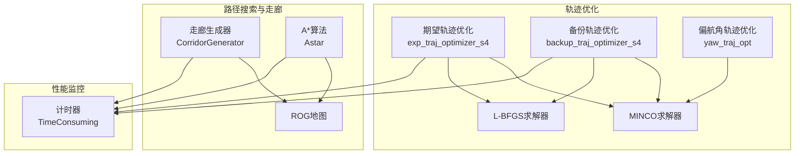
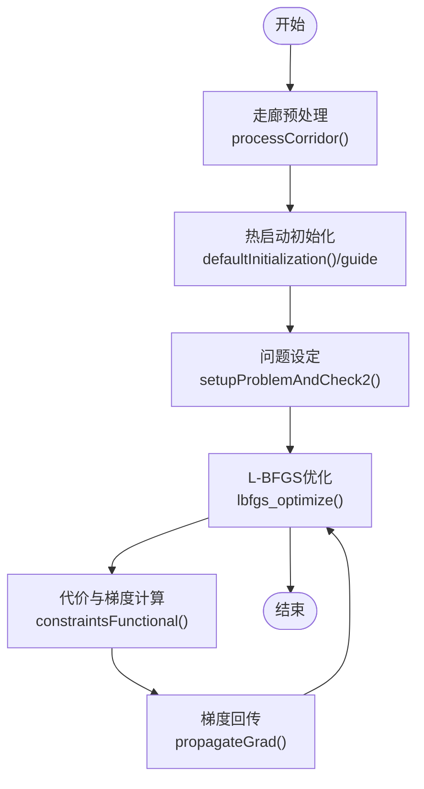
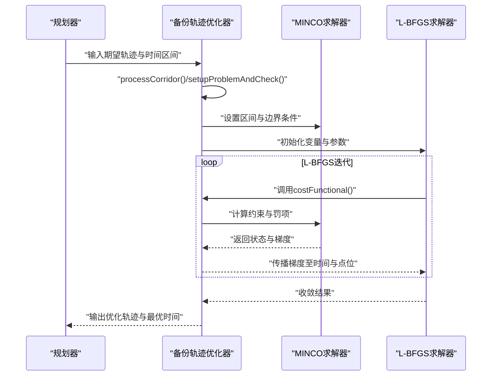
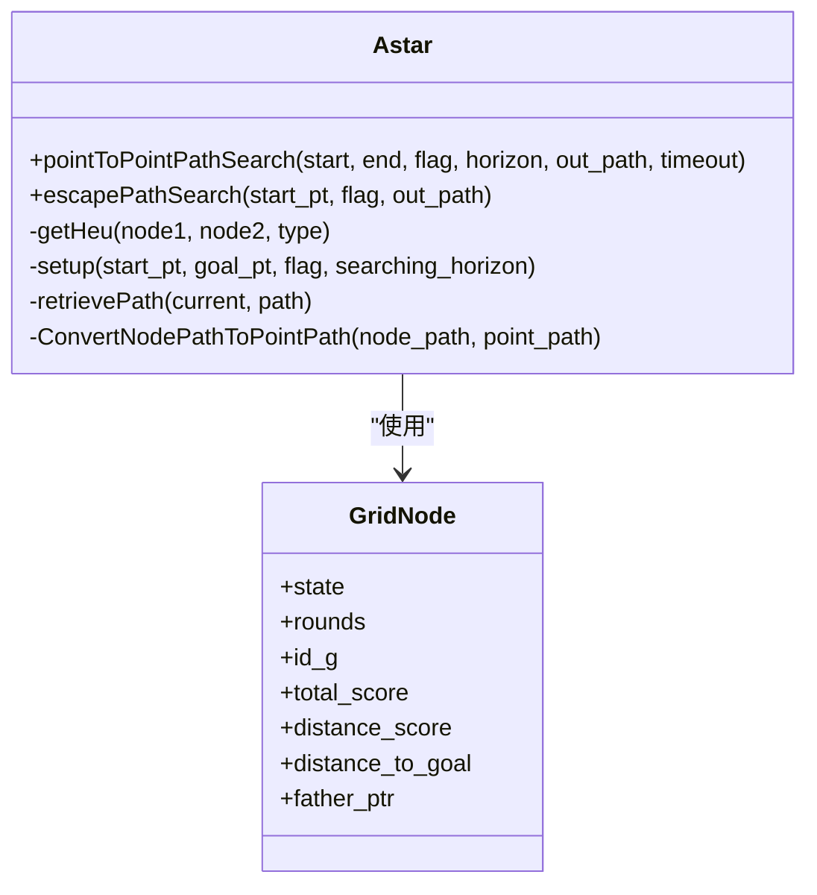
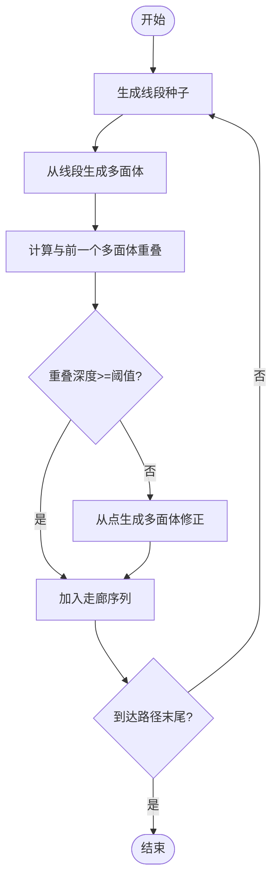
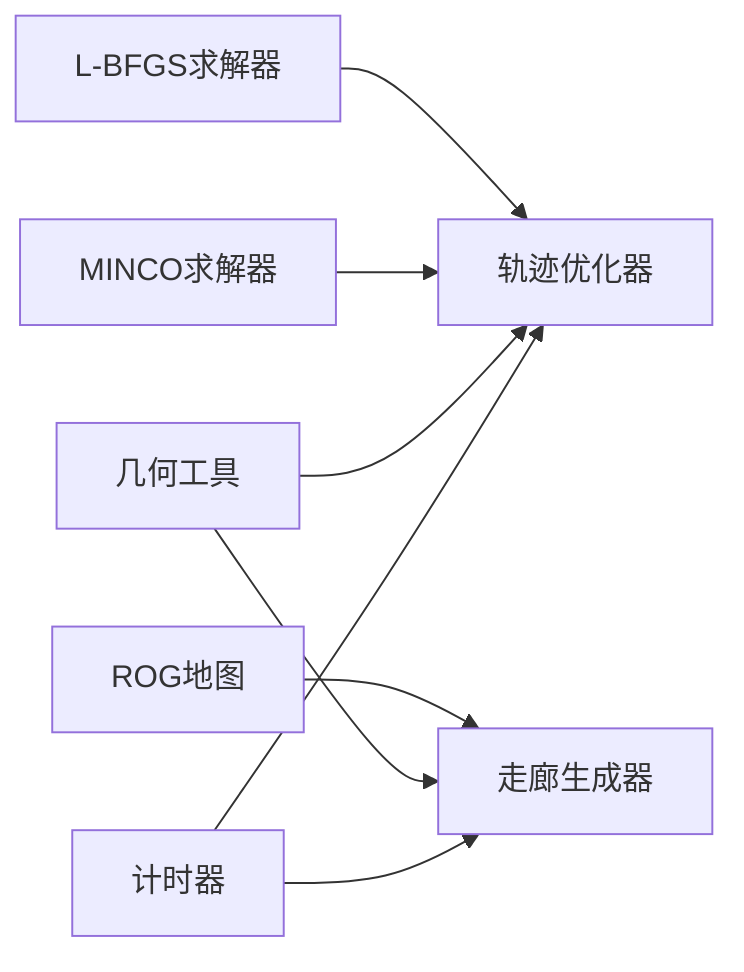

# 优化技术应用

<cite>
**本文引用的文件**
- [exp_traj_optimizer_s4.h](file://src/SUPER/super_planner/include/traj_opt/exp_traj_optimizer_s4.h)
- [exp_traj_optimizer_s4.cpp](file://src/SUPER/super_planner/src/traj_opt/exp_traj_optimizer_s4.cpp)
- [backup_traj_optimizer_s4.h](file://src/SUPER/super_planner/include/traj_opt/backup_traj_optimizer_s4.h)
- [backup_traj_optimizer_s4.cpp](file://src/SUPER/super_planner/src/traj_opt/backup_traj_optimizer_s4.cpp)
- [yaw_traj_opt.h](file://src/SUPER/super_planner/include/traj_opt/yaw_traj_opt.h)
- [lbfgs.h](file://src/SUPER/super_planner/include/utils/optimization/lbfgs.h)
- [lbfgs.cpp](file://src/SUPER/super_planner/src/utils/lbfgs.cpp)
- [astar.h](file://src/SUPER/super_planner/include/path_search/astar.h)
- [astar.cpp](file://src/SUPER/super_planner/src/super_core/astar.cpp)
- [corridor_generator.h](file://src/SUPER/super_planner/include/super_core/corridor_generator.h)
- [corridor_generator.cpp](file://src/SUPER/super_planner/src/super_core/corridor_generator.cpp)
- [scope_timer.hpp](file://src/SUPER/super_planner/include/utils/header/scope_timer.hpp)
</cite>

## 目录
1. [简介](#简介)
2. [项目结构](#项目结构)
3. [核心组件](#核心组件)
4. [架构总览](#架构总览)
5. [详细组件分析](#详细组件分析)
6. [依赖关系分析](#依赖关系分析)
7. [性能考量](#性能考量)
8. [故障排查指南](#故障排查指南)
9. [结论](#结论)
10. [附录](#附录)

## 简介
本文件系统性梳理SUPER规划器中的优化技术与实现，覆盖算法优化（L-BFGS优化、A*算法优化）、内存管理优化、并行计算优化，以及轨迹优化（期望轨迹优化、备份轨迹生成、偏航角轨迹优化）和走廊生成与路径搜索的优化策略（安全边界计算、网格分辨率优化）。文档同时提供性能优化方案、量化分析方法与持续改进策略，帮助读者快速理解并高效应用这些优化技术。

## 项目结构
- 轨迹优化模块：期望轨迹优化(exp_traj_optimizer_s4)、备份轨迹优化(backup_traj_optimizer_s4)、偏航角轨迹优化(yaw_traj_opt)，均基于MINCO平滑约束与L-BFGS求解器。
- 路径搜索与走廊生成：A*算法与CIRI走廊生成器，结合地图分辨率与邻域预计算提升效率。
- 性能监控：统一的计时器工具用于量化各模块耗时。



**图表来源**
- [exp_traj_optimizer_s4.h](file://src/SUPER/super_planner/include/traj_opt/exp_traj_optimizer_s4.h#L55-L371)
- [backup_traj_optimizer_s4.h](file://src/SUPER/super_planner/include/traj_opt/backup_traj_optimizer_s4.h#L52-L212)
- [yaw_traj_opt.h](file://src/SUPER/super_planner/include/traj_opt/yaw_traj_opt.h#L44-L71)
- [corridor_generator.h](file://src/SUPER/super_planner/include/super_core/corridor_generator.h#L56-L195)
- [astar.h](file://src/SUPER/super_planner/include/path_search/astar.h#L79-L164)
- [scope_timer.hpp](file://src/SUPER/super_planner/include/utils/header/scope_timer.hpp#L33-L114)

**章节来源**
- [exp_traj_optimizer_s4.h](file://src/SUPER/super_planner/include/traj_opt/exp_traj_optimizer_s4.h#L1-L371)
- [backup_traj_optimizer_s4.h](file://src/SUPER/super_planner/include/traj_opt/backup_traj_optimizer_s4.h#L1-L212)
- [yaw_traj_opt.h](file://src/SUPER/super_planner/include/traj_opt/yaw_traj_opt.h#L1-L71)
- [corridor_generator.h](file://src/SUPER/super_planner/include/super_core/corridor_generator.h#L1-L195)
- [astar.h](file://src/SUPER/super_planner/include/path_search/astar.h#L1-L164)
- [scope_timer.hpp](file://src/SUPER/super_planner/include/utils/header/scope_timer.hpp#L1-L114)

## 核心组件
- 期望轨迹优化(exp_traj_optimizer_s4)
  - 基于MINCO的分段多项式轨迹优化，支持位置/速度/加速度/加加加速度等多物理量约束与平滑惩罚项。
  - 采用L-BFGS进行梯度下降优化，支持热启动与时间分配策略。
- 备份轨迹优化(backup_traj_optimizer_s4)
  - 针对主轨迹不可行时的区间内轨迹优化，通过MINCO与L-BFGS在走廊内寻找可行轨迹。
- 偏航角轨迹优化(yaw_traj_opt)
  - 基于多项式插值的偏航角轨迹生成，支持时间分配与边界条件设置。
- A*算法优化(astar)
  - 预构建邻域点集与网格节点缓冲区，支持多种启发式与地图分辨率自适应。
- 走廊生成(corridor_generator)
  - 基于CIRI算法与线段种子的多面体走廊生成，支持重叠阈值与虚拟边界处理。
- 性能监控(scope_timer)
  - 统一的高精度计时器，支持自动单位换算与重复计时统计。

**章节来源**
- [exp_traj_optimizer_s4.h](file://src/SUPER/super_planner/include/traj_opt/exp_traj_optimizer_s4.h#L55-L371)
- [backup_traj_optimizer_s4.h](file://src/SUPER/super_planner/include/traj_opt/backup_traj_optimizer_s4.h#L52-L212)
- [yaw_traj_opt.h](file://src/SUPER/super_planner/include/traj_opt/yaw_traj_opt.h#L44-L71)
- [astar.h](file://src/SUPER/super_planner/include/path_search/astar.h#L79-L164)
- [corridor_generator.h](file://src/SUPER/super_planner/include/super_core/corridor_generator.h#L56-L195)
- [scope_timer.hpp](file://src/SUPER/super_planner/include/utils/header/scope_timer.hpp#L33-L114)

## 架构总览
以下序列图展示期望轨迹优化的端到端流程，包括走廊预处理、问题设定、L-BFGS优化与梯度传播。

```mermaid
sequenceDiagram
participant Planner as "规划器"
participant Corridor as "走廊生成器"
participant Opt as "期望轨迹优化器"
participant MINCO as "MINCO求解器"
participant LBG as "L-BFGS求解器"
Planner->>Corridor : "根据路径生成SFC"
Corridor-->>Planner : "返回多面体走廊"
Planner->>Opt : "设置起点/终点/走廊/初始猜测"
Opt->>Opt : "processCorridor()/setupProblemAndCheck()"
Opt->>MINCO : "设置边界条件与分段约束"
Opt->>LBG : "初始化变量与参数"
loop L-BFGS迭代
LBG->>Opt : "调用costFunctional()"
Opt->>MINCO : "计算积分惩罚与约束"
MINCO-->>Opt : "返回状态与梯度"
Opt-->>LBG : "传播梯度至时间与点位"
end
LBG-->>Opt : "收敛结果"
Opt-->>Planner : "输出优化轨迹"
```

**图表来源**
- [exp_traj_optimizer_s4.cpp](file://src/SUPER/super_planner/src/traj_opt/exp_traj_optimizer_s4.cpp#L354-L680)
- [exp_traj_optimizer_s4.h](file://src/SUPER/super_planner/include/traj_opt/exp_traj_optimizer_s4.h#L128-L324)
- [lbfgs.h](file://src/SUPER/super_planner/include/utils/optimization/lbfgs.h#L332-L338)

**章节来源**
- [exp_traj_optimizer_s4.cpp](file://src/SUPER/super_planner/src/traj_opt/exp_traj_optimizer_s4.cpp#L354-L680)
- [exp_traj_optimizer_s4.h](file://src/SUPER/super_planner/include/traj_opt/exp_traj_optimizer_s4.h#L128-L324)
- [lbfgs.h](file://src/SUPER/super_planner/include/utils/optimization/lbfgs.h#L257-L338)

## 详细组件分析

### 期望轨迹优化(exp_traj_optimizer_s4)
- 数学原理
  - 分段三次/更高阶多项式轨迹，通过MINCO施加位置/速度/加速度/加加加速度等物理约束。
  - 使用积分采样（积分分辨率）近似惩罚项，结合平滑L1正则化处理软约束。
  - 通过链式法则将最终代价对系数的梯度回传至点位与时间变量。
- 关键实现要点
  - 走廊预处理：将H型多面体转换为相对坐标系下的V型多面体，便于后续约束计算。
  - 热启动：基于引导轨迹的时间戳与路径点进行初始化，加速收敛。
  - 参数配置：L-BFGS记忆窗口、收敛容忍度、步长上下界等。
- 优化策略
  - 时间分配：均匀或基于引导轨迹的时间分配策略。
  - 空间维度估计：根据走廊顶点数量估算空间维数，减少不必要的变量规模。
  - 截断精度：对关键数值进行六位小数截断，避免浮点误差累积。
- 性能监控
  - 使用计时器包装关键阶段，量化走廊处理、问题设定、优化迭代等耗时。



**图表来源**
- [exp_traj_optimizer_s4.cpp](file://src/SUPER/super_planner/src/traj_opt/exp_traj_optimizer_s4.cpp#L354-L680)
- [exp_traj_optimizer_s4.h](file://src/SUPER/super_planner/include/traj_opt/exp_traj_optimizer_s4.h#L237-L324)
- [lbfgs.h](file://src/SUPER/super_planner/include/utils/optimization/lbfgs.h#L332-L338)

**章节来源**
- [exp_traj_optimizer_s4.h](file://src/SUPER/super_planner/include/traj_opt/exp_traj_optimizer_s4.h#L55-L371)
- [exp_traj_optimizer_s4.cpp](file://src/SUPER/super_planner/src/traj_opt/exp_traj_optimizer_s4.cpp#L354-L680)
- [lbfgs.h](file://src/SUPER/super_planner/include/utils/optimization/lbfgs.h#L1-L350)

### 备份轨迹优化(backup_traj_optimizer_s4)
- 数学原理
  - 在给定时间区间内，针对单段轨迹进行优化，满足走廊约束与边界条件。
  - 通过MINCO与L-BFGS联合求解，支持区间映射与无穷远梯度传播。
- 关键实现要点
  - 走廊预处理：枚举顶点并转换为相对坐标系。
  - 问题检查：验证走廊可行性与归一化平面。
  - 优化循环：在调试模式关闭的前提下执行L-BFGS优化。
- 优化策略
  - 统一时间分配开关：可选均匀时间策略。
  - 罚项记录：记录位置/速度/加加速度等罚项，辅助收敛诊断。
  - 轨迹幅值校验：对速度/加速度/加加速度幅值进行上限检查。



**图表来源**
- [backup_traj_optimizer_s4.cpp](file://src/SUPER/super_planner/src/traj_opt/backup_traj_optimizer_s4.cpp#L392-L830)
- [backup_traj_optimizer_s4.h](file://src/SUPER/super_planner/include/traj_opt/backup_traj_optimizer_s4.h#L149-L154)
- [lbfgs.h](file://src/SUPER/super_planner/include/utils/optimization/lbfgs.h#L332-L338)

**章节来源**
- [backup_traj_optimizer_s4.h](file://src/SUPER/super_planner/include/traj_opt/backup_traj_optimizer_s4.h#L52-L212)
- [backup_traj_optimizer_s4.cpp](file://src/SUPER/super_planner/src/traj_opt/backup_traj_optimizer_s4.cpp#L392-L830)
- [lbfgs.h](file://src/SUPER/super_planner/include/utils/optimization/lbfgs.h#L257-L338)

### 偏航角轨迹优化(yaw_traj_opt)
- 数学原理
  - 基于多项式插值生成偏航角轨迹，支持自由起点/终点与边界条件。
  - 提供时间分配与路径点分配的静态接口，便于与位置轨迹耦合。
- 实现要点
  - 支持不同阶数的多项式优化。
  - 提供自由起点/终点选项，增强轨迹灵活性。

**章节来源**
- [yaw_traj_opt.h](file://src/SUPER/super_planner/include/traj_opt/yaw_traj_opt.h#L44-L71)

### A*算法优化
- 优化策略
  - 预计算邻域点集合并按距离排序，减少运行时开销。
  - 预分配网格节点缓冲区，避免频繁new/delete。
  - 启发式函数支持对角/曼哈顿/欧氏距离，并引入微小破局因子避免等权路径。
  - 地图分辨率自适应：根据使用概率地图或信息地图选择不同分辨率。
- 性能监控
  - 可视化局部地图边界框，辅助调试与性能评估。



**图表来源**
- [astar.h](file://src/SUPER/super_planner/include/path_search/astar.h#L79-L164)

**章节来源**
- [astar.h](file://src/SUPER/super_planner/include/path_search/astar.h#L79-L164)
- [astar.cpp](file://src/SUPER/super_planner/src/super_core/astar.cpp#L39-L140)

### 走廊生成与路径搜索优化
- 安全边界计算
  - 机器人半径与虚拟地面/天花板高度参与边界计算，确保走廊在三维空间内的安全性。
- 网格分辨率优化
  - 根据地图类型（概率/信息）选择分辨率；支持局部地图中心与边界框可视化。
- 线段种子策略
  - 通过线段种子邻居列表与最大线段长度限制，平衡走廊连续性与计算效率。
- 重叠阈值与连续性保证
  - 通过重叠深度阈值与点生成修正策略，确保相邻多面体之间的连续性。



**图表来源**
- [corridor_generator.cpp](file://src/SUPER/super_planner/src/super_core/corridor_generator.cpp#L62-L216)
- [corridor_generator.h](file://src/SUPER/super_planner/include/super_core/corridor_generator.h#L129-L168)

**章节来源**
- [corridor_generator.h](file://src/SUPER/super_planner/include/super_core/corridor_generator.h#L56-L195)
- [corridor_generator.cpp](file://src/SUPER/super_planner/src/super_core/corridor_generator.cpp#L62-L216)

## 依赖关系分析
- 优化求解器
  - L-BFGS求解器提供通用的非线性优化框架，支持回调接口与步长边界。
  - MINCO求解器封装轨迹约束与积分惩罚，提供状态与梯度计算。
- 地图与几何
  - ROG地图提供占用/概率/信息地图查询与线段连通性检测。
  - 几何工具提供多面体交叠、内部点查找、线段/点生成等基础能力。
- 性能监控
  - 统一计时器贯穿轨迹优化与走廊生成，便于量化分析。



**图表来源**
- [lbfgs.h](file://src/SUPER/super_planner/include/utils/optimization/lbfgs.h#L257-L338)
- [exp_traj_optimizer_s4.h](file://src/SUPER/super_planner/include/traj_opt/exp_traj_optimizer_s4.h#L95-L106)
- [corridor_generator.h](file://src/SUPER/super_planner/include/super_core/corridor_generator.h#L67-L69)
- [scope_timer.hpp](file://src/SUPER/super_planner/include/utils/header/scope_timer.hpp#L33-L114)

**章节来源**
- [lbfgs.h](file://src/SUPER/super_planner/include/utils/optimization/lbfgs.h#L1-L350)
- [exp_traj_optimizer_s4.h](file://src/SUPER/super_planner/include/traj_opt/exp_traj_optimizer_s4.h#L55-L106)
- [corridor_generator.h](file://src/SUPER/super_planner/include/super_core/corridor_generator.h#L56-L70)
- [scope_timer.hpp](file://src/SUPER/super_planner/include/utils/header/scope_timer.hpp#L33-L114)

## 性能考量
- 算法优化
  - L-BFGS参数调优：增大记忆窗口可提升收敛速度，但增加内存占用；合理设置步长上下界与收敛容忍度可避免无效迭代。
  - 积分分辨率：在精度与计算量之间折衷，建议根据轨迹复杂度动态调整。
- 内存管理
  - 预分配网格节点缓冲区与邻域点列表，减少运行时内存分配。
  - 优化数据结构尺寸，如将顶点坐标转换为相对坐标系，降低存储与计算开销。
- 并行计算
  - 当前实现主要为串行优化流程；可在多轨迹并行优化场景中引入任务级并行（不同走廊/不同时间段）。
  - 地图查询与几何计算可利用SIMD或并行库进一步加速（需评估线程安全）。
- 监控与量化
  - 使用计时器对关键阶段进行统计，形成性能基线，便于对比不同参数/策略的效果。
  - 建议记录收敛迭代次数、代价变化率、罚项分布等指标，辅助调参。

[本节为通用指导，无需具体文件分析]

## 故障排查指南
- 期望轨迹优化
  - 初始化失败：检查走廊预处理与热启动点是否有效；确认初始时间与点不包含NaN。
  - 收敛异常：检查L-BFGS参数设置与步长边界；查看代价变化率与梯度范数。
- 备份轨迹优化
  - 走廊不可行：确认走廊平面已归一化且存在可行解；检查罚项日志中的位置/速度/加加速度越界情况。
  - 轨迹幅值越界：调整幅值上限或重新初始化。
- A*算法
  - 地图配置冲突：确保仅启用一种地图类型（概率/信息），未知区域处理策略互斥。
  - 局部地图边界：检查分辨率与中心点设置，避免越界访问。
- 走廊生成
  - 线段过长：限制种子线段最大长度，避免CIRI计算不稳定。
  - 连续性不足：提高重叠阈值或启用点生成修正策略。

**章节来源**
- [exp_traj_optimizer_s4.cpp](file://src/SUPER/super_planner/src/traj_opt/exp_traj_optimizer_s4.cpp#L266-L269)
- [backup_traj_optimizer_s4.cpp](file://src/SUPER/super_planner/src/traj_opt/backup_traj_optimizer_s4.cpp#L698-L716)
- [astar.cpp](file://src/SUPER/super_planner/src/super_core/astar.cpp#L100-L114)
- [corridor_generator.cpp](file://src/SUPER/super_planner/src/super_core/corridor_generator.cpp#L123-L128)

## 结论
SUPER规划器在轨迹优化与路径搜索方面采用了成熟的数值优化与几何算法，并通过内存预分配、参数化与计时器监控实现了良好的工程化落地。期望轨迹优化与备份轨迹优化分别覆盖主轨迹与应急轨迹场景，A*与走廊生成保障了全局路径的可行性与安全性。建议在实际部署中结合性能基线持续调参，并在多轨迹场景中探索并行化潜力，以进一步提升整体吞吐与实时性。

[本节为总结性内容，无需具体文件分析]

## 附录
- 量化分析建议
  - 指标：单次优化耗时、收敛迭代数、代价收敛速率、罚项峰值、轨迹幅值统计。
  - 方法：固定场景与参数，多次运行取均值与方差；对比不同参数组合的性能与轨迹质量。
- 持续改进策略
  - 自适应参数：根据历史性能动态调整L-BFGS记忆窗口与积分分辨率。
  - 多策略融合：在A*中引入启发式权重自适应与多启发式切换。
  - 并行化扩展：在轨迹优化与走廊生成中引入任务级并行与缓存复用。

[本节为通用指导，无需具体文件分析]