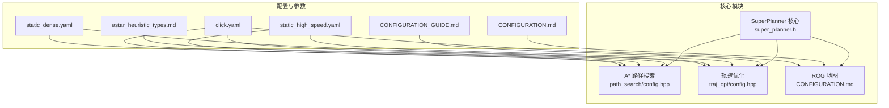
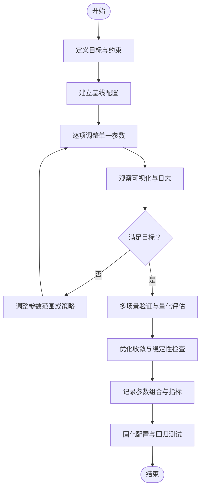
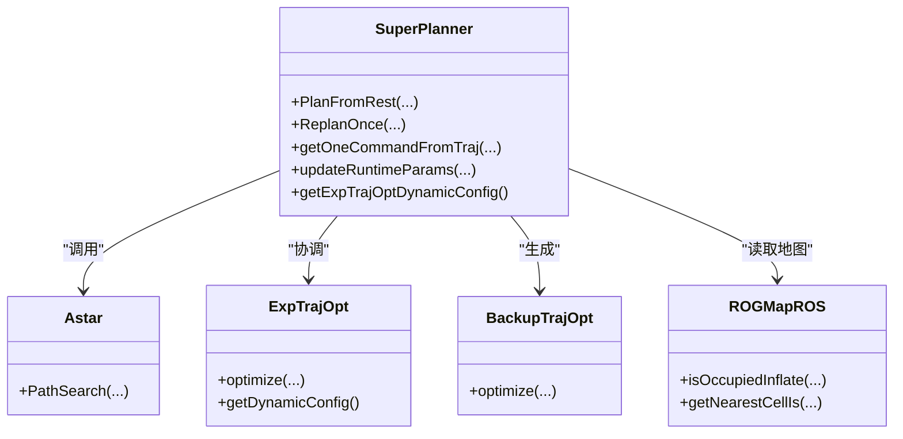

# 参数调优策略

<cite>
**本文引用的文件列表**
- [CONFIGURATION.md](file://src/SUPER/rog_map/doc/CONFIGURATION.md)
- [CONFIGURATION_GUIDE.md](file://src/SUPER/super_planner/docs/CONFIGURATION_GUIDE.md)
- [QUICKSTART.md](file://src/SUPER/super_planner/docs/QUICKSTART.md)
- [astar_heuristic_types.md](file://src/SUPER/super_planner/docs/astar_heuristic_types.md)
- [click.yaml](file://src/SUPER/super_planner/config/click.yaml)
- [static_dense.yaml](file://src/SUPER/super_planner/config/static_dense.yaml)
- [static_high_speed.yaml](file://src/SUPER/super_planner/config/static_high_speed.yaml)
- [config.hpp（轨迹优化）](file://src/SUPER/super_planner/include/traj_opt/config.hpp)
- [config.hpp（路径搜索）](file://src/SUPER/super_planner/include/path_search/config.hpp)
- [super_planner.h](file://src/SUPER/super_planner/include/super_core/super_planner.h)
- [API_REFERENCE.md](file://src/SUPER/super_planner/docs/API_REFERENCE.md)
- [test_dynamic_params.cpp](file://src/SUPER/super_planner/test/test_dynamic_params.cpp)
- [lbfgs.h](file://src/SUPER/super_planner/include/utils/optimization/lbfgs.h)
</cite>

## 目录
1. [简介](#简介)
2. [项目结构与参数来源](#项目结构与参数来源)
3. [核心参数类别与作用机制](#核心参数类别与作用机制)
4. [参数调优理论基础](#参数调优理论基础)
5. [调优流程与方法论](#调优流程与方法论)
6. [场景适配策略](#场景适配策略)
7. [依赖关系与耦合分析](#依赖关系与耦合分析)
8. [性能特征与权衡](#性能特征与权衡)
9. [故障排查与常见陷阱](#故障排查与常见陷阱)
10. [结论与最佳实践](#结论与最佳实践)

## 简介
本文件围绕 SUPER 规划系统的参数调优策略，系统阐述参数影响分析、调优流程与场景适配方法，覆盖 A* 路径搜索、轨迹优化、地图处理等关键模块。文档基于仓库内的配置文件、API 文档与实现细节，提供可操作的调优步骤、参数范围建议、效果评估方法与常见陷阱规避策略，帮助在不同任务场景（如高速导航、精细避障、室内环境、自主探索）中取得稳定、高效且安全的轨迹表现。

## 项目结构与参数来源
- 配置文件集中于 super_planner 的 config 目录，包含主配置与预设场景配置，分别用于 A*、轨迹优化、地图处理等模块的参数初始化。
- 动态参数可通过 ROS2 参数服务器在运行时调整，便于在线验证与快速迭代。
- API 文档与实现明确了参数读取、同步与模块间交互关系，为调优提供依据。

图表来源
- [click.yaml](file://src/SUPER/super_planner/config/click.yaml#L1-L190)
- [static_dense.yaml](file://src/SUPER/super_planner/config/static_dense.yaml#L1-L186)
- [static_high_speed.yaml](file://src/SUPER/super_planner/config/static_high_speed.yaml#L1-L187)
- [CONFIGURATION_GUIDE.md](file://src/SUPER/super_planner/docs/CONFIGURATION_GUIDE.md#L1-L411)
- [CONFIGURATION.md](file://src/SUPER/rog_map/doc/CONFIGURATION.md#L1-L334)
- [astar_heuristic_types.md](file://src/SUPER/super_planner/docs/astar_heuristic_types.md#L1-L114)
- [config.hpp（路径搜索）](file://src/SUPER/super_planner/include/path_search/config.hpp#L40-L65)
- [config.hpp（轨迹优化）](file://src/SUPER/super_planner/include/traj_opt/config.hpp#L40-L182)
- [super_planner.h](file://src/SUPER/super_planner/include/super_core/super_planner.h#L143-L178)

章节来源
- [click.yaml](file://src/SUPER/super_planner/config/click.yaml#L1-L190)
- [static_dense.yaml](file://src/SUPER/super_planner/config/static_dense.yaml#L1-L186)
- [static_high_speed.yaml](file://src/SUPER/super_planner/config/static_high_speed.yaml#L1-L187)
- [CONFIGURATION_GUIDE.md](file://src/SUPER/super_planner/docs/CONFIGURATION_GUIDE.md#L1-L411)
- [CONFIGURATION.md](file://src/SUPER/rog_map/doc/CONFIGURATION.md#L1-L334)
- [astar_heuristic_types.md](file://src/SUPER/super_planner/docs/astar_heuristic_types.md#L1-L114)
- [config.hpp（路径搜索）](file://src/SUPER/super_planner/include/path_search/config.hpp#L40-L65)
- [config.hpp（轨迹优化）](file://src/SUPER/super_planner/include/traj_opt/config.hpp#L40-L182)
- [super_planner.h](file://src/SUPER/super_planner/include/super_core/super_planner.h#L143-L178)

## 核心参数类别与作用机制
本节聚焦三类关键参数及其机制：

- A* 路径搜索参数
  - astar.resolution：网格分辨率，决定搜索精度与计算量；越小越精细但开销越大。
  - astar.max_search_time：最大搜索时间，防止路径搜索阻塞主循环。
  - astar.heu_type：启发式类型（DIAG/曼哈顿/EUCL），影响搜索效率与路径质量；默认推荐 EUCL。
  - astar.allow_diag：是否允许对角线移动，影响可通行性与路径平滑度。

- 轨迹优化参数
  - traj_opt.boundary.{max_vel, max_acc, max_jerk, max_omg, max_acc_thr, min_acc_thr}：运动学边界约束，决定轨迹可行性与安全性。
  - traj_opt.exp_traj.{penna_t, penna_pos, penna_vel, penna_acc, penna_jerk, penna_attract, penna_omg, penna_thr}：惩罚权重，平衡时间、位置、速度、加速度、加加速度、吸引力、角速度与推力等代价。
  - traj_opt.exp_traj.{opt_accuracy, smooth_eps, integral_reso, scale_factor}：优化精度、平滑因子与积分分辨率，影响收敛速度与轨迹平滑度。
  - traj_opt.backup_traj.*：备份轨迹的权重与分段策略，强调快速响应与鲁棒性。

- 地图处理参数
  - rog_map.{resolution, inflation_resolution, inflation_step}：地图分辨率与膨胀步数，决定安全边界与查询效率。
  - rog_map.map_size、map_sliding.threshold：地图范围与滑动窗口策略，影响内存占用与实时性。
  - rog_map.esdf.enable、raycasting.*：ESDF 与射线投射配置，影响距离场精度与更新开销。

章节来源
- [click.yaml](file://src/SUPER/super_planner/config/click.yaml#L106-L129)
- [static_dense.yaml](file://src/SUPER/super_planner/config/static_dense.yaml#L96-L126)
- [static_high_speed.yaml](file://src/SUPER/super_planner/config/static_high_speed.yaml#L97-L126)
- [CONFIGURATION_GUIDE.md](file://src/SUPER/super_planner/docs/CONFIGURATION_GUIDE.md#L21-L131)
- [CONFIGURATION.md](file://src/SUPER/rog_map/doc/CONFIGURATION.md#L21-L136)
- [config.hpp（轨迹优化）](file://src/SUPER/super_planner/include/traj_opt/config.hpp#L40-L182)
- [config.hpp（路径搜索）](file://src/SUPER/super_planner/include/path_search/config.hpp#L40-L65)

## 参数调优理论基础
- 优化目标与代价函数
  - 轨迹优化以走廊约束为核心，通过惩罚权重平衡时间、位置、速度、加速度、加加速度、角速度与推力等代价，形成可执行且平滑的轨迹。
  - 优化器采用 L-BFGS 等迭代方法，收敛精度与迭代次数受 opt_accuracy、integral_reso、smooth_eps 等参数影响。

- 启发式与搜索效率
  - A* 的启发式类型直接影响搜索效率与路径质量。EUCL 在允许对角线移动的网格中提供更接近实际飞行距离的估计，通常扩展节点更少，效率更高。
  - 分辨率与对角线允许性共同决定可通行性与路径平滑度。

- 地图与安全边界
  - 地图分辨率与膨胀步数决定安全边界宽度与查询效率。分辨率越低、膨胀步数越大，安全边界越大但计算量上升。
  - ESDF 与射线投射配置影响距离场精度与更新频率，按需启用以平衡性能与精度。

章节来源
- [CONFIGURATION_GUIDE.md](file://src/SUPER/super_planner/docs/CONFIGURATION_GUIDE.md#L38-L131)
- [astar_heuristic_types.md](file://src/SUPER/super_planner/docs/astar_heuristic_types.md#L1-L114)
- [CONFIGURATION.md](file://src/SUPER/rog_map/doc/CONFIGURATION.md#L21-L136)
- [lbfgs.h](file://src/SUPER/super_planner/include/utils/optimization/lbfgs.h#L25-L74)

## 调优流程与方法论
- 步骤一：明确目标与约束
  - 明确任务场景（如高速、精细避障、室内、探索）与性能指标（如轨迹平滑度、计算耗时、碰撞率）。
  - 设定参数范围：基于配置文件默认值与文档建议，划定上下界。

- 步骤二：建立基线配置
  - 选择与场景相近的预设配置（如 click.yaml、static_dense.yaml、static_high_speed.yaml）作为基线。
  - 固化地图与路径搜索参数，确保一致性。

- 步骤三：逐项调整与验证
  - 一次仅调整一个参数，观察 RViz 可视化、日志输出与实际飞行表现。
  - 使用 rqt_reconfigure 或 ros2 param set 在线调整动态参数，快速验证效果。

- 步骤四：效果评估与量化
  - 评估指标：轨迹平滑度（加加速度）、安全性（碰撞率）、实时性（规划耗时）、稳定性（优化收敛）。
  - 记录参数组合与对应指标，建立参数库。

- 步骤五：固化与回归测试
  - 将最优参数写回配置文件，定期备份。
  - 使用测试脚本（如 test_dynamic_params.cpp）验证动态参数更新与同步机制。

图表来源
- [CONFIGURATION_GUIDE.md](file://src/SUPER/super_planner/docs/CONFIGURATION_GUIDE.md#L291-L323)
- [test_dynamic_params.cpp](file://src/SUPER/super_planner/test/test_dynamic_params.cpp#L36-L103)

章节来源
- [CONFIGURATION_GUIDE.md](file://src/SUPER/super_planner/docs/CONFIGURATION_GUIDE.md#L291-L323)
- [test_dynamic_params.cpp](file://src/SUPER/super_planner/test/test_dynamic_params.cpp#L36-L103)

## 场景适配策略
- 高速导航
  - 侧重速度与时间惩罚，适当放宽位置约束，提高加加速度惩罚以保证平滑度。
  - 参考 static_high_speed.yaml 中的边界与惩罚权重设置，结合 A* 的 EUCL 启发式与较低分辨率提升实时性。

- 精细避障
  - 强化位置与加速度惩罚，降低时间惩罚权重，增加平滑因子，确保轨迹在复杂环境中安全。
  - 可使用较小的 A* 分辨率与对角线允许性，提升路径平滑度。

- 室内环境
  - 提高安全边界与膨胀步数，降低 A* 分辨率与对角线允许性，减少路径偏差。
  - 可启用 ESDF 以提升距离场精度，但需权衡计算开销。

- 自主探索
  - 增加吸引力惩罚，适度放宽位置约束，提高探索效率；备份轨迹采用非均匀时间分配以增强灵活性。

章节来源
- [static_high_speed.yaml](file://src/SUPER/super_planner/config/static_high_speed.yaml#L228-L287)
- [CONFIGURATION_GUIDE.md](file://src/SUPER/super_planner/docs/CONFIGURATION_GUIDE.md#L226-L290)
- [CONFIGURATION.md](file://src/SUPER/rog_map/doc/CONFIGURATION.md#L182-L241)

## 依赖关系与耦合分析
- 模块耦合
  - SuperPlanner 核心协调 A*、走廊生成、轨迹优化与备份轨迹模块，参数在初始化时从 YAML 加载，在运行时通过动态参数回调同步。
  - 地图模块（ROG-Map）提供占用栅格与膨胀信息，直接影响走廊生成与碰撞检测。

- 参数耦合
  - 轨迹优化的边界约束与惩罚权重相互影响：过高的加加速度惩罚可能导致收敛困难；过低的位置惩罚可能引发碰撞。
  - A* 分辨率与启发式类型与地图分辨率、膨胀步数共同决定搜索效率与路径质量。

图表来源
- [API_REFERENCE.md](file://src/SUPER/super_planner/docs/API_REFERENCE.md#L520-L558)
- [super_planner.h](file://src/SUPER/super_planner/include/super_core/super_planner.h#L143-L178)

章节来源
- [API_REFERENCE.md](file://src/SUPER/super_planner/docs/API_REFERENCE.md#L520-L558)
- [super_planner.h](file://src/SUPER/super_planner/include/super_core/super_planner.h#L143-L178)

## 性能特征与权衡
- A* 性能
  - heu_type=EUCL 通常扩展节点最少，效率最高；分辨率越低，查询更快但路径可能不够精细。
  - allow_diag 影响可通行性与路径平滑度，室内场景可考虑关闭以减少路径偏差。

- 轨迹优化性能
  - opt_accuracy 与 integral_reso 决定收敛速度与轨迹平滑度；精度越高，耗时越长。
  - smooth_eps 增大可提升平滑度，但可能牺牲轨迹贴合度。

- 地图性能
  - resolution 与 inflation_step 越大，安全边界越大，但内存与计算开销上升。
  - ESDF 与射线投射按需启用，平衡精度与性能。

章节来源
- [astar_heuristic_types.md](file://src/SUPER/super_planner/docs/astar_heuristic_types.md#L93-L114)
- [CONFIGURATION_GUIDE.md](file://src/SUPER/super_planner/docs/CONFIGURATION_GUIDE.md#L358-L371)
- [CONFIGURATION.md](file://src/SUPER/rog_map/doc/CONFIGURATION.md#L244-L253)

## 故障排查与常见陷阱
- 轨迹优化失败
  - 检查走廊有效性、惩罚权重是否过大、初值是否合理；可降低 opt_accuracy 与 penna_pos 放松约束。
  - 参考文档中的“常见问题”与“参数调试流程”。

- 轨迹跳跃或不连续
  - 增加加加速度惩罚与平滑因子，确保轨迹连续性。

- 规划速度慢
  - 降低 A* 分辨率与积分分辨率，或使用 EUCL 启发式；必要时放宽优化精度。

- 动态参数不生效
  - 检查参数名大小写、节点是否收到参数更新回调、是否需要重启节点；使用参数客户端验证设置与获取。

- 地图更新异常
  - 若禁用 ROS2 回调，需手动调用 updateMap；检查点云话题与里程计超时设置。

章节来源
- [CONFIGURATION_GUIDE.md](file://src/SUPER/super_planner/docs/CONFIGURATION_GUIDE.md#L325-L385)
- [CONFIGURATION.md](file://src/SUPER/rog_map/doc/CONFIGURATION.md#L294-L310)
- [QUICKSTART.md](file://src/SUPER/super_planner/docs/QUICKSTART.md#L277-L304)

## 结论与最佳实践
- 先保守再优化：以高精度、保守参数测试，确保安全后再逐步提升性能。
- 单变量调整：每次仅改变一个参数，避免多重耦合导致的误判。
- 建立参数库：记录不同场景的最优参数组合，形成可复用的配置模板。
- 定期备份：保存有效配置，纳入版本控制，便于回溯与回归测试。
- 使用工具链：结合 rqt_reconfigure、RViz 可视化与日志输出，形成闭环验证。

章节来源
- [CONFIGURATION_GUIDE.md](file://src/SUPER/super_planner/docs/CONFIGURATION_GUIDE.md#L388-L411)