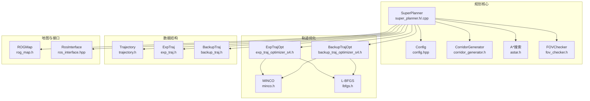
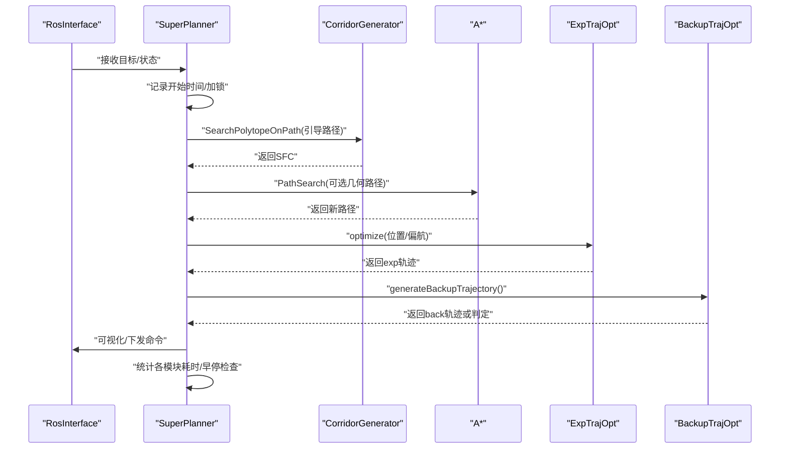
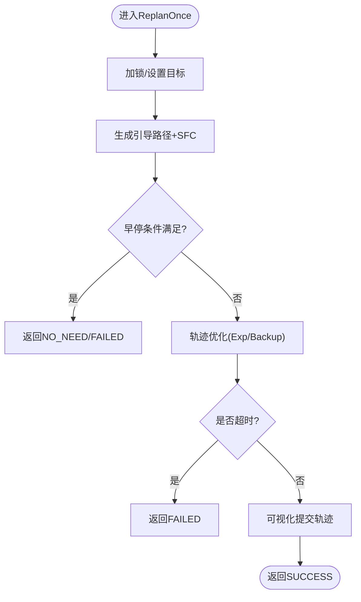
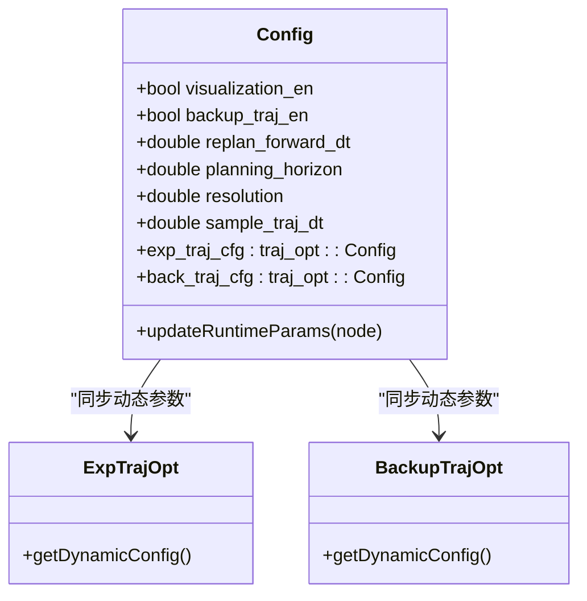
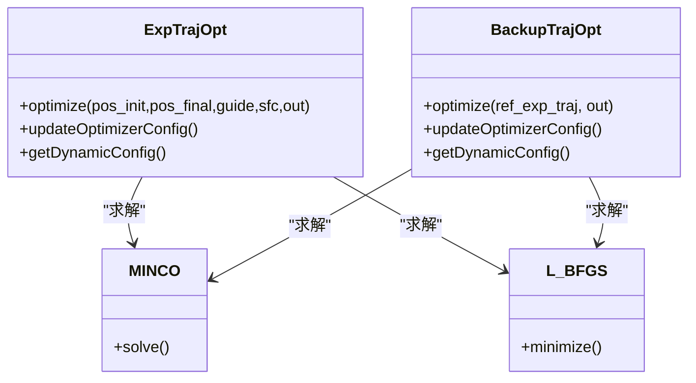
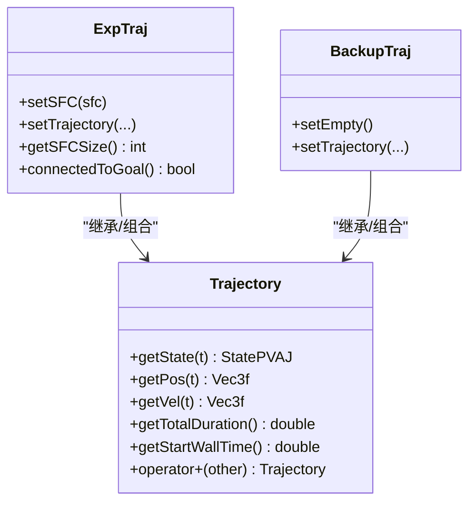
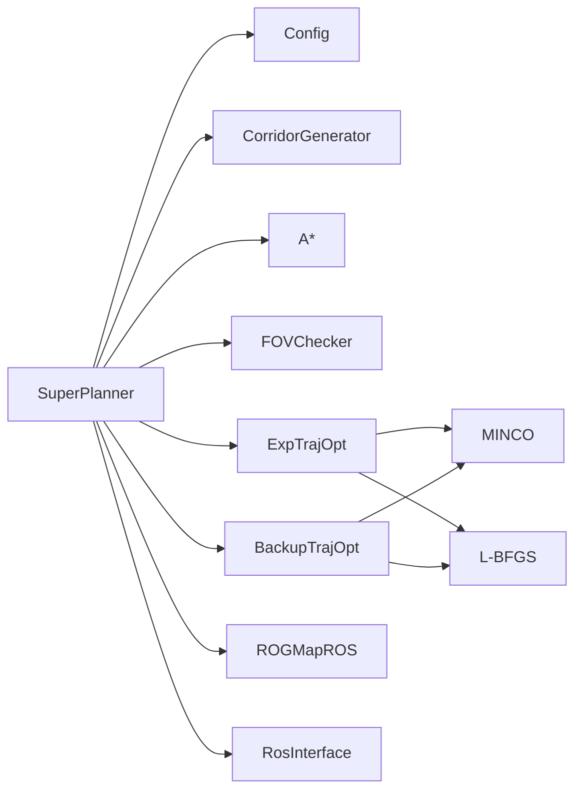

# 性能优化与调优

<cite>
**本文引用的文件**   
- [src/SUPER/super_planner/include/super_core/super_planner.h](file://src/SUPER/super_planner/include/super_core/super_planner.h)
- [src/SUPER/super_planner/src/super_core/super_planner.cpp](file://src/SUPER/super_planner/src/super_core/super_planner.cpp)
- [src/SUPER/super_planner/include/super_core/config.hpp](file://src/SUPER/super_planner/include/super_core/config.hpp)
- [src/SUPER/super_planner/include/utils/header/scope_timer.hpp](file://src/SUPER/super_planner/include/utils/header/scope_timer.hpp)
- [src/SUPER/super_planner/include/traj_opt/exp_traj_optimizer_s4.h](file://src/SUPER/super_planner/include/traj_opt/exp_traj_optimizer_s4.h)
- [src/SUPER/super_planner/include/traj_opt/backup_traj_optimizer_s4.h](file://src/SUPER/super_planner/include/traj_opt/backup_traj_optimizer_s4.h)
- [src/SUPER/super_planner/include/utils/optimization/lbfgs.h](file://src/SUPER/super_planner/include/utils/optimization/lbfgs.h)
- [src/SUPER/super_planner/include/traj_opt/minco.h](file://src/SUPER/super_planner/include/traj_opt/minco.h)
- [src/SUPER/super_planner/include/data_structure/base/trajectory.h](file://src/SUPER/super_planner/include/data_structure/base/trajectory.h)
- [src/SUPER/super_planner/include/data_structure/exp_traj.h](file://src/SUPER/super_planner/include/data_structure/exp_traj.h)
- [src/SUPER/super_planner/include/data_structure/backup_traj.h](file://src/SUPER/super_planner/include/data_structure/backup_traj.h)
- [src/SUPER/super_planner/include/path_search/astar.h](file://src/SUPER/super_planner/include/path_search/astar.h)
- [src/SUPER/super_planner/include/super_core/corridor_generator.h](file://src/SUPER/super_planner/include/super_core/corridor_generator.h)
- [src/SUPER/super_planner/include/super_core/fov_checker.h](file://src/SUPER/super_planner/include/super_core/fov_checker.h)
- [src/SUPER/super_planner/include/rog_map/rog_map.h](file://src/SUPER/super_planner/include/rog_map/rog_map.h)
- [src/SUPER/super_planner/include/ros_interface/ros_interface.hpp](file://src/SUPER/super_planner/include/ros_interface/ros_interface.hpp)
- [src/SUPER/super_planner/launch/benchmark_dense.launch.py](file://src/SUPER/super_planner/launch/benchmark_dense.launch.py)
- [src/SUPER/super_planner/launch/banchmark_high_speed.launch.py](file://src/SUPER/super_planner/launch/banchmark_high_speed.launch.py)
- [src/SUPER/super_planner/scripts/plot_time_consuming.py](file://src/SUPER/super_planner/scripts/plot_time_consuming.py)
- [src/SUPER/super_planner/data/benchmark.txt](file://src/SUPER/super_planner/data/benchmark.txt)
- [src/SUPER/super_planner/data/benchmark_dense.txt](file://src/SUPER/super_planner/data/benchmark_dense.txt)
</cite>

## 目录
1. [简介](#简介)
2. [项目结构](#项目结构)
3. [核心组件](#核心组件)
4. [架构总览](#架构总览)
5. [详细组件分析](#详细组件分析)
6. [依赖关系分析](#依赖关系分析)
7. [性能考量](#性能考量)
8. [故障排查指南](#故障排查指南)
9. [结论](#结论)
10. [附录](#附录)

## 简介
本文件面向SUPER无人机轨迹规划系统的性能优化与调优，围绕以下目标展开：
- 明确性能基准测试方法与关键指标（规划时间、轨迹质量、系统延迟等）
- 提供参数调优策略（影响分析、流程与场景适配）
- 汇总优化技术（算法、内存、并行）
- 给出性能分析工具使用与瓶颈定位方法
- 归纳不同场景下的优化重点与权衡
- 提供自动化测试与持续集成建议
- 总结最佳实践与常见问题

## 项目结构
该仓库采用模块化组织，核心规划器位于super_planner包，包含：
- 规划核心：SuperPlanner、A*搜索、走廊生成、FOV裁剪、轨迹优化器
- 数据结构：轨迹、探索轨迹、备份轨迹、多面体等
- 地图与接口：ROG地图、ROS接口
- 配置与计时：统一配置类、计时工具
- 基准与脚本：benchmark launch、数据文件、绘图脚本

**图表来源**
- [src/SUPER/super_planner/include/super_core/super_planner.h](file://src/SUPER/super_planner/include/super_core/super_planner.h#L59-L296)
- [src/SUPER/super_planner/include/super_core/config.hpp](file://src/SUPER/super_planner/include/super_core/config.hpp#L44-L231)
- [src/SUPER/super_planner/include/super_core/corridor_generator.h](file://src/SUPER/super_planner/include/super_core/corridor_generator.h)
- [src/SUPER/super_planner/include/path_search/astar.h](file://src/SUPER/super_planner/include/path_search/astar.h)
- [src/SUPER/super_planner/include/super_core/fov_checker.h](file://src/SUPER/super_planner/include/super_core/fov_checker.h)
- [src/SUPER/super_planner/include/traj_opt/exp_traj_optimizer_s4.h](file://src/SUPER/super_planner/include/traj_opt/exp_traj_optimizer_s4.h)
- [src/SUPER/super_planner/include/traj_opt/backup_traj_optimizer_s4.h](file://src/SUPER/super_planner/include/traj_opt/backup_traj_optimizer_s4.h)
- [src/SUPER/super_planner/include/traj_opt/minco.h](file://src/SUPER/super_planner/include/traj_opt/minco.h)
- [src/SUPER/super_planner/include/utils/optimization/lbfgs.h](file://src/SUPER/super_planner/include/utils/optimization/lbfgs.h)
- [src/SUPER/super_planner/include/data_structure/base/trajectory.h](file://src/SUPER/super_planner/include/data_structure/base/trajectory.h)
- [src/SUPER/super_planner/include/data_structure/exp_traj.h](file://src/SUPER/super_planner/include/data_structure/exp_traj.h)
- [src/SUPER/super_planner/include/data_structure/backup_traj.h](file://src/SUPER/super_planner/include/data_structure/backup_traj.h)
- [src/SUPER/super_planner/include/rog_map/rog_map.h](file://src/SUPER/super_planner/include/rog_map/rog_map.h)
- [src/SUPER/super_planner/include/ros_interface/ros_interface.hpp](file://src/SUPER/super_planner/include/ros_interface/ros_interface.hpp)

**章节来源**
- [src/SUPER/super_planner/include/super_core/super_planner.h](file://src/SUPER/super_planner/include/super_core/super_planner.h#L59-L296)
- [src/SUPER/super_planner/include/super_core/config.hpp](file://src/SUPER/super_planner/include/super_core/config.hpp#L44-L231)

## 核心组件
- SuperPlanner：主控制器，负责重规划流程、模块计时、参数同步、轨迹生成与下发
- Config：集中式参数管理，支持运行时热更新
- CorridorGenerator/A*：路径搜索与安全走廊生成
- FOVChecker：视野裁剪
- 轨迹优化器：ExpTrajOpt/BackupTrajOpt，基于MINCO/L-BFGS
- 数据结构：Trajectory/ExpTraj/BackupTraj
- 地图与接口：ROGMapROS、RosInterface

关键性能相关能力：
- 模块级计时：前端、优化、可视化等分段统计
- 运行时参数同步：动态调整边界与惩罚项
- 早停与回退：避免超时与无效重规划
- 可视化与日志：辅助定位瓶颈

**章节来源**
- [src/SUPER/super_planner/include/super_core/super_planner.h](file://src/SUPER/super_planner/include/super_core/super_planner.h#L59-L296)
- [src/SUPER/super_planner/src/super_core/super_planner.cpp](file://src/SUPER/super_planner/src/super_core/super_planner.cpp#L182-L312)
- [src/SUPER/super_planner/include/super_core/config.hpp](file://src/SUPER/super_planner/include/super_core/config.hpp#L158-L228)

## 架构总览
下图展示一次重规划的端到端流程与关键性能点。

**图表来源**
- [src/SUPER/super_planner/src/super_core/super_planner.cpp](file://src/SUPER/super_planner/src/super_core/super_planner.cpp#L178-L312)
- [src/SUPER/super_planner/include/super_core/super_planner.h](file://src/SUPER/super_planner/include/super_core/super_planner.h#L138-L146)
- [src/SUPER/super_planner/include/super_core/corridor_generator.h](file://src/SUPER/super_planner/include/super_core/corridor_generator.h)
- [src/SUPER/super_planner/include/path_search/astar.h](file://src/SUPER/super_planner/include/path_search/astar.h)
- [src/SUPER/super_planner/include/traj_opt/exp_traj_optimizer_s4.h](file://src/SUPER/super_planner/include/traj_opt/exp_traj_optimizer_s4.h)
- [src/SUPER/super_planner/include/traj_opt/backup_traj_optimizer_s4.h](file://src/SUPER/super_planner/include/traj_opt/backup_traj_optimizer_s4.h)

## 详细组件分析

### SuperPlanner：重规划与计时
- 重规划入口：PlanFromRest/ReplanOnce，均通过互斥锁保护
- 关键计时点：前端(exp/backup)、优化(exp/backup)、可视化
- 早停与回退：根据replan_forward_dt阈值、轨迹连接性、目标接近度等
- 参数同步：updateRuntimeParams将Config中的动态参数同步到优化器

**图表来源**
- [src/SUPER/super_planner/src/super_core/super_planner.cpp](file://src/SUPER/super_planner/src/super_core/super_planner.cpp#L178-L312)

**章节来源**
- [src/SUPER/super_planner/src/super_core/super_planner.cpp](file://src/SUPER/super_planner/src/super_core/super_planner.cpp#L178-L312)
- [src/SUPER/super_planner/include/super_core/super_planner.h](file://src/SUPER/super_planner/include/super_core/super_planner.h#L241-L295)

### 配置与参数同步：Config
- 集中加载与运行时更新：支持布尔/数值参数热更新
- 动态边界与惩罚项：max_vel/acc/jerk、penna_*、smooth_eps、opt_accuracy等
- 采样步长：由分辨率与max_vel派生

**图表来源**
- [src/SUPER/super_planner/include/super_core/config.hpp](file://src/SUPER/super_planner/include/super_core/config.hpp#L44-L231)
- [src/SUPER/super_planner/include/super_core/super_planner.h](file://src/SUPER/super_planner/include/super_core/super_planner.h#L241-L295)

**章节来源**
- [src/SUPER/super_planner/include/super_core/config.hpp](file://src/SUPER/super_planner/include/super_core/config.hpp#L96-L228)
- [src/SUPER/super_planner/include/super_core/super_planner.h](file://src/SUPER/super_planner/include/super_core/super_planner.h#L241-L295)

### 轨迹优化器：ExpTrajOpt 与 BackupTrajOpt
- ExpTrajOpt：位置轨迹优化，支持热初始化、SFC约束、MINCO/L-BFGS
- BackupTrajOpt：备份轨迹生成，支持均匀时间分段与能量代价
- 共享优化工具：MINCO、L-BFGS

**图表来源**
- [src/SUPER/super_planner/include/traj_opt/exp_traj_optimizer_s4.h](file://src/SUPER/super_planner/include/traj_opt/exp_traj_optimizer_s4.h)
- [src/SUPER/super_planner/include/traj_opt/backup_traj_optimizer_s4.h](file://src/SUPER/super_planner/include/traj_opt/backup_traj_optimizer_s4.h)
- [src/SUPER/super_planner/include/traj_opt/minco.h](file://src/SUPER/super_planner/include/traj_opt/minco.h)
- [src/SUPER/super_planner/include/utils/optimization/lbfgs.h](file://src/SUPER/super_planner/include/utils/optimization/lbfgs.h)

**章节来源**
- [src/SUPER/super_planner/include/traj_opt/exp_traj_optimizer_s4.h](file://src/SUPER/super_planner/include/traj_opt/exp_traj_optimizer_s4.h)
- [src/SUPER/super_planner/include/traj_opt/backup_traj_optimizer_s4.h](file://src/SUPER/super_planner/include/traj_opt/backup_traj_optimizer_s4.h)
- [src/SUPER/super_planner/include/traj_opt/minco.h](file://src/SUPER/super_planner/include/traj_opt/minco.h)
- [src/SUPER/super_planner/include/utils/optimization/lbfgs.h](file://src/SUPER/super_planner/include/utils/optimization/lbfgs.h)

### 数据结构：Trajectory/ExpTraj/BackupTraj
- Trajectory：通用轨迹容器，支持状态查询、拼接、时间切片
- ExpTraj/BackupTraj：扩展轨迹与备份轨迹，携带SFC、起始墙钟时间等

**图表来源**
- [src/SUPER/super_planner/include/data_structure/base/trajectory.h](file://src/SUPER/super_planner/include/data_structure/base/trajectory.h)
- [src/SUPER/super_planner/include/data_structure/exp_traj.h](file://src/SUPER/super_planner/include/data_structure/exp_traj.h)
- [src/SUPER/super_planner/include/data_structure/backup_traj.h](file://src/SUPER/super_planner/include/data_structure/backup_traj.h)

**章节来源**
- [src/SUPER/super_planner/include/data_structure/base/trajectory.h](file://src/SUPER/super_planner/include/data_structure/base/trajectory.h)
- [src/SUPER/super_planner/include/data_structure/exp_traj.h](file://src/SUPER/super_planner/include/data_structure/exp_traj.h)
- [src/SUPER/super_planner/include/data_structure/backup_traj.h](file://src/SUPER/super_planner/include/data_structure/backup_traj.h)

## 依赖关系分析
- SuperPlanner耦合度：高（调度与计时），但职责清晰；与优化器、地图、接口松耦合
- 优化器依赖：MINCO/L-BFGS，参数来自Config动态同步
- 地图与接口：ROGMapROS、RosInterface，提供状态、可视化与更新

**图表来源**
- [src/SUPER/super_planner/include/super_core/super_planner.h](file://src/SUPER/super_planner/include/super_core/super_planner.h#L59-L296)
- [src/SUPER/super_planner/include/super_core/config.hpp](file://src/SUPER/super_planner/include/super_core/config.hpp#L44-L231)

**章节来源**
- [src/SUPER/super_planner/include/super_core/super_planner.h](file://src/SUPER/super_planner/include/super_core/super_planner.h#L59-L296)
- [src/SUPER/super_planner/include/super_core/config.hpp](file://src/SUPER/super_planner/include/super_core/config.hpp#L44-L231)

## 性能考量

### 性能基准测试方法与指标
- 指标定义
  - 规划时间：单次重规划总耗时（ReplanOnce）
  - 前端耗时：生成引导路径与SFC的耗时
  - 优化耗时：位置/偏航轨迹优化耗时
  - 可视化耗时：发布可视化点云/轨迹耗时
  - 平均前端/后端耗时：通过累计计数器统计
  - 系统延迟：从接收状态到命令下发的时间差
  - 轨迹质量：平滑性、可达性、约束满足度（结合轨迹与SFC）
- 计时实现
  - 使用模块计时数组与累加器，按模块分类统计
  - 早停检查：超过replan_forward_dt即判定失败
  - 运行时平均：提供getFrontendTime/getBackendTime

**章节来源**
- [src/SUPER/super_planner/src/super_core/super_planner.cpp](file://src/SUPER/super_planner/src/super_core/super_planner.cpp#L182-L312)
- [src/SUPER/super_planner/src/super_core/super_planner.cpp](file://src/SUPER/super_planner/src/super_core/super_planner.cpp#L382-L385)
- [src/SUPER/super_planner/src/super_core/super_planner.cpp](file://src/SUPER/super_planner/src/super_core/super_planner.cpp#L207-L224)
- [src/SUPER/super_planner/include/super_core/super_planner.h](file://src/SUPER/super_planner/include/super_core/super_planner.h#L207-L224)

### 参数调优策略
- 参数影响分析
  - 规划时域/重规划前向步长：影响实时性与轨迹连续性
  - 机器人半径/分辨率：影响邻域搜索与网格采样
  - 采样步长：与max_vel相关，影响轨迹密度与计算量
  - 边界约束与惩罚项：影响优化收敛与轨迹平滑度
- 调优流程
  - 固定场景基线：记录当前指标
  - 单因子扰动：逐步调整关键参数
  - 早停阈值校准：确保不超时
  - 质量评估：轨迹平滑度、约束满足度
- 场景适配
  - 高速/密集：降低规划时域、收紧边界、启用FOV裁剪
  - 低速/稀疏：提高规划时域、放宽边界、减少早停

**章节来源**
- [src/SUPER/super_planner/include/super_core/config.hpp](file://src/SUPER/super_planner/include/super_core/config.hpp#L114-L133)
- [src/SUPER/super_planner/include/super_core/config.hpp](file://src/SUPER/super_planner/include/super_core/config.hpp#L158-L228)
- [src/SUPER/super_planner/include/super_core/super_planner.h](file://src/SUPER/super_planner/include/super_core/super_planner.h#L241-L295)

### 优化技术
- 算法优化
  - 早停与回退：避免无效重规划与超时
  - SFC约束与几何路径：减少搜索空间
  - 热初始化：利用历史轨迹提升收敛
- 内存管理
  - 预分配与复用：引导路径与时间戳预留
  - 状态缓存：避免重复查询
- 并行计算
  - 模块并行：前端、优化、可视化可并行
  - 注意：需保证互斥与数据一致性

**章节来源**
- [src/SUPER/super_planner/src/super_core/super_planner.cpp](file://src/SUPER/super_planner/src/super_core/super_planner.cpp#L518-L588)
- [src/SUPER/super_planner/src/super_core/super_planner.cpp](file://src/SUPER/super_planner/src/super_core/super_planner.cpp#L744-L750)

### 性能分析工具与瓶颈识别
- 工具与方法
  - 模块计时：统计前端/优化/可视化耗时
  - 日志与可视化：定位异常路径与阻塞点
  - 绘图脚本：对benchmark数据进行可视化分析
- 瓶颈识别
  - 高前端：SFC生成/路径搜索
  - 高优化：MINCO/L-BFGS收敛慢
  - 高可视化：发布频率过高

**章节来源**
- [src/SUPER/super_planner/include/utils/header/scope_timer.hpp](file://src/SUPER/super_planner/include/utils/header/scope_timer.hpp)
- [src/SUPER/super_planner/scripts/plot_time_consuming.py](file://src/SUPER/super_planner/scripts/plot_time_consuming.py)

### 自动化测试与持续集成
- 基准测试
  - benchmark launch：批量运行不同场景
  - benchmark数据：记录指标与轨迹
- CI建议
  - 将benchmark launch纳入CI任务
  - 对关键指标设定阈值告警
  - 生成报告与回归对比

**章节来源**
- [src/SUPER/super_planner/launch/benchmark_dense.launch.py](file://src/SUPER/super_planner/launch/benchmark_dense.launch.py)
- [src/SUPER/super_planner/launch/banchmark_high_speed.launch.py](file://src/SUPER/super_planner/launch/banchmark_high_speed.launch.py)
- [src/SUPER/super_planner/data/benchmark.txt](file://src/SUPER/super_planner/data/benchmark.txt)
- [src/SUPER/super_planner/data/benchmark_dense.txt](file://src/SUPER/super_planner/data/benchmark_dense.txt)

## 故障排查指南
- 重规划超时
  - 检查replan_forward_dt与模块耗时
  - 降低规划时域或收紧边界
- 无轨迹或回退
  - 检查早停条件与目标接近度
  - 确认SFC生成与路径搜索成功
- 偏航异常
  - 检查NaN处理与目标偏航使能
- 参数未生效
  - 确认updateRuntimeParams同步链路

**章节来源**
- [src/SUPER/super_planner/src/super_core/super_planner.cpp](file://src/SUPER/super_planner/src/super_core/super_planner.cpp#L250-L254)
- [src/SUPER/super_planner/src/super_core/super_planner.cpp](file://src/SUPER/super_planner/src/super_core/super_planner.cpp#L368-L378)
- [src/SUPER/super_planner/include/super_core/super_planner.h](file://src/SUPER/super_planner/include/super_core/super_planner.h#L241-L295)

## 结论
本文件梳理了SUPER规划器的性能相关机制与优化路径，强调了模块计时、参数热更新、早停与回退、SFC与几何路径等关键手段。建议在不同场景下差异化配置，并通过基准测试与CI持续监控性能回归。

## 附录

### 性能指标清单
- 规划时间：ReplanOnce总耗时
- 前端耗时：Exp/Back前端
- 优化耗时：Exp/Back优化
- 可视化耗时：发布可视化
- 平均前端/后端耗时：getFrontendTime/getBackendTime
- 系统延迟：状态接收至命令下发
- 轨迹质量：平滑度、可达性、约束满足度

### 参数清单与调优要点
- 规划时域/重规划前向步长：平衡实时性与连续性
- 机器人半径/分辨率：影响邻域与网格
- 采样步长：与max_vel相关
- 边界约束与惩罚项：影响收敛与平滑度
- FOV裁剪/可视化开关：影响前端与可视化耗时