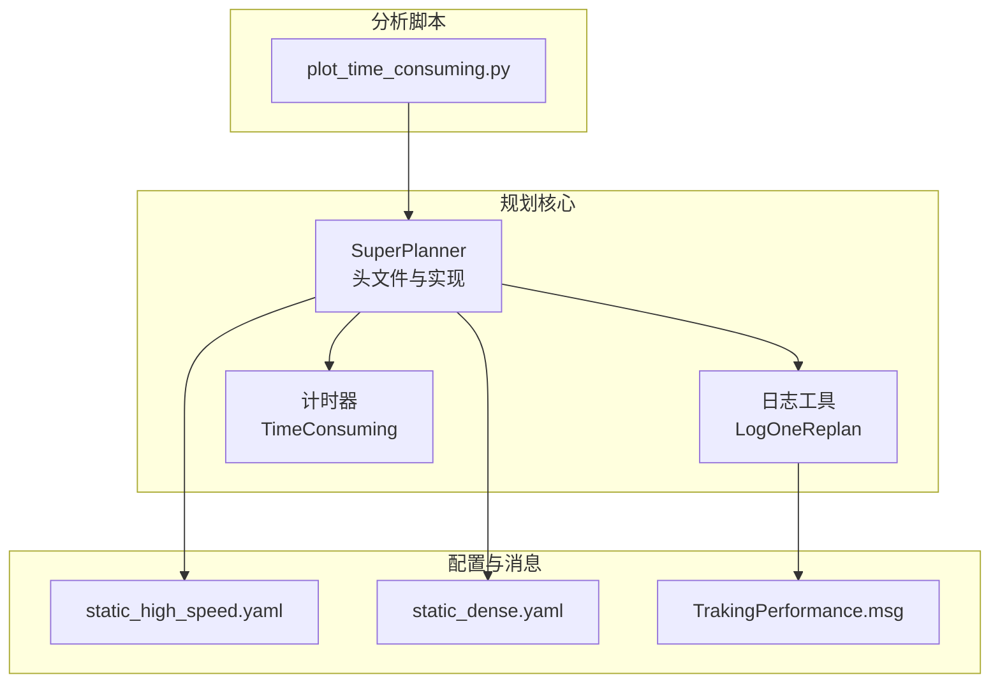
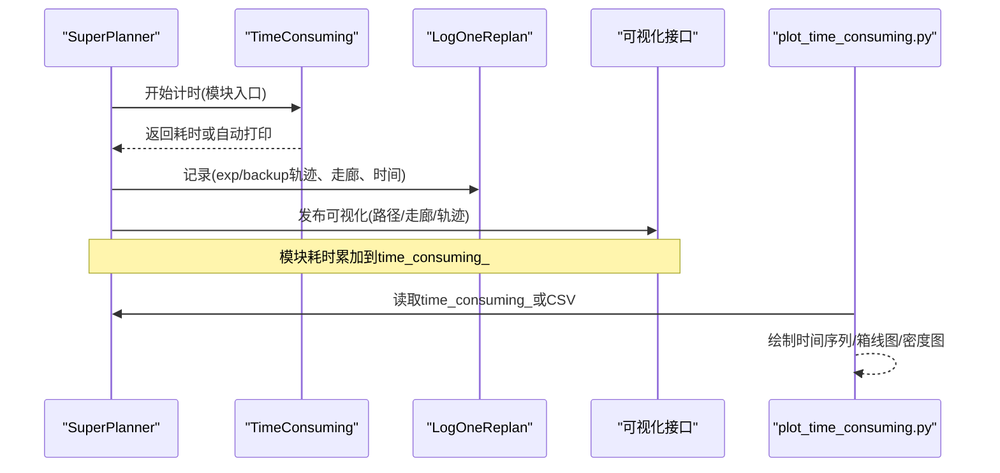
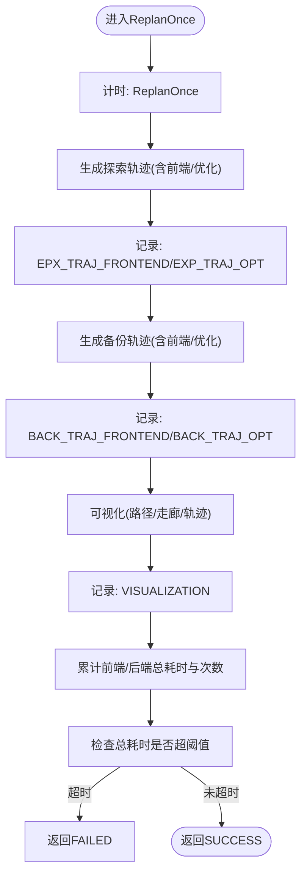
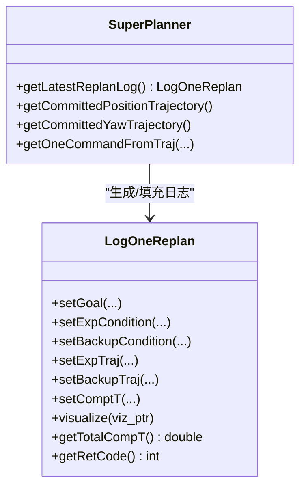
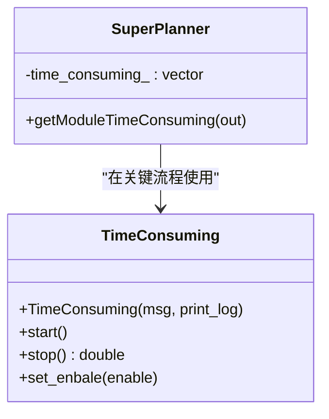
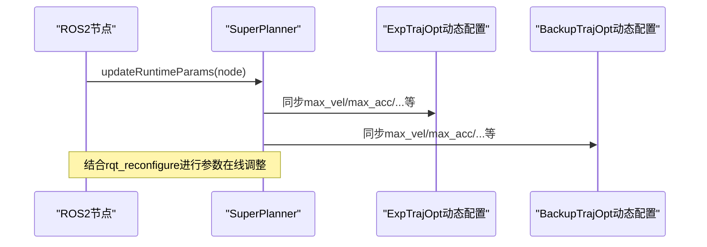
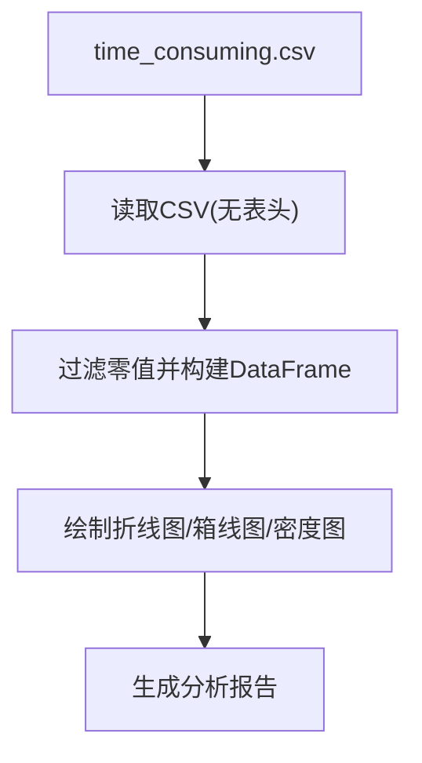
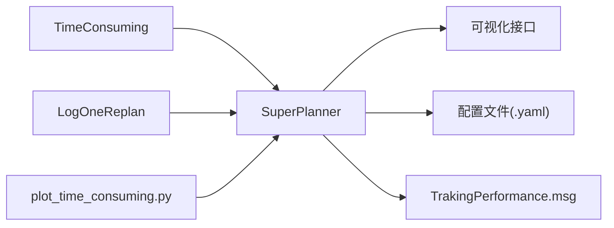

# 性能分析工具

<cite>
**本文引用的文件**
- [src/SUPER/super_planner/include/super_core/super_planner.h](file://src/SUPER/super_planner/include/super_core/super_planner.h)
- [src/SUPER/super_planner/src/super_core/super_planner.cpp](file://src/SUPER/super_planner/src/super_core/super_planner.cpp)
- [src/SUPER/super_planner/include/super_core/log_utils.hpp](file://src/SUPER/super_planner/include/super_core/log_utils.hpp)
- [src/SUPER/super_planner/include/utils/header/scope_timer.hpp](file://src/SUPER/super_planner/include/utils/header/scope_timer.hpp)
- [src/SUPER/super_planner/scripts/plot_time_consuming.py](file://src/SUPER/super_planner/scripts/plot_time_consuming.py)
- [src/SUPER/mars_uav_sim/mars_quadrotor_msgs/ros2_msg/TrakingPerformance.msg](file://src/SUPER/mars_uav_sim/mars_quadrotor_msgs/ros2_msg/TrakingPerformance.msg)
- [src/SUPER/super_planner/config/static_high_speed.yaml](file://src/SUPER/super_planner/config/static_high_speed.yaml)
- [src/SUPER/super_planner/config/static_dense.yaml](file://src/SUPER/super_planner/config/static_dense.yaml)
</cite>

## 目录
1. [简介](#简介)
2. [项目结构](#项目结构)
3. [核心组件](#核心组件)
4. [架构总览](#架构总览)
5. [详细组件分析](#详细组件分析)
6. [依赖关系分析](#依赖关系分析)
7. [性能考量](#性能考量)
8. [故障排除指南](#故障排除指南)
9. [结论](#结论)
10. [附录](#附录)

## 简介
本文件面向SUPER规划器的性能分析与优化，聚焦以下能力与流程：
- 规划时间统计：通过模块级耗时统计与平均前端/后端时间接口，量化规划各阶段耗时。
- 轨迹质量评估：结合日志记录、可视化输出与跟踪消息，评估轨迹可行性与稳定性。
- 系统资源监控：基于计时器与日志工具，实现可扩展的性能数据采集与趋势分析。
- 瓶颈识别与工具链：提供日志分析、指标监控、内存与CPU使用分析方法。
- 自动化工具与脚本：提供性能数据收集、分析报告生成与趋势分析脚本。
- 实时参数调优：结合rqt_reconfigure与动态参数同步机制，进行参数在线调整与效果验证。
- 最佳实践与排障：给出性能优化前后对比方法、评估标准与常见问题排查。

## 项目结构
本节概览与性能分析相关的模块组织与文件分布，便于定位关键实现与配置。

**图表来源**
- [src/SUPER/super_planner/include/super_core/super_planner.h](file://src/SUPER/super_planner/include/super_core/super_planner.h#L1-L298)
- [src/SUPER/super_planner/src/super_core/super_planner.cpp](file://src/SUPER/super_planner/src/super_core/super_planner.cpp#L1-L1212)
- [src/SUPER/super_planner/include/super_core/log_utils.hpp](file://src/SUPER/super_planner/include/super_core/log_utils.hpp#L1-L378)
- [src/SUPER/super_planner/include/utils/header/scope_timer.hpp](file://src/SUPER/super_planner/include/utils/header/scope_timer.hpp#L1-L114)
- [src/SUPER/super_planner/scripts/plot_time_consuming.py](file://src/SUPER/super_planner/scripts/plot_time_consuming.py#L1-L61)
- [src/SUPER/mars_uav_sim/mars_quadrotor_msgs/ros2_msg/TrakingPerformance.msg](file://src/SUPER/mars_uav_sim/mars_quadrotor_msgs/ros2_msg/TrakingPerformance.msg#L1-L16)
- [src/SUPER/super_planner/config/static_high_speed.yaml](file://src/SUPER/super_planner/config/static_high_speed.yaml#L1-L187)
- [src/SUPER/super_planner/config/static_dense.yaml](file://src/SUPER/super_planner/config/static_dense.yaml#L1-L186)

**章节来源**
- [src/SUPER/super_planner/include/super_core/super_planner.h](file://src/SUPER/super_planner/include/super_core/super_planner.h#L1-L298)
- [src/SUPER/super_planner/src/super_core/super_planner.cpp](file://src/SUPER/super_planner/src/super_core/super_planner.cpp#L1-L1212)

## 核心组件
- SuperPlanner：规划器主体，负责重规划流程、轨迹生成、模块耗时统计与动态参数同步。
- LogOneReplan：单次重规划日志容器，记录目标、轨迹、走廊、时间统计与可视化数据。
- TimeConsuming：轻量计时器，支持自动打印与返回耗时，用于模块级性能观测。
- 配置文件：静态高/密集场景配置，定义规划参数与可视化开关，支撑不同环境下的性能测试。
- TrakingPerformance.msg：跟踪性能消息，承载求解时间与参考/命令/反馈/误差状态，便于闭环性能评估。
- 分析脚本：Python脚本读取CSV并绘制时间序列曲线，辅助趋势分析与回归诊断。

**章节来源**
- [src/SUPER/super_planner/include/super_core/super_planner.h](file://src/SUPER/super_planner/include/super_core/super_planner.h#L59-L298)
- [src/SUPER/super_planner/include/super_core/log_utils.hpp](file://src/SUPER/super_planner/include/super_core/log_utils.hpp#L60-L378)
- [src/SUPER/super_planner/include/utils/header/scope_timer.hpp](file://src/SUPER/super_planner/include/utils/header/scope_timer.hpp#L33-L114)
- [src/SUPER/mars_uav_sim/mars_quadrotor_msgs/ros2_msg/TrakingPerformance.msg](file://src/SUPER/mars_uav_sim/mars_quadrotor_msgs/ros2_msg/TrakingPerformance.msg#L1-L16)
- [src/SUPER/super_planner/scripts/plot_time_consuming.py](file://src/SUPER/super_planner/scripts/plot_time_consuming.py#L1-L61)

## 架构总览
下图展示性能分析相关组件的交互关系与数据流，强调“计时—统计—日志—可视化—脚本分析”的闭环。

**图表来源**
- [src/SUPER/super_planner/src/super_core/super_planner.cpp](file://src/SUPER/super_planner/src/super_core/super_planner.cpp#L182-L312)
- [src/SUPER/super_planner/include/super_core/log_utils.hpp](file://src/SUPER/super_planner/include/super_core/log_utils.hpp#L98-L136)
- [src/SUPER/super_planner/scripts/plot_time_consuming.py](file://src/SUPER/super_planner/scripts/plot_time_consuming.py#L1-L61)

## 详细组件分析

### 规划时间统计与平均前端/后端时间
- 模块级统计：在关键流程（如探索轨迹前端、优化、备份轨迹前端、优化、可视化、总重规划）插入计时器，累加到time_consuming_数组。
- 平均时间接口：提供getFrontendTime与getBackendTime，分别返回前端与后端模块的平均耗时，并清零计数器，便于周期性上报与对比。
- 重规划超时控制：ReplanOnce中对总重规划耗时进行阈值检查，避免超时导致的失败。

**图表来源**
- [src/SUPER/super_planner/src/super_core/super_planner.cpp](file://src/SUPER/super_planner/src/super_core/super_planner.cpp#L182-L312)
- [src/SUPER/super_planner/src/super_core/super_planner.cpp](file://src/SUPER/super_planner/src/super_core/super_planner.cpp#L242-L254)
- [src/SUPER/super_planner/include/super_core/super_planner.h](file://src/SUPER/super_planner/include/super_core/super_planner.h#L210-L224)

**章节来源**
- [src/SUPER/super_planner/src/super_core/super_planner.cpp](file://src/SUPER/super_planner/src/super_core/super_planner.cpp#L182-L312)
- [src/SUPER/super_planner/include/super_core/super_planner.h](file://src/SUPER/super_planner/include/super_core/super_planner.h#L210-L224)

### 轨迹质量评估
- 日志记录：LogOneReplan封装了目标、引导路径、SFC、exp/backup轨迹及其偏航、返回码与各类耗时，支持序列化与可视化。
- 可视化输出：规划器在多个阶段发布可视化消息（前端路径、SFC、exp/backup轨迹、偏航），便于人工评估轨迹可行性与平滑性。
- 跟踪性能消息：TrakingPerformance.msg包含MPC求解时间、建议悬停比例及参考/命令/反馈/误差状态，可用于闭环性能评估与对比。

**图表来源**
- [src/SUPER/super_planner/include/super_core/log_utils.hpp](file://src/SUPER/super_planner/include/super_core/log_utils.hpp#L60-L378)
- [src/SUPER/super_planner/include/super_core/super_planner.h](file://src/SUPER/super_planner/include/super_core/super_planner.h#L230-L234)

**章节来源**
- [src/SUPER/super_planner/include/super_core/log_utils.hpp](file://src/SUPER/super_planner/include/super_core/log_utils.hpp#L60-L378)
- [src/SUPER/mars_uav_sim/mars_quadrotor_msgs/ros2_msg/TrakingPerformance.msg](file://src/SUPER/mars_uav_sim/mars_quadrotor_msgs/ros2_msg/TrakingPerformance.msg#L1-L16)

### 系统资源监控与计时器
- TimeConsuming：封装高精度计时与自动打印，支持重复次数、禁用与非打印模式，适合在关键路径插入以观测热点。
- 模块耗时数组：SuperPlanner内部维护按模块分类的耗时数组，配合getModuleTimeConsuming对外暴露，便于统一采集与上报。

**图表来源**
- [src/SUPER/super_planner/include/utils/header/scope_timer.hpp](file://src/SUPER/super_planner/include/utils/header/scope_timer.hpp#L33-L114)
- [src/SUPER/super_planner/include/super_core/super_planner.h](file://src/SUPER/super_planner/include/super_core/super_planner.h#L99-L136)

**章节来源**
- [src/SUPER/super_planner/include/utils/header/scope_timer.hpp](file://src/SUPER/super_planner/include/utils/header/scope_timer.hpp#L33-L114)
- [src/SUPER/super_planner/include/super_core/super_planner.h](file://src/SUPER/super_planner/include/super_core/super_planner.h#L99-L136)

### 动态参数同步与rqt_reconfigure
- 动态参数同步：updateRuntimeParams从ROS2参数服务器读取配置并同步到优化器动态配置，确保在线调整生效。
- rqt_reconfigure集成：配置文件中提供可视化参数开关与动态重配置选项，可在RViz中通过rqt_reconfigure调整参数并即时验证效果。

**图表来源**
- [src/SUPER/super_planner/include/super_core/super_planner.h](file://src/SUPER/super_planner/include/super_core/super_planner.h#L241-L295)
- [src/SUPER/super_planner/config/static_high_speed.yaml](file://src/SUPER/super_planner/config/static_high_speed.yaml#L143-L150)

**章节来源**
- [src/SUPER/super_planner/include/super_core/super_planner.h](file://src/SUPER/super_planner/include/super_core/super_planner.h#L241-L295)
- [src/SUPER/super_planner/config/static_high_speed.yaml](file://src/SUPER/super_planner/config/static_high_speed.yaml#L143-L150)

### 性能数据收集与分析脚本
- 数据来源：通过getModuleTimeConsuming或日志CSV（由外部采集）获取模块耗时序列。
- 脚本功能：读取CSV，过滤零值，绘制时间序列折线图，支持分组与多指标对比，辅助趋势分析与回归诊断。

**图表来源**
- [src/SUPER/super_planner/scripts/plot_time_consuming.py](file://src/SUPER/super_planner/scripts/plot_time_consuming.py#L1-L61)

**章节来源**
- [src/SUPER/super_planner/scripts/plot_time_consuming.py](file://src/SUPER/super_planner/scripts/plot_time_consuming.py#L1-L61)

## 依赖关系分析
- SuperPlanner依赖计时器与日志工具，贯穿规划主流程；同时依赖配置与优化器动态配置，实现参数在线同步。
- 日志工具与可视化接口耦合紧密，便于将性能数据转化为可观察的图形输出。
- 分析脚本独立于核心逻辑，通过CSV输入实现解耦的数据分析。

**图表来源**
- [src/SUPER/super_planner/include/utils/header/scope_timer.hpp](file://src/SUPER/super_planner/include/utils/header/scope_timer.hpp#L33-L114)
- [src/SUPER/super_planner/include/super_core/log_utils.hpp](file://src/SUPER/super_planner/include/super_core/log_utils.hpp#L60-L378)
- [src/SUPER/super_planner/include/super_core/super_planner.h](file://src/SUPER/super_planner/include/super_core/super_planner.h#L241-L295)
- [src/SUPER/mars_uav_sim/mars_quadrotor_msgs/ros2_msg/TrakingPerformance.msg](file://src/SUPER/mars_uav_sim/mars_quadrotor_msgs/ros2_msg/TrakingPerformance.msg#L1-L16)
- [src/SUPER/super_planner/scripts/plot_time_consuming.py](file://src/SUPER/super_planner/scripts/plot_time_consuming.py#L1-L61)

**章节来源**
- [src/SUPER/super_planner/include/super_core/super_planner.h](file://src/SUPER/super_planner/include/super_core/super_planner.h#L1-L298)
- [src/SUPER/super_planner/src/super_core/super_planner.cpp](file://src/SUPER/super_planner/src/super_core/super_planner.cpp#L1-L1212)

## 性能考量
- 模块划分清晰：前端（路径搜索、走廊生成）与后端（轨迹优化）分离，便于针对性优化。
- 超时保护：总重规划耗时阈值检查，避免在高负载下阻塞控制环。
- 可视化与日志：提供丰富的可视化与序列化日志，便于离线分析与回归诊断。
- 参数在线同步：支持rqt_reconfigure与动态参数同步，降低离线调试成本。

[本节为通用指导，无需特定文件分析]

## 故障排除指南
- 重规划超时：若getFrontendTime或getBackendTime持续偏高，检查规划参数（如规划视野、走廊长度、采样间隔）与硬件性能。
- 失败返回码：关注LogOneReplan中的返回码与可视化输出，定位具体模块失败点（如路径搜索、优化器收敛）。
- 可视化异常：确认可视化开关与频率设置，检查发布主题与RViz显示。
- 参数未生效：确认updateRuntimeParams是否被调用，以及rqt_reconfigure的参数同步是否启用。

**章节来源**
- [src/SUPER/super_planner/src/super_core/super_planner.cpp](file://src/SUPER/super_planner/src/super_core/super_planner.cpp#L250-L254)
- [src/SUPER/super_planner/include/super_core/log_utils.hpp](file://src/SUPER/super_planner/include/super_core/log_utils.hpp#L98-L136)
- [src/SUPER/super_planner/config/static_high_speed.yaml](file://src/SUPER/super_planner/config/static_high_speed.yaml#L143-L150)

## 结论
通过模块级计时、日志记录、可视化与分析脚本，SUPER规划器提供了完整的性能分析闭环。结合rqt_reconfigure与动态参数同步，可在真实或仿真环境中快速定位瓶颈并进行参数调优。建议在不同场景（高/密集）下定期采集与对比性能数据，建立基线并持续优化。

[本节为总结，无需特定文件分析]

## 附录

### 性能分析最佳实践
- 建立基线：在静态高/密集场景配置下采集baseline数据，记录getFrontendTime/getBackendTime与总重规划耗时。
- 回归测试：每次参数变更后，重复采集并对比趋势，确保未引入性能退化。
- 可视化验证：结合路径/走廊/轨迹可视化，确认轨迹可行性与稳定性。
- 脚本化分析：使用plot_time_consuming.py生成趋势图，辅助发现异常波动与周期性问题。

**章节来源**
- [src/SUPER/super_planner/config/static_high_speed.yaml](file://src/SUPER/super_planner/config/static_high_speed.yaml#L1-L187)
- [src/SUPER/super_planner/config/static_dense.yaml](file://src/SUPER/super_planner/config/static_dense.yaml#L1-L186)
- [src/SUPER/super_planner/scripts/plot_time_consuming.py](file://src/SUPER/super_planner/scripts/plot_time_consuming.py#L1-L61)

### 性能优化前后对比方法
- 指标体系：前端平均耗时、后端平均耗时、总重规划耗时、可视化耗时、优化器收敛次数/迭代数。
- 数据采集：固定场景与任务轨迹，采集N次样本，计算均值与方差。
- 报告生成：使用脚本绘制对比图，标注显著差异区间。
- 评估标准：在满足轨迹质量的前提下，优先降低前端耗时；若后端耗时过高，需检查约束与精度设置。

**章节来源**
- [src/SUPER/super_planner/include/super_core/super_planner.h](file://src/SUPER/super_planner/include/super_core/super_planner.h#L210-L224)
- [src/SUPER/super_planner/scripts/plot_time_consuming.py](file://src/SUPER/super_planner/scripts/plot_time_consuming.py#L1-L61)