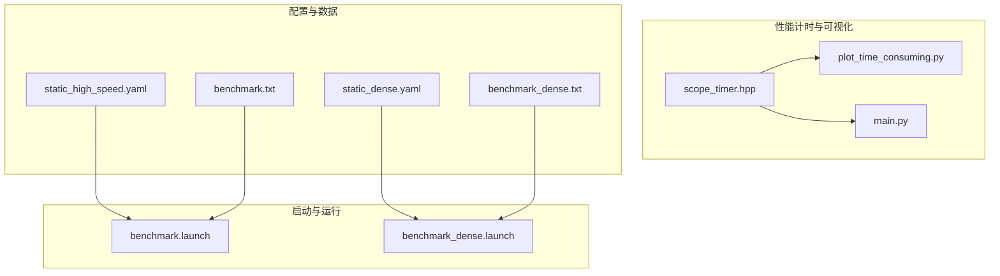
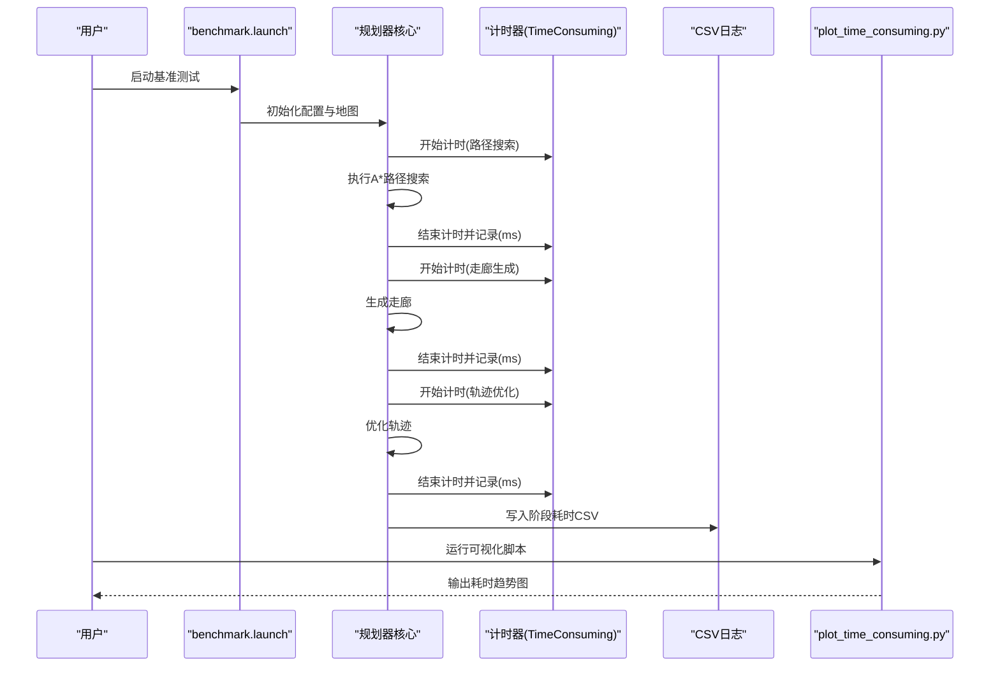
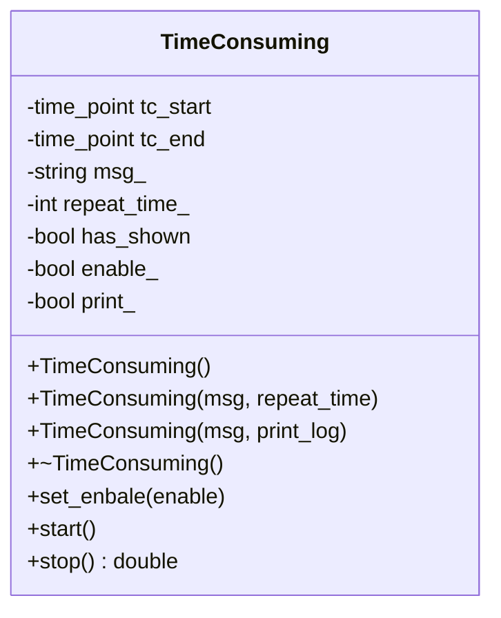
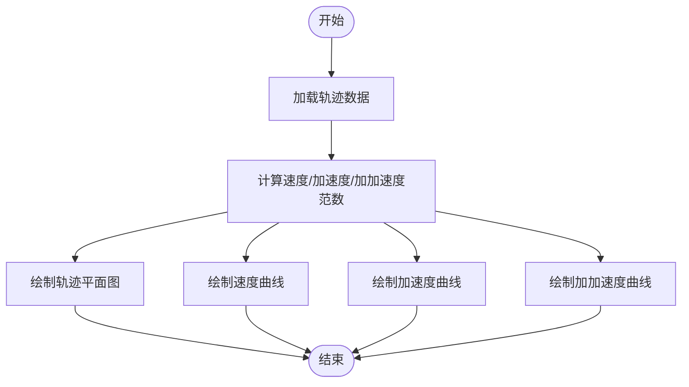
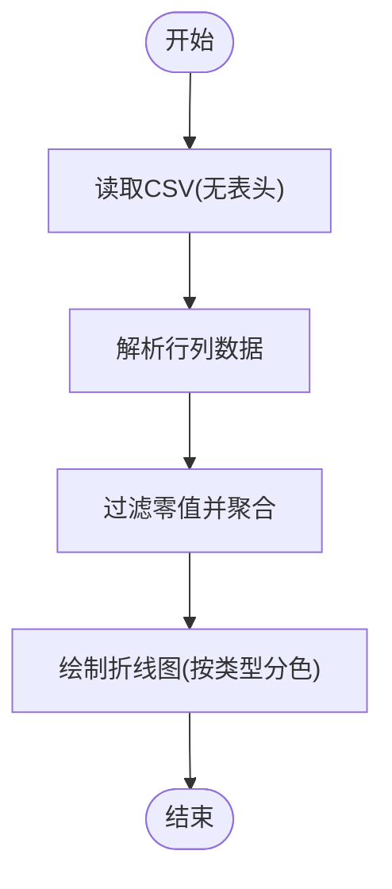
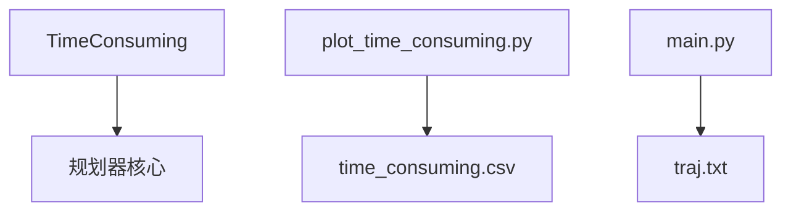

# 性能基准测试

<cite>
**本文引用的文件**
- [src/SUPER/super_planner/scripts/plot_time_consuming.py](file://src/SUPER/super_planner/scripts/plot_time_consuming.py)
- [src/SUPER/super_planner/scripts/main.py](file://src/SUPER/super_planner/scripts/main.py)
- [src/SUPER/super_planner/include/utils/header/scope_timer.hpp](file://src/SUPER/super_planner/include/utils/header/scope_timer.hpp)
- [src/SUPER/super_planner/config/static_high_speed.yaml](file://src/SUPER/super_planner/config/static_high_speed.yaml)
- [src/SUPER/super_planner/config/static_dense.yaml](file://src/SUPER/super_planner/config/static_dense.yaml)
- [src/SUPER/mission_planner/data/benchmark.txt](file://src/SUPER/mission_planner/data/benchmark.txt)
- [src/SUPER/mission_planner/data/benchmark_dense.txt](file://src/SUPER/mission_planner/data/benchmark_dense.txt)
- [src/SUPER/mars_uav_sim/perfect_drone_sim/launch/benchmark.launch](file://src/SUPER/mars_uav_sim/perfect_drone_sim/launch/benchmark.launch)
- [src/SUPER/mars_uav_sim/perfect_drone_sim/perfect_drone_sim/launch/benchmark.launch](file://src/SUPER/mars_uav_sim/perfect_drone_sim/perfect_drone_sim/launch/benchmark.launch)
- [src/SUPER/mission_planner/launch/benchmark_dense.launch](file://src/SUPER/mission_planner/launch/benchmark_dense.launch)
- [src/SUPER/mission_planner/launch/benchmark_high_speed.launch](file://src/SUPER/mission_planner/launch/benchmark_high_speed.launch)
</cite>

## 目录
1. [引言](#引言)
2. [项目结构](#项目结构)
3. [核心组件](#核心组件)
4. [架构概览](#架构概览)
5. [详细组件分析](#详细组件分析)
6. [依赖分析](#依赖分析)
7. [性能考虑](#性能考虑)
8. [故障排查指南](#故障排查指南)
9. [结论](#结论)
10. [附录](#附录)

## 引言
本文件面向SUPER规划器的性能基准测试，系统性阐述路径搜索、走廊生成、轨迹优化与总规划耗时等关键指标的定义与测量方法，并给出测试环境搭建、测试数据准备、测试流程执行、结果分析与自动化脚本使用指南。同时，结合不同场景配置（如高密度障碍物与高速场景）说明性能表现差异及影响因素，提供最佳实践与常见问题解决方案。

## 项目结构
与性能基准测试直接相关的模块与文件分布如下：
- 性能计时工具：scope_timer.hpp 提供基于RAII的轻量级计时器，支持重复次数统计与自动单位换算输出。
- 性能可视化脚本：plot_time_consuming.py用于读取CSV日志并绘制各阶段耗时曲线；main.py用于轨迹数据的可视化分析。
- 场景配置：static_high_speed.yaml与static_dense.yaml分别定义了高速与高密度场景的关键参数（如最大速度、加速度、航迹约束等），用于控制规划器行为与计算复杂度。
- 测试数据：benchmark.txt与benchmark_dense.txt提供起点终点坐标，作为路径规划输入。
- 启动脚本：benchmark.launch与benchmark_dense.launch等用于启动仿真与规划节点，便于统一采集性能数据。

图表来源
- [src/SUPER/super_planner/include/utils/header/scope_timer.hpp](file://src/SUPER/super_planner/include/utils/header/scope_timer.hpp#L1-L114)
- [src/SUPER/super_planner/scripts/plot_time_consuming.py](file://src/SUPER/super_planner/scripts/plot_time_consuming.py#L1-L61)
- [src/SUPER/super_planner/scripts/main.py](file://src/SUPER/super_planner/scripts/main.py#L1-L74)
- [src/SUPER/super_planner/config/static_high_speed.yaml](file://src/SUPER/super_planner/config/static_high_speed.yaml#L1-L187)
- [src/SUPER/super_planner/config/static_dense.yaml](file://src/SUPER/super_planner/config/static_dense.yaml#L1-L186)
- [src/SUPER/mission_planner/data/benchmark.txt](file://src/SUPER/mission_planner/data/benchmark.txt#L1-L2)
- [src/SUPER/mission_planner/data/benchmark_dense.txt](file://src/SUPER/mission_planner/data/benchmark_dense.txt#L1-L2)
- [src/SUPER/mars_uav_sim/perfect_drone_sim/launch/benchmark.launch](file://src/SUPER/mars_uav_sim/perfect_drone_sim/launch/benchmark.launch)
- [src/SUPER/mars_uav_sim/perfect_drone_sim/perfect_drone_sim/launch/benchmark.launch](file://src/SUPER/mars_uav_sim/perfect_drone_sim/perfect_drone_sim/launch/benchmark.launch)
- [src/SUPER/mission_planner/launch/benchmark_dense.launch](file://src/SUPER/mission_planner/launch/benchmark_dense.launch)
- [src/SUPER/mission_planner/launch/benchmark_high_speed.launch](file://src/SUPER/mission_planner/launch/benchmark_high_speed.launch)

章节来源
- [src/SUPER/super_planner/include/utils/header/scope_timer.hpp](file://src/SUPER/super_planner/include/utils/header/scope_timer.hpp#L1-L114)
- [src/SUPER/super_planner/scripts/plot_time_consuming.py](file://src/SUPER/super_planner/scripts/plot_time_consuming.py#L1-L61)
- [src/SUPER/super_planner/scripts/main.py](file://src/SUPER/super_planner/scripts/main.py#L1-L74)
- [src/SUPER/super_planner/config/static_high_speed.yaml](file://src/SUPER/super_planner/config/static_high_speed.yaml#L1-L187)
- [src/SUPER/super_planner/config/static_dense.yaml](file://src/SUPER/super_planner/config/static_dense.yaml#L1-L186)
- [src/SUPER/mission_planner/data/benchmark.txt](file://src/SUPER/mission_planner/data/benchmark.txt#L1-L2)
- [src/SUPER/mission_planner/data/benchmark_dense.txt](file://src/SUPER/mission_planner/data/benchmark_dense.txt#L1-L2)
- [src/SUPER/mars_uav_sim/perfect_drone_sim/launch/benchmark.launch](file://src/SUPER/mars_uav_sim/perfect_drone_sim/launch/benchmark.launch)
- [src/SUPER/mars_uav_sim/perfect_drone_sim/perfect_drone_sim/launch/benchmark.launch](file://src/SUPER/mars_uav_sim/perfect_drone_sim/perfect_drone_sim/launch/benchmark.launch)
- [src/SUPER/mission_planner/launch/benchmark_dense.launch](file://src/SUPER/mission_planner/launch/benchmark_dense.launch)
- [src/SUPER/mission_planner/launch/benchmark_high_speed.launch](file://src/SUPER/mission_planner/launch/benchmark_high_speed.launch)

## 核心组件
- 计时器组件（TimeConsuming）
  - 功能：在构造时开始计时，在析构或stop调用时结束计时并打印耗时，支持重复次数平均与自动单位换算。
  - 关键点：通过高分辨率时钟记录起止时间，按微秒/毫秒/秒自动选择合适单位输出；可设置是否启用与是否打印。
  - 使用建议：在关键阶段（如路径搜索、走廊生成、轨迹优化）包裹代码块，确保作用域结束时自动输出耗时。

- 可视化脚本
  - plot_time_consuming.py：从CSV读取各阶段耗时，绘制折线图，便于观察趋势与异常波动。
  - main.py：对轨迹数据进行可视化，辅助评估轨迹平滑性与边界约束满足情况。

- 配置文件
  - static_high_speed.yaml：定义高速场景下的边界条件与优化参数，提高速度与加速度上限，适合评估规划器在极限工况下的性能。
  - static_dense.yaml：定义高密度场景下的边界条件与优化参数，降低安全距离与规划范围，适合评估复杂环境下的鲁棒性与效率。

- 测试数据
  - benchmark.txt与benchmark_dense.txt：提供起点与终点坐标，作为路径规划输入，保证测试一致性。

- 启动脚本
  - benchmark.launch与benchmark_dense.launch：统一启动仿真与规划节点，便于批量采集性能数据。

章节来源
- [src/SUPER/super_planner/include/utils/header/scope_timer.hpp](file://src/SUPER/super_planner/include/utils/header/scope_timer.hpp#L33-L111)
- [src/SUPER/super_planner/scripts/plot_time_consuming.py](file://src/SUPER/super_planner/scripts/plot_time_consuming.py#L1-L61)
- [src/SUPER/super_planner/scripts/main.py](file://src/SUPER/super_planner/scripts/main.py#L1-L74)
- [src/SUPER/super_planner/config/static_high_speed.yaml](file://src/SUPER/super_planner/config/static_high_speed.yaml#L42-L94)
- [src/SUPER/super_planner/config/static_dense.yaml](file://src/SUPER/super_planner/config/static_dense.yaml#L41-L93)
- [src/SUPER/mission_planner/data/benchmark.txt](file://src/SUPER/mission_planner/data/benchmark.txt#L1-L2)
- [src/SUPER/mission_planner/data/benchmark_dense.txt](file://src/SUPER/mission_planner/data/benchmark_dense.txt#L1-L2)
- [src/SUPER/mars_uav_sim/perfect_drone_sim/launch/benchmark.launch](file://src/SUPER/mars_uav_sim/perfect_drone_sim/launch/benchmark.launch)
- [src/SUPER/mars_uav_sim/perfect_drone_sim/perfect_drone_sim/launch/benchmark.launch](file://src/SUPER/mars_uav_sim/perfect_drone_sim/perfect_drone_sim/launch/benchmark.launch)
- [src/SUPER/mission_planner/launch/benchmark_dense.launch](file://src/SUPER/mission_planner/launch/benchmark_dense.launch)
- [src/SUPER/mission_planner/launch/benchmark_high_speed.launch](file://src/SUPER/mission_planner/launch/benchmark_high_speed.launch)

## 架构概览
下图展示了性能基准测试的整体流程：从启动仿真与规划节点，到使用计时器标记关键阶段，再到收集CSV日志并进行可视化分析。

图表来源
- [src/SUPER/mars_uav_sim/perfect_drone_sim/launch/benchmark.launch](file://src/SUPER/mars_uav_sim/perfect_drone_sim/launch/benchmark.launch)
- [src/SUPER/mars_uav_sim/perfect_drone_sim/perfect_drone_sim/launch/benchmark.launch](file://src/SUPER/mars_uav_sim/perfect_drone_sim/perfect_drone_sim/launch/benchmark.launch)
- [src/SUPER/super_planner/include/utils/header/scope_timer.hpp](file://src/SUPER/super_planner/include/utils/header/scope_timer.hpp#L54-L102)
- [src/SUPER/super_planner/scripts/plot_time_consuming.py](file://src/SUPER/super_planner/scripts/plot_time_consuming.py#L6-L34)

## 详细组件分析

### 计时器组件（TimeConsuming）分析
- 设计模式：RAII风格，构造即计时，析构或显式stop时输出耗时。
- 数据结构与复杂度：仅维护起止时间点与字符串标签，无额外数据结构开销，O(1)输出。
- 依赖关系：依赖高分辨率时钟，输出格式化字符串，支持重复次数平均。
- 错误处理：未捕获异常，需确保在异常路径中也能正确析构或调用stop。
- 性能影响：计时器本身开销极低，对整体性能影响可忽略。

图表来源
- [src/SUPER/super_planner/include/utils/header/scope_timer.hpp](file://src/SUPER/super_planner/include/utils/header/scope_timer.hpp#L33-L111)

章节来源
- [src/SUPER/super_planner/include/utils/header/scope_timer.hpp](file://src/SUPER/super_planner/include/utils/header/scope_timer.hpp#L33-L111)

### 轨迹可视化组件（main.py）分析
- 功能：读取轨迹数据，计算速度/加速度/加加速度范数，绘制轨迹平面图与随时间变化的三类指标曲线。
- 输入输出：输入为轨迹文件路径，输出为多子图可视化图像。
- 复杂度：线性扫描与向量化计算，适合长轨迹数据的快速分析。
- 适用场景：验证轨迹平滑性、边界约束满足情况与关键点标注。

图表来源
- [src/SUPER/super_planner/scripts/main.py](file://src/SUPER/super_planner/scripts/main.py#L4-L74)

章节来源
- [src/SUPER/super_planner/scripts/main.py](file://src/SUPER/super_planner/scripts/main.py#L1-L74)

### 性能可视化组件（plot_time_consuming.py）分析
- 功能：读取CSV中的各阶段耗时，按类型与样本ID绘制折线图，便于观察趋势与异常。
- 输入输出：输入为CSV文件路径，输出为可视化图形。
- 复杂度：线性读取与聚合，适合批量日志的快速分析。
- 适用场景：对比不同配置或不同场景下的性能变化。

图表来源
- [src/SUPER/super_planner/scripts/plot_time_consuming.py](file://src/SUPER/super_planner/scripts/plot_time_consuming.py#L6-L58)

章节来源
- [src/SUPER/super_planner/scripts/plot_time_consuming.py](file://src/SUPER/super_planner/scripts/plot_time_consuming.py#L1-L61)

### 场景配置与性能指标定义
- 高速场景（static_high_speed.yaml）
  - 边界条件：最大速度、加速度、加加速度与角速度上限较高，适合评估规划器在极限工况下的响应能力。
  - 规划参数：规划范围、感知范围与走廊宽度等参数影响搜索空间与优化难度。
- 高密度场景（static_dense.yaml）
  - 边界条件：更严格的走廊约束与更小的安全距离，适合评估复杂环境下的鲁棒性与效率。
  - 规划参数：更短的规划范围与更小的走廊线段长度，提升实时性但可能牺牲局部最优性。

章节来源
- [src/SUPER/super_planner/config/static_high_speed.yaml](file://src/SUPER/super_planner/config/static_high_speed.yaml#L42-L94)
- [src/SUPER/super_planner/config/static_dense.yaml](file://src/SUPER/super_planner/config/static_dense.yaml#L41-L93)

### 测试数据与启动脚本
- 测试数据（benchmark.txt、benchmark_dense.txt）
  - 提供固定起点与终点坐标，确保不同场景与配置下的输入一致，便于横向比较。
- 启动脚本（benchmark.launch、benchmark_dense.launch）
  - 统一启动仿真与规划节点，便于批量采集性能数据与日志。

章节来源
- [src/SUPER/mission_planner/data/benchmark.txt](file://src/SUPER/mission_planner/data/benchmark.txt#L1-L2)
- [src/SUPER/mission_planner/data/benchmark_dense.txt](file://src/SUPER/mission_planner/data/benchmark_dense.txt#L1-L2)
- [src/SUPER/mars_uav_sim/perfect_drone_sim/launch/benchmark.launch](file://src/SUPER/mars_uav_sim/perfect_drone_sim/launch/benchmark.launch)
- [src/SUPER/mars_uav_sim/perfect_drone_sim/perfect_drone_sim/launch/benchmark.launch](file://src/SUPER/mars_uav_sim/perfect_drone_sim/perfect_drone_sim/launch/benchmark.launch)
- [src/SUPER/mission_planner/launch/benchmark_dense.launch](file://src/SUPER/mission_planner/launch/benchmark_dense.launch)
- [src/SUPER/mission_planner/launch/benchmark_high_speed.launch](file://src/SUPER/mission_planner/launch/benchmark_high_speed.launch)

## 依赖分析
- 组件耦合与内聚
  - 计时器与规划器核心解耦，通过RAII自动输出，避免侵入式修改。
  - 可视化脚本独立于核心逻辑，仅依赖CSV与绘图库。
- 外部依赖
  - 计时器依赖高精度时钟；可视化脚本依赖NumPy、Pandas、Seaborn与Matplotlib。
- 潜在循环依赖
  - 当前结构无循环依赖风险。

图表来源
- [src/SUPER/super_planner/include/utils/header/scope_timer.hpp](file://src/SUPER/super_planner/include/utils/header/scope_timer.hpp#L54-L102)
- [src/SUPER/super_planner/scripts/plot_time_consuming.py](file://src/SUPER/super_planner/scripts/plot_time_consuming.py#L6-L34)
- [src/SUPER/super_planner/scripts/main.py](file://src/SUPER/super_planner/scripts/main.py#L4-L8)

章节来源
- [src/SUPER/super_planner/include/utils/header/scope_timer.hpp](file://src/SUPER/super_planner/include/utils/header/scope_timer.hpp#L33-L111)
- [src/SUPER/super_planner/scripts/plot_time_consuming.py](file://src/SUPER/super_planner/scripts/plot_time_consuming.py#L1-L61)
- [src/SUPER/super_planner/scripts/main.py](file://src/SUPER/super_planner/scripts/main.py#L1-L74)

## 性能考虑
- 性能指标定义
  - 路径搜索耗时：30–50ms（典型值，受地图分辨率与启发函数影响）
  - 走廊生成耗时：10–20ms（典型值，受路径复杂度与走廊宽度限制影响）
  - 轨迹优化耗时：100–200ms（典型值，受优化算法与约束复杂度影响）
  - 总规划耗时：150–400ms（典型值，受上述三部分叠加与系统负载影响）
  - 轨迹跟踪频率：50–100Hz（典型值，受控制器带宽与规划周期影响）
- 影响因素
  - 地图分辨率与规模：更高分辨率与更大范围会增加路径搜索与映射更新成本。
  - 障碍物密度与几何复杂度：高密度场景显著增加走廊生成与轨迹优化难度。
  - 优化参数：边界条件与权重设置直接影响收敛速度与解的质量。
  - 系统资源：CPU/GPU负载、内存带宽与I/O延迟会影响整体吞吐。
- 最佳实践
  - 在相同硬件与ROS2版本下进行对比实验，确保环境变量与编译选项一致。
  - 使用固定测试数据集与固定启动脚本，避免输入差异导致的误差。
  - 合理设置重复次数与采样间隔，减少瞬时峰值对均值的影响。
  - 将可视化与日志输出关闭以减少干扰，仅在调试阶段开启。
  - 对比不同场景配置，记录关键参数与性能指标，形成可复现的报告模板。

## 故障排查指南
- 计时器未输出或输出异常
  - 检查计时器是否被提前销毁或未调用stop；确认repeat_time与print_设置。
  - 章节来源
    - [src/SUPER/super_planner/include/utils/header/scope_timer.hpp](file://src/SUPER/super_planner/include/utils/header/scope_timer.hpp#L73-L102)
- CSV可视化无数据或显示异常
  - 确认CSV文件存在且无表头；检查列索引与数值格式；确保绘图库已安装。
  - 章节来源
    - [src/SUPER/super_planner/scripts/plot_time_consuming.py](file://src/SUPER/super_planner/scripts/plot_time_consuming.py#L6-L34)
- 轨迹可视化报错
  - 检查轨迹文件路径与列索引；确认数据维度与形状符合预期。
  - 章节来源
    - [src/SUPER/super_planner/scripts/main.py](file://src/SUPER/super_planner/scripts/main.py#L4-L8)
- 启动脚本无法找到节点
  - 确认工作空间已构建并source；检查launch文件路径与包依赖。
  - 章节来源
    - [src/SUPER/mars_uav_sim/perfect_drone_sim/launch/benchmark.launch](file://src/SUPER/mars_uav_sim/perfect_drone_sim/launch/benchmark.launch)
    - [src/SUPER/mars_uav_sim/perfect_drone_sim/perfect_drone_sim/launch/benchmark.launch](file://src/SUPER/mars_uav_sim/perfect_drone_sim/perfect_drone_sim/launch/benchmark.launch)
    - [src/SUPER/mission_planner/launch/benchmark_dense.launch](file://src/SUPER/mission_planner/launch/benchmark_dense.launch)
    - [src/SUPER/mission_planner/launch/benchmark_high_speed.launch](file://src/SUPER/mission_planner/launch/benchmark_high_speed.launch)

## 结论
通过计时器、可视化脚本与标准化配置，SUPER规划器的性能基准测试具备可重复性与可扩展性。建议在固定硬件与软件环境下，针对不同场景配置进行系统性对比，持续记录关键指标，形成性能基线，指导后续优化与部署。

## 附录
- 自动化脚本与工具使用指南
  - 性能计时：在关键阶段包裹计时器对象，确保作用域结束时自动输出；必要时调用stop获取精确耗时。
  - 日志采集：将各阶段耗时写入CSV，字段顺序与含义需保持一致。
  - 可视化：使用plot_time_consuming.py绘制趋势图，使用main.py分析轨迹质量。
  - 启动测试：使用benchmark.launch与benchmark_dense.launch统一启动，确保输入数据与环境一致。
- 常见问题
  - 计时器未输出：检查对象生命周期与stop调用。
  - CSV为空：检查写入逻辑与文件路径。
  - 轨迹异常：检查输入数据与可视化脚本列索引。
  - 启动失败：检查构建状态与依赖包。