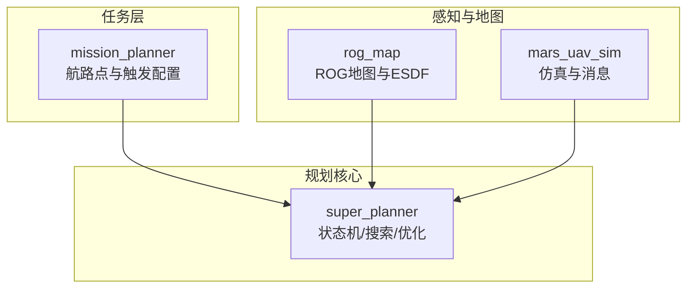
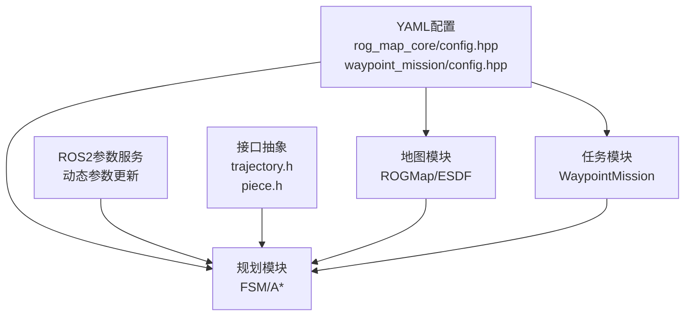
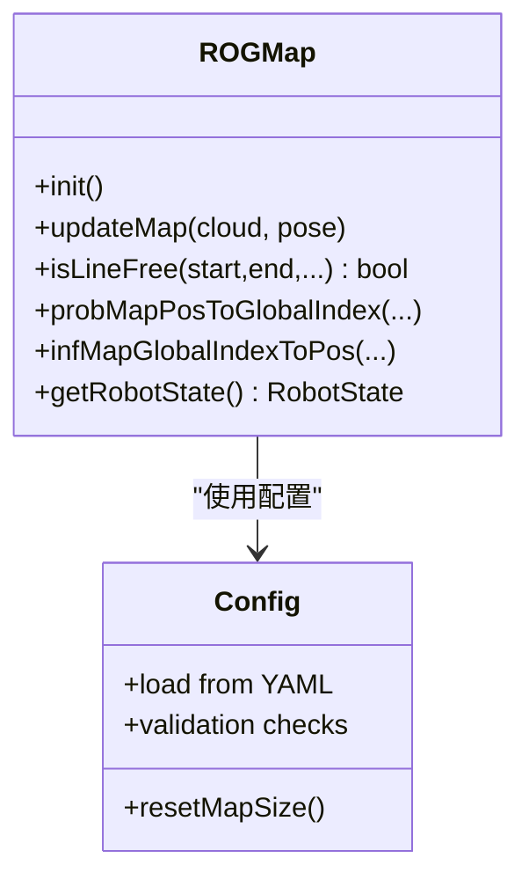
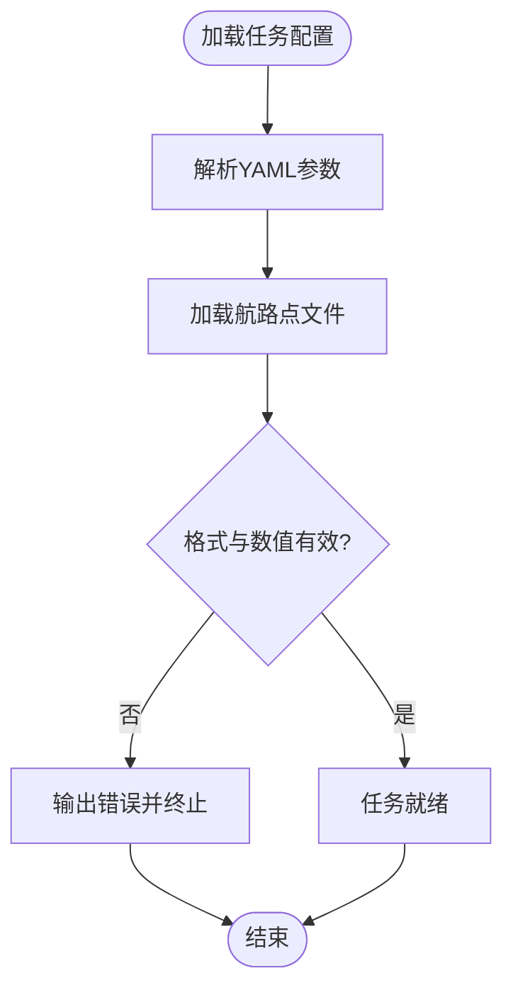
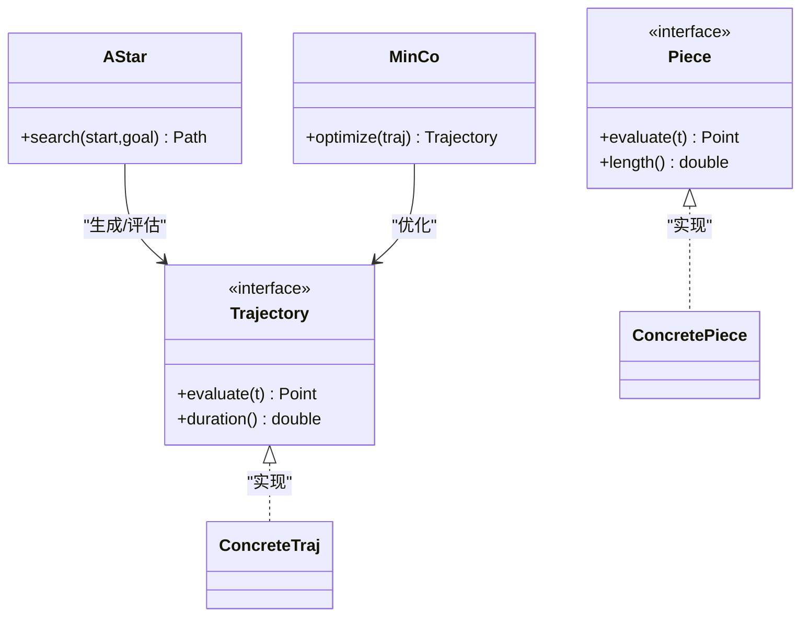
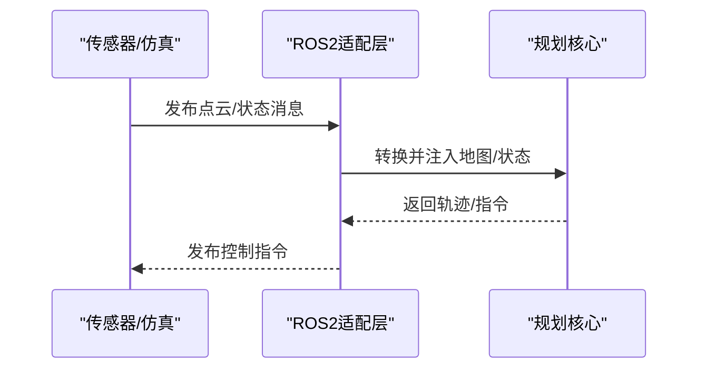
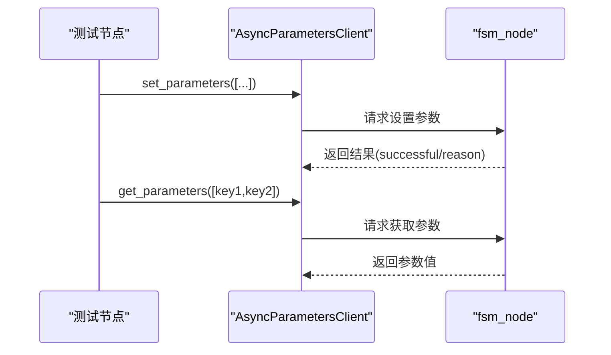
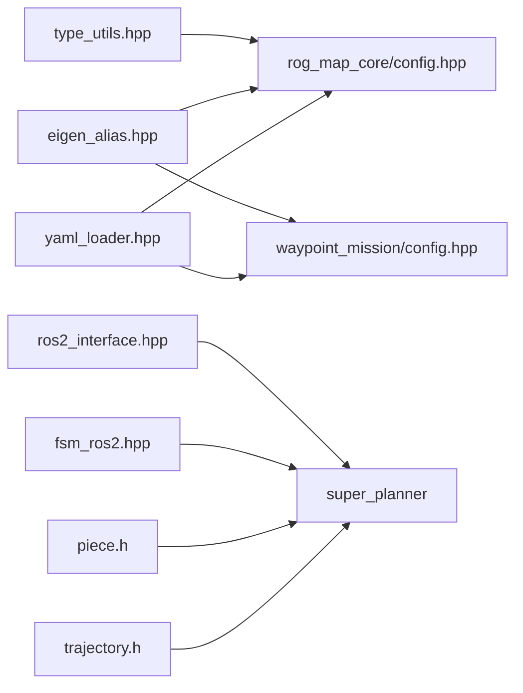

# 扩展机制设计

<cite>
**本文引用的文件**
- [README.md](file://src/SUPER/README.md)
- [rog_map.h](file://src/SUPER/rog_map/include/rog_map/rog_map.h)
- [rog_map_core/config.hpp](file://src/SUPER/rog_map/include/rog_map/rog_map_core/config.hpp)
- [waypoint_mission/config.hpp](file://src/SUPER/mission_planner/include/waypoint_mission/config.hpp)
- [test_dynamic_params.cpp](file://src/SUPER/super_planner/test/test_dynamic_params.cpp)
- [fsm_ros2.hpp](file://src/SUPER/super_planner/include/ros_interface/ros2/fsm_ros2.hpp)
- [ros2_interface.hpp](file://src/SUPER/super_planner/include/ros_interface/ros_interface.hpp)
- [trajectory.h](file://src/SUPER/super_planner/include/data_structure/base/trajectory.h)
- [piece.h](file://src/SUPER/super_planner/include/data_structure/base/piece.h)
- [astar.h](file://src/SUPER/super_planner/include/path_search/astar.h)
- [minco.h](file://src/SUPER/super_planner/include/utils/optimization/minco.h)
- [yaml_loader.hpp](file://src/SUPER/rog_map/include/super_utils/yaml_loader.hpp)
- [eigen_alias.hpp](file://src/SUPER/mission_planner/include/utils/eigen_alias.hpp)
- [type_utils.hpp](file://src/SUPER/rog_map/include/super_utils/type_utils.hpp)
</cite>

## 目录
1. 引言
2. 项目结构
3. 核心组件
4. 架构总览
5. 详细组件分析
6. 依赖关系分析
7. 性能考虑
8. 故障排查指南
9. 结论
10. 附录

## 引言
本设计文档聚焦于SUPER项目的可扩展性与扩展机制，围绕以下目标展开：  
- 解释插件式扩展的实现原理与扩展点定义  
- 说明基于配置文件与参数系统的动态功能扩展方式（新算法模块、新传感器接口、新地图类型）  
- 阐述接口抽象设计理念与模块解耦、替换策略  
- 描述动态参数配置系统的工作原理、运行时更新机制与参数校验规则  
- 提供扩展开发最佳实践与性能/稳定性影响评估及优化建议  

## 项目结构
从仓库结构可见，SUPER由多个子模块组成，形成“多模块协同”的体系：  
- mission_planner：任务规划与航路点管理，支持YAML配置加载与外部航路点文件  
- rog_map：高效以机器人为中心的占用栅格地图，支持多种地图参数与可视化开关  
- super_planner：核心路径搜索与轨迹优化模块，包含状态机、A*搜索、轨迹优化等  
- mars_uav_sim：仿真环境与消息定义，提供传感器/控制器消息与渲染组件  

**图表来源**
- [README.md](file://src/SUPER/README.md#L1-L278)
- [rog_map.h](file://src/SUPER/rog_map/include/rog_map/rog_map.h#L1-L131)
- [waypoint_mission/config.hpp](file://src/SUPER/mission_planner/include/waypoint_mission/config.hpp#L1-L101)
- [fsm_ros2.hpp](file://src/SUPER/super_planner/include/ros_interface/ros2/fsm_ros2.hpp#L1-L200)

**章节来源**
- [README.md](file://src/SUPER/README.md#L1-L278)

## 核心组件
- ROG地图与配置系统：提供地图分辨率、膨胀步长、射线追踪、ESDF、滑窗原点、可视化等参数，并通过YAML加载与参数校验保障初始化正确性  
- 任务规划器：支持航路点加载、触发方式、命令发布话题、超时与发布周期等参数  
- 规划核心：包含状态机、A*搜索、轨迹优化等，提供ROS2接口适配与参数动态更新能力  
- 仿真与消息：提供传感器/控制消息定义与渲染组件，便于扩展新的传感器接口或仿真平台  

**章节来源**
- [rog_map_core/config.hpp](file://src/SUPER/rog_map/include/rog_map/rog_map_core/config.hpp#L50-L288)
- [waypoint_mission/config.hpp](file://src/SUPER/mission_planner/include/waypoint_mission/config.hpp#L31-L98)
- [test_dynamic_params.cpp](file://src/SUPER/super_planner/test/test_dynamic_params.cpp#L10-L107)

## 架构总览
SUPER采用“配置驱动 + 参数动态更新 + 接口抽象”的扩展架构：  
- 配置驱动：各模块通过YAML加载参数，集中定义地图、任务、规划等行为  
- 参数动态更新：在运行时通过ROS2参数服务更新关键参数，无需重启节点  
- 接口抽象：通过基类/接口定义统一数据结构与调用契约，便于替换与扩展  

**图表来源**
- [rog_map_core/config.hpp](file://src/SUPER/rog_map/include/rog_map/rog_map_core/config.hpp#L68-L288)
- [waypoint_mission/config.hpp](file://src/SUPER/mission_planner/include/waypoint_mission/config.hpp#L82-L98)
- [test_dynamic_params.cpp](file://src/SUPER/super_planner/test/test_dynamic_params.cpp#L15-L52)
- [trajectory.h](file://src/SUPER/super_planner/include/data_structure/base/trajectory.h#L1-L200)
- [piece.h](file://src/SUPER/super_planner/include/data_structure/base/piece.h#L1-L200)

## 详细组件分析

### 地图扩展机制（新增地图类型）
- 扩展点定义：ROGMap继承自ProbMap，提供地图初始化、线段可视性检查、坐标变换、更新与机器人状态维护等接口；Config负责从YAML加载并校验参数  
- 新地图类型集成方式：  
  - 定义新地图类，遵循现有接口约定（如初始化、更新、查询接口），并在Config中新增对应参数键  
  - 在启动流程中按需选择地图类型，通过YAML切换启用/禁用（如ESDF开关、可视化范围、射线追踪参数）  
  - 可选：新增ROS回调与动态重配置支持，以便运行时调整参数  
- 参数验证规则：  
  - 维度校验（如可视化范围、地图尺寸、更新盒尺寸必须为3维向量）  
  - 数值范围校验（如分辨率与膨胀分辨率关系、批更新大小、阈值等）  
  - 互斥条件校验（如地图原点模式只能二选一）  
- 性能与稳定性：  
  - 合理设置地图尺寸与分辨率，避免过大的内存占用  
  - 使用局部更新盒减少计算开销  
  - ESDF与未知膨胀需按需开启，避免不必要的额外计算  

**图表来源**
- [rog_map.h](file://src/SUPER/rog_map/include/rog_map/rog_map.h#L39-L129)
- [rog_map_core/config.hpp](file://src/SUPER/rog_map/include/rog_map/rog_map_core/config.hpp#L50-L288)

**章节来源**
- [rog_map.h](file://src/SUPER/rog_map/include/rog_map/rog_map.h#L39-L129)
- [rog_map_core/config.hpp](file://src/SUPER/rog_map/include/rog_map/rog_map_core/config.hpp#L68-L288)

### 任务规划扩展（新增航路点/触发方式）
- 扩展点定义：MissionConfig负责加载航路点文件与任务参数，支持外部文本文件导入与参数解析  
- 新任务类型集成方式：  
  - 在MissionConfig中增加新参数键，或扩展LoadWaypoint逻辑以支持新格式  
  - 在launch文件中指定配置文件路径与话题名称  
- 参数验证规则：  
  - 航路点文件格式校验（行分隔、数值个数）  
  - 关键参数默认值与超时设置  
- 性能与稳定性：  
  - 控制航路点数量与发布周期，避免高频发布导致系统负载过高  

**图表来源**
- [waypoint_mission/config.hpp](file://src/SUPER/mission_planner/include/waypoint_mission/config.hpp#L54-L78)

**章节来源**
- [waypoint_mission/config.hpp](file://src/SUPER/mission_planner/include/waypoint_mission/config.hpp#L31-L98)

### 规划算法扩展（新增搜索/优化模块）
- 扩展点定义：  
  - 数据结构接口：trajectory.h、piece.h定义轨迹与片段的通用接口  
  - 搜索接口：astar.h提供A*搜索框架  
  - 优化接口：minco.h等提供多项式/连续优化接口  
  - ROS2接口：fsm_ros2.hpp、ros2_interface.hpp提供ROS2适配层  
- 新算法模块集成方式：  
  - 实现统一的数据结构接口，确保与轨迹优化/搜索模块兼容  
  - 在状态机/搜索模块中注册新算法，通过配置选择启用  
  - 通过动态参数调整算法权重、边界条件等  
- 参数验证规则：  
  - 边界参数（速度/加速度）与优化参数（penalty系数）需满足物理可行性  
  - 搜索启发函数类型与轨迹类型需匹配  
- 性能与稳定性：  
  - 合理设置搜索半径/启发权重，避免过度探索  
  - 优化器收敛阈值与迭代次数需平衡精度与实时性  

**图表来源**
- [trajectory.h](file://src/SUPER/super_planner/include/data_structure/base/trajectory.h#L1-L200)
- [piece.h](file://src/SUPER/super_planner/include/data_structure/base/piece.h#L1-L200)
- [astar.h](file://src/SUPER/super_planner/include/path_search/astar.h#L1-L200)
- [minco.h](file://src/SUPER/super_planner/include/utils/optimization/minco.h#L1-L200)

**章节来源**
- [trajectory.h](file://src/SUPER/super_planner/include/data_structure/base/trajectory.h#L1-L200)
- [piece.h](file://src/SUPER/super_planner/include/data_structure/base/piece.h#L1-L200)
- [astar.h](file://src/SUPER/super_planner/include/path_search/astar.h#L1-L200)
- [minco.h](file://src/SUPER/super_planner/include/utils/optimization/minco.h#L1-L200)

### 传感器接口扩展（新增传感器/仿真）
- 扩展点定义：  
  - 仿真消息定义：px4ctrl_msgs、mars_quadrotor_msgs等提供控制/状态消息  
  - 渲染组件：marsim_render提供GLSL着色器与渲染配置  
  - 仿真节点：perfect_drone_sim提供ROS2节点与launch配置  
- 新传感器/仿真接入方式：  
  - 定义消息类型与服务接口，遵循ROS2消息规范  
  - 在仿真节点中订阅/发布对应话题，或通过适配层对接现有接口  
  - 在launch文件中配置话题映射与参数覆盖  
- 参数验证规则：  
  - 话题名称与超时需一致，避免通信异常  
  - 渲染参数（帧率、范围）需与实际硬件能力匹配  
- 性能与稳定性：  
  - 控制消息频率与轨迹优化周期协调，避免抢占资源  
  - 渲染线程与主循环分离，避免阻塞规划线程  

**图表来源**
- [fsm_ros2.hpp](file://src/SUPER/super_planner/include/ros_interface/ros2/fsm_ros2.hpp#L1-L200)
- [ros2_interface.hpp](file://src/SUPER/super_planner/include/ros_interface/ros_interface.hpp#L1-L200)

**章节来源**
- [fsm_ros2.hpp](file://src/SUPER/super_planner/include/ros_interface/ros2/fsm_ros2.hpp#L1-L200)
- [ros2_interface.hpp](file://src/SUPER/super_planner/include/ros_interface/ros_interface.hpp#L1-L200)

### 动态参数配置系统
- 工作原理：  
  - 通过ROS2参数服务在运行时设置/获取参数，测试脚本展示了对轨迹优化边界参数的动态更新  
  - 参数命名空间遵循层级化命名（如traj_opt.boundary.*），便于模块化管理  
- 运行时更新机制：  
  - 使用AsyncParametersClient连接目标节点（如fsm_node），周期性发起参数更新请求  
  - 支持批量设置与批量获取，便于联动调整  
- 参数验证规则：  
  - 建议在节点内部对关键参数进行范围/类型校验，失败时返回reason并拒绝更新  
  - 对于敏感参数（如边界速度/加速度），应限制更新频率与幅度，防止系统不稳定  
- 性能与稳定性：  
  - 参数更新应异步处理，避免阻塞主循环  
  - 对高频参数更新采用去抖动策略，合并相邻更新请求  

**图表来源**
- [test_dynamic_params.cpp](file://src/SUPER/super_planner/test/test_dynamic_params.cpp#L15-L96)

**章节来源**
- [test_dynamic_params.cpp](file://src/SUPER/super_planner/test/test_dynamic_params.cpp#L10-L107)

## 依赖关系分析
- 配置依赖：ROGMap.Config与MissionConfig均依赖YAML加载器，确保参数一致性  
- 类型依赖：Eigen别名与类型工具在地图与任务模块广泛使用，保证数学运算与类型安全  
- 接口依赖：轨迹/片段接口被搜索与优化模块共同依赖，形成稳定的抽象层  
- ROS2依赖：FSM与ROS2接口耦合，参数服务与话题发布/订阅贯穿系统  

**图表来源**
- [yaml_loader.hpp](file://src/SUPER/rog_map/include/super_utils/yaml_loader.hpp#L1-L200)
- [eigen_alias.hpp](file://src/SUPER/mission_planner/include/utils/eigen_alias.hpp#L1-L200)
- [type_utils.hpp](file://src/SUPER/rog_map/include/super_utils/type_utils.hpp#L1-L200)
- [trajectory.h](file://src/SUPER/super_planner/include/data_structure/base/trajectory.h#L1-L200)
- [piece.h](file://src/SUPER/super_planner/include/data_structure/base/piece.h#L1-L200)
- [fsm_ros2.hpp](file://src/SUPER/super_planner/include/ros_interface/ros2/fsm_ros2.hpp#L1-L200)
- [ros2_interface.hpp](file://src/SUPER/super_planner/include/ros_interface/ros_interface.hpp#L1-L200)

**章节来源**
- [yaml_loader.hpp](file://src/SUPER/rog_map/include/super_utils/yaml_loader.hpp#L1-L200)
- [eigen_alias.hpp](file://src/SUPER/mission_planner/include/utils/eigen_alias.hpp#L1-L200)
- [type_utils.hpp](file://src/SUPER/rog_map/include/super_utils/type_utils.hpp#L1-L200)
- [trajectory.h](file://src/SUPER/super_planner/include/data_structure/base/trajectory.h#L1-L200)
- [piece.h](file://src/SUPER/super_planner/include/data_structure/base/piece.h#L1-L200)
- [fsm_ros2.hpp](file://src/SUPER/super_planner/include/ros_interface/ros2/fsm_ros2.hpp#L1-L200)
- [ros2_interface.hpp](file://src/SUPER/super_planner/include/ros_interface/ros_interface.hpp#L1-L200)

## 性能考虑
- 地图与ESDF：合理设置分辨率与膨胀步长，避免过大内存占用；按需启用ESDF与未知膨胀  
- 局部更新：使用局部更新盒减少射线追踪与概率更新的计算范围  
- 参数更新：对高频参数采用节流与合并策略，避免频繁唤醒规划器  
- 优化器：根据实时性要求调整收敛阈值与迭代上限，必要时采用降采样策略  
- 通信：控制消息与轨迹发布频率需与仿真/硬件能力匹配，避免拥塞  

## 故障排查指南
- 参数校验失败：检查YAML参数维度与取值范围，确认互斥条件未被违反  
- 通信异常：核对话题名称、frame_id与超时设置，确保与仿真/硬件一致  
- 动态参数不生效：确认目标节点已启动并暴露参数服务，检查命名空间与键名拼写  
- 性能退化：降低地图分辨率或关闭非必要功能（如ESDF/可视化），检查参数更新频率  

**章节来源**
- [rog_map_core/config.hpp](file://src/SUPER/rog_map/include/rog_map/rog_map_core/config.hpp#L82-L140)
- [waypoint_mission/config.hpp](file://src/SUPER/mission_planner/include/waypoint_mission/config.hpp#L82-L98)
- [test_dynamic_params.cpp](file://src/SUPER/super_planner/test/test_dynamic_params.cpp#L15-L25)

## 结论
SUPER通过“配置驱动 + 参数动态更新 + 接口抽象”构建了清晰的扩展机制：  
- 地图、任务、规划与仿真模块均可通过YAML参数与ROS2动态参数进行扩展与替换  
- 统一的数据结构与接口抽象降低了模块间耦合，提升了可维护性与可移植性  
- 在追求高性能的同时，通过参数校验与运行时节流保障系统稳定性  

## 附录
- 最佳实践清单：  
  - 新模块开发前先定义接口契约与参数键空间  
  - 在Config中提供默认值与校验逻辑，避免运行期崩溃  
  - 优先采用异步参数更新与批量操作，减少主线程阻塞  
  - 为新传感器/仿真提供独立launch与RViz配置文件，便于快速集成与验证  
  - 对关键参数建立回归测试，确保参数更新不会引入不可逆问题