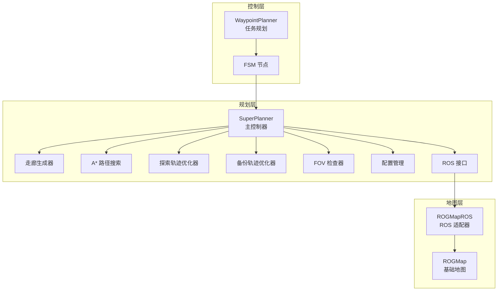
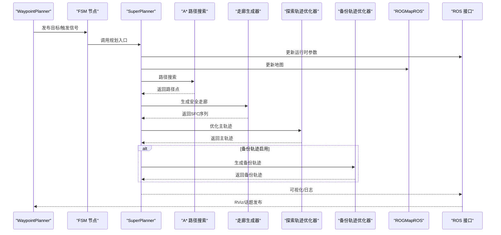
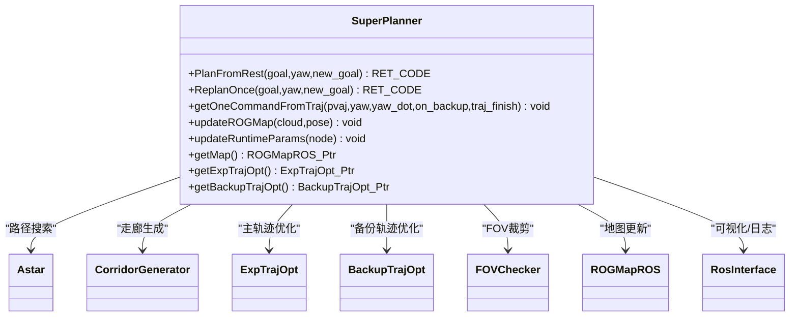
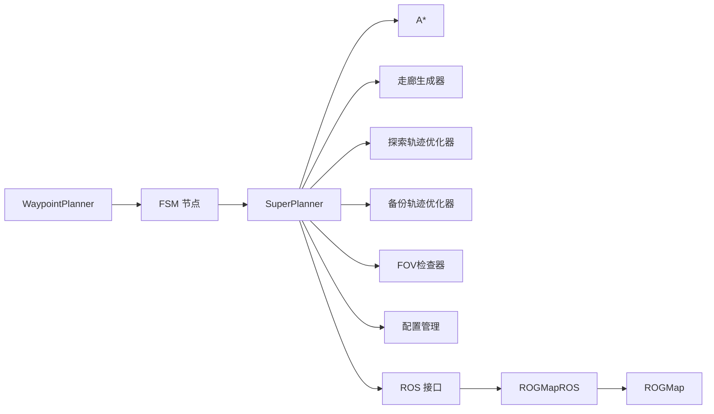

# 整体架构概览

<cite>
**本文档引用的文件**
- [super_planner.h](file://src/SUPER/super_planner/include/super_core/super_planner.h)
- [fsm.h](file://src/SUPER/super_planner/include/fsm/fsm.h)
- [astar.h](file://src/SUPER/super_planner/include/path_search/astar.h)
- [exp_traj_optimizer_s4.h](file://src/SUPER/super_planner/include/traj_opt/exp_traj_optimizer_s4.h)
- [backup_traj_optimizer_s4.h](file://src/SUPER/super_planner/include/traj_opt/backup_traj_optimizer_s4.h)
- [corridor_generator.h](file://src/SUPER/super_planner/include/super_core/corridor_generator.h)
- [fov_checker.h](file://src/SUPER/super_planner/include/super_core/fov_checker.h)
- [trajectory.h](file://src/SUPER/super_planner/include/data_structure/base/trajectory.h)
- [ros_interface.hpp](file://src/SUPER/super_planner/include/ros_interface/ros_interface.hpp)
- [config.hpp](file://src/SUPER/super_planner/include/super_core/config.hpp)
- [rog_map.h](file://src/SUPER/rog_map/include/rog_map/rog_map.h)
- [rog_map_ros2.hpp](file://src/SUPER/rog_map/include/rog_map_ros/rog_map_ros2.hpp)
- [ros2_waypoint_planner.hpp](file://src/SUPER/mission_planner/include/waypoint_mission/ros2_waypoint_planner.hpp)
- [fsm_node_ros2.cpp](file://src/SUPER/super_planner/Apps/fsm_node_ros2.cpp)
- [QUICKSTART.md](file://src/SUPER/super_planner/docs/QUICKSTART.md)
- [click.yaml](file://src/SUPER/super_planner/config/click.yaml)
- [waypoint.yaml](file://src/SUPER/mission_planner/config/waypoint.yaml)
</cite>

## 目录
1. [简介](#简介)
2. [项目结构](#项目结构)
3. [核心组件](#核心组件)
4. [架构总览](#架构总览)
5. [详细组件分析](#详细组件分析)
6. [依赖关系分析](#依赖关系分析)
7. [性能考量](#性能考量)
8. [故障排查指南](#故障排查指南)
9. [结论](#结论)
10. [附录](#附录)

## 简介
本文件面向SUPER项目的整体架构，聚焦“规划层-地图层-控制层”的分层设计，阐明SuperPlanner作为主控制器在整个系统中的核心地位与作用，梳理模块化设计理念、职责边界与接口契约，并给出从输入参数到输出轨迹命令的完整数据与控制流程。同时，结合配置与运行机制，分析实时性、安全性与性能优化方面的技术决策与权衡。

## 项目结构
SUPER采用模块化分层架构：
- 规划层：SuperPlanner为核心控制器，协调路径搜索、走廊生成、轨迹优化与备份策略；提供ROS接口以与系统其他模块交互。
- 地图层：ROG-Map负责点云地图的构建、维护与查询，支持膨胀、ESDF等扩展；提供ROS适配器以订阅传感器数据。
- 控制层：通过WaypointPlanner等任务规划模块提供目标下发与可视化；FSM节点驱动状态机与规划循环。

图表来源
- [super_planner.h](file://src/SUPER/super_planner/include/super_core/super_planner.h#L59-L296)
- [fsm.h](file://src/SUPER/super_planner/include/fsm/fsm.h#L40-L170)
- [astar.h](file://src/SUPER/super_planner/include/path_search/astar.h#L79-L163)
- [corridor_generator.h](file://src/SUPER/super_planner/include/super_core/corridor_generator.h#L56-L193)
- [exp_traj_optimizer_s4.h](file://src/SUPER/super_planner/include/traj_opt/exp_traj_optimizer_s4.h#L55-L368)
- [backup_traj_optimizer_s4.h](file://src/SUPER/super_planner/include/traj_opt/backup_traj_optimizer_s4.h#L52-L210)
- [fov_checker.h](file://src/SUPER/super_planner/include/super_core/fov_checker.h#L41-L287)
- [config.hpp](file://src/SUPER/super_planner/include/super_core/config.hpp#L44-L231)
- [ros_interface.hpp](file://src/SUPER/super_planner/include/ros_interface/ros_interface.hpp#L43-L149)
- [rog_map.h](file://src/SUPER/rog_map/include/rog_map/rog_map.h#L39-L129)
- [rog_map_ros2.hpp](file://src/SUPER/rog_map/include/rog_map_ros/rog_map_ros2.hpp#L41-L380)
- [ros2_waypoint_planner.hpp](file://src/SUPER/mission_planner/include/waypoint_mission/ros2_waypoint_planner.hpp#L24-L409)

章节来源
- [QUICKSTART.md](file://src/SUPER/super_planner/docs/QUICKSTART.md#L54-L68)
- [click.yaml](file://src/SUPER/super_planner/config/click.yaml#L1-L190)

## 核心组件
- SuperPlanner：主控制器，封装规划全流程，管理地图、路径搜索、走廊生成、轨迹优化、备份策略与状态机交互，提供ROS接口与可视化能力。
- A*路径搜索：基于ROG地图的栅格启发式搜索，输出离散路径点序列。
- 走廊生成器：基于CIRI算法在路径上提取安全飞行走廊（凸多面体）。
- 探索轨迹优化器：基于MINCO的轨迹优化，生成平滑主轨迹。
- 备份轨迹优化器：在主轨迹不可行时快速生成应急轨迹。
- FOV检查器：根据感知范围与姿态裁剪多面体，保障安全性。
- ROGMap/ROGMapROS：地图数据结构与ROS订阅/发布适配。
- WaypointPlanner：任务规划与RViz可视化，提供目标下发与轨迹可视化。
- FSM节点：驱动状态机，协调规划与控制循环。

章节来源
- [super_planner.h](file://src/SUPER/super_planner/include/super_core/super_planner.h#L59-L296)
- [astar.h](file://src/SUPER/super_planner/include/path_search/astar.h#L79-L163)
- [corridor_generator.h](file://src/SUPER/super_planner/include/super_core/corridor_generator.h#L56-L193)
- [exp_traj_optimizer_s4.h](file://src/SUPER/super_planner/include/traj_opt/exp_traj_optimizer_s4.h#L55-L368)
- [backup_traj_optimizer_s4.h](file://src/SUPER/super_planner/include/traj_opt/backup_traj_optimizer_s4.h#L52-L210)
- [fov_checker.h](file://src/SUPER/super_planner/include/super_core/fov_checker.h#L41-L287)
- [rog_map.h](file://src/SUPER/rog_map/include/rog_map/rog_map.h#L39-L129)
- [rog_map_ros2.hpp](file://src/SUPER/rog_map/include/rog_map_ros/rog_map_ros2.hpp#L41-L380)
- [ros2_waypoint_planner.hpp](file://src/SUPER/mission_planner/include/waypoint_mission/ros2_waypoint_planner.hpp#L24-L409)
- [fsm_node_ros2.cpp](file://src/SUPER/super_planner/Apps/fsm_node_ros2.cpp#L48-L101)

## 架构总览
SUPER采用“主控制器-模块化子系统”架构：
- SuperPlanner作为主控制器，统一调度路径搜索、走廊生成、轨迹优化与备份策略，负责状态机推进与ROS接口。
- 地图层独立于规划层，通过ROGMapROS订阅传感器数据并维护地图，提供查询接口供规划层使用。
- 控制层通过WaypointPlanner与FSM节点实现目标下发与状态机驱动，形成闭环。

图表来源
- [fsm.h](file://src/SUPER/super_planner/include/fsm/fsm.h#L104-L121)
- [super_planner.h](file://src/SUPER/super_planner/include/super_core/super_planner.h#L139-L146)
- [astar.h](file://src/SUPER/super_planner/include/path_search/astar.h#L151-L155)
- [corridor_generator.h](file://src/SUPER/super_planner/include/super_core/corridor_generator.h#L129-L131)
- [exp_traj_optimizer_s4.h](file://src/SUPER/super_planner/include/traj_opt/exp_traj_optimizer_s4.h#L342-L349)
- [backup_traj_optimizer_s4.h](file://src/SUPER/super_planner/include/traj_opt/backup_traj_optimizer_s4.h#L183-L192)
- [ros_interface.hpp](file://src/SUPER/super_planner/include/ros_interface/ros_interface.hpp#L98-L124)
- [rog_map_ros2.hpp](file://src/SUPER/rog_map/include/rog_map_ros/rog_map_ros2.hpp#L99-L151)

## 详细组件分析

### SuperPlanner：主控制器
- 职责边界
  - 统一规划入口：PlanFromRest/ReplanOnce，协调路径搜索、走廊生成、轨迹优化与备份策略。
  - 状态管理：维护目标状态、轨迹状态与重规划日志。
  - 参数同步：从ROS参数服务器动态更新配置并同步至优化器。
  - 可视化与日志：通过ROS接口发布轨迹、走廊、路径等可视化数据。
- 关键接口
  - getOneCommandFromTraj：按采样周期输出位置/速度/加速度/偏航等命令。
  - updateROGMap：接收点云与位姿更新地图。
  - updateRuntimeParams：动态参数热更新。
- 与模块关系
  - 依赖A*、走廊生成器、轨迹优化器、备份优化器、FOV检查器、ROGMapROS与ROS接口。

图表来源
- [super_planner.h](file://src/SUPER/super_planner/include/super_core/super_planner.h#L59-L296)
- [astar.h](file://src/SUPER/super_planner/include/path_search/astar.h#L79-L163)
- [corridor_generator.h](file://src/SUPER/super_planner/include/super_core/corridor_generator.h#L56-L193)
- [exp_traj_optimizer_s4.h](file://src/SUPER/super_planner/include/traj_opt/exp_traj_optimizer_s4.h#L55-L368)
- [backup_traj_optimizer_s4.h](file://src/SUPER/super_planner/include/traj_opt/backup_traj_optimizer_s4.h#L52-L210)
- [fov_checker.h](file://src/SUPER/super_planner/include/super_core/fov_checker.h#L41-L287)
- [rog_map_ros2.hpp](file://src/SUPER/rog_map/include/rog_map_ros/rog_map_ros2.hpp#L41-L380)
- [ros_interface.hpp](file://src/SUPER/super_planner/include/ros_interface/ros_interface.hpp#L43-L149)

章节来源
- [super_planner.h](file://src/SUPER/super_planner/include/super_core/super_planner.h#L104-L296)

### A*路径搜索
- 职责：在栅格地图上进行启发式搜索，返回离散路径点序列。
- 关键点：支持多种启发式类型、对角/曼哈顿/欧氏距离；可选可视化与邻居策略。
- 与SuperPlanner协作：提供路径输入给走廊生成器。

章节来源
- [astar.h](file://src/SUPER/super_planner/include/path_search/astar.h#L79-L163)

### 走廊生成器（CIRI）
- 职责：沿路径提取安全飞行走廊（凸多面体），支持种子线、包围盒搜索与IRIS迭代。
- 关键点：支持虚拟地面/天花板、机器人半径、重叠阈值等参数；提供平均计算时间统计。
- 与SuperPlanner协作：输出SFC序列给轨迹优化器。

章节来源
- [corridor_generator.h](file://src/SUPER/super_planner/include/super_core/corridor_generator.h#L56-L193)

### 轨迹优化器（探索/备份）
- 探索轨迹优化器（ExpTrajOpt）
  - 基于MINCO的轨迹优化，支持多种位置约束类型、积分分辨率、平滑参数与惩罚项。
  - 提供默认初始化与引导轨迹初始化两种策略。
- 备份轨迹优化器（BackupTrajOpt）
  - 面向应急场景的快速优化，支持统一时间分配、分段数量与能量代价控制。
- 与SuperPlanner协作：输出主/备份轨迹给控制器。

章节来源
- [exp_traj_optimizer_s4.h](file://src/SUPER/super_planner/include/traj_opt/exp_traj_optimizer_s4.h#L55-L368)
- [backup_traj_optimizer_s4.h](file://src/SUPER/super_planner/include/traj_opt/backup_traj_optimizer_s4.h#L52-L210)

### FOV检查器
- 职责：根据感知范围与姿态裁剪多面体，支持锥形/全向视场模型。
- 与SuperPlanner协作：在走廊生成阶段进行FOV裁剪，提升安全性。

章节来源
- [fov_checker.h](file://src/SUPER/super_planner/include/super_core/fov_checker.h#L41-L287)

### 地图层（ROGMap/ROGMapROS）
- ROGMap：提供概率占用栅格、ESDF、前沿提取等能力，支持线段可视性检查与最近障碍查询。
- ROGMapROS：订阅点云与里程计，维护地图并提供可视化与服务接口。
- 与SuperPlanner协作：提供地图更新与查询接口。

章节来源
- [rog_map.h](file://src/SUPER/rog_map/include/rog_map/rog_map.h#L39-L129)
- [rog_map_ros2.hpp](file://src/SUPER/rog_map/include/rog_map_ros/rog_map_ros2.hpp#L41-L380)

### 控制层（WaypointPlanner/FSM）
- WaypointPlanner：基于RViz点击或RC遥控触发，发布目标点并可视化路径。
- FSM节点：驱动状态机，协调规划与控制循环，提供参数配置与运行入口。

章节来源
- [ros2_waypoint_planner.hpp](file://src/SUPER/mission_planner/include/waypoint_mission/ros2_waypoint_planner.hpp#L24-L409)
- [fsm_node_ros2.cpp](file://src/SUPER/super_planner/Apps/fsm_node_ros2.cpp#L48-L101)

## 依赖关系分析
- SuperPlanner依赖路径搜索、走廊生成、轨迹优化、备份优化、FOV检查、地图与ROS接口。
- 地图层通过ROGMapROS与ROS话题解耦，支持外部传感器数据接入。
- 控制层通过WaypointPlanner与FSM节点与规划层解耦，形成清晰的输入/输出边界。

图表来源
- [super_planner.h](file://src/SUPER/super_planner/include/super_core/super_planner.h#L59-L296)
- [fsm.h](file://src/SUPER/super_planner/include/fsm/fsm.h#L40-L170)
- [rog_map_ros2.hpp](file://src/SUPER/rog_map/include/rog_map_ros/rog_map_ros2.hpp#L41-L380)
- [ros_interface.hpp](file://src/SUPER/super_planner/include/ros_interface/ros_interface.hpp#L43-L149)

## 性能考量
- 实时性
  - 配置层面：规划时域、前瞻距离、采样步长、重规划频率等参数直接影响实时性。
  - 优化层面：轨迹优化精度与积分分辨率、A*搜索时间限制、走廊生成迭代次数。
- 安全性
  - 机器人半径、障碍物膨胀步数、感知范围与FOV裁剪共同决定安全边界。
  - 备份轨迹启用可提高鲁棒性，降低碰撞风险。
- 性能优化
  - 参数热更新：运行时动态调整边界与惩罚项，平衡性能与安全。
  - 日志与可视化：按需开启，避免影响实时性。
  - 地图分辨率与局部更新：在精度与效率间折衷。

章节来源
- [config.hpp](file://src/SUPER/super_planner/include/super_core/config.hpp#L158-L228)
- [click.yaml](file://src/SUPER/super_planner/config/click.yaml#L15-L190)
- [QUICKSTART.md](file://src/SUPER/super_planner/docs/QUICKSTART.md#L365-L376)

## 故障排查指南
- 常见问题
  - 无路径可达：检查地图与目标位置，确认路径搜索返回码。
  - 轨迹优化失败：适当放宽边界或提高优化精度。
  - 走廊生成失败：检查地图分辨率与种子线参数。
  - 规划过慢：降低分辨率或减少优化精度。
- 调试手段
  - 启用日志与可视化，观察轨迹、走廊与路径。
  - 使用rqt_reconfigure在线调整参数。
  - 录制bag回放分析轨迹质量。

章节来源
- [QUICKSTART.md](file://src/SUPER/super_planner/docs/QUICKSTART.md#L190-L304)

## 结论
SUPER通过SuperPlanner实现规划层主控，结合A*、走廊生成、轨迹优化与备份策略，形成高安全性与高实时性的轨迹规划框架。地图层与控制层通过明确的接口与ROS适配实现解耦，既支持仿真测试也便于真实部署。配置与参数热更新机制进一步增强了系统的可调性与适应性。

## 附录
- 配置文件要点
  - 超级规划器：备份轨迹开关、FOV裁剪、规划时域、采样步长、偏航模式等。
  - 轨迹优化：边界约束、惩罚项、优化精度、平滑参数等。
  - A*：启发式类型、可视化开关、搜索范围等。
  - ROG地图：分辨率、膨胀步数、ESDF开关、ROS回调等。
- 任务规划配置
  - WaypointPlanner：目标发布话题、里程计话题、触发方式与切换阈值等。

章节来源
- [click.yaml](file://src/SUPER/super_planner/config/click.yaml#L1-L190)
- [waypoint.yaml](file://src/SUPER/mission_planner/config/waypoint.yaml#L1-L19)