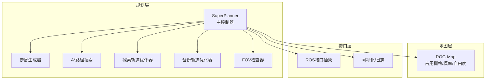
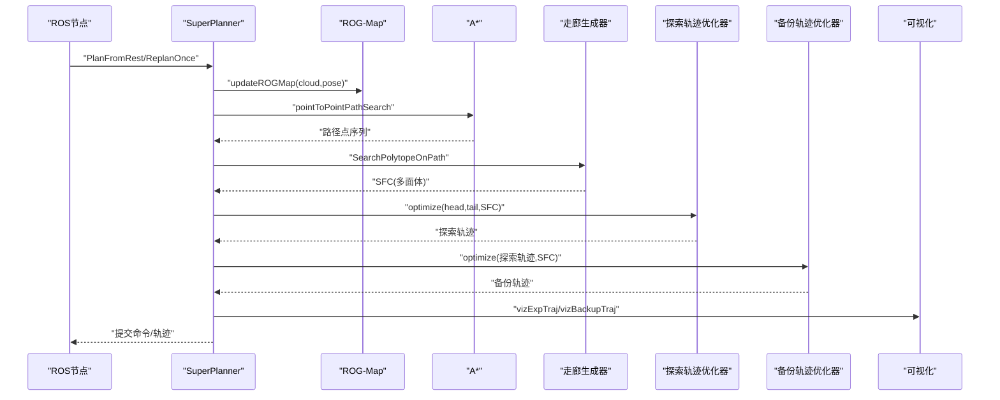
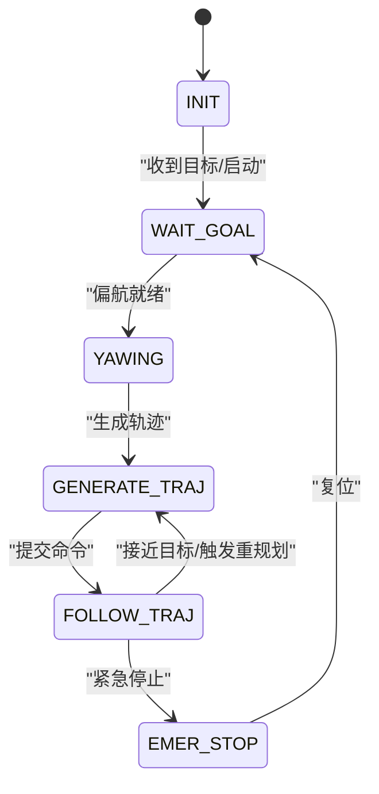
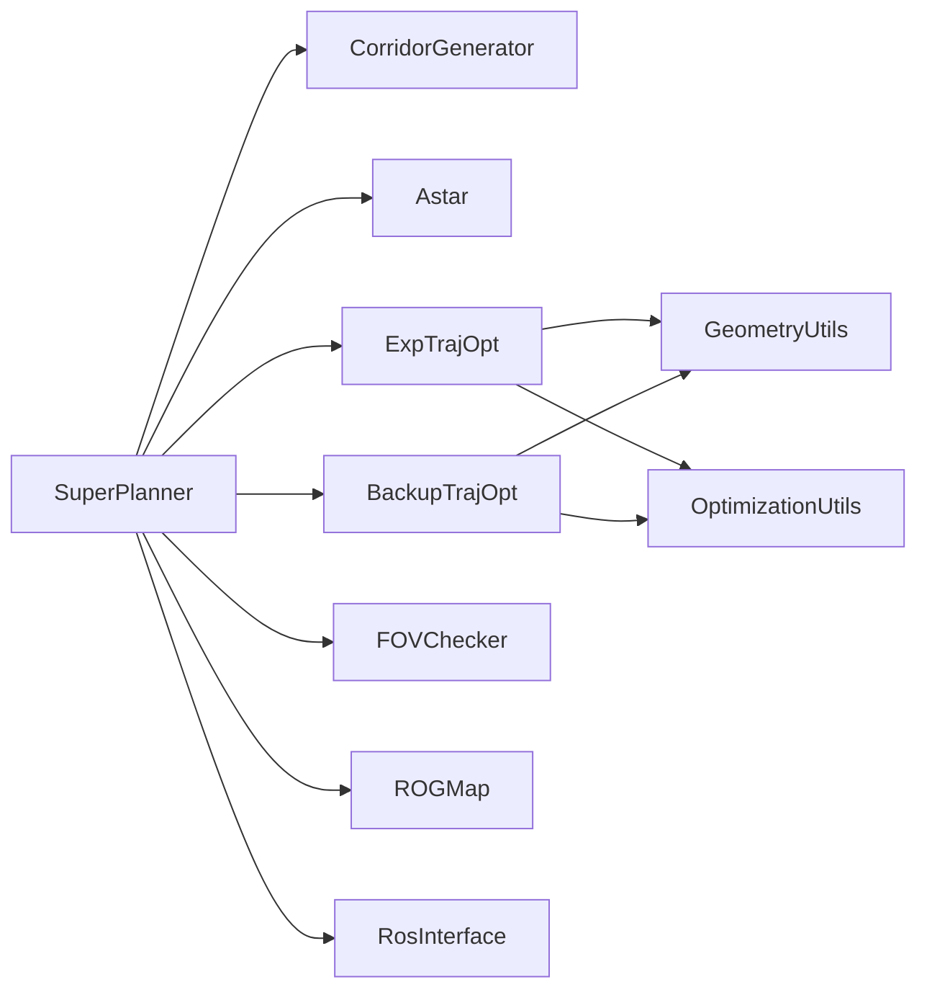

# 核心架构设计

<cite>
**本文档引用的文件**
- [README.md](file://src/SUPER/README.md)
- [README_zh.md](file://src/SUPER/README_zh.md)
- [super_planner.h](file://src/SUPER/super_planner/include/super_core/super_planner.h)
- [fsm.h](file://src/SUPER/super_planner/include/fsm/fsm.h)
- [ros_interface.hpp](file://src/SUPER/super_planner/include/ros_interface/ros_interface.hpp)
- [config.hpp](file://src/SUPER/super_planner/include/super_core/config.hpp)
- [trajectory.h](file://src/SUPER/super_planner/include/data_structure/base/trajectory.h)
- [exp_traj_optimizer_s4.h](file://src/SUPER/super_planner/include/traj_opt/exp_traj_optimizer_s4.h)
- [astar.h](file://src/SUPER/super_planner/include/path_search/astar.h)
- [rog_map.h](file://src/SUPER/rog_map/include/rog_map/rog_map.h)
- [corridor_generator.h](file://src/SUPER/super_planner/include/super_core/corridor_generator.h)
- [fov_checker.h](file://src/SUPER/super_planner/include/super_core/fov_checker.h)
- [config.hpp](file://src/SUPER/super_planner/include/traj_opt/config.hpp)
- [optimization_utils.h](file://src/SUPER/super_planner/include/utils/optimization/optimization_utils.h)
- [geometry_utils.h](file://src/SUPER/super_planner/include/utils/geometry/geometry_utils.h)
- [log_utils.hpp](file://src/SUPER/super_planner/include/super_core/log_utils.hpp)
- [CMakeLists.txt](file://src/SUPER/super_planner/CMakeLists.txt)
</cite>

## 目录
1. [引言](#引言)
2. [项目结构](#项目结构)
3. [核心组件](#核心组件)
4. [架构总览](#架构总览)
5. [详细组件分析](#详细组件分析)
6. [依赖关系分析](#依赖关系分析)
7. [性能考量](#性能考量)
8. [故障排查指南](#故障排查指南)
9. [结论](#结论)
10. [附录](#附录)

## 引言
本文件面向SUPER项目的架构设计，聚焦于高层模块化设计、组件交互与数据流、SuperPlanner主控制器的状态机与协调机制、分层架构（规划层/地图层/控制层）、关键设计模式（工厂、策略、观察者等）、可扩展性（插件与接口抽象）、系统边界与组件关系、技术决策权衡（性能/安全/实时/精度）以及基础设施与部署拓扑。文档旨在帮助开发者与使用者快速理解系统设计与实现要点。

## 项目结构
SUPER项目采用模块化分层组织，核心位于super_planner包，配套地图模块rog_map与ROS接口层。关键模块包括：
- 规划核心：SuperPlanner、A*路径搜索、轨迹优化器（探索/备份）、走廊生成器、FOV检查器
- 地图层：ROG-Map（占用栅格/概率/自由度地图）
- 接口层：ROS接口抽象、可视化与日志
- 配置与工具：参数配置、几何/优化工具库

图表来源
- [super_planner.h](file://src/SUPER/super_planner/include/super_core/super_planner.h#L59-L122)
- [corridor_generator.h](file://src/SUPER/super_planner/include/super_core/corridor_generator.h#L56-L119)
- [astar.h](file://src/SUPER/super_planner/include/path_search/astar.h#L79-L146)
- [exp_traj_optimizer_s4.h](file://src/SUPER/super_planner/include/traj_opt/exp_traj_optimizer_s4.h#L55-L106)
- [rog_map.h](file://src/SUPER/rog_map/include/rog_map/rog_map.h#L39-L56)
- [ros_interface.hpp](file://src/SUPER/super_planner/include/ros_interface/ros_interface.hpp#L43-L149)

章节来源
- [CMakeLists.txt](file://src/SUPER/super_planner/CMakeLists.txt#L1-L188)

## 核心组件
- SuperPlanner：主控制器，聚合地图、路径搜索、轨迹优化、走廊生成、FOV检查、ROS接口与日志，提供规划/重规划入口与参数动态更新能力。
- A*路径搜索：基于ROG-Map的栅格搜索，支持多种启发与邻域策略，输出离散路径。
- 走廊生成器：结合CIRI算法与多面体枚举，沿路径生成安全飞行走廊（SFC）。
- 轨迹优化器：探索轨迹优化器（ExpTrajOpt）与备份轨迹优化器（BackupTrajOpt），分别面向主/应急场景。
- FOV检查器：基于机器人位姿与引导点，按视场模型裁剪多面体，保障感知可达性。
- ROG-Map：高效占用栅格地图，支持概率/自由度/信息地图融合与更新。
- ROS接口抽象：统一日志、可视化、时间、消息发布等接口，便于替换实现。
- 配置系统：集中管理规划/轨迹优化/地图等参数，支持运行时参数热更新。

章节来源
- [super_planner.h](file://src/SUPER/super_planner/include/super_core/super_planner.h#L59-L296)
- [config.hpp](file://src/SUPER/super_planner/include/super_core/config.hpp#L44-L231)
- [astar.h](file://src/SUPER/super_planner/include/path_search/astar.h#L79-L163)
- [corridor_generator.h](file://src/SUPER/super_planner/include/super_core/corridor_generator.h#L56-L194)
- [exp_traj_optimizer_s4.h](file://src/SUPER/super_planner/include/traj_opt/exp_traj_optimizer_s4.h#L55-L368)
- [fov_checker.h](file://src/SUPER/super_planner/include/super_core/fov_checker.h#L41-L287)
- [rog_map.h](file://src/SUPER/rog_map/include/rog_map/rog_map.h#L39-L129)
- [ros_interface.hpp](file://src/SUPER/super_planner/include/ros_interface/ros_interface.hpp#L43-L149)

## 架构总览
系统采用“主控制器-模块化组件”架构，SuperPlanner作为协调者，通过明确的接口与配置驱动各子模块协作；地图层提供环境表征，规划层负责路径与轨迹生成，接口层屏蔽ROS细节。

```mermaid
classDiagram
class SuperPlanner {
+PlanFromRest(goal,yaw,new_goal) RET_CODE
+ReplanOnce(goal,yaw,new_goal) RET_CODE
+getCommittedPositionTrajectory() Trajectory
+getCommittedYawTrajectory() Trajectory
+updateROGMap(cloud,pose) void
+updateRuntimeParams(node) void
}
class CorridorGenerator {
+SearchPolytopeOnPath(path,sfcs,shifted_start) bool
+GeneratePolytopeFromPoint(pt,poly) bool
+GeneratePolytopeFromLine(line,poly) bool
}
class Astar {
+pointToPointPathSearch(start,end,flag,horizon,out_path,time_out) RET_CODE
+escapePathSearch(start,flag,out_path) RET_CODE
}
class ExpTrajOpt {
+optimize(head,tail,sfcs,out_traj) bool
+optimize(head,tail,guid_path,guid_t,sfcs,out_traj) bool
+getDynamicConfig() SuperTrajConfig&
}
class BackupTrajOpt {
+optimize(ref_traj,ts_min,ts_max,init_ts,sfc,init_t_vec,init_ps,out_traj,out_ts) bool
+getDynamicConfig() SuperTrajConfig&
}
class FOVChecker {
+cutPolyBySensingHorizon(robot_p,guid_p,sensing_horizon,poly) bool
+cutPolyByFov(robot_p,robot_q,guid_p,poly) bool
}
class ROGMap {
+updateMap(cloud,pose) void
+getRobotState() RobotState
}
class RosInterface {
+vizExpTraj(traj,ns) void
+vizBackupTraj(traj) void
+setVisualizationEn(bool) void
+info/warn/error(...) void
}
SuperPlanner --> CorridorGenerator : "生成SFC"
SuperPlanner --> Astar : "路径搜索"
SuperPlanner --> ExpTrajOpt : "探索轨迹优化"
SuperPlanner --> BackupTrajOpt : "备份轨迹优化"
SuperPlanner --> FOVChecker : "感知裁剪"
SuperPlanner --> ROGMap : "地图更新/查询"
SuperPlanner --> RosInterface : "可视化/日志"
```

图表来源
- [super_planner.h](file://src/SUPER/super_planner/include/super_core/super_planner.h#L59-L122)
- [corridor_generator.h](file://src/SUPER/super_planner/include/super_core/corridor_generator.h#L129-L131)
- [astar.h](file://src/SUPER/super_planner/include/path_search/astar.h#L151-L155)
- [exp_traj_optimizer_s4.h](file://src/SUPER/super_planner/include/traj_opt/exp_traj_optimizer_s4.h#L342-L349)
- [fov_checker.h](file://src/SUPER/super_planner/include/super_core/fov_checker.h#L66-L92)
- [rog_map.h](file://src/SUPER/rog_map/include/rog_map/rog_map.h#L112-L114)
- [ros_interface.hpp](file://src/SUPER/super_planner/include/ros_interface/ros_interface.hpp#L98-L135)

## 详细组件分析

### SuperPlanner主控制器
- 设计理念：以“状态机+模块协调”为核心，统一调度地图更新、路径搜索、走廊生成、轨迹优化与可视化，提供对外一致的规划接口。
- 关键职责：
  - 规划入口：PlanFromRest/ReplanOnce，封装重规划流程
  - 模块协调：组合A*、走廊生成、轨迹优化器、FOV检查器
  - 数据通道：Trajectory读取、命令生成、参数动态更新
  - 线程安全：轨迹锁定/解锁、重规划互斥
- 参数动态更新：从ROS参数服务器同步至配置与优化器动态参数，支持在线调参

图表来源
- [super_planner.h](file://src/SUPER/super_planner/include/super_core/super_planner.h#L139-L146)
- [astar.h](file://src/SUPER/super_planner/include/path_search/astar.h#L151-L155)
- [corridor_generator.h](file://src/SUPER/super_planner/include/super_core/corridor_generator.h#L129-L131)
- [exp_traj_optimizer_s4.h](file://src/SUPER/super_planner/include/traj_opt/exp_traj_optimizer_s4.h#L342-L349)

章节来源
- [super_planner.h](file://src/SUPER/super_planner/include/super_core/super_planner.h#L59-L296)

### FSM状态机与模块协调
- 状态机：INIT → WAIT_GOAL → YAWING → GENERATE_TRAJ → FOLLOW_TRAJ → EMER_STOP
- 协调机制：Fsm基类封装状态切换、目标设置、重规划触发与日志记录；派生类负责具体发布与可视化逻辑
- 关键流程：根据当前状态决定是否触发ReplanOnce；在跟随阶段持续重规划；记录模块耗时并写入日志

图表来源
- [fsm.h](file://src/SUPER/super_planner/include/fsm/fsm.h#L75-L90)
- [fsm.h](file://src/SUPER/super_planner/include/fsm/fsm.h#L104-L121)

章节来源
- [fsm.h](file://src/SUPER/super_planner/include/fsm/fsm.h#L40-L171)

### 分层架构与职责划分
- 规划层
  - 路径搜索：A*（栅格/启发/邻域策略）
  - 走廊生成：CIRI+多面体枚举，生成SFC
  - 轨迹优化：探索/备份两套优化器，支持不同约束与代价
  - 偏航优化：YawTrajOpt（独立模块）
- 地图层
  - ROG-Map：概率/自由度/信息地图融合，支持线段连通性判断与最近单元查询
- 控制层
  - 通过命令/轨迹发布至飞控（px4ctrl_msgs/mars_quadrotor_msgs）
  - 偏航模式：朝向速度/朝向目标

章节来源
- [astar.h](file://src/SUPER/super_planner/include/path_search/astar.h#L79-L163)
- [corridor_generator.h](file://src/SUPER/super_planner/include/super_core/corridor_generator.h#L56-L119)
- [exp_traj_optimizer_s4.h](file://src/SUPER/super_planner/include/traj_opt/exp_traj_optimizer_s4.h#L55-L106)
- [rog_map.h](file://src/SUPER/rog_map/include/rog_map/rog_map.h#L39-L129)
- [config.hpp](file://src/SUPER/super_planner/include/super_core/config.hpp#L47-L84)

### 关键设计模式
- 工厂模式：轨迹/优化器/走廊生成器等组件通过配置文件与工厂方法创建，便于替换与扩展
- 策略模式：A*支持多种启发/邻域策略；轨迹优化器支持不同约束类型（路径点/走廊）
- 观察者模式：ROS接口抽象统一日志/可视化回调，便于扩展不同实现

章节来源
- [config.hpp](file://src/SUPER/super_planner/include/super_core/config.hpp#L44-L231)
- [astar.h](file://src/SUPER/super_planner/include/path_search/astar.h#L79-L163)
- [exp_traj_optimizer_s4.h](file://src/SUPER/super_planner/include/traj_opt/exp_traj_optimizer_s4.h#L55-L106)
- [ros_interface.hpp](file://src/SUPER/super_planner/include/ros_interface/ros_interface.hpp#L43-L149)

### 可扩展性设计
- 插件架构：通过RosInterface抽象与配置驱动，可替换可视化/日志实现
- 接口抽象：Trajectory、Polytope、Piece等基础数据结构统一序列化与操作接口
- 参数热更新：Config.updateRuntimeParams支持运行时参数同步，优化器动态参数随配置同步
- 模块解耦：SuperPlanner聚合但弱耦合，便于替换/替换策略

章节来源
- [ros_interface.hpp](file://src/SUPER/super_planner/include/ros_interface/ros_interface.hpp#L43-L149)
- [log_utils.hpp](file://src/SUPER/super_planner/include/super_core/log_utils.hpp#L60-L178)
- [config.hpp](file://src/SUPER/super_planner/include/super_core/config.hpp#L158-L228)

## 依赖关系分析
- 组件耦合
  - SuperPlanner强聚合多个模块，但通过接口隔离，降低直接耦合
  - 轨迹优化器依赖几何/优化工具库，形成清晰的内聚边界
- 外部依赖
  - PCL、Eigen、ROS2生态（rclcpp、sensor_msgs、nav_msgs等）
  - ROG-Map库提供地图核心能力
- 潜在循环依赖
  - 通过头文件前置声明与智能指针避免循环包含

图表来源
- [super_planner.h](file://src/SUPER/super_planner/include/super_core/super_planner.h#L38-L53)
- [exp_traj_optimizer_s4.h](file://src/SUPER/super_planner/include/traj_opt/exp_traj_optimizer_s4.h#L39-L43)
- [optimization_utils.h](file://src/SUPER/super_planner/include/utils/optimization/optimization_utils.h#L30-L119)
- [geometry_utils.h](file://src/SUPER/super_planner/include/utils/geometry/geometry_utils.h#L55-L306)

章节来源
- [CMakeLists.txt](file://src/SUPER/super_planner/CMakeLists.txt#L33-L125)

## 性能考量
- 实时性与精度权衡
  - A*搜索：通过启发函数与邻域策略平衡搜索效率与路径质量
  - 轨迹优化：通过积分分辨率、平滑系数与边界约束在实时性与轨迹平滑度间折中
  - FOV裁剪：仅在必要时进行，避免过度保守导致路径不可行
- 参数热更新
  - 运行时参数同步减少停机时间，提升系统可用性
- 可视化与日志
  - 可选可视化与详细日志，避免在高负载场景下引入额外开销

## 故障排查指南
- 常见问题
  - 点云帧坐标系：确保输入点云在世界坐标系（非体坐标系），否则ROG-Map无法正确融合
  - 参数过多：建议从示例配置入手，逐步调整关键参数（最大速度/加速度/轨迹优化边界）
- 日志与可视化
  - 使用日志系统评估轨迹质量，结合可视化确认走廊/轨迹/多面体
- 紧急停止
  - 状态机支持紧急停止状态，便于人工干预

章节来源
- [README_zh.md](file://src/SUPER/README_zh.md#L210-L212)
- [log_utils.hpp](file://src/SUPER/super_planner/include/super_core/log_utils.hpp#L131-L135)

## 结论
SUPER通过“主控制器+模块化组件”的架构实现了高内聚、低耦合的规划系统。SuperPlanner以状态机与参数驱动为核心，协调地图、路径、走廊与轨迹优化，满足挑战性环境下的高速安全导航需求。系统具备良好的可扩展性与可维护性，适合进一步拓展到更复杂的任务场景。

## 附录
- 基础设施要求
  - Ubuntu + ROS2（Humble）或ROS1（Noetic）
  - 依赖：Eigen、PCL、GLFW/GLEW、Mavros/PCL/ROS工具链
- 部署拓扑
  - 仿真：MARSIM + Perfect Drone Sim + ROG-Map
  - 实机：配合px4ctrl_msgs/mars_quadrotor_msgs与飞控平台
- 可扩展性建议
  - 新增模块遵循RosInterface抽象与配置驱动
  - 优化器/策略可通过配置切换，保持接口稳定

章节来源
- [README.md](file://src/SUPER/README.md#L98-L121)
- [README_zh.md](file://src/SUPER/README_zh.md#L99-L127)