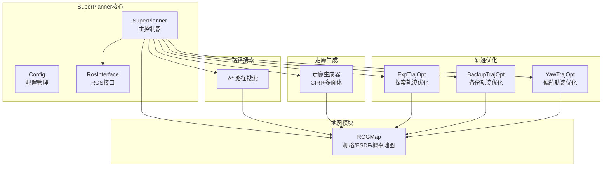
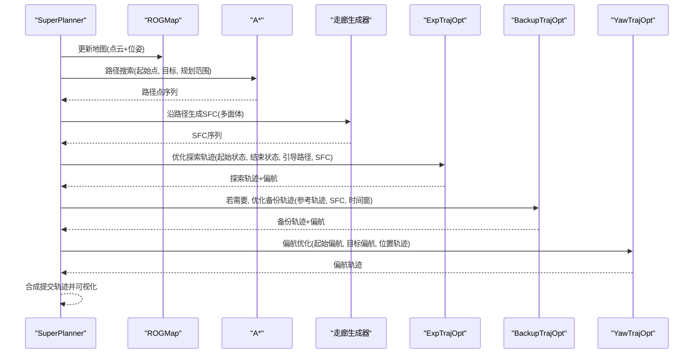
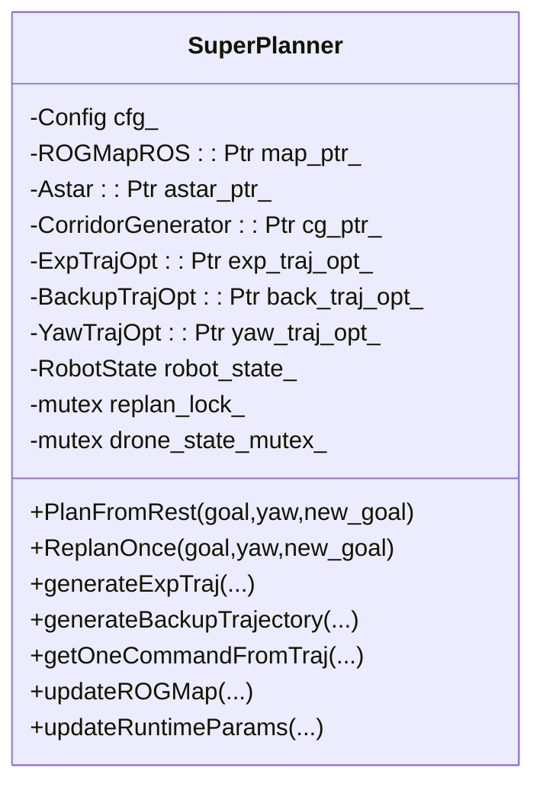
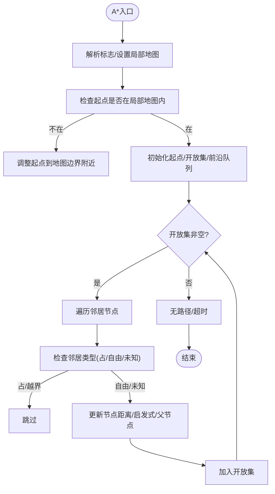
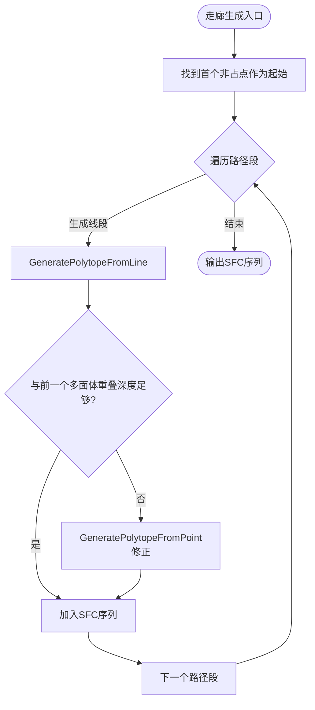
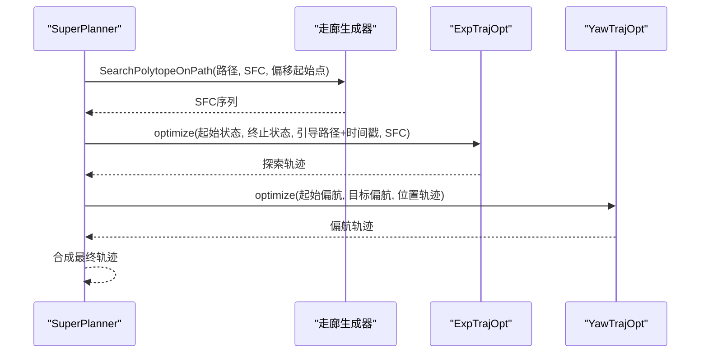
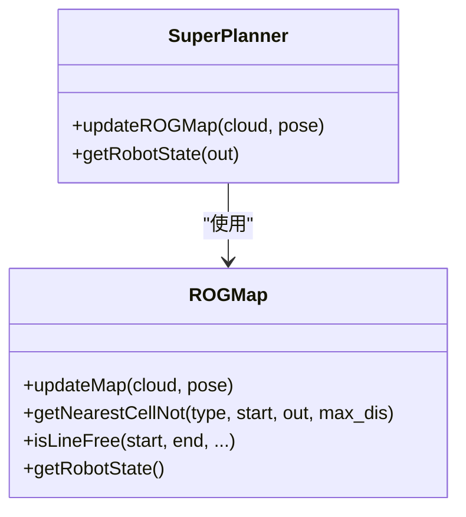
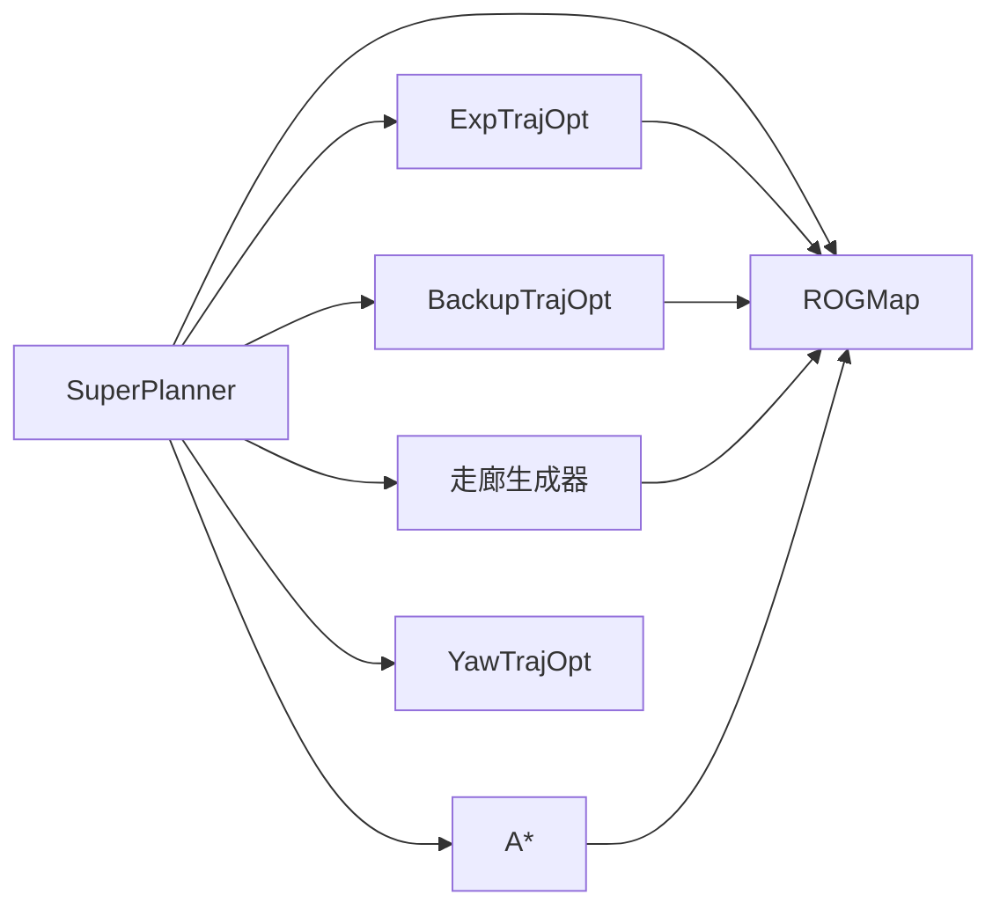

# 模块交互关系

<cite>
**本文档引用的文件**
- [super_planner.h](file://src/SUPER/super_planner/include/super_core/super_planner.h)
- [super_planner.cpp](file://src/SUPER/super_planner/src/super_core/super_planner.cpp)
- [astar.h](file://src/SUPER/super_planner/include/path_search/astar.h)
- [astar.cpp](file://src/SUPER/super_planner/src/super_core/astar.cpp)
- [corridor_generator.h](file://src/SUPER/super_planner/include/super_core/corridor_generator.h)
- [corridor_generator.cpp](file://src/SUPER/super_planner/src/super_core/corridor_generator.cpp)
- [exp_traj_optimizer_s4.h](file://src/SUPER/super_planner/include/traj_opt/exp_traj_optimizer_s4.h)
- [exp_traj_optimizer_s4.cpp](file://src/SUPER/super_planner/src/traj_opt/exp_traj_optimizer_s4.cpp)
- [backup_traj_optimizer_s4.h](file://src/SUPER/super_planner/include/traj_opt/backup_traj_optimizer_s4.h)
- [backup_traj_optimizer_s4.cpp](file://src/SUPER/super_planner/src/traj_opt/backup_traj_optimizer_s4.cpp)
- [yaw_traj_opt.h](file://src/SUPER/super_planner/include/traj_opt/yaw_traj_opt.h)
- [rog_map.h](file://src/SUPER/rog_map/include/rog_map/rog_map.h)
- [config.hpp](file://src/SUPER/super_planner/include/super_core/config.hpp)
- [exp_traj.h](file://src/SUPER/super_planner/include/data_structure/exp_traj.h)
- [backup_traj.h](file://src/SUPER/super_planner/include/data_structure/backup_traj.h)
</cite>

## 目录
1. [简介](#简介)
2. [项目结构](#项目结构)
3. [核心组件](#核心组件)
4. [架构概览](#架构概览)
5. [详细组件分析](#详细组件分析)
6. [依赖关系分析](#依赖关系分析)
7. [性能考量](#性能考量)
8. [故障排查指南](#故障排查指南)
9. [结论](#结论)

## 简介
本文件面向SUPER项目的模块交互关系，系统梳理SuperPlanner主控制器与其子模块（路径搜索模块A*、走廊生成模块、轨迹优化模块ExpTrajOpt/BackupTrajOpt/YawTrajOpt、地图模块ROGMap）之间的协作机制。重点说明：
- 接口定义与数据交换协议（输入输出参数、返回值处理、错误传播）
- 模块间时序关系与同步机制
- 生命周期管理与资源协调（初始化顺序、依赖关系、销毁流程）
- 提供模块交互时序图与数据流图，直观展示通信过程

## 项目结构
SUPER项目采用分层架构，SuperPlanner作为顶层控制器，协调路径搜索、走廊生成、轨迹优化与地图模块协同工作。关键目录与职责如下：
- super_planner：包含SuperPlanner主控制器、路径搜索、轨迹优化、走廊生成、配置与数据结构等
- rog_map：ROG地图模块，提供栅格地图、ESDF、概率地图等基础能力
- mission_planner：任务规划应用层（与本文无关，略）

图表来源
- [super_planner.h](file://src/SUPER/super_planner/include/super_core/super_planner.h#L55-L122)
- [astar.h](file://src/SUPER/super_planner/include/path_search/astar.h#L79-L163)
- [corridor_generator.h](file://src/SUPER/super_planner/include/super_core/corridor_generator.h#L56-L193)
- [exp_traj_optimizer_s4.h](file://src/SUPER/super_planner/include/traj_opt/exp_traj_optimizer_s4.h#L55-L371)
- [backup_traj_optimizer_s4.h](file://src/SUPER/super_planner/include/traj_opt/backup_traj_optimizer_s4.h#L52-L212)
- [yaw_traj_opt.h](file://src/SUPER/super_planner/include/traj_opt/yaw_traj_opt.h#L44-L71)
- [rog_map.h](file://src/SUPER/rog_map/include/rog_map/rog_map.h#L39-L131)

章节来源
- [super_planner.h](file://src/SUPER/super_planner/include/super_core/super_planner.h#L55-L122)
- [config.hpp](file://src/SUPER/super_planner/include/super_core/config.hpp#L44-L235)

## 核心组件
- SuperPlanner主控制器：统一调度各子模块，管理重规划策略、轨迹提交与状态判断、参数同步与可视化
- 路径搜索模块A*：基于ROGMap栅格进行点到点路径搜索，支持未知区域处理策略
- 走廊生成模块：沿引导路径生成安全飞行走廊（SFC），使用CIRI算法提取多面体
- 轨迹优化模块：
  - ExpTrajOpt：探索轨迹优化，基于MINCO求解多段多项式轨迹
  - BackupTrajOpt：备份轨迹优化，在可见性不足时生成安全轨迹
  - YawTrajOpt：偏航角轨迹优化，满足偏航速率约束
- 地图模块ROGMap：提供概率地图、ESDF、栅格查询、机器人状态等

章节来源
- [super_planner.h](file://src/SUPER/super_planner/include/super_core/super_planner.h#L59-L122)
- [astar.h](file://src/SUPER/super_planner/include/path_search/astar.h#L79-L163)
- [corridor_generator.h](file://src/SUPER/super_planner/include/super_core/corridor_generator.h#L56-L193)
- [exp_traj_optimizer_s4.h](file://src/SUPER/super_planner/include/traj_opt/exp_traj_optimizer_s4.h#L55-L106)
- [backup_traj_optimizer_s4.h](file://src/SUPER/super_planner/include/traj_opt/backup_traj_optimizer_s4.h#L52-L122)
- [yaw_traj_opt.h](file://src/SUPER/super_planner/include/traj_opt/yaw_traj_opt.h#L44-L68)
- [rog_map.h](file://src/SUPER/rog_map/include/rog_map/rog_map.h#L39-L131)

## 架构概览
SuperPlanner通过统一的配置与ROS接口，串联路径搜索、走廊生成与轨迹优化模块，并与ROGMap进行数据交换。其核心流程包括：
- 初始化阶段：读取配置、创建各子模块实例、设置邻域步长、初始化FOV检查器
- 规划阶段：根据目标与机器人状态，生成探索轨迹；若不可行或需要，生成备份轨迹；最后合成提交轨迹
- 执行阶段：从提交轨迹中按时间获取位姿与偏航，处理异常与回退

图表来源
- [super_planner.cpp](file://src/SUPER/super_planner/src/super_core/super_planner.cpp#L76-L175)
- [super_planner.cpp](file://src/SUPER/super_planner/src/super_core/super_planner.cpp#L832-L1089)
- [astar.cpp](file://src/SUPER/super_planner/src/super_core/astar.cpp#L329-L670)
- [corridor_generator.cpp](file://src/SUPER/super_planner/src/super_core/corridor_generator.cpp#L62-L216)
- [exp_traj_optimizer_s4.cpp](file://src/SUPER/super_planner/src/traj_opt/exp_traj_optimizer_s4.cpp#L614-L760)
- [backup_traj_optimizer_s4.cpp](file://src/SUPER/super_planner/src/traj_opt/backup_traj_optimizer_s4.cpp#L154-L210)
- [yaw_traj_opt.h](file://src/SUPER/super_planner/include/traj_opt/yaw_traj_opt.h#L60-L66)

## 详细组件分析

### SuperPlanner主控制器
- 职责
  - 统一调度：规划策略（首次规划/重规划）、轨迹合成与提交
  - 数据交换：与地图、路径搜索、走廊生成、轨迹优化模块交互
  - 参数同步：从配置与ROS参数服务器动态更新优化器参数
  - 可视化与日志：记录各模块耗时、失败原因与轨迹可视化
- 关键接口
  - PlanFromRest/ReplanOnce：两种重规划策略入口
  - generateExpTraj/generateBackupTrajectory：生成探索/备份轨迹
  - getOneCommandFromTraj/getCommittedPositionTrajectory/getCommittedYawTrajectory：轨迹查询与命令生成
  - updateROGMap/updateRuntimeParams：地图更新与参数热更新
- 锁与同步
  - replan_lock_保护重规划过程
  - robot_state_mutex_保护机器人状态读写
  - 提交轨迹CmdTraj加锁访问

图表来源
- [super_planner.h](file://src/SUPER/super_planner/include/super_core/super_planner.h#L59-L122)

章节来源
- [super_planner.h](file://src/SUPER/super_planner/include/super_core/super_planner.h#L104-L122)
- [super_planner.cpp](file://src/SUPER/super_planner/src/super_core/super_planner.cpp#L33-L74)
- [super_planner.cpp](file://src/SUPER/super_planner/src/super_core/super_planner.cpp#L76-L175)
- [super_planner.cpp](file://src/SUPER/super_planner/src/super_core/super_planner.cpp#L832-L1089)

### 路径搜索模块A*
- 职责：在ROGMap栅格上进行A*路径搜索，支持未知区域处理策略（未知当占/未知当自由、是否使用膨胀邻域）
- 关键接口
  - pointToPointPathSearch：点到点路径搜索
  - escapePathSearch：从障碍物逃逸到自由空间
  - setFineInfNeighbors：设置精细膨胀邻域步长
- 数据交换
  - 输入：起始点、目标点、搜索标志、搜索范围
  - 输出：路径点序列、返回码（REACH_GOAL/REACH_HORIZON/NO_PATH/TIME_OUT等）

图表来源
- [astar.cpp](file://src/SUPER/super_planner/src/super_core/astar.cpp#L329-L670)

章节来源
- [astar.h](file://src/SUPER/super_planner/include/path_search/astar.h#L139-L163)
- [astar.cpp](file://src/SUPER/super_planner/src/super_core/astar.cpp#L83-L140)
- [astar.cpp](file://src/SUPER/super_planner/src/super_core/astar.cpp#L329-L670)

### 走廊生成模块CorridorGenerator
- 职责：沿路径生成安全飞行走廊（SFC），使用CIRI算法从点云提取多面体，保证相邻多面体重叠度
- 关键接口
  - SearchPolytopeOnPath：沿路径搜索SFC序列
  - GeneratePolytopeFromLine/GeneratePolytopeFromPoint：从线段/点生成多面体
  - getLatestCloud：获取最新点云（用于可视化/调试）
- 数据交换
  - 输入：路径点序列、机器人半径、虚拟地面/天花板高度、邻域点集
  - 输出：SFC序列、偏移后的起始点

图表来源
- [corridor_generator.cpp](file://src/SUPER/super_planner/src/super_core/corridor_generator.cpp#L62-L216)

章节来源
- [corridor_generator.h](file://src/SUPER/super_planner/include/super_core/corridor_generator.h#L100-L131)
- [corridor_generator.cpp](file://src/SUPER/super_planner/src/super_core/corridor_generator.cpp#L62-L216)

### 轨迹优化模块
- ExpTrajOpt（探索轨迹）
  - 输入：起始/终止状态、引导路径与时间戳、SFC
  - 输出：优化后的探索轨迹（位置+偏航）
  - 特点：使用MINCO求解多段多项式，支持约束惩罚与能量最小化
- BackupTrajOpt（备份轨迹）
  - 输入：参考探索轨迹、起始/终止时间窗、SFC
  - 输出：备份轨迹（位置+偏航）
  - 特点：在可见性不足时生成安全轨迹，支持均匀时间分配与约束检查
- YawTrajOpt（偏航轨迹）
  - 输入：起始/目标偏航状态、位置轨迹
  - 输出：偏航轨迹
  - 特点：满足最大偏航速率约束

图表来源
- [super_planner.cpp](file://src/SUPER/super_planner/src/super_core/super_planner.cpp#L387-L830)
- [exp_traj_optimizer_s4.cpp](file://src/SUPER/super_planner/src/traj_opt/exp_traj_optimizer_s4.cpp#L614-L760)
- [yaw_traj_opt.h](file://src/SUPER/super_planner/include/traj_opt/yaw_traj_opt.h#L60-L66)

章节来源
- [exp_traj_optimizer_s4.h](file://src/SUPER/super_planner/include/traj_opt/exp_traj_optimizer_s4.h#L326-L368)
- [exp_traj_optimizer_s4.cpp](file://src/SUPER/super_planner/src/traj_opt/exp_traj_optimizer_s4.cpp#L614-L760)
- [backup_traj_optimizer_s4.h](file://src/SUPER/super_planner/include/traj_opt/backup_traj_optimizer_s4.h#L183-L203)
- [backup_traj_optimizer_s4.cpp](file://src/SUPER/super_planner/src/traj_opt/backup_traj_optimizer_s4.cpp#L154-L210)
- [yaw_traj_opt.h](file://src/SUPER/super_planner/include/traj_opt/yaw_traj_opt.h#L60-L66)

### 地图模块ROGMap
- 职责：提供栅格地图、ESDF、概率地图查询，机器人状态更新与最近单元格查找
- 关键接口
  - updateMap：更新点云与位姿
  - getNearestCellNot/isLineFree：障碍物/自由空间查询
  - getRobotState：获取机器人状态
- 与SuperPlanner交互
  - SuperPlanner通过updateROGMap更新地图
  - 各模块通过ROGMap查询栅格类型、线段自由性等

图表来源
- [rog_map.h](file://src/SUPER/rog_map/include/rog_map/rog_map.h#L112-L129)
- [super_planner.cpp](file://src/SUPER/super_planner/src/super_core/super_planner.cpp#L226-L234)

章节来源
- [rog_map.h](file://src/SUPER/rog_map/include/rog_map/rog_map.h#L39-L131)
- [super_planner.cpp](file://src/SUPER/super_planner/src/super_core/super_planner.cpp#L226-L234)

## 依赖关系分析
- SuperPlanner对各子模块的依赖
  - 路径搜索：依赖ROGMap栅格查询与A*搜索
  - 走廊生成：依赖ROGMap点云与CIRI算法
  - 轨迹优化：依赖ROGMap栅格/ESDF与SFC
  - 地图模块：被所有模块依赖
- 参数与配置
  - Config集中管理规划参数，SuperPlanner通过updateRuntimeParams将参数同步到优化器
- 线程与同步
  - SuperPlanner内部使用互斥锁保护共享状态
  - 各优化器内部维护自身配置锁，避免并发修改

图表来源
- [super_planner.h](file://src/SUPER/super_planner/include/super_core/super_planner.h#L38-L71)
- [config.hpp](file://src/SUPER/super_planner/include/super_core/config.hpp#L96-L235)

章节来源
- [super_planner.h](file://src/SUPER/super_planner/include/super_core/super_planner.h#L38-L71)
- [config.hpp](file://src/SUPER/super_planner/include/super_core/config.hpp#L158-L228)

## 性能考量
- 时间预算与早停
  - SuperPlanner为每次重规划设定前向时间窗口replan_forward_dt，若超时则返回FAILED
  - 轨迹优化器内部也设置相对目标精度与积分分辨率，平衡性能与质量
- 可视化与日志
  - 各模块在关键步骤进行可视化标注，便于调试与性能分析
- 参数热更新
  - 支持运行时从ROS参数服务器更新配置，减少重启成本

## 故障排查指南
- 常见错误与处理
  - 无里程计/起始点被占：返回FAILED并记录SUPER_NO_ODOM/SUPER_NO_START_POINT
  - A*搜索失败：尝试在概率地图重试，仍失败则返回FAILED
  - 轨迹优化失败：记录惩罚项与约束违反情况，返回OPT_FAILED/FAILED
  - 备份轨迹起始时间冲突：校验提交轨迹与新轨迹起始时间一致性
- 日志与可视化
  - SuperPlanner记录各模块耗时与最新重规划日志，便于定位瓶颈
  - 各模块提供可视化接口，辅助问题诊断

章节来源
- [super_planner.cpp](file://src/SUPER/super_planner/src/super_core/super_planner.cpp#L76-L175)
- [super_planner.cpp](file://src/SUPER/super_planner/src/super_core/super_planner.cpp#L832-L1089)
- [astar.cpp](file://src/SUPER/super_planner/src/super_core/astar.cpp#L1159-L1184)
- [exp_traj_optimizer_s4.cpp](file://src/SUPER/super_planner/src/traj_opt/exp_traj_optimizer_s4.cpp#L714-L734)

## 结论
SuperPlanner通过清晰的模块划分与严格的接口契约，实现了从地图更新到轨迹生成再到执行反馈的完整闭环。路径搜索、走廊生成与轨迹优化模块在统一配置与参数同步机制下协同工作，既保证了规划效率，又兼顾了安全性与可维护性。建议在实际部署中：
- 合理设置规划参数与时间预算，避免超时
- 利用可视化与日志工具持续监控模块性能
- 通过参数热更新快速适配不同场景需求