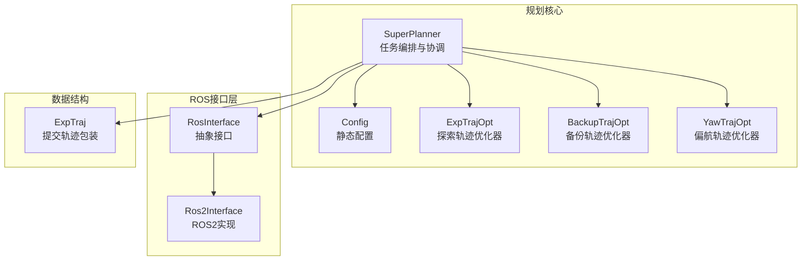
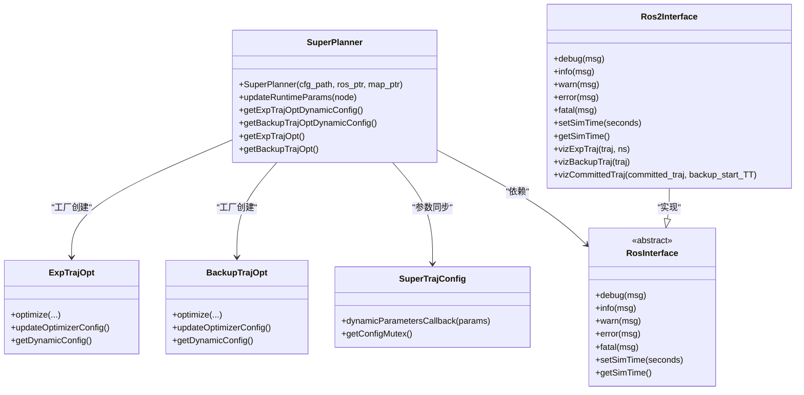
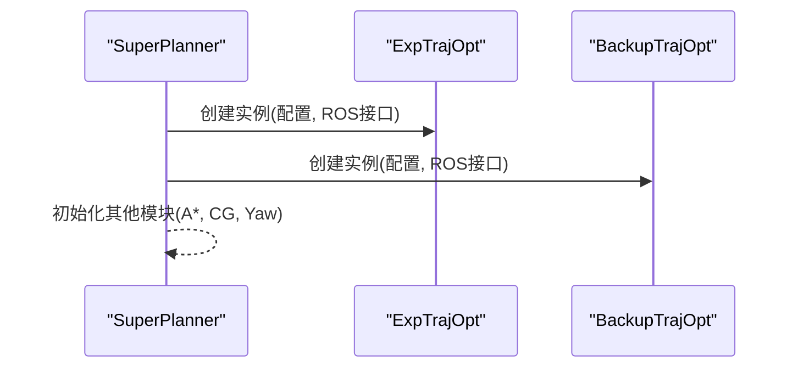
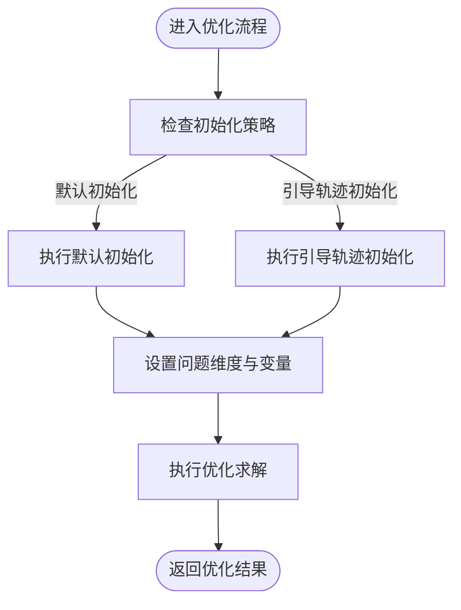
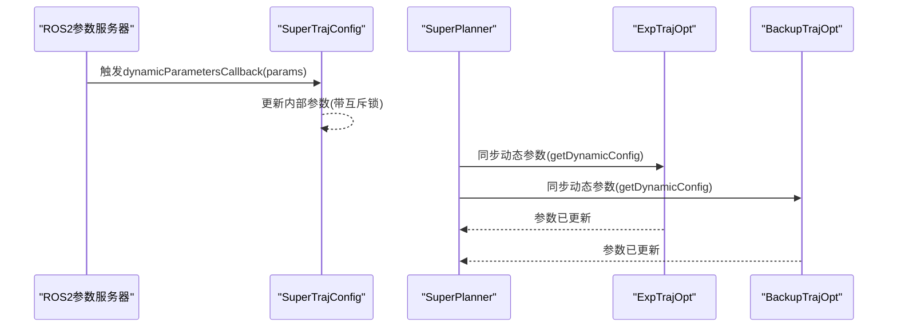
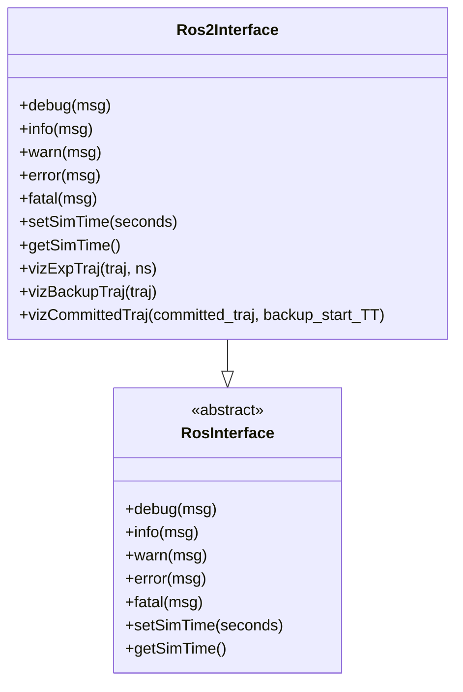
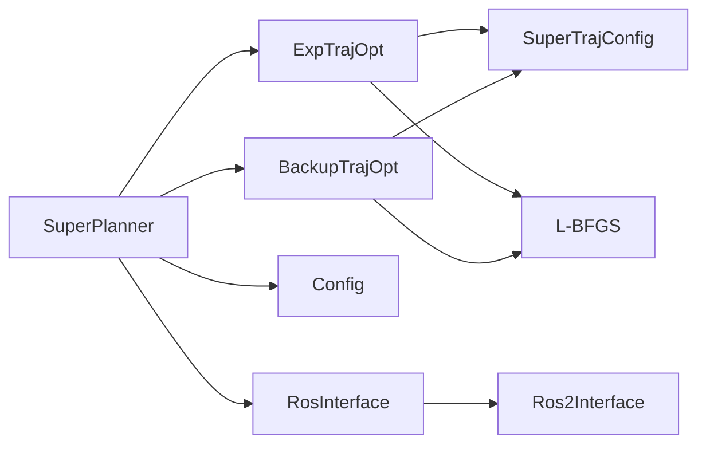

# 设计模式应用

<cite>
**本文档引用的文件**
- [super_planner.h](file://src/SUPER/super_planner/include/super_core/super_planner.h)
- [super_planner.cpp](file://src/SUPER/super_planner/src/super_core/super_planner.cpp)
- [config.hpp](file://src/SUPER/super_planner/include/super_core/config.hpp)
- [exp_traj_optimizer_s4.h](file://src/SUPER/super_planner/include/traj_opt/exp_traj_optimizer_s4.h)
- [backup_traj_optimizer_s4.h](file://src/SUPER/super_planner/include/traj_opt/backup_traj_optimizer_s4.h)
- [backup_traj_optimizer_s4.cpp](file://src/SUPER/super_planner/src/traj_opt/backup_traj_optimizer_s4.cpp)
- [super_traj_config.h](file://src/SUPER/super_planner/include/traj_opt/super_traj_config.h)
- [ros_interface.hpp](file://src/SUPER/super_planner/include/ros_interface/ros_interface.hpp)
- [ros2_interface.hpp](file://src/SUPER/super_planner/include/ros_interface/ros2/ros2_interface.hpp)
- [exp_traj.h](file://src/SUPER/super_planner/include/data_structure/exp_traj.h)
- [lbfgs.h](file://src/SUPER/super_planner/include/utils/optimization/lbfgs.h)
- [API_REFERENCE.md](file://src/SUPER/super_planner/docs/API_REFERENCE.md)
</cite>

## 目录
1. [简介](#简介)
2. [项目结构](#项目结构)
3. [核心组件](#核心组件)
4. [架构总览](#架构总览)
5. [详细组件分析](#详细组件分析)
6. [依赖关系分析](#依赖关系分析)
7. [性能考量](#性能考量)
8. [故障排查指南](#故障排查指南)
9. [结论](#结论)

## 简介
本文件聚焦于SUPER系统中设计模式的应用与实践，围绕以下主题展开：
- 工厂模式：在轨迹优化器创建中的应用，通过统一入口创建不同类型的轨迹优化器实例。
- 策略模式：在不同优化策略选择中的使用，通过统一接口抽象不同的优化算法或配置策略。
- 观察者模式：在参数回调机制中的实现，通过参数回调函数监听并响应动态参数变化。
- 单例模式：在ROS接口管理中的应用，确保全局唯一的ROS接口实例。

我们将结合代码路径说明每种模式的应用场景、实现细节、协同作用及对系统架构的影响，并提供可操作的改进建议与最佳实践。

## 项目结构
SUPER系统采用模块化架构，核心模块包括：
- 规划器核心：负责任务编排、状态管理与模块间协调。
- 轨迹优化器：包含探索轨迹优化器与备份轨迹优化器，分别承担主规划与安全备份。
- ROS接口层：抽象ROS通信与可视化接口，提供统一的日志与可视化能力。
- 配置与参数：集中管理静态配置与动态参数，支持运行时热更新。

**图表来源**
- [super_planner.h](file://src/SUPER/super_planner/include/super_core/super_planner.h#L59-L108)
- [super_planner.cpp](file://src/SUPER/super_planner/src/super_core/super_planner.cpp#L33-L74)
- [config.hpp](file://src/SUPER/super_planner/include/super_core/config.hpp#L44-L151)
- [exp_traj_optimizer_s4.h](file://src/SUPER/super_planner/include/traj_opt/exp_traj_optimizer_s4.h#L351-L371)
- [backup_traj_optimizer_s4.h](file://src/SUPER/super_planner/include/traj_opt/backup_traj_optimizer_s4.h#L160-L211)
- [ros_interface.hpp](file://src/SUPER/super_planner/include/ros_interface/ros_interface.hpp#L39-L82)
- [ros2_interface.hpp](file://src/SUPER/super_planner/include/ros_interface/ros2/ros2_interface.hpp#L41-L76)
- [exp_traj.h](file://src/SUPER/super_planner/include/data_structure/exp_traj.h#L83-L133)

**章节来源**
- [super_planner.h](file://src/SUPER/super_planner/include/super_core/super_planner.h#L31-L53)
- [super_planner.cpp](file://src/SUPER/super_planner/src/super_core/super_planner.cpp#L33-L74)
- [config.hpp](file://src/SUPER/super_planner/include/super_core/config.hpp#L44-L151)

## 核心组件
- SuperPlanner：系统核心控制器，负责模块初始化、任务调度、参数同步与可视化输出。
- 轨迹优化器：提供统一接口的优化器家族，支持动态参数注入与配置更新。
- ROS接口层：抽象ROS通信与可视化，提供统一的日志与发布接口。
- 配置系统：集中管理静态配置与动态参数，支持运行时热更新。

**章节来源**
- [super_planner.h](file://src/SUPER/super_planner/include/super_core/super_planner.h#L59-L108)
- [super_planner.cpp](file://src/SUPER/super_planner/src/super_core/super_planner.cpp#L33-L74)
- [config.hpp](file://src/SUPER/super_planner/include/super_core/config.hpp#L158-L228)

## 架构总览
下图展示了设计模式在系统中的协同作用：
- 工厂模式：SuperPlanner在构造阶段统一创建轨迹优化器实例。
- 策略模式：通过统一接口抽象不同优化策略，便于替换与扩展。
- 观察者模式：动态参数回调监听参数变化，触发配置同步。
- 单例模式：ROS接口作为全局唯一实例，贯穿整个系统。

**图表来源**
- [super_planner.h](file://src/SUPER/super_planner/include/super_core/super_planner.h#L104-L108)
- [super_planner.cpp](file://src/SUPER/super_planner/src/super_core/super_planner.cpp#L44-L46)
- [exp_traj_optimizer_s4.h](file://src/SUPER/super_planner/include/traj_opt/exp_traj_optimizer_s4.h#L351-L371)
- [backup_traj_optimizer_s4.h](file://src/SUPER/super_planner/include/traj_opt/backup_traj_optimizer_s4.h#L160-L211)
- [super_traj_config.h](file://src/SUPER/super_planner/include/traj_opt/super_traj_config.h#L72-L167)
- [ros_interface.hpp](file://src/SUPER/super_planner/include/ros_interface/ros_interface.hpp#L43-L82)
- [ros2_interface.hpp](file://src/SUPER/super_planner/include/ros_interface/ros2/ros2_interface.hpp#L41-L76)

## 详细组件分析

### 工厂模式：轨迹优化器创建
- 应用场景：在SuperPlanner构造函数中，统一创建探索轨迹优化器与备份轨迹优化器实例，屏蔽具体实现差异。
- 实现要点：
  - 使用智能指针进行资源管理，确保生命周期可控。
  - 将配置与ROS接口注入到优化器，保证运行时一致性。
- 代码路径：
  - [super_planner.cpp](file://src/SUPER/super_planner/src/super_core/super_planner.cpp#L44-L46)

**图表来源**
- [super_planner.cpp](file://src/SUPER/super_planner/src/super_core/super_planner.cpp#L44-L46)

**章节来源**
- [super_planner.cpp](file://src/SUPER/super_planner/src/super_core/super_planner.cpp#L44-L46)

### 策略模式：不同优化策略选择
- 应用场景：通过统一接口抽象不同优化策略（如默认初始化、引导轨迹初始化），在运行时根据条件切换。
- 实现要点：
  - 优化器内部通过条件分支选择初始化策略，保持对外接口一致。
  - 通过配置参数控制策略行为，便于热插拔与实验对比。
- 代码路径：
  - [exp_traj_optimizer_s4.h](file://src/SUPER/super_planner/include/traj_opt/exp_traj_optimizer_s4.h#L244-L279)
  - [backup_traj_optimizer_s4.cpp](file://src/SUPER/super_planner/src/traj_opt/backup_traj_optimizer_s4.cpp#L413-L440)

**图表来源**
- [exp_traj_optimizer_s4.h](file://src/SUPER/super_planner/include/traj_opt/exp_traj_optimizer_s4.h#L244-L279)
- [backup_traj_optimizer_s4.cpp](file://src/SUPER/super_planner/src/traj_opt/backup_traj_optimizer_s4.cpp#L413-L440)

**章节来源**
- [exp_traj_optimizer_s4.h](file://src/SUPER/super_planner/include/traj_opt/exp_traj_optimizer_s4.h#L244-L279)
- [backup_traj_optimizer_s4.cpp](file://src/SUPER/super_planner/src/traj_opt/backup_traj_optimizer_s4.cpp#L413-L440)

### 观察者模式：参数回调机制
- 应用场景：通过动态参数回调监听参数变化，实现运行时参数热更新，避免重启影响在线运行。
- 实现要点：
  - SuperTrajConfig提供参数回调函数，按参数名映射到对应字段。
  - 使用互斥锁保证线程安全，避免并发写入导致的数据竞争。
  - SuperPlanner在运行时主动同步参数到各优化器实例。
- 代码路径：
  - [super_traj_config.h](file://src/SUPER/super_planner/include/traj_opt/super_traj_config.h#L72-L167)
  - [super_planner.cpp](file://src/SUPER/super_planner/src/super_core/super_planner.cpp#L241-L295)

**图表来源**
- [super_traj_config.h](file://src/SUPER/super_planner/include/traj_opt/super_traj_config.h#L72-L167)
- [super_planner.cpp](file://src/SUPER/super_planner/src/super_core/super_planner.cpp#L241-L295)

**章节来源**
- [super_traj_config.h](file://src/SUPER/super_planner/include/traj_opt/super_traj_config.h#L72-L167)
- [super_planner.cpp](file://src/SUPER/super_planner/src/super_core/super_planner.cpp#L241-L295)

### 单例模式：ROS接口管理
- 应用场景：在系统中需要全局唯一的ROS接口实例，统一管理日志与可视化发布。
- 实现要点：
  - RosInterface为抽象基类，Ros2Interface为其具体实现。
  - 通过智能指针管理生命周期，确保全局唯一性与线程安全。
  - 提供统一的日志与可视化接口，屏蔽底层实现差异。
- 代码路径：
  - [ros_interface.hpp](file://src/SUPER/super_planner/include/ros_interface/ros_interface.hpp#L43-L82)
  - [ros2_interface.hpp](file://src/SUPER/super_planner/include/ros_interface/ros2/ros2_interface.hpp#L41-L76)

**图表来源**
- [ros_interface.hpp](file://src/SUPER/super_planner/include/ros_interface/ros_interface.hpp#L43-L82)
- [ros2_interface.hpp](file://src/SUPER/super_planner/include/ros_interface/ros2/ros2_interface.hpp#L41-L76)

**章节来源**
- [ros_interface.hpp](file://src/SUPER/super_planner/include/ros_interface/ros_interface.hpp#L43-L82)
- [ros2_interface.hpp](file://src/SUPER/super_planner/include/ros_interface/ros2/ros2_interface.hpp#L41-L76)

### 优化器内部配置与参数同步
- 动态参数配置：SuperTrajConfig封装边界约束、惩罚系数与优化参数，支持运行时更新。
- 参数同步：SuperPlanner在运行时将参数从Config同步到各优化器的动态配置，确保一致性。
- 线程安全：使用互斥锁保护参数访问，避免竞态条件。
- 代码路径：
  - [super_traj_config.h](file://src/SUPER/super_planner/include/traj_opt/super_traj_config.h#L37-L177)
  - [super_planner.cpp](file://src/SUPER/super_planner/src/super_core/super_planner.cpp#L241-L295)

**章节来源**
- [super_traj_config.h](file://src/SUPER/super_planner/include/traj_opt/super_traj_config.h#L37-L177)
- [super_planner.cpp](file://src/SUPER/super_planner/src/super_core/super_planner.cpp#L241-L295)

### 提交轨迹与可视化
- 提交轨迹包装：ExpTraj封装位置轨迹与偏航轨迹，提供统一查询接口。
- 可视化发布：Ros2Interface实现多种可视化发布，包括轨迹、走廊、点云等。
- 代码路径：
  - [exp_traj.h](file://src/SUPER/super_planner/include/data_structure/exp_traj.h#L83-L133)
  - [ros2_interface.hpp](file://src/SUPER/super_planner/include/ros_interface/ros2/ros2_interface.hpp#L120-L266)

**章节来源**
- [exp_traj.h](file://src/SUPER/super_planner/include/data_structure/exp_traj.h#L83-L133)
- [ros2_interface.hpp](file://src/SUPER/super_planner/include/ros_interface/ros2/ros2_interface.hpp#L120-L266)

## 依赖关系分析
- 组件耦合：
  - SuperPlanner依赖轨迹优化器与ROS接口，形成清晰的控制流。
  - 优化器依赖配置与ROS接口，实现参数注入与可视化输出。
- 外部依赖：
  - L-BFGS优化库用于非线性优化求解。
  - ROS2消息与可视化接口用于仿真时钟与RViz可视化。
- 潜在风险：
  - 参数同步链路较长，需确保回调与同步的原子性与一致性。
  - 优化器内部配置更新需在每次优化前调用，避免参数不一致。

**图表来源**
- [super_planner.h](file://src/SUPER/super_planner/include/super_core/super_planner.h#L68-L70)
- [exp_traj_optimizer_s4.h](file://src/SUPER/super_planner/include/traj_opt/exp_traj_optimizer_s4.h#L351-L371)
- [backup_traj_optimizer_s4.h](file://src/SUPER/super_planner/include/traj_opt/backup_traj_optimizer_s4.h#L160-L211)
- [config.hpp](file://src/SUPER/super_planner/include/super_core/config.hpp#L158-L228)
- [ros_interface.hpp](file://src/SUPER/super_planner/include/ros_interface/ros_interface.hpp#L43-L82)
- [ros2_interface.hpp](file://src/SUPER/super_planner/include/ros_interface/ros2/ros2_interface.hpp#L41-L76)
- [lbfgs.h](file://src/SUPER/super_planner/include/utils/optimization/lbfgs.h#L284-L304)

**章节来源**
- [super_planner.h](file://src/SUPER/super_planner/include/super_core/super_planner.h#L68-L70)
- [exp_traj_optimizer_s4.h](file://src/SUPER/super_planner/include/traj_opt/exp_traj_optimizer_s4.h#L351-L371)
- [backup_traj_optimizer_s4.h](file://src/SUPER/super_planner/include/traj_opt/backup_traj_optimizer_s4.h#L160-L211)
- [config.hpp](file://src/SUPER/super_planner/include/super_core/config.hpp#L158-L228)
- [ros_interface.hpp](file://src/SUPER/super_planner/include/ros_interface/ros_interface.hpp#L43-L82)
- [ros2_interface.hpp](file://src/SUPER/super_planner/include/ros_interface/ros2/ros2_interface.hpp#L41-L76)
- [lbfgs.h](file://src/SUPER/super_planner/include/utils/optimization/lbfgs.h#L284-L304)

## 性能考量
- 参数同步开销：动态参数回调与同步可能带来额外的锁竞争与拷贝成本，建议在高频控制环中减少不必要的参数更新频率。
- 优化器初始化：不同初始化策略对收敛速度有显著影响，建议根据场景选择合适的策略并缓存中间结果。
- 可视化成本：大量MarkerArray发布会影响仿真性能，建议在调试阶段开启，在运行阶段关闭或降低发布频率。
- 线程安全：互斥锁保护参数访问，但过度使用可能导致性能瓶颈，建议细粒度锁定与批量更新相结合。

## 故障排查指南
- 参数未生效：
  - 检查动态参数回调是否正确注册与触发。
  - 确认SuperPlanner是否在运行时同步参数到优化器。
  - 参考路径：[super_traj_config.h](file://src/SUPER/super_planner/include/traj_opt/super_traj_config.h#L72-L167)，[super_planner.cpp](file://src/SUPER/super_planner/src/super_core/super_planner.cpp#L241-L295)
- 优化失败：
  - 检查初始化策略与走廊约束是否满足。
  - 确认L-BFGS求解器返回码与日志输出。
  - 参考路径：[exp_traj_optimizer_s4.h](file://src/SUPER/super_planner/include/traj_opt/exp_traj_optimizer_s4.h#L244-L279)，[backup_traj_optimizer_s4.cpp](file://src/SUPER/super_planner/src/traj_opt/backup_traj_optimizer_s4.cpp#L552-L588)，[lbfgs.h](file://src/SUPER/super_planner/include/utils/optimization/lbfgs.h#L284-L304)
- 可视化无输出：
  - 检查订阅者是否存在与分辨率设置。
  - 参考路径：[ros2_interface.hpp](file://src/SUPER/super_planner/include/ros_interface/ros2/ros2_interface.hpp#L120-L266)

**章节来源**
- [super_traj_config.h](file://src/SUPER/super_planner/include/traj_opt/super_traj_config.h#L72-L167)
- [super_planner.cpp](file://src/SUPER/super_planner/src/super_core/super_planner.cpp#L241-L295)
- [exp_traj_optimizer_s4.h](file://src/SUPER/super_planner/include/traj_opt/exp_traj_optimizer_s4.h#L244-L279)
- [backup_traj_optimizer_s4.cpp](file://src/SUPER/super_planner/src/traj_opt/backup_traj_optimizer_s4.cpp#L552-L588)
- [lbfgs.h](file://src/SUPER/super_planner/include/utils/optimization/lbfgs.h#L284-L304)
- [ros2_interface.hpp](file://src/SUPER/super_planner/include/ros_interface/ros2/ros2_interface.hpp#L120-L266)

## 结论
SUPER系统通过工厂模式实现了优化器的统一创建与管理；通过策略模式提供了灵活的优化策略选择；通过观察者模式实现了参数的动态回调与同步；通过单例模式确保了ROS接口的全局一致性。这些设计模式协同工作，显著提升了系统的可扩展性、可维护性与可复用性。建议在后续开发中继续遵循接口抽象与参数驱动的原则，进一步细化参数同步与可视化策略，以获得更优的工程实践效果。