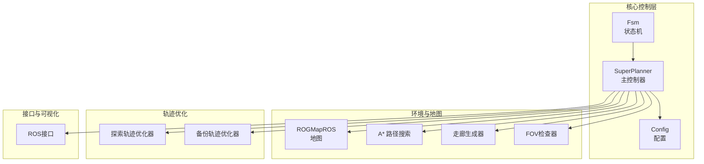
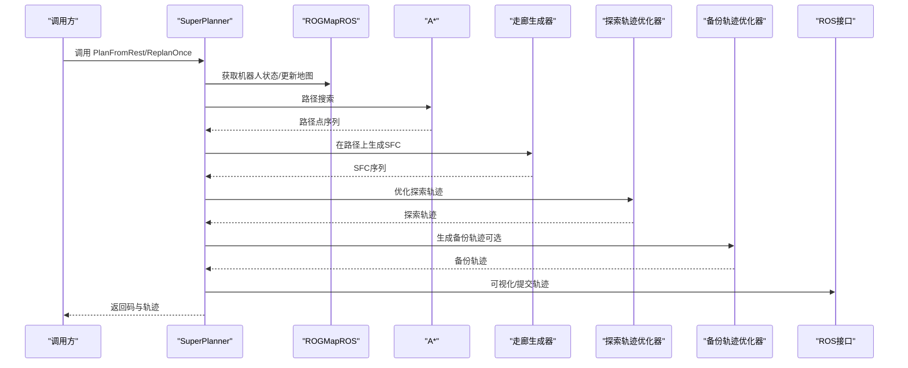
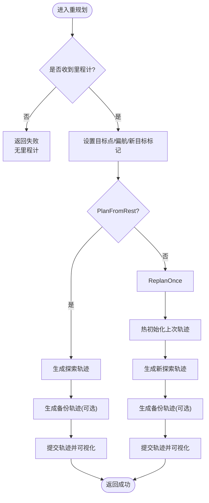
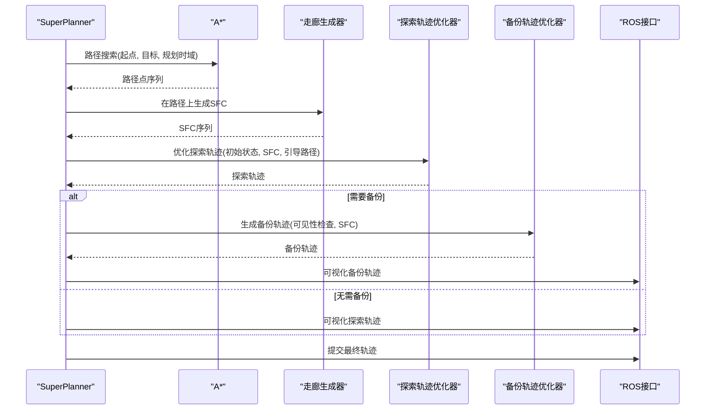
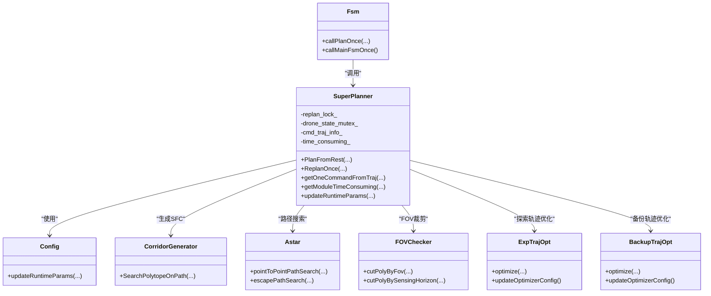

# 核心规划算法

<cite>
**本文引用的文件**   
- [super_planner.h](file://src/SUPER/super_planner/include/super_core/super_planner.h)
- [super_planner.cpp](file://src/SUPER/super_planner/src/super_core/super_planner.cpp)
- [super_ret_code.hpp](file://src/SUPER/super_planner/include/super_core/super_ret_code.hpp)
- [fsm.h](file://src/SUPER/super_planner/include/fsm/fsm.h)
- [config.hpp](file://src/SUPER/super_planner/include/super_core/config.hpp)
- [corridor_generator.h](file://src/SUPER/super_planner/include/super_core/corridor_generator.h)
- [exp_traj_optimizer_s4.h](file://src/SUPER/super_planner/include/traj_opt/exp_traj_optimizer_s4.h)
- [backup_traj_optimizer_s4.h](file://src/SUPER/super_planner/include/traj_opt/backup_traj_optimizer_s4.h)
- [astar.h](file://src/SUPER/super_planner/include/path_search/astar.h)
- [fov_checker.h](file://src/SUPER/super_planner/include/super_core/fov_checker.h)
</cite>

## 目录
1. [引言](#引言)
2. [项目结构](#项目结构)
3. [核心组件](#核心组件)
4. [架构总览](#架构总览)
5. [详细组件分析](#详细组件分析)
6. [依赖关系分析](#依赖关系分析)
7. [性能考量](#性能考量)
8. [故障排查指南](#故障排查指南)
9. [结论](#结论)
10. [附录](#附录)

## 引言
本文件面向超级规划器（SUPER）的核心规划算法，围绕 SuperPlanner 主控制器进行系统性说明。内容涵盖：
- 规划流程的完整生命周期与状态机状态转换
- 返回码系统工作机制
- PlanFromRest 与 ReplanOnce 两种策略的差异与适用场景
- 轨迹生成的全流程：目标点接收、路径搜索、走廊生成、轨迹优化与输出
- 多线程安全机制：轨迹锁定/解锁与互斥锁使用
- 性能监控与时间消耗统计
- 调用接口示例与参数说明

## 项目结构
超级规划器位于 src/SUPER/super_planner 目录，核心模块包括：
- super_core：主控制器、配置、走廊生成、FOV裁剪、状态机
- traj_opt：探索轨迹与备份轨迹优化器
- path_search：A* 路径搜索
- data_structure：轨迹与多面体数据结构
- ros_interface：ROS2 接口与可视化

图表来源
- [super_planner.h](file://src/SUPER/super_planner/include/super_core/super_planner.h#L59-L122)
- [config.hpp](file://src/SUPER/super_planner/include/super_core/config.hpp#L44-L151)
- [corridor_generator.h](file://src/SUPER/super_planner/include/super_core/corridor_generator.h#L56-L131)
- [exp_traj_optimizer_s4.h](file://src/SUPER/super_planner/include/traj_opt/exp_traj_optimizer_s4.h#L55-L106)
- [backup_traj_optimizer_s4.h](file://src/SUPER/super_planner/include/traj_opt/backup_traj_optimizer_s4.h#L52-L122)
- [astar.h](file://src/SUPER/super_planner/include/path_search/astar.h#L79-L161)
- [fov_checker.h](file://src/SUPER/super_planner/include/super_core/fov_checker.h#L41-L130)

章节来源
- [super_planner.h](file://src/SUPER/super_planner/include/super_core/super_planner.h#L55-L122)
- [config.hpp](file://src/SUPER/super_planner/include/super_core/config.hpp#L44-L151)

## 核心组件
- SuperPlanner：主控制器，负责目标接收、路径搜索、走廊生成、轨迹优化、备份策略、命令下发与可视化。
- 配置 Config：统一管理规划参数（如规划时域、重规划前向步长、机器人半径、FOV裁剪等），支持运行时参数热更新。
- 走廊生成 CorridorGenerator：基于CIRI算法与点云地图生成安全飞行走廊（SFC）。
- A* 路径搜索：在概率/膨胀地图上进行路径搜索，支持逃逸路径与回退策略。
- FOV检查器：根据传感器视场对走廊进行裁剪。
- 探索轨迹优化器 ExpTrajOpt：在SFC内进行探索轨迹优化，支持热初始化。
- 备份轨迹优化器 BackupTrajOpt：在不可见或危险段生成备份轨迹，支持均匀时间分段与能量代价。
- 状态机 Fsm：封装状态转换（等待目标、偏航、生成轨迹、跟随轨迹、紧急停止）。

章节来源
- [super_planner.h](file://src/SUPER/super_planner/include/super_core/super_planner.h#L59-L122)
- [config.hpp](file://src/SUPER/super_planner/include/super_core/config.hpp#L44-L231)
- [corridor_generator.h](file://src/SUPER/super_planner/include/super_core/corridor_generator.h#L56-L193)
- [astar.h](file://src/SUPER/super_planner/include/path_search/astar.h#L79-L163)
- [fov_checker.h](file://src/SUPER/super_planner/include/super_core/fov_checker.h#L41-L287)
- [exp_traj_optimizer_s4.h](file://src/SUPER/super_planner/include/traj_opt/exp_traj_optimizer_s4.h#L55-L371)
- [backup_traj_optimizer_s4.h](file://src/SUPER/super_planner/include/traj_opt/backup_traj_optimizer_s4.h#L52-L212)
- [fsm.h](file://src/SUPER/super_planner/include/fsm/fsm.h#L41-L171)

## 架构总览
SuperPlanner 作为中枢，协调地图、路径搜索、走廊生成、轨迹优化与状态机。其对外提供两类重规划策略入口，内部通过多阶段模块完成轨迹生成与提交。

图表来源
- [super_planner.cpp](file://src/SUPER/super_planner/src/super_core/super_planner.cpp#L76-L312)
- [astar.h](file://src/SUPER/super_planner/include/path_search/astar.h#L151-L161)
- [corridor_generator.h](file://src/SUPER/super_planner/include/super_core/corridor_generator.h#L129-L131)
- [exp_traj_optimizer_s4.h](file://src/SUPER/super_planner/include/traj_opt/exp_traj_optimizer_s4.h#L342-L367)
- [backup_traj_optimizer_s4.h](file://src/SUPER/super_planner/include/traj_opt/backup_traj_optimizer_s4.h#L183-L202)

## 详细组件分析

### SuperPlanner 主控制器设计与实现
- 关键职责
  - 目标接收与校验（目标点、偏航角、新目标标记）
  - 起始点安全迁移（从占用区移至自由空间）
  - 探索轨迹生成与优化
  - 备份轨迹生成与提交
  - 轨迹锁定/解锁与多线程安全
  - 时间消耗统计与性能监控
  - 运行时参数热更新

- 多线程安全机制
  - 重规划锁：保护重规划流程的原子性
  - 轨迹锁：CmdTraj 的 lock()/unlock() 保证读写一致性
  - 机器人状态访问：使用 drone_state_mutex_ 保护共享状态

- 返回码系统
  - SUCCESS/SUCCESS_WITH_BACKUP/SUCCESS_NO_BACKUP/FAILED/EMER/NEW_TRAJ/NO_NEED/OPT_FAILED 等
  - 通过 SUPER_RET_CODE 与字符串映射辅助诊断

- 性能监控
  - 模块耗时数组 time_consuming_：前端探索、优化探索、前端备份、优化备份、可视化、总重规划等
  - 前端/后端平均耗时统计：getFrontendTime()/getBackendTime()

章节来源
- [super_planner.h](file://src/SUPER/super_planner/include/super_core/super_planner.h#L59-L122)
- [super_planner.cpp](file://src/SUPER/super_planner/src/super_core/super_planner.cpp#L76-L312)
- [super_ret_code.hpp](file://src/SUPER/super_planner/include/super_core/super_ret_code.hpp#L33-L60)

### 规划策略：PlanFromRest vs ReplanOnce
- PlanFromRest
  - 适用于“从静止/新目标”开始的首次规划
  - 流程：安全起始点迁移 → 生成探索轨迹 → 生成备份轨迹（若需要）→ 提交轨迹
  - 特点：整体一次性生成，适合目标刚到达或重启场景

- ReplanOnce
  - 适用于“在已有轨迹基础上”的增量重规划
  - 流程：热初始化上次探索轨迹 → 生成新探索轨迹片段 → 生成备份轨迹（若需要）→ 提交新轨迹
  - 特点：利用历史轨迹与引导路径，提高实时性；支持早停（NO_NEED/EMER/NEW_TRAJ）

图表来源
- [super_planner.cpp](file://src/SUPER/super_planner/src/super_core/super_planner.cpp#L76-L312)

章节来源
- [super_planner.cpp](file://src/SUPER/super_planner/src/super_core/super_planner.cpp#L76-L312)

### 轨迹生成全流程详解
- 目标点接收与校验
  - 更新目标点、偏航角、新目标标记
  - 可视化目标路径

- 路径搜索
  - A* 在概率/膨胀地图上搜索路径
  - 支持逃逸路径（从障碍附近移出）与回退策略（先在膨胀图搜索，失败再在概率图搜索）

- 走廊生成
  - 在路径上按线段生成SFC（CIRI算法）
  - 可选FOV裁剪（感知范围与视场角）

- 探索轨迹优化
  - ExpTrajOpt 在SFC内进行优化，支持热初始化（引导路径与时间戳）
  - 优化完成后生成偏航轨迹并与位置轨迹拼接

- 备份轨迹生成
  - 若探索轨迹在感知范围内不可见或存在风险，生成备份轨迹
  - BackupTrajOpt 在SFC内进行优化，支持均匀时间分段与能量代价

- 轨迹提交与可视化
  - 提交最终轨迹（含备份轨迹起始时刻）
  - 可视化探索轨迹、备份轨迹、SFC等

图表来源
- [super_planner.cpp](file://src/SUPER/super_planner/src/super_core/super_planner.cpp#L387-L1089)
- [astar.h](file://src/SUPER/super_planner/include/path_search/astar.h#L151-L161)
- [corridor_generator.h](file://src/SUPER/super_planner/include/super_core/corridor_generator.h#L129-L131)
- [exp_traj_optimizer_s4.h](file://src/SUPER/super_planner/include/traj_opt/exp_traj_optimizer_s4.h#L342-L367)
- [backup_traj_optimizer_s4.h](file://src/SUPER/super_planner/include/traj_opt/backup_traj_optimizer_s4.h#L183-L202)

章节来源
- [super_planner.cpp](file://src/SUPER/super_planner/src/super_core/super_planner.cpp#L387-L1089)

### 多线程安全机制
- 重规划锁 replan_lock_：保护 PlanFromRest/ReplanOnce 的原子性
- 轨迹锁 cmd_traj_info_.lock()/unlock()：保证轨迹读取与写入一致
- 机器人状态访问 drone_state_mutex_：保护 robot_state_ 的并发访问
- 参数热更新：updateRuntimeParams 通过互斥锁同步到优化器动态配置

章节来源
- [super_planner.h](file://src/SUPER/super_planner/include/super_core/super_planner.h#L76-L116)
- [super_planner.cpp](file://src/SUPER/super_planner/src/super_core/super_planner.cpp#L241-L295)

### 返回码系统
- 返回码枚举与字符串映射，便于日志与诊断
- 常见返回码：成功（含/不含备份）、失败、无里程计、无起始点、无需重规划、新轨迹、紧急停止、优化失败等

章节来源
- [super_ret_code.hpp](file://src/SUPER/super_planner/include/super_core/super_ret_code.hpp#L33-L60)

### 性能监控与时间统计
- 模块耗时数组 time_consuming_：前端探索、优化探索、前端备份、优化备份、可视化、总重规划
- 前端/后端平均耗时：getFrontendTime()/getBackendTime()，周期性清零并重置
- 重规划超时检测：ReplanOnce 对总耗时进行上限检查

章节来源
- [super_planner.h](file://src/SUPER/super_planner/include/super_core/super_planner.h#L207-L224)
- [super_planner.cpp](file://src/SUPER/super_planner/src/super_core/super_planner.cpp#L242-L254)

### 调用接口与参数说明
- PlanFromRest(goal_p, goal_yaw, new_goal)
  - goal_p：目标三维位置
  - goal_yaw：目标偏航角（可为NaN）
  - new_goal：是否新目标
  - 返回：SUCCESS/FAILED 等
- ReplanOnce(goal_p, goal_yaw, new_goal)
  - 同上
  - 返回：SUCCESS/FAILED/NO_NEED/EMER/NEW_TRAJ 等
- getOneCommandFromTraj(pvaj, yaw, yaw_dot, on_backup_traj, traj_finish)
  - 从已提交轨迹中获取当前状态与命令
- getModuleTimeConsuming(time)
  - 获取并清零模块耗时数组
- updateRuntimeParams(node)
  - 运行时参数热更新（同步到优化器动态配置）

章节来源
- [super_planner.h](file://src/SUPER/super_planner/include/super_core/super_planner.h#L138-L146)
- [super_planner.h](file://src/SUPER/super_planner/include/super_core/super_planner.h#L124-L136)
- [super_planner.h](file://src/SUPER/super_planner/include/super_core/super_planner.h#L241-L295)

## 依赖关系分析
- SuperPlanner 依赖
  - 地图与路径搜索：ROGMapROS、A* 路径搜索
  - 走廊生成：CorridorGenerator（CIRI）
  - 轨迹优化：ExpTrajOpt、BackupTrajOpt
  - 可视化与ROS接口：RosInterface
  - 状态机：Fsm
- 优化器与配置
  - ExpTrajOpt/BackupTrajOpt 依赖 traj_opt::Config 与 SuperTrajConfig/BackupTrajConfig
  - Config 统一管理参数并支持运行时热更新

图表来源
- [super_planner.h](file://src/SUPER/super_planner/include/super_core/super_planner.h#L59-L122)
- [config.hpp](file://src/SUPER/super_planner/include/super_core/config.hpp#L44-L231)
- [corridor_generator.h](file://src/SUPER/super_planner/include/super_core/corridor_generator.h#L129-L131)
- [astar.h](file://src/SUPER/super_planner/include/path_search/astar.h#L151-L161)
- [fov_checker.h](file://src/SUPER/super_planner/include/super_core/fov_checker.h#L102-L130)
- [exp_traj_optimizer_s4.h](file://src/SUPER/super_planner/include/traj_opt/exp_traj_optimizer_s4.h#L342-L367)
- [backup_traj_optimizer_s4.h](file://src/SUPER/super_planner/include/traj_opt/backup_traj_optimizer_s4.h#L183-L202)
- [fsm.h](file://src/SUPER/super_planner/include/fsm/fsm.h#L104-L121)

章节来源
- [super_planner.h](file://src/SUPER/super_planner/include/super_core/super_planner.h#L59-L122)
- [config.hpp](file://src/SUPER/super_planner/include/super_core/config.hpp#L44-L231)

## 性能考量
- 重规划前向时间步长 replan_forward_dt 控制整体实时性
- 采样步长 sample_traj_dt 由分辨率与最大速度决定，影响轨迹采样密度
- 前端/后端耗时统计用于识别瓶颈（如走廊生成、优化求解）
- FOV裁剪与感知范围 sensing_horizon 影响走廊可行性与优化难度
- 备份轨迹启用/禁用 backup_traj_en 与 uniform_time_en 影响计算复杂度与安全性

## 故障排查指南
- 无里程计返回
  - 现象：返回 SUPER_NO_ODOM
  - 处理：确认传感器与定位系统正常
- 无法找到起始点
  - 现象：返回 SUPER_NO_START_POINT
  - 处理：检查局部地图与机器人半径，尝试扩大搜索半径
- 路径搜索失败
  - 现象：A* 返回 NO_PATH 或 INIT_ERROR
  - 处理：检查地图更新、未知区域处理策略（UNKNOWN_AS_OCCUPIED/UNKNOWN_AS_FREE）
- 优化失败
  - 现象：返回 OPT_FAILED 或 FAILED
  - 处理：检查SFC可行性、约束参数、初始猜测；降低速度/加速度上限
- 重规划超时
  - 现象：总耗时超过 replan_forward_dt
  - 处理：增大时间预算、简化约束、减少规划时域

章节来源
- [super_planner.cpp](file://src/SUPER/super_planner/src/super_core/super_planner.cpp#L108-L174)
- [astar.h](file://src/SUPER/super_planner/include/path_search/astar.h#L1164-L1189)
- [super_planner.cpp](file://src/SUPER/super_planner/src/super_core/super_planner.cpp#L250-L254)

## 结论
SuperPlanner 通过清晰的模块划分与严格的多线程安全机制，实现了从目标接收、路径搜索、走廊生成到轨迹优化与提交的完整闭环。PlanFromRest 与 ReplanOnce 两种策略分别适配首次规划与增量重规划场景。配合完善的返回码系统与性能监控，可在真实任务中实现高鲁棒性与高实时性的轨迹生成。

## 附录
- 状态机状态与转换
  - INIT → WAIT_GOAL → YAWING → GENERATE_TRAJ → FOLLOW_TRAJ → EMER_STOP
  - 由 Fsm 统一调度，调用 SuperPlanner 的重规划接口

章节来源
- [fsm.h](file://src/SUPER/super_planner/include/fsm/fsm.h#L75-L90)
- [fsm.h](file://src/SUPER/super_planner/include/fsm/fsm.h#L104-L121)