# 超级规划器模块

<cite>
**本文档引用的文件**
- [super_planner.h](file://src/SUPER/super_planner/include/super_core/super_planner.h)
- [super_planner.cpp](file://src/SUPER/super_planner/src/super_core/super_planner.cpp)
- [fsm.h](file://src/SUPER/super_planner/include/fsm/fsm.h)
- [fsm.cpp](file://src/SUPER/super_planner/src/super_core/fsm.cpp)
- [super_ret_code.hpp](file://src/SUPER/super_planner/include/super_core/super_ret_code.hpp)
- [exp_traj_optimizer_s4.h](file://src/SUPER/super_planner/include/traj_opt/exp_traj_optimizer_s4.h)
- [exp_traj_optimizer_s4.cpp](file://src/SUPER/super_planner/src/traj_opt/exp_traj_optimizer_s4.cpp)
- [backup_traj_optimizer_s4.h](file://src/SUPER/super_planner/include/traj_opt/backup_traj_optimizer_s4.h)
- [backup_traj_optimizer_s4.cpp](file://src/SUPER/super_planner/src/traj_opt/backup_traj_optimizer_s4.cpp)
- [yaw_traj_opt.h](file://src/SUPER/super_planner/include/traj_opt/yaw_traj_opt.h)
- [yaw_traj_opt.cpp](file://src/SUPER/super_planner/src/traj_opt/yaw_traj_opt.cpp)
- [astar.h](file://src/SUPER/super_planner/include/path_search/astar.h)
- [astar.cpp](file://src/SUPER/super_planner/src/super_core/astar.cpp)
- [corridor_generator.h](file://src/SUPER/super_planner/include/super_core/corridor_generator.h)
- [config.hpp](file://src/SUPER/super_planner/include/super_core/config.hpp)
</cite>

## 目录
1. [简介](#简介)
2. [项目结构](#项目结构)
3. [核心组件](#核心组件)
4. [架构概览](#架构概览)
5. [详细组件分析](#详细组件分析)
6. [依赖关系分析](#依赖关系分析)
7. [性能考虑](#性能考虑)
8. [故障排除指南](#故障排除指南)
9. [结论](#结论)
10. [附录](#附录)

## 简介
超级规划器模块是一个面向四旋翼无人机的高性能轨迹规划系统，集成了探索轨迹优化、备份轨迹生成和偏航角轨迹优化三大核心组件，采用A*路径搜索与安全走廊生成相结合的方式实现复杂环境下的实时轨迹规划。该模块通过状态机驱动的规划流程，实现了从静止到静止的完整轨迹生成与跟踪控制。

## 项目结构
超级规划器模块位于SUPER项目的super_planner目录下，采用分层架构设计：

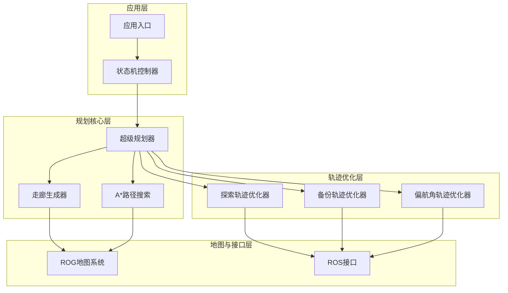

**图表来源**
- [super_planner.h](file://src/SUPER/super_planner/include/super_core/super_planner.h#L59-L122)
- [fsm.h](file://src/SUPER/super_planner/include/fsm/fsm.h#L40-L90)

**章节来源**
- [super_planner.h](file://src/SUPER/super_planner/include/super_core/super_planner.h#L55-L122)
- [fsm.h](file://src/SUPER/super_planner/include/fsm/fsm.h#L40-L90)

## 核心组件
超级规划器模块包含以下核心组件：

### 主控制器 - SuperPlanner
SuperPlanner作为整个规划系统的核心控制器，负责协调各个子模块的工作流程。其主要职责包括：
- 规划流程管理：从静止规划到重规划的完整流程控制
- 状态机协调：与FSM控制器协同工作，实现状态切换
- 轨迹生成：协调探索轨迹、备份轨迹和偏航角轨迹的生成
- 参数管理：动态参数更新与同步

### 轨迹优化系统
轨迹优化系统包含三个核心优化器：

#### 期望轨迹优化器 (ExpTrajOpt)
- 基于MINCO的多项式轨迹优化
- 支持约束条件的平滑轨迹生成
- 实时热初始化机制
- 多目标优化：能量最小化、约束满足、轨迹平滑

#### 备份轨迹生成器 (BackupTrajOpt)
- 针对紧急情况的快速轨迹生成
- 基于已知探索轨迹的增量优化
- 时间窗口约束的轨迹生成
- 实时响应能力

#### 偏航角轨迹优化器 (YawTrajOpt)
- 基于位置轨迹的速度导向偏航角规划
- 多阶多项式插值优化
- 最大偏航角速度限制
- 平滑的偏航角轨迹生成

### 路径搜索与走廊生成
- A*算法实现：支持多种启发式函数和邻域搜索策略
- 安全走廊生成：基于CIRI算法的凸多面体走廊提取
- FOV裁剪机制：结合传感器视野的走廊优化

**章节来源**
- [super_planner.h](file://src/SUPER/super_planner/include/super_core/super_planner.h#L59-L296)
- [exp_traj_optimizer_s4.h](file://src/SUPER/super_planner/include/traj_opt/exp_traj_optimizer_s4.h#L55-L371)
- [backup_traj_optimizer_s4.h](file://src/SUPER/super_planner/include/traj_opt/backup_traj_optimizer_s4.h#L52-L212)
- [yaw_traj_opt.h](file://src/SUPER/super_planner/include/traj_opt/yaw_traj_opt.h#L44-L71)

## 架构概览
超级规划器采用分层架构设计，实现了高内聚、低耦合的模块化结构：

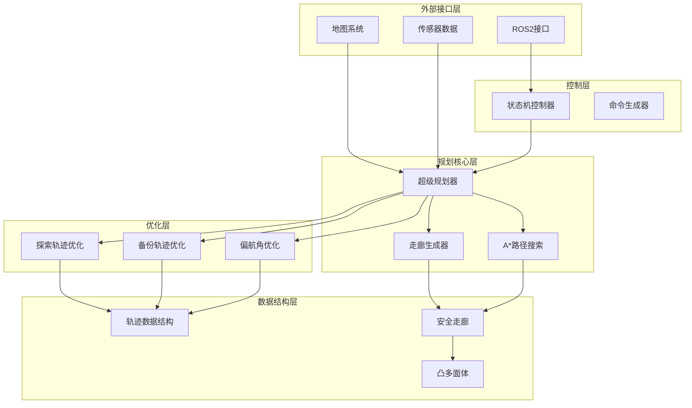

**图表来源**
- [super_planner.cpp](file://src/SUPER/super_planner/src/super_core/super_planner.cpp#L33-L74)
- [fsm.cpp](file://src/SUPER/super_planner/src/super_core/fsm.cpp#L100-L171)

**章节来源**
- [super_planner.cpp](file://src/SUPER/super_planner/src/super_core/super_planner.cpp#L33-L74)
- [fsm.cpp](file://src/SUPER/super_planner/src/super_core/fsm.cpp#L100-L171)

## 详细组件分析

### SuperPlanner主控制器实现原理

#### 规划流程设计
SuperPlanner实现了两种主要的规划策略：

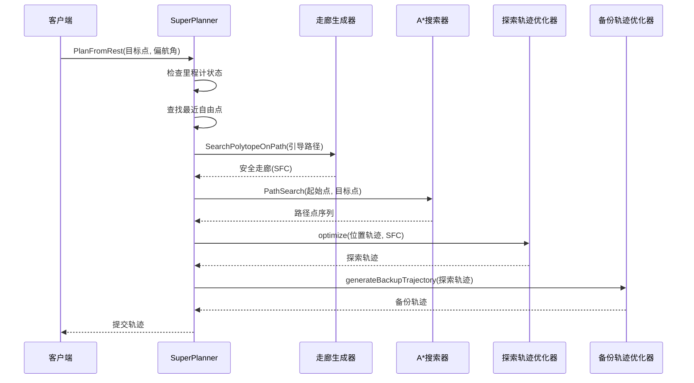

**图表来源**
- [super_planner.cpp](file://src/SUPER/super_planner/src/super_core/super_planner.cpp#L76-L175)

#### 状态机设计
超级规划器采用有限状态机(FSM)进行流程控制：

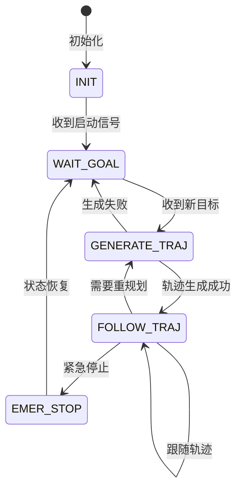

**图表来源**
- [fsm.h](file://src/SUPER/super_planner/include/fsm/fsm.h#L75-L90)

#### 返回码系统
超级规划器定义了完整的返回码系统，用于精确描述规划状态：

| 返回码 | 名称 | 描述 |
|--------|------|------|
| SUPER_SUCCESS_WITH_BACKUP | 成功，且备份轨迹也成功 | 规划成功，同时生成了有效的备份轨迹 |
| SUPER_SUCCESS_NO_BACKUP | 成功，无需备份 | 规划成功，但无需备份轨迹 |
| SUPER_SUCCESS | 成功 | 规划成功，基础状态 |
| SUPPER_UNDEFINED | 未定义 | 状态未定义 |
| SUPER_NO_ODOM | 无里程计 | 开始重规划时无里程计数据 |
| SUPER_NO_START_POINT | 无法找到起始点 | 局部地图中找不到可用起始点 |

**章节来源**
- [super_planner.cpp](file://src/SUPER/super_planner/src/super_core/super_planner.cpp#L76-L312)
- [fsm.cpp](file://src/SUPER/super_planner/src/super_core/fsm.cpp#L115-L208)
- [super_ret_code.hpp](file://src/SUPER/super_planner/include/super_core/super_ret_code.hpp#L33-L59)

### 轨迹优化系统

#### 期望轨迹优化器 (ExpTrajOpt)
期望轨迹优化器采用基于MINCO的多项式轨迹优化框架：

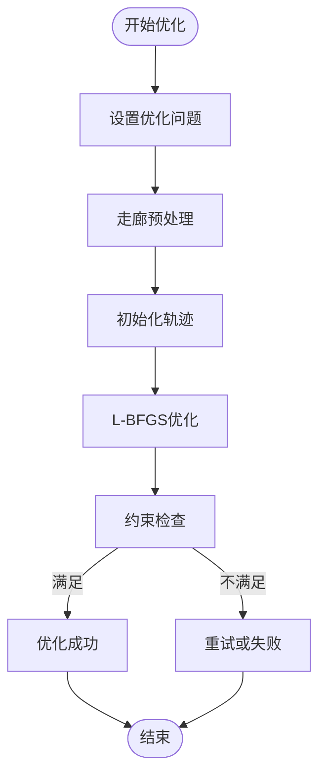

**图表来源**
- [exp_traj_optimizer_s4.cpp](file://src/SUPER/super_planner/src/traj_opt/exp_traj_optimizer_s4.cpp#L614-L760)

期望轨迹优化器的核心特性：
- **多目标优化**：能量最小化、约束满足、轨迹平滑
- **实时热初始化**：基于引导轨迹的快速初始化
- **约束处理**：位置约束、速度约束、加速度约束、偏航角约束
- **平滑处理**：使用平滑L1范数处理约束违反

#### 备份轨迹生成器 (BackupTrajOpt)
备份轨迹生成器专注于紧急情况下的快速轨迹生成：

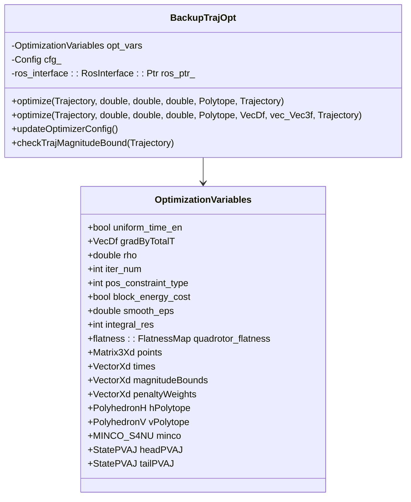

**图表来源**
- [backup_traj_optimizer_s4.h](file://src/SUPER/super_planner/include/traj_opt/backup_traj_optimizer_s4.h#L52-L212)

备份轨迹优化器的关键特性：
- **时间窗口约束**：在指定时间范围内生成轨迹
- **均匀时间分配**：可选的均匀时间分配策略
- **约束检查**：严格的物理约束验证
- **调试支持**：详细的优化过程可视化

#### 偏航角轨迹优化器 (YawTrajOpt)
偏航角轨迹优化器基于位置轨迹生成平滑的偏航角轨迹：

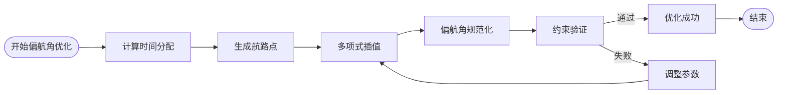

**图表来源**
- [yaw_traj_opt.cpp](file://src/SUPER/super_planner/src/traj_opt/yaw_traj_opt.cpp#L29-L97)

偏航角优化器的核心算法：
- **时间分配策略**：基于轨迹持续时间的自适应时间分配
- **航路点生成**：基于位置轨迹的速度方向生成航路点
- **多项式插值**：支持3阶、5阶、7阶多项式插值
- **偏航角规范化**：处理偏航角的连续性问题

**章节来源**
- [exp_traj_optimizer_s4.cpp](file://src/SUPER/super_planner/src/traj_opt/exp_traj_optimizer_s4.cpp#L251-L760)
- [backup_traj_optimizer_s4.cpp](file://src/SUPER/super_planner/src/traj_opt/backup_traj_optimizer_s4.cpp#L256-L584)
- [yaw_traj_opt.cpp](file://src/SUPER/super_planner/src/traj_opt/yaw_traj_opt.cpp#L29-L194)

### A*路径搜索算法实现

#### A*算法核心实现
A*路径搜索算法实现了完整的路径规划功能：

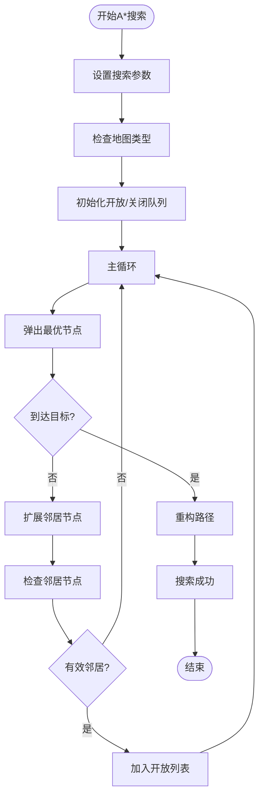

**图表来源**
- [astar.cpp](file://src/SUPER/super_planner/src/super_core/astar.cpp#L472-L670)

A*算法的关键特性：
- **多启发式函数**：支持对角线、曼哈顿、欧几里得距离
- **灵活的邻域搜索**：支持26邻域和6邻域搜索
- **未知区域处理**：支持未知区域的占用或自由假设
- **可视化支持**：完整的搜索过程可视化

#### 走廊生成机制
走廊生成器基于CIRI算法实现安全走廊的自动提取：

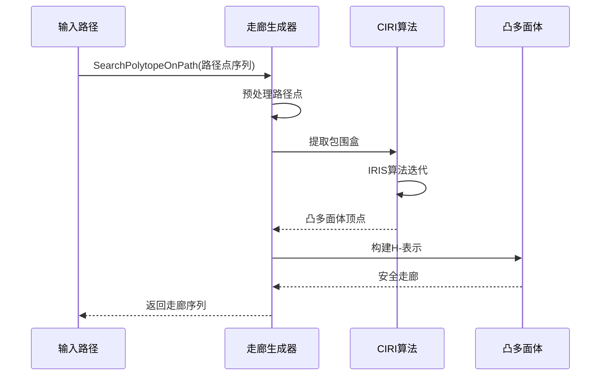

**图表来源**
- [corridor_generator.h](file://src/SUPER/super_planner/include/super_core/corridor_generator.h#L129-L131)

**章节来源**
- [astar.cpp](file://src/SUPER/super_planner/src/super_core/astar.cpp#L329-L670)
- [corridor_generator.h](file://src/SUPER/super_planner/include/super_core/corridor_generator.h#L129-L193)

## 依赖关系分析

### 组件耦合度分析
超级规划器模块展现了良好的模块化设计，各组件之间的耦合度适中：

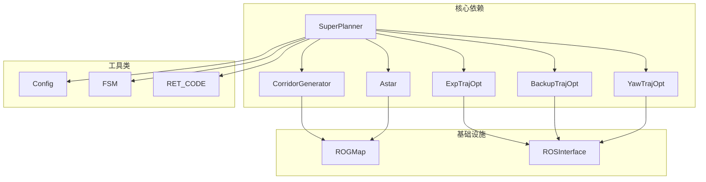

**图表来源**
- [super_planner.h](file://src/SUPER/super_planner/include/super_core/super_planner.h#L38-L70)

### 数据流分析
超级规划器的数据流呈现清晰的层次结构：

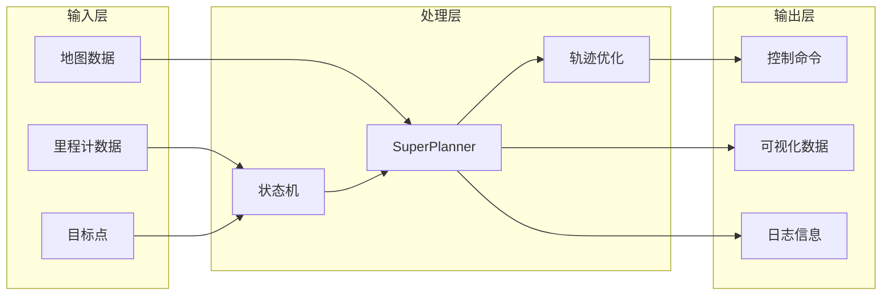

**图表来源**
- [fsm.cpp](file://src/SUPER/super_planner/src/super_core/fsm.cpp#L115-L208)

**章节来源**
- [super_planner.h](file://src/SUPER/super_planner/include/super_core/super_planner.h#L38-L70)
- [fsm.cpp](file://src/SUPER/super_planner/src/super_core/fsm.cpp#L115-L208)

## 性能考虑

### 优化策略
超级规划器采用了多层次的性能优化策略：

#### 时间复杂度优化
- **早期终止条件**：在重规划过程中实现多个早期终止检查
- **热初始化**：利用历史轨迹信息进行快速初始化
- **并行处理**：多线程优化器配置同步

#### 内存管理优化
- **对象池**：网格节点缓冲区的预分配
- **智能指针**：自动内存管理
- **共享数据**：轨迹数据的共享引用

#### 算法参数调优
关键性能参数及其推荐值：
- `replan_forward_dt`: 0.3秒（重规划前向时间步长）
- `planning_horizon`: 10.0米（规划时域长度）
- `robot_r`: 0.3米（机器人半径）
- `resolution`: 0.01米（地图分辨率）

### 性能监控
超级规划器提供了完整的性能监控机制：

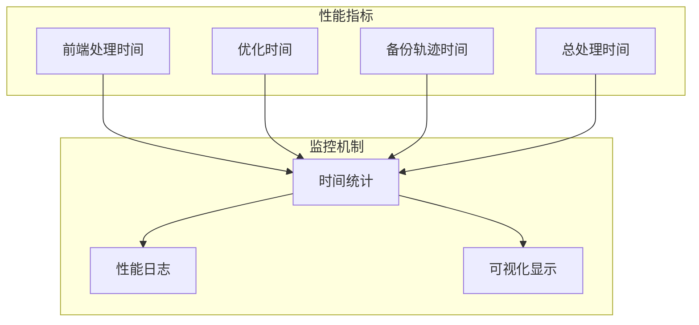

**图表来源**
- [super_planner.cpp](file://src/SUPER/super_planner/src/super_core/super_planner.cpp#L24-L61)

**章节来源**
- [super_planner.cpp](file://src/SUPER/super_planner/src/super_core/super_planner.cpp#L24-L61)
- [config.hpp](file://src/SUPER/super_planner/include/super_core/config.hpp#L158-L228)

## 故障排除指南

### 常见问题诊断
超级规划器提供了完善的错误诊断和处理机制：

#### 规划失败诊断
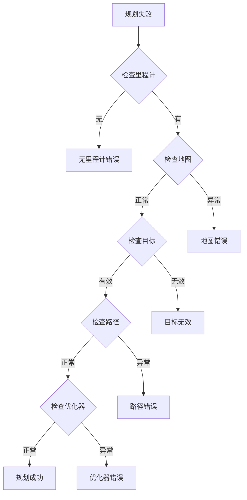

#### 错误处理策略
- **无里程计**：等待传感器数据或降级到静态规划
- **目标无效**：重新请求有效目标点
- **路径不可达**：尝试替代路径或等待环境变化
- **优化失败**：启用备份轨迹或降低性能要求

### 调试方法
超级规划器提供了多种调试和诊断工具：

#### 日志系统
- **详细日志**：开启详细日志输出以追踪规划过程
- **性能日志**：记录各模块的执行时间
- **轨迹日志**：保存生成的轨迹数据用于离线分析

#### 可视化调试
- **路径可视化**：显示A*搜索过程和生成的路径
- **走廊可视化**：显示安全走廊的生成过程
- **轨迹可视化**：实时显示生成的轨迹和控制命令

**章节来源**
- [super_planner.cpp](file://src/SUPER/super_planner/src/super_core/super_planner.cpp#L86-L174)
- [fsm.cpp](file://src/SUPER/super_planner/src/super_core/fsm.cpp#L58-L108)

## 结论
超级规划器模块是一个设计精良、功能完备的无人机轨迹规划系统。其核心优势包括：

1. **模块化设计**：清晰的分层架构和模块化组件设计
2. **高性能实现**：多层优化策略确保实时性能
3. **鲁棒性**：完善的错误处理和故障恢复机制
4. **可扩展性**：参数化的配置系统支持灵活的参数调整

该模块为四旋翼无人机在复杂环境下的自主飞行提供了可靠的轨迹规划解决方案，具有良好的工程实用价值和推广前景。

## 附录

### 使用模式示例
超级规划器支持多种使用模式：

#### 基础使用模式
```cpp
// 创建规划器实例
auto planner = std::make_shared<SuperPlanner>(config_path, ros_ptr, map_ptr);

// 设置目标点
Vec3f goal(10.0, 15.0, 2.0);
double goal_yaw = 0.0;

// 执行从静止到静止的规划
RET_CODE result = planner->PlanFromRest(goal, goal_yaw, true);
```

#### 重规划模式
```cpp
// 重规划流程
RET_CODE result = planner->ReplanOnce(goal, goal_yaw, new_goal_flag);
if (result == SUCCESS) {
    // 获取轨迹命令
    StatePVAJ pvaj;
    double yaw, yaw_dot;
    planner->getOneCommandFromTraj(pvaj, yaw, yaw_dot);
}
```

### 参数调优指南
关键参数调优建议：

#### 性能参数
- `replan_forward_dt`: 根据系统响应时间调整，建议0.2-0.5秒
- `planning_horizon`: 根据传感器范围调整，建议5-15米
- `robot_r`: 精确测量机器人尺寸，建议0.2-0.5米

#### 优化参数
- `max_vel/max_acc/max_jerk`: 基于无人机性能限制设置
- `penna_pos/penna_vel/penna_acc`: 约束权重平衡，建议0.1-1.0
- `smooth_eps`: 平滑因子，建议0.01-0.1

#### 调试参数
- `print_log`: 开发阶段设为true，生产环境设为false
- `visualization_en`: 调试时启用，运行时可关闭
- `save_log_en`: 性能分析时启用

**章节来源**
- [config.hpp](file://src/SUPER/super_planner/include/super_core/config.hpp#L96-L228)
- [super_planner.cpp](file://src/SUPER/super_planner/src/super_core/super_planner.cpp#L241-L295)