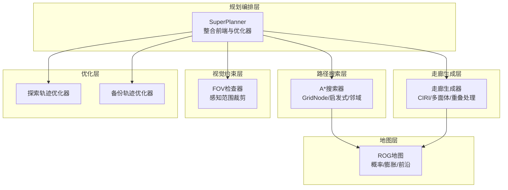
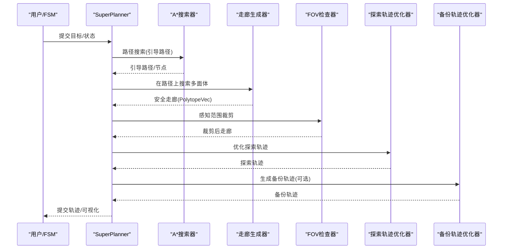
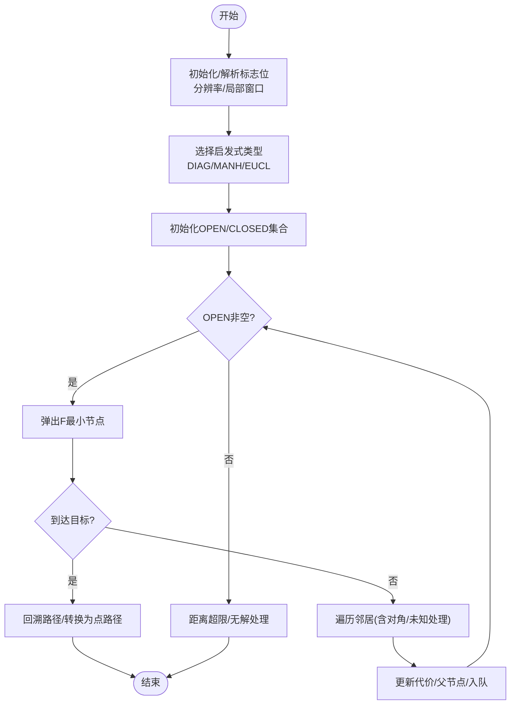
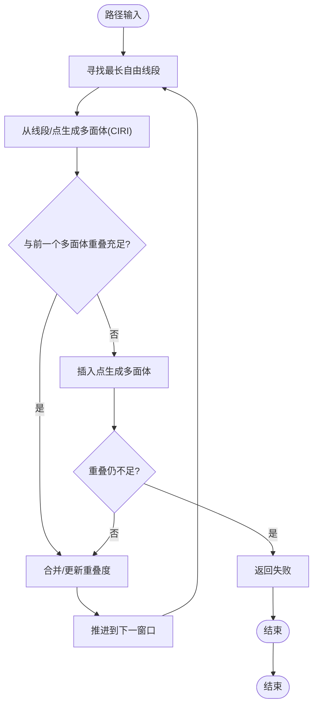
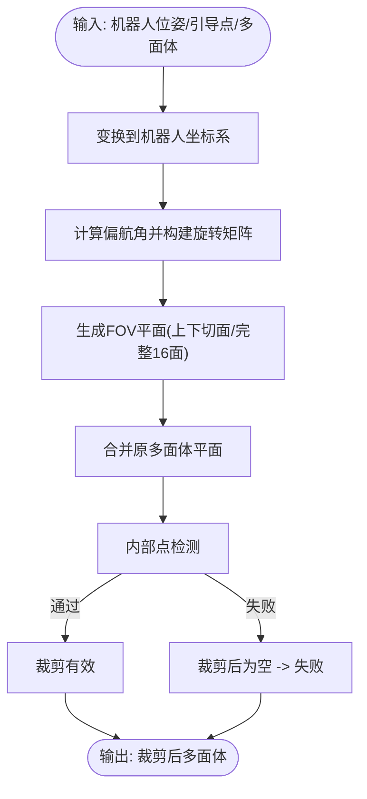
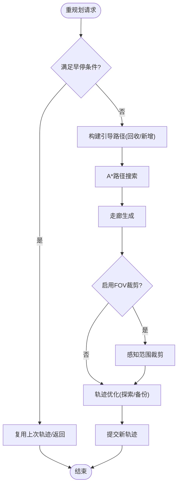
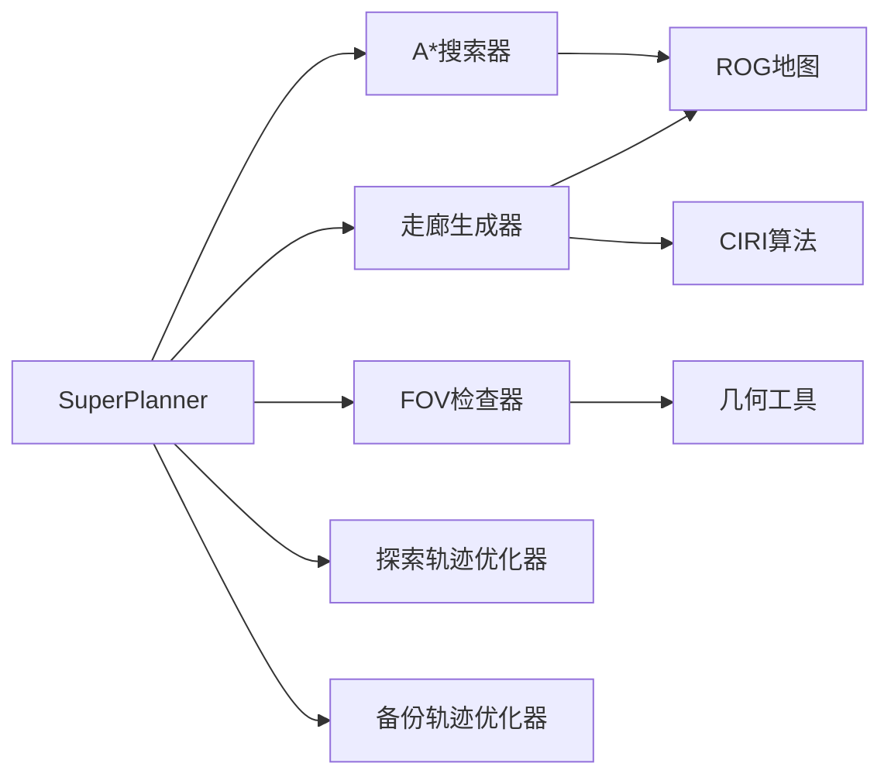

# 路径搜索与走廊生成

<cite>
**本文档引用的文件**
- [astar.h](file://src/SUPER/super_planner/include/path_search/astar.h)
- [astar.cpp](file://src/SUPER/super_planner/src/super_core/astar.cpp)
- [config.hpp](file://src/SUPER/super_planner/include/super_core/config.hpp)
- [super_planner.h](file://src/SUPER/super_planner/include/super_core/super_planner.h)
- [super_planner.cpp](file://src/SUPER/super_planner/src/super_core/super_planner.cpp)
- [corridor_generator.h](file://src/SUPER/super_planner/include/super_core/corridor_generator.h)
- [corridor_generator.cpp](file://src/SUPER/super_planner/src/super_core/corridor_generator.cpp)
- [fov_checker.h](file://src/SUPER/super_planner/include/super_core/fov_checker.h)
- [click.yaml](file://src/SUPER/super_planner/config/click.yaml)
- [super_ret_code.hpp](file://src/SUPER/super_planner/include/super_core/super_ret_code.hpp)
</cite>

## 目录
1. [简介](#简介)
2. [项目结构](#项目结构)
3. [核心组件](#核心组件)
4. [架构总览](#架构总览)
5. [详细组件分析](#详细组件分析)
6. [依赖关系分析](#依赖关系分析)
7. [性能考量](#性能考量)
8. [故障排查指南](#故障排查指南)
9. [结论](#结论)
10. [附录](#附录)

## 简介
本文件面向路径搜索与走廊生成系统，围绕A*路径搜索算法、走廊生成机制、FOV检查器以及参数配置展开，提供从代码级到系统级的完整技术说明。内容涵盖：
- A*启发式函数设计、搜索空间建模与路径优化策略
- 走廊生成的安全边界计算、障碍物避让与动态调整
- FOV检查器的几何裁剪与视觉约束满足
- 参数配置与实时重规划的性能优化与内存管理
- 路径质量评估指标与调试工具使用

## 项目结构
该系统位于超级规划器模块中，主要由以下层次构成：
- 路径搜索层：A*搜索器，负责离散网格上的路径规划
- 走廊生成层：基于CIRI的多面体提取，生成安全飞行走廊
- 视觉约束层：FOV检查器，按感知范围裁剪走廊
- 规划编排层：SuperPlanner，整合前端路径、走廊与优化器，驱动轨迹生成与重规划

图表来源
- [super_planner.h](file://src/SUPER/super_planner/include/super_core/super_planner.h#L59-L122)
- [astar.h](file://src/SUPER/super_planner/include/path_search/astar.h#L79-L163)
- [corridor_generator.h](file://src/SUPER/super_planner/include/super_core/corridor_generator.h#L56-L131)
- [fov_checker.h](file://src/SUPER/super_planner/include/super_core/fov_checker.h#L41-L130)

章节来源
- [super_planner.h](file://src/SUPER/super_planner/include/super_core/super_planner.h#L59-L122)
- [astar.h](file://src/SUPER/super_planner/include/path_search/astar.h#L79-L163)
- [corridor_generator.h](file://src/SUPER/super_planner/include/super_core/corridor_generator.h#L56-L131)
- [fov_checker.h](file://src/SUPER/super_planner/include/super_core/fov_checker.h#L41-L130)

## 核心组件
- A*搜索器：基于网格的启发式搜索，支持对角/曼哈顿/欧氏启发式，局部窗口与邻域缓存，未知区域处理策略
- 走廊生成器：基于种子线/点的多面体提取，处理重叠与连续性，支持虚拟边界与IRIS迭代
- FOV检查器：基于锥形/全向视场模型的几何裁剪，结合感知范围与姿态约束
- SuperPlanner：统一调度路径搜索、走廊生成、轨迹优化与可视化，支持重规划与参数热更新

章节来源
- [astar.h](file://src/SUPER/super_planner/include/path_search/astar.h#L44-L163)
- [corridor_generator.h](file://src/SUPER/super_planner/include/super_core/corridor_generator.h#L56-L193)
- [fov_checker.h](file://src/SUPER/super_planner/include/super_core/fov_checker.h#L41-L287)
- [super_planner.h](file://src/SUPER/super_planner/include/super_core/super_planner.h#L59-L296)

## 架构总览
整体流程：SuperPlanner接收机器人状态与目标，通过A*生成引导路径，走廊生成器在路径上提取安全多面体，FOV检查器按感知约束裁剪，随后进入轨迹优化器生成探索/备份轨迹并提交执行。

图表来源
- [super_planner.cpp](file://src/SUPER/super_planner/src/super_core/super_planner.cpp#L387-L800)
- [astar.cpp](file://src/SUPER/super_planner/src/super_core/astar.cpp#L329-L670)
- [corridor_generator.cpp](file://src/SUPER/super_planner/src/super_core/corridor_generator.cpp#L62-L216)
- [fov_checker.h](file://src/SUPER/super_planner/include/super_core/fov_checker.h#L66-L130)

## 详细组件分析

### A*路径搜索算法
- 启发式函数
  - 对角线距离：适合允许8方向移动的网格，计算快
  - 曼哈顿距离：仅水平/垂直，计算最快
  - 欧几里得距离：直线距离，路径质量最优
- 搜索空间建模
  - 局部窗口：以起/终点为中心，按分辨率设定窗口大小
  - 邻域扩展：支持对角/非对角扩展，未知区域可按策略处理
  - 距离终止：当累计代价超过搜索半径时提前返回
- 路径优化策略
  - 节点哈希定位与缓冲复用，减少分配开销
  - 精细膨胀邻域：根据机器人半径与分辨率设置邻域步长
  - 前沿队列：在未知区域作为“边界”记录，便于回溯与终止

图表来源
- [astar.cpp](file://src/SUPER/super_planner/src/super_core/astar.cpp#L83-L140)
- [astar.cpp](file://src/SUPER/super_planner/src/super_core/astar.cpp#L471-L670)

章节来源
- [astar.h](file://src/SUPER/super_planner/include/path_search/astar.h#L116-L162)
- [astar.cpp](file://src/SUPER/super_planner/src/super_core/astar.cpp#L149-L191)
- [astar.cpp](file://src/SUPER/super_planner/src/super_core/astar.cpp#L329-L670)

### 走廊生成机制
- 安全边界计算
  - 以种子线/点为中心，按机器人半径与边界距离生成包围盒
  - 通过CIRI算法进行凸多面体分解，得到走廊的平面表示
- 障碍物避让与连续性
  - 逐段搜索最长自由线段，避免过长导致分解失败
  - 多面体重叠不足时插入点生成的多面体以保证连续性
  - 支持与前一/前前个多面体的合并，提升效率
- 动态调整策略
  - 虚拟地面/天花板高度与机器人半径参与边界修正
  - IRIS迭代次数影响分解稳定性与耗时

图表来源
- [corridor_generator.cpp](file://src/SUPER/super_planner/src/super_core/corridor_generator.cpp#L62-L216)
- [corridor_generator.cpp](file://src/SUPER/super_planner/src/super_core/corridor_generator.cpp#L351-L423)

章节来源
- [corridor_generator.h](file://src/SUPER/super_planner/include/super_core/corridor_generator.h#L129-L168)
- [corridor_generator.cpp](file://src/SUPER/super_planner/src/super_core/corridor_generator.cpp#L62-L216)
- [corridor_generator.cpp](file://src/SUPER/super_planner/src/super_core/corridor_generator.cpp#L351-L423)

### FOV检查器与视觉约束
- FOV类型与参数
  - 全向视场：上下俯仰角定义视场范围
  - 锥形视场：视场角定义观测范围
- 几何裁剪流程
  - 将引导点变换到机器人坐标系，结合姿态计算偏航角
  - 生成FOV平面（上下切面或完整16侧面），与多面体平面合并
  - 通过内部点检测保证裁剪后多面体非空
- 感知范围裁剪
  - 基于感知距离构建裁剪平面，进一步限制可行区域

图表来源
- [fov_checker.h](file://src/SUPER/super_planner/include/super_core/fov_checker.h#L102-L130)
- [fov_checker.h](file://src/SUPER/super_planner/include/super_core/fov_checker.h#L139-L287)

章节来源
- [fov_checker.h](file://src/SUPER/super_planner/include/super_core/fov_checker.h#L41-L287)

### 参数配置与实时重规划
- 关键参数
  - 规划时域/前瞻距离/递减距离：控制重规划范围与保守程度
  - 机器人半径/IRIS迭代次数/走廊边界距离：影响走廊生成稳定性与体积
  - 感知范围/FOV裁剪开关：决定是否引入视觉约束
  - 采样步长/分辨率：决定轨迹密度与计算负载
- 实时重规划策略
  - 早停条件：重规划状态超过已提交轨迹或接近目标时直接复用
  - 热初始化：利用上次轨迹片段与状态作为初值，加速收敛
  - 参数热更新：运行时从ROS2参数服务器同步边界与优化参数

图表来源
- [super_planner.cpp](file://src/SUPER/super_planner/src/super_core/super_planner.cpp#L387-L800)
- [config.hpp](file://src/SUPER/super_planner/include/super_core/config.hpp#L96-L228)

章节来源
- [config.hpp](file://src/SUPER/super_planner/include/super_core/config.hpp#L44-L235)
- [super_planner.cpp](file://src/SUPER/super_planner/src/super_core/super_planner.cpp#L387-L800)
- [click.yaml](file://src/SUPER/super_planner/config/click.yaml#L15-L120)

## 依赖关系分析
- SuperPlanner依赖A*搜索器、走廊生成器、FOV检查器与轨迹优化器
- A*依赖ROG地图（概率/膨胀/前沿）与可视化接口
- 走廊生成器依赖CIRI算法与地图的包围盒/线段自由性检测
- FOV检查器依赖几何工具与多面体内部点检测

图表来源
- [super_planner.h](file://src/SUPER/super_planner/include/super_core/super_planner.h#L38-L52)
- [astar.h](file://src/SUPER/super_planner/include/path_search/astar.h#L79-L84)
- [corridor_generator.h](file://src/SUPER/super_planner/include/super_core/corridor_generator.h#L30-L37)
- [fov_checker.h](file://src/SUPER/super_planner/include/super_core/fov_checker.h#L27-L30)

章节来源
- [super_planner.h](file://src/SUPER/super_planner/include/super_core/super_planner.h#L38-L52)
- [astar.h](file://src/SUPER/super_planner/include/path_search/astar.h#L79-L84)
- [corridor_generator.h](file://src/SUPER/super_planner/include/super_core/corridor_generator.h#L30-L37)
- [fov_checker.h](file://src/SUPER/super_planner/include/super_core/fov_checker.h#L27-L30)

## 性能考量
- A*搜索
  - 启发式选择：欧氏距离路径质量最优；对角扩展需权衡精度与速度
  - 局部窗口与邻域缓存：显著降低重复分配与查找成本
  - 未知区域处理：合理设置“前沿”策略，避免盲目扩展
- 走廊生成
  - IRIS迭代次数与包围盒尺寸：平衡稳定性与耗时
  - 种子线长度限制：防止分解失败与过度计算
  - 重叠阈值与连续性修复：提升走廊连通性与安全性
- FOV裁剪
  - 平面数量与内部点检测：全向视场平面较多，注意优化
  - 裁剪顺序与合并：尽量减少平面数量
- 重规划
  - 早停与热初始化：大幅缩短重规划周期
  - 参数热更新：避免频繁重启优化器

[本节为通用性能指导，不直接分析具体文件]

## 故障排查指南
- A*搜索失败
  - 起/终点深占：检查局部起点/终点修正逻辑与最近自由点查询
  - 超时/无解：确认搜索半径、启发式类型与邻域设置
  - 未知区域：评估未知为占/自由策略是否合理
- 走廊生成失败
  - 种子线过长：缩短线段或增加包围盒跳过数量
  - CIRI分解失败：检查边界修正与IRIS迭代次数
  - 连续性不足：启用点生成多面体修复并调整重叠阈值
- FOV裁剪异常
  - 裁剪后为空：检查姿态/感知范围参数与平面方向
  - 平面过多：考虑合并策略与平面数量上限
- 重规划卡顿
  - 早停条件：确认重规划状态与轨迹边界判断
  - 参数同步：确保运行时参数热更新生效

章节来源
- [astar.cpp](file://src/SUPER/super_planner/src/super_core/astar.cpp#L366-L396)
- [corridor_generator.cpp](file://src/SUPER/super_planner/src/super_core/corridor_generator.cpp#L123-L128)
- [fov_checker.h](file://src/SUPER/super_planner/include/super_core/fov_checker.h#L86-L92)
- [super_planner.cpp](file://src/SUPER/super_planner/src/super_core/super_planner.cpp#L432-L498)

## 结论
本系统通过A*路径搜索、CIRI走廊生成与FOV视觉约束的协同，实现了在复杂环境中安全高效的轨迹规划。通过合理的参数配置、早停与热初始化策略，系统能够在实时性与路径质量之间取得良好平衡。建议在部署时重点关注：
- 启发式与邻域设置以匹配任务场景
- 走廊边界与IRIS参数以兼顾稳定性与效率
- FOV参数与感知范围以满足视觉约束
- 运行时参数热更新与可视化调试工具以快速迭代

[本节为总结性内容，不直接分析具体文件]

## 附录
- 路径质量评估指标（建议）
  - 路径长度与曲率积分
  - 走廊重叠度与连续性
  - 重规划频率与平均耗时
  - 可视化与日志辅助分析
- 调试工具使用
  - 可视化：路径、走廊、多面体、FOV平面
  - 日志：模块耗时统计、早停原因、参数同步状态
  - 参数：从配置文件与ROS2参数服务器加载/更新

章节来源
- [config.hpp](file://src/SUPER/super_planner/include/super_core/config.hpp#L158-L228)
- [click.yaml](file://src/SUPER/super_planner/config/click.yaml#L15-L120)
- [super_ret_code.hpp](file://src/SUPER/super_planner/include/super_core/super_ret_code.hpp#L33-L59)