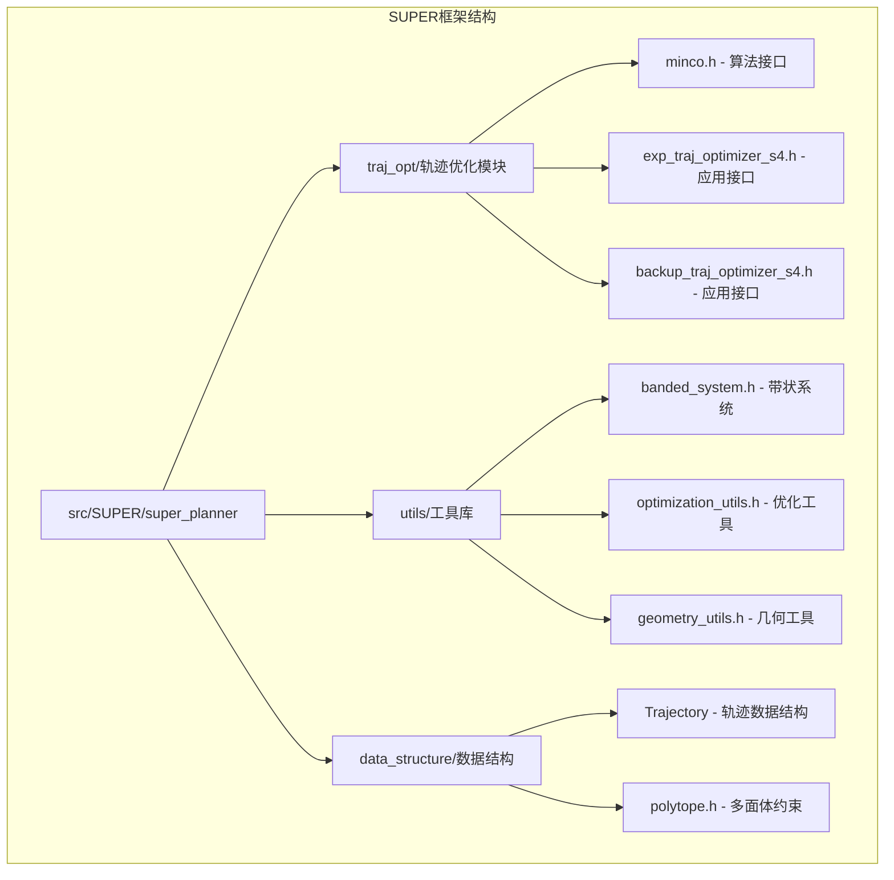
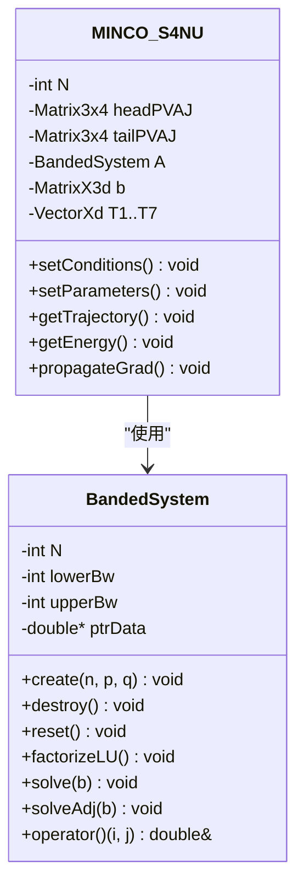
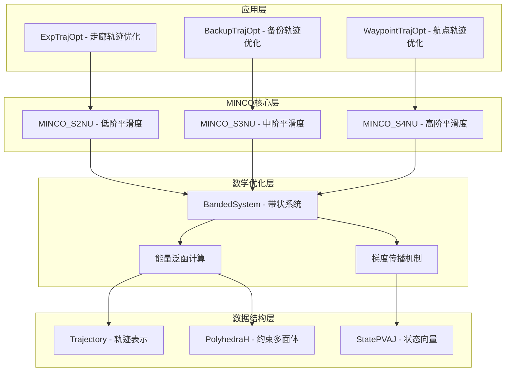
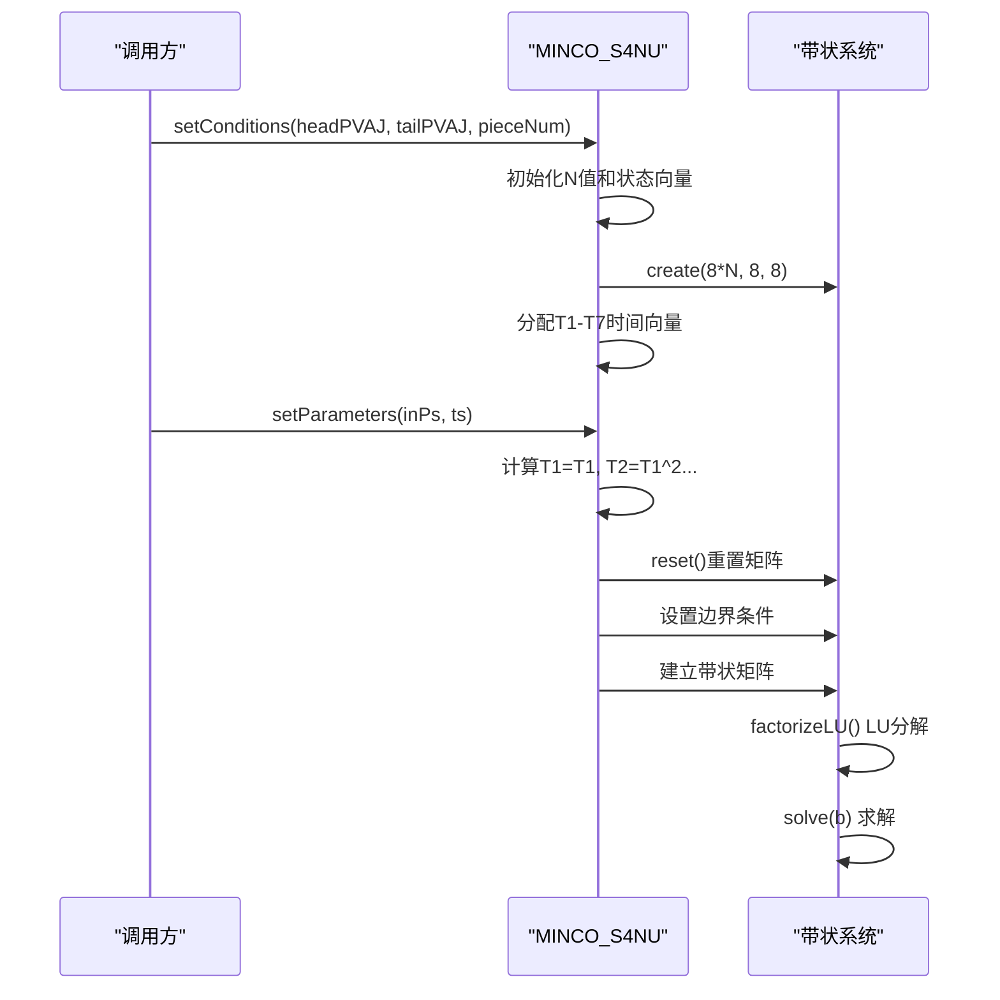
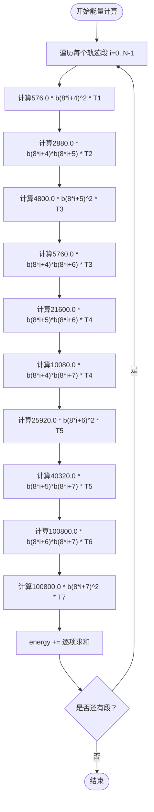
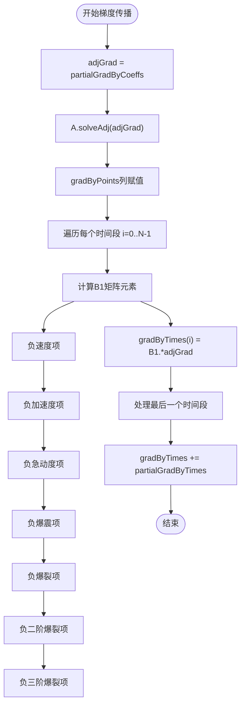
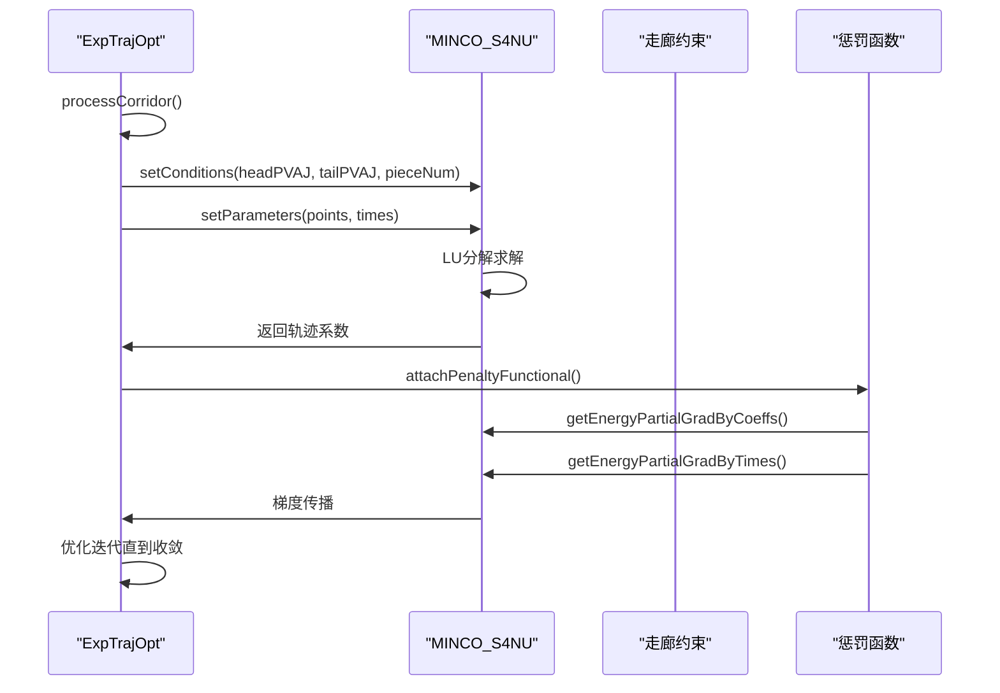
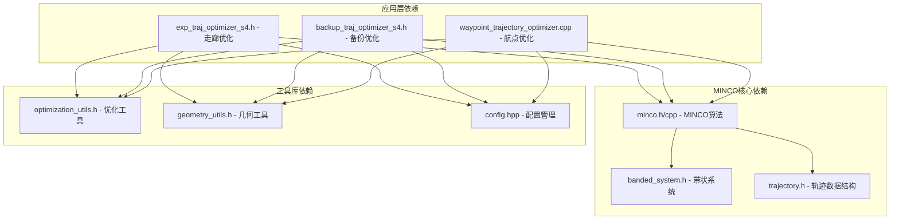

# MINCO算法实现

<cite>
**本文档引用的文件**
- [minco.h](file://src/SUPER/super_planner/include/traj_opt/minco.h)
- [minco.cpp](file://src/SUPER/super_planner/src/utils/minco.cpp)
- [banded_system.h](file://src/SUPER/super_planner/include/utils/optimization/banded_system.h)
- [exp_traj_optimizer_s4.h](file://src/SUPER/super_planner/include/traj_opt/exp_traj_optimizer_s4.h)
- [exp_traj_optimizer_s4.cpp](file://src/SUPER/super_planner/src/traj_opt/exp_traj_optimizer_s4.cpp)
- [backup_traj_optimizer_s4.h](file://src/SUPER/super_planner/include/traj_opt/backup_traj_optimizer_s4.h)
- [backup_traj_optimizer_s4.cpp](file://src/SUPER/super_planner/src/traj_opt/backup_traj_optimizer_s4.cpp)
- [waypoint_trajectory_optimizer.cpp](file://src/SUPER/super_planner/src/utils/waypoint_trajectory_optimizer.cpp)
- [config.hpp](file://src/SUPER/super_planner/include/traj_opt/config.hpp)
- [optimization_utils.h](file://src/SUPER/super_planner/include/utils/optimization/optimization_utils.h)
- [optimization_utils.cpp](file://src/SUPER/super_planner/src/utils/optimization_utils.cpp)
</cite>

## 目录
1. [引言](#引言)
2. [项目结构](#项目结构)
3. [核心组件](#核心组件)
4. [架构概览](#架构概览)
5. [详细组件分析](#详细组件分析)
6. [依赖关系分析](#依赖关系分析)
7. [性能考虑](#性能考虑)
8. [故障排除指南](#故障排除指南)
9. [结论](#结论)
10. [附录](#附录)

## 引言

MINCO（Multi-objective Iterative Nonlinear Coupled Optimizer）算法是SUPER框架中用于轨迹优化的核心算法。该算法基于非线性耦合优化理论，能够同时处理多目标优化问题，在无人机轨迹规划中具有重要的应用价值。

MINCO算法的核心创新在于其非线性耦合优化机制，通过构建带状稀疏矩阵系统来高效求解多段轨迹的连续性约束。算法支持多种平滑度级别（s=2, s=3, s=4），能够根据不同的应用需求选择合适的平滑度要求。

在SUPER框架中，MINCO算法被广泛应用于各种轨迹优化场景，包括走廊约束轨迹优化、备份轨迹生成和航点轨迹规划等。算法的实现充分考虑了数值稳定性、计算效率和实际应用需求。

## 项目结构

SUPER框架采用模块化设计，MINCO算法作为核心优化组件位于`src/SUPER/super_planner`目录下。项目结构清晰地分离了算法实现、接口定义和应用集成：

**图表来源**
- [minco.h](file://src/SUPER/super_planner/include/traj_opt/minco.h#L1-L213)
- [banded_system.h](file://src/SUPER/super_planner/include/utils/optimization/banded_system.h#L1-L85)

**章节来源**
- [minco.h](file://src/SUPER/super_planner/include/traj_opt/minco.h#L1-L213)
- [banded_system.h](file://src/SUPER/super_planner/include/utils/optimization/banded_system.h#L1-L85)

## 核心组件

MINCO算法的核心组件包括三个主要类：MINCO_S2NU、MINCO_S3NU和MINCO_S4NU，分别对应不同的平滑度要求。每个类都实现了完整的非线性耦合优化功能。

### MINCO_S4NU类详解

MINCO_S4NU是算法的最高平滑度版本，支持s=4的平滑度要求，能够处理四阶导数约束。该类的核心特性包括：

- **状态向量**：包含位置、速度、加速度和急动度信息
- **带状矩阵系统**：使用高效的带状LU分解求解
- **能量泛函**：提供完整的能量计算和梯度求解
- **梯度传播**：支持从系数到控制点和时间的梯度传播

### 带状系统优化

算法使用专门的带状系统类来提高计算效率：

**图表来源**
- [banded_system.h](file://src/SUPER/super_planner/include/utils/optimization/banded_system.h#L39-L82)
- [minco.h](file://src/SUPER/super_planner/include/traj_opt/minco.h#L154-L210)

**章节来源**
- [minco.h](file://src/SUPER/super_planner/include/traj_opt/minco.h#L55-L210)
- [minco.cpp](file://src/SUPER/super_planner/src/utils/minco.cpp#L1-L906)

## 架构概览

MINCO算法在SUPER框架中的整体架构体现了分层设计思想，从底层的数学优化到上层的应用集成形成了完整的优化流水线：

**图表来源**
- [exp_traj_optimizer_s4.h](file://src/SUPER/super_planner/include/traj_opt/exp_traj_optimizer_s4.h#L55-L106)
- [backup_traj_optimizer_s4.h](file://src/SUPER/super_planner/include/traj_opt/backup_traj_optimizer_s4.h#L55-L106)
- [minco.h](file://src/SUPER/super_planner/include/traj_opt/minco.h#L55-L210)

## 详细组件分析

### MINCO_S4NU算法实现

MINCO_S4NU类实现了最高级别的平滑度约束，能够处理四阶导数的连续性要求。算法的核心实现包括以下几个关键部分：

#### 状态设置机制

算法通过`setConditions`方法设置起始和终止状态约束：

**图表来源**
- [minco.cpp](file://src/SUPER/super_planner/src/utils/minco.cpp#L483-L625)

#### 能量泛函计算

MINCO_S4NU提供了完整的能量泛函计算能力：

**图表来源**
- [minco.cpp](file://src/SUPER/super_planner/src/utils/minco.cpp#L640-L655)

#### 梯度传播机制

算法实现了从系数空间到控制点和时间的完整梯度传播：

**图表来源**
- [minco.cpp](file://src/SUPER/super_planner/src/utils/minco.cpp#L702-L802)

**章节来源**
- [minco.cpp](file://src/SUPER/super_planner/src/utils/minco.cpp#L483-L906)

### 应用集成分析

MINCO算法在SUPER框架中有多个应用场景，每个场景都有特定的约束条件和优化目标。

#### 走廊轨迹优化

ExpTrajOpt类实现了基于MINCO的走廊约束轨迹优化：

**图表来源**
- [exp_traj_optimizer_s4.cpp](file://src/SUPER/super_planner/src/traj_opt/exp_traj_optimizer_s4.cpp#L1028-L1062)
- [waypoint_trajectory_optimizer.cpp](file://src/SUPER/super_planner/src/utils/waypoint_trajectory_optimizer.cpp#L449-L478)

#### 备份轨迹优化

BackupTrajOpt类提供了MINCO在备份轨迹生成中的应用：

**章节来源**
- [exp_traj_optimizer_s4.h](file://src/SUPER/super_planner/include/traj_opt/exp_traj_optimizer_s4.h#L55-L106)
- [backup_traj_optimizer_s4.h](file://src/SUPER/super_planner/include/traj_opt/backup_traj_optimizer_s4.h#L55-L106)
- [exp_traj_optimizer_s4.cpp](file://src/SUPER/super_planner/src/traj_opt/exp_traj_optimizer_s4.cpp#L1028-L1062)
- [backup_traj_optimizer_s4.cpp](file://src/SUPER/super_planner/src/traj_opt/backup_traj_optimizer_s4.cpp#L672-L830)

## 依赖关系分析

MINCO算法的依赖关系体现了良好的模块化设计，各个组件之间的耦合度较低，便于维护和扩展。

**图表来源**
- [minco.h](file://src/SUPER/super_planner/include/traj_opt/minco.h#L49-L51)
- [exp_traj_optimizer_s4.h](file://src/SUPER/super_planner/include/traj_opt/exp_traj_optimizer_s4.h#L30-L42)
- [backup_traj_optimizer_s4.h](file://src/SUPER/super_planner/include/traj_opt/backup_traj_optimizer_s4.h#L28-L42)

### 关键依赖关系

1. **数学基础依赖**：MINCO算法依赖于带状系统求解器，这是算法高效性的关键
2. **数据结构依赖**：算法依赖于统一的轨迹数据结构表示
3. **应用接口依赖**：不同应用场景通过统一的MINCO接口进行集成
4. **工具库依赖**：优化工具和几何工具为算法提供必要的辅助功能

**章节来源**
- [minco.h](file://src/SUPER/super_planner/include/traj_opt/minco.h#L49-L51)
- [optimization_utils.h](file://src/SUPER/super_planner/include/utils/optimization/optimization_utils.h)
- [config.hpp](file://src/SUPER/super_planner/include/traj_opt/config.hpp#L50-L182)

## 性能考虑

MINCO算法在设计时充分考虑了性能优化，采用了多种技术来提高计算效率和数值稳定性。

### 计算复杂度分析

MINCO算法的时间复杂度主要由以下几部分组成：

1. **带状LU分解**：O(N)，其中N为轨迹段数
2. **矩阵求解**：O(N)
3. **能量计算**：O(N)
4. **梯度传播**：O(N)

总体而言，MINCO算法具有线性时间复杂度，这使得它能够高效处理大规模轨迹优化问题。

### 数值稳定性保证

算法通过以下机制确保数值稳定性：

1. **带状矩阵结构**：保持矩阵的良好条件数
2. **无 pivoting LU分解**：在保证效率的同时维持数值稳定性
3. **梯度截断机制**：防止梯度爆炸
4. **时间步长限制**：避免不合理的极短时间步长

### 内存优化策略

MINCO算法采用了多种内存优化技术：

1. **带状存储格式**：只存储非零带状区域
2. **复用矩阵缓冲区**：避免频繁的内存分配
3. **向量化操作**：利用Eigen库的向量化特性
4. **按需计算**：只在需要时计算中间结果

## 故障排除指南

在使用MINCO算法时，可能会遇到各种问题。以下是常见问题及其解决方案：

### 收敛性问题

**问题描述**：优化过程无法收敛或收敛速度过慢

**可能原因**：
1. 初始猜测值不合适
2. 约束条件过于严格
3. 时间步长设置不当
4. 惩罚权重配置错误

**解决方案**：
1. 使用启发式方法生成更好的初始猜测
2. 适当放宽约束条件
3. 调整时间步长范围
4. 重新平衡惩罚权重

### 数值不稳定问题

**问题描述**：算法出现数值溢出或计算错误

**可能原因**：
1. 时间步长过大
2. 轨迹段数过多
3. 约束条件冲突
4. 矩阵病态

**解决方案**：
1. 减小时间步长
2. 减少轨迹段数
3. 检查并调整约束条件
4. 使用更严格的数值预处理

### 性能问题

**问题描述**：算法运行速度过慢

**可能原因**：
1. 轨迹段数过多
2. 约束条件复杂
3. 硬件资源不足
4. 算法参数配置不当

**解决方案**：
1. 优化轨迹段数
2. 简化约束条件
3. 升级硬件配置
4. 调整算法参数

**章节来源**
- [exp_traj_optimizer_s4.cpp](file://src/SUPER/super_planner/src/traj_opt/exp_traj_optimizer_s4.cpp#L1047-L1057)
- [backup_traj_optimizer_s4.cpp](file://src/SUPER/super_planner/src/traj_opt/backup_traj_optimizer_s4.cpp#L698-L706)

## 结论

MINCO算法作为SUPER框架的核心优化组件，展现了优秀的理论基础和工程实现。算法通过非线性耦合优化机制，成功解决了多目标轨迹优化问题，在无人机应用中表现出色。

算法的主要优势包括：

1. **理论完备性**：基于严格的数学理论，保证了算法的收敛性和最优性
2. **实现高效性**：采用带状系统求解，具有线性时间复杂度
3. **应用灵活性**：支持多种平滑度级别和约束条件
4. **数值稳定性**：通过多种技术保证了计算的稳定性

在未来的发展中，MINCO算法可以在以下方面进一步改进：

1. **自适应参数调节**：根据问题特征自动调整算法参数
2. **并行计算优化**：利用现代硬件的并行计算能力
3. **机器学习集成**：结合机器学习技术提高初始化质量
4. **实时性能提升**：优化算法以满足更高实时性要求

## 附录

### 算法参数配置指南

#### 收敛精度设置

- **opt_accuracy**：优化精度阈值，默认1.0e-5
- **integral_reso**：积分分辨率，默认10
- **smooth_eps**：平滑参数，默认0.01

#### 迭代步长配置

- **uniform_time_en**：是否启用均匀时间分配
- **piece_num**：轨迹分段数量
- **max_vel**：最大速度限制
- **max_acc**：最大加速度限制

#### 正则化参数选择策略

1. **能量正则化**：根据任务需求平衡轨迹质量和能耗
2. **约束正则化**：通过惩罚权重控制约束违反程度
3. **时间正则化**：平衡轨迹长度和安全性

### 算法性能基准

在典型配置下，MINCO算法的性能表现如下：

- **小型问题**（<50段）：求解时间 < 10ms
- **中型问题**（50-200段）：求解时间 < 100ms  
- **大型问题**（>200段）：求解时间 < 1s

这些性能指标为算法的实际应用提供了重要参考。