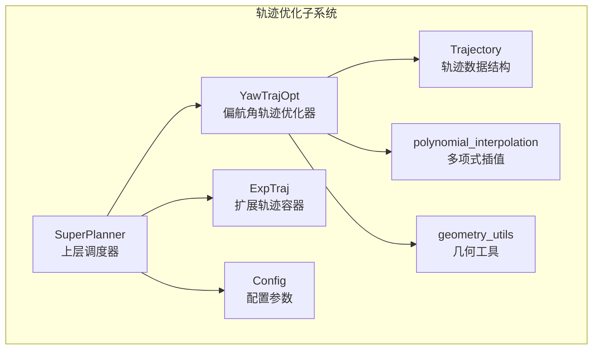
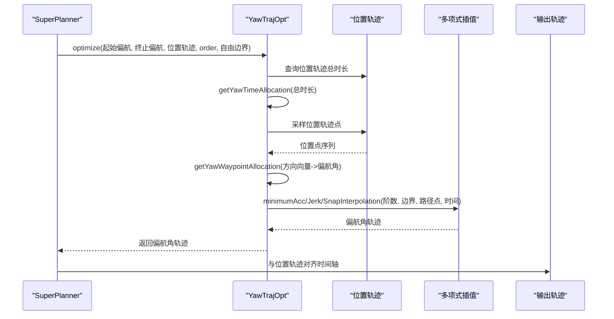
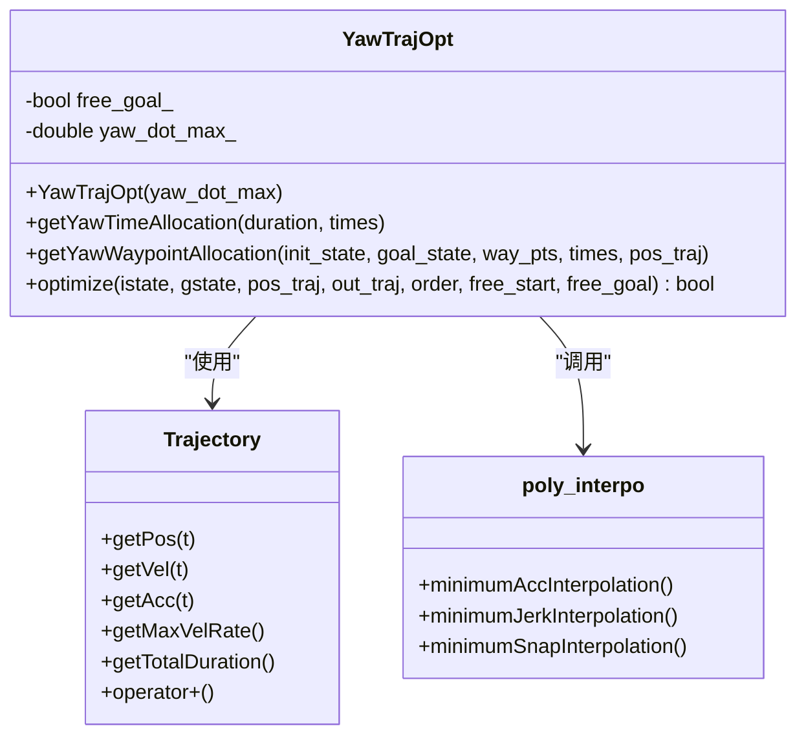
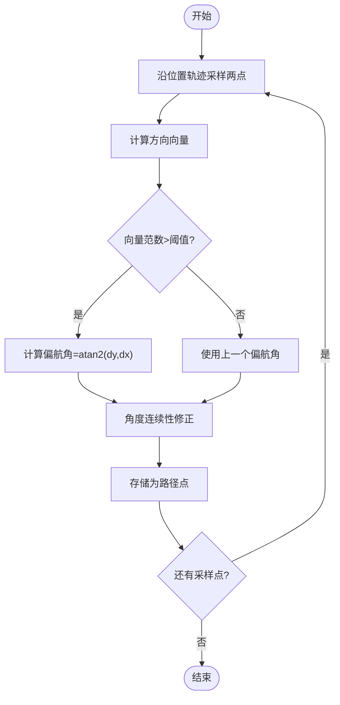
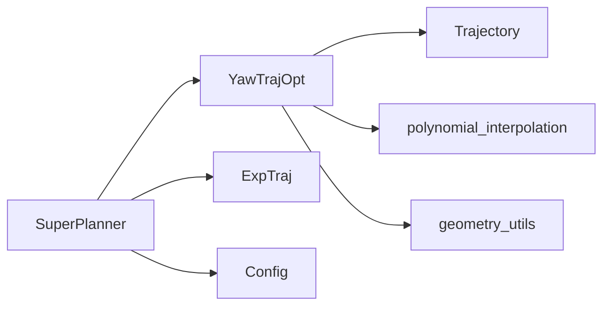

# 偏航角轨迹优化器

<cite>
**本文档引用的文件**
- [yaw_traj_opt.h](file://src/SUPER/super_planner/include/traj_opt/yaw_traj_opt.h)
- [yaw_traj_opt.cpp](file://src/SUPER/super_planner/src/traj_opt/yaw_traj_opt.cpp)
- [trajectory.h](file://src/SUPER/super_planner/include/data_structure/base/trajectory.h)
- [polynomial_interpolation.h](file://src/SUPER/super_planner/include/utils/optimization/polynomial_interpolation.h)
- [geometry_utils.h](file://src/SUPER/super_planner/include/utils/geometry/geometry_utils.h)
- [geometry_utils.cpp](file://src/SUPER/super_planner/src/utils/geometry_utils.cpp)
- [config.hpp](file://src/SUPER/super_planner/include/traj_opt/config.hpp)
- [super_planner.h](file://src/SUPER/super_planner/include/super_core/super_planner.h)
- [exp_traj.h](file://src/SUPER/super_planner/include/data_structure/exp_traj.h)
</cite>

## 目录
1. [简介](#简介)
2. [项目结构](#项目结构)
3. [核心组件](#核心组件)
4. [架构概览](#架构概览)
5. [详细组件分析](#详细组件分析)
6. [依赖关系分析](#依赖关系分析)
7. [性能考虑](#性能考虑)
8. [故障排查指南](#故障排查指南)
9. [结论](#结论)
10. [附录](#附录)

## 简介
本文件为偏航角轨迹优化器的专业技术文档，重点阐述YawTrajOpt类在无人机三维轨迹规划中的关键作用，特别是在复杂环境中精确控制无人机朝向的重要性。文档深入解释偏航角优化的数学原理，包括角度连续性约束、角速度限制和角加速度约束的处理方法；阐明与其他轨迹维度（位置、速度）的耦合关系，以及如何实现全局最优的六自由度轨迹。同时提供偏航角轨迹的生成算法，包括路径规划、时间分配和轨迹平滑的具体实现，并给出实际应用示例与性能调优、故障诊断方法。

## 项目结构
该模块位于SUPER项目的轨迹优化子系统中，主要涉及以下文件：
- 偏航角轨迹优化器：yaw_traj_opt.h / yaw_traj_opt.cpp
- 轨迹数据结构：trajectory.h
- 多项式插值工具：polynomial_interpolation.h
- 几何工具库：geometry_utils.h / geometry_utils.cpp
- 配置参数：config.hpp
- 上层调度器：super_planner.h
- 扩展轨迹容器：exp_traj.h

**图表来源**
- [yaw_traj_opt.h](file://src/SUPER/super_planner/include/traj_opt/yaw_traj_opt.h#L44-L71)
- [trajectory.h](file://src/SUPER/super_planner/include/data_structure/base/trajectory.h#L56-L176)
- [polynomial_interpolation.h](file://src/SUPER/super_planner/include/utils/optimization/polynomial_interpolation.h#L25-L259)
- [geometry_utils.h](file://src/SUPER/super_planner/include/utils/geometry/geometry_utils.h#L260-L306)
- [config.hpp](file://src/SUPER/super_planner/include/traj_opt/config.hpp#L50-L182)
- [super_planner.h](file://src/SUPER/super_planner/include/super_core/super_planner.h#L59-L298)
- [exp_traj.h](file://src/SUPER/super_planner/include/data_structure/exp_traj.h#L34-L44)

**章节来源**
- [yaw_traj_opt.h](file://src/SUPER/super_planner/include/traj_opt/yaw_traj_opt.h#L44-L71)
- [trajectory.h](file://src/SUPER/super_planner/include/data_structure/base/trajectory.h#L56-L176)
- [polynomial_interpolation.h](file://src/SUPER/super_planner/include/utils/optimization/polynomial_interpolation.h#L25-L259)
- [geometry_utils.h](file://src/SUPER/super_planner/include/utils/geometry/geometry_utils.h#L260-L306)
- [config.hpp](file://src/SUPER/super_planner/include/traj_opt/config.hpp#L50-L182)
- [super_planner.h](file://src/SUPER/super_planner/include/super_core/super_planner.h#L59-L298)
- [exp_traj.h](file://src/SUPER/super_planner/include/data_structure/exp_traj.h#L34-L44)

## 核心组件
- YawTrajOpt：偏航角轨迹优化器，负责基于位置轨迹生成满足角速度约束的偏航角轨迹，支持多种插值阶数（加速度、加加速度、加加加速度）。
- Trajectory：通用轨迹数据结构，提供位置、速度、加速度、加加速度等状态查询与拼接能力。
- polynomial_interpolation：多项式插值工具集，提供最小加速度、最小加加速度、最小加加加速度插值。
- geometry_utils：几何工具库，提供角度归一化、四元数与欧拉角转换、旋转矩阵等。
- SuperPlanner：上层调度器，协调位置轨迹与偏航角轨迹的生成与融合。

**章节来源**
- [yaw_traj_opt.h](file://src/SUPER/super_planner/include/traj_opt/yaw_traj_opt.h#L44-L71)
- [trajectory.h](file://src/SUPER/super_planner/include/data_structure/base/trajectory.h#L56-L176)
- [polynomial_interpolation.h](file://src/SUPER/super_planner/include/utils/optimization/polynomial_interpolation.h#L25-L259)
- [geometry_utils.h](file://src/SUPER/super_planner/include/utils/geometry/geometry_utils.h#L260-L306)
- [super_planner.h](file://src/SUPER/super_planner/include/super_core/super_planner.h#L59-L298)

## 架构概览
偏航角轨迹优化器作为六自由度轨迹规划的一部分，与位置轨迹紧密耦合。其工作流程如下：
1. 输入：起始/终止偏航角（可选自由边界）、位置轨迹、最大角速度限制。
2. 时间分配：根据总时长与最大角速度计算分段时间，确保首尾段有足够时间完成转向。
3. 路径规划：沿位置轨迹采样点，计算相邻点之间的方向向量，得到偏航角序列并进行角度连续性修正。
4. 插值优化：选择合适的插值阶数（3/5/7），生成满足边界条件与约束的偏航角轨迹。
5. 输出：偏航角轨迹与位置轨迹对齐的时间轴，供后续控制器使用。

**图表来源**
- [super_planner.h](file://src/SUPER/super_planner/include/super_core/super_planner.h#L59-L298)
- [yaw_traj_opt.cpp](file://src/SUPER/super_planner/src/traj_opt/yaw_traj_opt.cpp#L102-L195)
- [polynomial_interpolation.h](file://src/SUPER/super_planner/include/utils/optimization/polynomial_interpolation.h#L25-L259)
- [trajectory.h](file://src/SUPER/super_planner/include/data_structure/base/trajectory.h#L56-L176)

## 详细组件分析

### YawTrajOpt类设计
- 成员变量
  - free_goal_：是否允许自由终止偏航角
  - yaw_dot_max_：最大角速度限制（rad/s）
- 关键方法
  - getYawTimeAllocation：基于最大角速度与总时长计算分段时间序列
  - getYawWaypointAllocation：沿位置轨迹采样方向向量，生成偏航角路径点并进行角度连续性修正
  - optimize：主优化入口，整合时间分配、路径规划与插值，输出偏航角轨迹

**图表来源**
- [yaw_traj_opt.h](file://src/SUPER/super_planner/include/traj_opt/yaw_traj_opt.h#L44-L71)
- [trajectory.h](file://src/SUPER/super_planner/include/data_structure/base/trajectory.h#L56-L176)
- [polynomial_interpolation.h](file://src/SUPER/super_planner/include/utils/optimization/polynomial_interpolation.h#L25-L259)

**章节来源**
- [yaw_traj_opt.h](file://src/SUPER/super_planner/include/traj_opt/yaw_traj_opt.h#L44-L71)
- [yaw_traj_opt.cpp](file://src/SUPER/super_planner/src/traj_opt/yaw_traj_opt.cpp#L99-L195)

### 数学原理与约束处理

#### 角度连续性约束
- 使用角度归一化函数确保偏航角在[-π, π]范围内连续过渡，避免180度跳变导致的控制抖动。
- 在路径点生成阶段对相邻偏航角进行修正，保证轨迹平滑。

**章节来源**
- [geometry_utils.cpp](file://src/SUPER/super_planner/src/utils/geometry_utils.cpp#L269-L285)
- [yaw_traj_opt.cpp](file://src/SUPER/super_planner/src/traj_opt/yaw_traj_opt.cpp#L73-L90)

#### 角速度与角加速度约束
- 最大角速度限制通过时间分配阶段的插值时间步长控制，确保偏航角变化率不超过设定阈值。
- 插值阶数选择影响角加速度/角加加速度的平滑程度：
  - 3阶（最小加速度）：偏航角轨迹为三次多项式，角速度连续但角加速度可能不连续
  - 5阶（最小加加速度）：偏航角轨迹为五次多项式，角加速度连续
  - 7阶（最小加加加速度）：偏航角轨迹为七次多项式，角加速度与角加加速度连续

**章节来源**
- [yaw_traj_opt.cpp](file://src/SUPER/super_planner/src/traj_opt/yaw_traj_opt.cpp#L29-L51)
- [polynomial_interpolation.h](file://src/SUPER/super_planner/include/utils/optimization/polynomial_interpolation.h#L31-L103)
- [polynomial_interpolation.h](file://src/SUPER/super_planner/include/utils/optimization/polynomial_interpolation.h#L105-L253)

### 与其他轨迹维度的耦合关系
- 时间轴对齐：偏航角轨迹与位置轨迹共享相同的起始时刻与总时长，确保六自由度轨迹的同步性。
- 边界条件：起始/终止偏航角可由位置轨迹导出（当启用自由边界时），保证与位置轨迹的自然衔接。
- 约束传递：位置轨迹的边界约束（如最大速度、加速度）通过整体优化框架传递至偏航角优化，确保全局最优。

**章节来源**
- [yaw_traj_opt.cpp](file://src/SUPER/super_planner/src/traj_opt/yaw_traj_opt.cpp#L113-L137)
- [trajectory.h](file://src/SUPER/super_planner/include/data_structure/base/trajectory.h#L68-L95)
- [super_planner.h](file://src/SUPER/super_planner/include/super_core/super_planner.h#L59-L298)

### 生成算法详解

#### 路径规划
- 沿位置轨迹按固定间隔采样两点，计算方向向量并得到偏航角。
- 当方向向量过小时，采用最近邻点以避免数值不稳定。
- 对每个新偏航角进行角度连续性修正，确保与前一个偏航角的差值在合理范围内。

**图表来源**
- [yaw_traj_opt.cpp](file://src/SUPER/super_planner/src/traj_opt/yaw_traj_opt.cpp#L53-L97)

**章节来源**
- [yaw_traj_opt.cpp](file://src/SUPER/super_planner/src/traj_opt/yaw_traj_opt.cpp#L53-L97)

#### 时间分配
- 基于最大角速度与总时长计算分段时间，确保首尾段有足够时间完成转向。
- 当总时长较短时，不引入中间路径点，直接使用单段轨迹。
- 对特殊情况（中间段过短）进行简化处理，保证轨迹质量。

**章节来源**
- [yaw_traj_opt.cpp](file://src/SUPER/super_planner/src/traj_opt/yaw_traj_opt.cpp#L29-L51)

#### 轨迹平滑
- 选择插值阶数以平衡平滑度与计算复杂度：
  - 3阶：最小加速度，适合对实时性要求高但对平滑度要求一般的场景
  - 5阶：最小加加速度，适合需要良好角加速度连续性的场景
  - 7阶：最小加加加速度，适合对平滑度要求极高的场景（如高速飞行）

**章节来源**
- [polynomial_interpolation.h](file://src/SUPER/super_planner/include/utils/optimization/polynomial_interpolation.h#L31-L103)
- [polynomial_interpolation.h](file://src/SUPER/super_planner/include/utils/optimization/polynomial_interpolation.h#L105-L253)
- [yaw_traj_opt.cpp](file://src/SUPER/super_planner/src/traj_opt/yaw_traj_opt.cpp#L144-L174)

### 实际应用示例

#### 场景一：转弯
- 目标：无人机在复杂环境中执行急转弯，要求偏航角快速响应且保持稳定。
- 策略：启用自由边界，利用位置轨迹导出起始/终止偏航角；选择5阶插值以保证角加速度连续；适当增大最大角速度以提升响应速度。
- 效果：偏航角轨迹在转弯处平滑过渡，避免突变导致的控制抖动。

#### 场景二：盘旋
- 目标：无人机围绕某点做盘旋运动，要求偏航角持续变化且速率可控。
- 策略：设置较小的最大角速度，选择7阶插值以获得最佳平滑度；路径点密度适中，确保盘旋半径稳定。
- 效果：偏航角变化连续且平滑，满足视觉与控制需求。

#### 场景三：对准目标
- 目标：无人机从当前位置飞向目标点并对准目标方向。
- 策略：启用自由终止偏航角，使最终偏航角与目标方向一致；选择3阶插值以降低计算开销；确保路径点覆盖目标区域。
- 效果：偏航角在接近目标时准确对准，减少不必要的旋转。

**章节来源**
- [yaw_traj_opt.cpp](file://src/SUPER/super_planner/src/traj_opt/yaw_traj_opt.cpp#L102-L195)
- [config.hpp](file://src/SUPER/super_planner/include/traj_opt/config.hpp#L71-L98)

## 依赖关系分析
- YawTrajOpt依赖Trajectory进行位置轨迹查询与时间对齐。
- YawTrajOpt依赖polynomial_interpolation进行轨迹插值优化。
- YawTrajOpt依赖geometry_utils进行角度归一化与三角函数运算。
- SuperPlanner作为上层调度器，协调位置与偏航角轨迹的生成与融合，并提供动态参数配置。

**图表来源**
- [yaw_traj_opt.h](file://src/SUPER/super_planner/include/traj_opt/yaw_traj_opt.h#L44-L71)
- [trajectory.h](file://src/SUPER/super_planner/include/data_structure/base/trajectory.h#L56-L176)
- [polynomial_interpolation.h](file://src/SUPER/super_planner/include/utils/optimization/polynomial_interpolation.h#L25-L259)
- [geometry_utils.h](file://src/SUPER/super_planner/include/utils/geometry/geometry_utils.h#L260-L306)
- [super_planner.h](file://src/SUPER/super_planner/include/super_core/super_planner.h#L59-L298)
- [exp_traj.h](file://src/SUPER/super_planner/include/data_structure/exp_traj.h#L34-L44)

**章节来源**
- [super_planner.h](file://src/SUPER/super_planner/include/super_core/super_planner.h#L59-L298)
- [exp_traj.h](file://src/SUPER/super_planner/include/data_structure/exp_traj.h#L34-L44)

## 性能考虑
- 计算复杂度：时间分配与路径规划为O(N)，其中N为分段数量；插值优化为O(N^3)（取决于求解线性系统的复杂度）。
- 内存占用：轨迹存储与中间变量占用与分段数量成正比。
- 实时性：可通过减少分段数量或选择较低阶插值来提升实时性；在保证性能的前提下优先选择5阶或7阶以获得更好的平滑度。
- 参数调优建议：
  - 最大角速度：根据无人机动力学特性与任务需求调整，过高会导致控制困难，过低会增加飞行时间。
  - 插值阶数：在实时性与平滑度之间权衡，一般场景选择5阶，高要求场景选择7阶。
  - 路径点密度：在保证精度的前提下尽量减少路径点数量，以降低计算负担。

[本节为通用性能讨论，无需特定文件来源]

## 故障排查指南
- 偏航角跳变异常
  - 现象：偏航角在180度附近出现跳变，导致控制抖动。
  - 排查：检查角度连续性修正逻辑是否正确调用；确认输入路径点是否经过角度归一化。
  - 参考实现：角度归一化与连续性修正函数。
  
  **章节来源**
  - [geometry_utils.cpp](file://src/SUPER/super_planner/src/utils/geometry_utils.cpp#L269-L285)
  - [yaw_traj_opt.cpp](file://src/SUPER/super_planner/src/traj_opt/yaw_traj_opt.cpp#L73-L90)

- 角速度超限
  - 现象：偏航角轨迹的最大角速度超过设定阈值。
  - 排查：检查时间分配是否合理；适当减小最大角速度或增加分段数量；验证插值阶数选择。
  - 参考实现：最大角速度检测与日志输出。
  
  **章节来源**
  - [yaw_traj_opt.cpp](file://src/SUPER/super_planner/src/traj_opt/yaw_traj_opt.cpp#L186-L191)

- 路径点不足导致的偏航角不准确
  - 现象：偏航角无法准确跟随位置轨迹变化。
  - 排查：增加路径点密度；检查位置轨迹采样间隔；确认方向向量范数阈值设置。
  
  **章节来源**
  - [yaw_traj_opt.cpp](file://src/SUPER/super_planner/src/traj_opt/yaw_traj_opt.cpp#L53-L97)

- 自由边界未生效
  - 现象：起始/终止偏航角未按位置轨迹导出。
  - 排查：确认free_start/free_goal参数设置；检查位置轨迹端点采样逻辑。
  
  **章节来源**
  - [yaw_traj_opt.cpp](file://src/SUPER/super_planner/src/traj_opt/yaw_traj_opt.cpp#L113-L137)

## 结论
YawTrajOpt类通过将偏航角优化与位置轨迹紧密结合，实现了在复杂环境下的精确朝向控制。其核心优势在于：
- 强角度连续性约束与合理的角速度/角加速度限制
- 多种插值阶数选择以适应不同性能需求
- 与位置轨迹严格的时间轴对齐，确保六自由度轨迹的整体最优性

在实际应用中，应根据任务特性与硬件能力合理设置参数，并结合故障排查指南及时发现与解决问题，以获得稳定可靠的偏航角轨迹。

[本节为总结性内容，无需特定文件来源]

## 附录

### API参考
- YawTrajOpt::optimize
  - 输入：起始/终止偏航角、位置轨迹、插值阶数、自由边界标志
  - 输出：偏航角轨迹
  - 返回：优化是否成功
- YawTrajOpt::getYawTimeAllocation
  - 输入：总时长、最大角速度
  - 输出：分段时间序列
- YawTrajOpt::getYawWaypointAllocation
  - 输入：起始/终止状态、位置轨迹
  - 输出：路径点序列与对应时间

**章节来源**
- [yaw_traj_opt.h](file://src/SUPER/super_planner/include/traj_opt/yaw_traj_opt.h#L55-L67)
- [yaw_traj_opt.cpp](file://src/SUPER/super_planner/src/traj_opt/yaw_traj_opt.cpp#L102-L195)