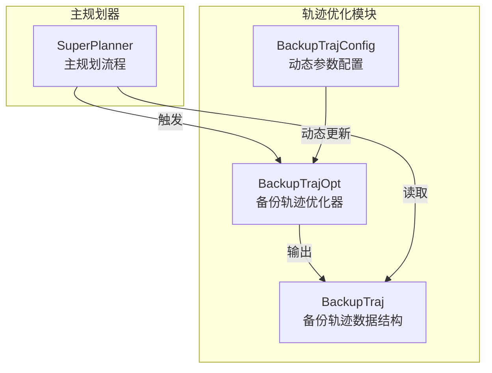
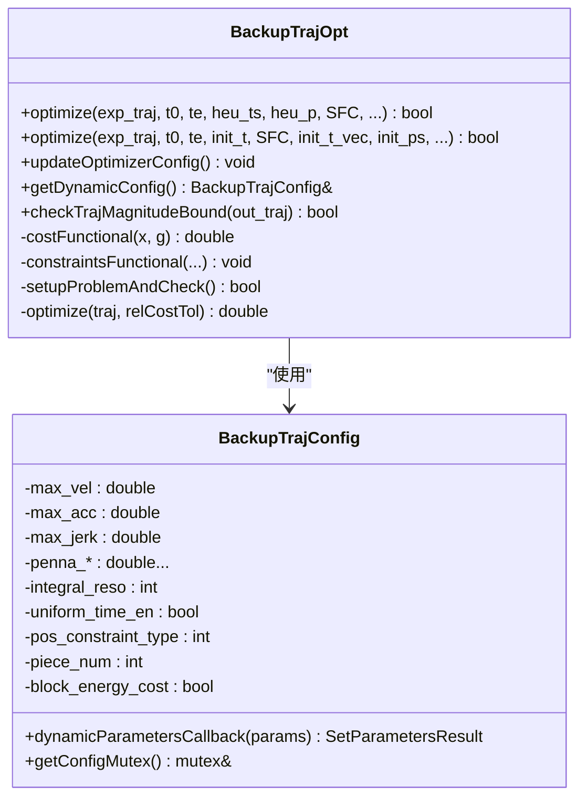
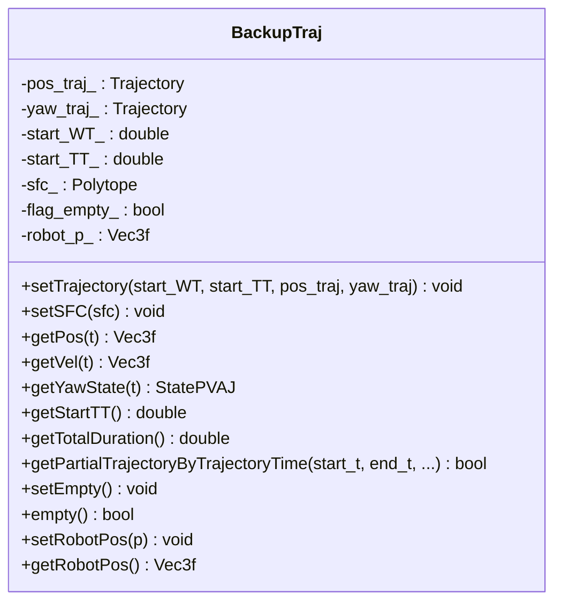
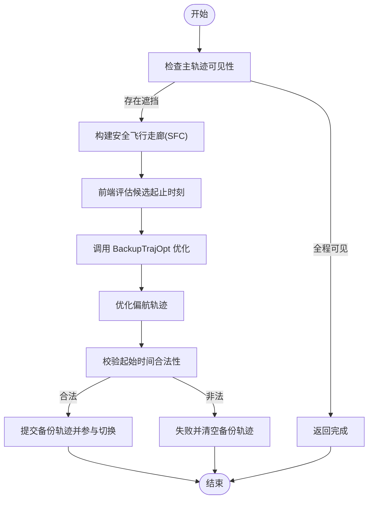
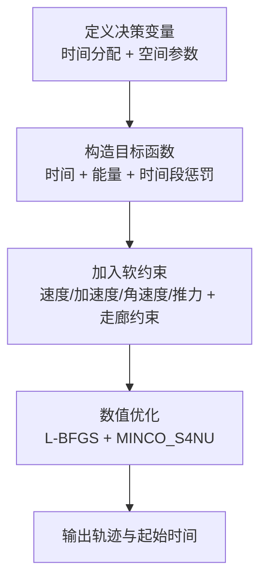
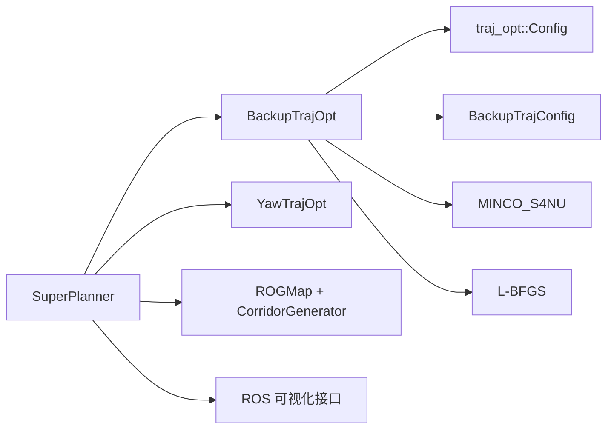

# 备份轨迹生成器

<cite>
**本文档引用的文件**
- [backup_traj.h](file://src/SUPER/super_planner/include/data_structure/backup_traj.h)
- [backup_traj_config.h](file://src/SUPER/super_planner/include/traj_opt/backup_traj_config.h)
- [backup_traj_optimizer_s4.h](file://src/SUPER/super_planner/include/traj_opt/backup_traj_optimizer_s4.h)
- [backup_traj_optimizer_s4.cpp](file://src/SUPER/super_planner/src/traj_opt/backup_traj_optimizer_s4.cpp)
- [super_planner.cpp](file://src/SUPER/super_planner/src/super_core/super_planner.cpp)
- [click.yaml](file://src/SUPER/super_planner/config/click.yaml)
</cite>

## 目录
1. [简介](#简介)
2. [项目结构](#项目结构)
3. [核心组件](#核心组件)
4. [架构总览](#架构总览)
5. [详细组件分析](#详细组件分析)
6. [依赖关系分析](#依赖关系分析)
7. [性能考量](#性能考量)
8. [故障排查指南](#故障排查指南)
9. [结论](#结论)
10. [附录](#附录)

## 简介
本文件面向“备份轨迹生成器”的技术文档，围绕 BackupTrajOpt 类展开，系统阐述其设计理念、数学模型、优化策略与主规划器的协作方式。重点覆盖以下方面：
- 应急避障、安全着陆与系统故障恢复中的关键作用
- 快速响应机制、安全边界保持与能量效率的权衡
- 与主轨迹优化器的协同：轨迹切换条件、平滑过渡与冲突避免
- 数学模型与优化目标：最小化轨迹长度、最大化安全性与平滑性的平衡
- 实际使用示例与调试、性能评估方法

## 项目结构
备份轨迹生成器位于 SUPER 轨迹优化模块中，主要涉及如下文件：
- 数据结构：BackupTraj（封装备份轨迹及其安全走廊）
- 优化器：BackupTrajOpt（基于 MINCO 的 S4 轨迹优化器）
- 配置：BackupTrajConfig（动态参数与回调）
- 集成：SuperPlanner（在主规划流程中触发与提交备份轨迹）



**图表来源**
- [backup_traj_optimizer_s4.h](file://src/SUPER/super_planner/include/traj_opt/backup_traj_optimizer_s4.h#L52-L211)
- [backup_traj.h](file://src/SUPER/super_planner/include/data_structure/backup_traj.h#L35-L154)
- [backup_traj_config.h](file://src/SUPER/super_planner/include/traj_opt/backup_traj_config.h#L37-L206)
- [super_planner.cpp](file://src/SUPER/super_planner/src/super_core/super_planner.cpp#L832-L1089)

**章节来源**
- [backup_traj_optimizer_s4.h](file://src/SUPER/super_planner/include/traj_opt/backup_traj_optimizer_s4.h#L52-L211)
- [backup_traj.h](file://src/SUPER/super_planner/include/data_structure/backup_traj.h#L35-L154)
- [backup_traj_config.h](file://src/SUPER/super_planner/include/traj_opt/backup_traj_config.h#L37-L206)
- [super_planner.cpp](file://src/SUPER/super_planner/src/super_core/super_planner.cpp#L832-L1089)

## 核心组件
- BackupTrajOpt：基于 L-BFGS 的非线性优化器，采用 MINCO_S4NU 进行分段三次多项式轨迹优化，结合走廊约束与多物理量惩罚项，生成满足边界与动力学限制的安全备份轨迹。
- BackupTraj：封装位置与偏航轨迹、起始墙钟时间、起始轨迹时间、安全飞行走廊（SFC）以及机器人当前位置等信息。
- BackupTrajConfig：封装备份轨迹优化的动态参数（如速度/加速度/加加速度/角速度/推力上下限、各惩罚系数、积分分辨率、时间分配策略等），并提供 ROS 参数回调以在线更新。

**章节来源**
- [backup_traj_optimizer_s4.h](file://src/SUPER/super_planner/include/traj_opt/backup_traj_optimizer_s4.h#L52-L211)
- [backup_traj.h](file://src/SUPER/super_planner/include/data_structure/backup_traj.h#L35-L154)
- [backup_traj_config.h](file://src/SUPER/super_planner/include/traj_opt/backup_traj_config.h#L37-L206)

## 架构总览
备份轨迹生成器在主规划器中按需触发，执行以下流程：
- 前端检查：基于当前主轨迹的可见性与安全走廊构建
- 优化求解：在走廊约束下，最小化时间与惩罚项，得到位置与偏航轨迹
- 提交与切换：校验起始时间合法性后，提交备份轨迹并参与轨迹切换判断

```mermaid
sequenceDiagram
participant SP as "SuperPlanner"
participant FE as "备份轨迹前端"
participant OPT as "BackupTrajOpt"
participant YAW as "YawTrajOpt"
participant CMD as "命令轨迹"
SP->>FE : 触发 generateBackupTrajectory(...)
FE->>FE : 可视性检查/安全走廊构建
FE-->>SP : 返回 SFC 与候选起止时刻
SP->>OPT : updateOptimizerConfig()
SP->>OPT : optimize(exp_traj, t0, te, heu_ts, heu_p, SFC, ...)
OPT-->>SP : 输出位置轨迹与起始时间
SP->>YAW : 优化偏航轨迹
YAW-->>SP : 输出偏航轨迹
SP->>CMD : setTrajectory(主轨迹, 备份轨迹)
SP-->>SP : 切换条件判断与执行
```

**图表来源**
- [super_planner.cpp](file://src/SUPER/super_planner/src/super_core/super_planner.cpp#L832-L1089)
- [backup_traj_optimizer_s4.cpp](file://src/SUPER/super_planner/src/traj_opt/backup_traj_optimizer_s4.cpp#L655-L830)

**章节来源**
- [super_planner.cpp](file://src/SUPER/super_planner/src/super_core/super_planner.cpp#L832-L1089)
- [backup_traj_optimizer_s4.cpp](file://src/SUPER/super_planner/src/traj_opt/backup_traj_optimizer_s4.cpp#L655-L830)

## 详细组件分析

### BackupTrajOpt 类设计与优化策略
- 优化变量与问题设置
  - 时间分配策略：支持统一时间分配与可变时间分配
  - 空间参数：支持路径点约束与走廊约束两种形式
  - 积分分辨率与平滑参数：控制惩罚项数值积分精度与平滑度
  - 能量代价：可选禁用以提升响应速度
- 约束与惩罚
  - 速度/加速度/加加速度/角速度/推力上下限的软约束，通过惩罚项融入目标函数
  - 位置约束通过走廊（H 型平面集合）表达，采用平滑 L1 近似处理
  - 时间段惩罚项鼓励尽快完成备份轨迹
- 数值优化
  - 使用 L-BFGS 求解，目标函数包含能量代价与各类惩罚项
  - 通过 MINCO_S4NU 计算轨迹系数与梯度传播，保证 PVAJ 连续性
- 动态参数更新
  - 通过 BackupTrajConfig 的回调函数在线更新边界与惩罚权重，保障运行时自适应能力



**图表来源**
- [backup_traj_optimizer_s4.h](file://src/SUPER/super_planner/include/traj_opt/backup_traj_optimizer_s4.h#L52-L211)
- [backup_traj_config.h](file://src/SUPER/super_planner/include/traj_opt/backup_traj_config.h#L37-L206)

**章节来源**
- [backup_traj_optimizer_s4.h](file://src/SUPER/super_planner/include/traj_opt/backup_traj_optimizer_s4.h#L52-L211)
- [backup_traj_optimizer_s4.cpp](file://src/SUPER/super_planner/src/traj_opt/backup_traj_optimizer_s4.cpp#L255-L584)
- [backup_traj_config.h](file://src/SUPER/super_planner/include/traj_opt/backup_traj_config.h#L37-L206)

### BackupTraj 数据结构
- 维护位置轨迹、偏航轨迹、起始墙钟时间与起始轨迹时间
- 维护安全飞行走廊（SFC），并提供部分轨迹截取能力
- 提供机器人当前位置存取，便于前端与优化器交互



**图表来源**
- [backup_traj.h](file://src/SUPER/super_planner/include/data_structure/backup_traj.h#L35-L154)

**章节来源**
- [backup_traj.h](file://src/SUPER/super_planner/include/data_structure/backup_traj.h#L35-L154)

### 主规划器中的协作关系
- 触发条件
  - 当主轨迹在感知范围内出现不可见或潜在碰撞风险时，启动备份轨迹生成
  - 若全程可见且安全，则直接返回完成状态，无需备份
- 切换条件
  - 备份轨迹起始时间与当前评估时刻的关系决定是否切换
  - 已提交的备份轨迹起始时间早于当前评估时刻时，进入备份轨迹执行阶段
- 平滑过渡与冲突避免
  - 优化器在起点与终点处与主轨迹保持 PVAJ 连续
  - 偏航轨迹独立优化，保证姿态连续性
  - 起始时间与已提交备份轨迹起始时间比较，避免回退或冲突



**图表来源**
- [super_planner.cpp](file://src/SUPER/super_planner/src/super_core/super_planner.cpp#L832-L1089)
- [backup_traj_optimizer_s4.cpp](file://src/SUPER/super_planner/src/traj_opt/backup_traj_optimizer_s4.cpp#L655-L830)

**章节来源**
- [super_planner.cpp](file://src/SUPER/super_planner/src/super_core/super_planner.cpp#L832-L1089)
- [backup_traj_optimizer_s4.cpp](file://src/SUPER/super_planner/src/traj_opt/backup_traj_optimizer_s4.cpp#L655-L830)

### 数学模型与优化目标
- 决策变量
  - 时间分配：统一时间或分段时间
  - 空间参数：路径点或走廊顶点参数化
- 目标函数
  - 最小化总时间与能量代价
  - 最小化与主轨迹起点的偏差（时间段惩罚项）
  - 软化约束：速度/加速度/加加速度/角速度/推力越界惩罚
- 约束
  - 走廊约束（H 型平面集合）
  - 起终点边界（起点由主轨迹状态给定；终点为路径点或走廊末端）
- 优化算法
  - L-BFGS 求解，MINCO_S4NU 计算轨迹与梯度



**图表来源**
- [backup_traj_optimizer_s4.cpp](file://src/SUPER/super_planner/src/traj_opt/backup_traj_optimizer_s4.cpp#L255-L584)

**章节来源**
- [backup_traj_optimizer_s4.cpp](file://src/SUPER/super_planner/src/traj_opt/backup_traj_optimizer_s4.cpp#L255-L584)

### 实际使用示例与触发场景
- 紧急避障
  - 主轨迹在感知范围内出现遮挡或障碍物接近，前端检测不可见区域，触发备份轨迹生成
  - 优化器在 SFC 内寻找最短时间路径，尽快脱离危险区域
- 安全着陆
  - 当主轨迹终点附近存在不可见区域或潜在碰撞，生成备份轨迹以安全着陆为目标
  - 通过时间段惩罚项鼓励尽快完成，同时保持偏航连续
- 系统故障恢复
  - 主轨迹优化失败或越界，备份轨迹作为兜底方案
  - 优化器自动规避越界，必要时缩短轨迹长度以降低风险

**章节来源**
- [super_planner.cpp](file://src/SUPER/super_planner/src/super_core/super_planner.cpp#L832-L1089)
- [backup_traj_optimizer_s4.cpp](file://src/SUPER/super_planner/src/traj_opt/backup_traj_optimizer_s4.cpp#L655-L830)

### 调试与性能评估
- 日志与可视化
  - 优化过程日志与各惩罚项统计可写入 CSV 文件，便于离线分析
  - 可视化 SFC、备份轨迹与偏航轨迹，辅助定位问题
- 关键指标
  - 最大速度/加速度/角速度/推力越界比例
  - 轨迹长度与完成时间
  - 优化迭代次数与收敛误差
- 参数调优建议
  - 动态参数：通过 ROS 参数回调在线调整边界与惩罚权重
  - 积分分辨率与平滑参数：在实时性与精度之间折中
  - 时间段惩罚系数：在快速响应与安全性之间平衡

**章节来源**
- [backup_traj_optimizer_s4.cpp](file://src/SUPER/super_planner/src/traj_opt/backup_traj_optimizer_s4.cpp#L586-L637)
- [backup_traj_config.h](file://src/SUPER/super_planner/include/traj_opt/backup_traj_config.h#L77-L194)

## 依赖关系分析
- 组件耦合
  - BackupTrajOpt 依赖 traj_opt::Config 与 BackupTrajConfig，以及 MINCO_S4NU、L-BFGS、几何工具库
  - SuperPlanner 依赖 BackupTrajOpt 与 YawTrajOpt，并通过命令轨迹对象协调主/备轨迹
- 外部依赖
  - ROS 参数系统用于动态参数更新
  - 地图与走廊生成器提供 SFC
  - 可视化接口用于调试与演示



**图表来源**
- [super_planner.cpp](file://src/SUPER/super_planner/src/super_core/super_planner.cpp#L32-L74)
- [backup_traj_optimizer_s4.h](file://src/SUPER/super_planner/include/traj_opt/backup_traj_optimizer_s4.h#L26-L42)

**章节来源**
- [super_planner.cpp](file://src/SUPER/super_planner/src/super_core/super_planner.cpp#L32-L74)
- [backup_traj_optimizer_s4.h](file://src/SUPER/super_planner/include/traj_opt/backup_traj_optimizer_s4.h#L26-L42)

## 性能考量
- 实时性
  - 统一时间分配与较低积分分辨率有助于提升响应速度
  - 能量代价可选禁用以减少计算开销
- 精度与稳定性
  - 积分分辨率与平滑参数影响数值稳定性和约束满足程度
  - L-BFGS 收敛容差与内存大小影响最终解的质量与耗时
- 参数敏感性
  - 时间段惩罚系数与各物理量惩罚权重直接影响轨迹长度与安全性
  - 建议在仿真中进行参数扫描，结合实飞验证

[本节为通用指导，无需具体文件分析]

## 故障排查指南
- 优化失败
  - 检查 SFC 是否有效（非 NaN、非空）
  - 查看各惩罚项统计，定位越界严重项
  - 适当提高积分分辨率与平滑参数，或放宽边界
- 轨迹越界
  - 检查走廊构建是否受 FOV 或感知范围裁剪影响
  - 校验前端评估的候选起止时刻是否合理
- 切换异常
  - 确认备份轨迹起始时间与已提交轨迹起始时间的先后关系
  - 检查偏航轨迹优化是否成功

**章节来源**
- [backup_traj_optimizer_s4.cpp](file://src/SUPER/super_planner/src/traj_opt/backup_traj_optimizer_s4.cpp#L698-L737)
- [super_planner.cpp](file://src/SUPER/super_planner/src/super_core/super_planner.cpp#L1065-L1088)

## 结论
BackupTrajOpt 通过在安全飞行走廊内进行快速、鲁棒的轨迹优化，在紧急避障、安全着陆与系统故障恢复中发挥关键作用。其与主规划器的紧密协作确保了从感知到执行的闭环可靠性。通过动态参数与可视化手段，可在不同场景下实现快速响应与高安全性之间的平衡。

[本节为总结，无需具体文件分析]

## 附录
- 关键参数参考（来自配置文件）
  - 备份轨迹开关、统一时间分配、走廊约束类型、分段数量、积分分辨率、平滑参数、时间惩罚系数、时间段惩罚系数、各物理量惩罚系数等
- 使用建议
  - 在复杂动态环境中优先启用统一时间分配与较高积分分辨率
  - 在实时性要求高的场景下，适度提高时间段惩罚系数以加速完成

**章节来源**
- [click.yaml](file://src/SUPER/super_planner/config/click.yaml#L74-L94)