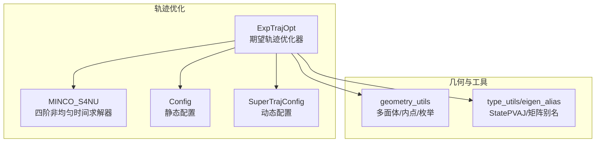
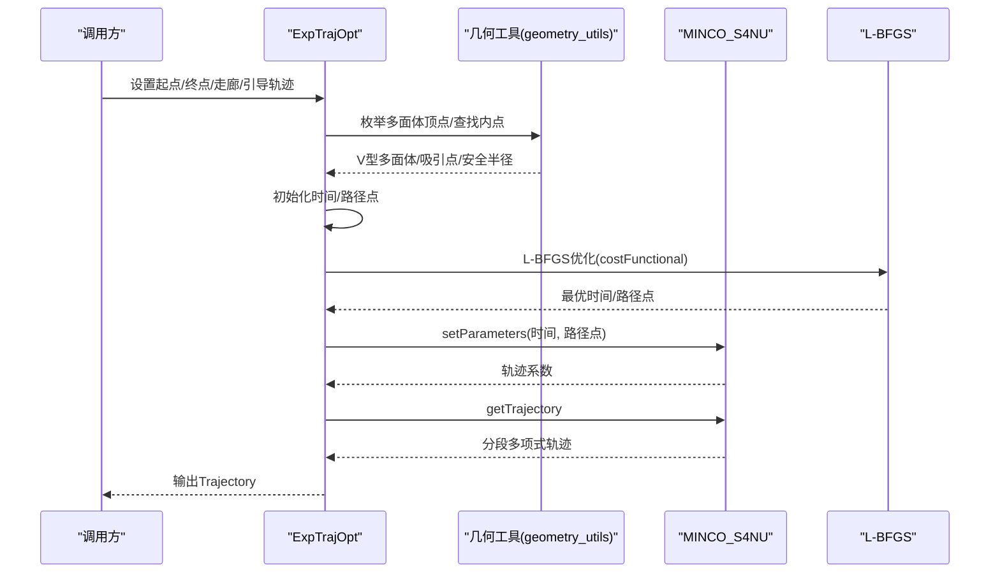
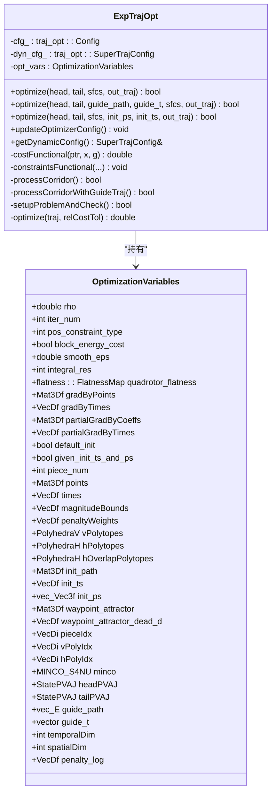
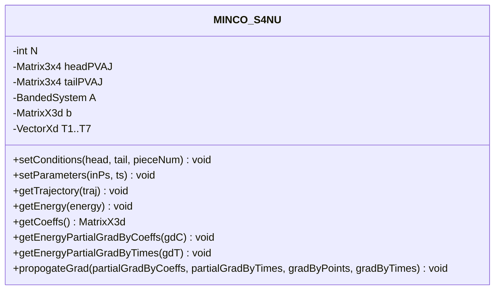
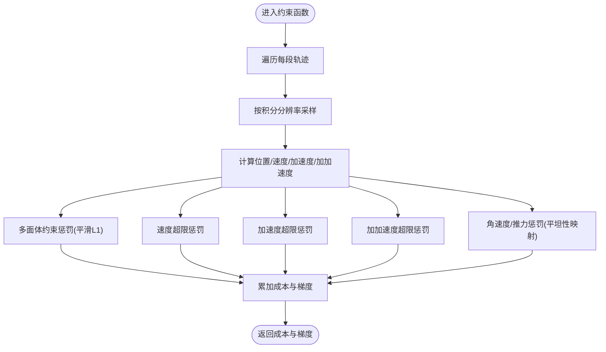
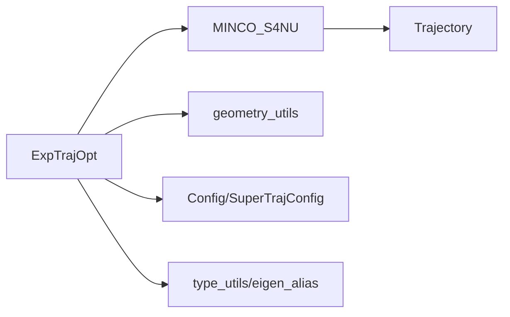

# 期望轨迹优化器

<cite>
**本文档引用的文件**
- [exp_traj_optimizer_s4.h](file://src/SUPER/super_planner/include/traj_opt/exp_traj_optimizer_s4.h)
- [exp_traj_optimizer_s4.cpp](file://src/SUPER/super_planner/src/traj_opt/exp_traj_optimizer_s4.cpp)
- [minco.h](file://src/SUPER/super_planner/include/traj_opt/minco.h)
- [minco.cpp](file://src/SUPER/super_planner/src/utils/minco.cpp)
- [config.hpp](file://src/SUPER/super_planner/include/traj_opt/config.hpp)
- [super_traj_config.h](file://src/SUPER/super_planner/include/traj_opt/super_traj_config.h)
- [geometry_utils.h](file://src/SUPER/super_planner/include/utils/geometry/geometry_utils.h)
- [type_utils.hpp](file://src/SUPER/rog_map/include/super_utils/eigen_alias.hpp)
</cite>

## 目录
1. [简介](#简介)
2. [项目结构](#项目结构)
3. [核心组件](#核心组件)
4. [架构总览](#架构总览)
5. [详细组件分析](#详细组件分析)
6. [依赖关系分析](#依赖关系分析)
7. [性能考虑](#性能考虑)
8. [故障排查指南](#故障排查指南)
9. [结论](#结论)
10. [附录](#附录)

## 简介
本文件系统性地解析SUPER规划框架中的期望轨迹优化器（ExpTrajOpt）。该优化器基于MINCO（Multi-splIne COefficients）算法，采用非均匀时间分配与分段三次/四次多项式轨迹，结合走廊约束（多面体SFC）、平滑L1惩罚与积分采样，实现对飞行器在复杂环境中的高安全性、高平滑度轨迹规划。优化器支持两种位置约束模式：路径点约束（WAYPOINT）与走廊约束（CORRIDOR），并提供动态参数配置接口，可在运行时调整边界约束、惩罚权重与数值稳定性参数。

## 项目结构
与期望轨迹优化器直接相关的模块组织如下：
- 优化器主体：ExpTrajOpt（头文件与实现）
- MINCO求解器：MINCO_S4NU（四阶非均匀时间）
- 配置系统：静态配置Config与动态配置SuperTrajConfig
- 几何工具：多面体枚举、内点查找、走廊预处理
- 类型别名：StatePVAJ等状态矩阵类型

**图表来源**
- [exp_traj_optimizer_s4.h](file://src/SUPER/super_planner/include/traj_opt/exp_traj_optimizer_s4.h#L55-L368)
- [minco.h](file://src/SUPER/super_planner/include/traj_opt/minco.h#L153-L210)
- [config.hpp](file://src/SUPER/super_planner/include/traj_opt/config.hpp#L50-L180)
- [super_traj_config.h](file://src/SUPER/super_planner/include/traj_opt/super_traj_config.h#L37-L179)
- [geometry_utils.h](file://src/SUPER/super_planner/include/utils/geometry/geometry_utils.h#L211-L251)
- [type_utils.hpp](file://src/SUPER/rog_map/include/super_utils/eigen_alias.hpp#L130-L131)

**章节来源**
- [exp_traj_optimizer_s4.h](file://src/SUPER/super_planner/include/traj_opt/exp_traj_optimizer_s4.h#L1-L371)
- [exp_traj_optimizer_s4.cpp](file://src/SUPER/super_planner/src/traj_opt/exp_traj_optimizer_s4.cpp#L1-L1083)

## 核心组件
- ExpTrajOpt：期望轨迹优化器主体，负责走廊预处理、初始值构建、L-BFGS求解、MINCO轨迹回算与轨迹输出。
- MINCO_S4NU：四阶非均匀时间MINCO求解器，提供能量与梯度计算、系数回传与轨迹生成。
- Config：静态配置，从YAML加载参数，包含边界约束、惩罚权重、积分分辨率、平滑参数等。
- SuperTrajConfig：动态配置，支持ROS2参数回调，允许在线调整边界与惩罚参数。
- 几何工具：多面体顶点枚举、内点查找、走廊重叠处理等。

**章节来源**
- [exp_traj_optimizer_s4.h](file://src/SUPER/super_planner/include/traj_opt/exp_traj_optimizer_s4.h#L55-L368)
- [minco.h](file://src/SUPER/super_planner/include/traj_opt/minco.h#L153-L210)
- [config.hpp](file://src/SUPER/super_planner/include/traj_opt/config.hpp#L50-L180)
- [super_traj_config.h](file://src/SUPER/super_planner/include/traj_opt/super_traj_config.h#L37-L179)
- [geometry_utils.h](file://src/SUPER/super_planner/include/utils/geometry/geometry_utils.h#L211-L251)

## 架构总览
期望轨迹优化器采用“走廊预处理 + L-BFGS非线性优化 + MINCO轨迹回算”的三层架构：
- 走廊预处理：将H型多面体（SFC）转换为V型多面体，计算走廊吸引点与安全半径，并生成初始路径。
- 非线性优化：以时间与路径点（或参数化坐标）为优化变量，目标函数由能量项与多面体/边界惩罚构成，约束通过积分采样与平滑L1处理。
- 轨迹回算：MINCO根据优化得到的时间与路径点，生成分段多项式轨迹并输出。

**图表来源**
- [exp_traj_optimizer_s4.cpp](file://src/SUPER/super_planner/src/traj_opt/exp_traj_optimizer_s4.cpp#L614-L760)
- [minco.cpp](file://src/SUPER/super_planner/src/utils/minco.cpp#L627-L638)
- [geometry_utils.h](file://src/SUPER/super_planner/include/utils/geometry/geometry_utils.h#L211-L251)

## 详细组件分析

### ExpTrajOpt类与优化变量结构
- 优化变量OptimizationVariables包含：
  - rho：时间惩罚权重
  - iter_num：迭代计数
  - pos_constraint_type：位置约束类型（路径点/走廊）
  - block_energy_cost：是否禁用能量代价
  - smooth_eps：平滑L1的epsilon
  - integral_res：积分分辨率
  - quadrotor_flatness：四旋翼平坦性映射
  - gradByPoints/gradByTimes/partialGradByCoeffs/partialGradByTimes：梯度缓存
  - default_init/given_init_ts_and_ps：初始化策略
  - piece_num/points/times：分段数与路径点/时间
  - magnitudeBounds/penaltyWeights：边界与惩罚权重
  - vPolytopes/hPolytopes/hOverlapPolytopes：走廊多面体
  - init_path/guide_path/guide_t：初始/引导路径与时间
  - headPVAJ/tailPVAJ：起止状态（位置/速度/加速度/加加速度）
  - temporalDim/spatialDim：优化变量维度
  - penalty_log：各约束违规统计

- 关键成员函数：
  - costFunctional：L-BFGS目标函数回调，计算能量与约束惩罚，反传梯度
  - constraintsFunctional：约束惩罚计算，含多面体约束、速度/加速度/加加速度/角速度/推力约束，积分采样与平滑L1
  - processCorridor/processCorridorWithGuideTraj/setupProblemAndCheck：走廊预处理与问题构建
  - optimize：L-BFGS求解与轨迹回算
  - updateOptimizerConfig：动态参数更新

**图表来源**
- [exp_traj_optimizer_s4.h](file://src/SUPER/super_planner/include/traj_opt/exp_traj_optimizer_s4.h#L62-L106)
- [exp_traj_optimizer_s4.cpp](file://src/SUPER/super_planner/src/traj_opt/exp_traj_optimizer_s4.cpp#L800-L815)

**章节来源**
- [exp_traj_optimizer_s4.h](file://src/SUPER/super_planner/include/traj_opt/exp_traj_optimizer_s4.h#L62-L106)
- [exp_traj_optimizer_s4.cpp](file://src/SUPER/super_planner/src/traj_opt/exp_traj_optimizer_s4.cpp#L800-L815)

### MINCO算法框架（基于四阶非均匀时间）
- MINCO_S4NU提供：
  - setConditions：设置起止状态（位置/速度/加速度/加加速度）
  - setParameters：设置路径点与时间
  - getEnergy/getEnergyPartialGradByCoeffs/getEnergyPartialGradByTimes：能量与梯度
  - propogateGrad：从能量梯度回传到路径点与时间梯度
  - getTrajectory：生成分段多项式轨迹

**图表来源**
- [minco.h](file://src/SUPER/super_planner/include/traj_opt/minco.h#L153-L210)
- [minco.cpp](file://src/SUPER/super_planner/src/utils/minco.cpp#L627-L779)

**章节来源**
- [minco.h](file://src/SUPER/super_planner/include/traj_opt/minco.h#L153-L210)
- [minco.cpp](file://src/SUPER/super_planner/src/utils/minco.cpp#L627-L779)

### 约束函数与数学原理
- 多面体约束（polyhedra constraints）：对每个时间步沿轨迹法线方向计算违反程度，使用平滑L1函数进行可微近似。
- 平滑因子（smooth factor）：smooth_eps控制L1近似的平滑程度，过小可能导致数值不稳定，过大可能降低惩罚强度。
- 积分分辨率（integral resolution）：integral_res决定每段轨迹的积分采样点数，越大越精确但计算更耗时。
- 边界约束：速度、加速度、加加速度、角速度、推力上下界，均通过平滑L1惩罚加入目标函数。
- 吸引力惩罚（attract penalty）：对路径点与走廊吸引点的距离进行惩罚，促进轨迹贴近走廊中心。

**图表来源**
- [exp_traj_optimizer_s4.cpp](file://src/SUPER/super_planner/src/traj_opt/exp_traj_optimizer_s4.cpp#L45-L244)

**章节来源**
- [exp_traj_optimizer_s4.cpp](file://src/SUPER/super_planner/src/traj_opt/exp_traj_optimizer_s4.cpp#L45-L244)

### 优化变量与目标函数设计
- 优化变量：
  - 时间向量τ（经映射到实际时间T）与路径点向量ξ（或参数化坐标）。
  - 通过gcopter::forwardMap/ backwardMap在不同参数化之间转换。
- 目标函数：
  - 能量项（可选，block_energy_cost控制）：MINCO能量
  - 时间惩罚项：ρ·ΣΔt
  - 约束惩罚项：多面体/边界/吸引力等平滑L1惩罚
- 梯度传播：
  - 先计算能量与约束梯度，再通过MINCO.propogateGrad回传至路径点与时间梯度，最后通过gcopter::propagateGradientTToTau回传至τ梯度。

**章节来源**
- [exp_traj_optimizer_s4.cpp](file://src/SUPER/super_planner/src/traj_opt/exp_traj_optimizer_s4.cpp#L251-L344)

### 走廊处理与初始值构建
- 走廊预处理：
  - 将H型多面体转换为V型多面体，计算相邻走廊的重叠多面体与内点，作为吸引点与安全半径。
- 初始值：
  - 默认初始化：按最大速度分配时间，路径点设为吸引点。
  - 引导轨迹初始化：根据引导路径与时间戳分配初始时间间隔。
- 维度计算：
  - 根据位置约束类型确定空间维度与索引映射。

**章节来源**
- [exp_traj_optimizer_s4.cpp](file://src/SUPER/super_planner/src/traj_opt/exp_traj_optimizer_s4.cpp#L354-L595)

### 动态参数配置与更新
- SuperTrajConfig提供ROS2参数回调，支持在线调整：
  - 边界约束：max_vel/max_acc/max_jerk
  - 惩罚权重：penna_t/penna_pos/penna_vel/penna_acc/penna_jerk/penna_attract/penna_omg/penna_thr
  - 数值参数：opt_accuracy/smooth_eps/integral_reso
  - 算法开关：pos_constraint_type/block_energy_cost
- ExpTrajOpt.updateOptimizerConfig在每次优化前同步动态参数到优化器内部。

**章节来源**
- [super_traj_config.h](file://src/SUPER/super_planner/include/traj_opt/super_traj_config.h#L72-L179)
- [exp_traj_optimizer_s4.cpp](file://src/SUPER/super_planner/src/traj_opt/exp_traj_optimizer_s4.cpp#L968-L991)

## 依赖关系分析
- ExpTrajOpt依赖：
  - MINCO_S4NU：轨迹系数与能量/梯度计算
  - geometry_utils：多面体枚举、内点查找
  - Config/SuperTrajConfig：参数来源
  - type_utils/eigen_alias：状态矩阵类型（StatePVAJ）
- MINCO_S4NU依赖：
  - BandedSystem：带状线性系统求解
  - Trajectory：轨迹存储

**图表来源**
- [exp_traj_optimizer_s4.h](file://src/SUPER/super_planner/include/traj_opt/exp_traj_optimizer_s4.h#L30-L43)
- [minco.h](file://src/SUPER/super_planner/include/traj_opt/minco.h#L49-L51)
- [type_utils.hpp](file://src/SUPER/rog_map/include/super_utils/eigen_alias.hpp#L130-L131)

**章节来源**
- [exp_traj_optimizer_s4.h](file://src/SUPER/super_planner/include/traj_opt/exp_traj_optimizer_s4.h#L30-L43)
- [minco.h](file://src/SUPER/super_planner/include/traj_opt/minco.h#L49-L51)

## 性能考虑
- 积分分辨率与平滑因子：
  - integral_res越高，约束评估越精确但计算量增大；smooth_eps过小易导致数值不稳定。
- 时间分配策略：
  - 默认按最大速度分配时间，若引导轨迹存在，建议合理分配时间以避免局部收敛困难。
- L-BFGS参数：
  - mem_size/past/delta等影响收敛速度与精度，可根据场景调整。
- 内存与矩阵尺寸：
  - 优化变量维度随走廊段数与顶点数增长，注意内存占用与求解时间。

[本节为通用指导，无需具体文件分析]

## 故障排查指南
- 优化失败（返回无穷大或负返回码）：
  - 检查初始时间是否过小（<1e-3）或NaN
  - 检查走廊是否有效、是否存在NaN
  - 查看penalty_log中各约束违规统计，定位超限项
- 违规告警（Omg/Thr/Pos等）：
  - 调整对应惩罚权重或边界约束
  - 提升积分分辨率或减小smooth_eps
- 参数未生效：
  - 确认已调用updateOptimizerConfig并在优化前同步动态参数

**章节来源**
- [exp_traj_optimizer_s4.cpp](file://src/SUPER/super_planner/src/traj_opt/exp_traj_optimizer_s4.cpp#L614-L760)
- [exp_traj_optimizer_s4.cpp](file://src/SUPER/super_planner/src/traj_opt/exp_traj_optimizer_s4.cpp#L968-L991)

## 结论
期望轨迹优化器通过MINCO四阶非均匀时间求解器，结合多面体走廊约束、平滑L1惩罚与积分采样，在保证轨迹平滑的同时满足飞行器动力学与运动学边界约束。其动态参数配置机制使得在复杂场景下能够灵活调整优化行为，兼顾安全性与效率。建议在工程应用中合理设置积分分辨率与平滑因子，并结合引导轨迹进行热启动，以提升收敛稳定性与计算效率。

[本节为总结性内容，无需具体文件分析]

## 附录

### 使用示例（步骤说明）
- 准备输入：
  - 起止状态：StatePVAJ（位置/速度/加速度/加加速度）
  - 走廊：PolytopeVec（H型多面体）
  - 可选：引导轨迹（路径点序列与对应时间戳）
- 执行优化：
  - 调用optimize重载版本，传入起止状态、走廊与引导轨迹
  - 若需热启动，提供初始路径点与时间
- 获取结果：
  - 返回Trajectory（分段多项式轨迹）
  - 可选：获取penalty_log与优化迭代信息

**章节来源**
- [exp_traj_optimizer_s4.cpp](file://src/SUPER/super_planner/src/traj_opt/exp_traj_optimizer_s4.cpp#L891-L966)
- [exp_traj_optimizer_s4.cpp](file://src/SUPER/super_planner/src/traj_opt/exp_traj_optimizer_s4.cpp#L993-L1083)

### 关键参数说明
- 静态配置（Config）：
  - pos_constraint_type：位置约束类型（1=路径点，2=走廊）
  - max_vel/max_acc/max_jerk/max_omg/min_acc_thr/max_acc_thr：边界约束
  - penna_*：各类惩罚权重（时间/位置/速度/加速度/加加速度/吸引力/角速度/推力）
  - smooth_eps：平滑L1因子
  - integral_reso：积分分辨率
  - opt_accuracy：优化精度
- 动态配置（SuperTrajConfig）：
  - 支持在线调整上述参数并通过回调同步到优化器

**章节来源**
- [config.hpp](file://src/SUPER/super_planner/include/traj_opt/config.hpp#L50-L180)
- [super_traj_config.h](file://src/SUPER/super_planner/include/traj_opt/super_traj_config.h#L37-L179)