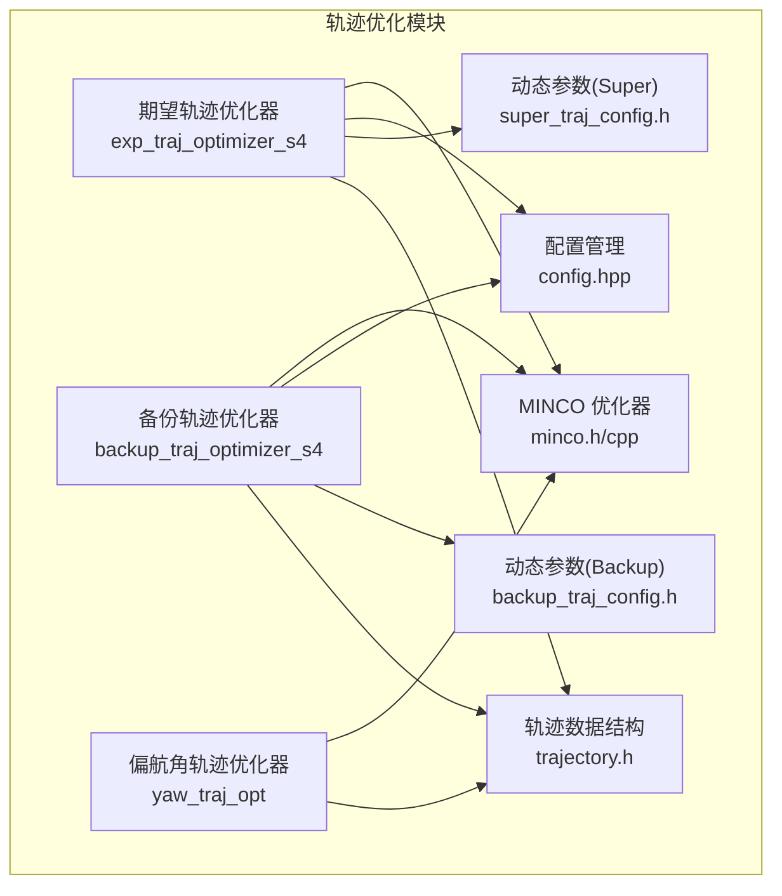
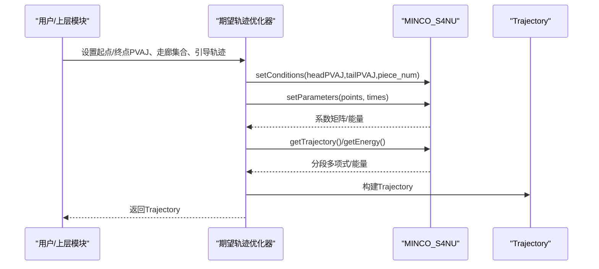
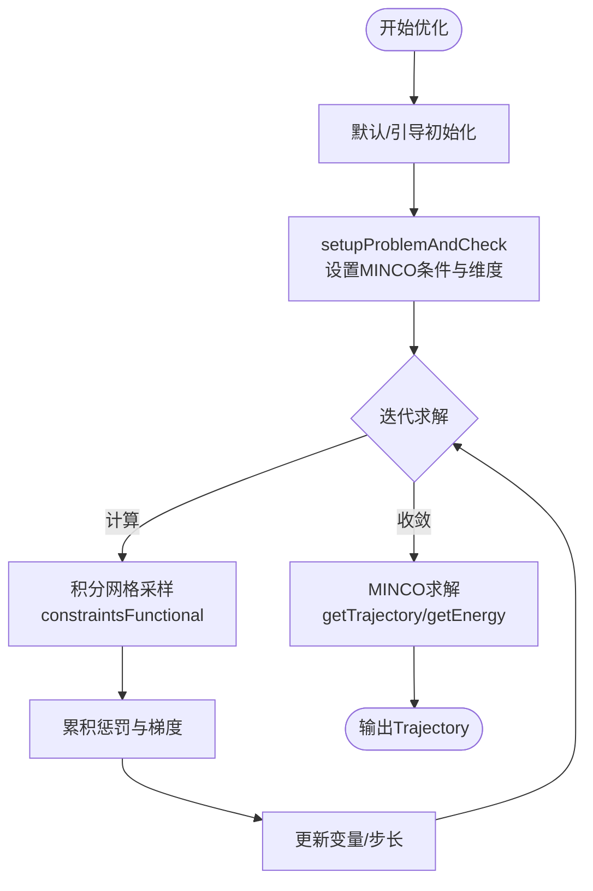
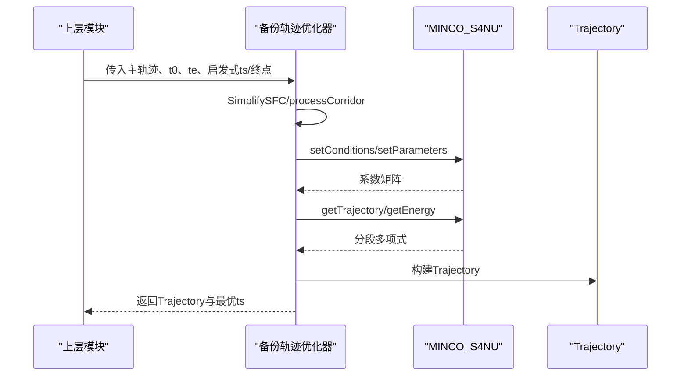
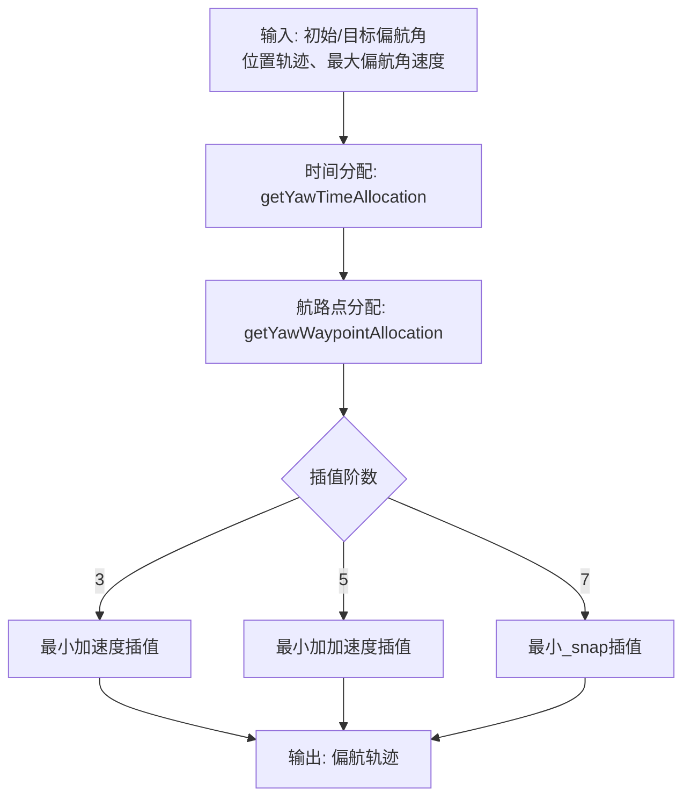
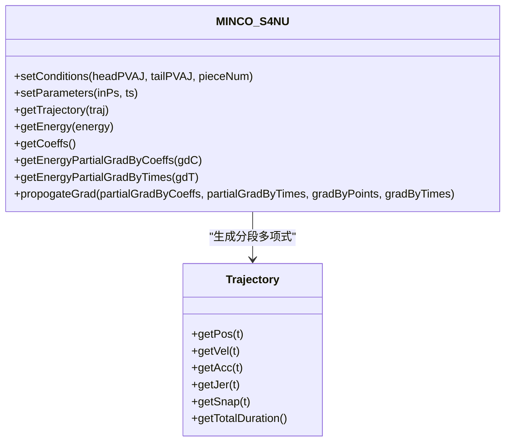
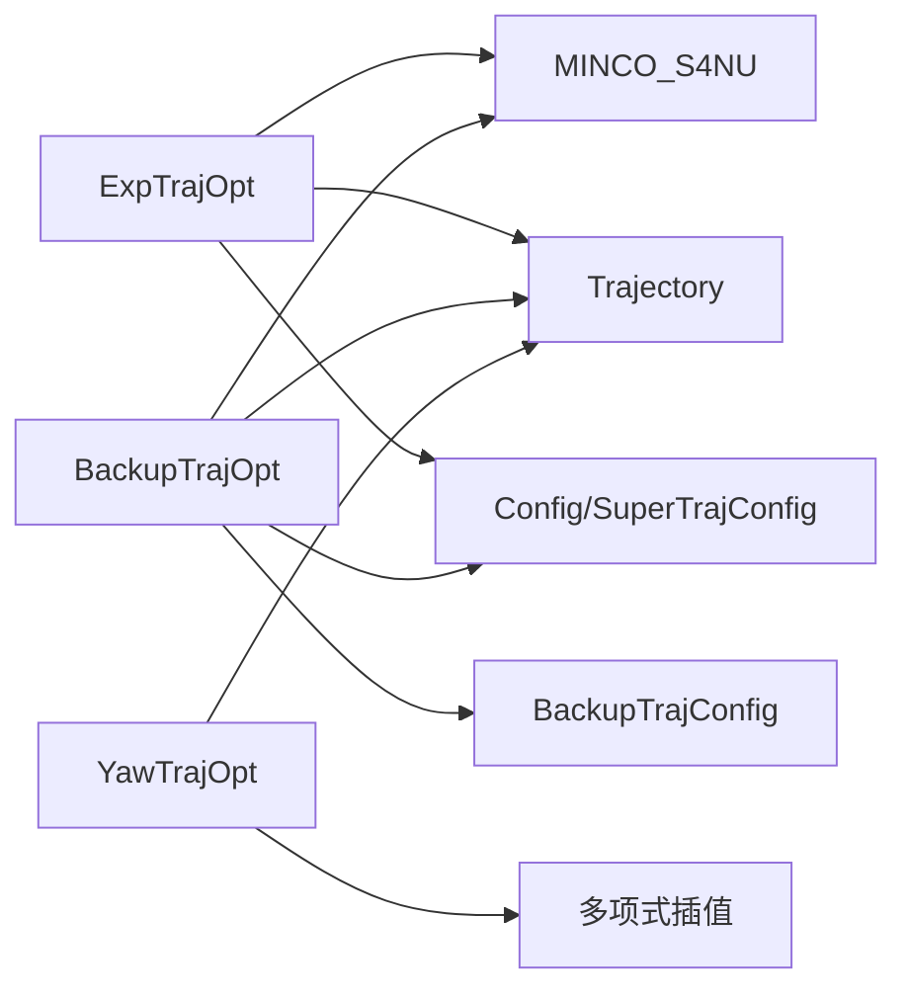

# 轨迹优化系统

<cite>
**本文档引用的文件**
- [exp_traj_optimizer_s4.h](file://src/SUPER/super_planner/include/traj_opt/exp_traj_optimizer_s4.h)
- [exp_traj_optimizer_s4.cpp](file://src/SUPER/super_planner/src/traj_opt/exp_traj_optimizer_s4.cpp)
- [backup_traj_optimizer_s4.h](file://src/SUPER/super_planner/include/traj_opt/backup_traj_optimizer_s4.h)
- [backup_traj_optimizer_s4.cpp](file://src/SUPER/super_planner/src/traj_opt/backup_traj_optimizer_s4.cpp)
- [yaw_traj_opt.h](file://src/SUPER/super_planner/include/traj_opt/yaw_traj_opt.h)
- [yaw_traj_opt.cpp](file://src/SUPER/super_planner/src/traj_opt/yaw_traj_opt.cpp)
- [minco.h](file://src/SUPER/super_planner/include/traj_opt/minco.h)
- [minco.cpp](file://src/SUPER/super_planner/src/utils/minco.cpp)
- [config.hpp](file://src/SUPER/super_planner/include/traj_opt/config.hpp)
- [super_traj_config.h](file://src/SUPER/super_planner/include/traj_opt/super_traj_config.h)
- [backup_traj_config.h](file://src/SUPER/super_planner/include/traj_opt/backup_traj_config.h)
- [trajectory.h](file://src/SUPER/super_planner/include/data_structure/base/trajectory.h)
</cite>

## 目录
1. [简介](#简介)
2. [项目结构](#项目结构)
3. [核心组件](#核心组件)
4. [架构总览](#架构总览)
5. [详细组件分析](#详细组件分析)
6. [依赖关系分析](#依赖关系分析)
7. [性能考虑](#性能考虑)
8. [故障排查指南](#故障排查指南)
9. [结论](#结论)
10. [附录](#附录)

## 简介
本文件为 SUPER 轨迹优化系统的全面技术文档，聚焦三大核心优化器与 MINCO 优化算法的实现与应用：
- 期望轨迹优化器（exp_traj_optimizer_s4）：基于 MINCO-S4 的非均匀时间分段优化，生成主飞行轨迹，满足速度、加速度、加加速度与角速度/推力约束，并结合走廊/路径点约束与能量代价。
- 备份轨迹生成器（backup_traj_optimizer_s4）：在紧急避障或安全着陆场景下，基于主轨迹与当前状态生成快速可行的备份轨迹，支持均匀时间分配与时间段惩罚。
- 偏航角轨迹优化器（yaw_traj_opt）：独立优化偏航角轨迹，采用多项式插值（最小加速度/最小加加速度/最小_snap），保证偏航速率不超过最大角速度限制。

同时，文档深入解析 MINCO 算法的数学原理与实现细节，说明约束设置、目标函数与求解过程；阐述轨迹配置参数的作用机制（最大速度/加速度/急动度、能量成本等）；提供完整的轨迹生成流程图与代码示例路径；解释动态参数配置系统（运行时参数更新与同步策略）；并给出优化效果评估与调试方法。

## 项目结构
该系统围绕轨迹优化模块组织，核心位于 super_planner 包的 traj_opt 子目录，配合 utils 中的 MINCO 实现与数据结构中的轨迹表示。

**图表来源**
- [exp_traj_optimizer_s4.h](file://src/SUPER/super_planner/include/traj_opt/exp_traj_optimizer_s4.h#L55-L368)
- [backup_traj_optimizer_s4.h](file://src/SUPER/super_planner/include/traj_opt/backup_traj_optimizer_s4.h#L52-L210)
- [yaw_traj_opt.h](file://src/SUPER/super_planner/include/traj_opt/yaw_traj_opt.h#L44-L71)
- [minco.h](file://src/SUPER/super_planner/include/traj_opt/minco.h#L55-L213)
- [config.hpp](file://src/SUPER/super_planner/include/traj_opt/config.hpp#L50-L182)
- [super_traj_config.h](file://src/SUPER/super_planner/include/traj_opt/super_traj_config.h#L37-L179)
- [backup_traj_config.h](file://src/SUPER/super_planner/include/traj_opt/backup_traj_config.h#L37-L206)
- [trajectory.h](file://src/SUPER/super_planner/include/data_structure/base/trajectory.h#L56-L176)

**章节来源**
- [exp_traj_optimizer_s4.h](file://src/SUPER/super_planner/include/traj_opt/exp_traj_optimizer_s4.h#L1-L371)
- [backup_traj_optimizer_s4.h](file://src/SUPER/super_planner/include/traj_opt/backup_traj_optimizer_s4.h#L1-L212)
- [yaw_traj_opt.h](file://src/SUPER/super_planner/include/traj_opt/yaw_traj_opt.h#L1-L71)
- [minco.h](file://src/SUPER/super_planner/include/traj_opt/minco.h#L1-L213)
- [config.hpp](file://src/SUPER/super_planner/include/traj_opt/config.hpp#L1-L182)
- [super_traj_config.h](file://src/SUPER/super_planner/include/traj_opt/super_traj_config.h#L1-L179)
- [backup_traj_config.h](file://src/SUPER/super_planner/include/traj_opt/backup_traj_config.h#L1-L206)
- [trajectory.h](file://src/SUPER/super_planner/include/data_structure/base/trajectory.h#L1-L176)

## 核心组件
- 期望轨迹优化器（ExpTrajOpt）
  - 输入：起点/终点 PVAJ 状态、走廊集合（PolytopeVec）、可选引导轨迹（guide_path/guide_t）
  - 输出：Trajectory 主轨迹，含分段多项式系数与持续时间
  - 关键特性：支持路径点/走廊两种位置约束类型；可启用/禁用能量代价；积分分辨率与平滑参数影响约束惩罚与数值稳定性
  - 动态参数：通过 SuperTrajConfig 提供边界限制、惩罚权重、优化精度、平滑因子、积分分辨率、约束类型等

- 备份轨迹优化器（BackupTrajOpt）
  - 输入：主轨迹、起止时刻 t_0/t_e、启发式段时长 heu_ts、启发式终点 heu_end_pt、走廊 SFC
  - 输出：Trajectory 备份轨迹、最优段时长 ts
  - 关键特性：支持均匀时间分配开关、时间段惩罚、路径点/走廊约束、能量代价可禁用
  - 动态参数：通过 BackupTrajConfig 提供边界限制、惩罚权重、优化精度、平滑因子、积分分辨率、约束类型、分段数等

- 偏航角轨迹优化器（YawTrajOpt）
  - 输入：初始/目标偏航角状态、位置轨迹、最大偏航角速度
  - 输出：Trajectory 偏航角轨迹（最小加速度/最小加加速度/最小_snap 插值）
  - 关键特性：根据位置轨迹自动分配偏航航路点与时间分段，保证偏航速率不超限

- MINCO 优化器族（MINCO_S2NU/MINCO_S3NU/MINCO_S4NU）
  - 数学基础：以非均匀时间分段的八次多项式（S4）在各分段内连续至加加速度，构建带状稀疏线性系统求解
  - 能量代价：提供能量函数及其对系数与时间的梯度，用于与约束惩罚共同构成总目标
  - 梯度传播：支持反向传播到路径点与时间的梯度，便于与外层优化器耦合

**章节来源**
- [exp_traj_optimizer_s4.h](file://src/SUPER/super_planner/include/traj_opt/exp_traj_optimizer_s4.h#L55-L368)
- [backup_traj_optimizer_s4.h](file://src/SUPER/super_planner/include/traj_opt/backup_traj_optimizer_s4.h#L52-L210)
- [yaw_traj_opt.h](file://src/SUPER/super_planner/include/traj_opt/yaw_traj_opt.h#L44-L71)
- [minco.h](file://src/SUPER/super_planner/include/traj_opt/minco.h#L55-L213)
- [super_traj_config.h](file://src/SUPER/super_planner/include/traj_opt/super_traj_config.h#L37-L179)
- [backup_traj_config.h](file://src/SUPER/super_planner/include/traj_opt/backup_traj_config.h#L37-L206)

## 架构总览
系统采用“优化器 + MINCO + 数据结构”的分层架构：
- 优化器层：期望/备份/偏航三类优化器分别面向不同任务域
- MINCO 层：统一的非均匀时间分段多项式求解器，提供能量与梯度
- 数据结构层：Trajectory 封装分段多项式与查询接口，支撑可视化与验证

**图表来源**
- [exp_traj_optimizer_s4.cpp](file://src/SUPER/super_planner/src/traj_opt/exp_traj_optimizer_s4.cpp#L45-L127)
- [minco.h](file://src/SUPER/super_planner/include/traj_opt/minco.h#L175-L210)
- [trajectory.h](file://src/SUPER/super_planner/include/data_structure/base/trajectory.h#L72-L103)

## 详细组件分析

### 期望轨迹优化器（ExpTrajOpt）
- 优化目标与约束
  - 位置约束：走廊约束（H-representation）与路径点吸引子（V-representation）相结合
  - 运动学约束：速度、加速度、加加速度、角速度、推力上下界
  - 能量代价：可选，由 MINCO 能量函数贡献
  - 惩罚函数：对越界进行平滑 L1 惩罚，平滑因子与积分分辨率控制数值稳定性
- 初始化策略
  - 默认初始化：基于走廊顶点枚举与重叠走廊内点，生成初始路径点与时间分配
  - 引导轨迹初始化：利用 guide_path/guide_t 对初始时间进行热启动
- 优化流程
  - 构建优化变量（points、times、polytopes、magnitudeBounds、penaltyWeights）
  - setupProblemAndCheck：确定分段数、空间维度、索引映射，设置 MINCO 条件
  - constraintsFunctional：在积分网格上计算惩罚与梯度
  - optimize：调用 LBFGS 或其他求解器迭代求解
- 动态参数更新
  - 通过 getDynamicConfig() 获取 SuperTrajConfig 引用，在每次优化前调用 updateOptimizerConfig() 刷新内部参数

**图表来源**
- [exp_traj_optimizer_s4.cpp](file://src/SUPER/super_planner/src/traj_opt/exp_traj_optimizer_s4.cpp#L45-L127)
- [exp_traj_optimizer_s4.h](file://src/SUPER/super_planner/include/traj_opt/exp_traj_optimizer_s4.h#L237-L320)

**章节来源**
- [exp_traj_optimizer_s4.h](file://src/SUPER/super_planner/include/traj_opt/exp_traj_optimizer_s4.h#L55-L368)
- [exp_traj_optimizer_s4.cpp](file://src/SUPER/super_planner/src/traj_opt/exp_traj_optimizer_s4.cpp#L1-L200)

### 备份轨迹优化器（BackupTrajOpt）
- 设计目标
  - 在主轨迹不可行时（如障碍物突入），快速生成一条满足边界与走廊约束的替代轨迹
  - 可选择均匀时间分配，或对时间段施加额外惩罚以避免过短段
- 优化目标与约束
  - 位置/速度/加速度/加加速度/角速度/推力约束
  - 时间段惩罚（penna_ts）与可选能量代价
- 初始化与求解
  - processCorridor：简化 SFC，提取初始路径点与时间
  - setupProblemAndCheck：设置 MINCO 条件与维度
  - optimize：在 LBFGS 迭代中逐步收紧约束

**图表来源**
- [backup_traj_optimizer_s4.cpp](file://src/SUPER/super_planner/src/traj_opt/backup_traj_optimizer_s4.cpp#L32-L149)
- [minco.h](file://src/SUPER/super_planner/include/traj_opt/minco.h#L175-L210)
- [trajectory.h](file://src/SUPER/super_planner/include/data_structure/base/trajectory.h#L72-L103)

**章节来源**
- [backup_traj_optimizer_s4.h](file://src/SUPER/super_planner/include/traj_opt/backup_traj_optimizer_s4.h#L52-L210)
- [backup_traj_optimizer_s4.cpp](file://src/SUPER/super_planner/src/traj_opt/backup_traj_optimizer_s4.cpp#L1-L200)

### 偏航角轨迹优化器（YawTrajOpt）
- 时间分配策略
  - 根据总时长与最大偏航角速度，自适应划分若干段，确保末段有足够时间到达目标偏航
- 航路点分配
  - 基于位置轨迹在时间轴上的采样点连线方向，计算偏航航路点并归一化相邻偏航
- 插值方式
  - 支持最小加速度（3阶）、最小加加速度（5阶）、最小_snap（7阶）三种插值
- 速率检查
  - 计算最大偏航速率并与阈值比较，必要时告警

**图表来源**
- [yaw_traj_opt.cpp](file://src/SUPER/super_planner/src/traj_opt/yaw_traj_opt.cpp#L29-L195)
- [yaw_traj_opt.h](file://src/SUPER/super_planner/include/traj_opt/yaw_traj_opt.h#L44-L71)

**章节来源**
- [yaw_traj_opt.h](file://src/SUPER/super_planner/include/traj_opt/yaw_traj_opt.h#L44-L71)
- [yaw_traj_opt.cpp](file://src/SUPER/super_planner/src/traj_opt/yaw_traj_opt.cpp#L1-L195)

### MINCO 优化算法（数学原理与实现）
- 数学模型
  - 使用八次多项式（S4）在每个分段内连续至加加速度，构建带状稀疏线性系统
  - 系数矩阵 A 与右端 b 由边界条件与连接条件决定，LU 分解后求解得到系数
- 能量代价
  - 能量函数为加速度范数的积分形式，提供对系数与时间的梯度，便于与约束惩罚联合优化
- 梯度传播
  - 支持从目标函数对系数/时间的梯度反向传播到路径点与时间，实现与外层优化器的耦合

**图表来源**
- [minco.h](file://src/SUPER/super_planner/include/traj_opt/minco.h#L175-L210)
- [minco.cpp](file://src/SUPER/super_planner/src/utils/minco.cpp#L513-L600)
- [trajectory.h](file://src/SUPER/super_planner/include/data_structure/base/trajectory.h#L140-L152)

**章节来源**
- [minco.h](file://src/SUPER/super_planner/include/traj_opt/minco.h#L55-L213)
- [minco.cpp](file://src/SUPER/super_planner/src/utils/minco.cpp#L1-L200)
- [minco.cpp](file://src/SUPER/super_planner/src/utils/minco.cpp#L200-L400)
- [minco.cpp](file://src/SUPER/super_planner/src/utils/minco.cpp#L400-L600)

## 依赖关系分析
- 组件耦合
  - 期望/备份优化器均依赖 MINCO_S4NU；偏航优化器依赖多项式插值工具
  - 所有优化器依赖 Trajectory 数据结构进行轨迹表示与查询
  - 配置类（Config、SuperTrajConfig、BackupTrajConfig）提供参数来源与动态更新能力
- 外部依赖
  - Eigen 线性代数库（用于矩阵/向量运算）
  - 内部工具：几何工具、优化工具、带状系统求解器等

**图表来源**
- [exp_traj_optimizer_s4.h](file://src/SUPER/super_planner/include/traj_opt/exp_traj_optimizer_s4.h#L30-L43)
- [backup_traj_optimizer_s4.h](file://src/SUPER/super_planner/include/traj_opt/backup_traj_optimizer_s4.h#L28-L41)
- [yaw_traj_opt.h](file://src/SUPER/super_planner/include/traj_opt/yaw_traj_opt.h#L29-L35)
- [config.hpp](file://src/SUPER/super_planner/include/traj_opt/config.hpp#L28-L30)
- [trajectory.h](file://src/SUPER/super_planner/include/data_structure/base/trajectory.h#L51-L53)

**章节来源**
- [exp_traj_optimizer_s4.h](file://src/SUPER/super_planner/include/traj_opt/exp_traj_optimizer_s4.h#L30-L43)
- [backup_traj_optimizer_s4.h](file://src/SUPER/super_planner/include/traj_opt/backup_traj_optimizer_s4.h#L28-L41)
- [yaw_traj_opt.h](file://src/SUPER/super_planner/include/traj_opt/yaw_traj_opt.h#L29-L35)
- [config.hpp](file://src/SUPER/super_planner/include/traj_opt/config.hpp#L28-L30)
- [trajectory.h](file://src/SUPER/super_planner/include/data_structure/base/trajectory.h#L51-L53)

## 性能考虑
- 积分分辨率与平滑因子
  - integral_reso 控制约束惩罚在轨迹上的采样密度，提高精度但增加计算开销
  - smooth_eps 影响平滑 L1 惩罚的过渡区域，过小可能导致数值不稳定
- 时间分配策略
  - 非均匀时间分配通常更优，但需注意极端短段导致的数值病态
  - 均匀时间分配（BackupTrajOpt）可提升鲁棒性，但可能牺牲能量效率
- 能量代价
  - 启用能量代价有助于获得更节能轨迹，但会增加梯度计算与求解成本
- 约束类型
  - 走廊约束（CORRIDOR）通常比路径点约束（WAYPOINT）更紧致，需更精细的初始化与更严格的惩罚

## 故障排查指南
- 优化失败/发散
  - 检查初始时间是否过短（建议 ≥ 0.01），可通过默认初始化或引导轨迹热启动
  - 降低积分分辨率或增大 smooth_eps，缓解数值不稳定
  - 调整惩罚权重，避免某类约束权重过大导致退化
- 越界报警
  - 期望/备份优化器在约束函数中记录各类越界最大值，可在日志中定位越界严重阶段
  - 检查边界限制参数（max_vel/max_acc/max_jerk/max_omg）是否合理
- 偏航角超限
  - 检查最大偏航角速度阈值是否过低；必要时放宽阈值或增加插值阶数
- 参数未生效
  - 确认已调用 updateOptimizerConfig() 刷新内部配置
  - 确认动态参数回调函数已注册并正确处理参数更新

**章节来源**
- [exp_traj_optimizer_s4.cpp](file://src/SUPER/super_planner/src/traj_opt/exp_traj_optimizer_s4.cpp#L45-L127)
- [backup_traj_optimizer_s4.cpp](file://src/SUPER/super_planner/src/traj_opt/backup_traj_optimizer_s4.cpp#L32-L149)
- [yaw_traj_opt.cpp](file://src/SUPER/super_planner/src/traj_opt/yaw_traj_opt.cpp#L186-L191)

## 结论
本系统通过 MINCO 非均匀时间分段多项式优化器，实现了对速度、加速度、加加速度、角速度与推力的严格约束，结合走廊/路径点约束与能量代价，能够生成高质量的主飞行轨迹；备份轨迹优化器在紧急情况下提供快速可行的替代方案；偏航角优化器则保证了旋转运动的平滑与安全。动态参数配置系统使得系统能够在运行时灵活调整约束与惩罚，满足不同场景需求。

## 附录

### 轨迹配置参数作用机制
- 边界限制（边界约束）
  - max_vel、max_acc、max_jerk、max_omg、max_acc_thr、min_acc_thr
  - 用于约束速度、加速度、加加速度、角速度与推力上下界
- 惩罚权重（代价函数）
  - penna_t、penna_pos、penna_vel、penna_acc、penna_jerk、penna_attract、penna_omg、penna_thr
  - 用于平衡轨迹平滑性与约束满足程度
- 优化参数
  - opt_accuracy、smooth_eps、integral_reso
  - 控制优化精度、平滑因子与积分分辨率
- 算法配置
  - pos_constraint_type（1=路径点，2=走廊）、block_energy_cost（是否禁用能量代价）

**章节来源**
- [config.hpp](file://src/SUPER/super_planner/include/traj_opt/config.hpp#L71-L98)
- [super_traj_config.h](file://src/SUPER/super_planner/include/traj_opt/super_traj_config.h#L42-L65)
- [backup_traj_config.h](file://src/SUPER/super_planner/include/traj_opt/backup_traj_config.h#L42-L69)

### 动态参数配置系统（运行时更新与同步）
- ROS2 参数回调
  - SuperTrajConfig 与 BackupTrajConfig 提供 dynamicParametersCallback，接收 rclcpp::Parameter 列表并更新内部字段
  - 使用互斥锁保护参数更新期间的读取一致性
- 更新时机
  - 每次优化前调用 updateOptimizerConfig()，确保内部配置与最新参数一致
- 参数命名空间
  - 期望轨迹：traj_opt.exp_traj.*
  - 备份轨迹：traj_opt.backup_traj.*
  - 边界限制：traj_opt.boundary.*

**章节来源**
- [super_traj_config.h](file://src/SUPER/super_planner/include/traj_opt/super_traj_config.h#L72-L167)
- [backup_traj_config.h](file://src/SUPER/super_planner/include/traj_opt/backup_traj_config.h#L77-L194)
- [exp_traj_optimizer_s4.h](file://src/SUPER/super_planner/include/traj_opt/exp_traj_optimizer_s4.h#L355-L356)
- [backup_traj_optimizer_s4.h](file://src/SUPER/super_planner/include/traj_opt/backup_traj_optimizer_s4.h#L179-L179)

### 代码示例（路径）
- 期望轨迹优化入口与参数设置
  - [期望轨迹优化器头文件](file://src/SUPER/super_planner/include/traj_opt/exp_traj_optimizer_s4.h#L342-L367)
  - [期望轨迹优化器实现片段](file://src/SUPER/super_planner/src/traj_opt/exp_traj_optimizer_s4.cpp#L45-L127)
- 备份轨迹优化入口与参数设置
  - [备份轨迹优化器头文件](file://src/SUPER/super_planner/include/traj_opt/backup_traj_optimizer_s4.h#L183-L202)
  - [备份轨迹优化器实现片段](file://src/SUPER/super_planner/src/traj_opt/backup_traj_optimizer_s4.cpp#L32-L149)
- 偏航角轨迹优化入口与参数设置
  - [偏航角优化器头文件](file://src/SUPER/super_planner/include/traj_opt/yaw_traj_opt.h#L60-L67)
  - [偏航角优化器实现片段](file://src/SUPER/super_planner/src/traj_opt/yaw_traj_opt.cpp#L102-L195)
- MINCO 能量与梯度
  - [MINCO_S4NU 能量与梯度接口](file://src/SUPER/super_planner/include/traj_opt/minco.h#L184-L210)
  - [MINCO_S4NU 实现片段](file://src/SUPER/super_planner/src/utils/minco.cpp#L513-L600)