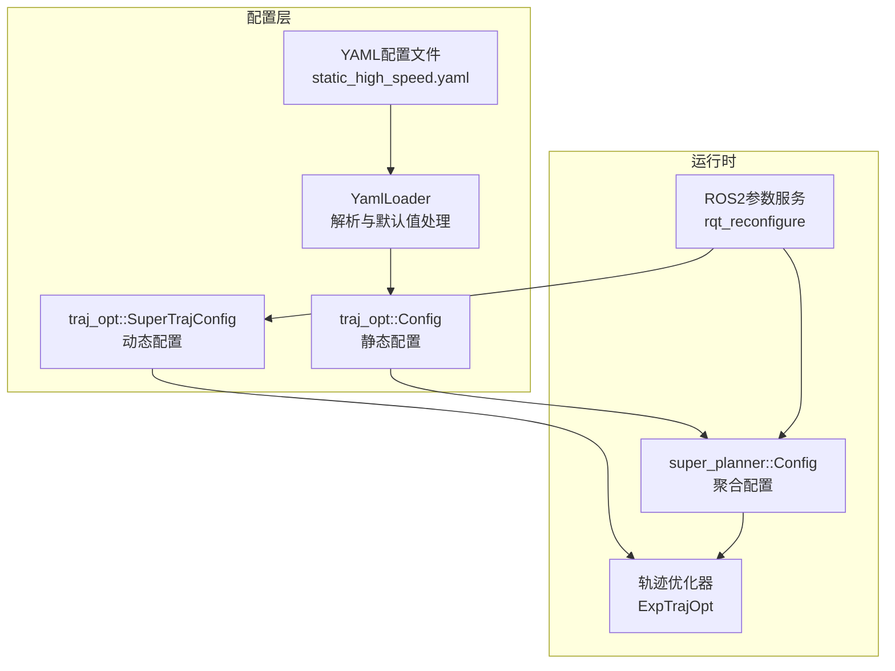
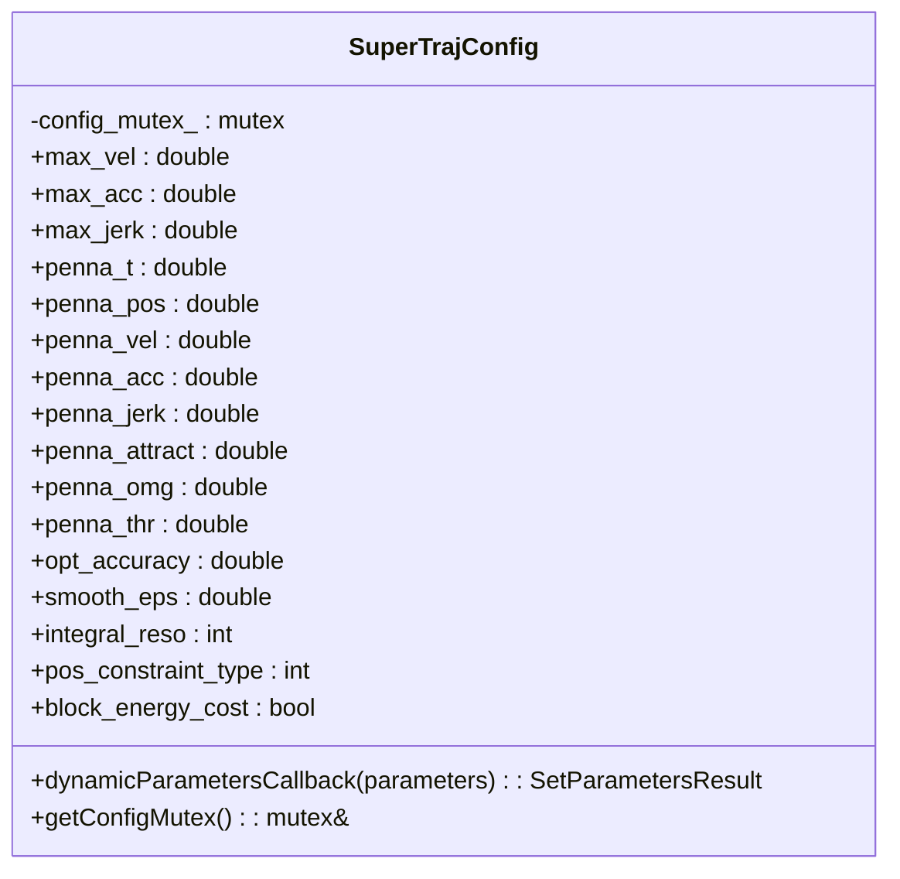
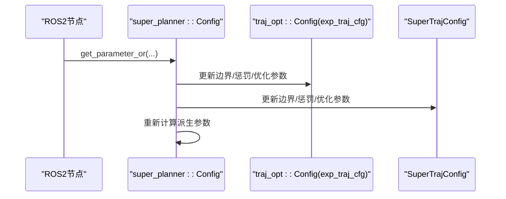
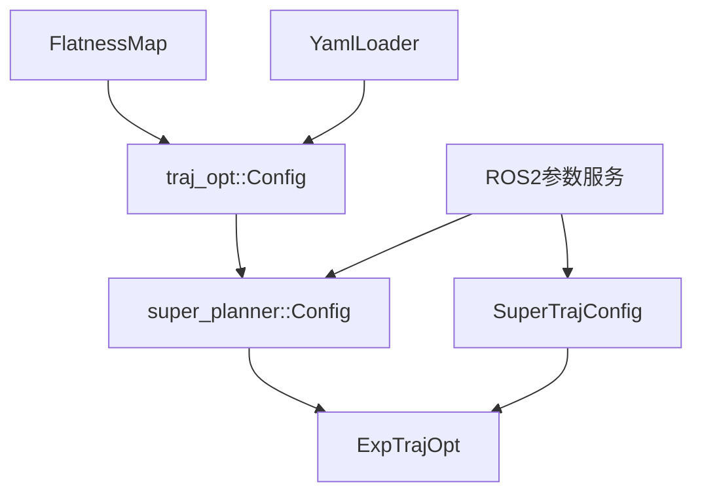

# 轨迹配置管理

<cite>
**本文档引用的文件**
- [super_traj_config.h](file://src/SUPER/super_planner/include/traj_opt/super_traj_config.h)
- [config.hpp](file://src/SUPER/super_planner/include/traj_opt/config.hpp)
- [super_core_config.hpp](file://src/SUPER/super_planner/include/super_core/config.hpp)
- [yaml_loader.hpp](file://src/SUPER/super_planner/include/utils/header/yaml_loader.hpp)
- [static_high_speed.yaml](file://src/SUPER/super_planner/config/static_high_speed.yaml)
- [test_dynamic_params.cpp](file://src/SUPER/super_planner/test/test_dynamic_params.cpp)
- [exp_traj_optimizer_s4.h](file://src/SUPER/super_planner/include/traj_opt/exp_traj_optimizer_s4.h)
- [trajectory.h](file://src/SUPER/super_planner/include/data_structure/base/trajectory.h)
- [quadrotor_flatness.hpp](file://src/SUPER/super_planner/include/utils/geometry/quadrotor_flatness.hpp)
- [fsm_ros2.hpp](file://src/SUPER/super_planner/include/ros_interface/ros2/fsm_ros2.hpp)
</cite>

## 目录
1. [简介](#简介)
2. [项目结构](#项目结构)
3. [核心组件](#核心组件)
4. [架构总览](#架构总览)
5. [详细组件分析](#详细组件分析)
6. [依赖关系分析](#依赖关系分析)
7. [性能考量](#性能考量)
8. [故障排查指南](#故障排查指南)
9. [结论](#结论)
10. [附录](#附录)

## 简介
本文件面向轨迹配置管理系统，围绕 SuperTrajConfig 类的设计与参数体系展开，系统性阐述静态配置与动态配置的区别、参数优先级与覆盖规则、运行时参数更新机制、配置验证逻辑，并提供针对不同飞行场景与硬件能力的调优建议。读者无需深入代码即可理解参数作用机制与使用方法。

## 项目结构
本项目采用模块化设计，轨迹配置管理主要涉及以下模块：
- 静态配置加载：通过 YAML 文件加载，支持命名空间隔离与全局缩放
- 动态配置更新：基于 ROS2 参数服务，支持运行时热更新
- 优化器集成：将配置注入轨迹优化器，保证参数一致性
- 工具链支撑：YAML 解析器、四旋翼平坦性映射、轨迹数据结构



**图表来源**
- [static_high_speed.yaml](file://src/SUPER/super_planner/config/static_high_speed.yaml#L37-L95)
- [yaml_loader.hpp](file://src/SUPER/super_planner/include/utils/header/yaml_loader.hpp#L48-L177)
- [config.hpp](file://src/SUPER/super_planner/include/traj_opt/config.hpp#L50-L180)
- [super_core_config.hpp](file://src/SUPER/super_planner/include/super_core/config.hpp#L44-L235)
- [super_traj_config.h](file://src/SUPER/super_planner/include/traj_opt/super_traj_config.h#L37-L179)
- [exp_traj_optimizer_s4.h](file://src/SUPER/super_planner/include/traj_opt/exp_traj_optimizer_s4.h#L55-L371)

**章节来源**
- [static_high_speed.yaml](file://src/SUPER/super_planner/config/static_high_speed.yaml#L37-L95)
- [yaml_loader.hpp](file://src/SUPER/super_planner/include/utils/header/yaml_loader.hpp#L48-L177)
- [config.hpp](file://src/SUPER/super_planner/include/traj_opt/config.hpp#L50-L180)
- [super_core_config.hpp](file://src/SUPER/super_planner/include/super_core/config.hpp#L44-L235)

## 核心组件
- 静态配置类 traj_opt::Config：负责从 YAML 文件加载参数，支持命名空间与全局缩放，初始化四旋翼平坦性映射
- 动态配置类 traj_opt::SuperTrajConfig：封装可运行时调整的参数，提供线程安全的动态参数回调
- 聚合配置类 super_planner::Config：组合静态与动态配置，提供运行时参数更新接口
- YAML 加载器 YamlLoader：统一的参数加载与类型校验工具
- 优化器集成：ExpTrajOpt 将静态与动态配置注入优化过程

**章节来源**
- [config.hpp](file://src/SUPER/super_planner/include/traj_opt/config.hpp#L50-L180)
- [super_traj_config.h](file://src/SUPER/super_planner/include/traj_opt/super_traj_config.h#L37-L179)
- [super_core_config.hpp](file://src/SUPER/super_planner/include/super_core/config.hpp#L44-L235)
- [yaml_loader.hpp](file://src/SUPER/super_planner/include/utils/header/yaml_loader.hpp#L48-L177)
- [exp_traj_optimizer_s4.h](file://src/SUPER/super_planner/include/traj_opt/exp_traj_optimizer_s4.h#L55-L371)

## 架构总览
下图展示从 YAML 到运行时参数更新的完整链路，以及优化器如何消费这些配置。

```mermaid
sequenceDiagram
participant User as "用户/系统"
participant YAML as "YAML配置文件"
participant Loader as "YamlLoader"
participant Static as "traj_opt : : Config"
participant Planner as "super_planner : : Config"
participant Dyn as "traj_opt : : SuperTrajConfig"
participant ROS as "ROS2参数服务"
participant Opt as "ExpTrajOpt"
User->>YAML : 提供配置文件
YAML->>Loader : 读取参数
Loader-->>Static : 返回解析后的静态参数
Static-->>Planner : 初始化静态配置(exp_traj_cfg/back_traj_cfg)
User->>ROS : 设置动态参数
ROS-->>Dyn : 触发动态参数回调
Dyn-->>Opt : 优化前更新动态配置
Planner-->>Opt : 传入静态配置
Opt-->>User : 输出轨迹
```

**图表来源**
- [static_high_speed.yaml](file://src/SUPER/super_planner/config/static_high_speed.yaml#L37-L95)
- [yaml_loader.hpp](file://src/SUPER/super_planner/include/utils/header/yaml_loader.hpp#L48-L177)
- [config.hpp](file://src/SUPER/super_planner/include/traj_opt/config.hpp#L110-L180)
- [super_core_config.hpp](file://src/SUPER/super_planner/include/super_core/config.hpp#L96-L228)
- [super_traj_config.h](file://src/SUPER/super_planner/include/traj_opt/super_traj_config.h#L72-L167)
- [exp_traj_optimizer_s4.h](file://src/SUPER/super_planner/include/traj_opt/exp_traj_optimizer_s4.h#L329-L356)

## 详细组件分析

### SuperTrajConfig 动态配置类
- 设计要点
  - 封装可运行时调整的参数，如边界约束、惩罚权重、优化参数与算法配置
  - 提供线程安全的动态参数回调，按参数名精确匹配并更新
  - 暴露互斥锁接口，确保优化过程中参数不被并发修改
- 关键参数类别
  - 边界约束：最大速度、最大加速度、最大急动度
  - 惩罚权重：时间、位置、速度、加速度、急动度、吸引子、角速度、推力等
  - 优化参数：优化精度、平滑系数、积分分辨率
  - 算法配置：位置约束类型、是否禁用能量代价
- 动态更新流程
  - ROS2 参数服务触发回调
  - 根据参数名分支更新对应字段
  - 记录更新日志并返回设置结果



**图表来源**
- [super_traj_config.h](file://src/SUPER/super_planner/include/traj_opt/super_traj_config.h#L37-L179)

**章节来源**
- [super_traj_config.h](file://src/SUPER/super_planner/include/traj_opt/super_traj_config.h#L37-L179)

### traj_opt::Config 静态配置类
- 设计要点
  - 从 YAML 文件加载参数，支持命名空间拼接
  - 支持全局缩放系数对所有惩罚项进行统一缩放
  - 初始化四旋翼平坦性映射，为能量代价与约束计算提供基础
- 参数加载流程
  - 解析命名空间，拼接参数路径
  - 分组加载：开关、边界、惩罚权重、优化参数等
  - 应用全局缩放系数
  - 初始化平坦性映射


**图表来源**
- [config.hpp](file://src/SUPER/super_planner/include/traj_opt/config.hpp#L110-L180)
- [yaml_loader.hpp](file://src/SUPER/super_planner/include/utils/header/yaml_loader.hpp#L48-L177)

**章节来源**
- [config.hpp](file://src/SUPER/super_planner/include/traj_opt/config.hpp#L50-L180)
- [yaml_loader.hpp](file://src/SUPER/super_planner/include/utils/header/yaml_loader.hpp#L48-L177)

### super_planner::Config 聚合配置与运行时更新
- 设计要点
  - 组合两个 traj_opt::Config 实例（探索轨迹与备份轨迹）
  - 提供运行时参数更新接口，从 ROS2 节点获取参数并回填到对应配置
  - 自动重新计算派生参数（如轨迹采样步长）
- 运行时更新流程
  - 读取 super_planner 命名空间下的布尔与数值参数
  - 读取 traj_opt 命名空间下的边界与惩罚权重参数
  - 更新静态与动态配置实例
  - 重新计算派生参数



**图表来源**
- [super_core_config.hpp](file://src/SUPER/super_planner/include/super_core/config.hpp#L158-L228)

**章节来源**
- [super_core_config.hpp](file://src/SUPER/super_planner/include/super_core/config.hpp#L44-L235)

### YAML 配置文件组织与参数优先级
- 文件组织
  - 使用命名空间分组：traj_opt/switch、traj_opt/boundary、traj_opt/exp_traj、traj_opt/backup_traj、traj_opt/flatness 等
  - 示例文件 static_high_speed.yaml 展示了高飞场景下的参数配置
- 参数优先级
  - 默认值：YamlLoader 在参数缺失或类型不匹配时使用默认值
  - 用户自定义：YAML 文件中的显式配置覆盖默认值
  - 系统自动调整：运行时通过 ROS2 参数服务更新，覆盖静态配置
  - 全局缩放：静态配置阶段的全局缩放系数统一调整所有惩罚权重

**章节来源**
- [static_high_speed.yaml](file://src/SUPER/super_planner/config/static_high_speed.yaml#L37-L95)
- [yaml_loader.hpp](file://src/SUPER/super_planner/include/utils/header/yaml_loader.hpp#L55-L128)
- [config.hpp](file://src/SUPER/super_planner/include/traj_opt/config.hpp#L164-L179)

### 动态参数更新机制与验证
- 更新入口
  - ROS2 参数服务：fsm_ros2.hpp 中声明并注册动态参数
  - 运行时更新：super_planner::Config 的 updateRuntimeParams
  - 单独动态配置：SuperTrajConfig 的动态参数回调
- 验证逻辑
  - 类型检查：YamlLoader 对参数类型进行严格校验
  - 必填参数：支持 required 标记，缺失时报错
  - 参数回调：动态更新时记录日志并返回结果
- 同步策略
  - 互斥保护：动态配置类提供互斥锁，避免优化过程中的并发修改
  - 优化前刷新：ExpTrajOpt 在每次优化前调用 updateOptimizerConfig 刷新配置

```mermaid
sequenceDiagram
participant Client as "参数客户端"
participant Service as "参数服务"
participant Dyn as "SuperTrajConfig"
participant Lock as "互斥锁"
participant Opt as "ExpTrajOpt"
Client->>Service : set_parameters(...)
Service->>Dyn : dynamicParametersCallback(...)
Dyn->>Lock : 加锁
Dyn-->>Dyn : 更新参数字段
Dyn-->>Service : 返回SetParametersResult
Service-->>Client : 结果
Opt->>Dyn : updateOptimizerConfig()
Dyn-->>Opt : 配置已刷新
```

**图表来源**
- [fsm_ros2.hpp](file://src/SUPER/super_planner/include/ros_interface/ros2/fsm_ros2.hpp#L489-L503)
- [super_traj_config.h](file://src/SUPER/super_planner/include/traj_opt/super_traj_config.h#L72-L167)
- [exp_traj_optimizer_s4.h](file://src/SUPER/super_planner/include/traj_opt/exp_traj_optimizer_s4.h#L352-L356)

**章节来源**
- [fsm_ros2.hpp](file://src/SUPER/super_planner/include/ros_interface/ros2/fsm_ros2.hpp#L489-L503)
- [super_traj_config.h](file://src/SUPER/super_planner/include/traj_opt/super_traj_config.h#L72-L167)
- [exp_traj_optimizer_s4.h](file://src/SUPER/super_planner/include/traj_opt/exp_traj_optimizer_s4.h#L352-L356)

### 参数作用机制详解
- 最大速度限制(max velocity)
  - 影响轨迹采样步长与整体规划时域
  - 在静态配置中设置，运行时可通过动态参数调整
- 最大加速度限制(max acceleration)
  - 限制轨迹的加加速度惩罚权重与优化可行域
  - 支持运行时热更新，影响优化收敛行为
- 急动度限制(jerk limits)
  - 通过急动度惩罚权重平衡轨迹平滑性与时间最优性
  - 在高飞场景下应适当增大以提升舒适性
- 能量成本权重(energy cost weights)
  - 由平坦性映射与全局缩放系数共同决定
  - 可通过 block_energy_cost 禁用能量代价，适用于特定场景

**章节来源**
- [config.hpp](file://src/SUPER/super_planner/include/traj_opt/config.hpp#L58-L98)
- [quadrotor_flatness.hpp](file://src/SUPER/super_planner/include/utils/geometry/quadrotor_flatness.hpp#L57-L302)
- [super_core_config.hpp](file://src/SUPER/super_planner/include/super_core/config.hpp#L131-L133)

## 依赖关系分析
- 组件耦合
  - traj_opt::Config 依赖 YamlLoader 与四旋翼平坦性映射
  - super_planner::Config 组合两个 traj_opt::Config 实例
  - SuperTrajConfig 与 ExpTrajOpt 通过动态参数回调与互斥锁协作
- 外部依赖
  - YAML 解析库：用于参数文件解析
  - ROS2 参数服务：用于动态参数更新
  - Eigen：用于数值计算与矩阵运算



**图表来源**
- [yaml_loader.hpp](file://src/SUPER/super_planner/include/utils/header/yaml_loader.hpp#L48-L177)
- [config.hpp](file://src/SUPER/super_planner/include/traj_opt/config.hpp#L58-L98)
- [super_core_config.hpp](file://src/SUPER/super_planner/include/super_core/config.hpp#L55-L101)
- [super_traj_config.h](file://src/SUPER/super_planner/include/traj_opt/super_traj_config.h#L37-L179)
- [exp_traj_optimizer_s4.h](file://src/SUPER/super_planner/include/traj_opt/exp_traj_optimizer_s4.h#L55-L371)

**章节来源**
- [yaml_loader.hpp](file://src/SUPER/super_planner/include/utils/header/yaml_loader.hpp#L48-L177)
- [config.hpp](file://src/SUPER/super_planner/include/traj_opt/config.hpp#L58-L98)
- [super_core_config.hpp](file://src/SUPER/super_planner/include/super_core/config.hpp#L55-L101)
- [super_traj_config.h](file://src/SUPER/super_planner/include/traj_opt/super_traj_config.h#L37-L179)
- [exp_traj_optimizer_s4.h](file://src/SUPER/super_planner/include/traj_opt/exp_traj_optimizer_s4.h#L55-L371)

## 性能考量
- 优化精度与收敛速度
  - opt_accuracy 过小可能导致收敛困难；过大可能牺牲轨迹质量
  - 建议在仿真中逐步减小以观察收敛行为
- 积分分辨率与计算开销
  - integral_reso 增大提升积分精度但增加计算量
  - 建议结合硬件能力与实时性需求权衡
- 平滑系数与轨迹质量
  - smooth_eps 过小易导致数值不稳定；过大可能过度平滑
  - 建议结合急动度惩罚权重联合调节
- 边界参数与可行性
  - max_vel/max_acc/max_jerk 过大可能引发不可行问题
  - 建议先以保守值启动，再逐步放宽

## 故障排查指南
- 参数未生效
  - 检查参数命名空间是否正确（traj_opt.boundary.*、traj_opt.exp_traj.*）
  - 确认参数类型与期望一致（double/int/bool）
- 参数更新失败
  - 查看动态参数回调日志，确认参数名匹配
  - 检查互斥锁是否在优化过程中被占用
- YAML 解析错误
  - 检查参数类型与默认值是否匹配
  - 必填参数缺失时会抛出异常
- 轨迹不可行
  - 降低边界参数或增大惩罚权重
  - 检查平坦性参数与全局缩放系数设置

**章节来源**
- [test_dynamic_params.cpp](file://src/SUPER/super_planner/test/test_dynamic_params.cpp#L37-L103)
- [yaml_loader.hpp](file://src/SUPER/super_planner/include/utils/header/yaml_loader.hpp#L70-L128)
- [super_core_config.hpp](file://src/SUPER/super_planner/include/super_core/config.hpp#L158-L228)

## 结论
本系统通过“静态配置 + 动态配置”的双轨机制，实现了从离线配置到在线调参的完整闭环。静态配置保证参数的稳定与可复现，动态配置提供灵活的运行时调整能力。配合严格的类型校验与互斥保护，系统在复杂飞行场景下具备良好的鲁棒性与可维护性。

## 附录

### 配置参数速查表
- 边界约束
  - max_vel：最大速度（m/s）
  - max_acc：最大加速度（m/s²）
  - max_jerk：最大急动度（m/s³）
- 惩罚权重
  - penna_t：时间惩罚
  - penna_pos：位置惩罚
  - penna_vel：速度惩罚
  - penna_acc：加速度惩罚
  - penna_jerk：急动度惩罚
  - penna_attract：吸引子惩罚
  - penna_omg：角速度惩罚
  - penna_thr：推力惩罚
- 优化参数
  - opt_accuracy：优化精度
  - smooth_eps：平滑系数
  - integral_reso：积分分辨率
- 算法配置
  - pos_constraint_type：位置约束类型（1-路径点，2-走廊）
  - block_energy_cost：禁用能量代价
  - uniform_time_en：备份轨迹均匀时间分配（仅备份轨迹）

**章节来源**
- [super_core_config.hpp](file://src/SUPER/super_planner/include/super_core/config.hpp#L183-L224)
- [super_traj_config.h](file://src/SUPER/super_planner/include/traj_opt/super_traj_config.h#L42-L65)
- [config.hpp](file://src/SUPER/super_planner/include/traj_opt/config.hpp#L78-L98)