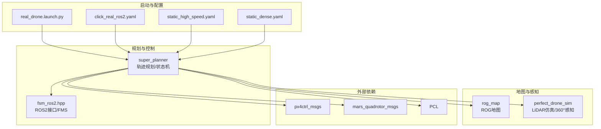
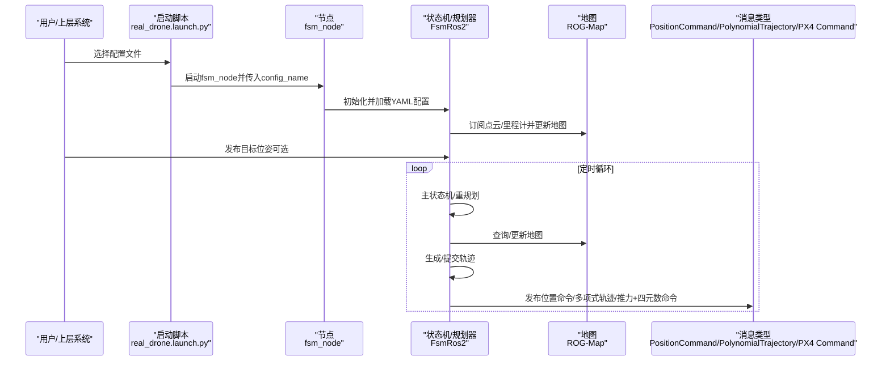
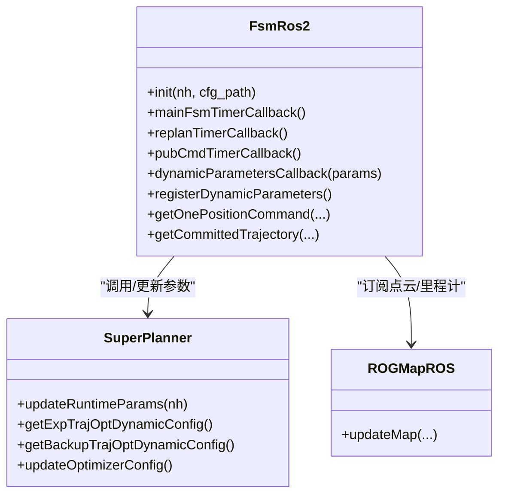
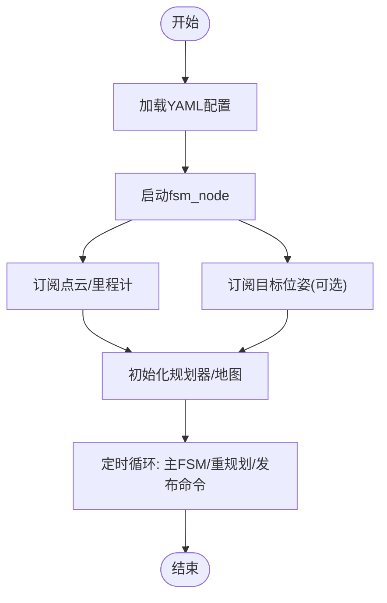
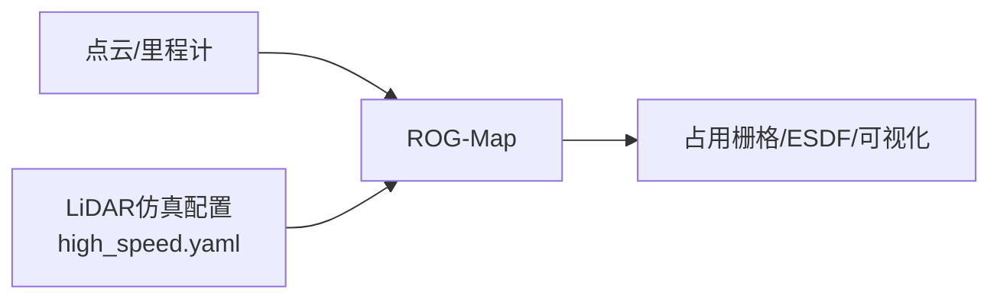
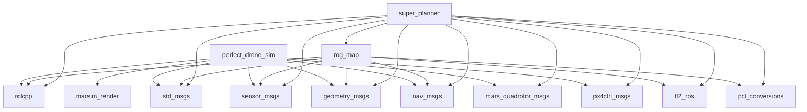

# 实际部署

<cite>
**本文引用的文件**
- [README.md](file://src/SUPER/README.md)
- [super_planner/package.xml](file://src/SUPER/super_planner/package.xml)
- [super_planner/CMakeLists.txt](file://src/SUPER/super_planner/CMakeLists.txt)
- [super_planner/docs/CONFIGURATION_GUIDE.md](file://src/SUPER/super_planner/docs/CONFIGURATION_GUIDE.md)
- [super_planner/config/click_real_ros2.yaml](file://src/SUPER/super_planner/config/click_real_ros2.yaml)
- [super_planner/config/static_high_speed.yaml](file://src/SUPER/super_planner/config/static_high_speed.yaml)
- [super_planner/config/static_dense.yaml](file://src/SUPER/super_planner/config/static_dense.yaml)
- [super_planner/launch/real_drone.launch.py](file://src/SUPER/super_planner/launch/real_drone.launch.py)
- [mission_planner/launch/click_demo_real.launch.py](file://src/SUPER/mission_planner/launch/click_demo_real.launch.py)
- [super_planner/include/ros_interface/ros2/fsm_ros2.hpp](file://src/SUPER/super_planner/include/ros_interface/ros2/fsm_ros2.hpp)
- [perfect_drone_sim/config/high_speed.yaml](file://src/SUPER/mars_uav_sim/perfect_drone_sim/config/high_speed.yaml)
- [rog_map/package.xml](file://src/SUPER/rog_map/package.xml)
- [mars_uav_sim/perfect_drone_sim/package.xml](file://src/SUPER/mars_uav_sim/perfect_drone_sim/package.xml)
</cite>

## 目录
1. [简介](#简介)
2. [项目结构](#项目结构)
3. [核心组件](#核心组件)
4. [架构总览](#架构总览)
5. [详细组件分析](#详细组件分析)
6. [依赖关系分析](#依赖关系分析)
7. [性能考虑](#性能考虑)
8. [故障排查指南](#故障排查指南)
9. [结论](#结论)
10. [附录](#附录)

## 简介
本文件面向“从仿真到真实飞行”的实际部署，基于仓库中的超级规划系统（SUPER），提供从环境准备、系统配置、参数校准、测试验证到风险评估与应急预案的完整流程说明。内容覆盖室内、室外、复杂环境等典型场景，并给出可操作的实施建议与最佳实践。

## 项目结构
该仓库采用多包协作的ROS2工作空间布局，核心模块包括：
- 超级规划器（super_planner）：负责轨迹规划、状态机与消息发布
- ROG地图（rog_map）：高效占用栅格地图与局部更新
- 无人机仿真（perfect_drone_sim）：提供LiDAR感知与仿真环境
- 任务规划器（mission_planner）：提供演示与真实飞行启动脚本

**图表来源**
- [super_planner/CMakeLists.txt](file://src/SUPER/super_planner/CMakeLists.txt#L33-L74)
- [super_planner/package.xml](file://src/SUPER/super_planner/package.xml#L8-L15)
- [super_planner/launch/real_drone.launch.py](file://src/SUPER/super_planner/launch/real_drone.launch.py#L23-L31)
- [super_planner/config/click_real_ros2.yaml](file://src/SUPER/super_planner/config/click_real_ros2.yaml#L1-L187)

**章节来源**
- [super_planner/CMakeLists.txt](file://src/SUPER/super_planner/CMakeLists.txt#L33-L74)
- [super_planner/package.xml](file://src/SUPER/super_planner/package.xml#L8-L15)
- [super_planner/launch/real_drone.launch.py](file://src/SUPER/super_planner/launch/real_drone.launch.py#L10-L34)

## 核心组件
- 状态机与规划器（FsmRos2）：封装ROS2接口、订阅目标、定时执行、发布轨迹与命令；支持动态参数回调与日志记录
- ROG地图（rog_map）：接收点云与里程计，维护占用栅格、ESDF与可视化
- 启动脚本（real_drone.launch.py）：加载配置并启动规划节点
- 配置文件（YAML）：按场景预设参数，支持运行时动态调整

关键职责与交互：
- 输入：目标位姿、点云、里程计
- 输出：位置/多项式轨迹命令、推力+姿态命令、可视化路径
- 关键话题：/planning/pos_cmd、/planning_cmd/poly_traj、/planning/px4ctrl_cmd、/fsm/path

**章节来源**
- [super_planner/include/ros_interface/ros2/fsm_ros2.hpp](file://src/SUPER/super_planner/include/ros_interface/ros2/fsm_ros2.hpp#L286-L370)
- [super_planner/config/click_real_ros2.yaml](file://src/SUPER/super_planner/config/click_real_ros2.yaml#L1-L187)

## 架构总览
下图展示从目标输入到命令发布的端到端流程，以及与地图、消息类型的交互。

**图表来源**
- [super_planner/launch/real_drone.launch.py](file://src/SUPER/super_planner/launch/real_drone.launch.py#L23-L31)
- [super_planner/include/ros_interface/ros2/fsm_ros2.hpp](file://src/SUPER/super_planner/include/ros_interface/ros2/fsm_ros2.hpp#L286-L370)
- [super_planner/include/ros_interface/ros2/fsm_ros2.hpp](file://src/SUPER/super_planner/include/ros_interface/ros2/fsm_ros2.hpp#L432-L439)
- [super_planner/include/ros_interface/ros2/fsm_ros2.hpp](file://src/SUPER/super_planner/include/ros_interface/ros2/fsm_ros2.hpp#L372-L431)

## 详细组件分析

### 组件A：状态机与规划器（FsmRos2）
- 职责
  - 初始化ROS2节点、加载配置、订阅目标、创建定时器
  - 与SuperPlanner交互，生成/提交轨迹
  - 将轨迹转换为多种命令格式并发布
  - 注册动态参数回调，支持运行时调整
  - 记录轨迹命令与重规划日志
- 关键接口
  - 初始化：读取配置、创建话题、注册回调
  - 定时回调：主状态机推进、重规划、命令发布
  - 动态参数：声明参数、回调同步到优化器

**图表来源**
- [super_planner/include/ros_interface/ros2/fsm_ros2.hpp](file://src/SUPER/super_planner/include/ros_interface/ros2/fsm_ros2.hpp#L286-L370)
- [super_planner/include/ros_interface/ros2/fsm_ros2.hpp](file://src/SUPER/super_planner/include/ros_interface/ros2/fsm_ros2.hpp#L447-L483)

**章节来源**
- [super_planner/include/ros_interface/ros2/fsm_ros2.hpp](file://src/SUPER/super_planner/include/ros_interface/ros2/fsm_ros2.hpp#L286-L370)
- [super_planner/include/ros_interface/ros2/fsm_ros2.hpp](file://src/SUPER/super_planner/include/ros_interface/ros2/fsm_ros2.hpp#L447-L535)

### 组件B：配置与启动（YAML + Launch）
- 配置文件
  - click_real_ros2.yaml：真实飞行常用参数（话题、重规划频率、轨迹边界等）
  - static_high_speed.yaml：高速场景参数（高边界、较大惩罚权重）
  - static_dense.yaml：密集环境参数（较小走廊、更高约束）
- 启动脚本
  - real_drone.launch.py：加载指定配置并启动fsm_node
  - click_demo_real.launch.py：真实飞行演示启动脚本（默认加载click_real_ros2.yaml）

**图表来源**
- [super_planner/launch/real_drone.launch.py](file://src/SUPER/super_planner/launch/real_drone.launch.py#L10-L34)
- [super_planner/config/click_real_ros2.yaml](file://src/SUPER/super_planner/config/click_real_ros2.yaml#L1-L187)

**章节来源**
- [super_planner/launch/real_drone.launch.py](file://src/SUPER/super_planner/launch/real_drone.launch.py#L10-L34)
- [mission_planner/launch/click_demo_real.launch.py](file://src/SUPER/mission_planner/launch/click_demo_real.launch.py#L12-L36)
- [super_planner/config/click_real_ros2.yaml](file://src/SUPER/super_planner/config/click_real_ros2.yaml#L1-L187)
- [super_planner/config/static_high_speed.yaml](file://src/SUPER/super_planner/config/static_high_speed.yaml#L1-L187)
- [super_planner/config/static_dense.yaml](file://src/SUPER/super_planner/config/static_dense.yaml#L1-L186)

### 组件C：地图与感知（ROG-Map + LiDAR仿真）
- ROG-Map
  - 接收点云与里程计，维护占用栅格、ESDF与可视化
  - 支持概率更新、虚拟地/天花板、滑动地图等
- LiDAR仿真
  - 提供360°LiDAR模拟参数（如感知范围、俯仰角、采样率等）

**图表来源**
- [super_planner/config/click_real_ros2.yaml](file://src/SUPER/super_planner/config/click_real_ros2.yaml#L134-L150)
- [perfect_drone_sim/config/high_speed.yaml](file://src/SUPER/mars_uav_sim/perfect_drone_sim/config/high_speed.yaml#L10-L26)

**章节来源**
- [super_planner/config/click_real_ros2.yaml](file://src/SUPER/super_planner/config/click_real_ros2.yaml#L134-L187)
- [perfect_drone_sim/config/high_speed.yaml](file://src/SUPER/mars_uav_sim/perfect_drone_sim/config/high_speed.yaml#L10-L26)

## 依赖关系分析
- 包依赖
  - super_planner依赖rclcpp、std_msgs、sensor_msgs、geometry_msgs、nav_msgs、tf2_ros、pcl_conversions、rog_map、mars_quadrotor_msgs、px4ctrl_msgs
  - rog_map依赖rclcpp、std_msgs、sensor_msgs、geometry_msgs、nav_msgs、tf2_ros、pcl_conversions
  - perfect_drone_sim依赖rclcpp、std_msgs、sensor_msgs、geometry_msgs、nav_msgs、mars_quadrotor_msgs、marsim_render、px4ctrl_msgs
- 编译链接
  - CMake查找PCL、yaml-cpp、-ldw等第三方库，并链接rog_map核心库

**图表来源**
- [super_planner/package.xml](file://src/SUPER/super_planner/package.xml#L8-L15)
- [rog_map/package.xml](file://src/SUPER/rog_map/package.xml#L12-L18)
- [mars_uav_sim/perfect_drone_sim/package.xml](file://src/SUPER/mars_uav_sim/perfect_drone_sim/package.xml#L8-L15)

**章节来源**
- [super_planner/package.xml](file://src/SUPER/super_planner/package.xml#L8-L15)
- [rog_map/package.xml](file://src/SUPER/rog_map/package.xml#L12-L18)
- [mars_uav_sim/perfect_drone_sim/package.xml](file://src/SUPER/mars_uav_sim/perfect_drone_sim/package.xml#L8-L15)

## 性能考虑
- 参数与场景适配
  - 高速场景：提高边界速度/加速度/加加速度，增大时间惩罚权重，降低平滑以提升响应
  - 密集环境：缩小走廊边界、增强位置约束、提高积分分辨率与优化精度
- 地图与A*搜索
  - 地图分辨率与A*启发式类型影响搜索效率与路径质量
  - ESDF与概率更新可提升局部适应性，但会增加计算开销
- 动态参数与日志
  - 使用rqt_reconfigure在线调整，结合日志统计评估性能

**章节来源**
- [super_planner/docs/CONFIGURATION_GUIDE.md](file://src/SUPER/super_planner/docs/CONFIGURATION_GUIDE.md#L226-L290)
- [super_planner/config/static_high_speed.yaml](file://src/SUPER/super_planner/config/static_high_speed.yaml#L42-L95)
- [super_planner/config/static_dense.yaml](file://src/SUPER/super_planner/config/static_dense.yaml#L41-L94)

## 故障排查指南
- 轨迹优化失败
  - 检查走廊有效性、惩罚权重是否过大、初值是否合理
  - 降低优化精度或放松位置约束
- 轨迹不连续/跳跃
  - 增大加加速度惩罚与平滑参数
- 规划缓慢
  - 降低A*分辨率、优化精度与积分分辨率
- 动态参数不生效
  - 检查参数名大小写、确认回调是否触发、必要时重启节点

**章节来源**
- [super_planner/docs/CONFIGURATION_GUIDE.md](file://src/SUPER/super_planner/docs/CONFIGURATION_GUIDE.md#L325-L384)

## 结论
通过明确的配置文件、启动脚本与状态机接口，本系统可在仿真与真实硬件间平滑过渡。建议在部署前完成充分的参数校准与测试，并建立标准化的风险评估与应急预案，确保在不同场景下的安全性与鲁棒性。

## 附录

### 部署流程（从仿真到真实飞行）
- 环境准备
  - 安装ROS2与依赖，构建工作空间
  - 验证仿真环境（LiDAR仿真参数、点云/里程计话题）
- 系统配置
  - 选择场景配置（室内/室外/密集），加载对应YAML
  - 启动规划节点与可视化（RViz）
- 安全检查
  - 检查话题连通性与消息格式
  - 校验边界参数与地图可视范围
- 参数校准
  - 先保守参数测试，再逐步提升性能
  - 使用rqt_reconfigure在线调整，记录日志
- 测试验证
  - 功能测试：目标可达、轨迹平滑、无碰撞
  - 性能测试：重规划频率、轨迹跟踪误差
  - 安全测试：急停、降级策略、通信中断恢复
- 风险评估与预案
  - 飞行前：场地与设备检查、人员培训
  - 飞行中：监控轨迹与状态，异常立即接管
  - 飞行后：数据回放与复盘

**章节来源**
- [README.md](file://src/SUPER/README.md#L100-L121)
- [super_planner/launch/real_drone.launch.py](file://src/SUPER/super_planner/launch/real_drone.launch.py#L10-L34)
- [super_planner/docs/CONFIGURATION_GUIDE.md](file://src/SUPER/super_planner/docs/CONFIGURATION_GUIDE.md#L291-L323)

### 不同部署场景的实施方案
- 室内
  - 配置要点：较小走廊边界、禁用对角线移动、适度平滑
  - 参考参数：A*分辨率、走廊边界、位置约束权重
- 室外
  - 配置要点：较大感知范围、较高边界、时间惩罚为主
  - 参考参数：max_vel/max_acc/max_jerk、penna_t
- 复杂环境
  - 配置要点：高约束、高精度、局部更新
  - 参考参数：积分分辨率、概率更新、ESDF开关

**章节来源**
- [super_planner/docs/CONFIGURATION_GUIDE.md](file://src/SUPER/super_planner/docs/CONFIGURATION_GUIDE.md#L277-L288)
- [super_planner/config/static_high_speed.yaml](file://src/SUPER/super_planner/config/static_high_speed.yaml#L42-L95)
- [super_planner/config/static_dense.yaml](file://src/SUPER/super_planner/config/static_dense.yaml#L41-L94)

### 参数校准步骤
- 飞行参数
  - max_vel/max_acc/max_jerk、yaw_dot_max、mpc_horizon
- 传感器参数
  - 点云强度阈值、时间下采样、ESDF范围
- 地图参数
  - 分辨率、膨胀步数、虚拟地/天花板高度、滑动阈值

**章节来源**
- [super_planner/config/click_real_ros2.yaml](file://src/SUPER/super_planner/config/click_real_ros2.yaml#L48-L187)
- [super_planner/config/static_high_speed.yaml](file://src/SUPER/super_planner/config/static_high_speed.yaml#L106-L187)
- [super_planner/config/static_dense.yaml](file://src/SUPER/super_planner/config/static_dense.yaml#L105-L186)

### 系统测试方法
- 功能测试
  - 点击目标可达性、轨迹跟随、避障有效性
- 性能测试
  - 重规划周期、轨迹平滑度、CPU/内存占用
- 安全测试
  - 急停响应、通信中断、备份轨迹切换

**章节来源**
- [super_planner/docs/CONFIGURATION_GUIDE.md](file://src/SUPER/super_planner/docs/CONFIGURATION_GUIDE.md#L300-L313)

### 部署前准备
- 场地检查
  - 无障碍物、GPS可用性、空域许可
- 设备检查
  - 传感器标定、飞控固件、遥控器与地面站
- 人员培训
  - 操作流程、应急处置、参数调整

**章节来源**
- [README.md](file://src/SUPER/README.md#L202-L204)

### 部署过程中的风险评估与应急预案
- 风险识别
  - 通信中断、传感器失效、动力学模型不匹配
- 应急预案
  - 自动降级至备份轨迹、切换到手动模式、紧急降落

**章节来源**
- [super_planner/include/ros_interface/ros2/fsm_ros2.hpp](file://src/SUPER/super_planner/include/ros_interface/ros2/fsm_ros2.hpp#L447-L483)

### 部署后的验证与验收标准
- 验证指标
  - 轨迹跟踪误差、重规划次数、计算耗时
- 验收标准
  - 在目标场景下满足安全与性能门槛

**章节来源**
- [super_planner/docs/CONFIGURATION_GUIDE.md](file://src/SUPER/super_planner/docs/CONFIGURATION_GUIDE.md#L406-L410)

### 常见问题处理
- 轨迹优化失败：降低精度、放松约束
- 轨迹不连续：增大jerk与平滑
- 规划慢：降低分辨率与精度
- 动态参数无效：检查参数名与回调

**章节来源**
- [super_planner/docs/CONFIGURATION_GUIDE.md](file://src/SUPER/super_planner/docs/CONFIGURATION_GUIDE.md#L325-L384)