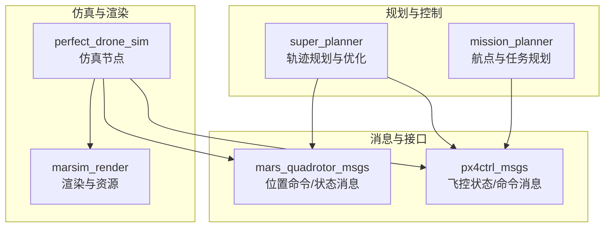
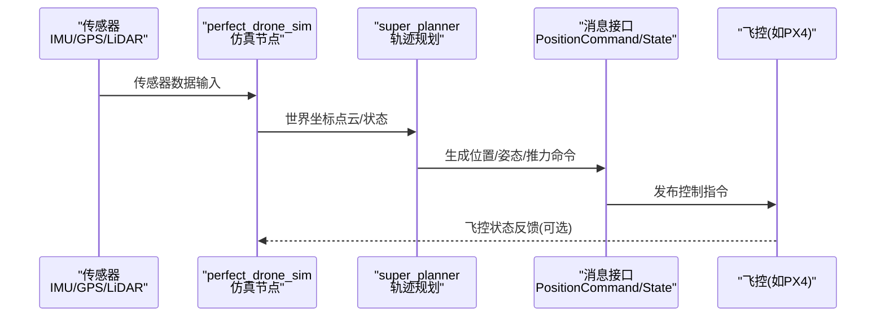
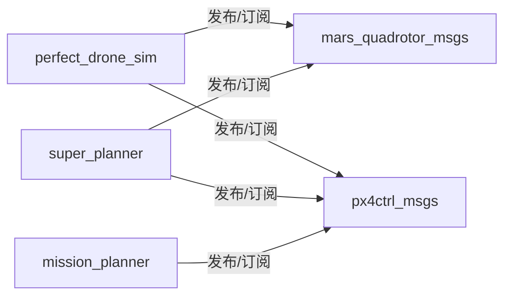

# 硬件集成

<cite>
**本文引用的文件**
- [README.md](file://src/SUPER/README.md)
- [package.xml](file://src/SUPER/mars_uav_sim/perfect_drone_sim/package.xml)
- [CMakeLists.txt](file://src/SUPER/mars_uav_sim/perfect_drone_sim/CMakeLists.txt)
- [package.xml](file://src/SUPER/super_planner/package.xml)
- [package.xml](file://src/SUPER/mission_planner/package.xml)
- [ros2_perfect_drone_node.cpp](file://src/SUPER/mars_uav_sim/perfect_drone_sim/src/ros2_perfect_drone_node.cpp)
- [super_planner.cpp](file://src/SUPER/super_planner/src/super_core/super_planner.cpp)
- [package.xml](file://src/SUPER/mars_uav_sim/mars_quadrotor_msgs/package.xml)
- [package.xml](file://src/SUPER/mars_uav_sim/px4ctrl_msgs/package.xml)
- [QuadrotorState.msg](file://src/SUPER/mars_uav_sim/mars_quadrotor_msgs/ros2_msg/QuadrotorState.msg)
- [PositionCommand.msg](file://src/SUPER/mars_uav_sim/mars_quadrotor_msgs/ros2_msg/PositionCommand.msg)
- [State.msg](file://src/SUPER/mars_uav_sim/px4ctrl_msgs/msg/State.msg)
- [high_speed.yaml](file://src/SUPER/mars_uav_sim/perfect_drone_sim/config/high_speed.yaml)
- [click.yaml](file://src/SUPER/super_planner/config/click.yaml)
</cite>

## 目录
1. [简介](#简介)
2. [项目结构](#项目结构)
3. [核心组件](#核心组件)
4. [架构总览](#架构总览)
5. [详细组件分析](#详细组件分析)
6. [依赖关系分析](#依赖关系分析)
7. [性能考量](#性能考量)
8. [故障排查指南](#故障排查指南)
9. [结论](#结论)
10. [附录](#附录)

## 简介
本文件面向硬件集成工程师与系统工程师，围绕SUPER的硬件集成需求与方法展开，重点覆盖以下方面：
- 飞控系统（以PX4为例）的硬件接口规范与消息契约
- 传感器配置与硬件连接方式（IMU、GPS、LiDAR等）
- 硬件平台选型标准、性能要求与兼容性检查
- 硬件参数校准流程（IMU校准、传感器标定、系统平衡）
- 不同硬件配置的集成指南（室内/室外差异）
- 硬件安全检查流程（电气、机械、飞行）
- 硬件故障诊断与维修建议
- 硬件升级与扩展建议

注：根据仓库信息，硬件组件与飞控控制的消息接口在本仓库中通过独立包与消息定义体现；实际硬件部署的完整指南可在SUPER-Hardware仓库获取。

章节来源
- file://src/SUPER/README.md#L28-L31
- file://src/SUPER/README.md#L202-L205

## 项目结构
本仓库采用按功能模块划分的ROS2工作空间布局，与硬件集成密切相关的模块包括：
- 仿真与渲染：marsim_render、perfect_drone_sim
- 规划与控制：super_planner、mission_planner
- 消息与接口：mars_quadrotor_msgs、px4ctrl_msgs

下图给出与硬件集成相关的主要模块与依赖关系概览：

图表来源
- [package.xml](file://src/SUPER/mars_uav_sim/perfect_drone_sim/package.xml#L1-L20)
- [package.xml](file://src/SUPER/super_planner/package.xml#L1-L21)
- [package.xml](file://src/SUPER/mission_planner/package.xml#L1-L19)
- [package.xml](file://src/SUPER/mars_uav_sim/mars_quadrotor_msgs/package.xml#L1-L26)
- [package.xml](file://src/SUPER/mars_uav_sim/px4ctrl_msgs/package.xml#L1-L22)

章节来源
- file://src/SUPER/mars_uav_sim/perfect_drone_sim/package.xml#L1-L20
- file://src/SUPER/super_planner/package.xml#L1-L21
- file://src/SUPER/mission_planner/package.xml#L1-L19

## 核心组件
- 仿真与感知模块（perfect_drone_sim）
  - 提供基于ROS2的无人机仿真节点，支持LiDAR感知配置（含360度LiDAR），并通过消息接口与规划/控制模块交互。
- 轨迹规划模块（super_planner）
  - 实现轨迹生成、优化与备份策略，输出位置/姿态/推力等命令消息，供飞控执行。
- 任务规划模块（mission_planner）
  - 提供航点任务与目标设定接口，与飞控消息契约对接。
- 消息与接口（mars_quadrotor_msgs、px4ctrl_msgs）
  - 定义位置命令、姿态/角速度、飞控状态等消息格式，确保硬件侧飞控/控制器能够解析与执行。

章节来源
- file://src/SUPER/mars_uav_sim/perfect_drone_sim/CMakeLists.txt#L58-L70
- file://src/SUPER/super_planner/src/super_core/super_planner.cpp#L33-L74
- file://src/SUPER/mars_uav_sim/mars_quadrotor_msgs/package.xml#L1-L26
- file://src/SUPER/mars_uav_sim/px4ctrl_msgs/package.xml#L1-L22

## 架构总览
下图展示硬件集成视角下的端到端数据流：传感器采集 → 仿真/感知模块 → 规划模块 → 控制消息 → 飞控执行。

图表来源
- [ros2_perfect_drone_node.cpp](file://src/SUPER/mars_uav_sim/perfect_drone_sim/src/ros2_perfect_drone_node.cpp#L1-L11)
- [super_planner.cpp](file://src/SUPER/super_planner/src/super_core/super_planner.cpp#L33-L74)
- [package.xml](file://src/SUPER/mars_uav_sim/perfect_drone_sim/package.xml#L13-L15)
- [package.xml](file://src/SUPER/super_planner/package.xml#L13-L15)

## 详细组件分析

### 传感器配置与硬件连接
- LiDAR配置
  - 支持360度LiDAR仿真，可通过配置文件设置类型、垂直视场、感知范围、刷新率等参数。
  - LiDAR点云需以世界坐标帧提供，以便后续地图与规划模块正确处理。
- IMU/GPS
  - 飞控状态消息包含位置、速度、姿态四元数与角速度等字段，可用于验证IMU/GPS融合状态。
- 硬件连接建议
  - 传感器应尽量靠近机体系中心，减少安装误差；IMU与相机/激光雷达的外参需准确标定。
  - 电源与信号线走线避免高频干扰，保证信号完整性。

章节来源
- file://src/SUPER/mars_uav_sim/perfect_drone_sim/config/high_speed.yaml#L10-L27
- file://src/SUPER/README.md#L246-L246
- file://src/SUPER/mars_uav_sim/px4ctrl_msgs/msg/State.msg#L1-L12

### 飞控系统（以PX4）的硬件接口规范
- 消息契约
  - 飞控状态消息包含位置、速度、姿态四元数、角速度与各电机转速等字段，便于上层规划模块进行闭环验证与控制。
  - 位置命令消息包含目标位置、速度、加速度、急动度、姿态、推力、偏航与偏航率等，满足高动态飞行需求。
- 话题与参数
  - 任务规划模块依赖mavros_msgs等依赖，表明与飞控生态的对接能力。
  - 规划模块配置项中包含命令话题、重规划频率等，用于与飞控调度协同。

章节来源
- file://src/SUPER/mars_uav_sim/px4ctrl_msgs/msg/State.msg#L1-L12
- file://src/SUPER/mars_uav_sim/mars_quadrotor_msgs/ros2_msg/PositionCommand.msg#L1-L30
- file://src/SUPER/mission_planner/package.xml#L13-L13
- file://src/SUPER/super_planner/config/click.yaml#L8-L11

### 硬件平台选型标准与兼容性检查
- 选型标准
  - 计算性能：满足实时轨迹优化与A*搜索的CPU/GPU负载要求。
  - 通信接口：具备稳定的ROS2运行环境与足够的I/O带宽。
  - 传感器兼容：支持IMU、GPS、LiDAR等主流传感器接入。
- 兼容性检查
  - 仿真与真实硬件的坐标系一致性（点云与状态消息均以世界坐标为准）。
  - 消息频率与延迟满足规划/控制周期要求。

章节来源
- file://src/SUPER/README.md#L123-L129
- file://src/SUPER/README.md#L246-L246
- file://src/SUPER/super_planner/config/click.yaml#L8-L11

### 硬件参数校准方法
- IMU校准
  - 在静置状态下进行多方位静态采样，估计零偏与尺度因子，消除安装误差。
- 传感器标定
  - IMU-相机/IMU-LiDAR外参标定，确保点云与IMU在同一世界坐标系下。
- 系统平衡调整
  - 重心与质心对齐，四旋翼拉力与反扭矩平衡，避免持续漂移。

（本节为通用工程实践，不直接分析具体文件）

### 不同硬件配置的集成指南
- 室内配置
  - 低动态、高密度障碍环境，推荐高帧率LiDAR与IMU组合，降低感知盲区。
- 室外配置
  - 需更强抗扰能力与GPS辅助，提升定位精度与鲁棒性；注意强光/雨雪等环境影响。

（本节为通用工程实践，不直接分析具体文件）

### 硬件安全检查流程
- 电气安全
  - 检查电源功率余量、电压纹波、接插件紧固度。
- 机械安全
  - 螺栓力矩符合要求，减振与防护措施到位，避免共振与疲劳失效。
- 飞行安全
  - 飞行前自检（传感器、飞控、通信链路），空地试飞验证，设置安全半径与返航策略。

（本节为通用工程实践，不直接分析具体文件）

### 硬件故障诊断与维修
- 传感器类
  - LiDAR无点云：检查供电、接线、外参标定与坐标系一致性。
  - IMU/GPS异常：检查安装姿态、遮挡与信号屏蔽。
- 飞控类
  - 无法接收命令：核对消息频率、话题名称与命名空间。
  - 性能抖动：检查系统负载、磁罗盘干扰与热管理。
- 维修建议
  - 优先替换可疑单板，保留日志与配置快照，逐步回退定位问题。

（本节为通用工程实践，不直接分析具体文件）

### 硬件升级与扩展建议
- 升级路径
  - 优先提升计算平台性能与内存容量，满足更高分辨率LiDAR与更复杂算法。
  - 引入冗余传感器（如多目相机、RTK GPS）增强定位可靠性。
- 扩展接口
  - 保持消息契约稳定，新增传感器时遵循统一坐标系与时间戳规范。

（本节为通用工程实践，不直接分析具体文件）

## 依赖关系分析
下图展示与硬件集成相关的关键依赖关系与模块耦合：

图表来源
- [package.xml](file://src/SUPER/mars_uav_sim/perfect_drone_sim/package.xml#L13-L15)
- [package.xml](file://src/SUPER/super_planner/package.xml#L13-L15)
- [package.xml](file://src/SUPER/mission_planner/package.xml#L13-L13)

章节来源
- file://src/SUPER/mars_uav_sim/perfect_drone_sim/package.xml#L13-L15
- file://src/SUPER/super_planner/package.xml#L13-L15
- file://src/SUPER/mission_planner/package.xml#L13-L13

## 性能考量
- 重规划频率与前瞻窗口
  - 重规划频率与前瞻时间决定响应速度与计算负载，需结合硬件性能与任务动态进行权衡。
- 优化精度与实时性
  - 轨迹优化的精度与积分分辨率影响轨迹质量，需在实时性与平滑性之间取舍。
- 感知与建图
  - LiDAR感知范围与刷新率直接影响全局/局部规划效果，需与规划周期匹配。

章节来源
- file://src/SUPER/super_planner/config/click.yaml#L8-L37
- file://src/SUPER/super_planner/config/click.yaml#L46-L103
- file://src/SUPER/mars_uav_sim/perfect_drone_sim/config/high_speed.yaml#L10-L27

## 故障排查指南
- 仿真与感知
  - 若LiDAR无数据：确认配置文件中的LiDAR类型与视场参数，检查点云话题与坐标系。
- 规划与控制
  - 若无轨迹命令：检查规划模块配置中的命令话题名称与重规划频率。
  - 若轨迹不稳定：调整优化边界约束与积分分辨率。
- 飞控对接
  - 若飞控无响应：核对消息头时间戳、坐标系ID与消息字段顺序。

章节来源
- file://src/SUPER/mars_uav_sim/perfect_drone_sim/config/high_speed.yaml#L10-L27
- file://src/SUPER/super_planner/config/click.yaml#L8-L11
- file://src/SUPER/mars_uav_sim/px4ctrl_msgs/msg/State.msg#L1-L12
- file://src/SUPER/mars_uav_sim/mars_quadrotor_msgs/ros2_msg/PositionCommand.msg#L1-L30

## 结论
本文件基于仓库现有代码与配置，梳理了SUPER在硬件集成方面的关键接口、消息契约与配置要点，并提供了通用的硬件选型、校准、安全检查与故障排查建议。对于更完整的硬件平台与飞控部署细节，请参考SUPER-Hardware仓库与官方文档。

章节来源
- file://src/SUPER/README.md#L28-L31
- file://src/SUPER/README.md#L202-L205

## 附录
- 关键消息定义
  - 位置命令消息：包含目标位置、速度、加速度、急动度、姿态、推力、偏航与偏航率等字段。
  - 飞控状态消息：包含位置、速度、姿态四元数、角速度与各电机转速等字段。
- 配置要点
  - LiDAR类型与感知参数
  - 重规划频率与前瞻窗口
  - 优化边界约束与积分分辨率

章节来源
- file://src/SUPER/mars_uav_sim/mars_quadrotor_msgs/ros2_msg/PositionCommand.msg#L1-L30
- file://src/SUPER/mars_uav_sim/px4ctrl_msgs/msg/State.msg#L1-L12
- file://src/SUPER/mars_uav_sim/perfect_drone_sim/config/high_speed.yaml#L10-L27
- file://src/SUPER/super_planner/config/click.yaml#L8-L37
- file://src/SUPER/super_planner/config/click.yaml#L46-L103