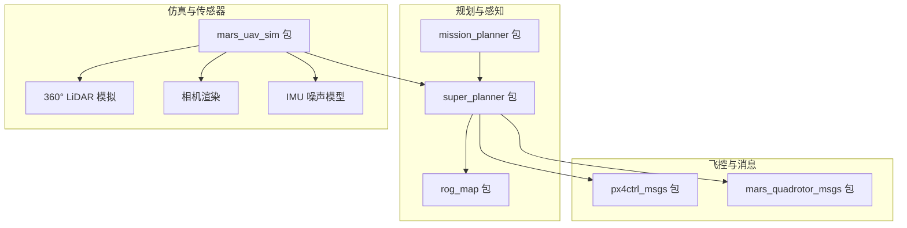
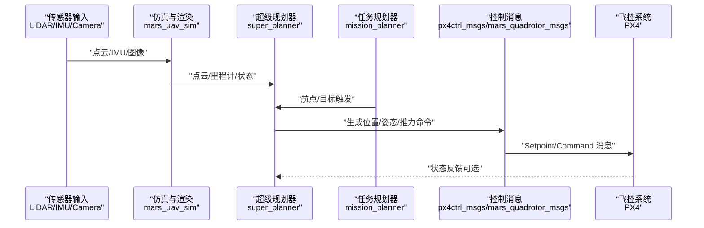
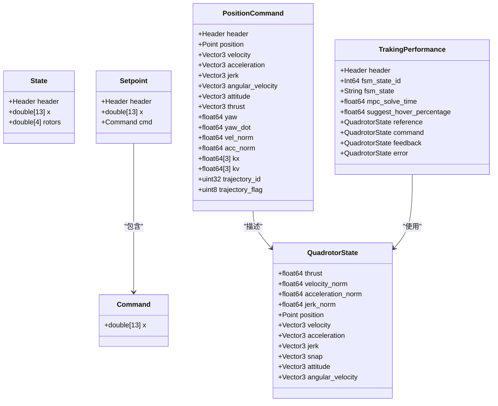
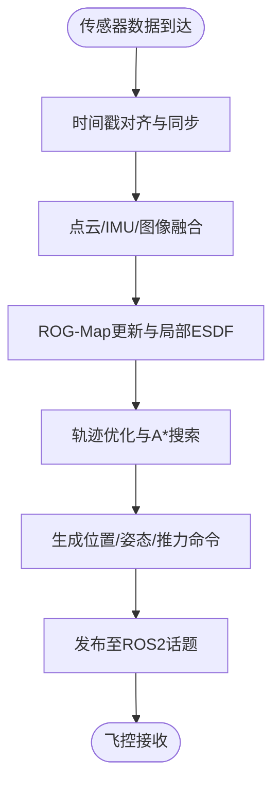
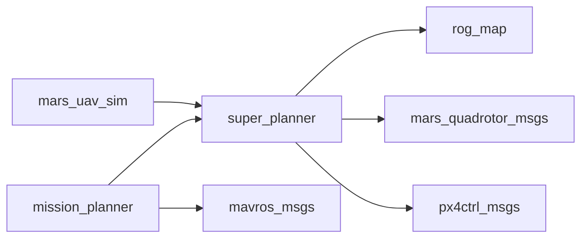

# 第三方系统集成

<cite>
**本文引用的文件**
- [README.md](file://README.md)
- [src/SUPER/README.md](file://src/SUPER/README.md)
- [src/SUPER/mars_uav_sim/mars_quadrotor_msgs/package.xml](file://src/SUPER/mars_uav_sim/mars_quadrotor_msgs/package.xml)
- [src/SUPER/mars_uav_sim/mars_quadrotor_msgs/ros2_msg/QuadrotorState.msg](file://src/SUPER/mars_uav_sim/mars_quadrotor_msgs/ros2_msg/QuadrotorState.msg)
- [src/SUPER/mars_uav_sim/mars_quadrotor_msgs/ros2_msg/PositionCommand.msg](file://src/SUPER/mars_uav_sim/mars_quadrotor_msgs/ros2_msg/PositionCommand.msg)
- [src/SUPER/mars_uav_sim/mars_quadrotor_msgs/ros2_msg/TrakingPerformance.msg](file://src/SUPER/mars_uav_sim/mars_quadrotor_msgs/ros2_msg/TrakingPerformance.msg)
- [src/SUPER/mars_uav_sim/px4ctrl_msgs/package.xml](file://src/SUPER/mars_uav_sim/px4ctrl_msgs/package.xml)
- [src/SUPER/mars_uav_sim/px4ctrl_msgs/msg/State.msg](file://src/SUPER/mars_uav_sim/px4ctrl_msgs/msg/State.msg)
- [src/SUPER/mars_uav_sim/px4ctrl_msgs/msg/Setpoint.msg](file://src/SUPER/mars_uav_sim/px4ctrl_msgs/msg/Setpoint.msg)
- [src/SUPER/mars_uav_sim/px4ctrl_msgs/srv/GetReference.srv](file://src/SUPER/mars_uav_sim/px4ctrl_msgs/srv/GetReference.srv)
- [src/SUPER/super_planner/package.xml](file://src/SUPER/super_planner/package.xml)
- [src/SUPER/super_planner/config/click.yaml](file://src/SUPER/super_planner/config/click.yaml)
- [src/SUPER/mission_planner/package.xml](file://src/SUPER/mission_planner/package.xml)
- [src/SUPER/mission_planner/config/waypoint.yaml](file://src/SUPER/mission_planner/config/waypoint.yaml)
- [src/SUPER/mars_uav_sim/perfect_drone_sim/config/dense.yaml](file://src/SUPER/mars_uav_sim/perfect_drone_sim/config/dense.yaml)
</cite>

## 目录
1. [简介](#简介)
2. [项目结构](#项目结构)
3. [核心组件](#核心组件)
4. [架构总览](#架构总览)
5. [详细组件分析](#详细组件分析)
6. [依赖关系分析](#依赖关系分析)
7. [性能考虑](#性能考虑)
8. [故障排查指南](#故障排查指南)
9. [结论](#结论)
10. [附录](#附录)

## 简介
本文件面向第三方系统集成，围绕PX4飞控系统与SUPER项目的ROS2模块进行对接，涵盖消息协议、控制接口、通信机制、传感器接口（LiDAR、IMU、相机）的数据融合与同步、与外部系统的通信协议（Mavlink、ROS2消息、自定义协议）、以及与Gazebo仿真、Mission Planner等地面站的集成方法。同时提供接口规范、数据格式转换、常见问题与解决方案、集成测试与验证方法，以及从仿真到实飞的系统切换流程。

## 项目结构
该仓库采用按功能域划分的包结构，核心模块包括：
- 超级规划器（super_planner）：负责轨迹规划、A*搜索、ROG-Map地图、可视化与参数配置
- 任务规划器（mission_planner）：负责航点下发、目标触发、与地面站交互
- 无人机仿真与传感器模拟（mars_uav_sim）：包含LiDAR/相机渲染、点云生成、IMU噪声模型等
- 控制消息与飞控接口（px4ctrl_msgs、mars_quadrotor_msgs）：定义飞控控制消息与状态反馈

图表来源
- [src/SUPER/super_planner/package.xml](file://src/SUPER/super_planner/package.xml#L1-L21)
- [src/SUPER/mission_planner/package.xml](file://src/SUPER/mission_planner/package.xml#L1-L19)
- [src/SUPER/mars_uav_sim/mars_quadrotor_msgs/package.xml](file://src/SUPER/mars_uav_sim/mars_quadrotor_msgs/package.xml#L1-L26)
- [src/SUPER/mars_uav_sim/px4ctrl_msgs/package.xml](file://src/SUPER/mars_uav_sim/px4ctrl_msgs/package.xml#L1-L22)

章节来源
- [README.md](file://README.md#L1-L168)
- [src/SUPER/README.md](file://src/SUPER/README.md#L1-L278)

## 核心组件
- 超级规划器（super_planner）
  - 功能：实时轨迹规划、A*路径搜索、ROG-Map多层地图、可视化、动态重配置
  - 关键配置：click.yaml（规划器参数、轨迹优化边界、地图与可视化开关等）
- 任务规划器（mission_planner）
  - 功能：航点下发、目标触发、与地面站交互（支持RViz、Mavros等）
  - 关键配置：waypoint.yaml（目标话题、里程计话题、触发方式、航点切换阈值等）
- 仿真与传感器（mars_uav_sim）
  - 功能：LiDAR/相机渲染、点云生成、IMU噪声模型；支持360°LiDAR配置
  - 关键配置：dense.yaml（LiDAR类型、视野、采样率、遮挡等）
- 控制消息（px4ctrl_msgs、mars_quadrotor_msgs）
  - 功能：定义飞控状态、设定点、位置/姿态命令等消息与服务

章节来源
- [src/SUPER/super_planner/package.xml](file://src/SUPER/super_planner/package.xml#L1-L21)
- [src/SUPER/mission_planner/package.xml](file://src/SUPER/mission_planner/package.xml#L1-L19)
- [src/SUPER/mars_uav_sim/mars_quadrotor_msgs/package.xml](file://src/SUPER/mars_uav_sim/mars_quadrotor_msgs/package.xml#L1-L26)
- [src/SUPER/mars_uav_sim/px4ctrl_msgs/package.xml](file://src/SUPER/mars_uav_sim/px4ctrl_msgs/package.xml#L1-L22)
- [src/SUPER/super_planner/config/click.yaml](file://src/SUPER/super_planner/config/click.yaml#L1-L190)
- [src/SUPER/mission_planner/config/waypoint.yaml](file://src/SUPER/mission_planner/config/waypoint.yaml#L1-L19)
- [src/SUPER/mars_uav_sim/perfect_drone_sim/config/dense.yaml](file://src/SUPER/mars_uav_sim/perfect_drone_sim/config/dense.yaml#L1-L30)

## 架构总览
下图展示了从传感器输入到飞控命令输出的端到端数据流，以及与地面站的交互路径。

图表来源
- [src/SUPER/super_planner/package.xml](file://src/SUPER/super_planner/package.xml#L1-L21)
- [src/SUPER/mission_planner/package.xml](file://src/SUPER/mission_planner/package.xml#L1-L19)
- [src/SUPER/mars_uav_sim/px4ctrl_msgs/msg/Setpoint.msg](file://src/SUPER/mars_uav_sim/px4ctrl_msgs/msg/Setpoint.msg#L1-L14)
- [src/SUPER/mars_uav_sim/px4ctrl_msgs/msg/State.msg](file://src/SUPER/mars_uav_sim/px4ctrl_msgs/msg/State.msg#L1-L12)

## 详细组件分析

### 1) 消息协议与控制接口
- px4ctrl_msgs
  - State：包含位置、速度、姿态四元数、角速度与四个旋翼转速/推力
  - Setpoint：包含13维状态设定点与命令设定点
  - GetReference：服务接口，返回滚动时域参考轨迹点数组
- mars_quadrotor_msgs
  - PositionCommand：位置/速度/加速度/急动度、角速度、姿态、推力、偏航与控制增益等
  - QuadrotorState：推力、速度/加速度/急动度/.snap范数、位置/速度/加速度/角速度/姿态
  - TrakingPerformance：MPC状态、求解耗时、跟踪误差与参考/命令/反馈/误差状态

图表来源
- [src/SUPER/mars_uav_sim/px4ctrl_msgs/msg/State.msg](file://src/SUPER/mars_uav_sim/px4ctrl_msgs/msg/State.msg#L1-L12)
- [src/SUPER/mars_uav_sim/px4ctrl_msgs/msg/Setpoint.msg](file://src/SUPER/mars_uav_sim/px4ctrl_msgs/msg/Setpoint.msg#L1-L14)
- [src/SUPER/mars_uav_sim/px4ctrl_msgs/srv/GetReference.srv](file://src/SUPER/mars_uav_sim/px4ctrl_msgs/srv/GetReference.srv#L1-L9)
- [src/SUPER/mars_uav_sim/mars_quadrotor_msgs/ros2_msg/PositionCommand.msg](file://src/SUPER/mars_uav_sim/mars_quadrotor_msgs/ros2_msg/PositionCommand.msg#L1-L30)
- [src/SUPER/mars_uav_sim/mars_quadrotor_msgs/ros2_msg/QuadrotorState.msg](file://src/SUPER/mars_uav_sim/mars_quadrotor_msgs/ros2_msg/QuadrotorState.msg#L1-L11)
- [src/SUPER/mars_uav_sim/mars_quadrotor_msgs/ros2_msg/TrakingPerformance.msg](file://src/SUPER/mars_uav_sim/mars_quadrotor_msgs/ros2_msg/TrakingPerformance.msg#L1-L16)

章节来源
- [src/SUPER/mars_uav_sim/px4ctrl_msgs/msg/State.msg](file://src/SUPER/mars_uav_sim/px4ctrl_msgs/msg/State.msg#L1-L12)
- [src/SUPER/mars_uav_sim/px4ctrl_msgs/msg/Setpoint.msg](file://src/SUPER/mars_uav_sim/px4ctrl_msgs/msg/Setpoint.msg#L1-L14)
- [src/SUPER/mars_uav_sim/px4ctrl_msgs/srv/GetReference.srv](file://src/SUPER/mars_uav_sim/px4ctrl_msgs/srv/GetReference.srv#L1-L9)
- [src/SUPER/mars_uav_sim/mars_quadrotor_msgs/ros2_msg/PositionCommand.msg](file://src/SUPER/mars_uav_sim/mars_quadrotor_msgs/ros2_msg/PositionCommand.msg#L1-L30)
- [src/SUPER/mars_uav_sim/mars_quadrotor_msgs/ros2_msg/QuadrotorState.msg](file://src/SUPER/mars_uav_sim/mars_quadrotor_msgs/ros2_msg/QuadrotorState.msg#L1-L11)
- [src/SUPER/mars_uav_sim/mars_quadrotor_msgs/ros2_msg/TrakingPerformance.msg](file://src/SUPER/mars_uav_sim/mars_quadrotor_msgs/ros2_msg/TrakingPerformance.msg#L1-L16)

### 2) 通信机制与接口规范
- ROS2话题
  - 规划器输出：如“/planning/pos_cmd”、“/planning_cmd/poly_traj”
  - 任务规划器输入：如“/goal_pose”、“/lidar_slam/odom”
  - 仿真输入：如“/cloud_registered”、“/lidar_slam/odom”
- 服务接口
  - GetReference：请求滚动时域参考轨迹点，响应为Setpoint数组
- 数据格式转换
  - 位置/速度/姿态/角速度：使用geometry_msgs/Point/Vector3/Quaternion
  - 时间戳：使用std_msgs/Header
  - 飞控状态与设定点：使用px4ctrl_msgs/State/Setpoint
  - 位置命令与跟踪性能：使用mars_quadrotor_msgs/PositionCommand/TrakingPerformance

章节来源
- [src/SUPER/super_planner/config/click.yaml](file://src/SUPER/super_planner/config/click.yaml#L1-L190)
- [src/SUPER/mission_planner/config/waypoint.yaml](file://src/SUPER/mission_planner/config/waypoint.yaml#L1-L19)
- [src/SUPER/mars_uav_sim/px4ctrl_msgs/srv/GetReference.srv](file://src/SUPER/mars_uav_sim/px4ctrl_msgs/srv/GetReference.srv#L1-L9)

### 3) 传感器接口与数据融合
- LiDAR
  - 仿真配置：360°LiDAR、极坐标分辨率、垂直视场、遮挡、采样率等
  - 输入话题：/cloud_registered（点云）、/lidar_slam/odom（里程计）
- IMU
  - 通过仿真模块提供IMU噪声模型，作为状态估计输入
- 相机
  - 渲染模块提供相机着色器与配置，支持360°全景相机
- 同步策略
  - 使用Header.stamp进行时间戳同步，确保规划器与仿真模块在相同时间步长下运行
  - 通过固定频率的定时器或回调队列保证数据到达顺序

图表来源
- [src/SUPER/mars_uav_sim/perfect_drone_sim/config/dense.yaml](file://src/SUPER/mars_uav_sim/perfect_drone_sim/config/dense.yaml#L1-L30)
- [src/SUPER/super_planner/config/click.yaml](file://src/SUPER/super_planner/config/click.yaml#L140-L190)

章节来源
- [src/SUPER/mars_uav_sim/perfect_drone_sim/config/dense.yaml](file://src/SUPER/mars_uav_sim/perfect_drone_sim/config/dense.yaml#L1-L30)
- [src/SUPER/super_planner/config/click.yaml](file://src/SUPER/super_planner/config/click.yaml#L120-L190)

### 4) 与外部系统的通信协议
- Mavlink协议
  - 通过Mavros桥接ROS2与Mavlink，实现与地面站（如Mission Planner）的通信
  - 任务规划器依赖mavros_msgs，支持本地里程计与目标发布
- ROS2消息接口
  - 使用标准geometry_msgs、sensor_msgs、nav_msgs与std_msgs
  - 自定义消息：px4ctrl_msgs、mars_quadrotor_msgs
- 自定义协议
  - GetReference服务用于获取滚动时域参考轨迹
  - PositionCommand/TrakingPerformance用于跟踪性能监控与命令下发

章节来源
- [src/SUPER/mission_planner/package.xml](file://src/SUPER/mission_planner/package.xml#L1-L19)
- [src/SUPER/mars_uav_sim/px4ctrl_msgs/package.xml](file://src/SUPER/mars_uav_sim/px4ctrl_msgs/package.xml#L1-L22)
- [src/SUPER/mars_uav_sim/mars_quadrotor_msgs/package.xml](file://src/SUPER/mars_uav_sim/mars_quadrotor_msgs/package.xml#L1-L26)

### 5) 第三方系统集成指南

#### 5.1 Gazebo仿真集成
- 环境准备
  - 使用仿真配置文件（如dense.yaml）设置LiDAR类型与参数
  - 确保点云话题与里程计话题与规划器配置一致
- 运行步骤
  - 启动仿真节点与传感器渲染
  - 启动超级规划器与任务规划器
  - 在RViz中查看可视化结果
- 注意事项
  - 若使用非FAST-LIO2的激光里程计，请确保输入点云在世界坐标系
  - 确认frame_id与/tf信息不被ROG-Map使用

章节来源
- [src/SUPER/README.md](file://src/SUPER/README.md#L246-L246)
- [src/SUPER/mars_uav_sim/perfect_drone_sim/config/dense.yaml](file://src/SUPER/mars_uav_sim/perfect_drone_sim/config/dense.yaml#L1-L30)
- [src/SUPER/super_planner/config/click.yaml](file://src/SUPER/super_planner/config/click.yaml#L146-L153)

#### 5.2 Mission Planner与其他地面站
- 目标发布
  - 使用waypoint.yaml配置目标话题与触发方式
  - 支持RViz插件与Mavros两种触发方式
- 里程计接入
  - 提供odom_topic配置项，支持/local_position/odom或自定义话题
- 参数调整
  - start_trigger_type：0为RViz、1为Mavros、2为恒定时序
  - publish_dt与switch_dis决定目标发布频率与切换阈值

章节来源
- [src/SUPER/mission_planner/config/waypoint.yaml](file://src/SUPER/mission_planner/config/waypoint.yaml#L1-L19)

#### 5.3 从仿真到实飞的系统切换
- 传感器切换
  - 将仿真点云替换为真实LiDAR输出，确保坐标系与时间戳一致
- 飞控桥接
  - 通过Mavros将ROS2消息转换为Mavlink指令
  - 使用px4ctrl_msgs的Setpoint/State消息与飞控通信
- 参数迁移
  - 将仿真参数迁移到实飞参数，注意安全边界与最大加速度/加加速度限制

章节来源
- [src/SUPER/mars_uav_sim/px4ctrl_msgs/msg/Setpoint.msg](file://src/SUPER/mars_uav_sim/px4ctrl_msgs/msg/Setpoint.msg#L1-L14)
- [src/SUPER/mars_uav_sim/px4ctrl_msgs/msg/State.msg](file://src/SUPER/mars_uav_sim/px4ctrl_msgs/msg/State.msg#L1-L12)

## 依赖关系分析
- 包依赖
  - super_planner依赖rog_map、mars_quadrotor_msgs、px4ctrl_msgs
  - mission_planner依赖mavros_msgs、geometry_msgs、sensor_msgs等
- 消息依赖
  - px4ctrl_msgs与mars_quadrotor_msgs为控制与状态消息核心
  - super_planner通过这些消息与飞控交互，并驱动可视化与日志

图表来源
- [src/SUPER/super_planner/package.xml](file://src/SUPER/super_planner/package.xml#L1-L21)
- [src/SUPER/mission_planner/package.xml](file://src/SUPER/mission_planner/package.xml#L1-L19)

章节来源
- [src/SUPER/super_planner/package.xml](file://src/SUPER/super_planner/package.xml#L1-L21)
- [src/SUPER/mission_planner/package.xml](file://src/SUPER/mission_planner/package.xml#L1-L19)

## 性能考虑
- 规划频率与重规划前瞻
  - 通过replan_rate与planning_horizon控制实时性与鲁棒性
- 地图分辨率与更新范围
  - resolution、map_size、local_update_box影响内存与计算负载
- 优化参数
  - max_vel/max_acc/max_jerk等边界约束需根据硬件能力调整
- 可视化与日志
  - visualization_en与detailed_log_en影响CPU/GPU占用

章节来源
- [src/SUPER/super_planner/config/click.yaml](file://src/SUPER/super_planner/config/click.yaml#L1-L190)

## 故障排查指南
- 包未找到或构建错误
  - 确保已正确安装ROS2 Jazzy与依赖库，并正确source工作空间
- 权限错误
  - 检查工作空间目录权限
- 仿真与实飞差异
  - 确保输入点云在世界坐标系，避免frame_id/tf干扰
- 目标未到达或切换异常
  - 检查odom_topic与start_trigger_type配置，确认publish_dt与switch_dis合理

章节来源
- [README.md](file://README.md#L132-L152)
- [src/SUPER/README.md](file://src/SUPER/README.md#L246-L246)
- [src/SUPER/mission_planner/config/waypoint.yaml](file://src/SUPER/mission_planner/config/waypoint.yaml#L1-L19)

## 结论
本集成文档基于SUPER的ROS2模块，提供了与PX4飞控系统对接的完整方案：消息协议、控制接口、通信机制、传感器融合与同步、外部系统对接（Mavlink、ROS2、自定义协议），以及从仿真到实飞的切换流程。通过合理的参数配置与接口规范，可实现稳定可靠的第三方系统集成。

## 附录
- 快速启动
  - 安装ROS2 Jazzy与依赖，构建super_planner与rog_map
  - 启动RViz与规划器，运行click/demo或benchmark场景
- 日志与评估
  - 使用plotCmdLog.py评估轨迹质量，参考日志目录与脚本

章节来源
- [README.md](file://README.md#L75-L114)
- [src/SUPER/README.md](file://src/SUPER/README.md#L217-L238)