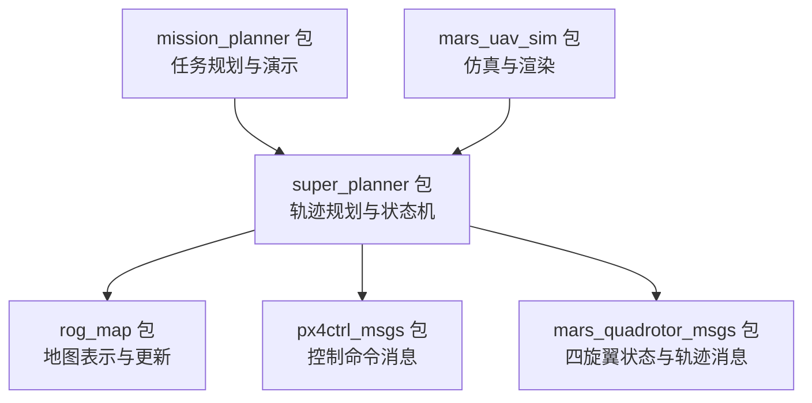
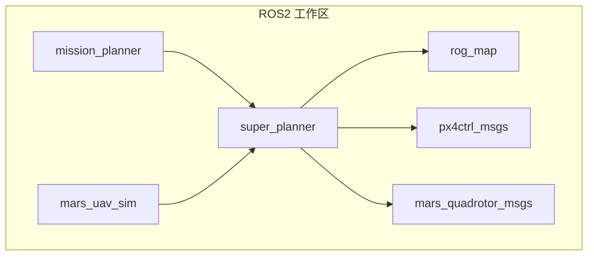
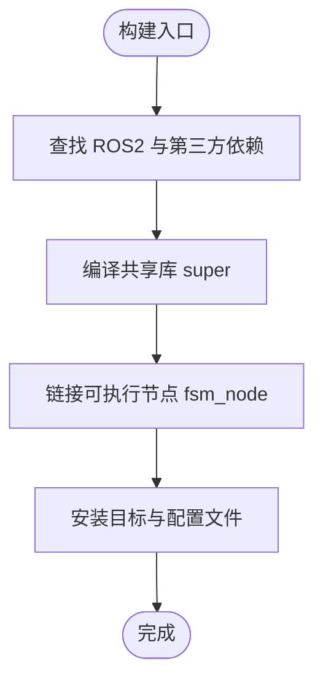
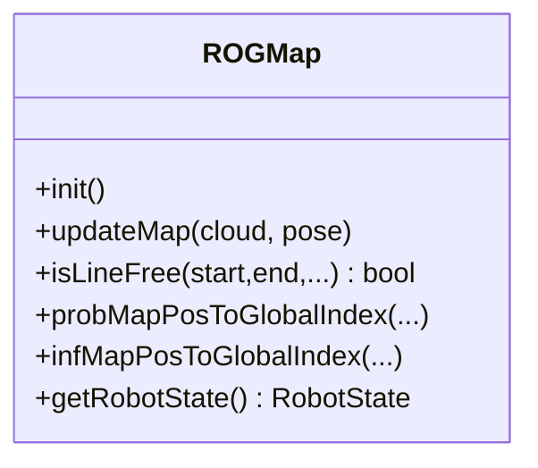
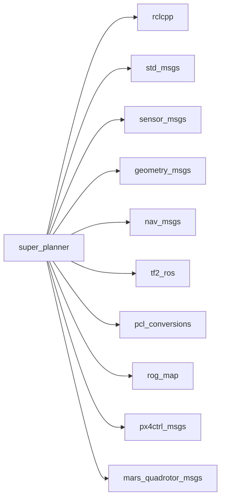

# 维护与升级

<cite>
**本文引用的文件**   
- [README.md](file://README.md)
- [src/SUPER/install_dependencies.sh](file://src/SUPER/install_dependencies.sh)
- [src/SUPER/README.md](file://src/SUPER/README.md)
- [src/SUPER/super_planner/package.xml](file://src/SUPER/super_planner/package.xml)
- [src/SUPER/super_planner/CMakeLists.txt](file://src/SUPER/super_planner/CMakeLists.txt)
- [src/SUPER/super_planner/launch/rviz.launch.py](file://src/SUPER/super_planner/launch/rviz.launch.py)
- [src/SUPER/super_planner/config/static_high_speed.yaml](file://src/SUPER/super_planner/config/static_high_speed.yaml)
- [src/SUPER/rog_map/package.xml](file://src/SUPER/rog_map/package.xml)
- [src/SUPER/rog_map/include/rog_map/rog_map.h](file://src/SUPER/rog_map/include/rog_map/rog_map.h)
- [src/SUPER/mission_planner/package.xml](file://src/SUPER/mission_planner/package.xml)
</cite>

## 目录
1. [引言](#引言)
2. [项目结构](#项目结构)
3. [核心组件](#核心组件)
4. [架构总览](#架构总览)
5. [详细组件分析](#详细组件分析)
6. [依赖关系分析](#依赖关系分析)
7. [性能考虑](#性能考虑)
8. [故障排查指南](#故障排查指南)
9. [结论](#结论)
10. [附录](#附录)

## 引言
本文件面向维护与升级场景，围绕 SUPER（ROS2 Jazzy）项目的日常维护、版本升级、故障诊断、性能优化、日志与数据分析、备份与恢复以及从仿真到实飞的持续改进方法进行系统化说明。内容基于仓库中的安装脚本、构建配置、启动脚本、参数配置与核心模块接口，帮助读者建立可执行的维护与升级流程。

## 项目结构
该工作空间采用多包结构，核心模块包括：
- super_planner：轨迹规划与状态机节点
- rog_map：ROG-Map 地图模块
- mission_planner：任务规划与演示
- mars_uav_sim：仿真与渲染相关包
- px4ctrl_msgs/mars_quadrotor_msgs：消息定义

图表来源
- [src/SUPER/super_planner/package.xml](file://src/SUPER/super_planner/package.xml#L1-L21)
- [src/SUPER/rog_map/package.xml](file://src/SUPER/rog_map/package.xml#L1-L27)
- [src/SUPER/mission_planner/package.xml](file://src/SUPER/mission_planner/package.xml#L1-L19)

章节来源
- [README.md](file://README.md#L1-L168)
- [src/SUPER/README.md](file://src/SUPER/README.md#L1-L278)

## 核心组件
- super_planner：提供轨迹优化、A*搜索、可视化与状态机等能力，通过 CMake 构建并导出库与可执行节点；支持通过 YAML 参数文件动态配置。
- rog_map：提供概率栅格与膨胀、ESDF 等地图功能，支持点云输入与动态更新。
- mission_planner：提供基准测试与点击式演示的启动脚本与RViz配置。
- mars_uav_sim：包含渲染、完美无人机仿真与相机着色器等资源。
- px4ctrl_msgs/mars_quadrotor_msgs：定义控制命令、期望轨迹与四旋翼状态消息类型。

章节来源
- [src/SUPER/super_planner/package.xml](file://src/SUPER/super_planner/package.xml#L1-L21)
- [src/SUPER/rog_map/package.xml](file://src/SUPER/rog_map/package.xml#L1-L27)
- [src/SUPER/mission_planner/package.xml](file://src/SUPER/mission_planner/package.xml#L1-L19)

## 架构总览
下图展示 ROS2 工作空间中各包之间的依赖关系与交互路径，强调 super_planner 对地图与消息包的依赖，以及 mission_planner 的演示入口。

图表来源
- [src/SUPER/super_planner/package.xml](file://src/SUPER/super_planner/package.xml#L8-L15)
- [src/SUPER/rog_map/package.xml](file://src/SUPER/rog_map/package.xml#L12-L18)
- [src/SUPER/mission_planner/package.xml](file://src/SUPER/mission_planner/package.xml#L8-L13)

## 详细组件分析

### super_planner 组件
- 构建与目标
  - 通过 CMake 构建共享库 super 与可执行节点 fsm_node，并导出头文件与配置目录。
  - 链接 PCL、yaml-cpp、libdw 等第三方库，依赖 rclcpp、std_msgs、sensor_msgs、geometry_msgs、nav_msgs、tf2_ros、pcl_conversions、rog_map 等。
- 启动与可视化
  - 提供 RViz 启动脚本，支持传入自定义 RViz 配置路径。
- 参数与配置
  - 支持通过 YAML 文件配置状态机、轨迹优化、A*、ROG-Map 等模块参数。

图表来源
- [src/SUPER/super_planner/CMakeLists.txt](file://src/SUPER/super_planner/CMakeLists.txt#L33-L74)
- [src/SUPER/super_planner/CMakeLists.txt](file://src/SUPER/super_planner/CMakeLists.txt#L101-L138)
- [src/SUPER/super_planner/CMakeLists.txt](file://src/SUPER/super_planner/CMakeLists.txt#L155-L185)

章节来源
- [src/SUPER/super_planner/CMakeLists.txt](file://src/SUPER/super_planner/CMakeLists.txt#L1-L188)
- [src/SUPER/super_planner/launch/rviz.launch.py](file://src/SUPER/super_planner/launch/rviz.launch.py#L1-L30)
- [src/SUPER/super_planner/config/static_high_speed.yaml](file://src/SUPER/super_planner/config/static_high_speed.yaml#L1-L187)

### rog_map 组件
- 功能要点
  - 基于概率栅格的地图表示，支持膨胀、未知区域处理与 ESDF 更新。
  - 提供线段可达性检测、索引转换、机器人状态更新等接口。
- 依赖与导出
  - 作为 ROS2 包，导出 rclcpp、std_msgs、sensor_msgs、geometry_msgs、nav_msgs、tf2_ros、pcl_conversions 等依赖。

图表来源
- [src/SUPER/rog_map/include/rog_map/rog_map.h](file://src/SUPER/rog_map/include/rog_map/rog_map.h#L39-L129)

章节来源
- [src/SUPER/rog_map/include/rog_map/rog_map.h](file://src/SUPER/rog_map/include/rog_map/rog_map.h#L1-L131)
- [src/SUPER/rog_map/package.xml](file://src/SUPER/rog_map/package.xml#L1-L27)

### mission_planner 组件
- 功能要点
  - 提供基准测试与点击式演示的启动脚本，便于快速验证规划效果。
- 依赖
  - 依赖 mavros_msgs 等消息包。

章节来源
- [src/SUPER/mission_planner/package.xml](file://src/SUPER/mission_planner/package.xml#L1-L19)

## 依赖关系分析
- 构建系统
  - 使用 ament_cmake 与 CMake，统一管理依赖查找与安装。
- 运行时依赖
  - super_planner 依赖 rclcpp、std_msgs、sensor_msgs、geometry_msgs、nav_msgs、tf2_ros、pcl_conversions、rog_map、px4ctrl_msgs、mars_quadrotor_msgs。
- 第三方库
  - PCL、yaml-cpp、Eigen、spdlog、OpenCV、nlopt、ceres 等。

图表来源
- [src/SUPER/super_planner/package.xml](file://src/SUPER/super_planner/package.xml#L8-L15)

章节来源
- [src/SUPER/super_planner/package.xml](file://src/SUPER/super_planner/package.xml#L1-L21)

## 性能考虑
- 编译优化
  - CMake 默认启用 C++17、开启 -O3 与告警选项，建议在发布模式下保持优化级别以提升实时性能。
- 参数调优
  - 通过 YAML 文件调整轨迹优化边界、采样分辨率、平滑系数与规划窗口等，以平衡性能与安全性。
- 可视化与日志
  - 可按需关闭可视化与日志输出，减少 CPU/内存占用；在调试阶段再开启。
- 硬件建议
  - 使用高性能 CPU/GPU 与大容量内存，确保 PCL 与优化求解器高效运行。

章节来源
- [src/SUPER/super_planner/CMakeLists.txt](file://src/SUPER/super_planner/CMakeLists.txt#L4-L10)
- [src/SUPER/super_planner/config/static_high_speed.yaml](file://src/SUPER/super_planner/config/static_high_speed.yaml#L37-L187)

## 故障排查指南
- 常见问题
  - 包未找到：确认已正确 source 工作区安装环境。
  - 构建失败：检查依赖是否完整安装，确保使用正确的 ROS2 发行版。
  - 权限错误：确保工作区目录权限正确。
- 构建特定包
  - 可选择仅构建 super_planner 或添加 Debug 符号以便调试。
- 日志与回溯
  - 项目内置回溯与日志工具，可用于定位崩溃与异常路径。

章节来源
- [README.md](file://README.md#L132-L152)
- [src/SUPER/README.md](file://src/SUPER/README.md#L217-L239)

## 结论
通过规范化的安装与依赖管理、清晰的构建与参数配置、完善的日志与回溯机制，以及可扩展的地图与规划模块，本项目具备良好的可维护性与可升级性。建议在每次升级前做好备份与回归测试，确保从仿真到实飞的连续改进。

## 附录

### 日常维护方法
- 硬件检查
  - 定期检查 CPU/GPU/内存占用与磁盘空间，确保满足 PCL 与优化求解器需求。
- 软件更新
  - 升级系统与 ROS2 版本后，优先验证依赖安装脚本与构建配置。
- 性能监控
  - 关注轨迹优化耗时、A* 搜索时间与可视化帧率，结合参数调优与硬件升级改善性能。

章节来源
- [src/SUPER/install_dependencies.sh](file://src/SUPER/install_dependencies.sh#L1-L71)
- [src/SUPER/super_planner/CMakeLists.txt](file://src/SUPER/super_planner/CMakeLists.txt#L4-L10)

### 版本升级流程与注意事项
- ROS 版本升级
  - 升级至新发行版后，使用官方安装指南安装对应 ROS2 包，并重新执行 rosdep 安装与构建。
- 依赖库更新
  - 使用自动安装脚本统一安装系统与 Python 依赖；如需手动安装，请对照脚本中的包列表。
- 代码更新
  - 更新源码后，清理构建缓存并重新构建；对关键模块（super_planner、rog_map）进行回归测试。

章节来源
- [README.md](file://README.md#L17-L95)
- [src/SUPER/install_dependencies.sh](file://src/SUPER/install_dependencies.sh#L1-L71)

### 系统故障诊断与修复
- 启动与可视化
  - 使用 RViz 启动脚本验证可视化路径与配置文件路径参数。
- 日志分析
  - 利用内置日志系统记录命令与重规划日志，结合 Python 脚本进行轨迹质量评估。
- 回溯与崩溃处理
  - 项目集成回溯库，可在崩溃时输出堆栈信息，辅助定位问题。

章节来源
- [src/SUPER/super_planner/launch/rviz.launch.py](file://src/SUPER/super_planner/launch/rviz.launch.py#L1-L30)
- [src/SUPER/README.md](file://src/SUPER/README.md#L217-L239)

### 性能优化建议
- 参数调优
  - 调整轨迹优化边界、积分分辨率与平滑系数；根据场景调整规划窗口与感知范围。
- 算法优化
  - 在保证安全的前提下，适当降低可视化频率与日志输出；优化地图更新策略。
- 硬件升级
  - 升级 CPU/GPU 与内存，确保点云处理与优化求解器高效运行。

章节来源
- [src/SUPER/super_planner/config/static_high_speed.yaml](file://src/SUPER/super_planner/config/static_high_speed.yaml#L37-L187)

### 日志管理与数据分析
- 运行日志
  - 记录命令日志与重规划日志，用于离线分析轨迹质量与规划稳定性。
- 错误日志
  - 结合回溯库输出的堆栈信息，定位异常与崩溃原因。
- 性能日志
  - 通过参数开关控制日志输出，避免影响实时性；在离线阶段进行深度分析。

章节来源
- [src/SUPER/README.md](file://src/SUPER/README.md#L217-L239)

### 备份与恢复策略
- 代码备份
  - 使用版本控制系统管理源码变更，定期推送与打标签。
- 构建产物备份
  - 备份 install 目录与构建缓存，便于快速恢复。
- 配置备份
  - 将 YAML 参数文件纳入版本控制或单独备份，确保可追溯。

章节来源
- [README.md](file://README.md#L1-L168)

### 维护计划与检查清单
- 每日
  - 检查系统资源占用与日志完整性
- 每周
  - 执行一次依赖一致性检查与最小化构建验证
- 每月
  - 全量构建与关键模块回归测试
- 每季度
  - 参数回顾与性能评估，制定优化方案

### 从仿真到实飞的持续改进
- 仿真验证
  - 使用 mission_planner 的基准测试与点击演示验证算法有效性
- 实飞迭代
  - 基于实飞数据反馈优化参数与算法，逐步提升鲁棒性与安全性

章节来源
- [src/SUPER/README.md](file://src/SUPER/README.md#L178-L200)