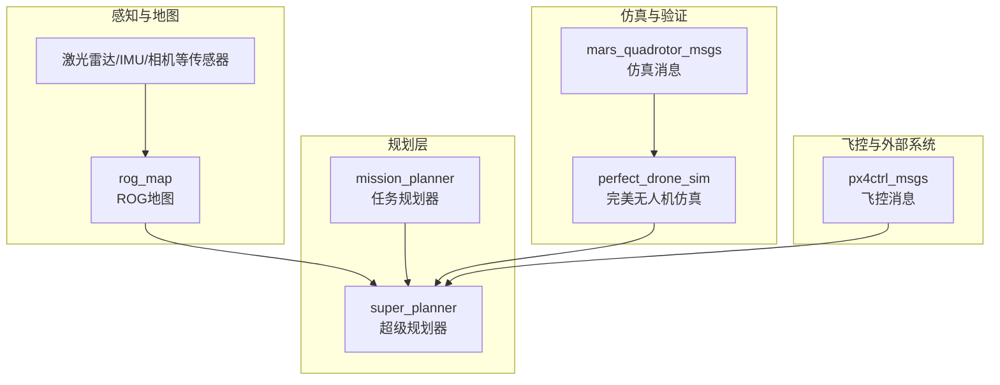
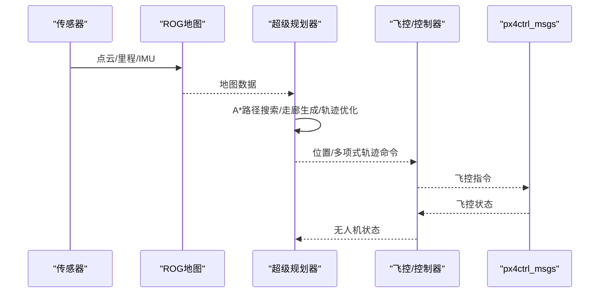
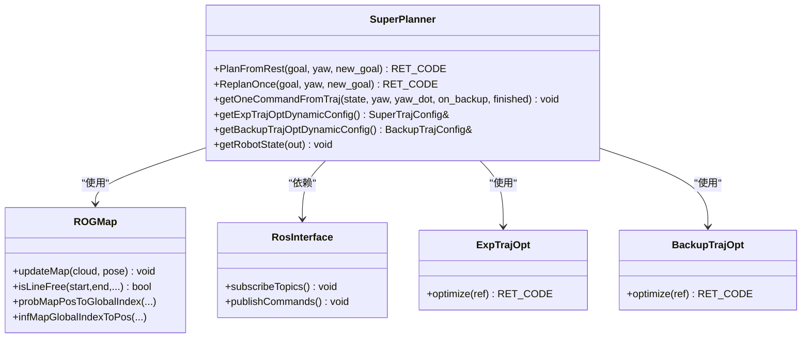
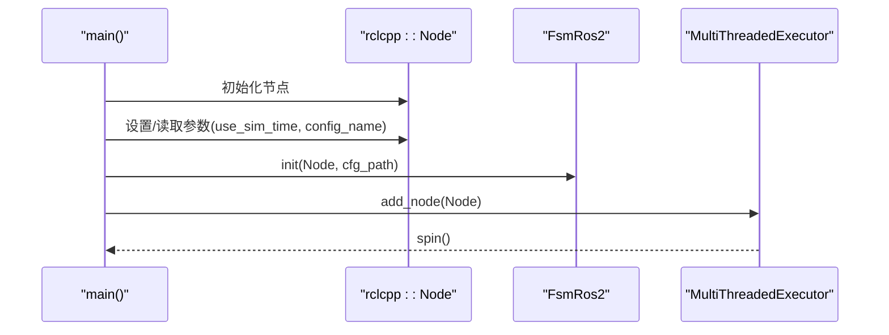
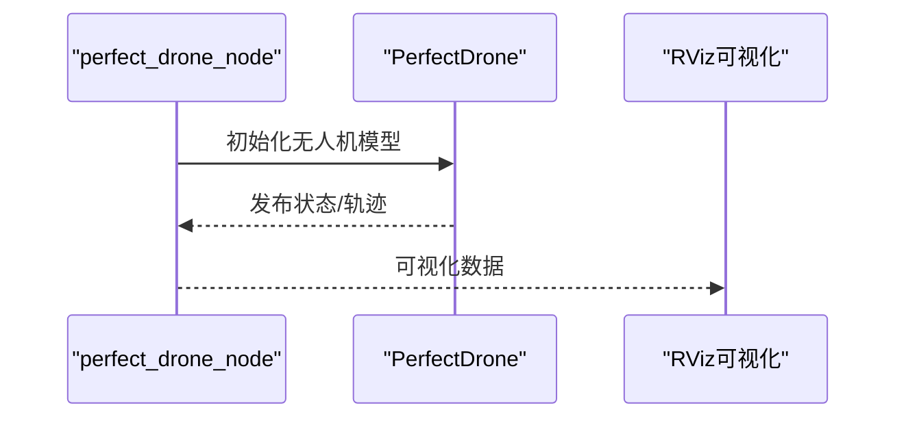
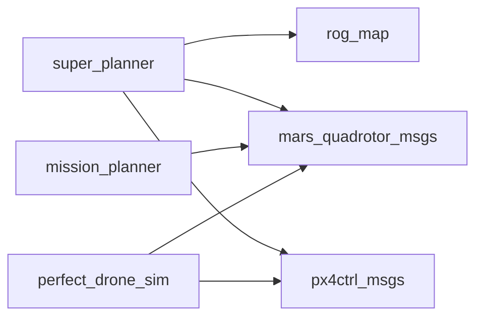

# 部署与集成

<cite>
**本文引用的文件**
- [super_planner 包 package.xml](file://src/SUPER/super_planner/package.xml)
- [super_planner 包 CMakeLists.txt](file://src/SUPER/super_planner/CMakeLists.txt)
- [super_planner 配置文件 click.yaml](file://src/SUPER/super_planner/config/click.yaml)
- [super_planner 配置文件 static_dense.yaml](file://src/SUPER/super_planner/config/static_dense.yaml)
- [super_planner 启动文件 real_drone.launch.py](file://src/SUPER/super_planner/launch/real_drone.launch.py)
- [super_planner 启动文件 rviz.launch.py](file://src/SUPER/super_planner/launch/rviz.launch.py)
- [mission_planner 启动文件 click_demo.launch.py](file://src/SUPER/mission_planner/launch/click_demo.launch.py)
- [mission_planner 启动文件 benchmark_dense.launch.py](file://src/SUPER/mission_planner/launch/benchmark_dense.launch.py)
- [fsm_node_ros2.cpp](file://src/SUPER/super_planner/Apps/fsm_node_ros2.cpp)
- [rog_map 核心头文件 rog_map.h](file://src/SUPER/rog_map/include/rog_map/rog_map.h)
- [super_planner 核心头文件 super_planner.h](file://src/SUPER/super_planner/include/super_core/super_planner.h)
- [perfect_drone_sim 包 package.xml](file://src/SUPER/mars_uav_sim/perfect_drone_sim/package.xml)
- [perfect_drone_sim 源码 ros2_perfect_drone_node.cpp](file://src/SUPER/mars_uav_sim/perfect_drone_sim/src/ros2_perfect_drone_node.cpp)
- [mars_quadrotor_msgs 包 package.xml](file://src/SUPER/mars_uav_sim/mars_quadrotor_msgs/package.xml)
</cite>

## 目录
1. [简介](#简介)
2. [项目结构](#项目结构)
3. [核心组件](#核心组件)
4. [架构总览](#架构总览)
5. [详细组件分析](#详细组件分析)
6. [依赖关系分析](#依赖关系分析)
7. [性能考量](#性能考量)
8. [故障排查指南](#故障排查指南)
9. [结论](#结论)
10. [附录](#附录)

## 简介
本文件面向部署与集成工程师，系统化阐述该ROS2无人机规划系统的硬件与软件集成要求、第三方系统对接方案、部署准备流程、多场景实施方案、架构设计与接口规范、常见问题与解决方案，以及从仿真到实飞的安全过渡策略。内容基于仓库中的包结构、配置文件、启动脚本与核心源码进行归纳总结，确保非专业读者也能理解并落地实施。

## 项目结构
该工作空间围绕“SUPER”系统构建，主要模块包括：
- 超级规划器（super_planner）：核心轨迹规划与状态机控制节点
- 地图模块（rog_map）：基于概率/计数的地图构建与更新
- 任务规划器（mission_planner）：航点任务与演示场景
- 仿真无人机（perfect_drone_sim）：无噪声无人机动力学仿真
- 仿真消息（mars_quadrotor_msgs）：自定义四旋翼消息类型
- PX4 控制消息（px4ctrl_msgs）：与飞控交互的消息契约

图表来源
- [super_planner 包 package.xml](file://src/SUPER/super_planner/package.xml#L1-L21)
- [rog_map 包 package.xml](file://src/SUPER/rog_map/package.xml#L1-L27)
- [mission_planner 包 package.xml](file://src/SUPER/mission_planner/package.xml#L1-L19)
- [perfect_drone_sim 包 package.xml](file://src/SUPER/mars_uav_sim/perfect_drone_sim/package.xml#L1-L20)
- [mars_quadrotor_msgs 包 package.xml](file://src/SUPER/mars_uav_sim/mars_quadrotor_msgs/package.xml#L1-L26)

章节来源
- [super_planner 包 package.xml](file://src/SUPER/super_planner/package.xml#L1-L21)
- [rog_map 包 package.xml](file://src/SUPER/rog_map/package.xml#L1-L27)
- [mission_planner 包 package.xml](file://src/SUPER/mission_planner/package.xml#L1-L19)
- [perfect_drone_sim 包 package.xml](file://src/SUPER/mars_uav_sim/perfect_drone_sim/package.xml#L1-L20)
- [mars_quadrotor_msgs 包 package.xml](file://src/SUPER/mars_uav_sim/mars_quadrotor_msgs/package.xml#L1-L26)

## 核心组件
- 超级规划器（super_planner）
  - 功能：A*路径搜索、走廊生成、轨迹优化（期望/备份）、状态机驱动、可视化输出
  - 关键接口：订阅点云/里程/状态；发布位置/多项式轨迹命令
  - 依赖：rog_map、px4ctrl_msgs、mars_quadrotor_msgs
- 地图模块（rog_map）
  - 功能：概率/计数地图、ESDF、射线投射、滑动窗口更新
  - 关键接口：updateMap、isLineFree、坐标变换
- 任务规划器（mission_planner）
  - 功能：航点任务生成与演示
  - 依赖：mavros_msgs（任务相关）
- 仿真无人机（perfect_drone_sim）
  - 功能：无噪声动力学仿真，提供状态反馈与RViz可视化
  - 依赖：mars_quadrotor_msgs、px4ctrl_msgs
- 仿真消息（mars_quadrotor_msgs）
  - 功能：QuadrotorState、PositionCommand、PolynomialTrajectory等消息
- 飞控消息（px4ctrl_msgs）
  - 功能：Command/Setpoint/State消息，用于与飞控交互

章节来源
- [super_planner 包 package.xml](file://src/SUPER/super_planner/package.xml#L1-L21)
- [rog_map 包 package.xml](file://src/SUPER/rog_map/package.xml#L1-L27)
- [mission_planner 包 package.xml](file://src/SUPER/mission_planner/package.xml#L1-L19)
- [perfect_drone_sim 包 package.xml](file://src/SUPER/mars_uav_sim/perfect_drone_sim/package.xml#L1-L20)
- [mars_quadrotor_msgs 包 package.xml](file://src/SUPER/mars_uav_sim/mars_quadrotor_msgs/package.xml#L1-L26)

## 架构总览
系统采用“感知—建图—规划—控制命令”的流水线架构。仿真与实飞通过统一的消息契约与配置切换实现平滑过渡。

图表来源
- [super_planner 包 package.xml](file://src/SUPER/super_planner/package.xml#L8-L15)
- [rog_map 包 package.xml](file://src/SUPER/rog_map/package.xml#L12-L18)
- [perfect_drone_sim 源码 ros2_perfect_drone_node.cpp](file://src/SUPER/mars_uav_sim/perfect_drone_sim/src/ros2_perfect_drone_node.cpp#L1-L11)

## 详细组件分析

### 组件A：超级规划器（SuperPlanner）
- 职责
  - 路径搜索与走廊生成
  - 期望轨迹与备份轨迹优化
  - 状态机驱动与命令下发
  - 与地图模块、ROS接口、轨迹优化器协作
- 关键类与关系

图表来源
- [super_planner 核心头文件 super_planner.h](file://src/SUPER/super_planner/include/super_core/super_planner.h#L59-L200)
- [rog_map 核心头文件 rog_map.h](file://src/SUPER/rog_map/include/rog_map/rog_map.h#L39-L131)

章节来源
- [super_planner 核心头文件 super_planner.h](file://src/SUPER/super_planner/include/super_core/super_planner.h#L59-L200)
- [rog_map 核心头文件 rog_map.h](file://src/SUPER/rog_map/include/rog_map/rog_map.h#L39-L131)

### 组件B：状态机与启动流程（FSM）
- 启动入口：fsm_node_ros2.cpp
- 参数加载：读取配置文件（如 click.yaml）
- 执行器：多线程执行器（MultiThreadedExecutor）
- 实时性：通过配置参数与定时器控制重规划频率

图表来源
- [fsm_node_ros2.cpp](file://src/SUPER/super_planner/Apps/fsm_node_ros2.cpp#L48-L101)
- [super_planner 启动文件 real_drone.launch.py](file://src/SUPER/super_planner/launch/real_drone.launch.py#L10-L34)

章节来源
- [fsm_node_ros2.cpp](file://src/SUPER/super_planner/Apps/fsm_node_ros2.cpp#L48-L101)
- [super_planner 启动文件 real_drone.launch.py](file://src/SUPER/super_planner/launch/real_drone.launch.py#L10-L34)

### 组件C：仿真与演示（perfect_drone_sim）
- 功能：提供无噪声无人机模型，支持RViz可视化
- 启动：perfect_drone_node.cpp
- 依赖：mars_quadrotor_msgs、px4ctrl_msgs

图表来源
- [perfect_drone_sim 源码 ros2_perfect_drone_node.cpp](file://src/SUPER/mars_uav_sim/perfect_drone_sim/src/ros2_perfect_drone_node.cpp#L1-L11)
- [mission_planner 启动文件 click_demo.launch.py](file://src/SUPER/mission_planner/launch/click_demo.launch.py#L75-L84)

章节来源
- [perfect_drone_sim 源码 ros2_perfect_drone_node.cpp](file://src/SUPER/mars_uav_sim/perfect_drone_sim/src/ros2_perfect_drone_node.cpp#L1-L11)
- [mission_planner 启动文件 click_demo.launch.py](file://src/SUPER/mission_planner/launch/click_demo.launch.py#L75-L84)

### 组件D：配置与参数（YAML）
- 关键配置项
  - FSM：点击目标、重规划频率、命令话题、MPC命令话题
  - 规划器：走廊边界、前瞻/感知范围、机器人半径、偏航模式
  - 轨迹优化：边界约束、期望/备份轨迹权重、积分分辨率、平滑参数
  - A*：启发式类型、地图体素、对角线移动
  - ROG地图：分辨率、膨胀、虚拟地/天花板、滑动窗口、ESDF、ROS回调话题
- 配置文件
  - click.yaml：轻量/快速场景
  - static_dense.yaml：高密度静态场景

章节来源
- [super_planner 配置文件 click.yaml](file://src/SUPER/super_planner/config/click.yaml#L1-L190)
- [super_planner 配置文件 static_dense.yaml](file://src/SUPER/super_planner/config/static_dense.yaml#L1-L186)

### 组件E：启动与可视化（Launch/RViz）
- real_drone.launch.py：加载fsm_node，支持传入配置名
- rviz.launch.py：加载RViz配置文件
- mission_planner.launch.*：组合仿真/任务/规划器节点

章节来源
- [super_planner 启动文件 real_drone.launch.py](file://src/SUPER/super_planner/launch/real_drone.launch.py#L10-L34)
- [super_planner 启动文件 rviz.launch.py](file://src/SUPER/super_planner/launch/rviz.launch.py#L8-L30)
- [mission_planner 启动文件 click_demo.launch.py](file://src/SUPER/mission_planner/launch/click_demo.launch.py#L13-L98)
- [mission_planner 启动文件 benchmark_dense.launch.py](file://src/SUPER/mission_planner/launch/benchmark_dense.launch.py#L13-L101)

## 依赖关系分析
- 包依赖
  - super_planner 依赖：rclcpp、sensor_msgs、geometry_msgs、nav_msgs、std_msgs、rog_map、mars_quadrotor_msgs、px4ctrl_msgs
  - rog_map 依赖：rclcpp、sensor_msgs、geometry_msgs、nav_msgs、std_msgs、tf2_ros、pcl_conversions
  - mission_planner 依赖：rclcpp、sensor_msgs、geometry_msgs、nav_msgs、std_msgs、mavros_msgs
  - perfect_drone_sim 依赖：rclcpp、sensor_msgs、geometry_msgs、nav_msgs、std_msgs、mars_quadrotor_msgs、marsim_render、px4ctrl_msgs
- 编译链接
  - CMakeLists中显式查找并链接PCL、yaml-cpp、rog_map核心库
  - 导出头文件目录与安装规则

图表来源
- [super_planner 包 CMakeLists.txt](file://src/SUPER/super_planner/CMakeLists.txt#L33-L74)
- [super_planner 包 package.xml](file://src/SUPER/super_planner/package.xml#L8-L15)
- [rog_map 包 package.xml](file://src/SUPER/rog_map/package.xml#L12-L18)
- [mission_planner 包 package.xml](file://src/SUPER/mission_planner/package.xml#L8-L13)
- [perfect_drone_sim 包 package.xml](file://src/SUPER/mars_uav_sim/perfect_drone_sim/package.xml#L8-L15)

章节来源
- [super_planner 包 CMakeLists.txt](file://src/SUPER/super_planner/CMakeLists.txt#L33-L74)
- [super_planner 包 package.xml](file://src/SUPER/super_planner/package.xml#L8-L15)
- [rog_map 包 package.xml](file://src/SUPER/rog_map/package.xml#L12-L18)
- [mission_planner 包 package.xml](file://src/SUPER/mission_planner/package.xml#L8-L13)
- [perfect_drone_sim 包 package.xml](file://src/SUPER/mars_uav_sim/perfect_drone_sim/package.xml#L8-L15)

## 性能考量
- 规划频率与实时性
  - 通过配置中的重规划频率与定时器开关控制
  - 建议在仿真中先调高频率验证，再在实飞中根据飞控刷新率折中
- 地图分辨率与更新范围
  - ROG地图分辨率与ESDF局部更新盒影响计算负载
  - 在复杂环境中适当提高分辨率，同时限制局部更新范围
- 轨迹优化精度与积分分辨率
  - 精度越高、积分分辨率越大，计算开销越大
  - 高速场景建议降低优化精度或积分分辨率
- 线程模型
  - 使用多线程执行器提升并发能力，注意ROS2参数服务器访问的线程安全

## 故障排查指南
- 启动后无轨迹发布
  - 检查配置文件中的命令话题与MPC命令话题是否正确
  - 确认地图话题与里程计话题已连通
- 地图不更新
  - 检查ROG地图ROS回调开关与话题名称
  - 确认点云/里程计消息类型与帧ID一致
- 仿真与实飞切换异常
  - 确认use_sim_time参数在启动前被正确设置为false
  - 检查launch文件中配置名参数传递
- 性能瓶颈
  - 降低地图分辨率或关闭ESDF
  - 降低轨迹优化积分分辨率或精度
  - 减少可视化发布频率

章节来源
- [super_planner 配置文件 click.yaml](file://src/SUPER/super_planner/config/click.yaml#L148-L162)
- [super_planner 配置文件 static_dense.yaml](file://src/SUPER/super_planner/config/static_dense.yaml#L133-L153)
- [fsm_node_ros2.cpp](file://src/SUPER/super_planner/Apps/fsm_node_ros2.cpp#L58-L79)
- [super_planner 启动文件 real_drone.launch.py](file://src/SUPER/super_planner/launch/real_drone.launch.py#L13-L31)

## 结论
该系统通过清晰的模块划分与统一的消息契约，实现了从仿真到实飞的可扩展部署路径。通过合理的配置与启动策略，可在室内、室外与复杂环境中稳定运行。建议在部署前完成充分的仿真验证与参数校准，并建立完善的监控与可视化体系，确保安全可控的过渡与运维。

## 附录

### 硬件集成要求与方法
- 飞控系统集成
  - 使用px4ctrl_msgs消息与飞控进行命令/状态交互
  - 在真实飞控上运行时，确保use_sim_time为false，避免仿真时钟干扰
- 传感器配置
  - 点云/IMU/里程计：确保TF树正确、消息频率满足规划需求
  - 话题命名需与配置文件一致（如/cloud_registered、/lidar_slam/odom）
- 硬件接口规范
  - ROS2话题：位置命令、多项式轨迹、状态反馈
  - 参数服务：动态参数调整（通过规划器提供的动态配置接口）

章节来源
- [super_planner 包 package.xml](file://src/SUPER/super_planner/package.xml#L8-L15)
- [super_planner 配置文件 click.yaml](file://src/SUPER/super_planner/config/click.yaml#L148-L162)
- [super_planner 配置文件 static_dense.yaml](file://src/SUPER/super_planner/config/static_dense.yaml#L133-L153)
- [fsm_node_ros2.cpp](file://src/SUPER/super_planner/Apps/fsm_node_ros2.cpp#L58-L79)

### 第三方系统集成方案
- PX4飞控
  - 通过px4ctrl_msgs消息与飞控交互，遵循消息契约
- 多种传感器接口
  - 支持激光雷达、IMU、相机等多源融合
  - 地图模块提供射线投射与概率更新，适配多传感器输入
- 外部系统通信协议
  - 基于ROS2中间件，使用标准话题/服务/参数机制

章节来源
- [perfect_drone_sim 包 package.xml](file://src/SUPER/mars_uav_sim/perfect_drone_sim/package.xml#L13-L15)
- [mars_quadrotor_msgs 包 package.xml](file://src/SUPER/mars_uav_sim/mars_quadrotor_msgs/package.xml#L13-L16)

### 实际部署准备
- 参数校准
  - 无人机质量、阻力系数、重力常数等物理参数
  - 地图分辨率、膨胀步数、虚拟地/天花板高度
- 系统测试
  - 仿真环境下的轨迹跟踪与避障测试
  - 不同场景（室内/室外/复杂）的基准测试
- 安全检查
  - 限幅参数（速度/加速度/加加速度/角速度/推力）
  - 备份轨迹启用与切换逻辑验证

章节来源
- [super_planner 配置文件 click.yaml](file://src/SUPER/super_planner/config/click.yaml#L46-L102)
- [super_planner 配置文件 static_dense.yaml](file://src/SUPER/super_planner/config/static_dense.yaml#L41-L93)

### 不同部署场景实施指南
- 室内场景
  - 高分辨率地图、较小感知范围、严格限幅
- 室外场景
  - 适度分辨率、较大感知范围、考虑光照与遮挡
- 复杂环境
  - 提高A*启发式精度、启用ESDF、增加地图滑动窗口

章节来源
- [super_planner 配置文件 click.yaml](file://src/SUPER/super_planner/config/click.yaml#L105-L149)
- [super_planner 配置文件 static_dense.yaml](file://src/SUPER/super_planner/config/static_dense.yaml#L96-L139)

### 架构设计与接口规范
- 模块间接口
  - 地图模块：updateMap、isLineFree、坐标转换
  - 规划器：轨迹优化器动态配置、命令生成
  - 启动层：参数注入、执行器管理
- 接口一致性
  - 统一消息类型（位置命令、多项式轨迹、状态）
  - 统一话题命名与TF框架

章节来源
- [rog_map 核心头文件 rog_map.h](file://src/SUPER/rog_map/include/rog_map/rog_map.h#L59-L110)
- [super_planner 核心头文件 super_planner.h](file://src/SUPER/super_planner/include/super_core/super_planner.h#L104-L200)
- [fsm_node_ros2.cpp](file://src/SUPER/super_planner/Apps/fsm_node_ros2.cpp#L82-L90)

### 部署过程常见问题与解决
- 无轨迹发布：检查命令话题与配置文件
- 地图不更新：检查回调开关与话题名称
- 仿真/实飞切换：确认use_sim_time参数与launch参数传递
- 性能不足：降低分辨率/精度或减少可视化

章节来源
- [super_planner 配置文件 click.yaml](file://src/SUPER/super_planner/config/click.yaml#L148-L162)
- [super_planner 配置文件 static_dense.yaml](file://src/SUPER/super_planner/config/static_dense.yaml#L133-L153)
- [fsm_node_ros2.cpp](file://src/SUPER/super_planner/Apps/fsm_node_ros2.cpp#L58-L79)

### 部署后维护与升级策略
- 参数版本化管理：按场景维护不同YAML配置
- 模块独立升级：优先在仿真中验证新版本
- 日志与可视化：保留关键指标日志，便于回溯与分析
- 回归测试：每次升级后执行基准场景回归测试

### 从仿真到实飞的安全过渡方法
- 仿真验证
  - 在仿真中完成轨迹跟踪、避障与参数收敛
- 逐步过渡
  - 先在低空/低速场景验证，再逐步提升至实战条件
- 实飞前检查
  - 限幅参数、备份轨迹、传感器标定、飞控固件版本
- 实飞监控
  - 实时监控轨迹误差、地图更新与系统资源占用

章节来源
- [mission_planner 启动文件 click_demo.launch.py](file://src/SUPER/mission_planner/launch/click_demo.launch.py#L75-L98)
- [mission_planner 启动文件 benchmark_dense.launch.py](file://src/SUPER/mission_planner/launch/benchmark_dense.launch.py#L67-L99)