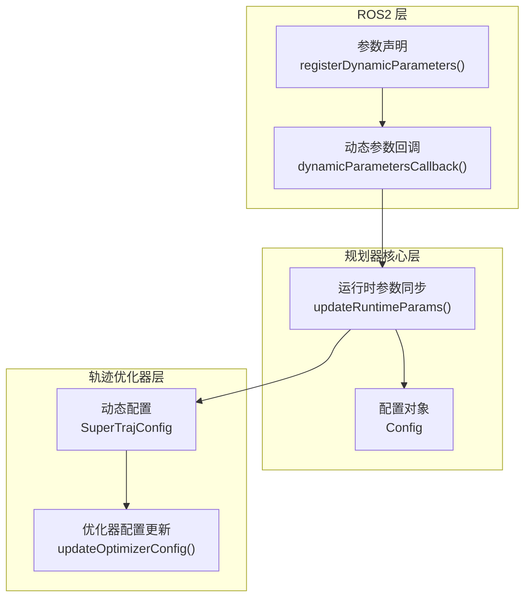
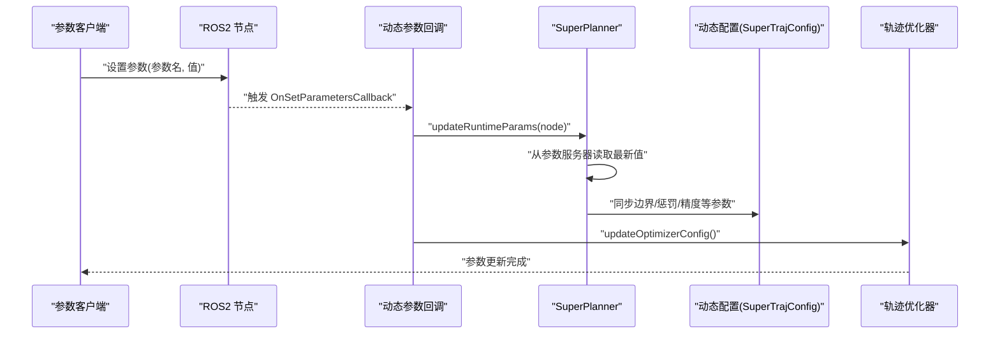
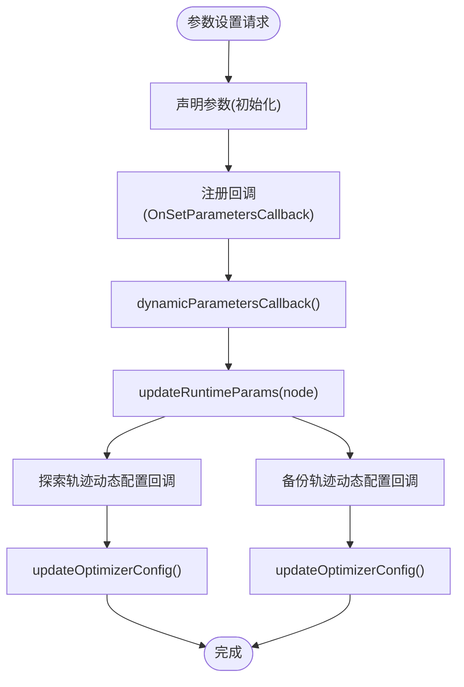
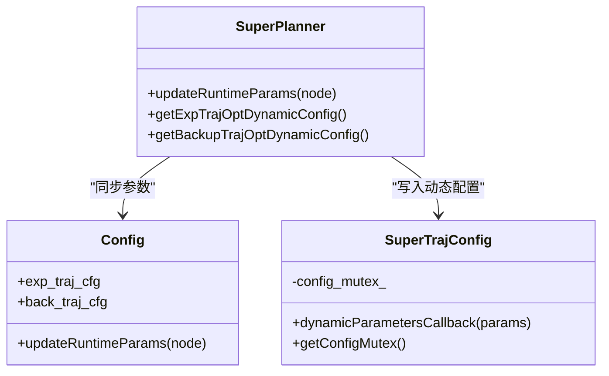
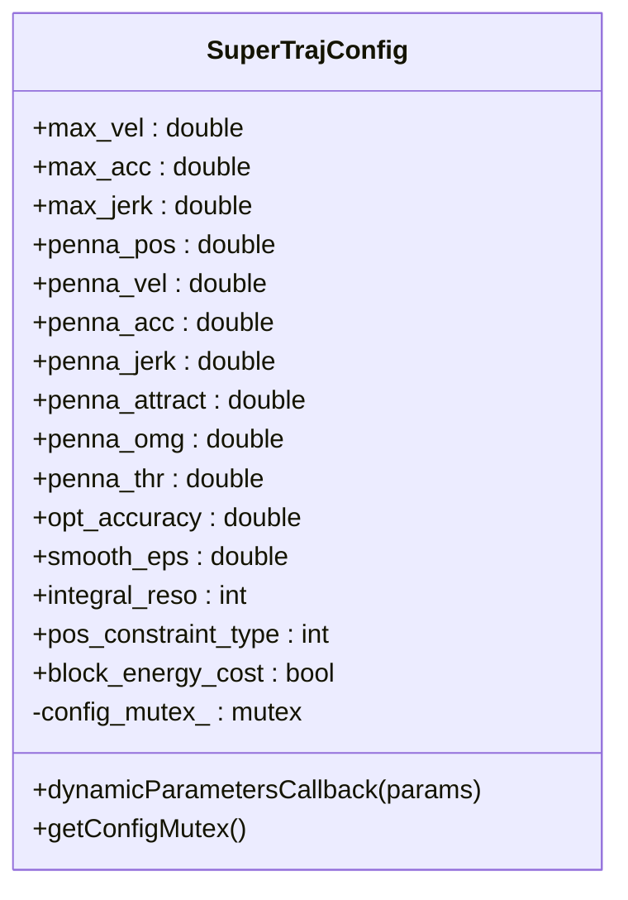
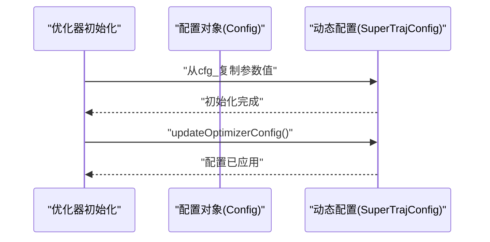
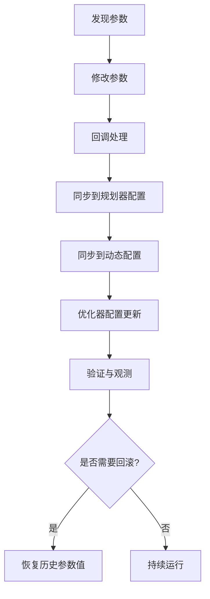
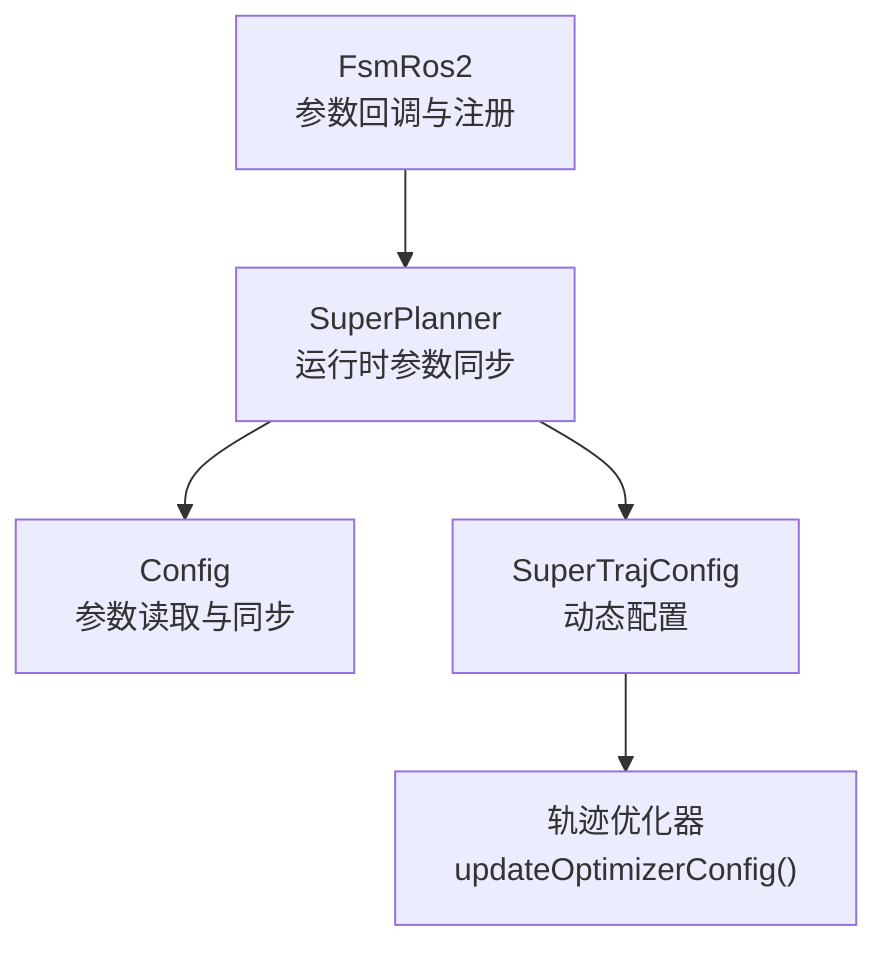

# 动态参数调优系统

<cite>
**本文档引用的文件**
- [super_traj_config.h](file://src/SUPER/super_planner/include/traj_opt/super_traj_config.h)
- [config.hpp](file://src/SUPER/super_planner/include/super_core/config.hpp)
- [super_planner.h](file://src/SUPER/super_planner/include/super_core/super_planner.h)
- [fsm_ros2.hpp](file://src/SUPER/super_planner/include/ros_interface/ros2/fsm_ros2.hpp)
- [exp_traj_optimizer_s4.cpp](file://src/SUPER/super_planner/src/traj_opt/exp_traj_optimizer_s4.cpp)
- [CONFIGURATION_GUIDE.md](file://src/SUPER/super_planner/docs/CONFIGURATION_GUIDE.md)
- [API_REFERENCE.md](file://src/SUPER/super_planner/docs/API_REFERENCE.md)
- [test_dynamic_params.cpp](file://src/SUPER/super_planner/test/test_dynamic_params.cpp)
</cite>

## 目录
1. [简介](#简介)
2. [项目结构](#项目结构)
3. [核心组件](#核心组件)
4. [架构概览](#架构概览)
5. [详细组件分析](#详细组件分析)
6. [依赖关系分析](#依赖关系分析)
7. [性能考虑](#性能考虑)
8. [故障排查指南](#故障排查指南)
9. [结论](#结论)
10. [附录](#附录)

## 简介
本文件为 SUPER 规划器的动态参数调优系统技术文档，围绕运行时参数更新机制、参数回调函数设计与注册、参数同步传播、验证与约束检查、调优流程、最佳实践与安全策略、存储与持久化、调试与监控以及冲突检测与解决策略进行全面阐述。系统基于 ROS2 参数服务器，通过统一的动态参数回调链路，将参数变更实时同步至规划器核心模块与轨迹优化器，并在应用层提供线程安全保障与可观测性。

## 项目结构
动态参数调优系统主要分布在以下模块：
- 参数声明与回调注册：位于 ROS2 接口层，负责参数声明、回调注册与参数变更的统一入口
- 参数同步与应用：位于规划器核心层，负责从参数服务器读取参数并同步到内部配置
- 动态参数配置：位于轨迹优化器层，负责接收参数变更并更新优化器内部配置
- 验证与约束：通过参数命名空间与类型校验，结合运行时互斥锁保障一致性
- 测试与文档：提供参数调优示例与测试脚本，辅助验证与调试

**图表来源**
- [fsm_ros2.hpp](file://src/SUPER/super_planner/include/ros_interface/ros2/fsm_ros2.hpp#L489-L535)
- [fsm_ros2.hpp](file://src/SUPER/super_planner/include/ros_interface/ros2/fsm_ros2.hpp#L447-L483)
- [super_planner.h](file://src/SUPER/super_planner/include/super_core/super_planner.h#L241-L295)
- [config.hpp](file://src/SUPER/super_planner/include/super_core/config.hpp#L158-L228)
- [super_traj_config.h](file://src/SUPER/super_planner/include/traj_opt/super_traj_config.h#L72-L167)

**章节来源**
- [fsm_ros2.hpp](file://src/SUPER/super_planner/include/ros_interface/ros2/fsm_ros2.hpp#L489-L535)
- [super_planner.h](file://src/SUPER/super_planner/include/super_core/super_planner.h#L241-L295)
- [config.hpp](file://src/SUPER/super_planner/include/super_core/config.hpp#L158-L228)
- [super_traj_config.h](file://src/SUPER/super_planner/include/traj_opt/super_traj_config.h#L72-L167)

## 核心组件
- 动态参数回调与注册：在 ROS2 节点中声明参数并注册 OnSetParametersCallback，统一接收参数变更事件
- 运行时参数同步：规划器核心从参数服务器读取最新参数值，同步到内部配置对象
- 动态配置对象：轨迹优化器维护独立的动态配置对象，支持线程安全的参数读取与更新
- 优化器配置应用：在参数回调中触发优化器内部配置更新，确保参数变更立即生效
- 测试与验证：提供参数设置与获取的测试脚本，验证动态参数功能

**章节来源**
- [fsm_ros2.hpp](file://src/SUPER/super_planner/include/ros_interface/ros2/fsm_ros2.hpp#L447-L483)
- [super_planner.h](file://src/SUPER/super_planner/include/super_core/super_planner.h#L241-L295)
- [super_traj_config.h](file://src/SUPER/super_planner/include/traj_opt/super_traj_config.h#L72-L167)
- [test_dynamic_params.cpp](file://src/SUPER/super_planner/test/test_dynamic_params.cpp#L1-L118)

## 架构概览
动态参数调优系统采用“参数声明—回调—同步—应用”的链路，确保参数变更在运行时被可靠传播到所有相关模块。

**图表来源**
- [fsm_ros2.hpp](file://src/SUPER/super_planner/include/ros_interface/ros2/fsm_ros2.hpp#L447-L483)
- [super_planner.h](file://src/SUPER/super_planner/include/super_core/super_planner.h#L241-L295)
- [super_traj_config.h](file://src/SUPER/super_planner/include/traj_opt/super_traj_config.h#L72-L167)

## 详细组件分析

### 动态参数回调与注册
- 参数声明：在初始化阶段声明所有可动态调整的参数，确保 rqt_reconfigure 等工具可见
- 回调注册：通过 add_on_set_parameters_callback 注册回调，统一处理参数变更
- 回调逻辑：在回调中同步运行时参数，分别调用探索轨迹与备份轨迹的动态配置回调，并触发优化器配置更新

**图表来源**
- [fsm_ros2.hpp](file://src/SUPER/super_planner/include/ros_interface/ros2/fsm_ros2.hpp#L489-L535)
- [fsm_ros2.hpp](file://src/SUPER/super_planner/include/ros_interface/ros2/fsm_ros2.hpp#L447-L483)

**章节来源**
- [fsm_ros2.hpp](file://src/SUPER/super_planner/include/ros_interface/ros2/fsm_ros2.hpp#L489-L535)
- [fsm_ros2.hpp](file://src/SUPER/super_planner/include/ros_interface/ros2/fsm_ros2.hpp#L447-L483)

### 运行时参数同步机制
- 参数读取：通过 get_parameter_or 从参数服务器读取最新值，避免默认值覆盖
- 同步范围：涵盖规划器布尔与数值参数、边界约束、惩罚权重、优化精度、积分分辨率等
- 同步到优化器：将同步后的配置值写入动态配置对象，供优化器使用

**图表来源**
- [super_planner.h](file://src/SUPER/super_planner/include/super_core/super_planner.h#L241-L295)
- [config.hpp](file://src/SUPER/super_planner/include/super_core/config.hpp#L158-L228)
- [super_traj_config.h](file://src/SUPER/super_planner/include/traj_opt/super_traj_config.h#L72-L167)

**章节来源**
- [super_planner.h](file://src/SUPER/super_planner/include/super_core/super_planner.h#L241-L295)
- [config.hpp](file://src/SUPER/super_planner/include/super_core/config.hpp#L158-L228)

### 动态配置对象与线程安全
- 动态配置对象：封装边界约束、惩罚权重、优化精度、积分分辨率等参数
- 参数回调：按参数类型与名称匹配，更新对应字段，并输出日志
- 线程安全：提供 getConfigMutex，在优化过程中加锁，防止参数并发修改

**图表来源**
- [super_traj_config.h](file://src/SUPER/super_planner/include/traj_opt/super_traj_config.h#L37-L177)

**章节来源**
- [super_traj_config.h](file://src/SUPER/super_planner/include/traj_opt/super_traj_config.h#L37-L177)

### 参数初始化与优化器配置应用
- 初始化同步：在优化器初始化时，将配置对象中的参数值复制到动态配置对象
- 实时应用：在参数回调中，调用 updateOptimizerConfig 使优化器立即采用最新参数

**图表来源**
- [exp_traj_optimizer_s4.cpp](file://src/SUPER/super_planner/src/traj_opt/exp_traj_optimizer_s4.cpp#L782-L806)

**章节来源**
- [exp_traj_optimizer_s4.cpp](file://src/SUPER/super_planner/src/traj_opt/exp_traj_optimizer_s4.cpp#L782-L806)

### 参数验证与约束检查
- 参数类型与命名空间：通过参数类型（double/int/bool）与命名空间（traj_opt.*）进行匹配，避免非法参数进入
- 参数范围约束：在参数服务器层面，建议配合 rqt_reconfigure 的最小/最大值设置，减少非法输入
- 运行时互斥：在优化过程中通过互斥锁保护动态配置，防止参数在优化期间被修改

**章节来源**
- [super_traj_config.h](file://src/SUPER/super_planner/include/traj_opt/super_traj_config.h#L72-L167)
- [fsm_ros2.hpp](file://src/SUPER/super_planner/include/ros_interface/ros2/fsm_ros2.hpp#L447-L483)

### 参数调优流程
- 参数发现：通过 ros2 param list 或 rqt_reconfigure 查看可调参数
- 参数修改：使用 ros2 param set 或 rqt_reconfigure 实时调整参数
- 参数验证：回调中按类型与名称匹配更新，日志输出变更结果
- 参数应用：updateRuntimeParams 同步到规划器配置，动态配置回调同步到优化器，updateOptimizerConfig 应用到优化器
- 回滚策略：可通过参数服务器恢复历史值，或在测试脚本中批量设置回滚

**图表来源**
- [CONFIGURATION_GUIDE.md](file://src/SUPER/super_planner/docs/CONFIGURATION_GUIDE.md#L197-L223)
- [API_REFERENCE.md](file://src/SUPER/super_planner/docs/API_REFERENCE.md#L629-L644)

**章节来源**
- [CONFIGURATION_GUIDE.md](file://src/SUPER/super_planner/docs/CONFIGURATION_GUIDE.md#L197-L223)
- [API_REFERENCE.md](file://src/SUPER/super_planner/docs/API_REFERENCE.md#L629-L644)

### 参数存储与持久化
- 参数导出：使用 ros2 param dump 导出节点参数到 YAML 文件，作为配置备份
- 配置固化：将导出的参数合并到配置文件（如 click.yaml），实现参数持久化
- 版本管理：建议将参数文件纳入版本控制，建立不同场景的参数配置库

**章节来源**
- [CONFIGURATION_GUIDE.md](file://src/SUPER/super_planner/docs/CONFIGURATION_GUIDE.md#L314-L322)

### 调试工具与监控方法
- rqt_reconfigure：图形界面实时调整参数，观察轨迹与性能变化
- 日志输出：参数回调中输出参数更新日志，便于追踪变更
- 性能统计：通过性能统计接口获取前端与后端平均耗时，评估参数对性能的影响
- 测试脚本：使用测试节点定时设置参数并获取参数值，验证动态参数功能

**章节来源**
- [CONFIGURATION_GUIDE.md](file://src/SUPER/super_planner/docs/CONFIGURATION_GUIDE.md#L291-L322)
- [API_REFERENCE.md](file://src/SUPER/super_planner/docs/API_REFERENCE.md#L291-L304)
- [test_dynamic_params.cpp](file://src/SUPER/super_planner/test/test_dynamic_params.cpp#L1-L118)

### 冲突检测与解决策略
- 参数命名冲突：通过严格的命名空间（traj_opt.boundary、traj_opt.exp_traj 等）避免冲突
- 类型冲突：在回调中按参数类型分支处理，防止类型不匹配导致的异常
- 并发冲突：在优化过程中使用互斥锁保护动态配置，避免参数并发修改
- 参数有效性：建议在参数服务器侧设置合理范围，结合日志与性能指标进行验证

**章节来源**
- [super_traj_config.h](file://src/SUPER/super_planner/include/traj_opt/super_traj_config.h#L72-L167)
- [fsm_ros2.hpp](file://src/SUPER/super_planner/include/ros_interface/ros2/fsm_ros2.hpp#L447-L483)

## 依赖关系分析
动态参数调优系统的关键依赖关系如下：

**图表来源**
- [fsm_ros2.hpp](file://src/SUPER/super_planner/include/ros_interface/ros2/fsm_ros2.hpp#L489-L535)
- [super_planner.h](file://src/SUPER/super_planner/include/super_core/super_planner.h#L241-L295)
- [config.hpp](file://src/SUPER/super_planner/include/super_core/config.hpp#L158-L228)
- [super_traj_config.h](file://src/SUPER/super_planner/include/traj_opt/super_traj_config.h#L72-L167)

**章节来源**
- [fsm_ros2.hpp](file://src/SUPER/super_planner/include/ros_interface/ros2/fsm_ros2.hpp#L489-L535)
- [super_planner.h](file://src/SUPER/super_planner/include/super_core/super_planner.h#L241-L295)
- [config.hpp](file://src/SUPER/super_planner/include/super_core/config.hpp#L158-L228)
- [super_traj_config.h](file://src/SUPER/super_planner/include/traj_opt/super_traj_config.h#L72-L167)

## 性能考虑
- 参数读取频率：避免过于频繁地读取参数服务器，可在回调中批量处理
- 线程安全开销：互斥锁保护动态配置，确保安全性的同时注意锁粒度
- 优化器更新成本：updateOptimizerConfig 会触发优化器内部状态更新，建议在参数稳定后再批量应用
- 监控与日志：通过性能统计接口与日志输出，评估参数变更对系统性能的影响

## 故障排查指南
- 参数不生效：检查参数名是否正确、节点是否收到回调、是否需要重启节点
- 参数冲突：检查命名空间与类型是否匹配，避免重复声明
- 性能异常：通过性能统计接口定位瓶颈，结合日志分析参数影响
- 回滚操作：使用参数导出与导入功能，快速恢复历史参数

**章节来源**
- [CONFIGURATION_GUIDE.md](file://src/SUPER/super_planner/docs/CONFIGURATION_GUIDE.md#L374-L384)
- [API_REFERENCE.md](file://src/SUPER/super_planner/docs/API_REFERENCE.md#L291-L304)

## 结论
动态参数调优系统通过 ROS2 参数服务器与统一的回调链路，实现了参数的实时更新、可靠同步与即时应用。系统在保证线程安全的前提下，提供了完善的调试与监控手段，并通过参数存储与持久化机制确保参数变更的可追溯性与可恢复性。遵循最佳实践与安全策略，可显著提升系统在复杂场景下的适应性与鲁棒性。

## 附录
- 参数调优示例与测试脚本路径：[test_dynamic_params.cpp](file://src/SUPER/super_planner/test/test_dynamic_params.cpp#L1-L118)
- 参数配置参考文档：[CONFIGURATION_GUIDE.md](file://src/SUPER/super_planner/docs/CONFIGURATION_GUIDE.md#L1-L411)
- API 参考文档：[API_REFERENCE.md](file://src/SUPER/super_planner/docs/API_REFERENCE.md#L1-L800)