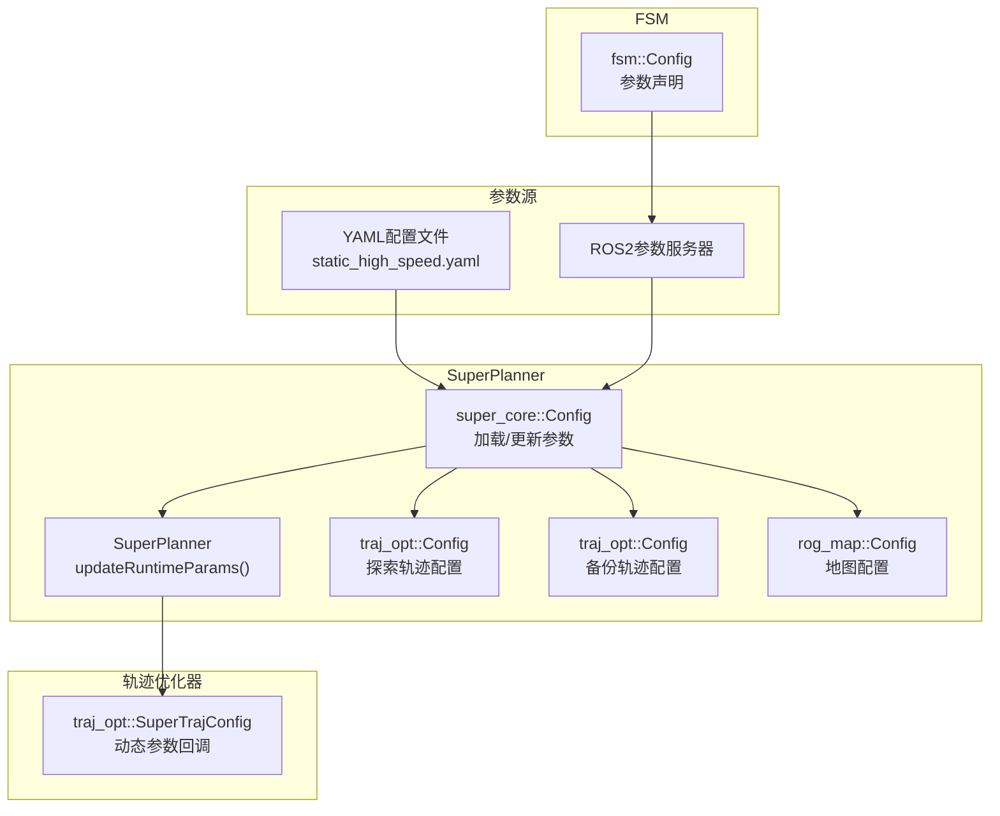
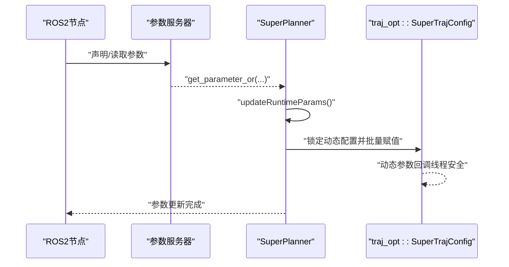
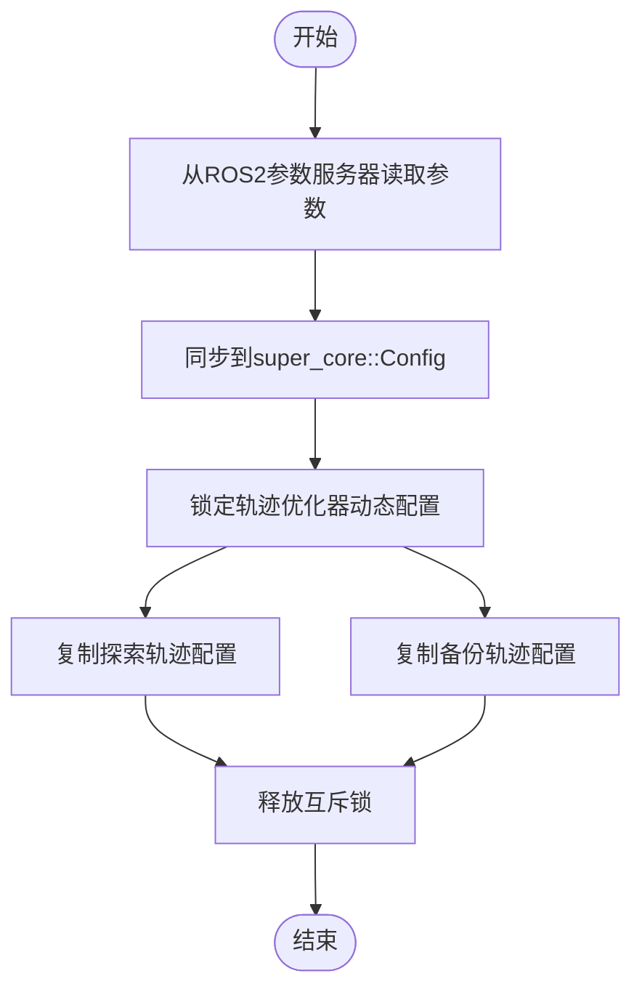
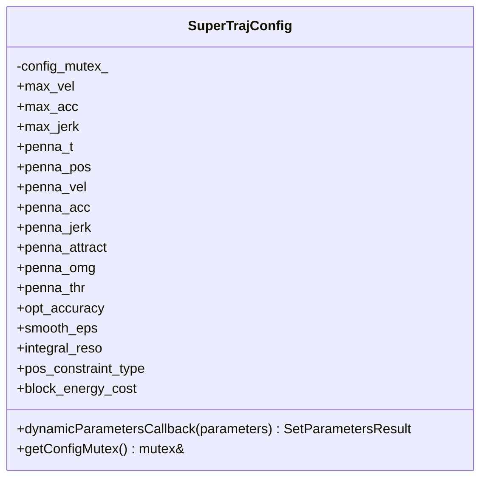
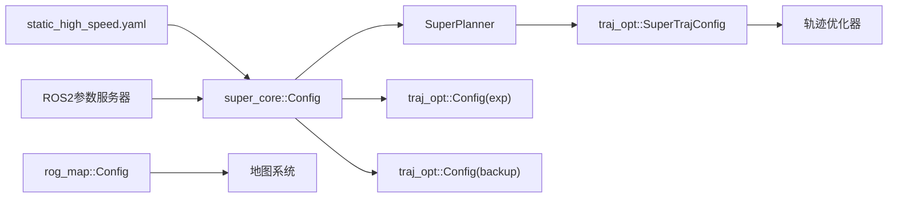

# 参数同步机制

<cite>
**本文档引用的文件**
- [src/SUPER/super_planner/include/super_core/config.hpp](file://src/SUPER/super_planner/include/super_core/config.hpp)
- [src/SUPER/super_planner/include/traj_opt/config.hpp](file://src/SUPER/super_planner/include/traj_opt/config.hpp)
- [src/SUPER/rog_map/include/rog_map/rog_map_core/config.hpp](file://src/SUPER/rog_map/include/rog_map/rog_map_core/config.hpp)
- [src/SUPER/super_planner/include/super_core/super_planner.h](file://src/SUPER/super_planner/include/super_core/super_planner.h)
- [src/SUPER/super_planner/include/traj_opt/super_traj_config.h](file://src/SUPER/super_planner/include/traj_opt/super_traj_config.h)
- [src/SUPER/super_planner/include/fsm/config.hpp](file://src/SUPER/super_planner/include/fsm/config.hpp)
- [src/SUPER/super_planner/src/super_core/super_planner.cpp](file://src/SUPER/super_planner/src/super_core/super_planner.cpp)
- [src/SUPER/super_planner/test/test_dynamic_params.cpp](file://src/SUPER/super_planner/test/test_dynamic_params.cpp)
- [src/SUPER/super_planner/config/static_high_speed.yaml](file://src/SUPER/super_planner/config/static_high_speed.yaml)
- [src/SUPER/super_planner/include/ros_interface/ros_interface.hpp](file://src/SUPER/super_planner/include/ros_interface/ros_interface.hpp)
- [src/SUPER/super_planner/Apps/fsm_node_ros2.cpp](file://src/SUPER/super_planner/Apps/fsm_node_ros2.cpp)
</cite>

## 目录
1. [简介](#简介)
2. [项目结构](#项目结构)
3. [核心组件](#核心组件)
4. [架构总览](#架构总览)
5. [详细组件分析](#详细组件分析)
6. [依赖关系分析](#依赖关系分析)
7. [性能考虑](#性能考虑)
8. [故障排查指南](#故障排查指南)
9. [结论](#结论)

## 简介
本文件系统性阐述SUPER规划器在ROS2环境下的参数同步机制，覆盖SuperPlanner、轨迹优化器、地图系统等模块之间的参数同步策略与传播路径。重点说明：
- 参数来源与命名空间组织（YAML配置与ROS2参数服务器）
- 运行时参数更新流程与原子性保障
- 并发控制与竞态条件防护
- 故障恢复与数据一致性策略
- 性能监控与调试工具
- 实时系统中的挑战与解决方案

## 项目结构
围绕参数同步的核心代码主要分布在以下模块：
- SuperPlanner核心配置与运行时参数更新
- 轨迹优化器配置与动态参数回调
- 地图系统配置
- FSM配置与参数声明
- 参数测试与示例节点

**图表来源**
- [src/SUPER/super_planner/include/super_core/config.hpp](file://src/SUPER/super_planner/include/super_core/config.hpp#L96-L228)
- [src/SUPER/super_planner/include/super_core/super_planner.h](file://src/SUPER/super_planner/include/super_core/super_planner.h#L241-L295)
- [src/SUPER/super_planner/include/traj_opt/super_traj_config.h](file://src/SUPER/super_planner/include/traj_opt/super_traj_config.h#L72-L167)
- [src/SUPER/super_planner/include/fsm/config.hpp](file://src/SUPER/super_planner/include/fsm/config.hpp#L55-L72)
- [src/SUPER/super_planner/config/static_high_speed.yaml](file://src/SUPER/super_planner/config/static_high_speed.yaml#L1-L187)

**章节来源**
- [src/SUPER/super_planner/include/super_core/config.hpp](file://src/SUPER/super_planner/include/super_core/config.hpp#L96-L228)
- [src/SUPER/super_planner/include/super_core/super_planner.h](file://src/SUPER/super_planner/include/super_core/super_planner.h#L241-L295)
- [src/SUPER/super_planner/include/traj_opt/super_traj_config.h](file://src/SUPER/super_planner/include/traj_opt/super_traj_config.h#L72-L167)
- [src/SUPER/super_planner/include/fsm/config.hpp](file://src/SUPER/super_planner/include/fsm/config.hpp#L55-L72)
- [src/SUPER/super_planner/config/static_high_speed.yaml](file://src/SUPER/super_planner/config/static_high_speed.yaml#L1-L187)

## 核心组件
- SuperPlanner::Config：统一加载与更新规划器相关参数，包括布尔开关、数值参数、轨迹优化配置等，并负责在运行时从ROS2参数服务器更新参数。
- traj_opt::Config：管理轨迹优化器的边界约束、惩罚权重、算法配置等参数，支持命名空间加载。
- traj_opt::SuperTrajConfig：提供动态参数回调接口，接收来自参数服务器的参数更新请求，线程安全地更新内部参数。
- rog_map::Config：管理地图系统的分辨率、更新盒、概率更新参数等。
- SuperPlanner::updateRuntimeParams：作为参数同步的中枢，负责将super_core::Config中的参数同步到轨迹优化器的动态配置中。

**章节来源**
- [src/SUPER/super_planner/include/super_core/config.hpp](file://src/SUPER/super_planner/include/super_core/config.hpp#L44-L231)
- [src/SUPER/super_planner/include/traj_opt/config.hpp](file://src/SUPER/super_planner/include/traj_opt/config.hpp#L50-L180)
- [src/SUPER/super_planner/include/traj_opt/super_traj_config.h](file://src/SUPER/super_planner/include/traj_opt/super_traj_config.h#L37-L179)
- [src/SUPER/rog_map/include/rog_map/rog_map_core/config.hpp](file://src/SUPER/rog_map/include/rog_map/rog_map_core/config.hpp#L50-L420)
- [src/SUPER/super_planner/include/super_core/super_planner.h](file://src/SUPER/super_planner/include/super_core/super_planner.h#L241-L295)

## 架构总览
参数同步遵循“集中加载、分散更新”的策略：
- 启动阶段：从YAML配置文件加载静态参数，初始化各模块配置。
- 运行阶段：通过ROS2参数服务器进行参数热更新；SuperPlanner作为协调者，将参数同步到轨迹优化器的动态配置中；轨迹优化器通过动态参数回调确保线程安全更新。

**图表来源**
- [src/SUPER/super_planner/include/super_core/super_planner.h](file://src/SUPER/super_planner/include/super_core/super_planner.h#L241-L295)
- [src/SUPER/super_planner/include/traj_opt/super_traj_config.h](file://src/SUPER/super_planner/include/traj_opt/super_traj_config.h#L72-L167)

## 详细组件分析

### SuperPlanner参数同步流程
SuperPlanner::updateRuntimeParams是参数同步的核心入口，负责：
- 从ROS2参数服务器读取super_planner命名空间下的参数
- 同步到super_core::Config实例
- 将super_core::Config中的轨迹优化器配置同步到traj_opt::ExpTrajOpt与traj_opt::BackupTrajOpt的动态配置
- 使用互斥锁保护动态配置的更新过程，确保原子性与一致性

**图表来源**
- [src/SUPER/super_planner/include/super_core/super_planner.h](file://src/SUPER/super_planner/include/super_core/super_planner.h#L241-L295)

**章节来源**
- [src/SUPER/super_planner/include/super_core/super_planner.h](file://src/SUPER/super_planner/include/super_core/super_planner.h#L241-L295)

### 轨迹优化器动态参数回调
traj_opt::SuperTrajConfig提供动态参数回调函数，按参数名分类更新内部成员，并通过互斥锁保证线程安全。该机制确保：
- 参数更新的原子性：单次回调内对多个参数的更新不会被其他线程打断
- 类型安全：根据参数类型分别处理double、int、bool等
- 可观测性：更新时记录日志，便于调试

**图表来源**
- [src/SUPER/super_planner/include/traj_opt/super_traj_config.h](file://src/SUPER/super_planner/include/traj_opt/super_traj_config.h#L37-L179)

**章节来源**
- [src/SUPER/super_planner/include/traj_opt/super_traj_config.h](file://src/SUPER/super_planner/include/traj_opt/super_traj_config.h#L72-L167)

### 参数命名空间与配置加载
- YAML配置：static_high_speed.yaml提供初始参数，包含super_planner、traj_opt、rog_map等命名空间下的参数。
- ROS2参数：super_core::Config::updateRuntimeParams通过get_parameter_or读取参数；fsm::Config在FSM节点中声明并读取参数。
- 命名空间约定：traj_opt.exp_traj.*、traj_opt.backup_traj.*等命名空间用于区分不同优化器的配置。

**章节来源**
- [src/SUPER/super_planner/config/static_high_speed.yaml](file://src/SUPER/super_planner/config/static_high_speed.yaml#L1-L187)
- [src/SUPER/super_planner/include/super_core/config.hpp](file://src/SUPER/super_planner/include/super_core/config.hpp#L96-L228)
- [src/SUPER/super_planner/include/fsm/config.hpp](file://src/SUPER/super_planner/include/fsm/config.hpp#L55-L72)

### 参数同步中的并发控制与竞态条件处理
- 互斥锁保护：SuperPlanner在同步参数到动态配置时使用std::lock_guard锁定动态配置互斥量，避免优化器在参数更新期间读取到中间状态。
- 线程安全回调：traj_opt::SuperTrajConfig的动态参数回调内部也使用互斥锁，确保参数更新的原子性。
- 重规划锁：SuperPlanner内部有replan_lock_，用于保护重规划过程的原子性，间接避免参数更新与规划过程的竞态。

**章节来源**
- [src/SUPER/super_planner/include/super_core/super_planner.h](file://src/SUPER/super_planner/include/super_core/super_planner.h#L76-L77)
- [src/SUPER/super_planner/include/super_core/super_planner.h](file://src/SUPER/super_planner/include/super_core/super_planner.h#L241-L295)
- [src/SUPER/super_planner/include/traj_opt/super_traj_config.h](file://src/SUPER/super_planner/include/traj_opt/super_traj_config.h#L72-L167)

### 参数同步的故障恢复与数据一致性
- 参数回退：若参数类型不匹配或缺失，YAML加载器使用默认值并记录提示；ROS2参数读取使用get_parameter_or返回当前值，避免崩溃。
- 日志可观测性：动态参数回调在每次更新后记录日志，便于追踪参数变更历史。
- 一致性检查：super_core::Config在构造时计算派生参数（如sample_traj_dt），确保参数间的一致性。

**章节来源**
- [src/SUPER/super_planner/include/utils/header/yaml_loader.hpp](file://src/SUPER/super_planner/include/utils/header/yaml_loader.hpp#L70-L128)
- [src/SUPER/super_planner/include/traj_opt/super_traj_config.h](file://src/SUPER/super_planner/include/traj_opt/super_traj_config.h#L85-L160)
- [src/SUPER/super_planner/include/super_core/config.hpp](file://src/SUPER/super_planner/include/super_core/config.hpp#L131-L133)

### 参数同步的性能监控与调试工具
- 参数测试节点：test_dynamic_params.cpp演示如何通过AsyncParametersClient设置/获取参数，验证动态参数更新功能。
- 可视化接口：ros_interface::RosInterface提供setVisualizationEn/setResolution等接口，便于在运行时调整可视化参数。
- 性能统计：SuperPlanner内部维护模块耗时统计数组，可用于评估参数更新对性能的影响。

**章节来源**
- [src/SUPER/super_planner/test/test_dynamic_params.cpp](file://src/SUPER/super_planner/test/test_dynamic_params.cpp#L10-L107)
- [src/SUPER/super_planner/include/ros_interface/ros_interface.hpp](file://src/SUPER/super_planner/include/ros_interface/ros_interface.hpp#L138-L147)
- [src/SUPER/super_planner/src/super_core/super_planner.cpp](file://src/SUPER/super_planner/src/super_core/super_planner.cpp#L60-L61)

### 实时系统中的挑战与解决方案
- 挑战
  - 参数更新可能发生在规划关键路径上，导致时延抖动
  - 多线程环境下参数读写竞争
  - 参数类型不匹配或命名空间错误导致的异常
- 解决方案
  - 将参数更新集中在低频事件（如定时器或参数服务回调）触发，避免在高频控制环中直接更新
  - 使用互斥锁保护参数更新，确保原子性
  - 在回调中进行类型校验与日志记录，快速定位问题
  - 对于实时性要求高的场景，采用双缓冲或版本号机制，避免阻塞读取

[本节为通用指导，无需具体文件引用]

## 依赖关系分析
参数同步涉及的主要依赖关系如下：

**图表来源**
- [src/SUPER/super_planner/include/super_core/config.hpp](file://src/SUPER/super_planner/include/super_core/config.hpp#L96-L228)
- [src/SUPER/super_planner/include/super_core/super_planner.h](file://src/SUPER/super_planner/include/super_core/super_planner.h#L241-L295)
- [src/SUPER/super_planner/include/traj_opt/super_traj_config.h](file://src/SUPER/super_planner/include/traj_opt/super_traj_config.h#L37-L179)
- [src/SUPER/rog_map/include/rog_map/rog_map_core/config.hpp](file://src/SUPER/rog_map/include/rog_map/rog_map_core/config.hpp#L68-L288)

**章节来源**
- [src/SUPER/super_planner/include/super_core/config.hpp](file://src/SUPER/super_planner/include/super_core/config.hpp#L96-L228)
- [src/SUPER/super_planner/include/super_core/super_planner.h](file://src/SUPER/super_planner/include/super_core/super_planner.h#L241-L295)
- [src/SUPER/super_planner/include/traj_opt/super_traj_config.h](file://src/SUPER/super_planner/include/traj_opt/super_traj_config.h#L37-L179)
- [src/SUPER/rog_map/include/rog_map/rog_map_core/config.hpp](file://src/SUPER/rog_map/include/rog_map/rog_map_core/config.hpp#L68-L288)

## 性能考虑
- 参数更新频率：建议将高成本参数（如积分分辨率、惩罚权重）合并为批处理更新，减少锁竞争与回调次数。
- 锁粒度：优先缩小临界区，只在必要时持有互斥锁；对于只读参数，避免不必要的同步。
- 日志开销：动态参数回调的日志输出在高频更新时可能成为瓶颈，可根据需要降低日志级别。
- 可视化参数：通过RosInterface的setVisualizationEn/setResolution在不影响核心逻辑的前提下动态调整可视化参数。

[本节为通用指导，无需具体文件引用]

## 故障排查指南
- 参数未生效
  - 检查参数命名空间是否正确（如traj_opt.exp_traj.*）
  - 确认参数类型与期望一致（double/int/bool）
  - 使用参数客户端查询当前值，确认参数服务器状态
- 参数更新异常
  - 查看动态参数回调日志，确认回调是否被触发
  - 检查互斥锁是否被长时间占用
- 参数冲突
  - 核对YAML与ROS2参数的优先级与覆盖关系
  - 关注派生参数（如sample_traj_dt）是否与基础参数一致

**章节来源**
- [src/SUPER/super_planner/test/test_dynamic_params.cpp](file://src/SUPER/super_planner/test/test_dynamic_params.cpp#L82-L99)
- [src/SUPER/super_planner/include/traj_opt/super_traj_config.h](file://src/SUPER/super_planner/include/traj_opt/super_traj_config.h#L85-L160)
- [src/SUPER/super_planner/include/super_core/config.hpp](file://src/SUPER/super_planner/include/super_core/config.hpp#L131-L133)

## 结论
SUPER项目的参数同步机制通过“集中加载、分散更新”的方式，结合互斥锁与动态参数回调，实现了跨模块参数的原子性与一致性。配合完善的日志与测试工具，能够在实时系统中稳定运行并满足参数热更新需求。建议在实际部署中进一步优化参数更新频率与锁粒度，以获得更佳的实时性能。