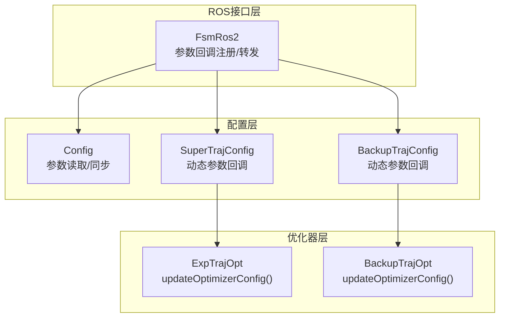
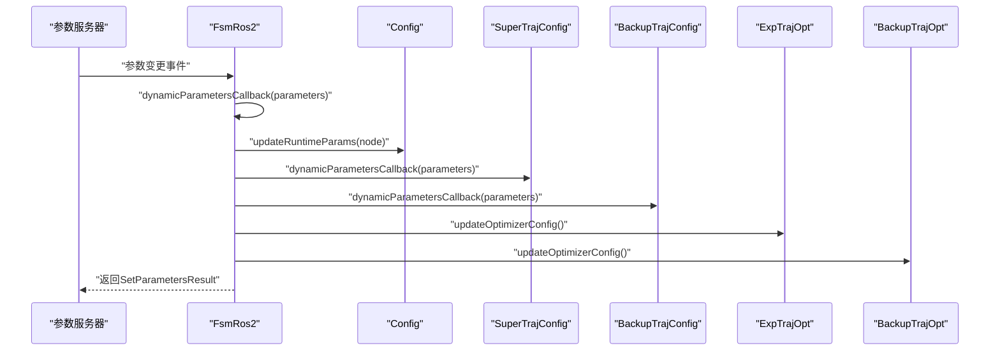
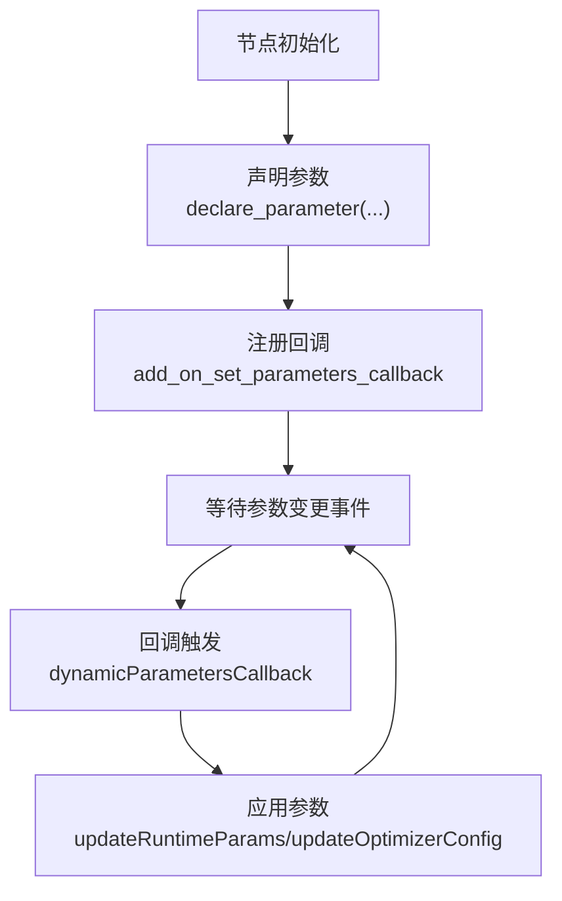
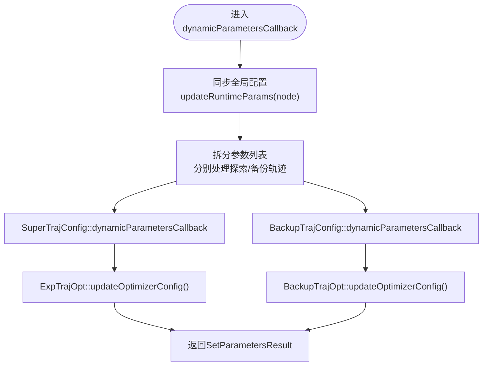
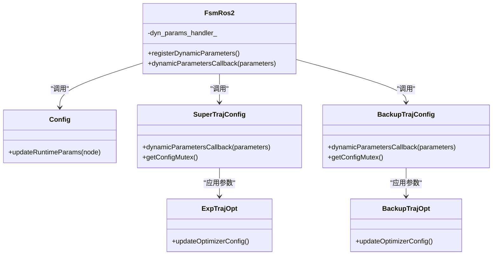

# 参数回调机制

<cite>
**本文档引用的文件**
- [fsm_ros2.hpp](file://src/SUPER/super_planner/include/ros_interface/ros2/fsm_ros2.hpp)
- [super_traj_config.h](file://src/SUPER/super_planner/include/traj_opt/super_traj_config.h)
- [backup_traj_config.h](file://src/SUPER/super_planner/include/traj_opt/backup_traj_config.h)
- [super_planner.h](file://src/SUPER/super_planner/include/super_core/super_planner.h)
- [config.hpp](file://src/SUPER/super_planner/include/super_core/config.hpp)
- [exp_traj_optimizer_s4.cpp](file://src/SUPER/super_planner/src/traj_opt/exp_traj_optimizer_s4.cpp)
- [backup_traj_optimizer_s4.cpp](file://src/SUPER/super_planner/src/traj_opt/backup_traj_optimizer_s4.cpp)
- [test_dynamic_params.cpp](file://src/SUPER/super_planner/test/test_dynamic_params.cpp)
- [CONFIGURATION_GUIDE.md](file://src/SUPER/super_planner/docs/CONFIGURATION_GUIDE.md)
</cite>

## 目录
1. [简介](#简介)
2. [项目结构](#项目结构)
3. [核心组件](#核心组件)
4. [架构总览](#架构总览)
5. [详细组件分析](#详细组件分析)
6. [依赖关系分析](#依赖关系分析)
7. [性能考虑](#性能考虑)
8. [故障排查指南](#故障排查指南)
9. [结论](#结论)
10. [附录](#附录)

## 简介
本文件系统性阐述ROS2动态参数回调机制在SUPER规划器中的实现与应用，重点覆盖以下方面：
- OnSetParametersCallbackHandle的注册流程与生命周期
- dynamicParametersCallback函数的实现逻辑与参数分发
- 参数更新的触发机制与回调函数的执行链路
- 错误处理与异常恢复策略
- 性能优化技巧与最佳实践
- 如何扩展参数回调系统以支持新的参数类型

## 项目结构
动态参数回调相关的核心代码分布在如下模块：
- ROS接口层：负责参数声明、回调注册与转发
- 配置层：负责参数解析与同步
- 优化器层：负责将动态参数应用到优化器配置

图表来源
- [fsm_ros2.hpp](file://src/SUPER/super_planner/include/ros_interface/ros2/fsm_ros2.hpp#L489-L535)
- [config.hpp](file://src/SUPER/super_planner/include/super_core/config.hpp#L158-L228)
- [super_traj_config.h](file://src/SUPER/super_planner/include/traj_opt/super_traj_config.h#L72-L167)
- [backup_traj_config.h](file://src/SUPER/super_planner/include/traj_opt/backup_traj_config.h#L77-L194)

章节来源
- [fsm_ros2.hpp](file://src/SUPER/super_planner/include/ros_interface/ros2/fsm_ros2.hpp#L489-L535)
- [config.hpp](file://src/SUPER/super_planner/include/super_core/config.hpp#L158-L228)

## 核心组件
- FsmRos2：ROS节点侧的动态参数回调入口，负责参数声明、回调注册以及参数变更后的分发与应用。
- SuperTrajConfig：探索轨迹优化器的动态参数配置类，提供动态参数回调函数，将参数更新同步至优化器内部。
- BackupTrajConfig：备份轨迹优化器的动态参数配置类，提供动态参数回调函数，将参数更新同步至优化器内部。
- Config：全局配置类，负责从参数服务器读取参数并同步到各模块。
- 优化器：ExpTrajOpt与BackupTrajOpt，提供updateOptimizerConfig()方法将动态参数应用到优化变量。

章节来源
- [fsm_ros2.hpp](file://src/SUPER/super_planner/include/ros_interface/ros2/fsm_ros2.hpp#L447-L483)
- [super_traj_config.h](file://src/SUPER/super_planner/include/traj_opt/super_traj_config.h#L37-L179)
- [backup_traj_config.h](file://src/SUPER/super_planner/include/traj_opt/backup_traj_config.h#L37-L206)
- [config.hpp](file://src/SUPER/super_planner/include/super_core/config.hpp#L158-L228)

## 架构总览
动态参数回调的完整流程如下：
1. 节点初始化时声明参数并注册回调。
2. 参数服务器触发参数变更事件，回调函数被调用。
3. 回调函数将参数同步到全局配置与各子模块的动态配置。
4. 子模块调用updateOptimizerConfig()将动态参数应用到优化器内部变量。

图表来源
- [fsm_ros2.hpp](file://src/SUPER/super_planner/include/ros_interface/ros2/fsm_ros2.hpp#L447-L483)
- [config.hpp](file://src/SUPER/super_planner/include/super_core/config.hpp#L158-L228)
- [super_traj_config.h](file://src/SUPER/super_planner/include/traj_opt/super_traj_config.h#L72-L167)
- [backup_traj_config.h](file://src/SUPER/super_planner/include/traj_opt/backup_traj_config.h#L77-L194)
- [exp_traj_optimizer_s4.cpp](file://src/SUPER/super_planner/src/traj_opt/exp_traj_optimizer_s4.cpp#L968-L991)
- [backup_traj_optimizer_s4.cpp](file://src/SUPER/super_planner/src/traj_opt/backup_traj_optimizer_s4.cpp#L739-L763)

## 详细组件分析

### OnSetParametersCallbackHandle注册与生命周期
- 注册时机：在节点初始化阶段调用registerDynamicParameters()完成参数声明与回调注册。
- 注册方式：通过add_on_set_parameters_callback绑定lambda，将参数传递给dynamicParametersCallback()。
- 生命周期：回调句柄由节点持有，随节点销毁而释放；参数声明在节点生命周期内持续存在。

图表来源
- [fsm_ros2.hpp](file://src/SUPER/super_planner/include/ros_interface/ros2/fsm_ros2.hpp#L489-L535)

章节来源
- [fsm_ros2.hpp](file://src/SUPER/super_planner/include/ros_interface/ros2/fsm_ros2.hpp#L489-L535)

### dynamicParametersCallback实现逻辑
- 入口：FsmRos2::dynamicParametersCallback接收参数列表，返回SetParametersResult。
- 同步步骤：
  - 调用updateRuntimeParams(node)将参数从参数服务器同步到全局配置。
  - 分别调用探索轨迹与备份轨迹的动态参数回调，将参数同步到各自的动态配置。
  - 立即调用updateOptimizerConfig()将动态参数应用到优化器内部变量。
- 线程安全：动态配置类使用互斥锁保护参数读写，避免并发冲突。

图表来源
- [fsm_ros2.hpp](file://src/SUPER/super_planner/include/ros_interface/ros2/fsm_ros2.hpp#L447-L483)
- [super_traj_config.h](file://src/SUPER/super_planner/include/traj_opt/super_traj_config.h#L72-L167)
- [backup_traj_config.h](file://src/SUPER/super_planner/include/traj_opt/backup_traj_config.h#L77-L194)
- [exp_traj_optimizer_s4.cpp](file://src/SUPER/super_planner/src/traj_opt/exp_traj_optimizer_s4.cpp#L968-L991)
- [backup_traj_optimizer_s4.cpp](file://src/SUPER/super_planner/src/traj_opt/backup_traj_optimizer_s4.cpp#L739-L763)

章节来源
- [fsm_ros2.hpp](file://src/SUPER/super_planner/include/ros_interface/ros2/fsm_ros2.hpp#L447-L483)
- [super_traj_config.h](file://src/SUPER/super_planner/include/traj_opt/super_traj_config.h#L72-L167)
- [backup_traj_config.h](file://src/SUPER/super_planner/include/traj_opt/backup_traj_config.h#L77-L194)

### 参数更新触发机制
- 触发源：参数服务器（rclcpp::ParameterServer）检测到参数变更。
- 触发条件：参数名称匹配且类型一致。
- 触发行为：回调函数按顺序执行，最终返回SetParametersResult。

章节来源
- [fsm_ros2.hpp](file://src/SUPER/super_planner/include/ros_interface/ros2/fsm_ros2.hpp#L531-L534)

### 参数验证与分发
- 类型判断：根据参数类型（double/int/bool）进行分支处理。
- 名称匹配：通过参数名精确匹配，确保仅更新目标参数。
- 日志输出：每次参数更新都会打印日志，便于调试与追踪。
- 分发策略：将参数同步到全局配置与各子模块的动态配置，再统一应用到优化器。

章节来源
- [super_traj_config.h](file://src/SUPER/super_planner/include/traj_opt/super_traj_config.h#L77-L163)
- [backup_traj_config.h](file://src/SUPER/super_planner/include/traj_opt/backup_traj_config.h#L82-L190)

### 生命周期管理
- 注册：节点构造时完成参数声明与回调注册。
- 运行：参数变更时回调自动执行，无需手动干预。
- 销毁：节点析构时回调句柄自动释放，资源回收。

章节来源
- [fsm_ros2.hpp](file://src/SUPER/super_planner/include/ros_interface/ros2/fsm_ros2.hpp#L489-L535)

### 错误处理与异常恢复
- 结果返回：回调函数返回SetParametersResult，successful字段指示是否成功。
- 局部失败：若任一子模块回调失败，整体结果标记为失败。
- 恢复策略：建议在上层捕获失败结果并回滚参数或重试；同时检查参数名与类型是否正确。

章节来源
- [fsm_ros2.hpp](file://src/SUPER/super_planner/include/ros_interface/ros2/fsm_ros2.hpp#L447-L483)

### 扩展新参数类型的步骤
- 在FsmRos2::registerDynamicParameters中声明新参数（含默认值与类型）。
- 在SuperTrajConfig与BackupTrajConfig的dynamicParametersCallback中添加类型分支与名称匹配。
- 在updateOptimizerConfig中将新参数映射到优化器内部变量。
- 在Config::updateRuntimeParams中添加参数读取逻辑（如需同步到全局配置）。

章节来源
- [fsm_ros2.hpp](file://src/SUPER/super_planner/include/ros_interface/ros2/fsm_ros2.hpp#L489-L535)
- [super_traj_config.h](file://src/SUPER/super_planner/include/traj_opt/super_traj_config.h#L72-L167)
- [backup_traj_config.h](file://src/SUPER/super_planner/include/traj_opt/backup_traj_config.h#L77-L194)
- [config.hpp](file://src/SUPER/super_planner/include/super_core/config.hpp#L158-L228)

## 依赖关系分析
- FsmRos2依赖Config、SuperTrajConfig、BackupTrajConfig与两个优化器实例。
- SuperTrajConfig与BackupTrajConfig依赖各自的优化器实例。
- Config依赖参数服务器，负责参数读取与同步。

图表来源
- [fsm_ros2.hpp](file://src/SUPER/super_planner/include/ros_interface/ros2/fsm_ros2.hpp#L447-L483)
- [config.hpp](file://src/SUPER/super_planner/include/super_core/config.hpp#L158-L228)
- [super_traj_config.h](file://src/SUPER/super_planner/include/traj_opt/super_traj_config.h#L72-L167)
- [backup_traj_config.h](file://src/SUPER/super_planner/include/traj_opt/backup_traj_config.h#L77-L194)
- [exp_traj_optimizer_s4.cpp](file://src/SUPER/super_planner/src/traj_opt/exp_traj_optimizer_s4.cpp#L968-L991)
- [backup_traj_optimizer_s4.cpp](file://src/SUPER/super_planner/src/traj_opt/backup_traj_optimizer_s4.cpp#L739-L763)

## 性能考虑
- 参数同步成本：动态参数回调在参数变更时触发，应避免在回调中执行耗时操作。
- 线程安全：动态配置类使用互斥锁保护参数读写，避免竞态条件。
- 应用时机：回调中先同步参数，再立即调用updateOptimizerConfig，确保参数尽快生效。
- 最佳实践：
  - 逐项调整参数，避免一次性大量参数变更导致多次回调。
  - 使用rqt_reconfigure进行可视化调试，减少命令行交互开销。
  - 记录不同场景下的最优参数，固化到配置文件，减少运行时调整频率。

章节来源
- [CONFIGURATION_GUIDE.md](file://src/SUPER/super_planner/docs/CONFIGURATION_GUIDE.md#L388-L399)

## 故障排查指南
- 参数不生效：
  - 检查参数名是否正确（区分大小写）。
  - 确认节点是否收到参数更新回调。
  - 必要时强制重新加载参数或重启节点。
- 回调失败：
  - 检查返回的SetParametersResult，定位失败模块。
  - 核对参数类型与名称匹配逻辑。
- 调试工具：
  - 使用rqt_reconfigure进行可视化调试。
  - 通过日志输出确认参数更新是否到达各模块。

章节来源
- [CONFIGURATION_GUIDE.md](file://src/SUPER/super_planner/docs/CONFIGURATION_GUIDE.md#L374-L384)

## 结论
本机制通过清晰的职责划分与严格的生命周期管理，实现了参数的热更新与快速应用。回调函数作为枢纽，将参数从参数服务器同步到全局配置与各子模块，并即时应用到优化器内部变量。配合互斥锁与日志输出，系统在保证线程安全的同时提供了良好的可观测性与可维护性。遵循最佳实践与扩展步骤，可以便捷地支持新的参数类型与应用场景。

## 附录
- 测试用例展示了参数设置与获取的典型流程，可用于验证回调机制的有效性。

章节来源
- [test_dynamic_params.cpp](file://src/SUPER/super_planner/test/test_dynamic_params.cpp#L37-L103)