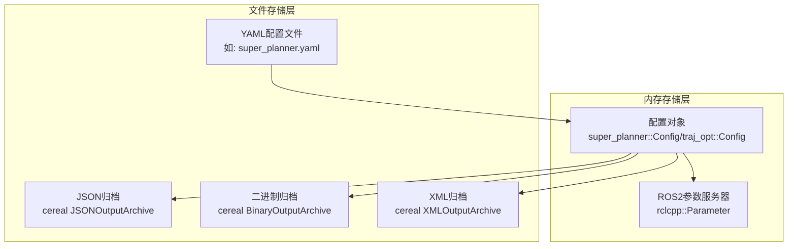
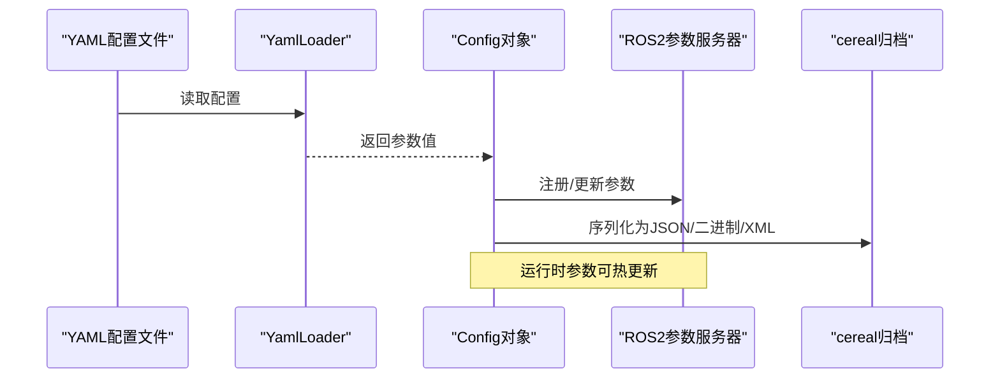
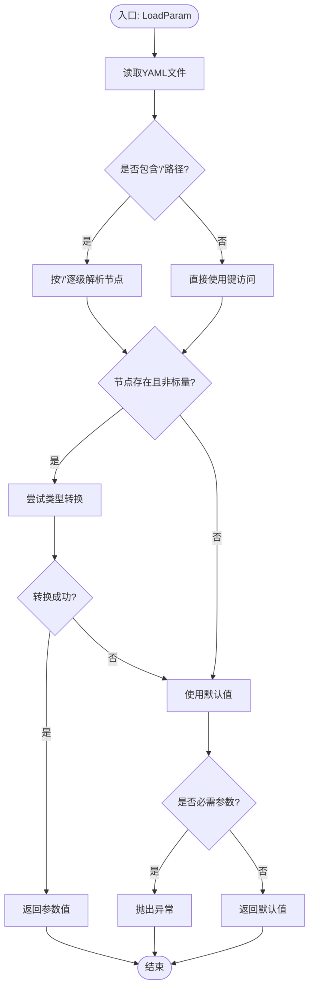
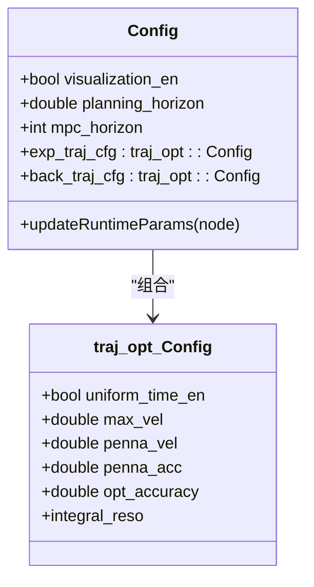
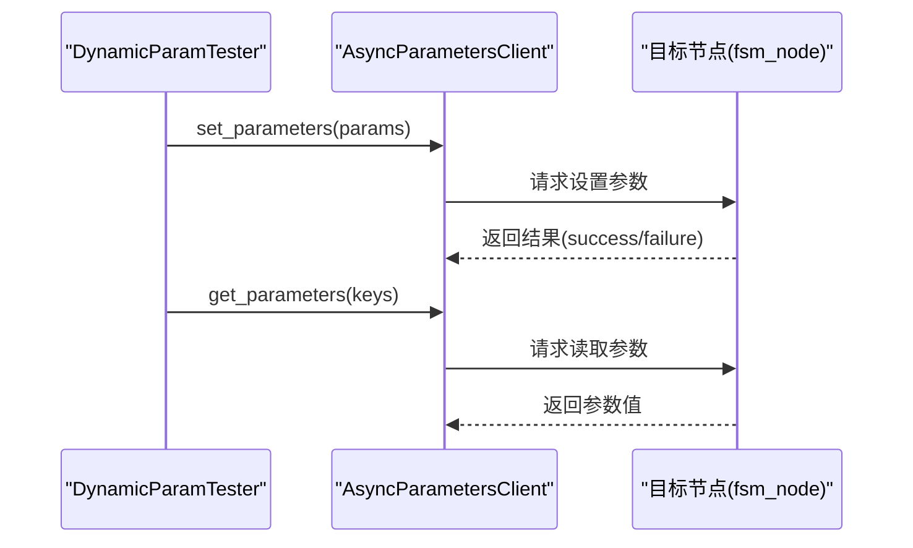
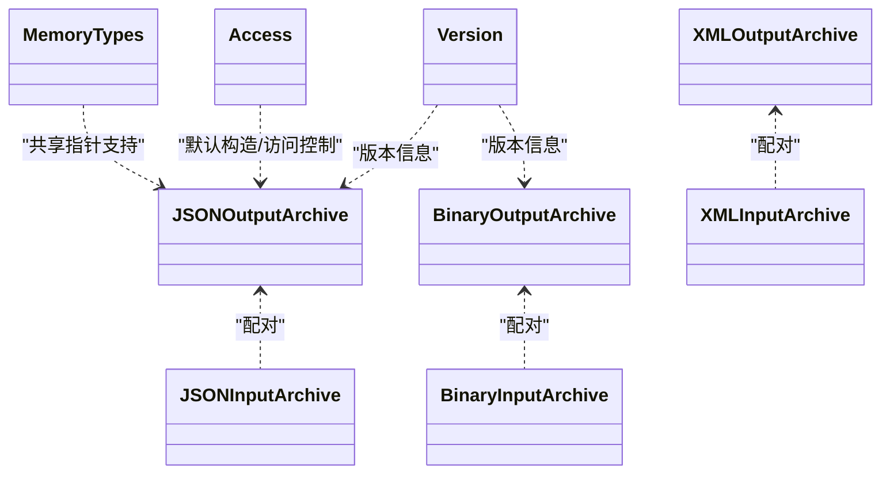
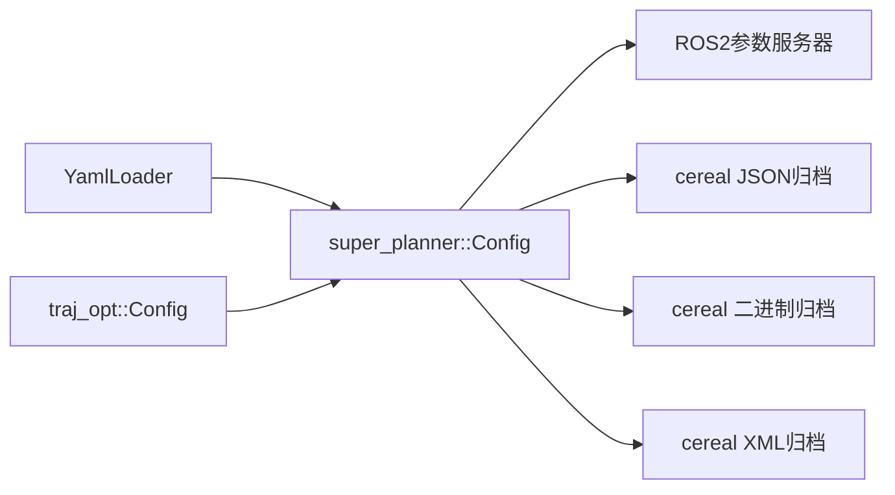

# 参数存储与持久化

<cite>
**本文引用的文件**   
- [yaml_loader.hpp](file://src/SUPER/super_planner/include/utils/header/yaml_loader.hpp)
- [config.hpp](file://src/SUPER/super_planner/include/super_core/config.hpp)
- [config.hpp](file://src/SUPER/super_planner/include/traj_opt/config.hpp)
- [test_dynamic_params.cpp](file://src/SUPER/super_planner/test/test_dynamic_params.cpp)
- [waypoint.yaml](file://src/SUPER/mission_planner/config/waypoint.yaml)
- [json.hpp](file://src/SUPER/super_planner/include/cereal/archives/json.hpp)
- [binary.hpp](file://src/SUPER/super_planner/include/cereal/archives/binary.hpp)
- [xml.hpp](file://src/SUPER/super_planner/include/cereal/archives/xml.hpp)
- [version.hpp](file://src/SUPER/super_planner/include/cereal/version.hpp)
- [cereal.hpp](file://src/SUPER/super_planner/include/cereal/cereal.hpp)
- [access.hpp](file://src/SUPER/super_planner/include/cereal/access.hpp)
- [types/memory.hpp](file://src/SUPER/super_planner/include/cereal/types/memory.hpp)
- [banchmark_high_speed.launch.py](file://src/SUPER/mission_planner/launch/banchmark_high_speed.launch.py)
- [benchmark_dense.launch.py](file://src/SUPER/mission_planner/launch/benchmark_dense.launch.py)
- [click_demo.launch.py](file://src/SUPER/mission_planner/launch/click_demo.launch.py)
- [ros2.CMakeLists.txt](file://src/SUPER/super_planner/ros/ros2.CMakeLists.txt)
</cite>

## 目录
1. [引言](#引言)
2. [项目结构](#项目结构)
3. [核心组件](#核心组件)
4. [架构总览](#架构总览)
5. [详细组件分析](#详细组件分析)
6. [依赖关系分析](#依赖关系分析)
7. [性能考量](#性能考量)
8. [故障排查指南](#故障排查指南)
9. [结论](#结论)
10. [附录](#附录)

## 引言
本技术文档围绕参数存储与持久化系统展开，覆盖以下关键主题：
- 存储策略：内存存储、文件存储（YAML）、运行时参数（ROS2参数服务器）与序列化归档（JSON/Binary/XML）。
- 序列化与反序列化：基于cereal库的多格式归档，确保参数在重启后可正确恢复。
- 版本管理与迁移：通过命名空间与版本宏，兼容参数格式变更；建议采用“命名空间+版本号”策略。
- 备份与恢复：提供全量与增量备份思路，结合cereal归档与YAML配置文件。
- 安全性与访问控制：参数服务访问控制、敏感参数隔离与最小权限原则。
- 不同部署环境的应用：仿真、离线演示与真实飞行场景的参数配置差异。

## 项目结构
参数系统由三部分组成：
- 文件存储层：YAML配置文件与cereal归档文件。
- 内存存储层：运行时参数（ROS2参数服务器）与内存中的配置对象。
- 序列化层：cereal多格式归档（JSON、Binary、XML），用于跨进程/跨版本持久化。

**图表来源**
- [yaml_loader.hpp](file://src/SUPER/super_planner/include/utils/header/yaml_loader.hpp#L48-L172)
- [config.hpp](file://src/SUPER/super_planner/include/super_core/config.hpp#L96-L151)
- [config.hpp](file://src/SUPER/super_planner/include/traj_opt/config.hpp#L110-L179)
- [json.hpp](file://src/SUPER/super_planner/include/cereal/archives/json.hpp#L106-L179)
- [binary.hpp](file://src/SUPER/super_planner/include/cereal/archives/binary.hpp#L35-L169)
- [xml.hpp](file://src/SUPER/super_planner/include/cereal/archives/xml.hpp#L253-L282)

**章节来源**
- [yaml_loader.hpp](file://src/SUPER/super_planner/include/utils/header/yaml_loader.hpp#L48-L172)
- [config.hpp](file://src/SUPER/super_planner/include/super_core/config.hpp#L96-L151)
- [config.hpp](file://src/SUPER/super_planner/include/traj_opt/config.hpp#L110-L179)

## 核心组件
- YAML加载器：从YAML文件加载参数，支持层级路径访问与类型校验。
- 配置类：封装超级规划器与轨迹优化的参数，负责从文件与运行时参数合并。
- 运行时参数：通过ROS2参数服务器动态更新，支持热更新。
- 序列化归档：使用cereal库进行JSON、二进制与XML归档，便于跨版本与跨平台恢复。

**章节来源**
- [yaml_loader.hpp](file://src/SUPER/super_planner/include/utils/header/yaml_loader.hpp#L48-L172)
- [config.hpp](file://src/SUPER/super_planner/include/super_core/config.hpp#L96-L151)
- [config.hpp](file://src/SUPER/super_planner/include/traj_opt/config.hpp#L110-L179)
- [test_dynamic_params.cpp](file://src/SUPER/super_planner/test/test_dynamic_params.cpp#L10-L118)

## 架构总览
参数生命周期从文件加载开始，进入内存配置对象，再同步到ROS2参数服务器，最终可通过cereal归档持久化。

**图表来源**
- [yaml_loader.hpp](file://src/SUPER/super_planner/include/utils/header/yaml_loader.hpp#L70-L128)
- [config.hpp](file://src/SUPER/super_planner/include/super_core/config.hpp#L158-L228)
- [json.hpp](file://src/SUPER/super_planner/include/cereal/archives/json.hpp#L106-L179)
- [binary.hpp](file://src/SUPER/super_planner/include/cereal/archives/binary.hpp#L35-L169)

## 详细组件分析

### YAML参数加载器（YamlLoader）
- 功能要点
  - 支持层级路径访问（如“super_planner/visualization_en”）。
  - 自动类型转换与类型校验，不匹配时回退默认值。
  - 支持必需参数检测与异常抛出。
- 关键流程
  - 读取YAML文件 -> 解析节点 -> 路径解析 -> 类型转换 -> 返回结果或默认值。

**图表来源**
- [yaml_loader.hpp](file://src/SUPER/super_planner/include/utils/header/yaml_loader.hpp#L70-L128)
- [yaml_loader.hpp](file://src/SUPER/super_planner/include/utils/header/yaml_loader.hpp#L148-L171)

**章节来源**
- [yaml_loader.hpp](file://src/SUPER/super_planner/include/utils/header/yaml_loader.hpp#L48-L172)

### 配置类（Config与traj_opt::Config）
- 功能要点
  - 从YAML文件加载参数，支持命名空间（如“exp_traj”、“backup_traj”）。
  - 将参数注入到运行时参数服务器，支持热更新。
  - 维护派生参数（如采样步长）。
- 参数来源
  - YAML文件：super_planner与traj_opt命名空间下的参数。
  - 运行时参数：通过updateRuntimeParams从ROS2参数服务器读取。

**图表来源**
- [config.hpp](file://src/SUPER/super_planner/include/super_core/config.hpp#L44-L151)
- [config.hpp](file://src/SUPER/super_planner/include/traj_opt/config.hpp#L50-L179)

**章节来源**
- [config.hpp](file://src/SUPER/super_planner/include/super_core/config.hpp#L96-L151)
- [config.hpp](file://src/SUPER/super_planner/include/traj_opt/config.hpp#L110-L179)

### 运行时参数（动态参数）
- 功能要点
  - 使用AsyncParametersClient连接目标节点（如fsm_node）。
  - 支持批量设置与获取参数，实现参数热更新。
- 测试用例
  - 定时器周期性测试参数更新与读取。

**图表来源**
- [test_dynamic_params.cpp](file://src/SUPER/super_planner/test/test_dynamic_params.cpp#L10-L118)

**章节来源**
- [test_dynamic_params.cpp](file://src/SUPER/super_planner/test/test_dynamic_params.cpp#L10-L118)

### 序列化与归档（cereal）
- 功能要点
  - JSONOutputArchive/JSONInputArchive：人类可读，适合调试与迁移。
  - BinaryOutputArchive/BinaryInputArchive：紧凑高效，适合高频持久化。
  - XMLOutputArchive/XMLInputArchive：结构化存储，适合跨语言交换。
- 版本与访问控制
  - version.hpp：声明cereal版本信息。
  - access.hpp：默认访问控制与默认构造。
  - types/memory.hpp：共享指针序列化支持。

**图表来源**
- [json.hpp](file://src/SUPER/super_planner/include/cereal/archives/json.hpp#L106-L179)
- [binary.hpp](file://src/SUPER/super_planner/include/cereal/archives/binary.hpp#L35-L169)
- [xml.hpp](file://src/SUPER/super_planner/include/cereal/archives/xml.hpp#L253-L282)
- [version.hpp](file://src/SUPER/super_planner/include/cereal/version.hpp#L40-L50)
- [access.hpp](file://src/SUPER/super_planner/include/cereal/access.hpp#L1-L16)
- [types/memory.hpp](file://src/SUPER/super_planner/include/cereal/types/memory.hpp#L205-L228)

**章节来源**
- [json.hpp](file://src/SUPER/super_planner/include/cereal/archives/json.hpp#L106-L179)
- [binary.hpp](file://src/SUPER/super_planner/include/cereal/archives/binary.hpp#L35-L169)
- [xml.hpp](file://src/SUPER/super_planner/include/cereal/archives/xml.hpp#L253-L282)
- [version.hpp](file://src/SUPER/super_planner/include/cereal/version.hpp#L40-L50)
- [access.hpp](file://src/SUPER/super_planner/include/cereal/access.hpp#L1-L16)
- [types/memory.hpp](file://src/SUPER/super_planner/include/cereal/types/memory.hpp#L205-L228)

## 依赖关系分析
- 文件依赖
  - Config依赖YamlLoader与traj_opt::Config。
  - traj_opt::Config依赖YamlLoader与四旋翼平坦性映射。
- 运行时依赖
  - Config.updateRuntimeParams依赖ROS2参数服务器。
- 归档依赖
  - cereal归档独立于具体数据模型，通过模板序列化接口与数据类解耦。

**图表来源**
- [config.hpp](file://src/SUPER/super_planner/include/super_core/config.hpp#L96-L151)
- [config.hpp](file://src/SUPER/super_planner/include/traj_opt/config.hpp#L110-L179)
- [yaml_loader.hpp](file://src/SUPER/super_planner/include/utils/header/yaml_loader.hpp#L48-L172)

**章节来源**
- [config.hpp](file://src/SUPER/super_planner/include/super_core/config.hpp#L96-L151)
- [config.hpp](file://src/SUPER/super_planner/include/traj_opt/config.hpp#L110-L179)
- [yaml_loader.hpp](file://src/SUPER/super_planner/include/utils/header/yaml_loader.hpp#L48-L172)

## 性能考量
- YAML加载
  - 顺序读取与类型转换开销较低，适合启动阶段加载。
  - 层级路径解析为O(k)，k为路径层级数。
- 运行时参数
  - 参数服务器查询为常数级延迟，适合高频热更新。
- 归档选择
  - JSON：可读性强，体积较大，适合迁移与调试。
  - Binary：体积小、速度快，适合频繁持久化。
  - XML：结构清晰，跨语言友好，适合外部系统集成。

[本节为通用性能讨论，无需列出具体文件来源]

## 故障排查指南
- YAML参数加载失败
  - 症状：参数未生效，使用默认值。
  - 排查：确认文件路径、键名拼写、层级路径是否存在。
  - 参考：YamlLoader的类型转换与默认值回退逻辑。
- 必需参数缺失
  - 症状：抛出异常，程序中断。
  - 排查：检查required标志与配置文件完整性。
- 运行时参数更新无效
  - 症状：参数未变化或报错。
  - 排查：确认目标节点参数服务可用、参数名与命名空间一致。
- 归档版本不兼容
  - 症状：反序列化失败或字段缺失。
  - 排查：核对cereal版本宏与数据模型版本，必要时进行迁移。

**章节来源**
- [yaml_loader.hpp](file://src/SUPER/super_planner/include/utils/header/yaml_loader.hpp#L70-L128)
- [test_dynamic_params.cpp](file://src/SUPER/super_planner/test/test_dynamic_params.cpp#L10-L118)
- [version.hpp](file://src/SUPER/super_planner/include/cereal/version.hpp#L40-L50)

## 结论
本参数系统通过YAML文件、运行时参数与cereal归档三层协同，实现了灵活、可维护、可扩展的参数管理方案。建议在实际部署中：
- 使用命名空间与版本号管理参数，确保兼容性。
- 对高频参数采用运行时参数热更新，对静态参数采用文件加载。
- 采用二进制归档进行日常持久化，JSON归档用于迁移与调试。
- 强化参数服务访问控制与敏感参数隔离。

[本节为总结性内容，无需列出具体文件来源]

## 附录

### 参数备份与恢复流程
- 全量备份
  - 方式一：归档当前配置对象（JSON/二进制/XML）。
  - 方式二：导出运行时参数快照至YAML文件。
- 增量备份
  - 记录自上次备份以来的参数变更，定期生成补丁归档。
- 恢复策略
  - 先加载归档/文件，再同步到运行时参数服务器。
  - 若版本不匹配，先迁移归档，再恢复。

[本节为通用流程说明，无需列出具体文件来源]

### 不同部署环境的应用
- 仿真环境
  - 使用dense/high_speed等launch文件加载不同配置。
  - 示例：benchmark_dense.launch.py、banchmark_high_speed.launch.py、click_demo.launch.py。
- 离线演示
  - 通过waypoint.yaml指定任务参数与话题。
- 真实飞行
  - 通过real_drone.launch.py加载真实硬件配置。
- 打包与安装
  - 通过ros2.CMakeLists.txt安装launch与config目录。

**章节来源**
- [banchmark_high_speed.launch.py](file://src/SUPER/mission_planner/launch/banchmark_high_speed.launch.py#L44-L100)
- [benchmark_dense.launch.py](file://src/SUPER/mission_planner/launch/benchmark_dense.launch.py#L44-L100)
- [click_demo.launch.py](file://src/SUPER/mission_planner/launch/click_demo.launch.py#L46-L97)
- [waypoint.yaml](file://src/SUPER/mission_planner/config/waypoint.yaml#L1-L19)
- [ros2.CMakeLists.txt](file://src/SUPER/super_planner/ros/ros2.CMakeLists.txt#L128-L133)