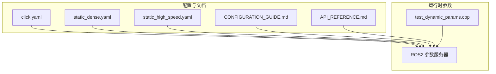
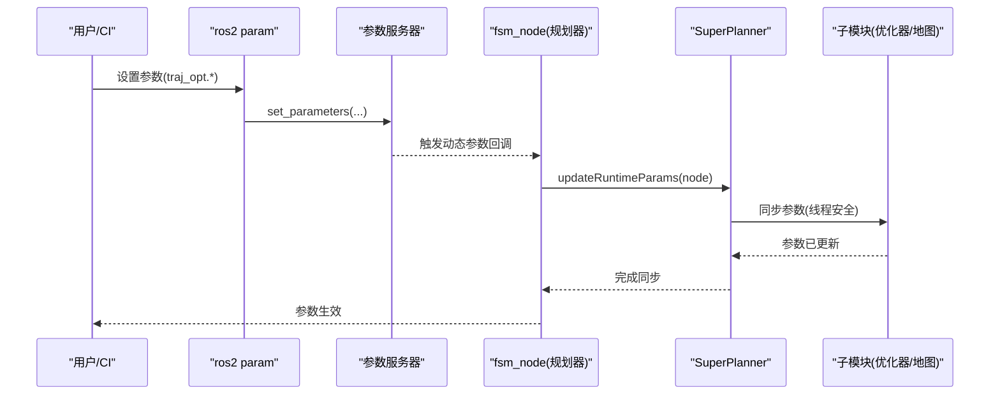
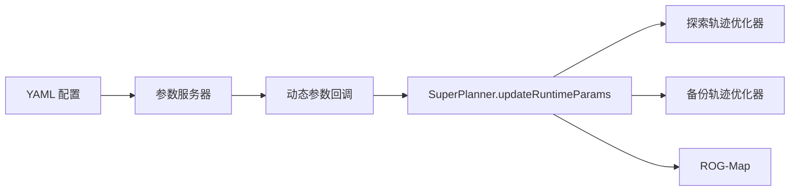

# 参数调优工作流程

<cite>
**本文引用的文件**
- [src/SUPER/super_planner/config/click.yaml](file://src/SUPER/super_planner/config/click.yaml)
- [src/SUPER/super_planner/config/static_dense.yaml](file://src/SUPER/super_planner/config/static_dense.yaml)
- [src/SUPER/super_planner/config/static_high_speed.yaml](file://src/SUPER/super_planner/config/static_high_speed.yaml)
- [src/SUPER/super_planner/docs/CONFIGURATION_GUIDE.md](file://src/SUPER/super_planner/docs/CONFIGURATION_GUIDE.md)
- [src/SUPER/super_planner/docs/API_REFERENCE.md](file://src/SUPER/super_planner/docs/API_REFERENCE.md)
- [src/SUPER/super_planner/test/test_dynamic_params.cpp](file://src/SUPER/super_planner/test/test_dynamic_params.cpp)
</cite>

## 目录
1. [简介](#简介)
2. [项目结构](#项目结构)
3. [核心组件](#核心组件)
4. [架构总览](#架构总览)
5. [详细组件分析](#详细组件分析)
6. [依赖关系分析](#依赖关系分析)
7. [性能考量](#性能考量)
8. [故障排查指南](#故障排查指南)
9. [结论](#结论)
10. [附录](#附录)

## 简介
本文件面向参数调优工作流程，结合代码库中的配置文件与动态参数能力，提供一套可复用的标准化步骤：参数发现、修改、验证、应用、测试、回滚；并给出最佳实践（渐进式调优、A/B测试、性能基准对比）、安全策略（参数回滚、系统保护、异常处理）、工具链与自动化脚本建议，以及文档记录与知识管理方法。文中所有技术细节均基于仓库现有实现与文档。

## 项目结构
本项目围绕“超级规划器”构建，参数调优主要涉及三类文件：
- YAML 配置文件：定义默认参数与预设场景
- 动态参数接口：通过 ROS2 参数服务器在运行时修改参数
- 测试脚本：演示动态参数设置与获取

图表来源
- [src/SUPER/super_planner/config/click.yaml](file://src/SUPER/super_planner/config/click.yaml#L1-L190)
- [src/SUPER/super_planner/config/static_dense.yaml](file://src/SUPER/super_planner/config/static_dense.yaml#L1-L186)
- [src/SUPER/super_planner/config/static_high_speed.yaml](file://src/SUPER/super_planner/config/static_high_speed.yaml#L1-L187)
- [src/SUPER/super_planner/docs/CONFIGURATION_GUIDE.md](file://src/SUPER/super_planner/docs/CONFIGURATION_GUIDE.md#L1-L411)
- [src/SUPER/super_planner/docs/API_REFERENCE.md](file://src/SUPER/super_planner/docs/API_REFERENCE.md#L1-L811)
- [src/SUPER/super_planner/test/test_dynamic_params.cpp](file://src/SUPER/super_planner/test/test_dynamic_params.cpp#L1-L118)

章节来源
- [src/SUPER/super_planner/config/click.yaml](file://src/SUPER/super_planner/config/click.yaml#L1-L190)
- [src/SUPER/super_planner/config/static_dense.yaml](file://src/SUPER/super_planner/config/static_dense.yaml#L1-L186)
- [src/SUPER/super_planner/config/static_high_speed.yaml](file://src/SUPER/super_planner/config/static_high_speed.yaml#L1-L187)
- [src/SUPER/super_planner/docs/CONFIGURATION_GUIDE.md](file://src/SUPER/super_planner/docs/CONFIGURATION_GUIDE.md#L1-L411)
- [src/SUPER/super_planner/docs/API_REFERENCE.md](file://src/SUPER/super_planner/docs/API_REFERENCE.md#L1-L811)
- [src/SUPER/super_planner/test/test_dynamic_params.cpp](file://src/SUPER/super_planner/test/test_dynamic_params.cpp#L1-L118)

## 核心组件
- 配置文件：提供默认参数与场景化配置，便于固化最优参数与版本化管理
- 动态参数：通过 ROS2 参数服务器在运行时修改参数，支持 rqt_reconfigure 可视化与命令行操作
- 测试脚本：演示参数设置、获取与回调同步流程，可用于自动化验证

章节来源
- [src/SUPER/super_planner/docs/CONFIGURATION_GUIDE.md](file://src/SUPER/super_planner/docs/CONFIGURATION_GUIDE.md#L174-L223)
- [src/SUPER/super_planner/test/test_dynamic_params.cpp](file://src/SUPER/super_planner/test/test_dynamic_params.cpp#L10-L107)

## 架构总览
参数调优贯穿“配置文件 → 参数服务器 → 规划器模块”的链路，动态参数变更会触发回调，自动同步到各子模块。

图表来源
- [src/SUPER/super_planner/docs/CONFIGURATION_GUIDE.md](file://src/SUPER/super_planner/docs/CONFIGURATION_GUIDE.md#L174-L223)
- [src/SUPER/super_planner/docs/API_REFERENCE.md](file://src/SUPER/super_planner/docs/API_REFERENCE.md#L254-L266)

## 详细组件分析

### 参数发现与分类
- 配置文件中包含路径搜索、轨迹优化、备份轨迹、平坦性模型、走廊生成、视场角约束、地图与规划等参数域
- 预设场景文件提供“静态高密度/高速”等典型配置，便于快速切换与对比

章节来源
- [src/SUPER/super_planner/config/click.yaml](file://src/SUPER/super_planner/config/click.yaml#L105-L190)
- [src/SUPER/super_planner/config/static_dense.yaml](file://src/SUPER/super_planner/config/static_dense.yaml#L96-L186)
- [src/SUPER/super_planner/config/static_high_speed.yaml](file://src/SUPER/super_planner/config/static_high_speed.yaml#L97-L187)
- [src/SUPER/super_planner/docs/CONFIGURATION_GUIDE.md](file://src/SUPER/super_planner/docs/CONFIGURATION_GUIDE.md#L21-L171)

### 参数修改与应用
- 通过命令行或 rqt_reconfigure 实时修改参数
- 参数变更后，回调函数自动触发参数同步，确保所有子模块一致

章节来源
- [src/SUPER/super_planner/docs/CONFIGURATION_GUIDE.md](file://src/SUPER/super_planner/docs/CONFIGURATION_GUIDE.md#L197-L223)
- [src/SUPER/super_planner/docs/API_REFERENCE.md](file://src/SUPER/super_planner/docs/API_REFERENCE.md#L254-L266)

### 验证与测试
- 使用测试脚本演示参数设置、获取与回调流程，可作为自动化验证的基础
- 建议结合 RViz 可视化、日志输出与实际飞行测试进行综合验证

章节来源
- [src/SUPER/super_planner/test/test_dynamic_params.cpp](file://src/SUPER/super_planner/test/test_dynamic_params.cpp#L10-L107)
- [src/SUPER/super_planner/docs/CONFIGURATION_GUIDE.md](file://src/SUPER/super_planner/docs/CONFIGURATION_GUIDE.md#L291-L322)

### 回滚与安全策略
- 回滚：通过参数服务器列出/获取参数，必要时恢复到历史值
- 异常处理：动态参数不生效时，检查参数名、回调是否触发、节点是否重启
- 系统保护：建议在参数变更前后记录日志与状态，避免一次性大幅调整

章节来源
- [src/SUPER/super_planner/docs/CONFIGURATION_GUIDE.md](file://src/SUPER/super_planner/docs/CONFIGURATION_GUIDE.md#L374-L385)

### 工具链与自动化脚本
- 命令行工具：ros2 param set/get/list/dump
- 可视化工具：rqt_reconfigure
- 自动化脚本：基于测试脚本扩展，实现批量参数扫描、A/B对比、结果采集与报告

章节来源
- [src/SUPER/super_planner/docs/CONFIGURATION_GUIDE.md](file://src/SUPER/super_planner/docs/CONFIGURATION_GUIDE.md#L197-L211)
- [src/SUPER/super_planner/test/test_dynamic_params.cpp](file://src/SUPER/super_planner/test/test_dynamic_params.cpp#L10-L107)

### 文档记录与知识管理
- 建立参数调优知识库：按场景/环境/性能目标归档最优参数组合
- 版本化管理：将有效参数文件纳入版本控制，配合变更说明
- 性能指标：记录规划耗时、优化迭代次数、轨迹平滑度等指标

章节来源
- [src/SUPER/super_planner/docs/CONFIGURATION_GUIDE.md](file://src/SUPER/super_planner/docs/CONFIGURATION_GUIDE.md#L398-L410)

## 依赖关系分析
参数调优涉及以下依赖关系：
- 配置文件 → 参数服务器：首次加载与默认值
- 参数服务器 → 规划器：动态参数回调同步
- 规划器 → 子模块：参数同步至轨迹优化器、地图等

图表来源
- [src/SUPER/super_planner/docs/API_REFERENCE.md](file://src/SUPER/super_planner/docs/API_REFERENCE.md#L254-L266)
- [src/SUPER/super_planner/docs/CONFIGURATION_GUIDE.md](file://src/SUPER/super_planner/docs/CONFIGURATION_GUIDE.md#L174-L223)

章节来源
- [src/SUPER/super_planner/docs/API_REFERENCE.md](file://src/SUPER/super_planner/docs/API_REFERENCE.md#L254-L266)
- [src/SUPER/super_planner/docs/CONFIGURATION_GUIDE.md](file://src/SUPER/super_planner/docs/CONFIGURATION_GUIDE.md#L174-L223)

## 性能考量
- 参数与性能的关系：速度/加速度/加加速度上限、惩罚权重、优化精度、积分分辨率等直接影响轨迹质量与计算耗时
- 性能基线：完整规划周期约 200-400ms（路径搜索、走廊生成、轨迹优化、备份轨迹），可据此评估参数调整对延迟的影响
- 渐进式调优：建议每次只调整一个参数，观察轨迹平滑度、优化耗时与碰撞规避能力的变化

章节来源
- [src/SUPER/super_planner/docs/CONFIGURATION_GUIDE.md](file://src/SUPER/super_planner/docs/CONFIGURATION_GUIDE.md#L789-L789)
- [src/SUPER/super_planner/docs/CONFIGURATION_GUIDE.md](file://src/SUPER/super_planner/docs/CONFIGURATION_GUIDE.md#L390-L397)

## 故障排查指南
- 动态参数不生效
  - 检查参数名是否正确（区分大小写）
  - 确认节点收到参数更新回调
  - 必要时强制重新加载参数
- 轨迹优化失败
  - 检查走廊有效性、惩罚权重是否过大、初值是否合理
- 轨迹有跳跃或不连续
  - 增加加加速度惩罚与平滑参数
- 规划速度慢
  - 降低分辨率、优化精度与积分分辨率

章节来源
- [src/SUPER/super_planner/docs/CONFIGURATION_GUIDE.md](file://src/SUPER/super_planner/docs/CONFIGURATION_GUIDE.md#L325-L385)

## 结论
本项目提供了完善的参数调优基础设施：YAML 配置文件用于固化与场景化管理，ROS2 动态参数用于运行时调整，测试脚本用于验证与自动化。结合渐进式调优、A/B 对比与性能基线，可形成稳定高效的参数调优工作流。建议在团队内建立参数知识库与版本化管理规范，持续沉淀经验并提升迭代效率。

## 附录
- 参数调优流程（标准化步骤）
  1) 参数发现：从配置文件与文档中识别关键参数域
  2) 修改：通过命令行或 rqt_reconfigure 设置参数
  3) 验证：观察 RViz 可视化、日志输出与飞行测试
  4) 应用：将最优参数固化到配置文件并纳入版本控制
  5) 测试：使用测试脚本与自动化脚本进行回归验证
  6) 回滚：如出现异常，恢复到历史参数值并记录原因
- 最佳实践
  - 先保守参数，再逐步放宽
  - 逐项调整单个参数，记录变化与效果
  - 建立参数库与性能指标，定期备份工作配置
- 安全策略
  - 参数回滚：保留历史参数快照
  - 系统保护：限制参数变更幅度，增加异常告警
  - 异常处理：参数不生效时，检查回调与节点状态

章节来源
- [src/SUPER/super_planner/docs/CONFIGURATION_GUIDE.md](file://src/SUPER/super_planner/docs/CONFIGURATION_GUIDE.md#L388-L410)
- [src/SUPER/super_planner/test/test_dynamic_params.cpp](file://src/SUPER/super_planner/test/test_dynamic_params.cpp#L10-L107)