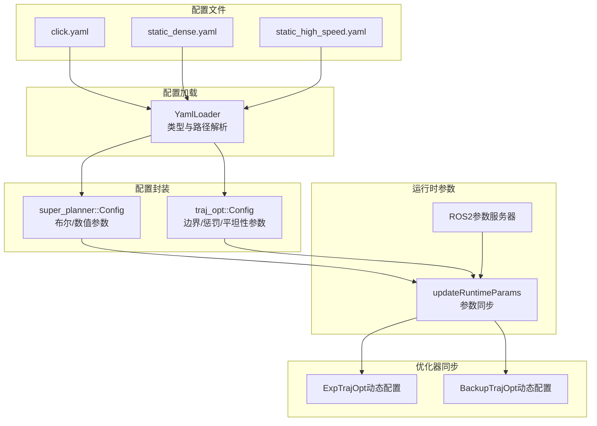
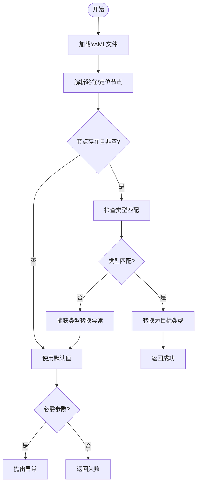
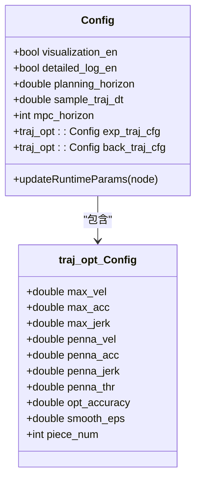
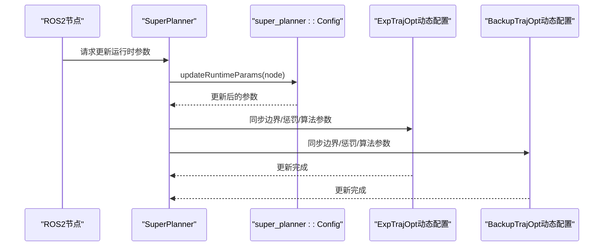
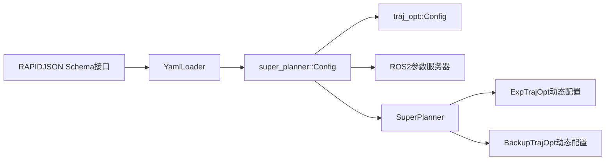

# 参数验证系统

<cite>
**本文档引用的文件**
- [yaml_loader.hpp](file://src/SUPER/super_planner/include/utils/header/yaml_loader.hpp)
- [config.hpp](file://src/SUPER/super_planner/include/super_core/config.hpp)
- [config.hpp](file://src/SUPER/super_planner/include/traj_opt/config.hpp)
- [super_planner.h](file://src/SUPER/super_planner/include/super_core/super_planner.h)
- [fsm.h](file://src/SUPER/super_planner/include/fsm/fsm.h)
- [test_dynamic_params.cpp](file://src/SUPER/super_planner/test/test_dynamic_params.cpp)
- [click.yaml](file://src/SUPER/super_planner/config/click.yaml)
- [static_dense.yaml](file://src/SUPER/super_planner/config/static_dense.yaml)
- [static_high_speed.yaml](file://src/SUPER/super_planner/config/static_high_speed.yaml)
- [schema.h](file://src/SUPER/super_planner/include/cereal/external/rapidjson/schema.h)
</cite>

## 目录
1. [简介](#简介)
2. [项目结构](#项目结构)
3. [核心组件](#核心组件)
4. [架构总览](#架构总览)
5. [详细组件分析](#详细组件分析)
6. [依赖关系分析](#依赖关系分析)
7. [性能考虑](#性能考虑)
8. [故障排查指南](#故障排查指南)
9. [结论](#结论)
10. [附录](#附录)

## 简介
本文件面向参数验证系统，系统性阐述参数验证的实现机制与设计原则，覆盖以下方面：
- 参数范围检查：数值上下限、步长整除性等
- 类型验证：YAML节点类型与C++类型一致性校验
- 依赖关系验证：参数间的组合一致性与互斥关系
- 约束规则设计与实现：边界条件、枚举值、组合一致性
- 失败处理策略：错误报告、默认值回退、系统保护
- 扩展方法与自定义规则：如何新增约束与验证器
- 性能优化：加载与验证流程的效率提升
- 在不同模块的应用实例：配置加载、动态参数更新、优化器参数同步

## 项目结构
参数验证系统主要分布在以下层次：
- 配置加载层：YAML解析与参数读取
- 配置封装层：Config类负责参数组织与默认值
- 运行时参数层：ROS2参数服务器交互与动态更新
- 优化器同步层：将参数同步至轨迹优化器
- 验证规则层：数值范围、类型、组合一致性等



**图表来源**
- [yaml_loader.hpp](file://src/SUPER/super_planner/include/utils/header/yaml_loader.hpp#L70-L128)
- [config.hpp](file://src/SUPER/super_planner/include/super_core/config.hpp#L96-L228)
- [config.hpp](file://src/SUPER/super_planner/include/traj_opt/config.hpp#L110-L179)
- [super_planner.h](file://src/SUPER/super_planner/include/super_core/super_planner.h#L241-L295)

**章节来源**
- [yaml_loader.hpp](file://src/SUPER/super_planner/include/utils/header/yaml_loader.hpp#L48-L176)
- [config.hpp](file://src/SUPER/super_planner/include/super_core/config.hpp#L44-L231)
- [config.hpp](file://src/SUPER/super_planner/include/traj_opt/config.hpp#L50-L181)

## 核心组件
- YamlLoader：负责从YAML文件读取参数，执行类型检查与默认值回退，支持路径式访问
- super_planner::Config：封装超级规划器的布尔与数值参数，负责从YAML加载并计算派生参数
- traj_opt::Config：封装轨迹优化器的边界约束、惩罚权重、平坦性参数，支持命名空间隔离
- SuperPlanner：负责将运行时参数从ROS2参数服务器同步到配置与优化器
- 验证规则：基于RAPIDJSON Schema接口定义的数值范围、倍数、字符串长度等规则

**章节来源**
- [yaml_loader.hpp](file://src/SUPER/super_planner/include/utils/header/yaml_loader.hpp#L48-L176)
- [config.hpp](file://src/SUPER/super_planner/include/super_core/config.hpp#L44-L231)
- [config.hpp](file://src/SUPER/super_planner/include/traj_opt/config.hpp#L50-L181)
- [super_planner.h](file://src/SUPER/super_planner/include/super_core/super_planner.h#L241-L295)
- [schema.h](file://src/SUPER/super_planner/include/cereal/external/rapidjson/schema.h#L168-L2373)

## 架构总览
参数验证贯穿“加载-封装-同步-执行”全流程，确保参数在进入核心算法前满足约束。

```mermaid
sequenceDiagram
participant YAML as "YAML配置文件"
participant Loader as "YamlLoader"
participant Cfg as "Config类"
participant ROS as "ROS2参数服务器"
participant SP as "SuperPlanner"
participant Opt as "轨迹优化器"
YAML->>Loader : 读取参数节点
Loader->>Cfg : 类型转换与默认值回退
Cfg-->>SP : 初始化配置
ROS->>SP : 动态参数更新请求
SP->>Cfg : updateRuntimeParams同步
Cfg-->>Opt : 同步边界/惩罚/平坦性参数
Opt-->>SP : 执行轨迹优化
```

**图表来源**
- [yaml_loader.hpp](file://src/SUPER/super_planner/include/utils/header/yaml_loader.hpp#L70-L128)
- [config.hpp](file://src/SUPER/super_planner/include/super_core/config.hpp#L158-L228)
- [super_planner.h](file://src/SUPER/super_planner/include/super_core/super_planner.h#L241-L295)

## 详细组件分析

### 组件A：YamlLoader（参数加载与类型验证）
- 职责
  - 从YAML文件加载参数节点，支持“/”路径访问
  - 对标量与序列类型进行严格类型检查，类型不匹配时回退默认值
  - 支持必需参数检测，缺失时抛出异常
  - 提供类型萃取判断，区分vector与标量类型
- 关键流程
  - 解析路径，定位目标节点
  - 判断节点是否存在与类型是否匹配
  - 异常捕获与默认值回退
  - 必需参数校验



**图表来源**
- [yaml_loader.hpp](file://src/SUPER/super_planner/include/utils/header/yaml_loader.hpp#L70-L128)

**章节来源**
- [yaml_loader.hpp](file://src/SUPER/super_planner/include/utils/header/yaml_loader.hpp#L48-L176)

### 组件B：super_planner::Config（参数封装与派生计算）
- 职责
  - 加载布尔与数值参数，设置默认值
  - 从YAML加载轨迹优化配置（exp_traj与backup_traj）
  - 计算派生参数（如轨迹采样步长）
  - 提供运行时参数更新接口，与ROS2参数服务器交互
- 关键点
  - 使用命名空间前缀加载不同模块参数
  - 通过get_parameter_or实现默认值与回退
  - 同步计算sample_traj_dt = resolution / exp_traj_cfg.max_vel



**图表来源**
- [config.hpp](file://src/SUPER/super_planner/include/super_core/config.hpp#L44-L231)
- [config.hpp](file://src/SUPER/super_planner/include/traj_opt/config.hpp#L50-L181)

**章节来源**
- [config.hpp](file://src/SUPER/super_planner/include/super_core/config.hpp#L96-L228)

### 组件C：traj_opt::Config（轨迹优化参数）
- 职责
  - 加载边界约束参数（速度/加速度/加加速度/角速度/推力）
  - 加载惩罚权重（时间、位置、速度、加速度、加加速度、角速度、推力、吸引力等）
  - 加载平坦性参数（质量、阻力、重力、推力系数等）
  - 支持命名空间参数加载，实现exp_traj与backup_traj的差异化配置
  - 应用全局缩放系数，统一调整惩罚权重
- 关键点
  - 通过命名空间拼接实现多配置加载
  - 默认值采用负值或零值，便于上层逻辑识别“未显式设置”

**章节来源**
- [config.hpp](file://src/SUPER/super_planner/include/traj_opt/config.hpp#L110-L179)

### 组件D：SuperPlanner（运行时参数同步）
- 职责
  - 从ROS2参数服务器批量获取参数并更新Config
  - 将Config中的参数同步到ExpTrajOpt与BackupTrajOpt的动态配置
  - 保证多线程安全，使用互斥锁保护动态配置更新
- 关键点
  - 同步边界约束与惩罚权重
  - 同步算法配置参数（如pos_constraint_type、uniform_time_en等）



**图表来源**
- [super_planner.h](file://src/SUPER/super_planner/include/super_core/super_planner.h#L241-L295)
- [config.hpp](file://src/SUPER/super_planner/include/super_core/config.hpp#L158-L228)

**章节来源**
- [super_planner.h](file://src/SUPER/super_planner/include/super_core/super_planner.h#L241-L295)

### 组件E：动态参数测试（test_dynamic_params）
- 职责
  - 通过AsyncParametersClient连接到目标节点（如fsm_node）
  - 定时器周期性设置/获取动态参数，验证参数更新功能
- 关键点
  - 参数命名空间遵循“traj_opt.boundary.”等前缀
  - 结果通过future等待与reason字段判断成功与否

**章节来源**
- [test_dynamic_params.cpp](file://src/SUPER/super_planner/test/test_dynamic_params.cpp#L10-L107)

### 组件F：验证规则与错误处理（RAPIDJSON Schema）
- 职责
  - 定义数值范围、倍数、字符串长度等验证接口
  - 提供错误处理器回调，记录具体违规关键字与上下文
- 关键点
  - 支持整数/无符号整数/浮点数的范围与倍数检查
  - 字符串长度与正则匹配错误报告
  - 数组元素数量与重复项检查

**章节来源**
- [schema.h](file://src/SUPER/super_planner/include/cereal/external/rapidjson/schema.h#L168-L2373)

## 依赖关系分析
- YamlLoader依赖YAML::Node进行节点访问与类型转换
- super_planner::Config依赖traj_opt::Config进行子模块参数加载
- SuperPlanner依赖ROS2参数服务器与两个优化器的动态配置
- 验证规则接口来自RAPIDJSON Schema，可扩展为自定义验证器



**图表来源**
- [yaml_loader.hpp](file://src/SUPER/super_planner/include/utils/header/yaml_loader.hpp#L70-L128)
- [config.hpp](file://src/SUPER/super_planner/include/super_core/config.hpp#L96-L228)
- [config.hpp](file://src/SUPER/super_planner/include/traj_opt/config.hpp#L110-L179)
- [super_planner.h](file://src/SUPER/super_planner/include/super_core/super_planner.h#L241-L295)
- [schema.h](file://src/SUPER/super_planner/include/cereal/external/rapidjson/schema.h#L168-L2373)

**章节来源**
- [yaml_loader.hpp](file://src/SUPER/super_planner/include/utils/header/yaml_loader.hpp#L48-L176)
- [config.hpp](file://src/SUPER/super_planner/include/super_core/config.hpp#L44-L231)
- [config.hpp](file://src/SUPER/super_planner/include/traj_opt/config.hpp#L50-L181)
- [super_planner.h](file://src/SUPER/super_planner/include/super_core/super_planner.h#L241-L295)
- [schema.h](file://src/SUPER/super_planner/include/cereal/external/rapidjson/schema.h#L168-L2373)

## 性能考虑
- 加载阶段
  - YAML文件一次性加载，后续按需访问节点，减少IO开销
  - 类型检查与默认值回退在转换失败时快速短路，避免无效计算
- 运行时同步
  - 批量参数更新通过一次调用完成，减少参数服务器往返
  - 动态配置更新使用互斥锁保护，避免并发写入竞争
- 验证阶段
  - 数值范围与倍数检查为O(1)，开销极低
  - 错误处理器回调仅在验证失败时触发，避免不必要的日志输出

[本节为通用性能讨论，无需列出具体文件来源]

## 故障排查指南
- 参数未生效
  - 检查参数命名空间是否正确（如traj_opt.boundary.前缀）
  - 确认参数服务器中参数名与Config加载名一致
- 类型不匹配
  - 查看YamlLoader的类型转换异常分支，确认YAML文件中类型与期望类型一致
  - 若为必需参数缺失，检查配置文件是否遗漏相应键值
- 动态参数更新失败
  - 检查AsyncParametersClient的future结果与reason字段
  - 确认目标节点已启动并暴露参数服务
- 参数冲突或不合理
  - 检查traj_opt::Config中的边界约束与惩罚权重是否合理
  - 使用默认值回退策略，逐步缩小问题范围

**章节来源**
- [yaml_loader.hpp](file://src/SUPER/super_planner/include/utils/header/yaml_loader.hpp#L70-L128)
- [test_dynamic_params.cpp](file://src/SUPER/super_planner/test/test_dynamic_params.cpp#L44-L100)
- [config.hpp](file://src/SUPER/super_planner/include/traj_opt/config.hpp#L110-L179)

## 结论
本参数验证系统通过“YAML加载-类型校验-封装默认-运行时同步”的闭环，实现了高可靠、可扩展的参数管理。系统具备完善的错误处理与默认值回退机制，支持动态参数更新与多模块参数同步，满足复杂轨迹优化场景下的参数一致性与安全性要求。

[本节为总结性内容，无需列出具体文件来源]

## 附录

### 参数约束规则设计与实现要点
- 数值范围限制
  - 通过RAPIDJSON Schema接口实现上下限与独占边界检查
  - 在Config加载时采用负值或零值作为“未设置”标记，便于上层识别
- 枚举值验证
  - 使用枚举类型（如YawMode）限定取值范围
  - 在Config中提供默认值，避免越界
- 组合参数一致性检查
  - 通过命名空间隔离exp_traj与backup_traj配置
  - 在SuperPlanner中统一同步边界与惩罚权重，避免局部更新导致的不一致

**章节来源**
- [schema.h](file://src/SUPER/super_planner/include/cereal/external/rapidjson/schema.h#L168-L2373)
- [config.hpp](file://src/SUPER/super_planner/include/super_core/config.hpp#L47-L53)
- [config.hpp](file://src/SUPER/super_planner/include/traj_opt/config.hpp#L110-L179)
- [super_planner.h](file://src/SUPER/super_planner/include/super_core/super_planner.h#L241-L295)

### 参数验证失败的处理策略
- 错误报告
  - YAML类型转换异常时记录失败并返回false
  - 必需参数缺失时抛出异常，便于上层捕获
- 默认值回退
  - 优先使用显式默认值，其次使用配置文件中的合理缺省
- 系统保护
  - 通过负值或零值标记未设置参数，避免误用
  - 在动态参数更新失败时保留当前有效参数，确保系统稳定

**章节来源**
- [yaml_loader.hpp](file://src/SUPER/super_planner/include/utils/header/yaml_loader.hpp#L70-L128)
- [config.hpp](file://src/SUPER/super_planner/include/super_core/config.hpp#L158-L228)

### 扩展方法与自定义验证规则
- 新增约束
  - 在YamlLoader中增加新的类型检查分支或路径解析规则
  - 在Config中新增参数字段与默认值，并在updateRuntimeParams中同步
- 自定义验证器
  - 基于RAPIDJSON Schema接口实现自定义错误处理器
  - 在类型转换后追加业务规则校验（如参数间依赖关系）

**章节来源**
- [yaml_loader.hpp](file://src/SUPER/super_planner/include/utils/header/yaml_loader.hpp#L48-L176)
- [schema.h](file://src/SUPER/super_planner/include/cereal/external/rapidjson/schema.h#L168-L2373)

### 参数验证在不同模块中的应用实例
- 配置加载实例
  - click.yaml、static_dense.yaml、static_high_speed.yaml中的边界与惩罚权重
- 运行时参数更新实例
  - test_dynamic_params通过AsyncParametersClient设置traj_opt.boundary.*参数
- 优化器参数同步实例
  - SuperPlanner将Config中的边界与惩罚权重同步到ExpTrajOpt与BackupTrajOpt

**章节来源**
- [click.yaml](file://src/SUPER/super_planner/config/click.yaml#L46-L94)
- [static_dense.yaml](file://src/SUPER/super_planner/config/static_dense.yaml#L41-L94)
- [static_high_speed.yaml](file://src/SUPER/super_planner/config/static_high_speed.yaml#L42-L95)
- [test_dynamic_params.cpp](file://src/SUPER/super_planner/test/test_dynamic_params.cpp#L44-L100)
- [super_planner.h](file://src/SUPER/super_planner/include/super_core/super_planner.h#L241-L295)