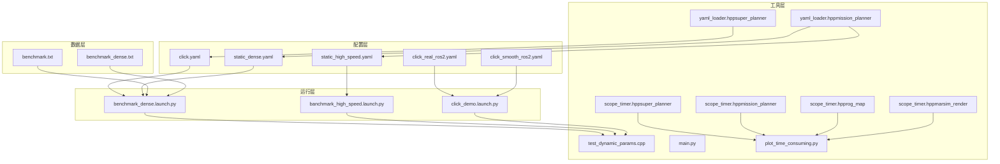
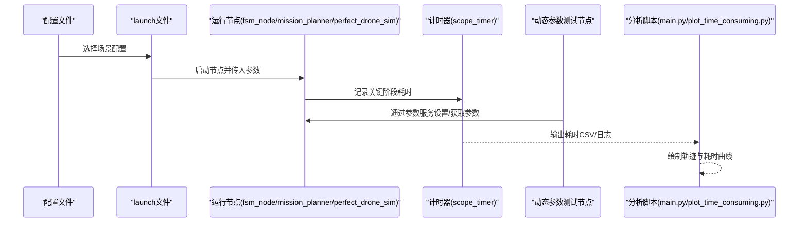
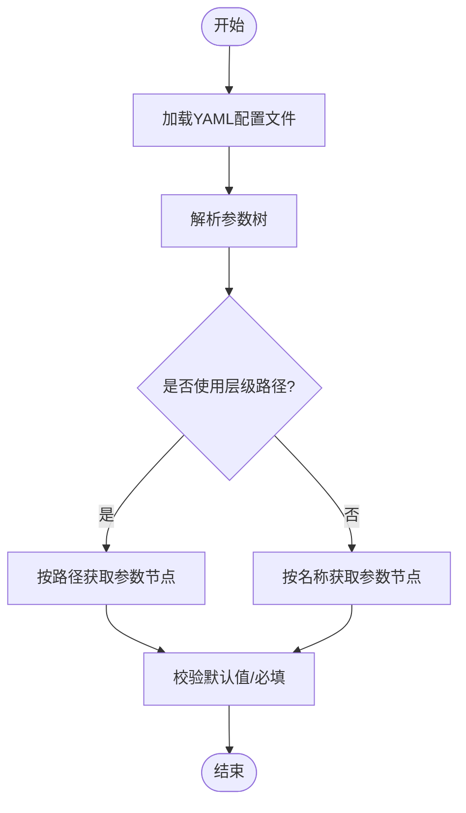
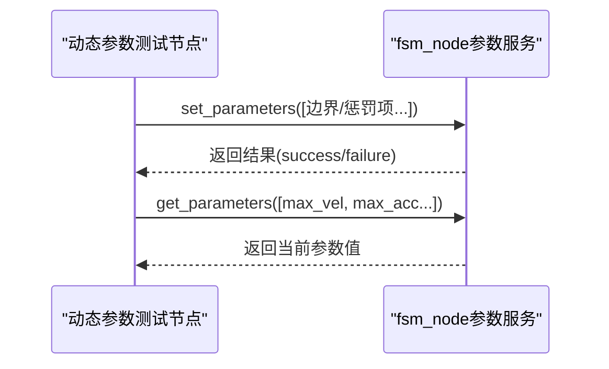
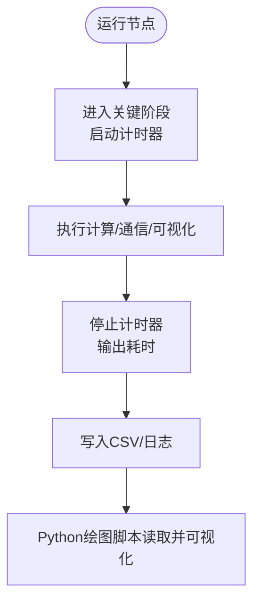
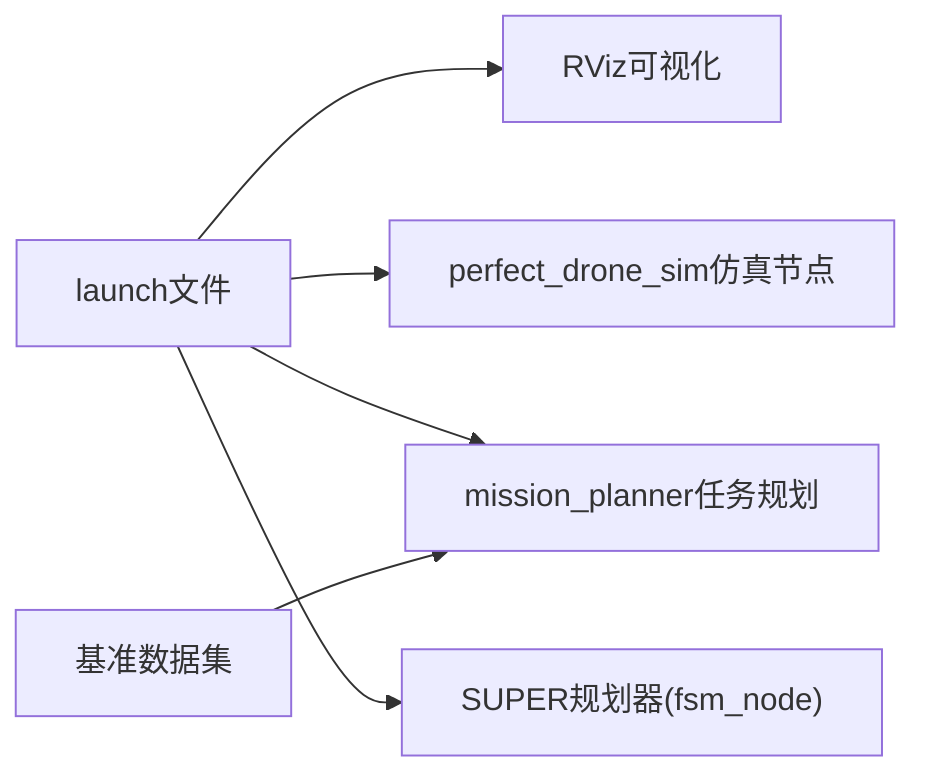
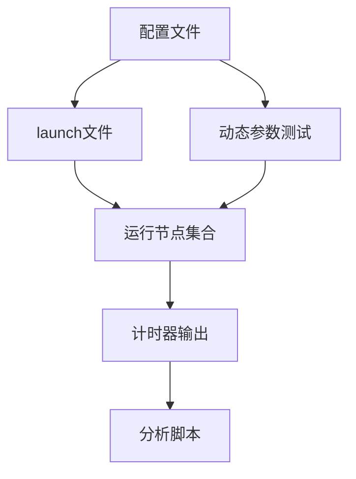

# 参数优化与调优指南

<cite>
**本文引用的文件**
- [lbfgs.h](file://src/SUPER/super_planner/include/utils/optimization/lbfgs.h)
- [scope_timer.hpp（super_planner）](file://src/SUPER/super_planner/include/utils/header/scope_timer.hpp)
- [scope_timer.hpp（mission_planner）](file://src/SUPER/mission_planner/include/utils/scope_timer.hpp)
- [scope_timer.hpp（rog_map）](file://src/SUPER/rog_map/include/super_utils/scope_timer.hpp)
- [scope_timer.hpp（marsim_render）](file://src/SUPER/mars_uav_sim/marsim_render/include/marsim_render/scope_timer.hpp)
- [yaml_loader.hpp（super_planner）](file://src/SUPER/super_planner/include/utils/header/yaml_loader.hpp)
- [yaml_loader.hpp（mission_planner）](file://src/SUPER/mission_planner/include/utils/yaml_loader.hpp)
- [yaml_loader.hpp（rog_map）](file://src/SUPER/rog_map/include/super_utils/yaml_loader.hpp)
- [yaml_loader.hpp（marsim_render）](file://src/SUPER/mars_uav_sim/marsim_render/include/marsim_render/yaml_loader.hpp)
- [click.yaml](file://src/SUPER/super_planner/config/click.yaml)
- [click_real_ros2.yaml](file://src/SUPER/super_planner/config/click_real_ros2.yaml)
- [click_smooth_ros2.yaml](file://src/SUPER/super_planner/config/click_smooth_ros2.yaml)
- [static_dense.yaml](file://src/SUPER/super_planner/config/static_dense.yaml)
- [static_high_speed.yaml](file://src/SUPER/super_planner/config/static_high_speed.yaml)
- [benchmark_dense.launch.py](file://src/SUPER/mission_planner/launch/benchmark_dense.launch.py)
- [banchmark_high_speed.launch.py](file://src/SUPER/mission_planner/launch/banchmark_high_speed.launch.py)
- [click_demo.launch.py](file://src/SUPER/mission_planner/launch/click_demo.launch.py)
- [test_dynamic_params.cpp](file://src/SUPER/super_planner/test/test_dynamic_params.cpp)
- [main.py](file://src/SUPER/super_planner/scripts/main.py)
- [plot_time_consuming.py](file://src/SUPER/super_planner/scripts/plot_time_consuming.py)
- [benchmark.txt](file://src/SUPER/mission_planner/data/benchmark.txt)
- [benchmark_dense.txt](file://src/SUPER/mission_planner/data/benchmark_dense.txt)
</cite>

## 目录
1. [简介](#简介)
2. [项目结构](#项目结构)
3. [核心组件](#核心组件)
4. [架构总览](#架构总览)
5. [详细组件分析](#详细组件分析)
6. [依赖分析](#依赖分析)
7. [性能考量](#性能考量)
8. [故障排查指南](#故障排查指南)
9. [结论](#结论)
10. [附录](#附录)

## 简介
本指南面向在ROS2环境下进行参数优化与调优的工程师与研究者，结合仓库中的配置文件、运行脚本与测试节点，系统性地给出参数调优的方法论与实操步骤。内容覆盖单变量调优、多变量优化、性能基准测试、稳定性与鲁棒性评估、实验记录与追踪、团队协作与知识管理策略，以及常见陷阱与规避方法。

## 项目结构
该仓库围绕“任务规划-仿真-可视化-参数动态更新-性能分析”形成闭环。关键模块包括：
- 配置层：多套静态配置文件，覆盖不同场景（如高/密部署、真实/仿真）与不同参数组合
- 运行层：launch文件组织仿真、任务规划与可视化节点
- 工具层：计时器、YAML加载器、动态参数测试节点、轨迹分析脚本
- 数据层：基准数据集与轨迹输出，支撑离线分析

图表来源
- [benchmark_dense.launch.py](file://src/SUPER/mission_planner/launch/benchmark_dense.launch.py#L1-L100)
- [banchmark_high_speed.launch.py](file://src/SUPER/mission_planner/launch/banchmark_high_speed.launch.py#L1-L100)
- [click_demo.launch.py](file://src/SUPER/mission_planner/launch/click_demo.launch.py#L1-L97)
- [scope_timer.hpp（super_planner）](file://src/SUPER/super_planner/include/utils/header/scope_timer.hpp#L46-L114)
- [scope_timer.hpp（mission_planner）](file://src/SUPER/mission_planner/include/utils/scope_timer.hpp#L46-L114)
- [scope_timer.hpp（rog_map）](file://src/SUPER/rog_map/include/super_utils/scope_timer.hpp#L46-L114)
- [scope_timer.hpp（marsim_render）](file://src/SUPER/mars_uav_sim/marsim_render/include/marsim_render/scope_timer.hpp#L46-L119)
- [yaml_loader.hpp（super_planner）](file://src/SUPER/super_planner/include/utils/header/yaml_loader.hpp#L130-L176)
- [yaml_loader.hpp（mission_planner）](file://src/SUPER/mission_planner/include/utils/yaml_loader.hpp#L44-L153)
- [test_dynamic_params.cpp](file://src/SUPER/super_planner/test/test_dynamic_params.cpp#L1-L118)
- [main.py](file://src/SUPER/super_planner/scripts/main.py#L1-L74)
- [plot_time_consuming.py](file://src/SUPER/super_planner/scripts/plot_time_consuming.py#L1-L60)
- [benchmark.txt](file://src/SUPER/mission_planner/data/benchmark.txt#L1-L2)
- [benchmark_dense.txt](file://src/SUPER/mission_planner/data/benchmark_dense.txt#L1-L2)

章节来源
- [benchmark_dense.launch.py](file://src/SUPER/mission_planner/launch/benchmark_dense.launch.py#L1-L100)
- [banchmark_high_speed.launch.py](file://src/SUPER/mission_planner/launch/banchmark_high_speed.launch.py#L1-L100)
- [click_demo.launch.py](file://src/SUPER/mission_planner/launch/click_demo.launch.py#L1-L97)

## 核心组件
- 参数配置与加载
  - YAML配置文件集中定义规划器、轨迹优化、地图与A*等模块的关键参数
  - YAML加载器支持层级路径读取，便于按模块访问参数
- 动态参数更新
  - 提供动态参数测试节点，演示通过参数服务设置/获取参数，验证运行时可调性
- 性能计时与分析
  - 多处计时器封装，统一输出微秒/毫秒/秒量级耗时统计
  - Python脚本读取轨迹数据并绘制速度/加速度/加加速度曲线，辅助分析轨迹平滑性与边界约束满足度
- 基准测试与场景切换
  - launch文件将仿真、任务规划与可视化节点组合，配合不同配置实现高/密部署等场景的快速切换
  - 基准数据集提供固定航路点，便于重复性测试

章节来源
- [yaml_loader.hpp（super_planner）](file://src/SUPER/super_planner/include/utils/header/yaml_loader.hpp#L130-L176)
- [yaml_loader.hpp（mission_planner）](file://src/SUPER/mission_planner/include/utils/yaml_loader.hpp#L44-L153)
- [test_dynamic_params.cpp](file://src/SUPER/super_planner/test/test_dynamic_params.cpp#L1-L118)
- [scope_timer.hpp（super_planner）](file://src/SUPER/super_planner/include/utils/header/scope_timer.hpp#L46-L114)
- [main.py](file://src/SUPER/super_planner/scripts/main.py#L1-L74)
- [benchmark_dense.launch.py](file://src/SUPER/mission_planner/launch/benchmark_dense.launch.py#L1-L100)

## 架构总览
参数优化贯穿“配置-运行-观测-反馈”闭环。下图展示从配置文件到运行节点、再到性能分析与动态参数更新的整体交互。

图表来源
- [click.yaml](file://src/SUPER/super_planner/config/click.yaml#L1-L190)
- [static_dense.yaml](file://src/SUPER/super_planner/config/static_dense.yaml#L1-L186)
- [static_high_speed.yaml](file://src/SUPER/super_planner/config/static_high_speed.yaml#L1-L187)
- [benchmark_dense.launch.py](file://src/SUPER/mission_planner/launch/benchmark_dense.launch.py#L1-L100)
- [scope_timer.hpp（super_planner）](file://src/SUPER/super_planner/include/utils/header/scope_timer.hpp#L46-L114)
- [test_dynamic_params.cpp](file://src/SUPER/super_planner/test/test_dynamic_params.cpp#L1-L118)
- [main.py](file://src/SUPER/super_planner/scripts/main.py#L1-L74)
- [plot_time_consuming.py](file://src/SUPER/super_planner/scripts/plot_time_consuming.py#L1-L60)

## 详细组件分析

### 参数配置与加载
- YAML配置文件
  - 包含规划器、轨迹优化、地图与A*等模块参数，支持不同场景（如高/密部署、真实/仿真）
  - 关键参数类别：边界约束（速度/加速度/加加速度/角速度）、轨迹优化惩罚项、地图分辨率/膨胀/更新范围、启发式函数类型等
- YAML加载器
  - 支持“/”分隔的层级路径读取，便于按模块访问参数，减少耦合
  - 提供默认值与必填校验能力，提升健壮性

图表来源
- [yaml_loader.hpp（super_planner）](file://src/SUPER/super_planner/include/utils/header/yaml_loader.hpp#L130-L176)
- [yaml_loader.hpp（mission_planner）](file://src/SUPER/mission_planner/include/utils/yaml_loader.hpp#L44-L153)

章节来源
- [click.yaml](file://src/SUPER/super_planner/config/click.yaml#L1-L190)
- [click_real_ros2.yaml](file://src/SUPER/super_planner/config/click_real_ros2.yaml#L1-L187)
- [click_smooth_ros2.yaml](file://src/SUPER/super_planner/config/click_smooth_ros2.yaml#L1-L192)
- [static_dense.yaml](file://src/SUPER/super_planner/config/static_dense.yaml#L1-L186)
- [static_high_speed.yaml](file://src/SUPER/super_planner/config/static_high_speed.yaml#L1-L187)
- [yaml_loader.hpp（super_planner）](file://src/SUPER/super_planner/include/utils/header/yaml_loader.hpp#L130-L176)
- [yaml_loader.hpp（mission_planner）](file://src/SUPER/mission_planner/include/utils/yaml_loader.hpp#L44-L153)

### 动态参数更新
- 目标：在不重启节点的情况下调整轨迹优化边界与惩罚项，验证实时性与稳定性
- 方法：通过参数客户端周期性设置参数，随后查询确认生效
- 关注点：参数命名空间一致性、参数类型匹配、服务可用性等待

图表来源
- [test_dynamic_params.cpp](file://src/SUPER/super_planner/test/test_dynamic_params.cpp#L1-L118)

章节来源
- [test_dynamic_params.cpp](file://src/SUPER/super_planner/test/test_dynamic_params.cpp#L1-L118)

### 性能计时与分析
- 计时器
  - 统一采用高精度时钟，自动换算为ns/ms/s量级并输出
  - 支持启用/禁用与重复次数控制，便于批量对比
- 轨迹分析
  - Python脚本读取轨迹数据，绘制XY轨迹、速度/加速度/加加速度曲线，标注分段点
  - 结合耗时曲线分析，定位瓶颈阶段

图表来源
- [scope_timer.hpp（super_planner）](file://src/SUPER/super_planner/include/utils/header/scope_timer.hpp#L46-L114)
- [scope_timer.hpp（mission_planner）](file://src/SUPER/mission_planner/include/utils/scope_timer.hpp#L46-L114)
- [scope_timer.hpp（rog_map）](file://src/SUPER/rog_map/include/super_utils/scope_timer.hpp#L46-L114)
- [scope_timer.hpp（marsim_render）](file://src/SUPER/mars_uav_sim/marsim_render/include/marsim_render/scope_timer.hpp#L46-L119)
- [plot_time_consuming.py](file://src/SUPER/super_planner/scripts/plot_time_consuming.py#L1-L60)
- [main.py](file://src/SUPER/super_planner/scripts/main.py#L1-L74)

章节来源
- [scope_timer.hpp（super_planner）](file://src/SUPER/super_planner/include/utils/header/scope_timer.hpp#L46-L114)
- [scope_timer.hpp（mission_planner）](file://src/SUPER/mission_planner/include/utils/scope_timer.hpp#L46-L114)
- [scope_timer.hpp（rog_map）](file://src/SUPER/rog_map/include/super_utils/scope_timer.hpp#L46-L114)
- [scope_timer.hpp（marsim_render）](file://src/SUPER/mars_uav_sim/marsim_render/include/marsim_render/scope_timer.hpp#L46-L119)
- [plot_time_consuming.py](file://src/SUPER/super_planner/scripts/plot_time_consuming.py#L1-L60)
- [main.py](file://src/SUPER/super_planner/scripts/main.py#L1-L74)

### 基准测试与场景切换
- launch文件
  - 将RViz、任务规划、仿真节点与SUPER规划器节点组合，通过参数名切换不同配置
  - 支持高/密部署、点击演示等多种场景
- 基准数据
  - 提供固定航路点文本，便于重复性测试与对比

图表来源
- [benchmark_dense.launch.py](file://src/SUPER/mission_planner/launch/benchmark_dense.launch.py#L1-L100)
- [banchmark_high_speed.launch.py](file://src/SUPER/mission_planner/launch/banchmark_high_speed.launch.py#L1-L100)
- [click_demo.launch.py](file://src/SUPER/mission_planner/launch/click_demo.launch.py#L1-L97)
- [benchmark.txt](file://src/SUPER/mission_planner/data/benchmark.txt#L1-L2)
- [benchmark_dense.txt](file://src/SUPER/mission_planner/data/benchmark_dense.txt#L1-L2)

章节来源
- [benchmark_dense.launch.py](file://src/SUPER/mission_planner/launch/benchmark_dense.launch.py#L1-L100)
- [banchmark_high_speed.launch.py](file://src/SUPER/mission_planner/launch/banchmark_high_speed.launch.py#L1-L100)
- [click_demo.launch.py](file://src/SUPER/mission_planner/launch/click_demo.launch.py#L1-L97)
- [benchmark.txt](file://src/SUPER/mission_planner/data/benchmark.txt#L1-L2)
- [benchmark_dense.txt](file://src/SUPER/mission_planner/data/benchmark_dense.txt#L1-L2)

## 依赖分析
- 配置文件与运行节点
  - 不同场景配置文件与launch文件一一对应，确保参数加载与运行环境一致
- 计时器与分析脚本
  - 多模块计时器输出统一格式，便于Python脚本聚合分析
- 动态参数测试
  - 依赖参数服务接口，需保证目标节点参数命名空间与类型一致

图表来源
- [click.yaml](file://src/SUPER/super_planner/config/click.yaml#L1-L190)
- [static_dense.yaml](file://src/SUPER/super_planner/config/static_dense.yaml#L1-L186)
- [static_high_speed.yaml](file://src/SUPER/super_planner/config/static_high_speed.yaml#L1-L187)
- [benchmark_dense.launch.py](file://src/SUPER/mission_planner/launch/benchmark_dense.launch.py#L1-L100)
- [scope_timer.hpp（super_planner）](file://src/SUPER/super_planner/include/utils/header/scope_timer.hpp#L46-L114)
- [test_dynamic_params.cpp](file://src/SUPER/super_planner/test/test_dynamic_params.cpp#L1-L118)

章节来源
- [benchmark_dense.launch.py](file://src/SUPER/mission_planner/launch/benchmark_dense.launch.py#L1-L100)
- [scope_timer.hpp（super_planner）](file://src/SUPER/super_planner/include/utils/header/scope_timer.hpp#L46-L114)
- [test_dynamic_params.cpp](file://src/SUPER/super_planner/test/test_dynamic_params.cpp#L1-L118)

## 性能考量
- 参数对性能的影响机制
  - 边界约束（速度/加速度/加加速度/角速度）直接影响轨迹优化收敛性与实时性；过高可能导致求解困难或超时
  - 轨迹优化惩罚项（如penna_vel/penna_acc等）影响轨迹平滑性与边界满足度；过大可能抑制探索、过小导致数值不稳定
  - 地图分辨率/膨胀/更新范围影响感知与路径搜索效率；过细/过大均会增加内存与计算压力
  - 启发式函数类型（如欧几里得距离）在路径质量与计算开销间权衡
- 相互作用关系
  - 仿真与规划器参数需协同：仿真延迟/噪声会影响规划器输入，进而影响轨迹质量与实时性
  - 可视化开关与频率影响CPU/GPU负载，应与性能目标匹配
- 实时性保障
  - 使用计时器定位瓶颈阶段，优先优化最慢环节
  - 在高/密场景下适当放宽边界或降低可视化频率，确保稳定运行

[本节为通用指导，无需列出具体文件来源]

## 故障排查指南
- 参数服务不可用
  - 现象：动态参数测试节点长时间等待服务
  - 排查：确认目标节点已启动且参数服务可用；检查参数命名空间与类型
- 参数设置失败
  - 现象：返回reason提示失败
  - 排查：核对参数类型与范围；确认节点支持动态参数更新
- 轨迹越界或抖动
  - 现象：速度/加速度/加加速度超过设定上限
  - 排查：降低边界约束或调整惩罚项；检查仿真输入与传感器噪声
- 性能骤降
  - 现象：整体耗时显著上升
  - 排查：关闭不必要的可视化；检查地图更新频率与分辨率；定位计时器热点

章节来源
- [test_dynamic_params.cpp](file://src/SUPER/super_planner/test/test_dynamic_params.cpp#L1-L118)
- [scope_timer.hpp（super_planner）](file://src/SUPER/super_planner/include/utils/header/scope_timer.hpp#L46-L114)

## 结论
通过配置文件的模块化设计、launch文件的场景化编排、计时器的统一观测与Python脚本的可视化分析，本仓库形成了可重复、可观测、可迭代的参数优化闭环。建议在实际工程中遵循“单变量调优—多变量优化—稳定性评估—记录追踪”的流程，持续迭代参数组合，以达成性能与安全的平衡。

[本节为总结，无需列出具体文件来源]

## 附录

### 参数调优工作流程（实操步骤）
- 问题识别
  - 明确性能指标（实时性/轨迹质量/能耗/稳定性）
  - 使用计时器定位瓶颈阶段，收集轨迹与耗时数据
- 假设制定
  - 基于影响机制提出参数调整假设（如提高max_vel、增大smooth_eps）
- 实验设计
  - 设计单变量/多变量组合实验，准备不同场景配置文件与launch文件
- 数据采集与分析
  - 运行实验，记录轨迹与耗时；使用Python脚本绘制曲线并对比
- 效果验证
  - 在不同场景（高/密/真实）下验证参数稳健性
- 记录与追踪
  - 记录参数组合、指标结果、问题与改进点，沉淀知识库

[本节为流程说明，无需列出具体文件来源]

### 参数稳定性与鲁棒性测试
- 场景覆盖
  - 高/密部署、不同航路点、不同初始条件
- 持续监控
  - 使用计时器与轨迹分析脚本持续观测关键指标
- 回归测试
  - 将历史最优参数组合纳入回归清单，定期回归验证

[本节为通用指导，无需列出具体文件来源]

### 团队协作与知识管理策略
- 版本化配置
  - 将配置文件纳入版本控制，每次变更附带说明
- 文档化实验
  - 记录实验目的、参数组合、结果与结论
- 共享脚本
  - 统一分发计时器与分析脚本，确保口径一致

[本节为通用指导，无需列出具体文件来源]

### 常见陷阱与规避
- 忽视参数耦合
  - 调整一个参数可能影响其他模块；应成组评估
- 过度追求极致性能
  - 忽视边界约束与安全性；应在安全前提下优化
- 缺乏对照实验
  - 未保留基线配置；无法准确评估改进效果
- 忽视仿真与真实差异
  - 仿真参数直接映射到真实系统；需进行交叉验证

[本节为通用指导，无需列出具体文件来源]