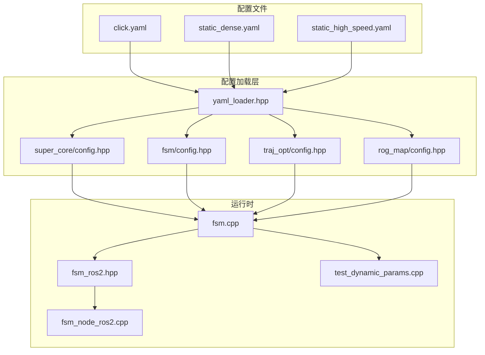
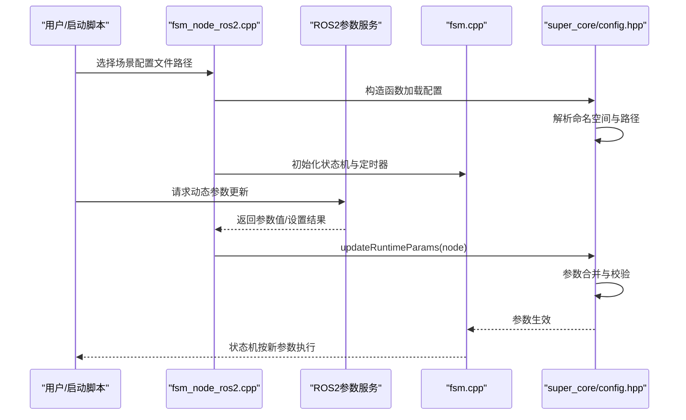
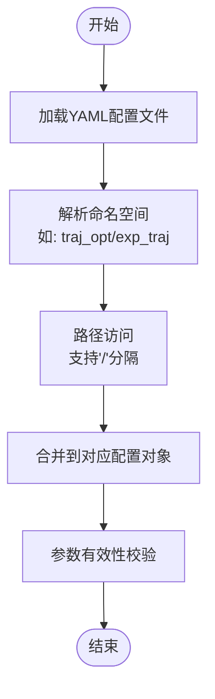
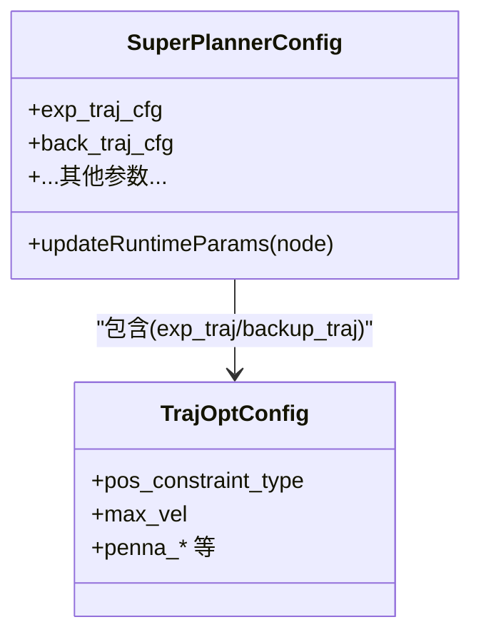
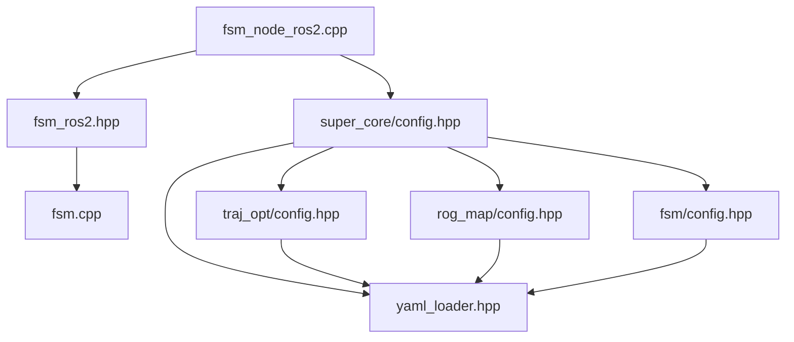

# 场景切换工作流程

<cite>
**本文引用的文件**
- [click.yaml](file://src/SUPER/super_planner/config/click.yaml)
- [static_dense.yaml](file://src/SUPER/super_planner/config/static_dense.yaml)
- [static_high_speed.yaml](file://src/SUPER/super_planner/config/static_high_speed.yaml)
- [config.hpp](file://src/SUPER/super_planner/include/super_core/config.hpp)
- [config.hpp](file://src/SUPER/super_planner/include/fsm/config.hpp)
- [config.hpp](file://src/SUPER/super_planner/include/traj_opt/config.hpp)
- [config.hpp](file://src/SUPER/rog_map/include/rog_map/rog_map_core/config.hpp)
- [yaml_loader.hpp](file://src/SUPER/super_planner/include/utils/header/yaml_loader.hpp)
- [fsm.cpp](file://src/SUPER/super_planner/src/super_core/fsm.cpp)
- [fsm_ros2.hpp](file://src/SUPER/super_planner/include/ros_interface/ros2/fsm_ros2.hpp)
- [fsm_node_ros2.cpp](file://src/SUPER/super_planner/Apps/fsm_node_ros2.cpp)
- [test_dynamic_params.cpp](file://src/SUPER/super_planner/test/test_dynamic_params.cpp)
</cite>

## 目录
1. [简介](#简介)
2. [项目结构](#项目结构)
3. [核心组件](#核心组件)
4. [架构总览](#架构总览)
5. [详细组件分析](#详细组件分析)
6. [依赖关系分析](#依赖关系分析)
7. [性能考量](#性能考量)
8. [故障排查指南](#故障排查指南)
9. [结论](#结论)
10. [附录](#附录)

## 简介
本指南围绕 SUPER 规划器的“场景切换”工作流程展开，重点解释不同场景配置（如点击模式、密集环境、高速场景）之间的切换机制与流程，涵盖以下内容：
- 配置文件的加载方式与命名空间解析
- 参数的继承与覆盖规则
- 场景切换的时机选择与自动化策略
- 参数优先级与冲突解决机制
- 完整的操作步骤与注意事项
- 运行时参数动态调整的方法与限制
- 测试验证与回归测试策略
- 错误处理与恢复机制

## 项目结构
与场景切换直接相关的配置与代码主要集中在 SUPER 规划器模块中，涉及配置加载、参数继承、状态机执行与动态参数更新等。

图表来源
- [click.yaml](file://src/SUPER/super_planner/config/click.yaml#L1-L190)
- [static_dense.yaml](file://src/SUPER/super_planner/config/static_dense.yaml#L1-L186)
- [static_high_speed.yaml](file://src/SUPER/super_planner/config/static_high_speed.yaml#L1-L187)
- [yaml_loader.hpp](file://src/SUPER/super_planner/include/utils/header/yaml_loader.hpp#L125-L176)
- [config.hpp](file://src/SUPER/super_planner/include/super_core/config.hpp#L96-L151)
- [config.hpp](file://src/SUPER/super_planner/include/fsm/config.hpp#L55-L72)
- [config.hpp](file://src/SUPER/super_planner/include/traj_opt/config.hpp#L110-L179)
- [config.hpp](file://src/SUPER/rog_map/include/rog_map/rog_map_core/config.hpp#L68-L288)
- [fsm.cpp](file://src/SUPER/super_planner/src/super_core/fsm.cpp#L115-L171)
- [fsm_ros2.hpp](file://src/SUPER/super_planner/include/ros_interface/ros2/fsm_ros2.hpp#L305-L331)
- [fsm_node_ros2.cpp](file://src/SUPER/super_planner/Apps/fsm_node_ros2.cpp#L48-L50)
- [test_dynamic_params.cpp](file://src/SUPER/super_planner/test/test_dynamic_params.cpp#L10-L118)

章节来源
- [click.yaml](file://src/SUPER/super_planner/config/click.yaml#L1-L190)
- [static_dense.yaml](file://src/SUPER/super_planner/config/static_dense.yaml#L1-L186)
- [static_high_speed.yaml](file://src/SUPER/super_planner/config/static_high_speed.yaml#L1-L187)
- [yaml_loader.hpp](file://src/SUPER/super_planner/include/utils/header/yaml_loader.hpp#L125-L176)
- [config.hpp](file://src/SUPER/super_planner/include/super_core/config.hpp#L96-L151)
- [config.hpp](file://src/SUPER/super_planner/include/fsm/config.hpp#L55-L72)
- [config.hpp](file://src/SUPER/super_planner/include/traj_opt/config.hpp#L110-L179)
- [config.hpp](file://src/SUPER/rog_map/include/rog_map/rog_map_core/config.hpp#L68-L288)
- [fsm.cpp](file://src/SUPER/super_planner/src/super_core/fsm.cpp#L115-L171)
- [fsm_ros2.hpp](file://src/SUPER/super_planner/include/ros_interface/ros2/fsm_ros2.hpp#L305-L331)
- [fsm_node_ros2.cpp](file://src/SUPER/super_planner/Apps/fsm_node_ros2.cpp#L48-L50)
- [test_dynamic_params.cpp](file://src/SUPER/super_planner/test/test_dynamic_params.cpp#L10-L118)

## 核心组件
- 配置加载器：负责从 YAML 文件加载参数，并支持“/”分隔的路径访问与命名空间解析。
- 规划器配置：封装轨迹优化、A*、ROG 地图等模块参数，支持运行时参数更新。
- 状态机与接口：负责状态流转、定时器驱动与 ROS2 接口绑定。
- 动态参数测试：演示运行时参数设置与获取的流程。

章节来源
- [yaml_loader.hpp](file://src/SUPER/super_planner/include/utils/header/yaml_loader.hpp#L125-L176)
- [config.hpp](file://src/SUPER/super_planner/include/super_core/config.hpp#L96-L151)
- [fsm.cpp](file://src/SUPER/super_planner/src/super_core/fsm.cpp#L115-L171)
- [fsm_ros2.hpp](file://src/SUPER/super_planner/include/ros_interface/ros2/fsm_ros2.hpp#L305-L331)
- [test_dynamic_params.cpp](file://src/SUPER/super_planner/test/test_dynamic_params.cpp#L10-L118)

## 架构总览
场景切换通过“配置文件 + 参数继承/覆盖 + 运行时动态更新”的组合实现。不同场景（点击、密集、高速）对应不同的 YAML 配置文件；规划器在启动时加载对应配置，并在运行时根据需要动态调整参数。

图表来源
- [fsm_node_ros2.cpp](file://src/SUPER/super_planner/Apps/fsm_node_ros2.cpp#L48-L50)
- [config.hpp](file://src/SUPER/super_planner/include/super_core/config.hpp#L158-L228)
- [fsm.cpp](file://src/SUPER/super_planner/src/super_core/fsm.cpp#L115-L171)
- [test_dynamic_params.cpp](file://src/SUPER/super_planner/test/test_dynamic_params.cpp#L10-L118)

## 详细组件分析

### 配置文件与加载机制
- 不同场景的配置文件分别定义了 FSM、超级规划器、轨迹优化、A*、ROG 地图等模块的关键参数。
- 加载器支持“/”分隔的路径访问，可从嵌套结构中读取指定参数。
- 命名空间解析：轨迹优化配置支持 exp_traj 与 backup_traj 两个命名空间，分别加载探索轨迹与备份轨迹参数。

图表来源
- [yaml_loader.hpp](file://src/SUPER/super_planner/include/utils/header/yaml_loader.hpp#L125-L176)
- [config.hpp](file://src/SUPER/super_planner/include/traj_opt/config.hpp#L110-L179)

章节来源
- [click.yaml](file://src/SUPER/super_planner/config/click.yaml#L1-L190)
- [static_dense.yaml](file://src/SUPER/super_planner/config/static_dense.yaml#L1-L186)
- [static_high_speed.yaml](file://src/SUPER/super_planner/config/static_high_speed.yaml#L1-L187)
- [yaml_loader.hpp](file://src/SUPER/super_planner/include/utils/header/yaml_loader.hpp#L125-L176)
- [config.hpp](file://src/SUPER/super_planner/include/traj_opt/config.hpp#L110-L179)

### 参数继承与覆盖规则
- 继承：规划器配置在构造时先加载 exp_traj 与 backup_traj 的命名空间配置，再加载其他通用参数。
- 覆盖：运行时通过 updateRuntimeParams 从 ROS2 参数服务获取最新值，若未提供则保留原值。
- 冲突解决：当同一参数在多个命名空间出现时，以显式命名空间下的值为准；若未显式提供，则回退到默认值或已有值。

图表来源
- [config.hpp](file://src/SUPER/super_planner/include/super_core/config.hpp#L96-L151)
- [config.hpp](file://src/SUPER/super_planner/include/traj_opt/config.hpp#L110-L179)

章节来源
- [config.hpp](file://src/SUPER/super_planner/include/super_core/config.hpp#L96-L151)
- [config.hpp](file://src/SUPER/super_planner/include/traj_opt/config.hpp#L110-L179)

### 场景切换的时机与自动化策略
- 启动阶段：通过传入不同的配置文件路径实现场景切换；启动后状态机进入 WAIT_GOAL 或后续状态。
- 运行时：通过 ROS2 参数服务动态更新关键参数，无需重启即可生效。
- 自动化策略建议：
  - 使用 launch 文件或启动脚本选择场景配置文件。
  - 在复杂任务中结合定时器与状态机事件，自动在不同场景间切换。
  - 对高风险场景（如高速）增加参数变更的前置校验与回滚策略。

章节来源
- [fsm_node_ros2.cpp](file://src/SUPER/super_planner/Apps/fsm_node_ros2.cpp#L48-L50)
- [fsm.cpp](file://src/SUPER/super_planner/src/super_core/fsm.cpp#L115-L171)
- [fsm_ros2.hpp](file://src/SUPER/super_planner/include/ros_interface/ros2/fsm_ros2.hpp#L305-L331)

### 参数优先级与冲突解决机制
- 文件优先级：配置文件加载顺序决定初始值；命名空间下的显式值优先于默认值。
- 运行时优先级：ROS2 参数服务提供的值优先于配置文件中的默认值。
- 冲突处理：
  - 数值型参数：若超出有效范围，加载器会给出提示或抛出异常。
  - 结构型参数：如数组大小不匹配，会抛出异常并终止初始化。
  - 命名空间冲突：显式命名空间下的键值覆盖默认键值。

章节来源
- [config.hpp](file://src/SUPER/rog_map/include/rog_map/rog_map_core/config.hpp#L169-L223)
- [config.hpp](file://src/SUPER/super_planner/include/super_core/config.hpp#L158-L228)

### 完整操作步骤与注意事项
- 选择场景：
  - 准备对应的 YAML 配置文件（点击/密集/高速）。
  - 在启动脚本中传入配置文件路径。
- 验证加载：
  - 检查关键参数是否正确加载（可通过日志或可视化确认）。
- 运行时调整：
  - 使用参数客户端向规划器节点发送参数更新请求。
  - 注意参数变更的生效时间与稳定性。
- 注意事项：
  - 高速场景需谨慎提高速度/加速度上限，确保物理约束满足。
  - 密集场景需关注感知范围与地图分辨率的匹配。
  - 动态参数更新应避免频繁高频变更，以免影响状态机稳定性。

章节来源
- [test_dynamic_params.cpp](file://src/SUPER/super_planner/test/test_dynamic_params.cpp#L10-L118)
- [config.hpp](file://src/SUPER/super_planner/include/super_core/config.hpp#L158-L228)

### 运行时参数动态调整的方法与限制
- 方法：
  - 使用异步参数客户端向目标节点（如 fsm_node）发起参数设置/获取请求。
  - 在节点内部通过 updateRuntimeParams 合并参数并触发内部更新。
- 限制：
  - 参数类型必须与预期一致，否则设置失败。
  - 部分参数（如数组大小、维度）在加载阶段即进行严格校验，运行时无法修改其结构。
  - 高频参数变更可能导致状态机抖动，应设置合理的更新节流策略。

章节来源
- [test_dynamic_params.cpp](file://src/SUPER/super_planner/test/test_dynamic_params.cpp#L10-L118)
- [config.hpp](file://src/SUPER/super_planner/include/super_core/config.hpp#L158-L228)

### 测试验证与回归测试策略
- 单元测试：
  - 验证不同场景配置文件的加载与参数解析。
  - 验证命名空间下的参数覆盖行为。
- 集成测试：
  - 启动不同场景，验证状态机在各场景下的行为差异。
  - 验证动态参数更新后，状态机与轨迹优化模块的响应。
- 回归测试：
  - 对比历史版本的参数与行为，确保场景切换无破坏性变更。
  - 对关键参数（如最大速度、加速度、规划时域）进行边界测试。

章节来源
- [test_dynamic_params.cpp](file://src/SUPER/super_planner/test/test_dynamic_params.cpp#L10-L118)

### 错误处理与恢复机制
- 配置加载错误：
  - 参数越界或结构不合法时，抛出异常并终止初始化。
  - 建议在启动前进行配置预检。
- 运行时参数错误：
  - 参数设置失败时，记录原因并回滚至上次成功值。
  - 提供参数回退策略，确保系统在异常情况下仍可稳定运行。

章节来源
- [config.hpp](file://src/SUPER/rog_map/include/rog_map/rog_map_core/config.hpp#L169-L223)
- [test_dynamic_params.cpp](file://src/SUPER/super_planner/test/test_dynamic_params.cpp#L70-L80)

## 依赖关系分析
场景切换涉及的模块与文件之间存在如下依赖关系：

图表来源
- [fsm_node_ros2.cpp](file://src/SUPER/super_planner/Apps/fsm_node_ros2.cpp#L48-L50)
- [fsm_ros2.hpp](file://src/SUPER/super_planner/include/ros_interface/ros2/fsm_ros2.hpp#L305-L331)
- [fsm.cpp](file://src/SUPER/super_planner/src/super_core/fsm.cpp#L115-L171)
- [config.hpp](file://src/SUPER/super_planner/include/super_core/config.hpp#L96-L151)
- [config.hpp](file://src/SUPER/super_planner/include/traj_opt/config.hpp#L110-L179)
- [config.hpp](file://src/SUPER/rog_map/include/rog_map/rog_map_core/config.hpp#L68-L288)
- [config.hpp](file://src/SUPER/super_planner/include/fsm/config.hpp#L55-L72)
- [yaml_loader.hpp](file://src/SUPER/super_planner/include/utils/header/yaml_loader.hpp#L125-L176)

章节来源
- [fsm_node_ros2.cpp](file://src/SUPER/super_planner/Apps/fsm_node_ros2.cpp#L48-L50)
- [fsm_ros2.hpp](file://src/SUPER/super_planner/include/ros_interface/ros2/fsm_ros2.hpp#L305-L331)
- [fsm.cpp](file://src/SUPER/super_planner/src/super_core/fsm.cpp#L115-L171)
- [config.hpp](file://src/SUPER/super_planner/include/super_core/config.hpp#L96-L151)
- [config.hpp](file://src/SUPER/super_planner/include/traj_opt/config.hpp#L110-L179)
- [config.hpp](file://src/SUPER/rog_map/include/rog_map/rog_map_core/config.hpp#L68-L288)
- [config.hpp](file://src/SUPER/super_planner/include/fsm/config.hpp#L55-L72)
- [yaml_loader.hpp](file://src/SUPER/super_planner/include/utils/header/yaml_loader.hpp#L125-L176)

## 性能考量
- 场景选择权衡：
  - 高速场景：提升速度/加速度上限可缩短轨迹时间，但会增加优化难度与计算负载。
  - 密集场景：提高地图分辨率与感知范围可提升安全性，但会显著增加内存与CPU消耗。
- 动态参数影响：
  - 频繁更新边界约束参数可能引发轨迹重规划，导致 CPU 占用波动。
  - 建议对高频参数变更进行节流与批量更新，减少状态机抖动。
- 可视化与日志：
  - 在复杂场景下关闭不必要的可视化与日志输出，降低 I/O 与渲染开销。

## 故障排查指南
- 配置加载失败：
  - 检查 YAML 文件语法与键名拼写。
  - 确认命名空间与路径格式正确。
- 参数设置失败：
  - 确认参数类型与范围符合要求。
  - 查看参数客户端返回的原因描述。
- 行为异常：
  - 比较不同场景配置的关键参数差异，定位异常来源。
  - 使用测试脚本验证动态参数更新流程。

章节来源
- [test_dynamic_params.cpp](file://src/SUPER/super_planner/test/test_dynamic_params.cpp#L70-L80)
- [config.hpp](file://src/SUPER/super_planner/include/super_core/config.hpp#L158-L228)

## 结论
场景切换通过“配置文件 + 命名空间解析 + 运行时参数更新”实现灵活可控的参数管理。合理设计场景配置、明确参数优先级与冲突处理策略，并配合完善的测试与故障排查流程，可在保证系统稳定性的同时提升适应复杂任务的能力。

## 附录
- 场景配置文件示例路径：
  - [click.yaml](file://src/SUPER/super_planner/config/click.yaml#L1-L190)
  - [static_dense.yaml](file://src/SUPER/super_planner/config/static_dense.yaml#L1-L186)
  - [static_high_speed.yaml](file://src/SUPER/super_planner/config/static_high_speed.yaml#L1-L187)
- 关键实现参考：
  - [yaml_loader.hpp](file://src/SUPER/super_planner/include/utils/header/yaml_loader.hpp#L125-L176)
  - [super_core/config.hpp](file://src/SUPER/super_planner/include/super_core/config.hpp#L96-L151)
  - [fsm/config.hpp](file://src/SUPER/super_planner/include/fsm/config.hpp#L55-L72)
  - [traj_opt/config.hpp](file://src/SUPER/super_planner/include/traj_opt/config.hpp#L110-L179)
  - [rog_map/config.hpp](file://src/SUPER/rog_map/include/rog_map/rog_map_core/config.hpp#L68-L288)
  - [fsm.cpp](file://src/SUPER/super_planner/src/super_core/fsm.cpp#L115-L171)
  - [fsm_ros2.hpp](file://src/SUPER/super_planner/include/ros_interface/ros2/fsm_ros2.hpp#L305-L331)
  - [fsm_node_ros2.cpp](file://src/SUPER/super_planner/Apps/fsm_node_ros2.cpp#L48-L50)
  - [test_dynamic_params.cpp](file://src/SUPER/super_planner/test/test_dynamic_params.cpp#L10-L118)