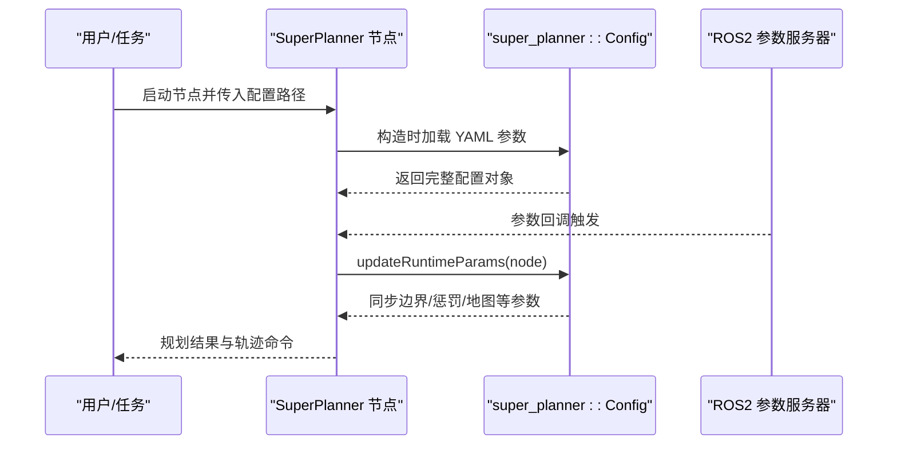
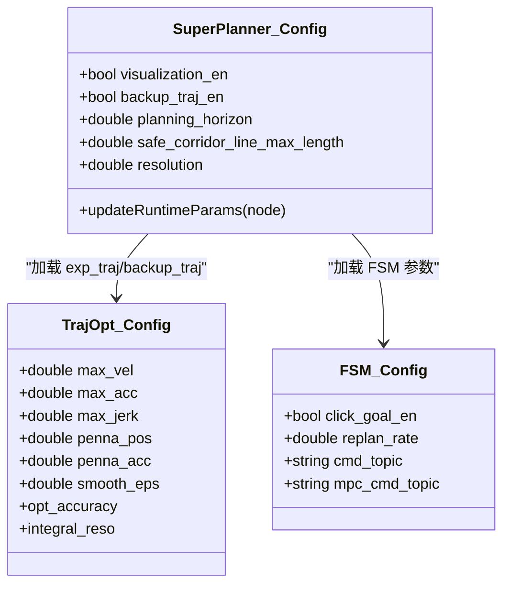
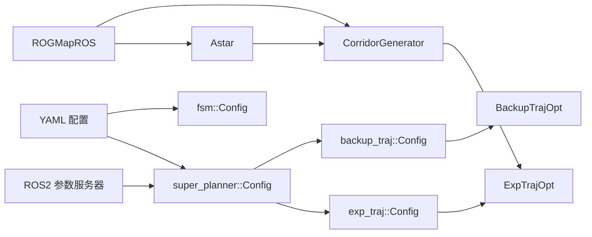

# 场景化配置管理

<cite>
**本文引用的文件**
- [CONFIGURATION_GUIDE.md](file://src/SUPER/super_planner/docs/CONFIGURATION_GUIDE.md)
- [API_REFERENCE.md](file://src/SUPER/super_planner/docs/API_REFERENCE.md)
- [click.yaml](file://src/SUPER/super_planner/config/click.yaml)
- [static_dense.yaml](file://src/SUPER/super_planner/config/static_dense.yaml)
- [static_high_speed.yaml](file://src/SUPER/super_planner/config/static_high_speed.yaml)
- [click_real_ros2.yaml](file://src/SUPER/super_planner/config/click_real_ros2.yaml)
- [click_smooth_ros2.yaml](file://src/SUPER/super_planner/config/click_smooth_ros2.yaml)
- [config.hpp](file://src/SUPER/super_planner/include/super_core/config.hpp)
- [config.hpp](file://src/SUPER/super_planner/include/traj_opt/config.hpp)
- [config.hpp](file://src/SUPER/super_planner/include/fsm/config.hpp)
- [super_planner.h](file://src/SUPER/super_planner/include/super_core/super_planner.h)
- [super_planner.cpp](file://src/SUPER/super_planner/src/super_core/super_planner.cpp)
</cite>

## 目录
1. [简介](#简介)
2. [项目结构](#项目结构)
3. [核心组件](#核心组件)
4. [架构总览](#架构总览)
5. [详细组件分析](#详细组件分析)
6. [依赖关系分析](#依赖关系分析)
7. [性能考量](#性能考量)
8. [故障排除指南](#故障排除指南)
9. [结论](#结论)
10. [附录](#附录)

## 简介
本指南围绕 SUPER 规划器的“场景化配置管理”展开，系统讲解如何基于不同场景（如点击演示、高密度环境、静态高/低速等）选择与优化配置，并给出场景切换流程、继承与覆盖机制、性能影响分析、最佳实践、测试验证与故障排除建议。读者可据此在仿真与实飞环境中快速落地高效、稳定且可调的轨迹规划方案。

## 项目结构
- 配置文件集中于 super_planner/config 下，按场景命名，包含主配置与若干预设场景：
  - 主配置：click.yaml
  - 场景配置：static_dense.yaml、static_high_speed.yaml、click_real_ros2.yaml、click_smooth_ros2.yaml
- 文档位于 docs 目录，提供参数参考、动态参数、常见问题与最佳实践。
- 核心代码通过 Config 类族从 YAML 加载参数，并在运行时支持 ROS2 动态参数热更新。

```mermaid
graph TB
subgraph "配置文件"
A["click.yaml"]
B["static_dense.yaml"]
C["static_high_speed.yaml"]
D["click_real_ros2.yaml"]
E["click_smooth_ros2.yaml"]
end
subgraph "核心类"
CFG["super_planner::Config"]
TRAJCFG["traj_opt::Config"]
FSMSIM["fsm::Config"]
end
subgraph "运行时"
NODE["SuperPlanner 节点"]
ROS["ROS2 参数服务器"]
end
A --> CFG
B --> CFG
C --> CFG
D --> CFG
E --> CFG
CFG --> TRAJCFG
CFG --> FSMSIM
CFG --> NODE
ROS <- --> NODE
```

图表来源
- [click.yaml](file://src/SUPER/super_planner/config/click.yaml#L1-L190)
- [static_dense.yaml](file://src/SUPER/super_planner/config/static_dense.yaml#L1-L186)
- [static_high_speed.yaml](file://src/SUPER/super_planner/config/static_high_speed.yaml#L1-L187)
- [click_real_ros2.yaml](file://src/SUPER/super_planner/config/click_real_ros2.yaml#L1-L187)
- [click_smooth_ros2.yaml](file://src/SUPER/super_planner/config/click_smooth_ros2.yaml#L1-L192)
- [config.hpp](file://src/SUPER/super_planner/include/super_core/config.hpp#L96-L151)
- [config.hpp](file://src/SUPER/super_planner/include/traj_opt/config.hpp#L110-L179)
- [config.hpp](file://src/SUPER/super_planner/include/fsm/config.hpp#L55-L72)

章节来源
- [CONFIGURATION_GUIDE.md](file://src/SUPER/super_planner/docs/CONFIGURATION_GUIDE.md#L9-L17)
- [click.yaml](file://src/SUPER/super_planner/config/click.yaml#L1-L190)
- [static_dense.yaml](file://src/SUPER/super_planner/config/static_dense.yaml#L1-L186)
- [static_high_speed.yaml](file://src/SUPER/super_planner/config/static_high_speed.yaml#L1-L187)
- [click_real_ros2.yaml](file://src/SUPER/super_planner/config/click_real_ros2.yaml#L1-L187)
- [click_smooth_ros2.yaml](file://src/SUPER/super_planner/config/click_smooth_ros2.yaml#L1-L192)

## 核心组件
- 配置加载与继承
  - super_planner::Config：从 YAML 加载 super_planner、astar、rog_map 等模块参数；同时加载两条轨迹优化配置（exp_traj 与 backup_traj），并支持运行时从 ROS2 参数服务器热更新。
  - traj_opt::Config：按命名空间加载 traj_opt.* 子配置（exp_traj 或 backup_traj），支持全局缩放与边界/惩罚权重加载。
  - fsm::Config：加载 FSM 相关参数（如点击目标、话题名、重规划频率等）。
- 运行时动态参数
  - 通过 updateRuntimeParams 从 ROS2 参数服务器同步参数到各子模块，确保热更新生效。
- 场景化参数差异
  - 不同场景 YAML 在轨迹边界、优化精度、走廊参数、地图分辨率等方面存在显著差异，以适配不同任务需求。

章节来源
- [config.hpp](file://src/SUPER/super_planner/include/super_core/config.hpp#L96-L151)
- [config.hpp](file://src/SUPER/super_planner/include/traj_opt/config.hpp#L110-L179)
- [config.hpp](file://src/SUPER/super_planner/include/fsm/config.hpp#L55-L72)
- [CONFIGURATION_GUIDE.md](file://src/SUPER/super_planner/docs/CONFIGURATION_GUIDE.md#L174-L223)

## 架构总览
SUPER 规划器采用“配置驱动 + 动态参数”的双轨机制：启动时从 YAML 加载默认配置，运行时通过 ROS2 参数服务器进行热更新。核心流程包括路径搜索、走廊生成、视场角裁剪、轨迹优化与备份轨迹生成。



图表来源
- [super_planner.cpp](file://src/SUPER/super_planner/src/super_core/super_planner.cpp#L37-L74)
- [config.hpp](file://src/SUPER/super_planner/include/super_core/config.hpp#L158-L228)
- [CONFIGURATION_GUIDE.md](file://src/SUPER/super_planner/docs/CONFIGURATION_GUIDE.md#L213-L222)

章节来源
- [super_planner.cpp](file://src/SUPER/super_planner/src/super_core/super_planner.cpp#L37-L74)
- [super_planner.h](file://src/SUPER/super_planner/include/super_core/super_planner.h#L104-L106)
- [CONFIGURATION_GUIDE.md](file://src/SUPER/super_planner/docs/CONFIGURATION_GUIDE.md#L213-L222)

## 详细组件分析

### 点击演示场景（click 系列）
- 适用条件
  - 交互式点击目标、演示与教学场景，强调易用性与可视化。
- 配置要点
  - 启用点击目标、目标偏航角、可视化与 RViz 输出。
  - 轨迹优化边界适中，惩罚权重平衡平滑与安全性。
- 参数差异
  - 与静态高/低速场景相比，边界与惩罚权重更温和，便于演示。
- 优化策略
  - 保持较高平滑度与较保守的安全边界，提升轨迹可读性。
- 场景文件
  - click.yaml、click_real_ros2.yaml、click_smooth_ros2.yaml

章节来源
- [click.yaml](file://src/SUPER/super_planner/config/click.yaml#L1-L190)
- [click_real_ros2.yaml](file://src/SUPER/super_planner/config/click_real_ros2.yaml#L1-L187)
- [click_smooth_ros2.yaml](file://src/SUPER/super_planner/config/click_smooth_ros2.yaml#L1-L192)

### 高密度环境场景（static_dense.yaml）
- 适用条件
  - 障碍密集、空间受限的静态环境，要求更强的避障能力与更高的优化精度。
- 配置要点
  - 提升轨迹优化精度与积分分辨率，增强位置惩罚权重，收紧走廊边界。
  - 地图分辨率与膨胀步数更精细，保障局部避障质量。
- 参数差异
  - 较高的 opt_accuracy、integral_reso 与 penna_pos/penna_acc 等惩罚权重。
- 优化策略
  - 适度提高 penna_pos 与 penna_acc 抑制碰撞风险；必要时降低 smooth_eps 以减少过度平滑导致的路径僵化。
- 场景文件
  - static_dense.yaml

章节来源
- [static_dense.yaml](file://src/SUPER/super_planner/config/static_dense.yaml#L1-L186)

### 静态高/低速场景（static_high_speed.yaml 与 click.yaml）
- 适用条件
  - 静态环境下的高速/低速导航，分别追求速度与稳定性。
- 配置要点
  - 高速场景：提升 max_vel/max_acc/max_jerk，适当降低 penna_pos 以换取更快响应；备份轨迹启用均匀时间分配。
  - 低速场景：降低边界与惩罚权重，增加平滑参数，提升轨迹连续性与舒适度。
- 参数差异
  - static_high_speed.yaml 的边界与惩罚权重明显高于 static_dense.yaml，以适应高速动态。
- 优化策略
  - 高速时优先时间惩罚与加加速度惩罚，兼顾稳定性；低速时优先平滑与位置惩罚，提升可控性。
- 场景文件
  - static_high_speed.yaml、click.yaml

章节来源
- [static_high_speed.yaml](file://src/SUPER/super_planner/config/static_high_speed.yaml#L1-L187)
- [click.yaml](file://src/SUPER/super_planner/config/click.yaml#L1-L190)

### 场景切换流程与注意事项
- 切换步骤
  - 选择目标场景 YAML（如 static_dense.yaml）。
  - 启动节点时传入该 YAML 路径，或在运行时通过 ROS2 参数服务器更新相关参数。
  - 若涉及话题/命令名称差异（如 click_real_ros2.yaml），需同步修改 launch 或外部节点配置。
- 注意事项
  - 参数命名严格区分大小写，确保与 YAML 结构一致。
  - 高速场景需关注加加速度与推力惩罚权重，避免控制侧不稳定。
  - 高密度场景需平衡优化精度与实时性，避免规划超时。

章节来源
- [CONFIGURATION_GUIDE.md](file://src/SUPER/super_planner/docs/CONFIGURATION_GUIDE.md#L291-L322)
- [click_real_ros2.yaml](file://src/SUPER/super_planner/config/click_real_ros2.yaml#L1-L187)

### 继承与覆盖机制
- 继承
  - super_planner::Config 从 YAML 加载 super_planner.*、astar.*、rog_map.* 等顶层参数，并加载两条轨迹优化配置（exp_traj 与 backup_traj）。
  - traj_opt::Config 支持命名空间加载（exp_traj/backup_traj），并应用全局缩放系数统一调整惩罚权重。
- 覆盖
  - 运行时通过 updateRuntimeParams 从 ROS2 参数服务器覆盖对应参数，实现热更新。
  - 参数同步到所有子模块（轨迹优化器、地图等），并重新计算派生参数（如采样步长）。



图表来源
- [config.hpp](file://src/SUPER/super_planner/include/super_core/config.hpp#L96-L151)
- [config.hpp](file://src/SUPER/super_planner/include/traj_opt/config.hpp#L110-L179)
- [config.hpp](file://src/SUPER/super_planner/include/fsm/config.hpp#L55-L72)

章节来源
- [config.hpp](file://src/SUPER/super_planner/include/super_core/config.hpp#L158-L228)
- [config.hpp](file://src/SUPER/super_planner/include/traj_opt/config.hpp#L164-L179)

### 参数调试与动态参数
- 调试流程
  - 编译与启动节点，使用 rqt_reconfigure 实时调整参数，观察 RViz 可视化与日志输出。
  - 将最优参数固化到对应 YAML 文件，形成场景化参数库。
- 动态参数
  - 通过 ros2 param set/ get/list 与回调函数实现热更新，回调内部调用 updateRuntimeParams，自动同步到子模块。

章节来源
- [CONFIGURATION_GUIDE.md](file://src/SUPER/super_planner/docs/CONFIGURATION_GUIDE.md#L291-L322)
- [CONFIGURATION_GUIDE.md](file://src/SUPER/super_planner/docs/CONFIGURATION_GUIDE.md#L174-L223)

## 依赖关系分析
- 配置加载链路
  - YAML 文件 → super_planner::Config → traj_opt::Config（exp_traj/backup_traj）→ 优化器实例
  - YAML 文件 → fsm::Config → FSM 控制逻辑
- 运行时依赖
  - ROS2 参数服务器 → updateRuntimeParams → 各模块参数同步
  - 地图模块（rog_map）与 A*、走廊生成器、轨迹优化器之间存在紧密耦合



图表来源
- [super_planner.cpp](file://src/SUPER/super_planner/src/super_core/super_planner.cpp#L44-L57)
- [config.hpp](file://src/SUPER/super_planner/include/super_core/config.hpp#L96-L151)
- [config.hpp](file://src/SUPER/super_planner/include/traj_opt/config.hpp#L110-L179)
- [config.hpp](file://src/SUPER/super_planner/include/fsm/config.hpp#L55-L72)

章节来源
- [super_planner.cpp](file://src/SUPER/super_planner/src/super_core/super_planner.cpp#L44-L57)

## 性能考量
- 模块耗时概览（典型值）
  - 路径搜索：约 50ms
  - 走廊生成：约 20ms
  - 轨迹优化：约 100–200ms
  - 备份轨迹：约 50–100ms
  - 总计：约 200–400ms（完整规划周期）
- 影响因素
  - 地图分辨率与膨胀步数：分辨率越高、步数越多，计算量越大。
  - 优化精度与积分分辨率：精度越高、积分越细，耗时越长。
  - 场景选择：高密度/高精度场景耗时更高；高速场景更注重边界与惩罚权重的平衡。
- 权衡建议
  - 仿真演示：优先平滑与可视化，适当放宽边界。
  - 实飞/高密度：优先安全性与鲁棒性，适度牺牲部分速度。
  - 高速场景：提高 max_vel/max_acc/max_jerk，强化加加速度与时间惩罚权重。

章节来源
- [API_REFERENCE.md](file://src/SUPER/super_planner/docs/API_REFERENCE.md#L779-L788)

## 故障排除指南
- 轨迹优化失败
  - 检查走廊有效性、惩罚权重是否过大、初值是否合理；可降低 opt_accuracy 与 penna_pos。
- 轨迹不连续/抖动
  - 增大 penna_jerk 与 smooth_eps，提升加加速度与平滑约束。
- 规划速度慢
  - 降低分辨率、优化精度与积分分辨率，或调整启发式类型与搜索时间上限。
- 动态参数不生效
  - 检查参数名大小写、确认回调已触发、必要时重启节点或强制重新加载参数。

章节来源
- [CONFIGURATION_GUIDE.md](file://src/SUPER/super_planner/docs/CONFIGURATION_GUIDE.md#L325-L384)

## 结论
通过场景化配置管理，SUPER 规划器可在不同任务与环境下实现“即插即用”的参数适配。结合 YAML 配置与 ROS2 动态参数，既能满足演示与教学的易用性，也能支撑高密度与高速场景的稳定性与性能需求。建议建立场景化参数库，配合可视化与日志工具，持续优化与验证。

## 附录
- 最佳实践
  - 先用保守参数与高精度测试，再逐步优化性能。
  - 逐项调整参数，记录各场景最优配置，形成版本化参数库。
  - 定期备份工作配置，结合日志分析性能指标。
- 测试与验证
  - 使用 rqt_reconfigure 实时调试，结合 RViz 观察轨迹与走廊。
  - 导出参数到 YAML 并回放验证一致性。

章节来源
- [CONFIGURATION_GUIDE.md](file://src/SUPER/super_planner/docs/CONFIGURATION_GUIDE.md#L388-L410)