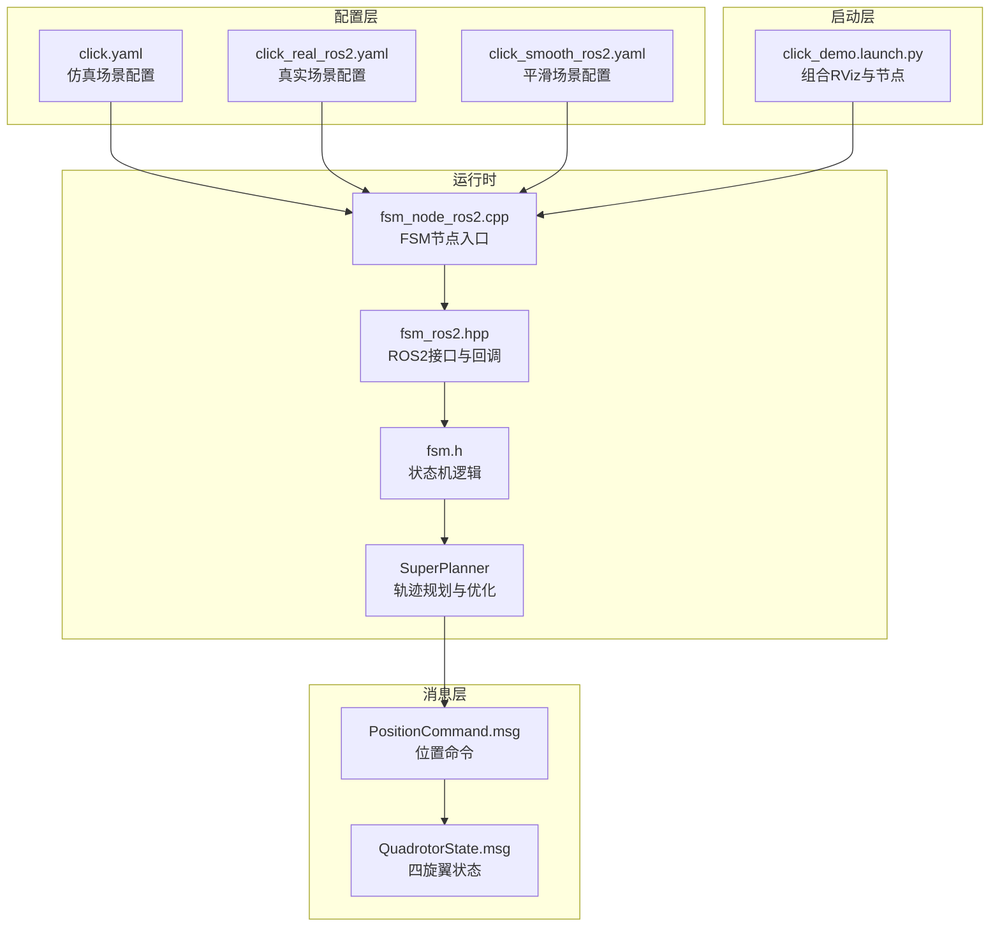
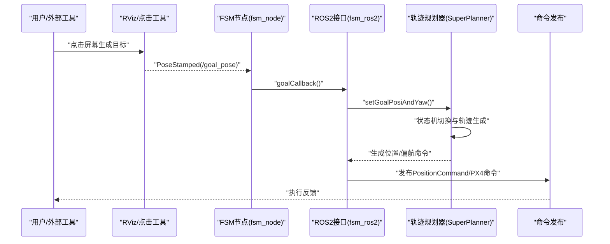
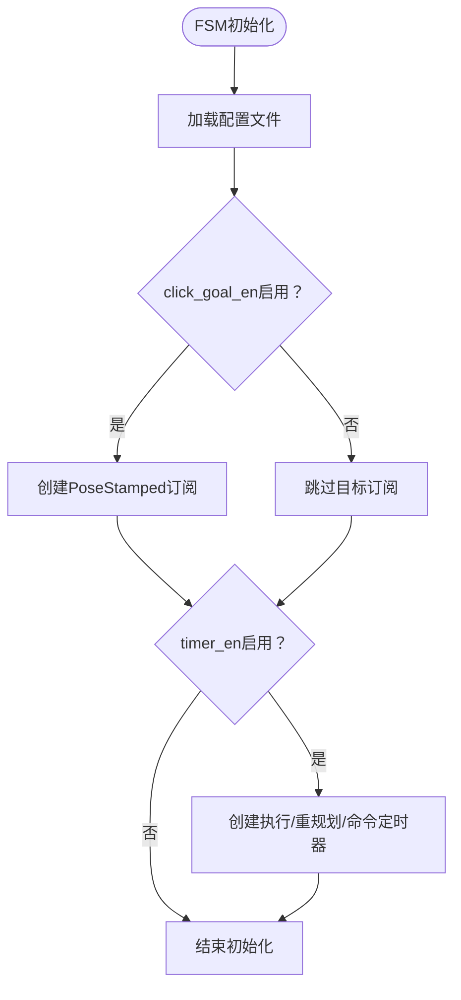
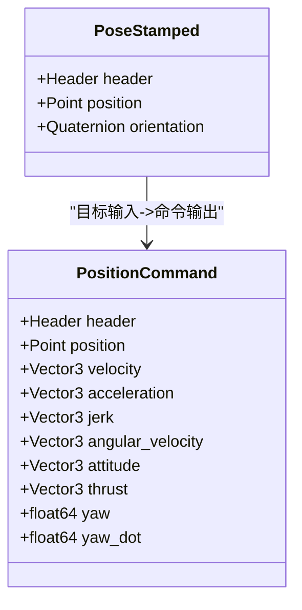
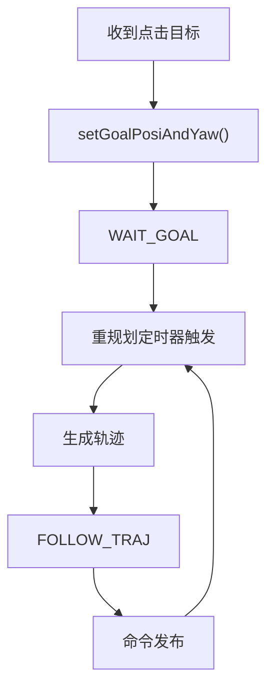
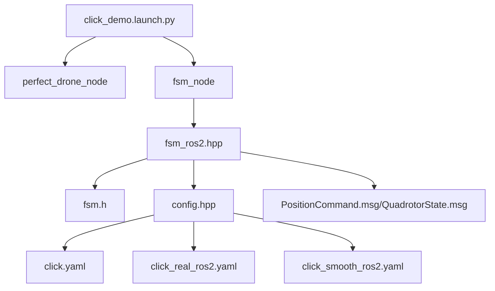

# 点击演示场景配置

<cite>
**本文档引用的文件**
- [src/SUPER/super_planner/config/click.yaml](file://src/SUPER/super_planner/config/click.yaml)
- [src/SUPER/super_planner/config/click_real_ros2.yaml](file://src/SUPER/super_planner/config/click_real_ros2.yaml)
- [src/SUPER/super_planner/config/click_smooth_ros2.yaml](file://src/SUPER/super_planner/config/click_smooth_ros2.yaml)
- [src/SUPER/super_planner/Apps/fsm_node_ros2.cpp](file://src/SUPER/super_planner/Apps/fsm_node_ros2.cpp)
- [src/SUPER/mission_planner/launch/click_demo.launch.py](file://src/SUPER/mission_planner/launch/click_demo.launch.py)
- [src/SUPER/super_planner/include/fsm/config.hpp](file://src/SUPER/super_planner/include/fsm/config.hpp)
- [src/SUPER/super_planner/include/fsm/fsm.h](file://src/SUPER/super_planner/include/fsm/fsm.h)
- [src/SUPER/super_planner/include/ros_interface/ros2/fsm_ros2.hpp](file://src/SUPER/super_planner/include/ros_interface/ros2/fsm_ros2.hpp)
- [src/SUPER/mars_uav_sim/mars_quadrotor_msgs/ros2_msg/PositionCommand.msg](file://src/SUPER/mars_uav_sim/mars_quadrotor_msgs/ros2_msg/PositionCommand.msg)
- [src/SUPER/mars_uav_sim/mars_quadrotor_msgs/ros2_msg/QuadrotorState.msg](file://src/SUPER/mars_uav_sim/mars_quadrotor_msgs/ros2_msg/QuadrotorState.msg)
</cite>

## 目录
1. [简介](#简介)
2. [项目结构](#项目结构)
3. [核心组件](#核心组件)
4. [架构概览](#架构概览)
5. [详细组件分析](#详细组件分析)
6. [依赖关系分析](#依赖关系分析)
7. [性能考虑](#性能考虑)
8. [故障排除指南](#故障排除指南)
9. [结论](#结论)
10. [附录](#附录)

## 简介
本指南面向使用 SUPER 无人机轨迹规划系统的工程师与研究者，专注于"点击演示场景"的完整配置与使用流程。该场景通过交互式点击目标实现快速目标设定，结合有限状态机(FSM)节点、轨迹优化模块与可视化系统，提供从参数配置到实时控制的端到端能力。本文将深入解析以下关键配置项：
- click_goal_en 开关：启用/禁用点击目标功能
- click_goal_topic 话题名称：点击目标输入的话题
- click_height 高度设置：点击目标的固定高度
- click_yaw_en 偏航角控制：是否使用点击时的姿态偏航角
- replan_rate 重规划频率：影响实时性的关键参数
- 可视化配置与日志记录选项
- 典型应用场景与最佳实践
- 故障排除与常见问题解决方案

## 项目结构
点击演示场景涉及多个模块协同工作：
- 配置文件：提供不同场景下的参数集合（仿真、真实、平滑）
- 启动脚本：组合 RViz 可视化与仿真/真实环境
- FSM 节点：状态机与 ROS2 接口，负责目标订阅与命令发布
- 规划器与轨迹优化：基于配置参数执行轨迹生成与优化
- 消息定义：定义位置命令、四旋翼状态等通信协议

**图表来源**
- [src/SUPER/super_planner/config/click.yaml](file://src/SUPER/super_planner/config/click.yaml#L1-L190)
- [src/SUPER/super_planner/config/click_real_ros2.yaml](file://src/SUPER/super_planner/config/click_real_ros2.yaml#L1-L187)
- [src/SUPER/super_planner/config/click_smooth_ros2.yaml](file://src/SUPER/super_planner/config/click_smooth_ros2.yaml#L1-L192)
- [src/SUPER/mission_planner/launch/click_demo.launch.py](file://src/SUPER/mission_planner/launch/click_demo.launch.py#L1-L98)
- [src/SUPER/super_planner/Apps/fsm_node_ros2.cpp](file://src/SUPER/super_planner/Apps/fsm_node_ros2.cpp#L1-L102)
- [src/SUPER/super_planner/include/ros_interface/ros2/fsm_ros2.hpp](file://src/SUPER/super_planner/include/ros_interface/ros2/fsm_ros2.hpp#L1-L541)
- [src/SUPER/super_planner/include/fsm/fsm.h](file://src/SUPER/super_planner/include/fsm/fsm.h#L1-L172)
- [src/SUPER/mars_uav_sim/mars_quadrotor_msgs/ros2_msg/PositionCommand.msg](file://src/SUPER/mars_uav_sim/mars_quadrotor_msgs/ros2_msg/PositionCommand.msg#L1-L30)
- [src/SUPER/mars_uav_sim/mars_quadrotor_msgs/ros2_msg/QuadrotorState.msg](file://src/SUPER/mars_uav_sim/mars_quadrotor_msgs/ros2_msg/QuadrotorState.msg#L1-L11)

**章节来源**
- [src/SUPER/super_planner/config/click.yaml](file://src/SUPER/super_planner/config/click.yaml#L1-L190)
- [src/SUPER/mission_planner/launch/click_demo.launch.py](file://src/SUPER/mission_planner/launch/click_demo.launch.py#L1-L98)
- [src/SUPER/super_planner/Apps/fsm_node_ros2.cpp](file://src/SUPER/super_planner/Apps/fsm_node_ros2.cpp#L1-L102)

## 核心组件
本节聚焦点击演示场景的关键配置参数与对应行为。

- 点击目标功能开关
  - 参数名：fsm/click_goal_en
  - 作用：启用或禁用通过点击目标话题设定目标点
  - 默认值：true
  - 影响：禁用后无法通过点击目标话题触发目标设定

- 点击目标话题名称
  - 参数名：fsm/click_goal_topic
  - 作用：订阅点击目标的 ROS2 话题
  - 默认值："/goal_pose"
  - 影响：必须与外部工具（如 RViz）发布的 PoseStamped 话题一致

- 点击目标高度设置
  - 参数名：fsm/click_height
  - 作用：当点击目标不包含姿态时，使用该高度作为目标点的Z坐标
  - 默认值：1.5 米
  - 影响：确保目标点在三维空间中的Z坐标可用

- 点击偏航角控制
  - 参数名：fsm/click_yaw_en
  - 作用：是否启用点击目标时的姿态偏航角
  - 默认值：true
  - 影响：启用时若点击目标包含有效四元数，则使用其偏航角；否则禁用偏航角

- 重规划频率
  - 参数名：fsm/replan_rate
  - 作用：控制重规划定时器的频率（Hz），直接影响实时性
  - 默认值：15.0 Hz
  - 影响：频率越高，响应越快但计算负载越大；频率过低可能导致轨迹跟踪滞后

- 命令发布话题
  - 参数名：fsm/cmd_topic、fsm/mpc_cmd_topic、fsm/px4_cmd_topic
  - 作用：分别发布 PID 位置命令、多项式轨迹命令以及 PX4 控制命令
  - 默认值：见各配置文件

- 可视化与日志
  - 参数名：super_planner/visualization_en、super_planner/detailed_log_en、rog_map/visualization/enabled
  - 作用：控制是否启用可视化与详细日志记录
  - 影响：可视化有助于调试，日志便于离线分析

**章节来源**
- [src/SUPER/super_planner/config/click.yaml](file://src/SUPER/super_planner/config/click.yaml#L1-L190)
- [src/SUPER/super_planner/config/click_real_ros2.yaml](file://src/SUPER/super_planner/config/click_real_ros2.yaml#L1-L187)
- [src/SUPER/super_planner/config/click_smooth_ros2.yaml](file://src/SUPER/super_planner/config/click_smooth_ros2.yaml#L1-L192)
- [src/SUPER/super_planner/include/fsm/config.hpp](file://src/SUPER/super_planner/include/fsm/config.hpp#L40-L73)

## 架构概览
点击演示场景的运行时架构如下：

**图表来源**
- [src/SUPER/super_planner/include/ros_interface/ros2/fsm_ros2.hpp](file://src/SUPER/super_planner/include/ros_interface/ros2/fsm_ros2.hpp#L279-L324)
- [src/SUPER/super_planner/include/fsm/fsm.h](file://src/SUPER/super_planner/include/fsm/fsm.h#L104-L121)
- [src/SUPER/super_planner/Apps/fsm_node_ros2.cpp](file://src/SUPER/super_planner/Apps/fsm_node_ros2.cpp#L84-L90)

## 详细组件分析

### FSM 节点配置与初始化
- 配置加载
  - 通过参数 config_name 指定配置文件（如 click.yaml）
  - 初始化时读取 FSM 与 SuperPlanner 的参数
- 点击目标订阅
  - 当 click_goal_en 为真时，订阅 click_goal_topic
  - 回调函数将点击目标转换为位置与偏航角
- 定时器机制
  - 根据 replan_rate 计算重规划周期，驱动状态机与命令发布
  - 执行定时器与命令定时器分别处理状态推进与命令发送

**图表来源**
- [src/SUPER/super_planner/Apps/fsm_node_ros2.cpp](file://src/SUPER/super_planner/Apps/fsm_node_ros2.cpp#L84-L90)
- [src/SUPER/super_planner/include/fsm/config.hpp](file://src/SUPER/super_planner/include/fsm/config.hpp#L55-L72)
- [src/SUPER/super_planner/include/ros_interface/ros2/fsm_ros2.hpp](file://src/SUPER/super_planner/include/ros_interface/ros2/fsm_ros2.hpp#L307-L346)

**章节来源**
- [src/SUPER/super_planner/Apps/fsm_node_ros2.cpp](file://src/SUPER/super_planner/Apps/fsm_node_ros2.cpp#L84-L90)
- [src/SUPER/super_planner/include/fsm/config.hpp](file://src/SUPER/super_planner/include/fsm/config.hpp#L55-L72)
- [src/SUPER/super_planner/include/ros_interface/ros2/fsm_ros2.hpp](file://src/SUPER/super_planner/include/ros_interface/ros2/fsm_ros2.hpp#L307-L346)

### 点击目标话题与消息格式
- 话题名称
  - 默认："/goal_pose"
  - 可在配置文件中修改
- 消息类型
  - geometry_msgs/PoseStamped
  - 包含 Header、position(x,y,z)、orientation(w,x,y,z)
- 使用方法
  - 在 RViz 中使用"2D Nav Goal"或自定义工具发布
  - 若仅提供位置，系统将使用 click_height 作为Z坐标
  - 若提供四元数且启用 click_yaw_en，则使用其偏航角

**图表来源**
- [src/SUPER/mars_uav_sim/mars_quadrotor_msgs/ros2_msg/PositionCommand.msg](file://src/SUPER/mars_uav_sim/mars_quadrotor_msgs/ros2_msg/PositionCommand.msg#L1-L30)
- [src/SUPER/mars_uav_sim/mars_quadrotor_msgs/ros2_msg/QuadrotorState.msg](file://src/SUPER/mars_uav_sim/mars_quadrotor_msgs/ros2_msg/QuadrotorState.msg#L1-L11)

**章节来源**
- [src/SUPER/super_planner/config/click.yaml](file://src/SUPER/super_planner/config/click.yaml#L4-L11)
- [src/SUPER/super_planner/include/ros_interface/ros2/fsm_ros2.hpp](file://src/SUPER/super_planner/include/ros_interface/ros2/fsm_ros2.hpp#L279-L284)

### 重规划频率对实时性的影响
- 配置参数：fsm/replan_rate（单位：Hz）
- 工作原理
  - 重规划定时器按周期触发，驱动轨迹重新生成与状态机推进
  - 频率越高，系统对目标变化的响应越快，但CPU/GPU负载增加
- 建议
  - 仿真场景：15-30 Hz
  - 真实硬件：根据控制器刷新率与传感器延迟折中（通常10-20 Hz）

**图表来源**
- [src/SUPER/super_planner/include/fsm/fsm.h](file://src/SUPER/super_planner/include/fsm/fsm.h#L104-L121)
- [src/SUPER/super_planner/include/fsm/fsm.h](file://src/SUPER/super_planner/include/fsm/fsm.h#L75-L90)

**章节来源**
- [src/SUPER/super_planner/config/click.yaml](file://src/SUPER/super_planner/config/click.yaml#L8-L8)
- [src/SUPER/super_planner/include/fsm/fsm.h](file://src/SUPER/super_planner/include/fsm/fsm.h#L104-L121)

### 可视化配置与日志记录
- 可视化
  - super_planner/visualization_en：启用/禁用规划器可视化
  - rog_map/visualization/enabled：启用/禁用地图可视化
  - 可通过 RViz 加载默认配置文件进行观察
- 日志记录
  - detailed_log_en：启用详细日志
  - 系统会生成重规划日志与命令CSV文件，便于离线分析

**章节来源**
- [src/SUPER/super_planner/config/click.yaml](file://src/SUPER/super_planner/config/click.yaml#L17-L18)
- [src/SUPER/super_planner/config/click.yaml](file://src/SUPER/super_planner/config/click.yaml#L155-L165)
- [src/SUPER/super_planner/include/ros_interface/ros2/fsm_ros2.hpp](file://src/SUPER/super_planner/include/ros_interface/ros2/fsm_ros2.hpp#L191-L245)

### 典型应用场景与最佳实践
- 应用场景
  - 仿真测试：快速验证轨迹规划与控制算法
  - 人机交互：通过鼠标点击快速设定目标点
  - 算法对比：在相同场景下对比不同参数组合的效果
- 最佳实践
  - 仿真与真实场景参数分离：使用不同的配置文件
  - 合理设置 replan_rate：平衡实时性与计算负载
  - 使用 RViz 进行可视化验证：确认目标点与轨迹
  - 启用日志记录：便于后续分析与优化

**章节来源**
- [src/SUPER/mission_planner/launch/click_demo.launch.py](file://src/SUPER/mission_planner/launch/click_demo.launch.py#L59-L96)
- [src/SUPER/super_planner/config/click.yaml](file://src/SUPER/super_planner/config/click.yaml#L1-L190)

## 依赖关系分析
点击演示场景的依赖关系如下：

**图表来源**
- [src/SUPER/mission_planner/launch/click_demo.launch.py](file://src/SUPER/mission_planner/launch/click_demo.launch.py#L75-L96)
- [src/SUPER/super_planner/include/ros_interface/ros2/fsm_ros2.hpp](file://src/SUPER/super_planner/include/ros_interface/ros2/fsm_ros2.hpp#L1-L541)
- [src/SUPER/super_planner/include/fsm/fsm.h](file://src/SUPER/super_planner/include/fsm/fsm.h#L1-L172)
- [src/SUPER/super_planner/include/fsm/config.hpp](file://src/SUPER/super_planner/include/fsm/config.hpp#L1-L77)
- [src/SUPER/super_planner/config/click.yaml](file://src/SUPER/super_planner/config/click.yaml#L1-L190)
- [src/SUPER/super_planner/config/click_real_ros2.yaml](file://src/SUPER/super_planner/config/click_real_ros2.yaml#L1-L187)
- [src/SUPER/super_planner/config/click_smooth_ros2.yaml](file://src/SUPER/super_planner/config/click_smooth_ros2.yaml#L1-L192)

**章节来源**
- [src/SUPER/mission_planner/launch/click_demo.launch.py](file://src/SUPER/mission_planner/launch/click_demo.launch.py#L1-L98)
- [src/SUPER/super_planner/include/ros_interface/ros2/fsm_ros2.hpp](file://src/SUPER/super_planner/include/ros_interface/ros2/fsm_ros2.hpp#L1-L541)
- [src/SUPER/super_planner/include/fsm/config.hpp](file://src/SUPER/super_planner/include/fsm/config.hpp#L1-L77)

## 性能考虑
- 重规划频率与实时性
  - 提高 replan_rate 可提升响应速度，但会增加 CPU/GPU 负载
  - 建议在仿真中先提高频率验证效果，在真实硬件上根据控制器刷新率调整
- 可视化开销
  - 启用可视化会增加渲染与通信开销，建议在性能敏感场景关闭
- 日志记录
  - 详细日志与 CSV 导出会带来磁盘 IO 压力，建议仅在调试阶段启用

## 故障排除指南
- 无法接收点击目标
  - 检查 click_goal_en 是否为 true
  - 确认 click_goal_topic 与发布话题一致
  - 确认 RViz 或发布工具正确发布 geometry_msgs/PoseStamped
- 偏航角无效
  - 检查 click_yaw_en 是否为 true
  - 确认点击目标的 orientation 是否有效（非 NaN）
- 重规划不生效
  - 检查 replan_rate 是否合理
  - 确认定时器已创建且正常触发
- 命令未发布
  - 检查 cmd_topic、mpc_cmd_topic、px4_cmd_topic 是否正确
  - 确认状态机进入 FOLLOW_TRAJ 状态

**章节来源**
- [src/SUPER/super_planner/include/ros_interface/ros2/fsm_ros2.hpp](file://src/SUPER/super_planner/include/ros_interface/ros2/fsm_ros2.hpp#L307-L346)
- [src/SUPER/super_planner/include/fsm/fsm.h](file://src/SUPER/super_planner/include/fsm/fsm.h#L253-L273)

## 结论
点击演示场景通过简洁的配置与清晰的运行时流程，实现了从交互式目标设定到实时轨迹执行的完整闭环。合理配置 click_goal_en、click_goal_topic、click_height、click_yaw_en 与 replan_rate，可显著提升系统的易用性与实时性能。配合可视化与日志记录，能够快速定位问题并持续优化参数。

## 附录
- 启动命令示例
  - 使用仿真场景：ros2 launch mission_planner click_demo.launch.py
  - 使用真实场景：准备真实硬件与传感器数据源后，切换至 click_real_ros2.yaml
- 参数动态调整
  - 通过 rqt_reconfigure 或参数服务器动态更新轨迹优化参数，系统会自动同步到优化器