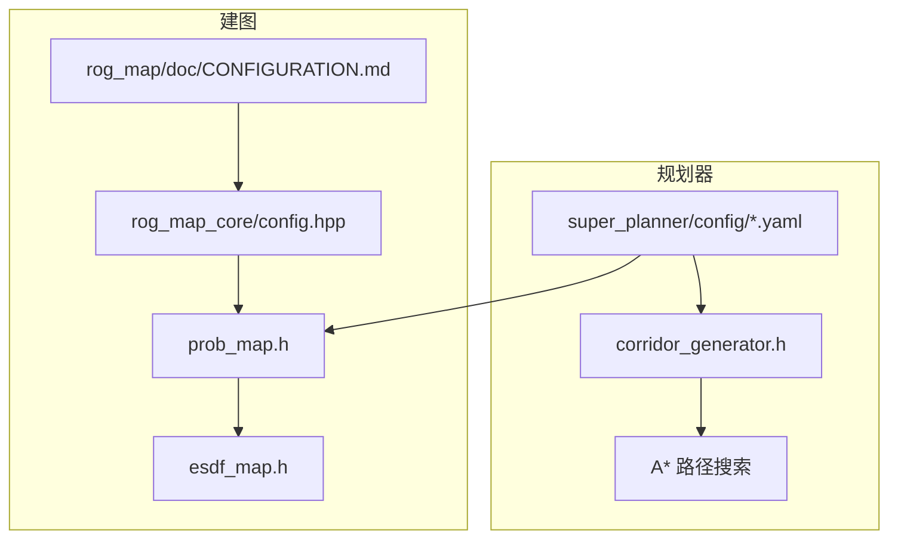
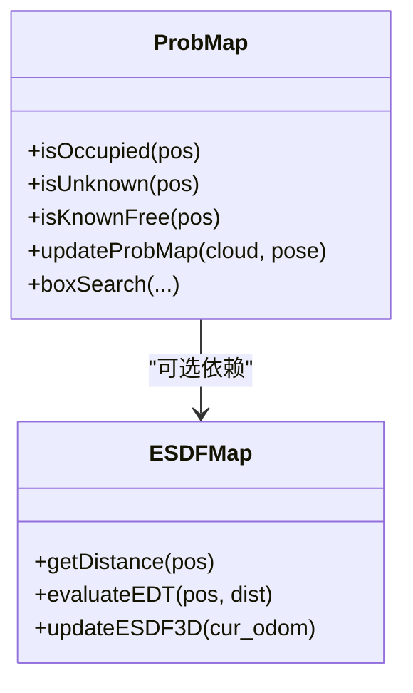
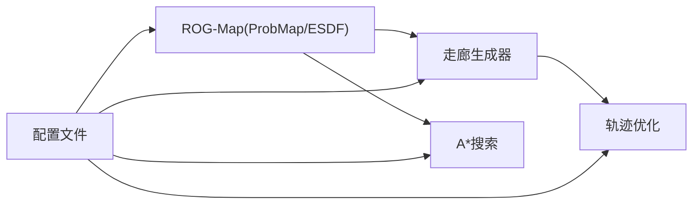

# 高密度环境场景配置

<cite>
**本文引用的文件**
- [static_dense.yaml](file://src/SUPER/super_planner/config/static_dense.yaml)
- [static_high_speed.yaml](file://src/SUPER/super_planner/config/static_high_speed.yaml)
- [CONFIGURATION.md](file://src/SUPER/rog_map/doc/CONFIGURATION.md)
- [CONFIGURATION_GUIDE.md](file://src/SUPER/super_planner/docs/CONFIGURATION_GUIDE.md)
- [config.hpp](file://src/SUPER/rog_map/include/rog_map/rog_map_core/config.hpp)
- [corridor_generator.h](file://src/SUPER/super_planner/include/super_core/corridor_generator.h)
- [esdf_map.h](file://src/SUPER/rog_map/include/rog_map/esdf_map.h)
- [prob_map.h](file://src/SUPER/rog_map/include/rog_map/prob_map.h)
</cite>

## 目录
1. [简介](#简介)
2. [项目结构](#项目结构)
3. [核心组件](#核心组件)
4. [架构总览](#架构总览)
5. [详细组件分析](#详细组件分析)
6. [依赖关系分析](#依赖关系分析)
7. [性能考量](#性能考量)
8. [故障排查指南](#故障排查指南)
9. [结论](#结论)
10. [附录](#附录)

## 简介
本指南面向在“高密度环境”（障碍物密集、空间受限、对安全性与实时性要求较高）下的无人机/无人车路径规划与建图需求，提供从地图分辨率、障碍物处理、走廊生成与路径搜索参数在内的系统性配置优化策略。重点解释如下关键参数的作用机制与调优方法：
- corridor_bound_dis（通道边界距离）
- obs_skip_num（障碍物跳过数量）
- ROG-Map 的 ESDF 映射与概率地图在高密度环境中的取舍
- 高密度场景下的性能调优与资源消耗分析
- 实际部署经验与性能基准建议

## 项目结构
本仓库包含规划器与建图模块两大子系统，分别位于 SUPER/super_planner 与 SUPER/rog_map。高密度环境配置主要涉及：
- 规划器配置：super_planner/config 下的 static_dense.yaml、static_high_speed.yaml
- 建图配置：rog_map/doc/CONFIGURATION.md 与 rog_map/include/rog_map/rog_map_core/config.hpp
- 关键组件：走廊生成器、ESDF 地图、概率地图



**图表来源**
- [static_dense.yaml](file://src/SUPER/super_planner/config/static_dense.yaml#L1-L186)
- [static_high_speed.yaml](file://src/SUPER/super_planner/config/static_high_speed.yaml#L1-L187)
- [CONFIGURATION.md](file://src/SUPER/rog_map/doc/CONFIGURATION.md#L1-L334)
- [config.hpp](file://src/SUPER/rog_map/include/rog_map/rog_map_core/config.hpp#L68-L288)
- [corridor_generator.h](file://src/SUPER/super_planner/include/super_core/corridor_generator.h#L56-L193)
- [prob_map.h](file://src/SUPER/rog_map/include/rog_map/prob_map.h#L38-L165)
- [esdf_map.h](file://src/SUPER/rog_map/include/rog_map/esdf_map.h#L32-L105)

**章节来源**
- [static_dense.yaml](file://src/SUPER/super_planner/config/static_dense.yaml#L1-L186)
- [static_high_speed.yaml](file://src/SUPER/super_planner/config/static_high_speed.yaml#L1-L187)
- [CONFIGURATION.md](file://src/SUPER/rog_map/doc/CONFIGURATION.md#L1-L334)
- [config.hpp](file://src/SUPER/rog_map/include/rog_map/rog_map_core/config.hpp#L68-L288)

## 核心组件
- 走廊生成器（CorridorGenerator）：基于路径点列与地图信息，使用 CIRI 算法提取安全飞行走廊（凸多面体），关键参数包括通道边界距离、种子线段长度、IRIS 迭代次数、障碍物跳过数量等。
- ROG-Map 概率地图与膨胀地图：维护占用/未知/自由网格，并可选启用 ESDF（欧氏符号距离场）以支持梯度型轨迹优化。
- A* 路径搜索：在栅格化的地图上进行高效搜索，参数影响搜索精度与速度。

**章节来源**
- [corridor_generator.h](file://src/SUPER/super_planner/include/super_core/corridor_generator.h#L56-L193)
- [prob_map.h](file://src/SUPER/rog_map/include/rog_map/prob_map.h#L38-L165)
- [esdf_map.h](file://src/SUPER/rog_map/include/rog_map/esdf_map.h#L32-L105)

## 架构总览
高密度环境下的端到端流程如下：
- 输入：点云与里程计（可选 ESDF）
- 地图更新：概率地图更新 + 可选 ESDF 局部更新
- 走廊生成：沿预规划路径提取安全凸多面体
- 轨迹优化：在走廊约束下进行探索/备份轨迹优化
- A* 搜索：在栅格地图上进行路径搜索

```mermaid
sequenceDiagram
participant Sensor as "传感器/点云"
participant Map as "ROG-Map(概率+ESDF)"
participant Corr as "走廊生成器"
participant Opt as "轨迹优化"
participant AStar as "A*搜索"
Sensor->>Map : 点云/里程计
Map->>Map : 概率更新/局部ESDF更新
Map->>Corr : 提供占用/未知/自由信息
Corr-->>Opt : 安全走廊(凸多面体)
Opt->>AStar : 生成初始路径
AStar-->>Opt : 栅格路径
Opt-->>Sensor : 优化轨迹
```

**图表来源**
- [prob_map.h](file://src/SUPER/rog_map/include/rog_map/prob_map.h#L100-L165)
- [esdf_map.h](file://src/SUPER/rog_map/include/rog_map/esdf_map.h#L53-L100)
- [corridor_generator.h](file://src/SUPER/super_planner/include/super_core/corridor_generator.h#L129-L131)
- [CONFIGURATION_GUIDE.md](file://src/SUPER/super_planner/docs/CONFIGURATION_GUIDE.md#L226-L288)

## 详细组件分析

### 关键参数与作用机制
- corridor_bound_dis（通道边界距离）
  - 作用：决定走廊边界与机器人几何的最小安全距离，直接影响走廊的“宽度”与可通行性。
  - 高密度场景建议：适当增大以应对密集障碍物；同时结合 obs_skip_num 控制计算负载。
  - 参考配置：static_dense.yaml 中为 0.8，static_high_speed.yaml 中为 3.0。
- obs_skip_num（障碍物跳过数量）
  - 作用：在走廊生成过程中对点云/包围盒搜索进行采样跳过，显著降低计算量。
  - 高密度场景建议：适度增大（例如 2），在保证安全的前提下提升实时性。
  - 参考配置：static_dense.yaml 与 static_high_speed.yaml 均为 2。
- iris_iter_num（IRIS 迭代次数）
  - 作用：控制凸多面体求解的迭代稳定性与精度。
  - 高密度场景建议：在保证走廊有效性前提下，适度降低迭代次数以提速。
  - 参考配置：static_dense.yaml 为 2，static_high_speed.yaml 为 2。
- corridor_line_max_length / safe_corridor_line_max_length
  - 作用：限制走廊线段长度，避免过长导致优化困难或越界。
  - 高密度场景建议：对安全走廊设置更大上限，确保连续性与可穿越性。
  - 参考配置：dense 中分别为 1.0 与 6.0；high_speed 中分别为 3.0 与较大值。

**章节来源**
- [static_dense.yaml](file://src/SUPER/super_planner/config/static_dense.yaml#L21-L34)
- [static_high_speed.yaml](file://src/SUPER/super_planner/config/static_high_speed.yaml#L21-L34)
- [corridor_generator.h](file://src/SUPER/super_planner/include/super_core/corridor_generator.h#L56-L193)

### 地图分辨率与体积配置
- ROG-Map 分辨率与膨胀分辨率
  - resolution：概率地图体素大小；inflation_resolution：膨胀层分辨率。
  - 高密度场景建议：在保证足够分辨率的前提下，适度提高膨胀步数以扩大安全边界。
  - 参考配置：dense 中 resolution 为 0.05，inflation_resolution 为 0.1；high_speed 中 resolution 为 0.3。
- 地图尺寸与滑动窗口
  - map_size 决定本地窗口大小；map_sliding 控制是否随机器人移动滑动。
  - 高密度场景建议：缩小 map_size 或提高 resolution 以降低计算；必要时启用滑动窗口。
- ESDF 启用与局部更新范围
  - esdf.enable 与 local_update_box 影响 ESDF 的计算与发布范围。
  - 高密度场景建议：按需启用 ESDF，避免在复杂环境中带来额外开销。

**章节来源**
- [CONFIGURATION.md](file://src/SUPER/rog_map/doc/CONFIGURATION.md#L21-L136)
- [config.hpp](file://src/SUPER/rog_map/include/rog_map/rog_map_core/config.hpp#L143-L151)
- [static_dense.yaml](file://src/SUPER/super_planner/config/static_dense.yaml#L105-L132)
- [static_high_speed.yaml](file://src/SUPER/super_planner/config/static_high_speed.yaml#L106-L132)

### 轨迹优化与路径搜索参数
- 轨迹优化边界与惩罚权重
  - max_vel/max_acc/max_jerk 等边界参数与 penna_pos/penna_jerk 等惩罚权重共同决定轨迹平滑性与安全性。
  - 高密度场景建议：提高 penna_pos 以强化走廊约束，适当降低 smooth_eps 以提升响应速度。
- A* 搜索参数
  - resolution、allow_diag、heu_type 等影响搜索精度与速度。
  - 高密度场景建议：在保证可行性的前提下提高分辨率，启用对角线移动以提升连通性。

**章节来源**
- [CONFIGURATION_GUIDE.md](file://src/SUPER/super_planner/docs/CONFIGURATION_GUIDE.md#L23-L171)
- [static_dense.yaml](file://src/SUPER/super_planner/config/static_dense.yaml#L96-L103)
- [static_high_speed.yaml](file://src/SUPER/super_planner/config/static_high_speed.yaml#L97-L103)

### ESDF 映射与概率地图在高密度环境中的应用
- 概率地图（ProbMap）：维护占用/未知/自由网格，支持批量更新与局部缓存，适合高密度环境下的稳定更新。
- ESDF 地图（ESDFMap）：计算精确欧氏距离，利于梯度型优化，但计算开销较大，建议按需启用。
- 高密度环境建议：
  - 优先使用概率地图进行走廊与路径生成；
  - 在需要精确距离梯度的优化阶段再启用 ESDF；
  - 合理设置 local_update_box，避免全局重算。



**图表来源**
- [prob_map.h](file://src/SUPER/rog_map/include/rog_map/prob_map.h#L38-L165)
- [esdf_map.h](file://src/SUPER/rog_map/include/rog_map/esdf_map.h#L32-L105)

**章节来源**
- [prob_map.h](file://src/SUPER/rog_map/include/rog_map/prob_map.h#L38-L165)
- [esdf_map.h](file://src/SUPER/rog_map/include/rog_map/esdf_map.h#L32-L105)

### 高密度环境下的性能调优策略与资源消耗分析
- 地图侧
  - 降低 resolution 或缩小 map_size 以减少网格数量；
  - 适度增大 inflation_step 以扩大安全边界，避免频繁避障；
  - 按需启用 ESDF，优先使用概率地图进行走廊生成。
- 规划侧
  - 降低 corridor_line_max_length 与 iris_iter_num，提升实时性；
  - 适度增大 obs_skip_num，减少点云/包围盒搜索开销；
  - 在轨迹优化中提高 penna_pos，强化走廊约束。
- 路径搜索
  - 启用对角线移动，提高连通性；
  - 合理设置启发函数类型与分辨率，平衡精度与速度。

**章节来源**
- [CONFIGURATION.md](file://src/SUPER/rog_map/doc/CONFIGURATION.md#L244-L253)
- [CONFIGURATION_GUIDE.md](file://src/SUPER/super_planner/docs/CONFIGURATION_GUIDE.md#L358-L371)
- [static_dense.yaml](file://src/SUPER/super_planner/config/static_dense.yaml#L96-L103)
- [static_high_speed.yaml](file://src/SUPER/super_planner/config/static_high_speed.yaml#L97-L103)

### 实际部署经验与性能基准建议
- 部署经验
  - 先在仿真/低密度环境下收敛参数，再逐步收紧至高密度场景；
  - 建议建立参数库，按场景（室内/室外/高密度/高速）分类管理；
  - 使用日志记录与 RViz 观察走廊与轨迹质量，持续迭代。
- 性能基准建议
  - 基于 CONFIGURATION.md 的典型性能表格，结合实际硬件评估目标帧率；
  - 在高密度场景优先保证走廊生成与轨迹优化的稳定性，再逐步优化速度。

**章节来源**
- [CONFIGURATION.md](file://src/SUPER/rog_map/doc/CONFIGURATION.md#L244-L253)
- [CONFIGURATION_GUIDE.md](file://src/SUPER/super_planner/docs/CONFIGURATION_GUIDE.md#L388-L411)

## 依赖关系分析
- 走廊生成依赖 ROG-Map 的概率/膨胀/ESDF 信息；
- 轨迹优化依赖走廊与地图查询；
- A* 搜索依赖栅格化地图与启发函数；
- 参数耦合：corridor_bound_dis 与 obs_skip_num 共同影响走廊生成效率与质量。



**图表来源**
- [prob_map.h](file://src/SUPER/rog_map/include/rog_map/prob_map.h#L100-L165)
- [esdf_map.h](file://src/SUPER/rog_map/include/rog_map/esdf_map.h#L53-L100)
- [corridor_generator.h](file://src/SUPER/super_planner/include/super_core/corridor_generator.h#L129-L131)
- [static_dense.yaml](file://src/SUPER/super_planner/config/static_dense.yaml#L1-L186)
- [static_high_speed.yaml](file://src/SUPER/super_planner/config/static_high_speed.yaml#L1-L187)

**章节来源**
- [prob_map.h](file://src/SUPER/rog_map/include/rog_map/prob_map.h#L100-L165)
- [esdf_map.h](file://src/SUPER/rog_map/include/rog_map/esdf_map.h#L53-L100)
- [corridor_generator.h](file://src/SUPER/super_planner/include/super_core/corridor_generator.h#L129-L131)
- [static_dense.yaml](file://src/SUPER/super_planner/config/static_dense.yaml#L1-L186)
- [static_high_speed.yaml](file://src/SUPER/super_planner/config/static_high_speed.yaml#L1-L187)

## 性能考量
- 计算热点
  - 走廊生成（CIRI）与点云包围盒搜索是高密度环境的主要瓶颈；
  - ESDF 计算开销较大，建议按需启用。
- 优化方向
  - 通过 obs_skip_num 与 seed_line_max_length 降低搜索复杂度；
  - 通过 inflation_step 与 corridor_bound_dis 平衡安全与效率；
  - 通过轨迹优化惩罚权重与积分分辨率折中平滑性与实时性。

[本节为通用指导，无需具体文件引用]

## 故障排查指南
- 走廊为空或不可达
  - 检查 corridor_bound_dis 与 inflation_step 是否过大导致边界无效；
  - 检查 obs_skip_num 是否过大导致采样不足。
- 轨迹优化失败或不稳定
  - 降低 opt_accuracy 或提高 penna_pos；
  - 检查边界参数是否过严。
- 规划速度慢
  - 降低分辨率或增大积分分辨率；
  - 启用对角线移动与合适的启发函数类型。

**章节来源**
- [CONFIGURATION_GUIDE.md](file://src/SUPER/super_planner/docs/CONFIGURATION_GUIDE.md#L325-L371)

## 结论
在高密度环境中，应以“安全优先、实时次之”的原则进行配置：通过合理的 corridor_bound_dis 与 obs_skip_num 控制走廊生成的稳定性与效率；通过 ROG-Map 的概率地图与按需 ESDF 实现稳健更新与精确距离梯度；通过轨迹优化与 A* 参数的协同调优，在保证安全的同时最大化计算效率。建议建立场景化参数库并持续迭代验证。

[本节为总结性内容，无需具体文件引用]

## 附录
- 配置文件位置与用途
  - super_planner/config/static_dense.yaml：静态高密度场景预设
  - super_planner/config/static_high_speed.yaml：高速场景预设
  - rog_map/doc/CONFIGURATION.md：ROG-Map 完整配置说明
- 关键参数速查
  - corridor_bound_dis、obs_skip_num、iris_iter_num、corridor_line_max_length、safe_corridor_line_max_length
  - ROG-Map：resolution、inflation_resolution、map_size、esdf.enable、local_update_box

**章节来源**
- [static_dense.yaml](file://src/SUPER/super_planner/config/static_dense.yaml#L1-L186)
- [static_high_speed.yaml](file://src/SUPER/super_planner/config/static_high_speed.yaml#L1-L187)
- [CONFIGURATION.md](file://src/SUPER/rog_map/doc/CONFIGURATION.md#L1-L334)