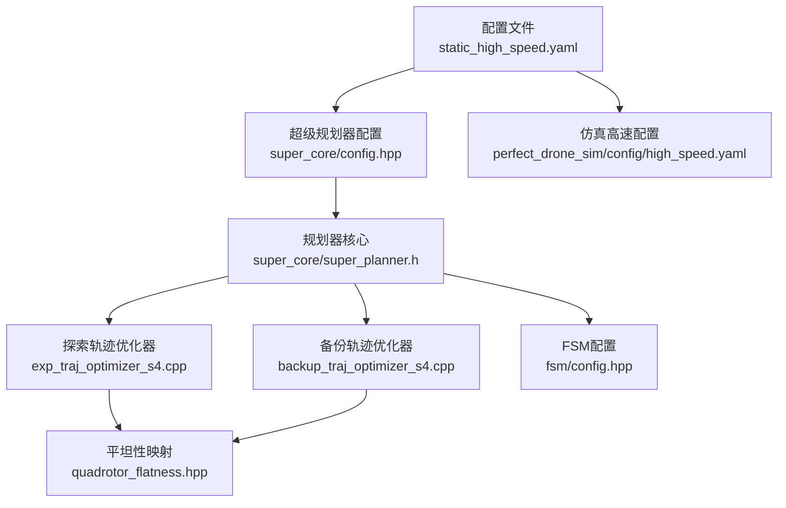
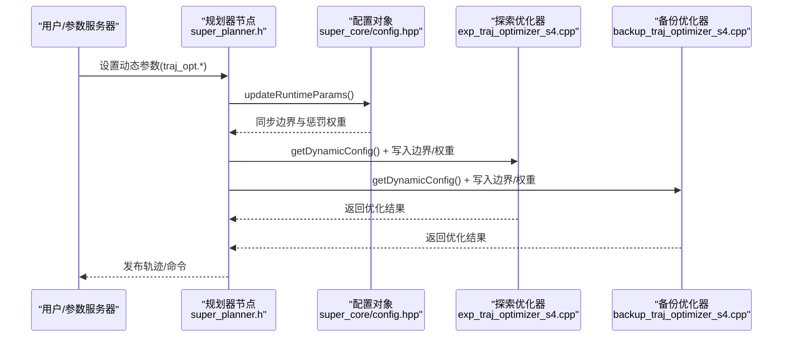
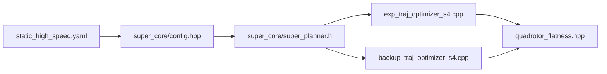

# 高速飞行场景配置

<cite>
**本文引用的文件**
- [static_high_speed.yaml](file://src/SUPER/super_planner/config/static_high_speed.yaml)
- [CONFIGURATION_GUIDE.md](file://src/SUPER/super_planner/docs/CONFIGURATION_GUIDE.md)
- [config.hpp](file://src/SUPER/super_planner/include/super_core/config.hpp)
- [config.hpp](file://src/SUPER/super_planner/include/traj_opt/config.hpp)
- [super_planner.h](file://src/SUPER/super_planner/include/super_core/super_planner.h)
- [config.hpp](file://src/SUPER/super_planner/include/fsm/config.hpp)
- [exp_traj_optimizer_s4.cpp](file://src/SUPER/super_planner/src/traj_opt/exp_traj_optimizer_s4.cpp)
- [backup_traj_optimizer_s4.cpp](file://src/SUPER/super_planner/src/traj_opt/backup_traj_optimizer_s4.cpp)
- [quadrotor_flatness.hpp](file://src/SUPER/super_planner/include/utils/geometry/quadrotor_flatness.hpp)
- [high_speed.yaml](file://src/SUPER/mars_uav_sim/perfect_drone_sim/perfect_drone_sim/config/high_speed.yaml)
- [test_dynamic_params.cpp](file://src/SUPER/super_planner/test/test_dynamic_params.cpp)
</cite>

## 目录
1. [简介](#简介)
2. [项目结构](#项目结构)
3. [核心组件](#核心组件)
4. [架构总览](#架构总览)
5. [详细组件分析](#详细组件分析)
6. [依赖关系分析](#依赖关系分析)
7. [性能考量](#性能考量)
8. [故障排查指南](#故障排查指南)
9. [结论](#结论)
10. [附录](#附录)

## 简介
本指南面向“高速飞行”场景，提供基于 SUPER 规划器的完整配置与使用说明。内容覆盖高速条件下的边界约束参数、轨迹优化设置、重规划策略、稳定性保障与安全冗余设计、优化器配置策略与性能优化方法、测试验证流程与评估标准，以及与低速场景的参数差异与迁移策略。读者可据此在仿真或实飞环境中安全高效地部署高速轨迹规划。

## 项目结构
- 高速场景专用配置位于 super_planner/config/static_high_speed.yaml，包含规划器、轨迹优化、地图与可视化等模块的关键参数。
- 文档位于 super_planner/docs/CONFIGURATION_GUIDE.md，提供参数参考、动态参数更新方式与常见问题。
- 关键运行时参数同步逻辑位于 super_core/super_planner.h 的 updateRuntimeParams 流程，确保 ROS2 动态参数实时生效。
- 轨迹优化器（探索与备份）在 exp_traj_optimizer_s4.cpp 与 backup_traj_optimizer_s4.cpp 中实现，读取边界与惩罚权重并执行优化。
- 四旋翼平坦性映射（将轨迹转为推力/姿态指令）在 quadrotor_flatness.hpp 中定义，影响推力与角速度约束的实现。

**图表来源**
- [static_high_speed.yaml](file://src/SUPER/super_planner/config/static_high_speed.yaml#L1-L187)
- [config.hpp](file://src/SUPER/super_planner/include/super_core/config.hpp#L96-L151)
- [super_planner.h](file://src/SUPER/super_planner/include/super_core/super_planner.h#L241-L295)
- [exp_traj_optimizer_s4.cpp](file://src/SUPER/super_planner/src/traj_opt/exp_traj_optimizer_s4.cpp#L968-L991)
- [backup_traj_optimizer_s4.cpp](file://src/SUPER/super_planner/src/traj_opt/backup_traj_optimizer_s4.cpp#L739-L763)
- [quadrotor_flatness.hpp](file://src/SUPER/super_planner/include/utils/geometry/quadrotor_flatness.hpp#L57-L85)
- [config.hpp](file://src/SUPER/super_planner/include/fsm/config.hpp#L55-L72)
- [high_speed.yaml](file://src/SUPER/mars_uav_sim/perfect_drone_sim/perfect_drone_sim/config/high_speed.yaml#L1-L30)

**章节来源**
- [static_high_speed.yaml](file://src/SUPER/super_planner/config/static_high_speed.yaml#L1-L187)
- [CONFIGURATION_GUIDE.md](file://src/SUPER/super_planner/docs/CONFIGURATION_GUIDE.md#L1-L411)

## 核心组件
- 高速场景配置文件：static_high_speed.yaml 提供了高速飞行所需的边界约束、轨迹优化与地图/可视化参数。
- 运行时参数同步：super_planner.h 的 updateRuntimeParams 将 ROS2 动态参数同步至探索与备份轨迹优化器。
- 轨迹优化器：exp_traj_optimizer_s4.cpp 与 backup_traj_optimizer_s4.cpp 实现边界与惩罚权重的读取与优化过程。
- 平坦性映射：quadrotor_flatness.hpp 将轨迹状态转换为推力、姿态与角速度，支撑高速下的稳定控制。

**章节来源**
- [config.hpp](file://src/SUPER/super_planner/include/super_core/config.hpp#L96-L151)
- [super_planner.h](file://src/SUPER/super_planner/include/super_core/super_planner.h#L241-L295)
- [exp_traj_optimizer_s4.cpp](file://src/SUPER/super_planner/src/traj_opt/exp_traj_optimizer_s4.cpp#L968-L991)
- [backup_traj_optimizer_s4.cpp](file://src/SUPER/super_planner/src/traj_opt/backup_traj_optimizer_s4.cpp#L739-L763)
- [quadrotor_flatness.hpp](file://src/SUPER/super_planner/include/utils/geometry/quadrotor_flatness.hpp#L57-L85)

## 架构总览
下图展示从配置到优化再到控制命令的端到端流程，强调高速场景下的关键参数链路与同步机制。

**图表来源**
- [super_planner.h](file://src/SUPER/super_planner/include/super_core/super_planner.h#L241-L295)
- [config.hpp](file://src/SUPER/super_planner/include/super_core/config.hpp#L158-L228)
- [exp_traj_optimizer_s4.cpp](file://src/SUPER/super_planner/src/traj_opt/exp_traj_optimizer_s4.cpp#L968-L991)
- [backup_traj_optimizer_s4.cpp](file://src/SUPER/super_planner/src/traj_opt/backup_traj_optimizer_s4.cpp#L739-L763)

## 详细组件分析

### 高速飞行边界约束与关键参数设置原则
- 最大速度 max_vel：高速场景建议提升至满足任务需求且不超过平台极限，需与积分分辨率、采样步长协同设置。
- 最大加速度 max_acc：应与最大推力加速度 max_acc_thr 协同，避免超调与失稳。
- 最大加加速度 max_jerk：高速下必须严格限制以保证轨迹平滑与控制鲁棒性。
- 角速度 max_omg：与偏航控制策略配合，避免高速偏航导致的姿态扰动。
- 推力上下限 max_acc_thr/min_acc_thr：结合四旋翼平坦性映射的质量与重力参数，确保推力物理可行性。

参数来源与默认值参考：
- 高速场景配置文件中边界参数示例与默认值加载逻辑。
- 运行时参数同步时对边界参数的读取与更新。

**章节来源**
- [static_high_speed.yaml](file://src/SUPER/super_planner/config/static_high_speed.yaml#L42-L48)
- [config.hpp](file://src/SUPER/super_planner/include/traj_opt/config.hpp#L143-L150)
- [config.hpp](file://src/SUPER/super_planner/include/super_core/config.hpp#L183-L187)

### 轨迹优化器在高速条件下的配置策略
- 探索轨迹（exp_traj）：采用走廊约束模式，提高时间惩罚 penna_t 以缩短轨迹；适度增加加速度/加加速度惩罚以提升平滑性；在高速场景可适当放宽位置惩罚以提升响应速度。
- 备份轨迹（backup_traj）：启用均匀时间分配 uniform_time_en，提升紧急避障时的响应速度；减少分段数 piece_num 以加速求解；禁用能量代价 block_energy_cost 以进一步提速。
- 积分分辨率 integral_reso 与优化精度 opt_accuracy：在保证稳定性的前提下降低以提升实时性。
- 平滑参数 smooth_eps：在高速下适度增大以抑制高频震荡。

参数来源与默认值加载逻辑：
- 高速场景配置文件中 exp_traj 与 backup_traj 的权重与算法参数。
- 运行时参数同步时对探索与备份优化器动态配置的写入。

**章节来源**
- [static_high_speed.yaml](file://src/SUPER/super_planner/config/static_high_speed.yaml#L51-L86)
- [config.hpp](file://src/SUPER/super_planner/include/traj_opt/config.hpp#L110-L179)
- [super_planner.h](file://src/SUPER/super_planner/include/super_core/super_planner.h#L246-L294)

### 重规划策略与稳定性保障机制
- 重规划频率与前向步长：replan_rate 与 replan_forward_dt 控制重规划节奏与前向窗口，高速场景建议提高频率并缩短前向步长以增强响应。
- 规划时域与感知范围：planning_horizon 与 sensing_horizon 在高速下需平衡响应速度与安全性。
- 安全走廊与线段长度：safe_corridor_line_max_length 与 corridor_line_max_length 限制走廊线段长度，避免长直段导致的急转向。
- 偏航控制：yaw_mode 与 yaw_dot_max 限制偏航速率，防止高速偏航引发侧向不稳定。
- 备份轨迹：backup_traj_en 与 backup_traj_optimizer_s4 的快速响应能力，作为安全冗余。

**章节来源**
- [static_high_speed.yaml](file://src/SUPER/super_planner/config/static_high_speed.yaml#L11-L34)
- [config.hpp](file://src/SUPER/super_planner/include/super_core/config.hpp#L158-L181)

### 与传统低速场景的参数差异与迁移策略
- 低速场景：max_vel/max_acc/max_jerk 偏保守，penna_pos 偏大以强化避障，smooth_eps 偏大以保证平滑。
- 高速场景：max_vel 显著提升，max_jerk 严格限制，penna_t 增大以缩短轨迹，penna_pos 适度放松，uniform_time_en 打开以提升响应。
- 迁移策略：先在低速场景验证参数，再逐步提升 max_vel，同时按比例收紧 max_jerk 与 penna_jerk，观察轨迹平滑性与控制稳定性，必要时降低 opt_accuracy 或 integral_reso。

**章节来源**
- [CONFIGURATION_GUIDE.md](file://src/SUPER/super_planner/docs/CONFIGURATION_GUIDE.md#L226-L274)

### 安全操作指南与风险控制措施
- 风险识别：高速下最易出现轨迹不连续、控制抖动、推力饱和与姿态扰动。
- 控制措施：严格限制 max_jerk 与 yaw_dot_max；启用备份轨迹；在 RViz 中监控轨迹与走廊；通过 rqt_reconfigure 实时微调。
- 安全冗余：在动态参数更新失败时，保留保守参数并重启节点；对关键参数设置阈值与回退策略。

**章节来源**
- [CONFIGURATION_GUIDE.md](file://src/SUPER/super_planner/docs/CONFIGURATION_GUIDE.md#L325-L384)

## 依赖关系分析
- 配置层：static_high_speed.yaml → super_core/config.hpp → super_planner.h 的 updateRuntimeParams。
- 优化层：super_planner.h → exp_traj_optimizer_s4.cpp / backup_traj_optimizer_s4.cpp → quadrotor_flatness.hpp。
- 运行时参数：通过 ROS2 动态参数服务同步至优化器动态配置。

**图表来源**
- [static_high_speed.yaml](file://src/SUPER/super_planner/config/static_high_speed.yaml#L1-L187)
- [config.hpp](file://src/SUPER/super_planner/include/super_core/config.hpp#L96-L151)
- [super_planner.h](file://src/SUPER/super_planner/include/super_core/super_planner.h#L241-L295)
- [exp_traj_optimizer_s4.cpp](file://src/SUPER/super_planner/src/traj_opt/exp_traj_optimizer_s4.cpp#L968-L991)
- [backup_traj_optimizer_s4.cpp](file://src/SUPER/super_planner/src/traj_opt/backup_traj_optimizer_s4.cpp#L739-L763)
- [quadrotor_flatness.hpp](file://src/SUPER/super_planner/include/utils/geometry/quadrotor_flatness.hpp#L57-L85)

**章节来源**
- [config.hpp](file://src/SUPER/super_planner/include/super_core/config.hpp#L96-L151)
- [super_planner.h](file://src/SUPER/super_planner/include/super_core/super_planner.h#L241-L295)

## 性能考量
- 优化精度与实时性：在高速场景下，适当降低 opt_accuracy 与 integral_reso 可显著提升实时性；若轨迹抖动明显，再逐步提高积分分辨率。
- 分段与均匀时间：备份轨迹启用 uniform_time_en 与减少 piece_num 可在紧急避障时快速求解。
- 采样步长：sample_traj_dt 由分辨率与 max_vel 决定，需与仿真/硬件刷新率匹配，避免过采样导致的计算压力。
- 推力与姿态映射：通过 quadrotor_flatness.hpp 的质量、重力与阻力参数，确保推力与角速度在高速下的物理一致性。

**章节来源**
- [config.hpp](file://src/SUPER/super_planner/include/super_core/config.hpp#L131-L133)
- [config.hpp](file://src/SUPER/super_planner/include/traj_opt/config.hpp#L177-L179)

## 故障排查指南
- 动态参数不生效：确认参数名大小写与命名空间一致；检查回调函数是否被调用；必要时强制重新加载参数。
- 轨迹优化失败：检查走廊有效性、惩罚权重是否过大、初值是否合理；可临时降低 opt_accuracy 与 penna_pos 放松约束。
- 轨迹不连续/抖动：增大 penna_jerk 与 smooth_eps；检查 max_jerk 与 max_acc 是否过小。
- 规划速度慢：降低分辨率、opt_accuracy 与 integral_reso；检查 pos_constraint_type 与 block_energy_cost。

验证与测试：
- 使用 test/test_dynamic_params.cpp 对动态参数更新进行端到端测试，验证参数设置与获取流程。
- 通过 rqt_reconfigure 实时调整参数并观察 RViz 可视化与日志输出。

**章节来源**
- [CONFIGURATION_GUIDE.md](file://src/SUPER/super_planner/docs/CONFIGURATION_GUIDE.md#L325-L384)
- [test_dynamic_params.cpp](file://src/SUPER/super_planner/test/test_dynamic_params.cpp#L1-L118)

## 结论
高速飞行场景的配置重点在于：严格的加加速度与偏航速率限制、快速的备份轨迹策略、合理的探索轨迹权重与较低的优化精度/积分分辨率，以及完善的动态参数同步与可视化监控。通过本文提供的参数设置原则、优化策略与测试验证流程，可在保证安全的前提下实现高效稳定的高速轨迹规划。

## 附录

### 高速场景关键参数速查
- 边界约束：max_vel、max_acc、max_jerk、max_omg、max_acc_thr、min_acc_thr
- 探索轨迹：penna_t、penna_pos、penna_vel、penna_acc、penna_jerk、penna_omg、penna_thr、opt_accuracy、smooth_eps、integral_reso
- 备份轨迹：uniform_time_en、piece_num、penna_t、penna_ts、penna_pos、penna_vel、penna_acc、penna_jerk、penna_omg、penna_thr、opt_accuracy、smooth_eps、integral_reso
- 规划与重规划：planning_horizon、sensing_horizon、replan_rate、replan_forward_dt、safe_corridor_line_max_length、corridor_line_max_length、yaw_mode、yaw_dot_max

**章节来源**
- [static_high_speed.yaml](file://src/SUPER/super_planner/config/static_high_speed.yaml#L42-L120)
- [CONFIGURATION_GUIDE.md](file://src/SUPER/super_planner/docs/CONFIGURATION_GUIDE.md#L226-L274)